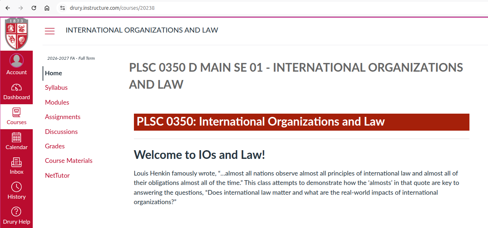
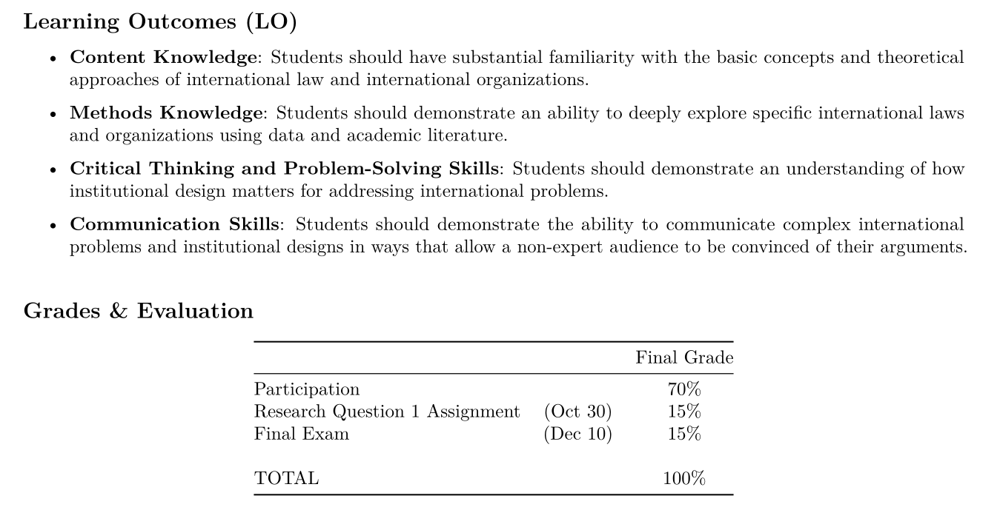
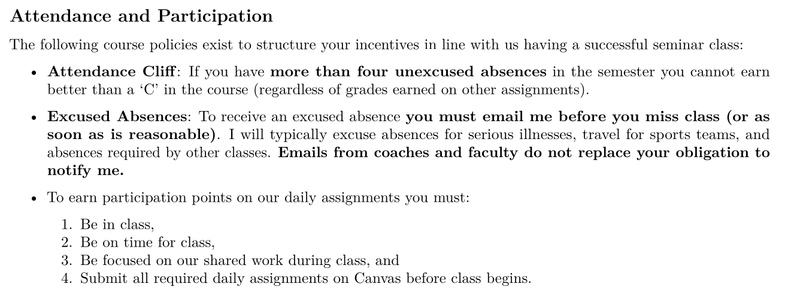
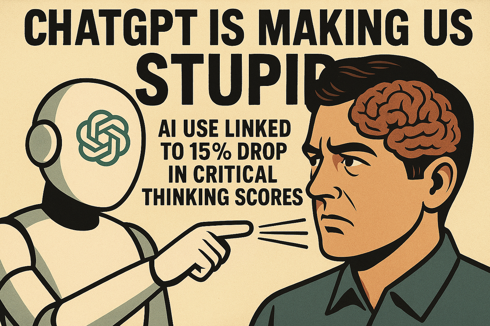
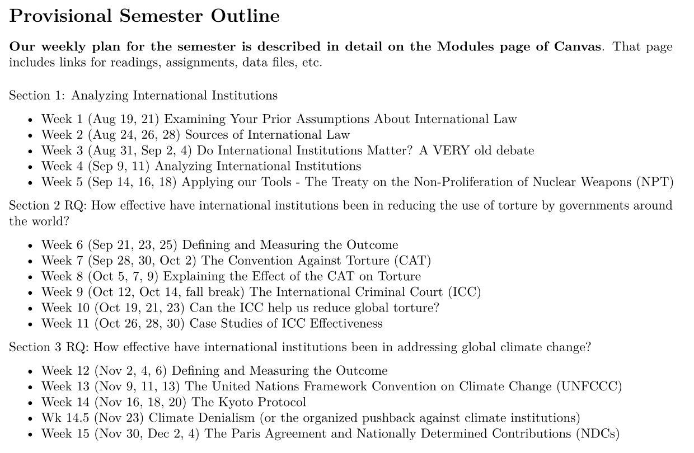

## Today's Agenda {background-image="./Images/background-scales_justice_v3.png" .center}

```{r}
# background-size="1920px 1080px"
library(tidyverse)
library(readxl)
```

<br>

::: {.r-fit-text}

**International Organizations and Law (PLSC 350)**

- Unpacking your prior assumptions about international politics

:::

<br>

<br>

::: r-stack
Justin Leinaweaver (Fall 2026)
:::

::: notes

Prep for Class

1. OPEN RStudio (class 14-3?): Save list of "things that should be against international law" from roll call for end of term so we can re-evaluate them

2. Bring markers x 6

<br>

Welcome to PLSC 350: International Organizations and Law

- **Is everybody in the right place?**

<br>

Today I want to set up our plan for the semester and get a sense of what you think of when you think of "international law"

<br>

**SLIDE**: First things first, introductions!

:::


## Introductions {background-image="./Images/background-scales_justice_v3.png" .center}

1. Name

2. Year in school

3. Major

::: {.fragment}

4. What is an act by an [**individual**]{style="color:blue;"} or a [**state**]{style="color:blue;"} that [**should**]{style="color:red;"} be [**against**]{style="color:red;"} international law?

:::

::: notes

I'm Dr. Leinaweaver.

- 15th year at Drury

- Political scientist

- Research interests: international policy with a focus on environmental politics

<br>

Your turn!

- Name, year, major, and...

- **REVEAL** prompt

- DON'T google this! I want to know what YOU think!

- *Track Responses ON BOARD: Discuss each and ask "How confident are you that this is already against international law?"*

- *SAVE THIS LIST FOR FINAL WEEK DISCUSSIONS?*

<br>

*Split class into small groups (5 groups of 4 = 20 or 6 groups of 3)*

- Go sit with your group and introduce yourselves

<br>

**SLIDE**: Ok, let's talk big picture with some very easy questions!

:::


## {background-image="Images/background-scales_justice_v3.png" .center}

**"Politics" Defined**

::: {.fragment}

- Decision-making in a community

- How we make and enforce "the rules" (e.g. laws, norms, etc)

- Who gets what, when and how?

:::

<br>

:::: {.fragment}

**"International" Defined**

::: {.fragment}

- 'Inter' meaning "between" or "among"

- 'National' meaning pertaining to a whole nation, country, people, etc 

::::

:::

::: notes

**What do we study in political science?**

- **In other words, and without googling it, define politics for me**

- (**REVEAL**)

<br>

**REVEAL: And what does the word "international" mean in "international law"?**

- (**REVEAL**)

<br>

SO, our focus in this class is on all of these things we label as politics happening between and among groups beyond traditional territorial borders.

<br>

If our aim is to explain international politics then we will need theory

- And a great starting point for theory is thinking about the actors in the system who are making the decisions we are interested in!

- **SLIDE**: Groups prompt 1

:::


## {background-image="./Images/background-scales_justice_v3.png" .center}

### Who are the key actors in international politics? 

- **Who** are making the decisions with **the most significant international impacts**?

::: notes

So, let's move towards theory!

<br>

GROUPS, make me a list of the primary actors in international politics!

- Who are the key decision-makers we need to focus on in order to understand international law?

<br>

**Does the prompt make sense? Do you understand what I'm looking for?**

- Go!

<br>

*ON BOARD: Report Back and discuss each*

- *Encourage them to disaggregate BIG groups into more coherent groups*

- *States broken into democracies vs dictatorships AND rich vs poor*

- *"Corporations" broken into primarily exporters vs importers*

- *"NGOs" broken down into public goods focused (Amnesty Intl) vs private goods focused (OPEC)*

- *"IOs": Name some!*

<br>

Next step, groups, select ONE of the actors on the board (no overlap) and focus on them

- **SLIDE**: The actor prompts

:::


## {background-image="./Images/background-scales_justice_v3.png" .center}

### The Key Actors in International Politics

::: {.incremental}

1) What is the primary thing your actor wants from the international community?

2) What is the primary obstacle standing between your actor and their goal above?

3) What is your actor's biggest fear from working with the international community?

4) Generally speaking, how risky is it for your actor to increase its cooperation with international organizations and treaties? 

:::

::: notes

GROUPS, I'm going to give you a series of prompts

- Your job is to briefly answer each of them for your chosen actor

- Work directly on the board!

<br>

**REVEAL** x 4

<br>

*PRESENT and DISCUSS each*

<br>

**Take all of this on board and then tell me, what does all of this suggest is true when thinking about international law?**

- **Do all the key actors have the same goals? The same fears?**

<br>

Imagine trying to make rules in your local community but:

1. You need the buy-in of EVERY person who lives near you

2. You cannot force anyone to do anything except at massive risk to you, and

3. There are almost no shared goals or priorities in the group

<br>

THAT is international politics and international law!

<br>

Hopefully, that helped frame our challenge for the semester, but it turns out this framing itself is contentious!

- **SLIDE**: Let's look at a few common definitions of international law

:::


## What is international law? {background-image="./Images/background-scales_justice_v3.png" .center}

<br>

"International law is that law that the [**wicked do not obey**]{style="color:red;"} and the [**righteous do not enforce**]{style="color:blue;"}."

--- Abba Eban (1957) 

::: notes

Quote number 1 comes from Abba Eban in 1957

- Eban was a Foreign Affairs Minister of Israel

<br>

**Is this an argument that international law "matters" or not? Why?**

- Maybe?

- Apparently not as effective for the "wicked," but the righteous might change their behavior even if they don't impose those changes on others?

<br>

**SLIDE**: Here's a different answer!

:::


## What is international law? {background-image="./Images/background-scales_justice_v3.png" .center}

<br>

"[**International law**]{style="color:red;"} is to law what [**professional wrestling**]{style="color:blue;"} is to wrestling."

--- Stephen Budiansky 

::: notes

Quote number 2 comes from Stephen Budiansky an American writer, historian and biographer

**Is this an argument that international law "matters" or not? Why?**

- Some people take professional wrestling REALLY seriously, no?

<br>

**SLIDE**: Finally, here's the answer from the course catalog and the syllabus for this class

:::


## What is international law? {background-image="./Images/background-scales_justice_v3.png" .center}

<br>

"...[**almost**]{style="color:red;"} all nations observe [**almost**]{style="color:red;"} all principles of international law and [**almost**]{style="color:red;"} all of their obligations [**almost**]{style="color:red;"} all the time."

--- Louis Henkin (1979) 

::: notes

The distinguished international legal scholar Louis Henkin famously wrote: 

"...almost all nations observe almost all principles of international law and almost all of their obligations almost all the time."

- Take a second and think about this sentence fragment.

<br>

**If this was the only thing you knew about international law, what could you say about it?**

1. (Target of the law appears to be nations. e.g. States.)

2. (International law, at least according to legal scholars, carries obligations for those states.)

3. (International law seems to matter at least some of the time.)

4. (There are some conditions when states break international law.)
    - Be a good idea to figure out what those conditions are…

<br>

By the end of the semester I think you'll have a strong grasp on exactly what these quotes mean!

- **SLIDE**: Let's wrap up today by talking about our plan for the semester and the course policies

:::


## All Class Materials are on Canvas {background-image="./Images/background-scales_justice_v3.png" .center}



::: notes

Everything you need to succeed in this class is hosted on our class Canvas page

- All the readings,

- All the assignments,

- All your grades, and

- All of our class policies are in the syllabus

<br>

Our class syllabus is the FIRST place you should go when you have questions!

- It has LOTS of the answers you need to succeed this semester

- **SLIDE**: For example

:::


## The Answer is in the Syllabus  {background-image="./Images/background-scales_justice_v3.png" .center}



::: notes

First page of the syllabus lists our learning outcomes for the semester

- The LOs are INCREDIBLY important and you should review them for ALL of your classes

- They tell you, in big picture, how the professor has designed the course

<br>

**Any questions on the LOs?**

<br>

Your final grade in this class has three main components:

1. Your daily attendance and participation makes up almost three-quarters of the grade!

    - I want to incentivize you to come to class and to do the work

2. The rest of the grade is made up of two assignments focused on demonstrating your achievement of the learning outcomes!

<br>

**Any questions on the big picture here?**

<br>

**SLIDE**: Since participation is a big deal, let's talk about it!

:::


## The Answer is in the Syllabus  {background-image="./Images/background-scales_justice_v3.png" .center}



::: notes

Everybody read these points and then let's discuss them.

<br>

**Any questions about the attendance cliff?**

- If you're not in class then I can't ensure you make progress on our LOs

<br>

**Any questions about how to request an excused absence?**

- Coaches emails DO NOT cover you!

<br>

**Any questions about the participation points policy?**

<br>

**SLIDE**: My AI policy

:::


## The Answer is in the Syllabus {background-image="Images/background-scales_justice_v3.png" .center}

{style="display: block; margin: 0 auto"}

::: notes

**Does everybody see the AI policy in the syllabus?**

<br>

You may not use any AI tools in this class. 

- Any AI use will be treated as plagiarism.

<br>

That means: 

- No AI search

- No AI summaries of articles or books

- No AI for outlining or writing

- No AI for data analysis

- No AI to simply clean up your grammar (e.g. Grammarly).

<br>

**SLIDE**: Think of this class like training to play a sport

:::


## This Course is Training for your Brain {background-image="Images/background-worldmap4.png" .center}

{style="display: block; margin: 0 auto"}

::: notes

The time you spend in the gym getting stronger and more flexible makes you a better athlete regardless of the sport you end up playing. 

- That's what we're doing in this class when we learn to critically analyze texts and become better writers.

- I'm getting you ready to succeed out in the real world

<br>

Using AI tools is like bringing a forklift into the weight room. 

- Yeah, you lifted the weights, but it was a waste of your time.

<br>

**SLIDE**: Other key point

:::


## {background-image="Images/background-worldmap4.png" .center}

{style="display: block; margin: 0 auto"}

::: notes

Lots of people are worried about AI taking their jobs

- e.g. replacing them in the workforce. 

<br>

If you use AI to do your thinking for you then you are literally replacing yourself with AI

- You are setting yourself up with skills that are basically without value

<br>

So, let's not waste this opportunity working together this semester

- Let's get stronger and be better adapted to whatever the world looks like when you graduate

<br>

**Questions on this policy?**

<br>

**SLIDE**: Plan for the semester

:::


## {background-image="Images/background-scales_justice_v3.png" .center}

{style="display: block; margin: 0 auto"}

::: notes

The subject of international law is MASSIVE and we couldn't possibly cover all of it even at only a surface level

- SO, my plan is to take you into the topic by trying to answer specific research questions

<br>

Section 1 of the class will be a crash course in what international law is and why we create it.

<br>

Section 2 will focus on the effectiveness of global efforts to reduce the use of torture by governments

- We'll focus on the Convention Against Torture and the International Criminal Court

<br>

Finally, in Section 3, we focus on the effectiveness of global efforts to address climate change

<br>

**Questions on the plan or anything from the syllabus?**

<br>

**SLIDE**: For next class

:::


## For Next Class {background-image="Images/background-scales_justice_v3.png" .center}

<br>

::: {.r-fit-text}

1. Read chapter 1 in Hathaway and Shapiro (2017)

2. Canvas Assignment: Let's start a "legal" war

:::

::: notes

Hathaway and Shapiro (2017) is an incredible piece of political history tracking the efforts after WWI of the world trying to outlaw all future wars.

- Chapter 1 will give you a crash course in the formation of modern international law and the influence of Hugo Grotius (grow-she-us)

- Then I want your help with planning an invasion...

<br>

**Questions?**

- See you next class!


:::

