## Today's Agenda {background-image="./Images/background-scales_justice_v3.png" .center}

```{r}
# background-size="1920px 1080px"
library(tidyverse)
library(readxl)
```

<br>

::: {.r-fit-text}

**International Organizations and Law (PLSC 350)**

- Plan for the semester

- Examining your priors

:::

<br>

<br>

::: r-stack
Justin Leinaweaver (Fall 2026)
:::

::: notes

Prep for Class

1. OPEN RStudio (class 14-3?): Save class priors for end of term so we can re-evaluate them

<br>

Welcome to PLSC 350: International Organizations and Law

- **Is everybody in the right place?**

<br>

Today I want to set up our plan for the semester and get a sense for what you think of when you think of "international law"

<br>

**SLIDE**: Ok, let's dive straight in to this question of prior knowledge.

:::


## {background-image="./Images/background-scales_justice_v3.png" .center}

What is an act by an [**individual**]{style="color:blue;"} or a [**state**]{style="color:blue;"} that would clearly be [**against international law**]{style="color:red;"}?

::: notes

Introduce yourself to the people around you and make me a list

- Don't Google this!

- Let's get a sense of your "prior knowledge" concerning international law.

- Don't worry if you don't have clear prior knowledge, let's just talk through our intuitions.

<br>

*ON BOARD (column 1 of 3?)*: "International Crimes"

**Ok, what did you come up with?**

- SHARE and DISCUSS
    - SAVE this LIST for 14-3!

<br>

**SLIDE**: Hold that thought!

:::


## {background-image="./Images/background-scales_justice_v3.png" .center}

:::: {.columns}
::: {.column width="50%"}
**Introductions**
:::

::: {.column width="50%"}
1. Name

2. Year in school

3. Major

4. Any experience reading laws?
:::
::::

::: notes

I'm Dr. Leinaweaver.

- 12th year at Drury

- Political scientist

- Research interests: international politics, environmental politics and bargaining / negotiations.

<br>

**Your turn!**

+ Name, year, major and do you have any experience reading/studying laws (domestic or international)?

<br>

**SLIDE**: Clearly we have some work to do this semester to get everyone up to speed on international law and international organizations!

:::


## Learning Outcomes {background-image="./Images/background-scales_justice_v3.png" .center}

**Content Knowledge**: Basic concepts and theoretical approaches of international institutions

**Methods Knowledge**: Explore international institutions with data and literature

**Critical Thinking/Problem-Solving**: Examine how institutional design matters for solving problems

**Communication Skills**: Clear communication
]

::: notes

The syllabus has the full details on these but here is the heart of each.

- The LOs guide my design of the semester, my plan for each class, the pedagogies we use in class and the design of each assignment.

- By "international institution" I'm including both laws and organizations

<br>

**Any questions on the LOs?**

<br>

**SLIDE**: I've broken the semester into four sections. 

- Let's step through them so you can see where we're going

:::


## Section 1 {background-image="./Images/background-scales_justice_v3.png" .center}

The Basics of Analyzing International Institutions

::: notes

Section 1 of the class, our first four weeks, will focus on baseline concepts, the models and the tools we'll need this semester.

<br>

What does that actually mean?

- Let me answer that question with a couple more questions to measure our prior knowledge!

<br>

**SLIDE**

:::


## Key Assumptions {background-image="./Images/background-scales_justice_v3.png" .center}

What do states want from the international community?]

::: notes

Talk to the people around you and build me a list!

<br>

*ON BOARD (column 2)*: "States want..."

- SHARE and DISCUSS
    - SAVE this LIST for 14-3!

<br>

**How would you rank these from the most important items to the least? Why?**

- **Any big differences in our rankings? Why or why not?**

:::


## Key Assumptions {background-image="./Images/background-scales_justice_v3.png" .center}

When do states act on the international level?

::: notes

Ok, let's do this one more time!

**When do states act on the international level?**

- **In other words, what specific conditions motivate state action?**

<br>

Talk to the people around you and build me a list!

<br>

*ON BOARD (column 3)*: "States act when..."

- SHARE and DISCUSS
    - SAVE this LIST for 14-3!

<br>

**How would we rank these from the most important items to the least?**

- **Any big differences in our rankings? Why or why not?**

:::


## {background-image="./Images/background-scales_justice_v3.png" .center}

**What are your priors re: international law?**

1. What do states want from the international community?

2. When do states act on the international level?

::: notes

The question for us this semester is, should international law or international organizations be on either of these lists?

- In other words, does international law matter for understanding international politics?

<br>

**SLIDE**: In an effort to help us better understand what international law is, let's examine three well-known quotes.

:::


## What is international law? {background-image="./Images/background-scales_justice_v3.png" .center}

"International law is that law that the [**wicked do not obey**]{style="color:red;"} and the [**righteous do not enforce**]{style="color:blue;"}."

--- Abba Eban (1957) 

::: notes

Quote number 1 comes from Abba Eban in 1957

- Eban was a Foreign Affairs Minister of Israel

<br>

**Is this an argument that international law "matters" or not? Why?**

- Maybe?

- Apparently not as effective for the "wicked," but the righteous might change their behavior even if they don't impose those changes on others?

<br>

**SLIDE**: Here's a different answer!

:::


## What is international law? {background-image="./Images/background-scales_justice_v3.png" .center}

"[**International law**]{style="color:red;"} is to law what [**professional wrestling**]{style="color:blue;"} is to wrestling."

--- Stephen Budiansky 

::: notes

Quote number 2 comes from Stephen Budiansky an American writer, historian and biographer

**Is this an argument that international law "matters" or not? Why?**

- Some people take professional wrestling REALLY seriously, no?

<br>

**SLIDE**: Finally, here's the answer from the course catalog and the syllabus for this class

:::


## What is international law? {background-image="./Images/background-scales_justice_v3.png" .center}

"...[**almost**]{style="color:red;"} all nations observe [**almost**]{style="color:red;"} all principles of international law and [**almost**]{style="color:red;"} all of their obligations [**almost**]{style="color:red;"} all the time."

--- Louis Henkin (1979) 

::: notes

The distinguished international legal scholar Louis Henkin famously wrote: 

"...almost all nations observe almost all principles of international law and almost all of their obligations almost all the time."

- Take a second and think about this sentence fragment.

<br>

**If this was the only thing you knew about international law, what could you say about it?**

1. (Target of the law appears to be nations. e.g. States.)

2. (International law, at least according to legal scholars, carries obligations for those states.)

3. (International law seems to matter at least some of the time.)

4. (There are some conditions when states break international law.)
    - Be a good idea to figure out what those conditions are…

<br>

In sum Section 1 of our class will be focused on helping you develop the tools you need to analyze this challenge

- By the end of the semester I think you'll have a strong grasp on exactly what these quotes mean!

:::


## Section 2 {background-image="./Images/background-scales_justice_v3.png" .center}

International Institutions for Mutual Restraint

(e.g. agreeing what states ought not to do)]

::: notes

Section 2 of the class, our next five weeks, will focus on international institutions designed to stop states from doing something.

<br>

**SLIDE**: What does international law designed to stop state behavior look like?

:::


## {background-image="./Images/background-scales_justice_v3.png" .center}

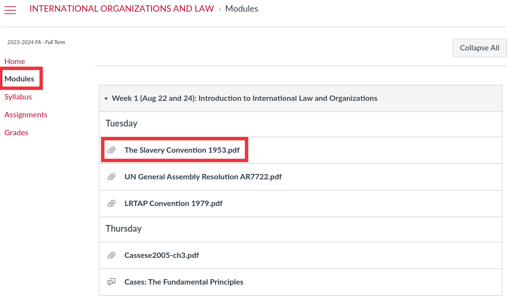

::: notes

Everybody got to our class Canvas page in the Modules section and open up the 1953 Slavery Convention.

- This is an international treaty that aimed to end slavery around the world.

- Let's briefly skim through this treaty to highlight a few lessons that come up time and again in every treaty

:::


## {background-image="./Images/background-scales_justice_v3.png" .center}

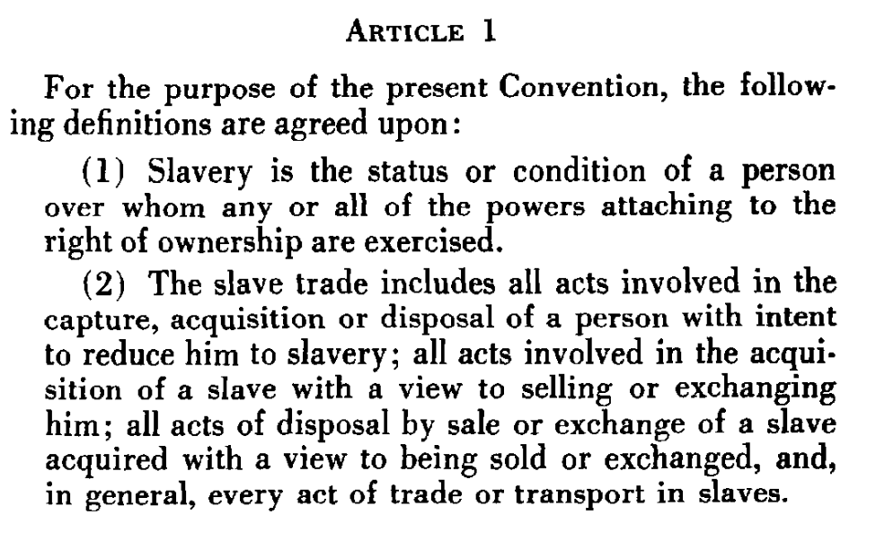

::: notes

**How clear is the definition of slavery included in Article 1 (p3)?**

<br>

**Any wiggle room here to eliminate slavery but keep a class of people essentially as slaves?**

:::


## {background-image="./Images/background-scales_justice_v3.png" .center}

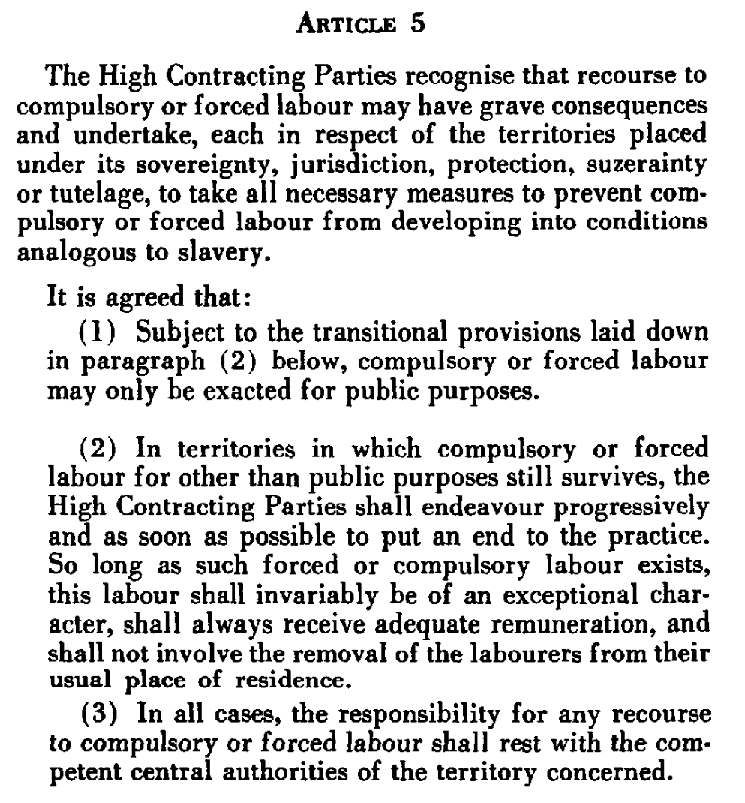

::: notes

**Jump to Article 5 (p4) and tell me what the slavery definition explicitly does NOT include?**

- (Forced labor as punishment, e.g. prison labor)

<br>

**Any guesses why?**

:::


## {background-image="./Images/background-scales_justice_v3.png" .center}

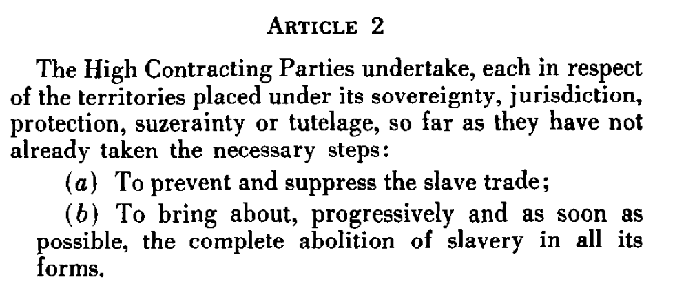

::: notes

**How strong are the obligations for each state in Article 2? How hard would it be to tell if a state participant in the treaty was complying or not?**

:::


## {background-image="./Images/background-scales_justice_v3.png" .center}

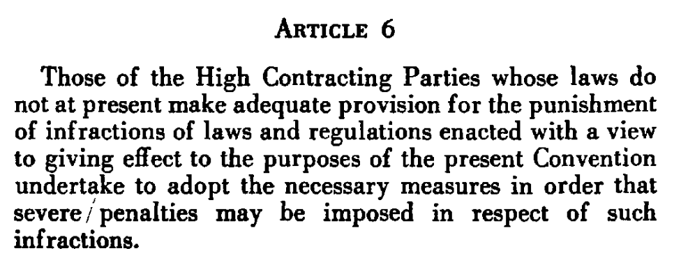

::: notes

**Jump to Article 6 (p4) and tell me, what are the punishments for states who participate in the treaty but don't eliminate slavery in their territory?

:::


## Section 2 {background-image="./Images/background-scales_justice_v3.png" .center}

International Institutions for Mutual Restraint

(e.g. agreeing what states ought not to do)]

::: notes

These questions of definition, obligation and punishment are going to be key for us as we evaluate treaties designed to stop states from doing something specific in the world.

- e.g. Section 2 of the class!

- In class we'll dig deeply into efforts to stop the spread of nuclear weapons and the violation of human rights

:::


## Section 3 {background-image="./Images/background-scales_justice_v3.png" .center}

International Institutions for Coordination 

(agreeing what states ought to do)]

::: notes

Section 3 of the class, over three weeks, will analyze international institutions designed to set standards or rules for states.

- **SLIDE**: Everybody now open the UN General Assembly resolution on the use of the death penalty.

:::


## UN General Assembly Resolution 77/222 {background-image="./Images/background-scales_justice_v3.png" .center}

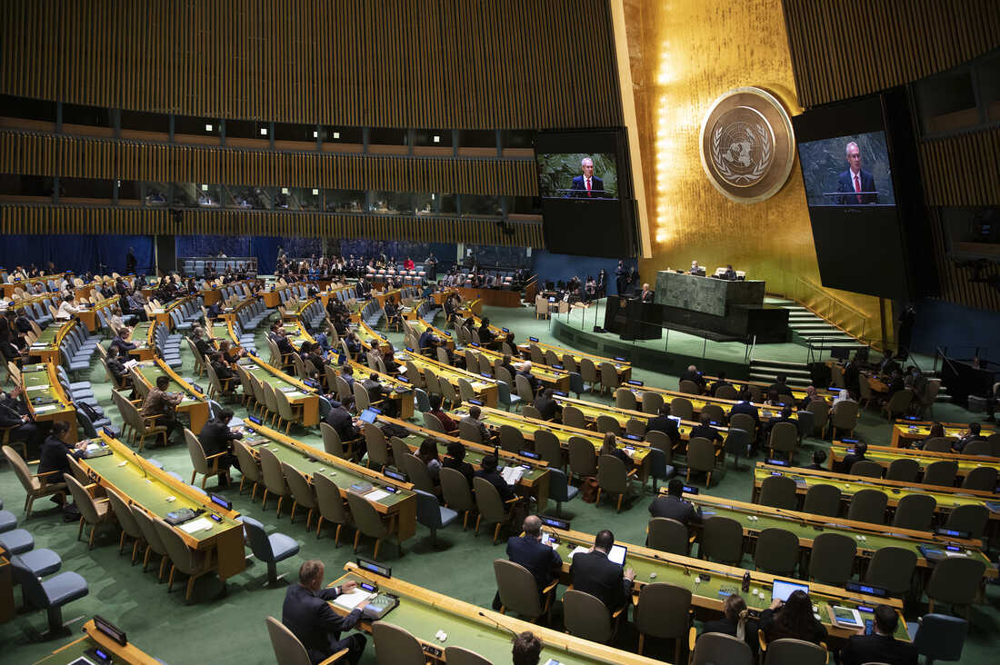

::: notes

**Everybody now skim through the text of this resolution and tell me how this compares and contrasts with the slavery treaty we were just discussing.**

- (VERY long preamble setting the stage)

- (Sentence 1 starts with a reaffirmation of sovereignty, e.g. the right for states to make their own decisions)

- (MUCH weaker language e.g. "welcomes", "calls upon", "encourages" and "requests")

<br>

**Focus on section 7, how strong are the obligations in this resolution?**

<br>

**Any punishments here for states that choose to not do these things?**

- (Nope!)

<br>

I hope this very brief review of a UN GA resolution shows you just how different this form of international law is to something like a full treaty!

- Section 3 of the class we will dig into the United Nations and the CEDAW treaty which deals with discrimination against women

:::


## Section 4 {background-image="./Images/background-scales_justice_v3.png" .center}

International Institutions for Aggregate Effort 

(outcomes that depend on the combined efforts of all states)]

::: notes

The final section of the class will analyze international institutions designed to solve problems that need states to take actions working together.

- In class we will examine a series of treaties designed to address global climate change.

<br>

Everybody open the Convention on Long-Range Transboundary Air Pollution from 1979.

- This is a treaty designed to reduce air pollution, primarily in Europe.

:::


## {background-image="./Images/background-scales_justice_v3.png" .center}

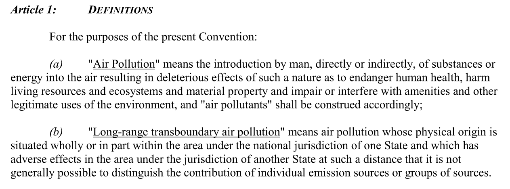

::: notes

**How thorough is the definition of pollution in Article 1? How does it compare to the slavery definition?**

- (WAY more precise)

:::


## {background-image="./Images/background-scales_justice_v3.png" .center}

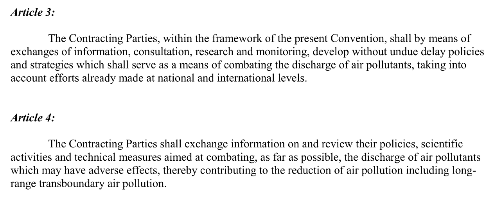

::: notes

This treaty has been remarkably successful and I think part of that is due to the obligations in the treaty.

<br>

**Read Articles 3 and 4 and tell me what this treaty was designed to do.**

- (Promote information collection and data sharing BOTH on pollution AND on policy effectiveness around the world)

<br>

Much of the rest of this convention is built around fostering cooperation through assistance and support.

- All designed to get countries to take the problem more seriously and to be more transparent in addressing them.

:::


## Semester Plan of Attack {background-image="./Images/background-scales_justice_v3.png" .center}

1. Basics of Analyzing International Institutions

2. International Institutions for Mutual Restraint

3. International Institutions for Coordination

4. International Institutions for Aggregate Effort

::: notes

Ok, so that's our plan of attack.

- **Any questions on the structure of the semester?**

:::


## Course Grade {background-image="./Images/background-scales_justice_v3.png" .center}

```{css, echo=F}
/* Change the background color to white for shaded rows (even rows) */
.remark-slide thead, .remark-slide tr:nth-child(2n) {
      background-color: white;
}
```

```{r}
tibble(
  col1 = c("Participation", "Papers", "- Treaty Design Analysis", "- IO Design Analysis", "- Reform Proposal", "Total"),
  col2 = c("", "", "(Sep 22)", "(Oct 27)", "(Final Exam)", ""),
  col3 = c(30, 70, rep("", 3), 100)
) |>
  kableExtra::kbl(align = c("l", "c", "c"), col.names = c("", "", "%")) |>
  kableExtra::kable_styling(font_size = 43) |>
  kableExtra::column_spec(1, width = "14em") |>
  kableExtra::column_spec(2, width = "7em") |>
  kableExtra::row_spec(c(0, 6), bold = TRUE, background = "#b3ccff")

```

::: notes

Course Grade

Heavy on the participation!

Definitely a seminar, not a lecture.

:::


## Attendance Cliff {background-image="./Images/background-scales_justice_v3.png" .center}


::: notes

My attendance policy is simple.

The only way I can ensure everyone makes progress on the LOs is by being in class and doing the work.

- This means I have to make sure you are here!

<br>

To help encourage you I use an attendance cliff.

- Anyone with more than THREE unexcused absences in the semester cannot earn higher than a ‘C’ in the course

- Regardless of grades earned on other assignments.

<br>

**Questions on this?**

:::


## {background-image="Images/background-scales_justice_v3.png" .center}

{style="display: block; margin: 0 auto"}

::: notes

You may not use any AI tools in this class. Any AI use will be treated as plagiarism.

<br>

That means: 

- No AI search

- No AI summaries of articles or books

- No AI for outlining or writing

- No AI for data analysis

- No AI to simply clean up your grammar (e.g. Grammarly).

<br>

Think of this class like training to play a sport

- The time you spend in the gym getting stronger and more flexible makes you a better athlete regardless of the sport you end up playing. 

- That's what we're doing in this class when we learn to critically analyze texts and become better writers.

- I'm getting you ready to succeed out in the real world

- Using AI tools is like bringing a forklift into the weight room. Yeah, you lifted the weights, but it was a waste of your time.

<br>

Other key point: Lots of people are worried about AI taking their jobs, e.g. replacing them in the workforce. 

- If you use AI to do your thinking for you then you are literally replacing yourself with AI

- You are setting yourself up with skills that are basically without value

<br>

So, let's not waste this opportunity working together this semester

- Let's get stronger and be better adapted to whatever the world looks like when you graduate

<br>

**Questions on this policy?**

<br>

**SLIDE**: Next class

:::


## {background-image="Images/background-scales_justice_v3.png" .center}

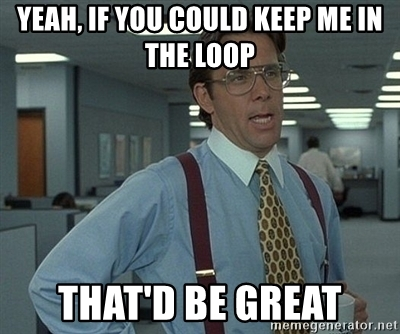{style="display: block; margin: 0 auto"}

::: notes

What if you have an excused absence coming up?

- It is your responsibility to email me **BEFORE** the absence in order to receive a make-up assignment.

- Easy peasy

<br>

This is also the place where I say to you, whatever is going on that might keep you out of class, please keep me in the loop. 

- I genuinely want you to make progress on our learning outcomes

<br>

So, if things are getting rough for you please come talk to me.

**I will always offer you flexibility in the face of struggle IF YOU COME TO ME BEFORE DEADLINES HAVE PASSED!**

- **Fair enough?**

:::


## {background-image="Images/background-scales_justice_v3.png" .center}

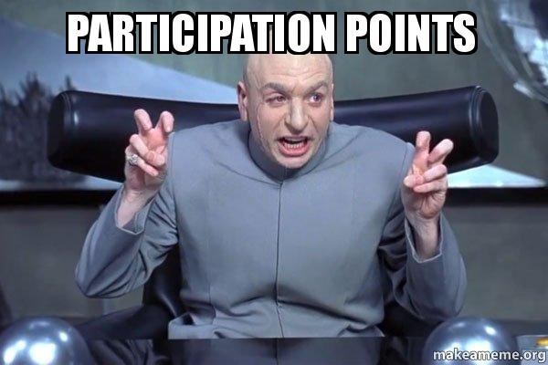{style="display: block; margin: 0 auto"}

::: notes

Ok, so I've got you coming to class now how do I make sure you're engaged?

- Participation points!

<br>

Basically, if you:

- Get to class on time,

- Have the materials you need to work, and

- Submit all daily required assignments BEFORE class,

<br>

**Questions on this?**

:::


## {background-image="Images/background-scales_justice_v3.png" .center}

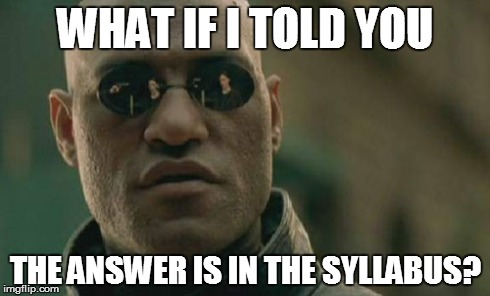{style="display: block; margin: 0 auto"}

::: notes

Your first job is to download the syllabus from Canvas and read it carefully.

It includes detail on everything you need to know.

- Assignment deadlines
- Readings
- Drury policies
- Office hours

ALSO, I can see who downloaded it, so don’t delay!

<br>

We'll be using Canvas for submitting assignments, posting to the discussions and accessing the class readings.

- Let me know if you have trouble accessing our materials on Canvas.

:::


## {background-image="Images/background-scales_justice_v3.png" .center}

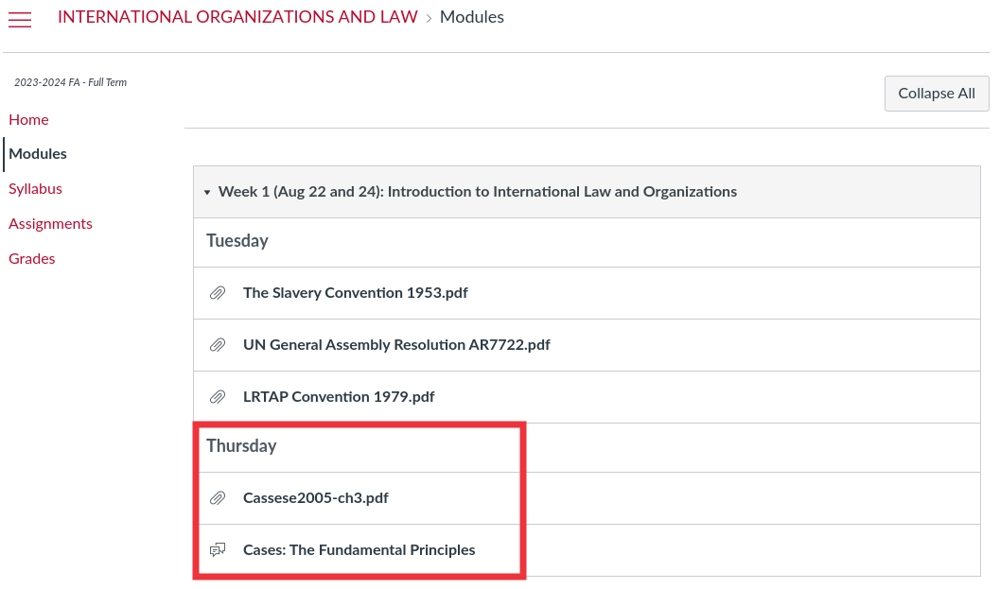{style="display: block; margin: 0 auto"}

::: notes

Speaking of Canvas!

- ALL of the assigned readings and daily assignments are available on Canvas in the "Modules" section.

- I have organized the Modules by week of the semester to mirror the structure of the syllabus

<br>

The syllabus includes many web links, but if they don't work I have uploaded backups onto Canvas.

- ALL of the assigned readings should be on Canvas

- Please let me know BEFORE class if you ever can't find an assigned reading.

<br>

Here you can see your assignment for next class

- The Cassese chapter introduces these seven-ish fundamental principles.

- In class I want us to evaluate and debate whether or not we believe these are "fundamental" or not.

<br>

**SLIDE**: Assignment details

:::


## {background-image="Images/background-scales_justice_v3.png" .center}

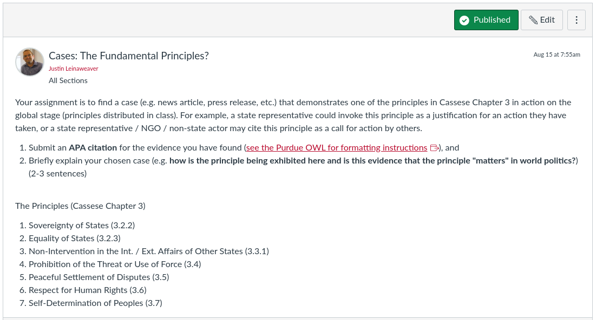{style="display: block; margin: 0 auto"}

::: notes

*Assign the students to the seven principles*

1. Sovereignty of States (3.2.2)
2. Equality of States (3.2.3)
3. Non-Intervention in the Int. / Ext. Affairs of Other States (3.3.1)
4. Prohibition of the Threat or Use of Force (3.4)
5. Peaceful Settlement of Disputes (3.5)
6. Respect for Human Rights (3.6)
7. Self-Determination of Peoples (3.7)

<br>

Your job is to find a case that demonstrates your assigned principle in action on the international stage. 

Examples

- A state representative invokes this principle as a justification for an action they have taken

- A state representative, an NGO or a non-state actor may cite this principle as a call for action by others. 

<br>

1. Submit an APA citation for the news article / evidence you have found (see the Purdue OWL for formatting instructions)

2. Briefly explain your chosen case (e.g. how is the principle being exhibited here and is this evidence that the principle "matters" in world politics?) (2-3 sentences)

<br>

**Questions on the assignment?**

- You have to read the whole chapter, but you only find evidence for one of the principles in action!

:::

