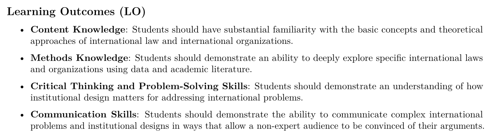
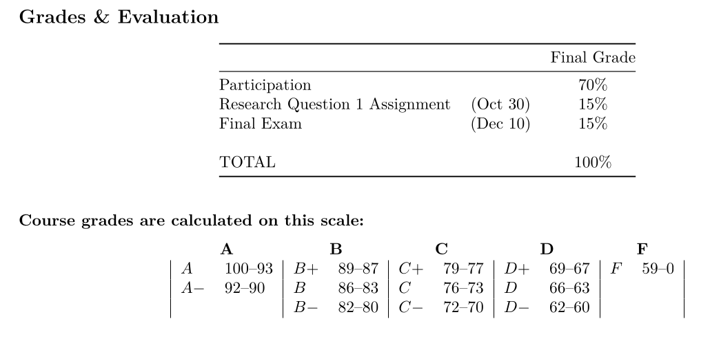
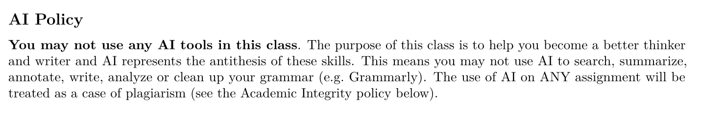
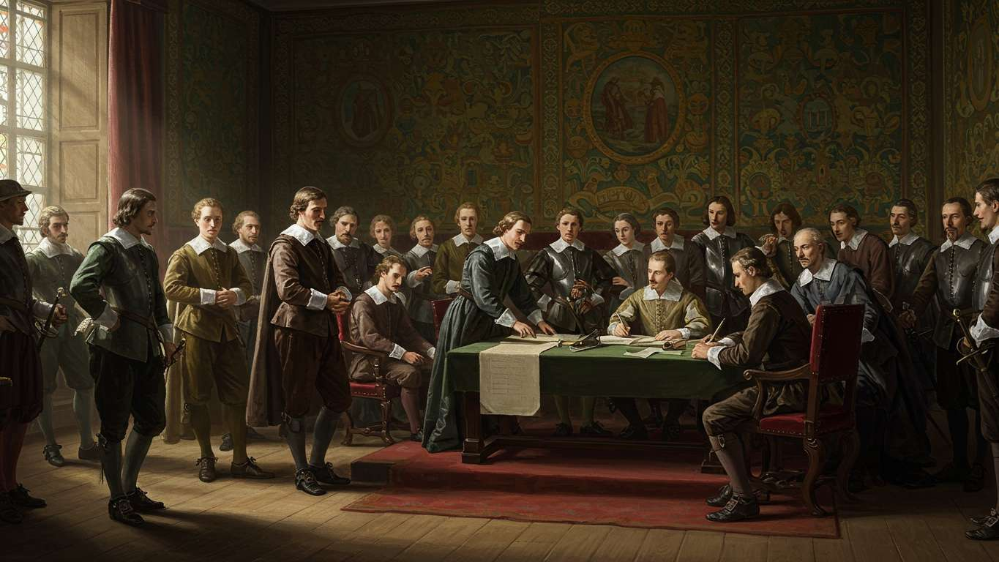
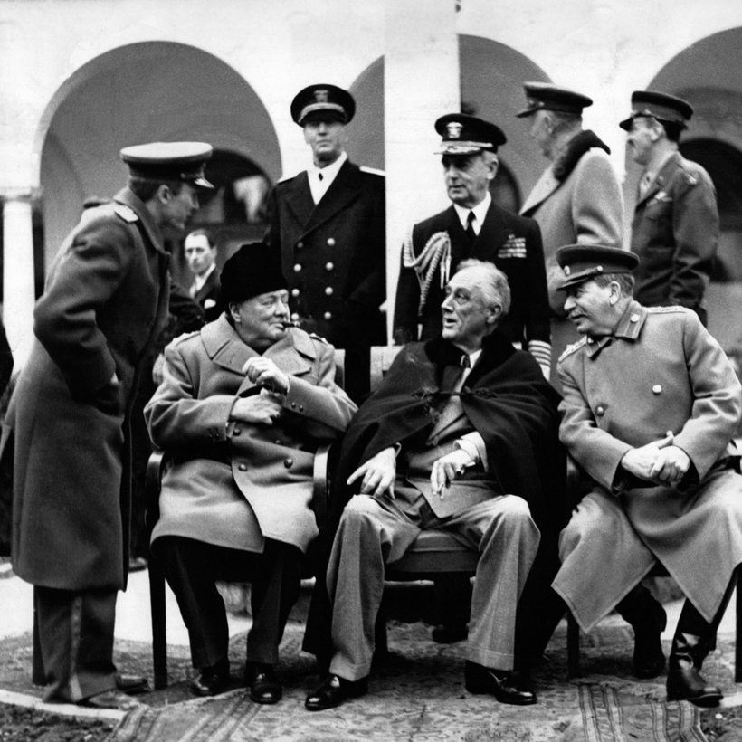
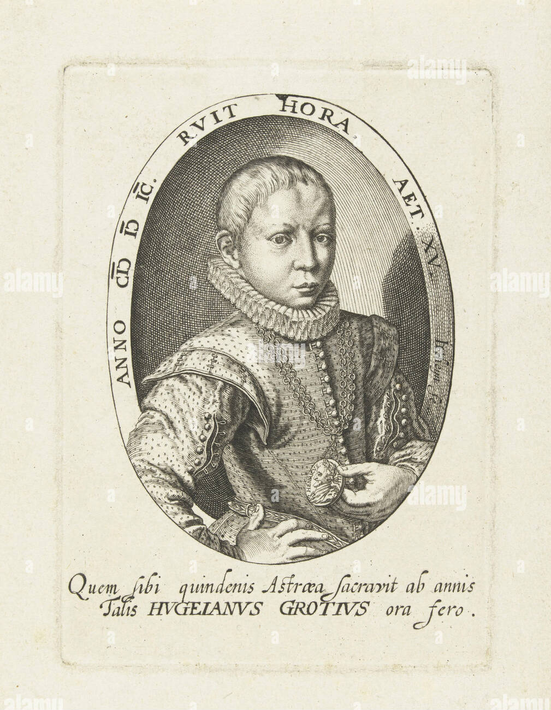
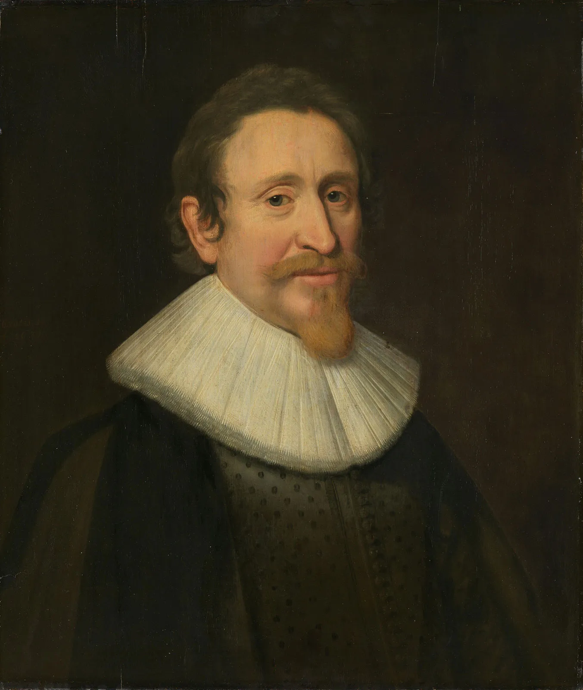
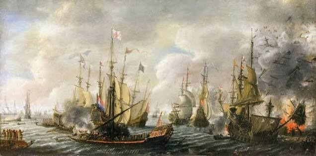
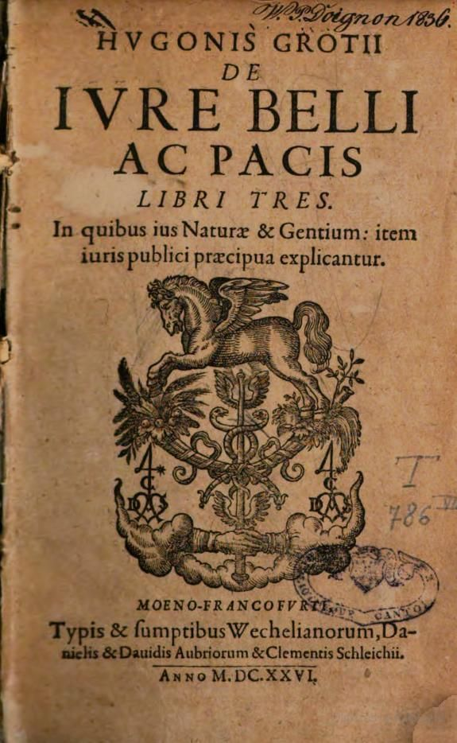

## Today's Agenda {background-image="./Images/background-scales_justice_v3.png" .center}

```{r}
# background-size="1920px 1080px"
library(tidyverse)
library(readxl)
```

<br>

**Section 1: Analyzing International Institutions**

<br>

**Examining Your Prior Assumptions About International Law**

- Hugo Grotius, the Old World Order and your prior assumptions

<br>

::: r-stack
Justin Leinaweaver (Fall 2026)
:::

::: notes

**Prep for Class**

1. Check Canvas submissions and record participation 

2. Bring lots of markers!

3. Bring physical copy of the Hathaway and Shapiro book

<br>

Welcome back everybody.

- **SLIDE**: Before we dig in, let's check in on the plan for the semester

:::


## The Answers are in the Syllabus {background-image="Images/background-scales_justice_v3.png" .smaller}

<br>

::: {.panel-tabset}

### LOs



### Final Grades



### Participation


### NO AI



:::

::: notes

**Any questions on the course, its structure or the policies in the syllabus?**

<br>

**SLIDE**: Refresher from last class!

:::


## Last Class {background-image="./Images/background-scales_justice_v3.png" .center}

<br>

### What does it mean to study "international politics"?

- What is 'politics'?

- What is 'international'? 

::: notes

Ok, refresh my memory from last class

- **What does it mean to study "international politics"?**

<br>

"Politics" Defined

- Decision-making in a community
- How we make and enforce "the rules" (e.g. laws, norms, etc)
- Who gets what, when and how?

<br>

"International" Defined

- 'Inter' meaning "between" or "among"
- 'National' meaning pertaining to a whole nation, country, people, etc

<br>

SO, our focus in this class is on all of these things we label as politics happening between and among groups beyond traditional territorial borders.

<br>

BUT, more than that, our focus is on explaining how international politics produces laws that bind all the actors in the global system

- **SLIDE**

:::


## Last Class {background-image="./Images/background-scales_justice_v3.png" .center}

<br>

### Why is it so hard to produce international laws that bind all actors in the global system?

::: notes

Last class we spent time identifying and unpacking your intuitions about various key decision-makers in the international political realm

- **Put those discussions together for me and explain, why is it so difficult to create international laws?**

<br>

- (No absolute supranational authority to enforce contracts or adjudicate disputes)

- (Huge variance in the interests of the actors at play)

    - (In domestic politics we usually tackle problems everyone agrees on: we need a shared national defense, schools, roads, etc)

- (For states: International cooperation means ceding sovereignty which is risky)

- (For non-state actors: International cooperation means ceding control or being bound to rules you may oppose)

<br>

**SLIDE**: And yet, the international community has been overcoming these challenges for hundreds of years!

:::


## {background-image="./Images/background-scales_justice_v3.png"}

{.absolute top=0 width="550"}

{.absolute bottom=0 width="550"}

{.absolute right=0 width="400" top=0}

{.absolute right=0 width="400" bottom=0}

::: notes

**Anybody recognize any of these very famous treaty signature ceremonies?**

- (top-left: the Peace of Westphalia in 1648 saw the signing of a series of treaties that ended the Thirty Years' War, the Eighty Years' War and is widely considered the foundation of the modern state system which established state sovereignty)

- (bottom-left: The Treaty of Versailles in 1919 ends WWI)

- (top-right: The Yalta Conference in 1945 is where the allied powers decided how Europe would be re-organized after the Nazis were defeated)

- (bottom-right: The Intermediate-Range Nuclear Forces (INF) Treaty was a 1987 arms control agreement between the US and the Soviets to ban an entire class of nuclear weapons: ground-launched ballistic and cruise missiles with ranges of 500 to 5,500 kilometers)

<br>

And this is the puzzle of our semester

- Not just to learn what international laws do, but also how a global community creates them!

<br>

**SLIDE**: To set this up I assigned you a chapter from a REALLY wonderful book


:::


## Hugo Grotius (1583-1645) {background-image="./Images/background-scales_justice_v3.png"}

{.absolute left=75 width="400"}

{.absolute right=75 width="450"}

::: notes

**Big picture, did you enjoy the reading?**

- **New information for you?**

<br>

**Tell me about Hugo Grotius, the so-called father of international law**

- **What did you learn about him?**

- (Picture on the left is when he was 15)

- (Interesting details about him, sounds like an unpleasant fellow to be around)

- (Child prodigy fascinated by his own ability to talk and frequently in latin... A bit of a blowhard?)

- (Also, his views of international relations HEAVILY informed by self-interested arguments in defense of his family, his personal economic interests and his personal views of morality and religion)

- Grotius may have been the living embodiment of the famous Upton Sinclair quote: "It is difficult to get a man to understand something, when his salary depends on his not understanding it."

<br>

**SLIDE**: The initiating incident

:::


## {background-image="./Images/background-scales_justice_v3.png"}

::: {.r-fit-text}
**The Dutch Capture of the Santa Catarina (1603)**
:::



::: notes

**Ok, so what kicked off Grotius' professional career?**

- **What happened in 1603 and why did Van Heemskerck need a defense lawyer?**

<br>

- The set-up: 1603, the Dutch attack and capture a massive Portugese ship (The Santa Catarina) then bring it back to the Netherlands. The Dutch captain, Van Heemskerck, and his employer, the Dutch East India Company file a domestic lawsuit with the Dutch Admiralty Board to lay claim to the ship and its cargo. The lawsuit alleges Portugese atrocities against the Dutch who were simply trying to trade as justification for taking the ship. The Admiralty Board sends out notices inviting claimants wishing to challenge the claims in the suit, but the Portugese owners of the Santa Catarina are half a world away and never appear. So, the Dutch win the ship and auction it off at a MASSIVE profit!

- This made the investors in the Dutch East India Company nervous (they didn't think they were funding piracy) and the decision of the Admiralty Board was "a jumble", SO the Board hires Hugo Grotius (a child prodigy) to write up a better defense! Grotius was ambitious as hell and the Dutch captain was a cousin of his so all the more reason to take on this challenge!

-  Key problem: Making the case that Van Heemskerck is not a pirate.

- Grotius takes two years to write (and two more to revise) and produces 500 pages of argument on the laws of war (163 folios in latin)

<br>

**SLIDE**: Let's jump past the unpublished manuscript and go to his main work...

<br>

*Notes on the Unpublished Defense*

- Grotius argues that "war is a morally acceptable way to prevent or remedy the violation of rights" (p10).
- "Armed execution against an armed adversary is designated by the term 'war.' A war is said to be 'just' if it consists in the execution of a right, and 'unjust' if it consists in the execution of an injury" (p10).
- Grotius was building upon "just war theory" which has a very long historical tradition
- Grotius was essentially reframing war in the terms of a lawsuit. Lawsuits are used when you have a cause of action and need to correct the bad outcome. War is the same. Casus belli could include self defense, punishment of crimes, collection of debts, defense of one's property
- So long as the war meets Grotius' test of "just" then the property seized in war belongs to the victor.
- If courts are unavailable, then war is your next option to redress a grievance. "War is a substitute for courts..., because courts are the original substitutes for war" (p11) 
- The right to "private war": The "law of nature" grants all individuals the private right to defend life and property, enforce their agreements and punish crimes with violence
- In domestic terms, individuals have transferred their rights to "private war" to their governments, HOWEVER, this does not apply in "political vacuums" such as the high seas where sovereigns have no legal powers of enforcement.
- So, the first hurdle in arguing Van Heemskerck was not a pirate was to establish this right to "private war" beyond the territory of your sovereign. This first part of the defense was thorough and intensely legal.
- In the "second half of his defense" Grotius goes full ranty crazy-person with his "vicious screed against the Portugese". The argument therefore depended on convincing the audience that the Portugese were such monsters that Van Heemskerck's "private war" was "just".
- Interestingly, he never publishes his work in total. Just one chapter. Much debate about why, but it may be that he saw how his argument threatened international trade. His argument that you could only take property in a "just" war meant that, in the absence of widely accepted courts or internationally recognized arbiters, all property for sale by traders would be suspicious. How could you know what they obtained was obtained "justly"?
- Even worse for Grotius argument, the principle of nemo dat quod non habet held that "one cannot give that which one does not have". It doesn't matter how many hands property passes through. If some step along the chain was unjust theft then the future sales were invalid. Theft "left an indelible stain on goods" (p16)
- Prize courts could help a trader if the property was taken at sea, but no such courts existed for property taken on land. In a world without adjudication, Grotius argument would end global trade. His arguments needed revisions...
- Grotius produces a new pamphlet which is a heavily revised version of chapter 12 of his manuscript entitled "The Free Sea" in which he argues that navigation and trade on the high seas is a natural right that cannot be taken away by any power.
- Eventually Grotius annoys enough people he gets arrested for heresy and treason and is given a life sentence. He eventually escapes from jail by hiding in a large chest of dirty laundry.

:::


## Hugo Grotius and the Old World Order {background-image="./Images/background-scales_justice_v3.png"}

::::: {.columns}

:::: {.column width="70%"}

::: {.incremental}

1. ALL human beings possess the same rights

2. War is a defensible action ("moral") if used to defend your rights

3. In "formal wars" the principle is "Might is Right"

4. In "private wars" the cause must be "just" and outside state jursidiction

:::

::::

:::::

{.absolute right=0 bottom=50 width="300"}

::: notes

In 1625 Grotius publishes *The Law of War and Peace* which is a huge hit. 
- A single treatise meant to comprehensively discuss ALL aspects of war.

- A phenomenally influential text that came to define international relations for the next 300 years

<br>

**According to Hathaway and Shapiro (2017), what are the key elements of Grotius' view of war?**

- **What were the big ideas his work advanced?**

<br>

**REVEAL x 5**

1. ALL human beings possess natural law rights regardless of race, creed, religion or citizenship

    - e.g. Rights to defend themselves, own property, sign contracts, etc
    
    - Huge progressive step forward
    
2. War is a defensible action (“moral”) if used to defend your rights

    - The "right" to use war is held by BOTH states and individuals
    
    - But individuals cede this right to the state domestically

3. In “formal wars” the principle is “Might is Right”

    - If both sides in a formal war (state to state) claim their actions are "just" AND THERE IS NO SUPRANATIONAL AUTHORITY TO ADJUDICATE THE CLAIMS, let war settle the dispute. 
    
    - If you win, then you get to take the property/territory.
    
4. In “private wars” the cause must be “just” and outside state jursidiction

<br>

The bottom line is summarized on p28

- "...war is a legitimate method for sovereigns, and their chartered trading companies, to enforce rights against one another. The right to wage war, to conquer and seize booty, to destroy anything that is necessary to win all derives from this basic function of war"

<br>

**What kind of world did Grotius' work create?**

- **What were the real world implications of his ideas during the next 300 years?**

<br>

1. His progressivism was designed to justify exploitation!

    - If "heathens" can own property, then they can sell that property to the Dutch East India Company. 
    
    - If "heathens" can sign treaties, then the Company can lock up trade deals with these peoples and keep other Europeans out! 
    
    - Grotius happily pursued such monopolistic trade deals with East Indian nations!

2. LOTS of wars and conquests!

<br>

All in all, a very cool reading about a fascinating period

- **SLIDE**: Let's now bring this forward in time!

<br>

*Notes*

- Grotius defined and organized a coherent system of international relations that operated centuries (what Hathaway and Shapiro call "the Old World Order"): "The core idea that animated the old world order, as he explained it, is simple but powerful: war is a legitimate method for sovereigns, and their chartered trading companies, to enforce rights against one another. The right to wage war, to conquer and seize booty, to destroy anything that is necessary to win all derives from this basic function of war" (p28)
- The set-up: 1603, the Dutch attack and capture a massive Portugese ship (The Santa Catarina) then bring it back to the Netherlands. The Dutch captain, Van Heemskerck, and his employer, the Dutch East India Company file a domestic lawsuit with the Dutch Admiralty Board to lay claim to the ship and its cargo. The lawsuit alleges Portugese atrocities against the Dutch who were simply trying to trade as justification for taking the ship. The Admiralty Board sends out notices inviting claimants wishing to challenge the claims in the suit, but the Portugese owners of the Santa Catarina are half a world away and never appear. So, the Dutch win the ship and auction it off at a MASSIVE profit!
- This made the investors in the Dutch East India Company nervous (they didn't think they were funding piracy) and the decision of the Admiralty Board was "a jumble", SO the Board hires Hugo Grotius (a child prodigy) to write up a better defense! Grotius was ambitious as hell and the Dutch captain was a cousin of his so all the more reason to take on this challenge!
- Grotius takes two years to write (and two more to revise) and produces 500 pages of argument on the laws of war (163 folios in latin)
-  Key problem: Making the case that Van Heemskerck is not a pirate.
- Grotius argues that "war is a morally acceptable way to prevent or remedy the violation of rights" (p10).
- "Armed execution against an armed adversary is designated by the term 'war.' A war is said to be 'just' if it consists in the execution of a right, and 'unjust' if it consists in the execution of an injury" (p10).
- Grotius was building upon "just war theory" which has a very long historical tradition
- Grotius was essentially reframing war in the terms of a lawsuit. Lawsuits are used when you have a cause of action and need to correct the bad outcome. War is the same. Casus belli could include self defense, punishment of crimes, collection of debts, defense of one's property
- So long as the war meets Grotius' test of "just" then the property seized in war belongs to the victor.
- If courts are unavailable, then war is your next option to redress a grievance. "War is a substitute for courts..., because courts are the original substitutes for war" (p11) 
- The right to "private war": The "law of nature" grants all individuals the private right to defend life and property, enforce their agreements and punish crimes with violence
- In domestic terms, individuals have transferred their rights to "private war" to their governments, HOWEVER, this does not apply in "political vacuums" such as the high seas where sovereigns have no legal powers of enforcement.
- So, the first hurdle in arguing Van Heemskerck was not a pirate was to establish this right to "private war" beyond the territory of your sovereign. This first part of the defense was thorough and intensely legal.
- In the "second half of his defense" Grotius goes full ranty crazy-person with his "vicious screed against the Portugese". The argument therefore depended on convincing the audience that the Portugese were such monsters that Van Heemskerck's "private war" was "just".
- Interestingly, he never publishes his work in total. Just one chapter. Much debate about why, but it may be that he saw how his argument threatened international trade. His argument that you could only take property in a "just" war meant that, in the absence of widely accepted courts or internationally recognized arbiters, all property for sale by traders would be suspicious. How could you know what they obtained was obtained "justly"?
- Even worse for Grotius argument, the principle of nemo dat quod non habet held that "one cannot give that which one does not have". It doesn't matter how many hands property passes through. If some step along the chain was unjust theft then the future sales were invalid. Theft "left an indelible stain on goods" (p16)
- Prize courts could help a trader if the property was taken at sea, but no such courts existed for property taken on land. In a world without adjudication, Grotius argument would end global trade. His arguments needed revisions...
- Grotius produces a new pamphlet which is a heavily revised version of chapter 12 of his manuscript entitled "The Free Sea" in which he argues that navigation and trade on the high seas is a natural right that cannot be taken away by any power.
- Eventually Grotius annoys enough people he gets arrested for heresy and treason and is given a life sentence. He eventually escapes from jail by hiding in a large chest of dirty laundry.
- In 1625 he publishes The Law of War and Peace which is a huge hit. A single treatise meant to comprehensively discuss all aspects of war. Given that war was defensible only if rights were threatened, Grotius attempted to catalog EVERY right belonging to individuals (since that list would be needed to adjudicate the justness of war). 
- One innovation is that in the book he expounds on the natural rights of ALL individuals (and not just christians)! Grotius argued that the law of nature was fundamentally egalitarian. All human beings have the right to aquire and sell property (which means the crusades were unjust!), all have the right to create binding contracts and treaties (and we are obligated to live up to our commitments!)
- Best not to get too impressed by these progressive views. They also served his employer's direct interests. If "heathens" can own property, then they can sell that property to the Dutch East India Company. If "heathens" can sign treaties, then the Company can lock up trade deals with these peoples and keep other Europeans out! Grotius happily pursued such monopolistic trade deals with East Indian nations!
- The "Might is Right" principle: Success creates legal rights in war. Since both sides of a conflict will claim their cause is "just", it will simply be easier moving forward to accept that whatever is successfully taken in war belongs to the conqueror (might makes right). This way, traders don't have to stress about adjudicating causes AND wars do not necessarily spring up new wars as people look to reclaim stolen goods.
- The "Might is Right" principle first proposed two hundred years earlier by the Italian lawyer Raphael Fulgosis. If both sides claim just action AND THERE IS NO SUPRANATIONAL AUTHORITY TO ADJUDICATE THE CLAIMS, let war settle the dispute. Evidence of wide acceptance of these ideas seen in soldiers taking booty after battles and countries keeping territory they conquered.
- Interestingly, Grotius' original defense of Van Heemskerck rejected this principle arguing that the unjust side had no right to property. By the time of his The Law of War and Peace he had reversed course. Accepting "Might as Right" was rational, it benefited traders AND the world had already accepted it ("met with the approval of nations")
- Grotius tried to limit the "peculiar legal consequences" of war (e.g. the fact that his arguments would allow the unjust to take and keep property) by clarifying that "Might is Right" only in "formal wars" (state on state conflicts with formal declarations). All other conflicts depend on whether the cause was just and the private war was outside the jurisdiction of any sovereign (e.g. the high seas). 

:::


## {background-image="./Images/background-scales_justice_v3.png" .center}

### Under what specific conditions do you believe it should be "legal" or "allowable" to start a war?

<br>

::: {.fragment}

### For Each Case

1. Who was the attacker?

2. Who was the attacked?

3. On what date did this become a war?

:::
::: notes

Ok, enough historical context, let's talk about our world today!

- *Put headers ON BOARD for two big lists: Legal Wars vs Illegal Wars*

<br>

This is the prompt I gave you to think about.

- BEFORE we talk criteria or definitions, let's see the examples you found

- **REVEAL**

- Everybody grab a marker and put your examples on the board under these two headers

<br>

Let's start with our examples of "legal" or "allowable" wars

- *Present and discuss each case*

- **Why in your mind is this an allowable form of war?**

<br>

Ok, now we jump to the "illegal" cases

- *Present and discuss each case*

- **Why in your mind is this an objectionable war?**

<br>

**Would Grotius agree with all our classifications? Why or why not?**

- **Which cases would he move to the other columns?**

<br>

*Split class into small groups (4 groups to maximize board space)*

- Go sit with your group and claim some space on the board

<br>

**SLIDE**: Back to the prompt

:::


## {background-image="./Images/background-scales_justice_v3.png" .center}

### Under what specific conditions do you believe it should be “legal” or “allowable” to start a war?

- Reflect on our cases and discussions then make a list of your key criteria

::: notes

Groups, work directly on the board!

<br>

*Present and Discuss each*

<br>

Ok, where do we end up?

- **Do we believe that war should ever be allowable? Why or why not?**

- **Do we believe that all states should have the right to define if the criteria of legal war have been met for themselves? Why or why not?**

- **What are the implications for the world of these competing definitions?**

<br>

**SLIDE**: Next week

:::


## For Next Class {background-image="./Images/background-scales_justice_v3.png" .center}

<br>

**Sources of International Law**

1. Cassese (2005) ch8 on "Customary Law"

2. Tannenwald (2005) excerpts on the "nuclear taboo"

3. Canvas: Evaluate the nuclear taboo

::: notes

**Any questions on the assignment?**

<br>

Canvas ASSIGNMENT: Evaluating the Nuclear Taboo as Customary International Law

Complete the readings and then reflect on Nina Tannenwald's argument about the nuclear taboo as international custom. 

1. What is the strongest argument you can make that the "nuclear taboo" meets Cassese's definition of customary international law? (3+ sentences)
2. What is the strongest argument you can make that the "nuclear taboo" does NOT meet Cassese's definition of customary international law? (3+ sentences)


:::