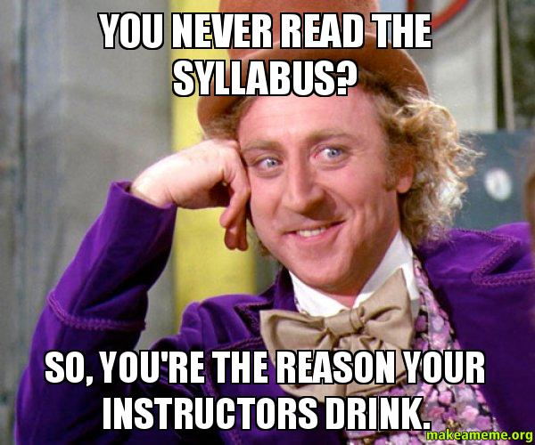
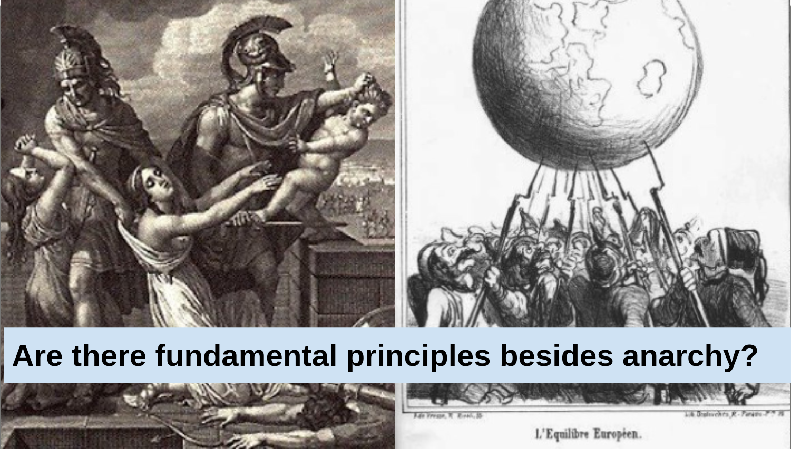

## Today's Agenda {background-image="./Images/background-scales_justice_v3.png" .center}

```{r}
# background-size="1920px 1080px"
library(tidyverse)
library(readxl)
```

<br>

**I. Basics of Analyzing International Institutions**

<br>

**Sources of International Law**

- "The Fundamental Principles Governing International Relations"


::: r-stack
Justin Leinaweaver (Fall 2026)
:::

::: notes

**Prep for Class**

1. Check Canvas submissions and record participation 

<br>

Welcome back everybody.

- Today we continue our work in Section 1 of the class focused on the "Basics of Analyzing International Institutions"

:::


## {background-image="./Images/background-scales_justice_v3.png" .center}

{style="display: block; margin: 0 auto"}

::: notes

**Any questions on the structure of the class, Canvas or the details in the syllabus?**

:::


## {background-image="./Images/background-scales_justice_v3.png" .center}

**What are your priors re: international law?**

1. What do states want from the international community?

2. When do states act on the international level?

::: notes

Last class we worked to unpack and examine your prior knowledge about international law

<br>

My argument to you is that it is vitally important to identify the assumptions you hold about any subject before you begin to explore it.

- Your initial assumptions are typically based on intuitions that come from all kinds of wacky places in our lives

- ESPECIALLY when we're talking about international law, intuitions based on how domestic law works will often lead you astray.

:::


## {background-image="./Images/01_2-hammer_globe.png" .center}

Cassese, A. (2005). Chapter 3: The Fundamental Principles Governing International Relations. *International Law*.

::: notes

Our next job in Section 1 of the class is to think about the sources of international institutions.

- e.g. where does international law come from?

<br>

Over the next two classes I want us to examine three interrelated sources of international law.

- Today we begin with what Cassese describes as the "fundamental principles governing international relations"

<br>

Even though I just told you it is dangerous to draw parallels with domestic law tell me... 

**Where do we find the "fundamental principles" governing life inside the USA?**

- (The Constitution and the 50 state constitutions)
    - as interpreted by 9 crazy people with lifetime tenure

<br>

Within states rules typically exist in a constitution, or other formative document, that offers the baseline on which a society functions.

- Our question for today is, at the international level does anything stand in for that missing Constitution?

:::


## Antonio Cassese (1937 - 2011) {background-image="./Images/background-scales_justice_v3.png" .center}

:::: {.columns}
::: {.column width="50%"}

:::

::: {.column width="50%"}
- Judge, international lawyer and professor

- First President of the International Criminal Tribunal for the former Yugoslavia

- First President of the Special Tribunal for Lebanon
:::
::::

::: notes

This semester I've assigned you a few readings from the excellent second edition of Antonio Cassese's book, International Law.

- Judge Cassese was one of the most distinguished international legal minds of the post-war era.

<br>

Following the genocide in Yugoslavia in the 1990s the UN needed a court to investigate and prosecute these crimes.

- The UN created the International Criminal Tribunal for the former Yugoslavia (ICTY) and asked Judge Cassese to lead it

<br>

After the assasination of the Lebanese PM, Rafic Hariri, in 2005 as the region descended deeper into chaos, the international community again turned to Judge Cassese to investigate it.

- Basically, whenever the international community needed help with international law, Judge Cassese was the go-to guy.

:::


## {background-image="./Images/01_2-hammer_globe.png" .center}

Cassese, A. (2005). Chapter 3: The Fundamental Principles Governing International Relations. *International Law*.

::: notes

**Big picture, what did you think of the Cassese chapter?**

- **e.g. his style of writing, argumentation and use of evidence?**

<br>

He is very much a lawyer by training and practice

- This means his writing mirrors what you would see in case law (e.g. judicial decisions)

- Very much rooted in the letter of the law and the importance of precedent and consistency.

- If you've ever read a Supreme Court ruling you've seen this style in practice.

<br>

Our perspective this semester will almost always begin with this kind of "letter of the law" approach BUT our ultimate interest as social scientists is to explain actual behavior, not the intricacies of law.

- **The difference is easy to demonstrate. Do you always drive below the speed limit? Why or why not?**

<br>

What we care about in this class is how international institutions impact decision-making.

- Understanding this requires analyzing the letter of the law, but also thinking about what the actors those laws target want and how they make decisions!

- Hence, your assignment for today finding real world cases of the principles in practice.

- **Make sense?**

<br>

**SLIDE**: With that aim in mind, let's root ourselves back in the basics of International Relations theory.

:::


## {background-image="./Images/background-scales_justice_v3.png" .center}



::: notes

Fundamental to academic International Relations is a recognition of international anarchy.

- **Remind me, what does anarchy refer to in IR?**

<br>

The question for us is whether or not all these international institutions that have been created have made a meaningful difference in the effects of anarchy on behavior.

- Since we care about how the world actually works, and the international community has created a whole bunch of international law, we should explore it in order to decide for ourselves if any of it matters.

- **Make sense?**

:::


## {background-image="./Images/background-cloth_v2.png" .center}

**"The Fundamental Principles Governing International Relations" (Cassese 2005)**

1. Sovereignty of States
2. Equality of States
3. Non-Intervention in the Int. / Ext. Affairs of Other States
4. Prohibition of the Threat or Use of Force
5. Peaceful Settlement of Disputes
6. Respect for Human Rights
7. Self-Determination of Peoples

::: notes

Let's begin by talking about the seven principles in a big picture sense.

**What are the two characteristics Cassese asserts are true of each of these “fundamental principles”?**

- (p48: 1. universal scope; 2. legally binding force)

**What is universal scope?**

- (Applies to all and in all places)

**What is legally binding force?**

- (All states committed to these principles.)

**And where do these “fundamental principles” come from?**

- (“careful consideration of international practice”)
- (Treaties, GA resolutions, Declarations of states, Statements by government representatives in the UN, diplomatic practice and case law)

<br>

**Somebody sum this up for us, how is Cassese asking us to think about this list?**

<br>

This chapter represents an argument by Cassese that if you carefully review all of international law you will discover a set of ideas held in common by all states that describe a sort of global constitution.

- This global "constitution" includes these seven principles and we should expect that any actions taken that violate these principles will be opposed by the global community.

- You didn’t create it, you didn’t agree to it and your government runs the risk of punishment for defying it.

<br>

Everybody go sit with the other people who also found a case for today for your principle.

:::


## {background-image="./Images/background-cloth_v2.png" .center}

**"The Fundamental Principles Governing International Relations" (Cassese 2005)**

1. Sovereignty of States
2. Equality of States
3. Non-Intervention in the Int. / Ext. Affairs of Other States
4. Prohibition of the Threat or Use of Force
5. Peaceful Settlement of Disputes
6. Respect for Human Rights
7. Self-Determination of Peoples

**Groups: Explain your principle in simple terms, AND illustrate with your cases**

::: notes

**GROUPS**: Discuss the cases you brought and the basics of this "principle." 

- Get ready to present it to the class

- NOT YET about "does it matter", just explain and illustrate the basics
    
<br>

PRESENT EACH (save discussion for next step)

<br>

**Notes**

1. Sovereignty of States (48-52)
    - jurisdiction: the power of central authority to exercise public functions over individuals located in a territory
    - jurisdiction to prescribe, jurisdiction to adjudicate and jurisdiction to enforce

2. Equality of States (52-3)
    - All sovereign states on equal footing.

3. Non-Intervention in the Internal or External Affairs of Other States (53-55)
    - A state may not interfere in the internal organization of a foreign state.
    - Not as sweeping a rule as it appears. 
    - State may not aid insurgents in a civil war (unless they qualify as a national liberation movement)

4. Prohibition of the Threat or Use of Force (55-57)
    - An "absolute all-inclusive prohibition"
    - Only military force proscribed (not economic sanctions)
    - Ony interstate threats banned (repress your own people as you wish)
    - Expanded in the 1970s to better protect weak states and groups
    - Don't forget, some general rules exist that explicitly allow the use of force.

5. Peaceful Settlement of Disputes (58-9)
    - States obligated to pursue peaceful resolutions and must be done in meaningful ways, not just keeping up appearances or faking it.

6. Respect for Human Rights (59-60)
    - Arguably this directly conflicts with sovereignty and non-interference principles.
    - Massive infringements make a state accountable to the whole community.
    - Must avoid seriously and repeatedly infringing on rights (not activated by sporadic or isolated violations)

7. Self-Determination of Peoples (60-64)
    - Firmly entrenched in three circumstances: 1. anti-colonialism, 2. ban on foreign military occupation, 3. all racial groups must have full access to government.
    - This acceptance of this principle has been selective and limited (to avoid encouraging chaos). Specifically, does not currently apply to ethnic groups, and national, religious, cultural or linguistic minorities. 

:::


## {background-image="./Images/background-cloth_v2.png" .center}

**"The Fundamental Principles Governing International Relations" (Cassese 2005)**

1. Sovereignty of States
2. Equality of States
3. Non-Intervention in the Int. / Ext. Affairs of Other States
4. Prohibition of the Threat or Use of Force
5. Peaceful Settlement of Disputes
6. Respect for Human Rights
7. Self-Determination of Peoples

**Classify Each: [Wide respect]{style="color:blue;"}, [Some respect]{style="color:orange;"}, or [No respect]{style="color:red;"}**

::: notes

Ok, let's now form new groups! (3-4 groups, 5 per?)

- Go sit with your group!

<br>

In a moment I will ask each of you and each group to classify the seven principles as either Fundamental, Borderline or Wishful thinking.

<br>

**First, let's agree definitions for each classification**

*ON BOARD*

- Fundamental:

- Borderline: 

- Wishful Thinking:


<br>

To start, take a few minutes **on your own** to classify each principle as either: Fundamental, Borderline or Wishful thinking

- Remember, just because states violate a rule does not mean it isn't a rule!

- If you feel compelled to make excuses or apologize for an act, you are acknowledging the rule exists!

<br>

**Questions?**

- Go!

<br>

GROUPS: Compare your classifications across the group. Can you agree a single classification for each?

- *ON BOARD*: One row per principle, one column per group

- **SLIDE**: Discussion prompts...

:::


## {background-image="./Images/background-cloth_v2.png" .center}

**"The Fundamental Principles Governing International Relations" (Cassese 2005)**

1. Sovereignty of States
2. Equality of States
3. Non-Intervention in the Int. / Ext. Affairs of Other States
4. Prohibition of the Threat or Use of Force
5. Peaceful Settlement of Disputes
6. Respect for Human Rights
7. Self-Determination of Peoples

**Classify Each: [Wide respect]{style="color:blue;"}, [Some respect]{style="color:orange;"}, or [No respect]{style="color:red;"}**

::: notes

1. **Are we clear on the definition of each?**

    - Any problematic concepts?

<br>

2. **Which of these are we comfortable arguing are fundamental to the international system?**

    - In other words, are you persuaded that any of these rise to the level of "constitutional principles of the international community"? Why or why not?

<br>

*Make sure to go through each:*

- Strongest case made by Cassese?

- Counter-argument from us?

<br>

3. **Which of these do you believe should be a fundamental principle?**

- Debate each

<br>

4. **How do these principles compare to the criteria lists we made in class on Monday? Similarities and differences?**

:::


## For Next Class {background-image="./Images/background-scales_justice_v3.png" .center}

**Sources of International Law**

1. Cassese (2005) ch8 on "Custom"

2. Shaw (2008) ch 16 on "Treaties"

::: notes


:::