## Today's Agenda {background-image="./Images/background-scales_justice_v3.png" .center}

```{r}
# background-size="1920px 1080px"
library(tidyverse)
library(readxl)
```

<br>

**Section 1: Analyzing International Institutions**

<br>

**Sources of International Law**

- Custom

<br>

::: r-stack
Justin Leinaweaver (Fall 2026)
:::

::: notes

Prep for Class

1. Review Canvas submissions

2. Readings
    - Cassese (2005), read chapter 8
    - Tannenwald (2005), read p5-14 (opening of the article), 33-36 (Analysis of the Taboo and Beyond the US case), & 46-49 (conclusion)

<br>

**SLIDE**: Last week we kicked off our exploration of international law by going very big picture

:::


## {background-image="./Images/background-scales_justice_v3.png"}

{.absolute top=0 width="550"}

{.absolute bottom=0 width="550"}

{.absolute right=0 width="400" top=0}

{.absolute right=0 width="400" bottom=0}

::: notes

In our first class together we focused on unpacking your prior assumptions about international law

<br>

We proposed answers to some of the big questions like:

1. Why do states act on the international stage?

2. What do they want or fear from the international community?

<br>

I assume that for most of you these assumptions were shaped by having studied international relations theory

- Intro to IR is meant to introduce you to important ideas of international anarchy, collective action problems and various models of cooperation

<br>

In our second class we examined the historical roots of the subject dating back to Hugo Grotius

- Called by many the "father of international law" his writings tended to organize and consolidate all of the rules that we now think of as the old world order

<br>

My hope is that these historical readings and discussions will help you as we move forward

- Especially when you see how our readings this week juxtapose the old world and the new

- When they say "old" they mean the world as described by Grotius!

<br>

This week we focus on the sources of international law

- In other words, we try to answer the question of where do international laws come from

- **SLIDE**: To do this, we're going to need to consult a lawyer

:::


## Antonio Cassese (1937 - 2011) {background-image="./Images/background-scales_justice_v3.png" .center}

:::: {.columns}
::: {.column width="45%"}

:::

::: {.column width="55%"}
- Judge, international lawyer and professor

- First President of the International Criminal Tribunal for the former Yugoslavia

- First President of the Special Tribunal for Lebanon
:::
::::

::: notes

This semester I've assigned you a few readings from the excellent second edition of Antonio Cassese's book, International Law.

<br>

Judge Cassese was one of the most distinguished international legal minds of the post-war era.

<br>

Following the genocide in Yugoslavia in the 1990s the UN needed a court to investigate and prosecute these crimes.

- The UN created the International Criminal Tribunal for the former Yugoslavia (ICTY) and asked Judge Cassese to lead it

<br>

After the assasination of the Lebanese PM, Rafic Hariri, in 2005 as the region descended deeper into chaos, the international community again turned to Judge Cassese to investigate it.

- Basically, whenever the international community needed help with international law, Judge Cassese was the go-to guy.

<br>

**SLIDE**: His style of writing...

:::


## {background-image="./Images/background-scales_justice_v3.png" .center}

Cassese, A. (2005). Chapter 8: International Law-Creation: Custom. *International Law*.

{style="display: block; margin: 0 auto"}


::: notes

**Big picture, what did you think of the Cassese chapter?**

- **e.g. his style of writing, argumentation and use of evidence?**

<br>

He is very much a lawyer by training and practice

- This means his writing mirrors what you would see in case law (e.g. judicial decisions)

- Very much rooted in the letter of the law and the importance of precedent and consistency.

- If you've ever read a Supreme Court ruling you've seen this style in practice.

- If you want to go to law school, consider this a preview of the style!

<br>

Our perspective this semester will almost always begin with this kind of "letter of the law" approach

- BUT, our ultimate interest as social scientists is to explain outcomes, not the intricacies of law.

- This means we need to be comfortable understanding the legal arguments while never forgetting they are only one part of the puzzle

- e.g. states act for many reasons and not just what the law says in writing!

<br>

**SLIDE**: My go-to example

:::


## {background-image="./Images/background-scales_justice_v3.png" .center}

{style="display: block; margin: 0 auto"}

::: notes

If your aim is to explain why some people stop at this stop sign and some do not you'll need to consider the letter of the law

- The specific rules of stop signs in that state

- The specific punishments for violating those rules

<br>

But you'll also need to consider

- The design of the intersection and the surrounding area

- The frequency of police patrols

- The visibility of the sign

- The amount of traffic

- The alternative options for circumventing the stop sign (e.g. other routes)

- The degree to which your drivers are rule followers or not

- etc

<br>

**Make sense?**

<br>

Ok, our work this week is to identify the primary sources of international law

- We want to explain outcomes, so we first need to know what the rules are

<br>

**SLIDE**: To get there, let's start with a detour to the ICJ

:::


## {background-image="./Images/background-scales_justice_v3.png" .center}

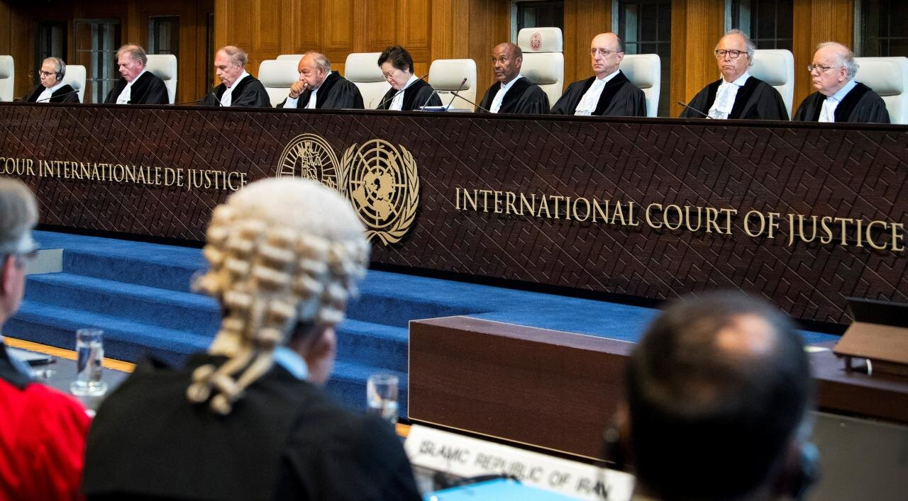{style="display: block; margin: 0 auto"}

::: notes

**Has anybody ever heard of the International Court of Justice (ICJ)?**

<br>

The International Court of Justice (ICJ) is the principal judicial organ of the United Nations (UN).

- Think a supreme court for the UN

- The Court is composed of 15 judges, who are elected for terms of office of nine years

<br>

Two main jobs:

1. Settle legal disputes between states
    
2. Give advisory opinions on legal questions referred to it by authorized United Nations organs and specialized agencies
    
<br>

**SLIDE**: As a means to getting to the sources of international law, let me give you an example of international dispute settlement in action

:::


## The ICJ Settles Legal Disputes {background-image="./Images/background-scales_justice_v3.png" .center}

:::: {.columns}
::: {.column width="50%"}
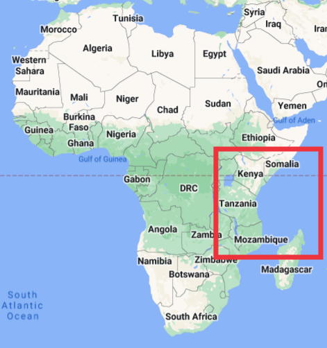
:::

::: {.column width="50%"}
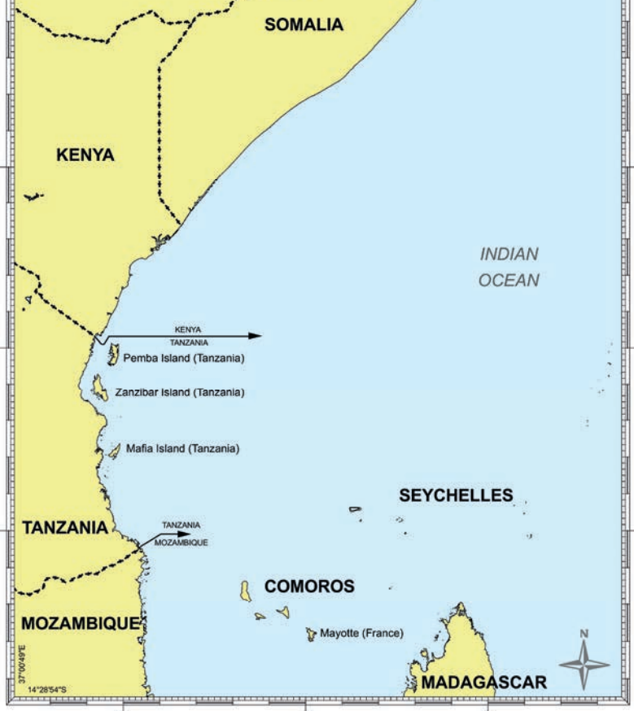
:::
::::

::: notes

Here we see a map showing the section of East Africa where Kenya and Somalia share a border.

- This zoomed in map, taken from the ICJ opinion, also shows us the sea borders south of Kenya

<br>

What do I mean by a "sea border"?

- An extension of your boundaries into the ocean (assuming you are a coastal state)

- The first 12 miles is a country's "territorial sea" 

    - e.g. an area you control just like you do your own land (UNCLOS Part II)

- Up to 200 nautical miles is your exclusive economic zone (EEZ)

    - EEZ gives you rights for the purposes of exploring, exploiting, conserving, and managing natural resources of the seabed, subsoil, and waters above it (UNCLOS Part V).
    
- Lines directly offshore generally follow the land border and then, in east-west cases, parallel a line of latitude

<br>

**Why do you think the sea border between Kenya and Tanzania is so much longer than between Tanzania and Mozambique?**

- (The Tanzania/Mozambique border is shorter as it runs into the territory of Comoros)

- (The Kenya/Tanzania line is extended, for Tanzania, by those large islands offshore that extend its territory)

<br>

**SLIDE**: US EEZ

:::


## {background-image="./Images/background-scales_justice_v3.png" .center}

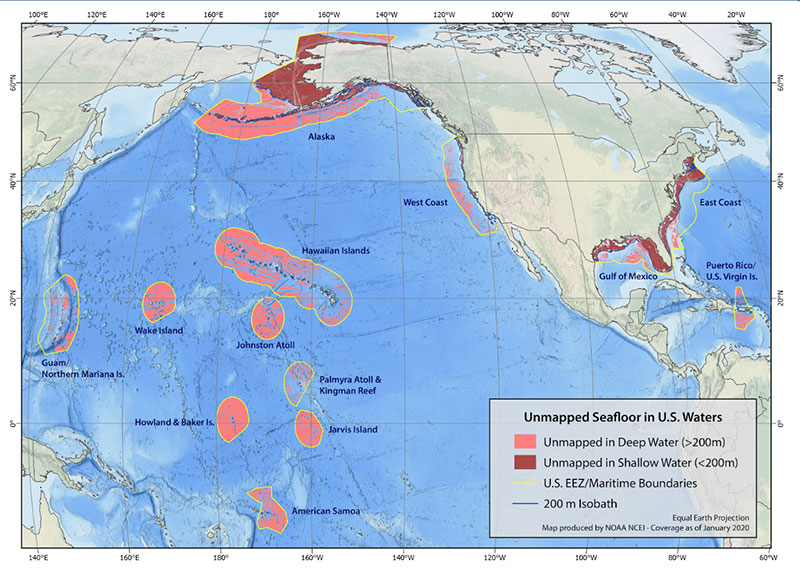{style="display: block; margin: 0 auto"}

::: notes

As an example, here is a map of the US EEZ shaded in blue as provided by the National Oceanic and Atmospheric Administration (NOAA).

- US EEZ is more than 3.4 million square nautical miles (4 million square miles) of ocean

- Larger than the land area of all 50 states combined and is one of the largest EEZs in the world

- It is so big we've only mapped about 40% of it

<br>

In case you've ever wondered why the US would work so hard to maintain control over tiny islands in the Pacific Ocean, each tiny island can claim a huge area of ocean resources!

<br>

**SLIDE**: Back to Kenya vs Somalia!

:::


## The ICJ Settles Legal Disputes {background-image="./Images/background-scales_justice_v3.png" .center}

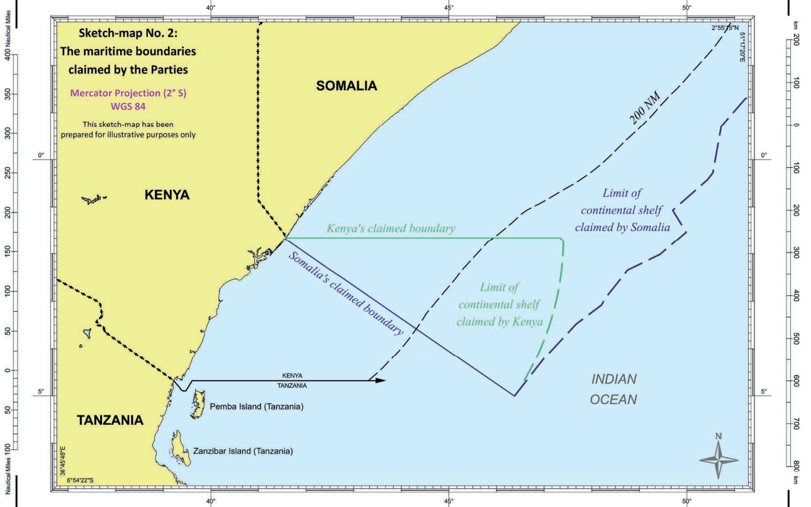{style="display: block; margin: 0 auto"}

::: notes

Kenya and Somalia have been arguing about how to draw the sea border between them for a LONG, LONG time.   [ICJ Opinion](https://www.icj-cij.org/sites/default/files/case-related/161/161-20211012-JUD-01-00-EN.pdf)*

- Essentially this dispute dates back to, at least, both states gaining independence in 1960 (Somalia) and 1963 (Kenya)

- Note that claims over the continental shelf beyond 200 nautical miles apply only to the seabed and subsoil

- The EEZ also gives you rights to the water column above it

<br>

Kenya argues that this green line is the "correct" sea border based on:

1. Current practice (e.g. both states have long behaved like this is the border), and 

2. A principle that sea borders should be drawn along the parallel of latitude (like the examples to their south) 

<br>

Somalia argues that this purple/blue line is the "correct" sea border because it follows the land border into the sea

<br>

So, in Aug 2014 Somalia files an application to the ICJ to settle this dispute

- Kenya spends the next five years trying to prevent the ICJ from hearing the case and making a ruling

- **SLIDE**: You won't be shocked to hear who is happier in the end

:::


## {background-image="./Images/background-scales_justice_v3.png"}

{.absolute width="450" left=0 top=0}

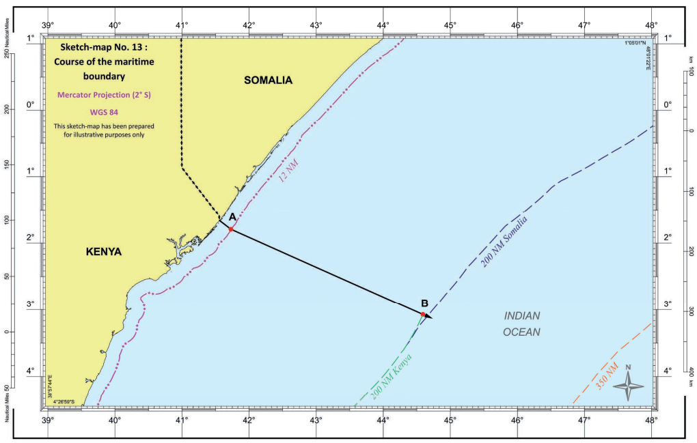{.absolute width="750" right=0 bottom=0}

::: notes

In October 2021 the ICJ released its judgment settling the border dispute between Kenya and Somalia. [LINK](https://www.icj-cij.org/sites/default/files/case-related/161/161-20211012-JUD-01-00-EN.pdf)

- Somalia clearly much happier with the outcome than Kenya!

<br>

**SLIDE**: And how did the judges decide this outcome?

:::


## {background-image="./Images/02_1-ICJ_Sea_Border_Kenya_Somalia2.png" .center}

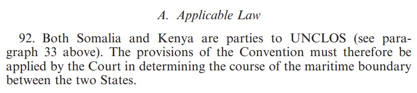

::: notes

According to the judges themselves the key basis for the decision was that both states had joined the UN Convention on the Law of the Sea.

- That treaty includes specific language for adjudicating disputes like this one and so that was what they applied.

- That one specific treaty served as the basis for this particular ruling

<br>

But how did the judges decide that was the one piece of international law to focus on?

- Let me bounce this question back to you.

- **Why does Cassese focus on at the start of his chapter on customary law in terms of the ICJ?**

- **How does the ICJ define international law?**

- (**SLIDE**)

:::


## {background-image="./Images/background-scales_justice_v3.png" .center .smaller}

::: {.r-fit-text}
**The Statute of the International Court of Justice (ICJ)**
:::

**Article 38**

1. The Court, whose function is to decide in accordance with international law such disputes as are submitted to it, shall apply: 

a. international conventions, whether general or particular, establishing rules expressly recognized by the contesting states; 

b. international custom, as evidence of a general practice accepted as law; 

c. the general principles of law recognized by civilized nations; 

d. subject to the provisions of Article 59, judicial decisions and the teachings of the most highly qualified publicists of the various nations, as subsidiary means for the determination of rules of law. 

::: notes

Simply put, Article 38 is one answer to the question: What is international law?

- Technically, this is how the UN System defines international law

- And since the UN is central to international politics today, this represents a really useful answer to our question

<br>

For judges to rule on controversies of the law they need a firm understanding of both **what the law is** and how **conflicts across laws** should be settled.

- A judge is often called on to sort out situations where obeying one law means violating another!

- For example, when driving you must stop at stop signs and you must get out of the way for emergency vehicles. What if doing the latter means running through a stop sign and what if that action causes an accident?

<br>

1. Art 38 tells the ICJ judges that "international law" has four sources:

    - treaties, 
    - international custom, 
    - general principles and, 
    - in a limited fashion, the work of other judges around the world.

2. Art 38 tells the ICJ judges the hierarchy of international laws for dealing with conflicts between them

    - When making a decision the ICJ starts with (a) and only moves to (b) if (a) is insufficient to decide the dispute.
    
<br>
    
Don't over-interpret this list order!

- This list is ICJ specific
- The order is particular to the court working through a specific dispute (e.g. state 1 vs state 2)
- This is not the establishment of one type of international law as generally more important than the others.
    
<br>

Bottom line, the ICJ judges need concrete guidance for how to approach disputes over international law.

- They need to know "what" to consider, AND "how" to consider it.

<br>

**SLIDE**: Continued

:::


## {background-image="./Images/background-scales_justice_v3.png" .center .smaller}

::: {.r-fit-text}
**The Statute of the International Court of Justice (ICJ)**
:::

**Article 38**

1. The Court, whose function is to decide in accordance with international law such disputes as are submitted to it, shall apply: 

a. international conventions, whether general or particular, establishing rules expressly recognized by the contesting states; 

b. international custom, as evidence of a general practice accepted as law; 

c. the general principles of law recognized by civilized nations; 

d. subject to the provisions of Article 59, judicial decisions and the teachings of the most highly qualified publicists of the various nations, as subsidiary means for the determination of rules of law. 

::: notes

So, here we have one answer to the question, "what is international law?"

<br>

Importantly, this is not very different from how domestic law works in the United States

- While most domestic behavior in the US is covered by explicitly written laws, there are still many, many gray areas that are not covered

- Domestic "law" includes acts of Congress, Supreme Court rulings, agency rules and procedures, etc

- Judges often have to sort through all of this when settling disputes

<br>

In addition, when the usual sources of law are too vague for a case or a behavior is too new or unanticipated US courts will look to custom (e.g. "common law")

- "That which derives its force and authority from the universal consent and immemorial practice of the people" [LINK](https://www.upcounsel.com/legal-def-common-law)

- Think precedent: The law created by judges when deciding individual disputes or cases.

<br>

And if both those sources fail them, some US courts have looked to court decisions from other countries with similar systems to ours for ideas! 

- Wacky side note, Louisiana is only US state not to follow English common law foundations. Theirs come from France.

<br>

**SLIDE**: Today we focus on item (b) in this list, international custom

:::


## {background-image="./Images/background-scales_justice_v3.png" .center .smaller}

::: {.r-fit-text}
**The Statute of the International Court of Justice (ICJ)**
:::

**Article 38**

1. The Court, whose function is to decide in accordance with international law such disputes as are submitted to it, shall apply: 

a. international conventions, whether general or particular, establishing rules expressly recognized by the contesting states; 

b. [**international custom, as evidence of a general practice accepted as law;**]{style="color:blue;"}

c. the general principles of law recognized by civilized nations; 

d. subject to the provisions of Article 59, judicial decisions and the teachings of the most highly qualified publicists of the various nations, as subsidiary means for the determination of rules of law. 

::: notes

**Big picture, and according to Cassese, what is customary law?**

- **How do we know it when we see it?**

<br>

Custom refers to a traditional and widely accepted way of behaving or doing something that is specific to a particular society, place, or time.

<br>

**Examples of customs in your life? e.g. ways things are done**

- At Drury, the custom is to address professors as "professor" or "Dr."

- Don't cut in line; wait your turn

- If someone lets you merge in front of them on the road you HAVE TO WAVE!

<br>

It turns out that respecting custom as a source of law has a LONG history across the world

- **SLIDE**: Example from ancient India

:::


## The Long Roots of Customary Law {background-image="./Images/background-scales_justice_v3.png" .center}

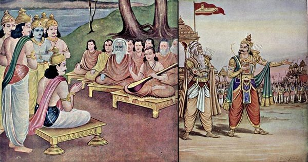{style="display: block; margin: 0 auto"}

::: {.r-fit-text}
**Ancient Indian Maxim: "Immemorial Custom is transcendental Law"**
:::

::: notes

The Manusmriti is an ancient legal and social text in Hinduism.

- Tough to give a precise date, but some elements of it date back to 200 BC

<br>

Traditional norms practiced for generations carry inherent moral and legal weight.

- In ancient Hindu law proven community usage took precedence over written laws or scriptures.

<br>

**SLIDE**: Example from Ancient Rome

:::


## The Long Roots of Customary Law {background-image="./Images/background-scales_justice_v3.png" .center}

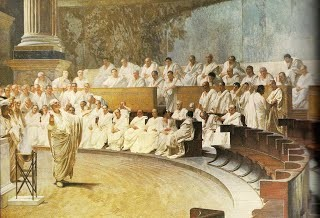{style="display: block; margin: 0 auto"}

::: {.r-fit-text}
**Ancient Roman Maxim: "beaten path, safe path"**
:::

::: notes

Under the Roman empire the expression was "via trita via tuta"

- "beaten path, safe path" or "the well-worn way is the safe way."

<br>

Courts and judges used this phrase to respect old laws and past decisions.

- They believed that sticking to established legal practices kept society stable and predictable.

<br>

**SLIDE**: Moving forward in time 

:::


## The Long Roots of Customary Law {background-image="./Images/background-scales_justice_v3.png" .center}

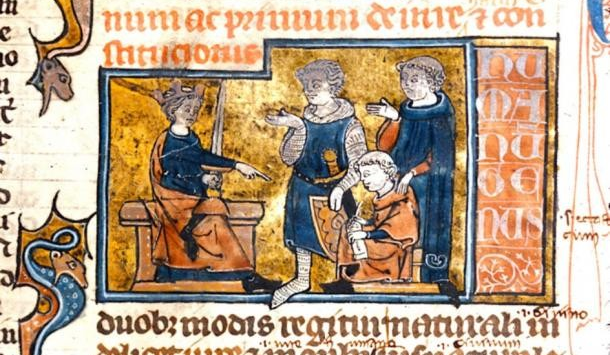{style="display: block; margin: 0 auto"}

::: {.r-fit-text}
**Medieval Canon Law: "Custom or law is a right established by habits"**
:::

::: notes

In the Middle Ages (circa 1140 AD), canon law (ius canonicum) was the official legal system of the Catholic Church.

- The expression was "Consuetudo aut lex est jus moribus constitutum"

- Custom or law is a right established by habits

<br>

These laws explicitly recognized long-standing local customs as valid law

- ...provided those customs did not contradict divine law or church doctrine.

<br>

So, customary law has a long history as a rule making force in both domestic and international systems

- **SLIDE**: Let's now take this back into Cassese's work

:::


## {background-image="./Images/background-scales_justice_v3.png" .center}

::: {.r-fit-text}
**Creating Customary Law**

1. Opinio necessitatis 

2. No “strong and consistent” opposition 

3. Opinio juris
:::

::: notes

So, how do we tell the difference between general *state practices*, meaning the things that states do, and *customary law*?

- According to Cassese and other legal scholars customary law is “unconscious and unintentional lawmaking” (Hans Kelsen)

- BUT it is still law-making!

<br>

It can be useful to think of the process of customary law creation in three steps

<br>

**What is opinio necessitatis?**

- **Try to explain this to me in simple terms.**

- (opinion says it is necessary; practice dictated by necessity)

    - "opinion" means it is subjective to you

    - "necessity" means you believe you need to do it

- So, opinio necessitatis refers to things states do because they believe they need to.

<br>

**What is meant by "strong and consistent" opposition and how does this follow from step 1?**

- So, states are doing a specific thing because they believe they need to.

- Over time more and more states also adopt this practice and no "strong" and "consistent" voices are raised to object.

<br>

**What is meant by "opinio juris" and how does it follow from step 2?**

- ('practice dictated by law')

- Over time, states come to do the "thing" adopted in steps 1 and 2 not because of need but because they come to accept it is because they are supposed to do it!

- Even without a treaty, a custom can become so embedded in the system that states obey it BECAUSE it is the custom and not just because they want to.

<br>

**Questions on this process?**

<br>

**What examples of this do you see in the reading?**

- (1. State control over the resources beneath the high seas but on their continental shelf)

- (2. Acceptable state behaviors in outer space)

<br>

**SLIDE**: One of my favorite historical examples relates to ambassadors

:::


## {background-image="./Images/background-scales_justice_v3.png" .center}

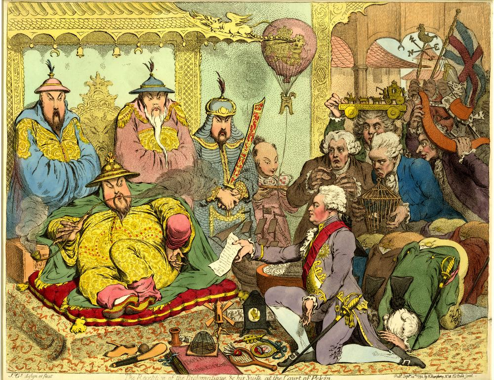{style="display: block; margin: 0 auto"}

::: notes

This illustration depicts the British Ambassador, Lord George Macartney, visiting the Chinese emperor in 1792.

- Super racist drawing, right? Whew.

<br>

**Step 1: In the pre-WWII era, why might states have stationed ambassadors in other states?**

- **What is the opinio necessitatis for having ambassadors?**

- (Keep the lines of communication open)

- (Encourage trade)

- (Create new opportunities for cooperation)

- (Keep alliances in place; prevent war)

<br>

Note that none of these are because international law says you have to!

<br>

Let's say Britain attacks China.

- e.g. a trade dispute turns hostile leads to naval battle, deaths and loss of economic goods.

- **If you are the Chinese emperor, why not send Mccartney's head back to the king in a bag?**

<br>

- (Again, opinio necessitatis in action.)

- May need him to negotiate a peace.

- Likely retribution against your ambassador in Britain.

- Would make peacefully ending the conflict MUCH harder.
    
<br>

**Can everyone see treating ambassadors as safe from harm is practice by necessity?**

- You do it because its convenient / necessary, not because anyone is telling you it is the law.

:::


## {background-image="./Images/background-scales_justice_v3.png" .center}

::: {.r-fit-text}
**Customary International Law: Diplomatic Immunity**
:::

:::: {.columns}

::: {.column width="50%"}
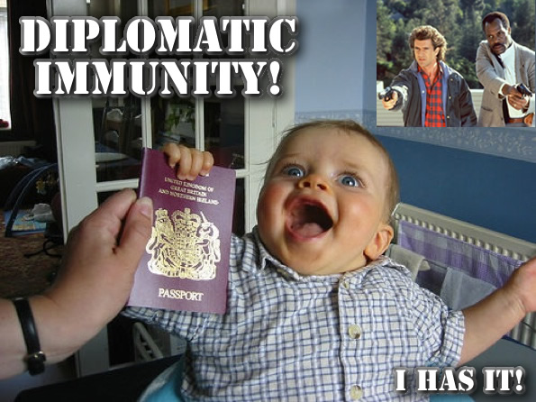
:::

::: {.column width="50%"}
<br>

1. Opinio necessitatis 

2. No “strong and consistent” opposition 

3. Opinio juris
:::

::::

::: notes

From here we see the development of the customary law related to diplomatic immunity.

- e.g. the protection of diplomats from harassment, imprisonment, etc.

<br>

**Step 2: Why would we not expect a "strong and consistent" opposition to develop on the question of not murdering ambassadors when countries make you mad?**

- Ambassadors prove useful so more and more states exchange them.

- Even when things go bad between two states, states recognize that their anger is not productively taken out on the other side's ambassador.

<br>

**Step 3: Finally, how do we know if we've reached step 3, 'opinio juris'?**

- States come to recognize that it would be a violation of international law to harm an ambassador, so they choose not to.

<br>

**So, based on the chapter, what do we understand customary international law to be?**

- (A process of taking "the way states do things because they want to" and eventually coming to interpret them as binding rules of behavior)

- (Not normally a deliberate process, more like 'unconscious and unintentional lawmaking')

- (Normally binding on all states whether they want them to or not!)

<br>

**Big picture questions on the traditional process of creating customary law?**

<br>

This all represents the traditional process of creating customary law

- BUT, there are some extra complications from the chapter we need to flag

- **SLIDE**

:::


## {background-image="./Images/background-scales_justice_v3.png" .center}

### How does the traditional process change when humanitarian issues are at stake?

<br>

1. Opinio necessitatis 

2. No “strong and consistent” opposition 

3. Opinio juris

::: notes

**First, how does the traditional process of creating customary law change when humanitarian issues are at stake?**

- **In other words, how does the Martens Clause from the 1899 Hague Peace Conference change these three steps?**

- (**SLIDE**)

<br>

Until a more complete code of the laws of war is issued, the High Contracting Parties think it right to declare that in cases not included in the Regulations adopted by them, populations and belligerents remain under the protection and empire of the principles of international law, as they result from the usages established between civilized nations, from the laws of humanity and the requirements of the public conscience.

- Convention with respect to the laws of war on land (Hague II), 29 July 1899

:::


## {background-image="./Images/background-scales_justice_v3.png" .center}

### How does the traditional process change when humanitarian issues are at stake?

<br>

1. ~~Opinio necessitatis~~ The “laws of humanity”

2. ~~No “strong and consistent” opposition~~ (?)

3. Opinio juris

::: notes

The participants knew they couldn't draft a complete set of the rules of war and wanted to make clear that individuals are entitled to protections

- According to Cassese, the massive scope of this change was unintentional

- It made sense to them given the high stakes and the difficulty of anticipating all possible future conflicts, BUT

- This opens a HUGE problem for standard conceptions of international law

<br>

**Why is this a problem for states?**

- **How does this transform customary international law?**

<br>

- (Completely changes what we mean by "custom" or "practice" as a rather uncontroversial source of the rules)

- (The structures of customary law were not designed to support rules that did NOT reflect common practice or behavior)

- This is really something entirely different...

<br>

**SLIDE**: What about objections during rule creation?

<br>

8.2.3 Custom in international humanitarian law

- The Martens Clause (Hague Peace Conference 1899): “Until a more complete code of the laws of war is issued, the High Contracting Parties think it right to declare that in cases not included in the Regulations adopted by them, populations and belligerents remain under the protection and empire of the principles of international law, as they result from the usages established between civilized nations, from the laws of humanity and the requirements of the public conscience.”

- Big impact (not necessarily anticipated by the drafters): This puts the “laws of humanity” and the “dictates of public conscience” on the same footing as state practice (‘usus’) as “historical sources of ‘principles of international law’”

- So, in terms of only humanitarian law, the state practice requirement is reduced and the opinio piece is elevated. Otherwise we would have to wait for atrocities to happen before creating the international legal structure to prevent those same atrocities from happening again.

:::


## {background-image="./Images/background-scales_justice_v3.png" .center}

### Do customary rules require the support of all states at their birth?

<br>

1. Opinio necessitatis (or the “laws of humanity”)

2. [No “strong and consistent” opposition]{style="color:red;"}

3. Opinio juris

::: notes

**What is your sense of the second step during customary law formation?**

- **Does EVERY state have to opt in?**

<br>

**Can states opt out of new customary rules?**

<br>

**SLIDE**: Let's end today with your Canvas arguments

<br>

8.2.4 Do customary rules require the support of all states at their birth?

- “For a rule to take root in international dealings it is sufficient for a majority of States to engage in a consistent practice corresponding with the rule and to be aware of its imperative need. States shall be bound by the rule even if some of them have been indifferent, or relatively indifferent, to it…” Think of landlocked states and the laws of the sea.
- “…no national or international court dealing with the question of whether an international rule had taken shape on a certain matter has ever examined the views of all States of the world” (162)

8.2.5 Objection by states to the formation of a customary rule

- The “so-called theory of the ‘persistent objector’ … holds that a state that “dissociates itself from a nascent rule is not bound by it.” 
- This seems currently untenable for two reasons: 1) Current international relations are much more “community oriented” and less “individualistic” than they used to be. It is extremely difficult to stand alone against the “strong pressure of the vast majority of members of the community”; 2) There is no firm support for this theory in either state practice or international case law
- Strong opposition to a new rule from a “major Power” may prevent or slow down its formation, but that is a question of process rather than legal entitlement. 
- This seems to be an evolution of the international legal system whereby custom can bind you even if you object to it!

:::


## The Nuclear Taboo (Tannenwald 2005) {background-image="./Images/background-scales_justice_v3.png"}

{.absolute left=0 width="400"}

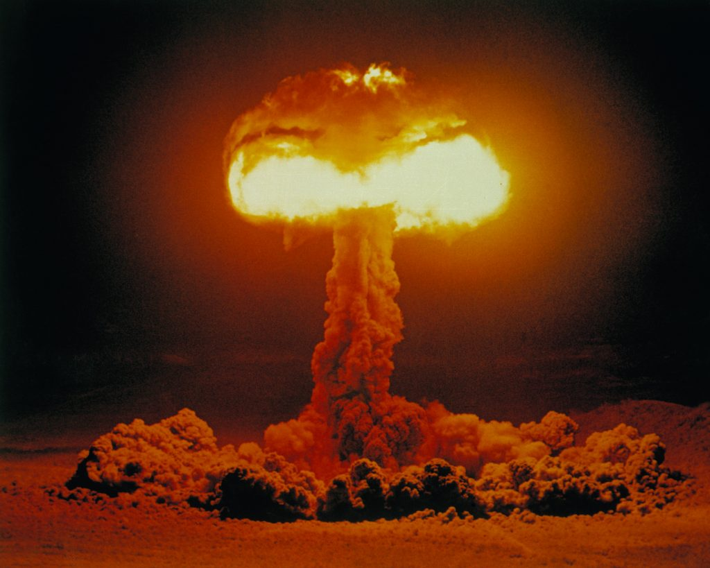{.absolute right=0 bottom=0 width="400"}

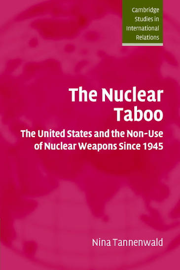{.absolute right=350 bottom=75 width="315"}

::: notes

**According to Tannenwald, what is the "nuclear taboo"?**

- ("The nuclear taboo refers to a de facto prohibition against the first use of nuclear weapons" p8)

- ("...nuclear weapons have come to be defined as abhorrent and unacceptable weapons of mass destruction, with a taboo on their use. This taboo is associated with a widespread revulsion toward nuclear weapons and broadly held inhibitions on their use", p5)

<br>

*Split class in half, work directly on the board*

- Canvas Arg 1: What is the strongest argument you can make that the "nuclear taboo" is customary international law? 

- Canvas Arg 2: What is the strongest argument you can make that the "nuclear taboo" is NOT customary international law? 

<br>

*PRESENT and DISCUSS each*

<br>

**SLIDE**: Next class

<br>

*Tannenwald Notes*

Tannenwald refers to this as a taboo which is apparently a stronger prohibition than a norm.  

- "In reality, however, nuclear weapons have to be defined as abhorrent and unacceptable weapons..." (5)  

-  "...a widespread revulsion toward nuclear weapons and broadly held inhibitions on their use" (5).  

-  "...severely delegitimized and are practically unthinkable policy options" (5).  

-  Pursued in opposition to the US who wanted to protect its right to use these weapons for defense.  

-  "The nuclear taboo refers to a de facto prohibition against the first use of nuclear weapons" (8).  

-  Taboo is even stronger prohibition than a norm: It is a danger, it is prohibited, it carries awful consequences (8) AND people believe it is taboo (9)  

-  It is also a "bright line" norm. Once anyone violates it the entire world is changed.  

-  Unlike other taboos it is not legalized (the NPT 1968 authorizes some states to have nukes)  

-  Evidence that people believe it is a taboo in discourse, institutions and behavior  

-  No explicit legal prohibition on the use of nukes like there is for chemical weapons HOWEVER legal restrictions gradually chipping away at it (10) e.g. nuclear weapons-free zones, arms control agreements  

Four pathways of the taboo's development  

1. Societal pressure (grassroots groups and moral consciousness raising)  
2. Normative power politics (states use rhetoric and diplomacy to delegitimize nukes)  
3. The role of individual state decisionmakers  
4. Iterated behavior over time "IS SIMILAR TO THE NOTION OF CUSTOM IN INTERNATIONAL LAW." Nonuse over timefor whatever reasons--deterrence, lack of readiness, scarcity of bombs, moral inhibitions or contingency--becomes a convention and a convention eventually gives rise to a normative obligation (13).  

-  Although the taboo is widespread today it is probably not universal (34).  

Counter-arguments  

1. Scott Sagan: It's a "tradition of nonuse" not a taboo (36). A matter of prudence not normative concerns

2. The taboo is a weapon of the strong against the strong, not the weak against the strong (39). The soviets and the Chinese pushed for the taboo because it would harm the US more than them because they relied more on conventional forces than nukes.  

3. What taboo? States maintain arsenals and game plan for their use. (40)

P1 - the role of a global antinuclear weapons movement  

P2 - nonuclear states opposition  

P3 - Cold War power politics


:::


## For Next Class {background-image="./Images/background-scales_justice_v3.png" .center}

<br>

**Sources of International Law: Treaties**

1. Excerpts from Cassese (2005) and Hollis (2012)

2. Bring The Vienna Convention on the Law of Treaties (1969)

3. Canvas: Find us an interesting treaty to discuss

::: notes


:::

