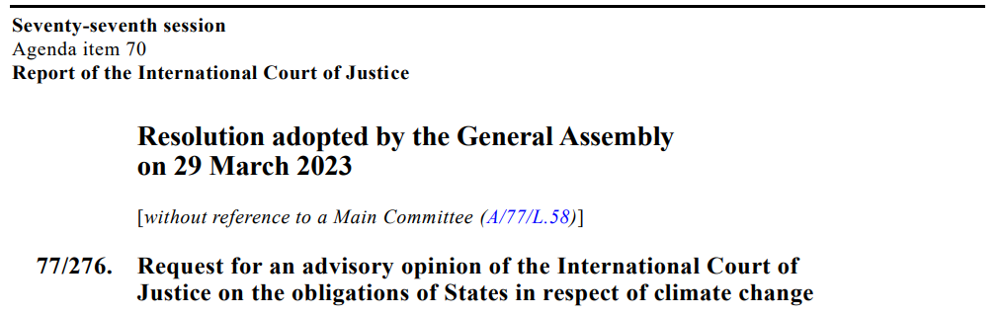

---
output:
  xaringan::moon_reader:
    css: ["default", "extra.css"]
    lib_dir: libs
    seal: false
    nature:
      highlightStyle: github
      highlightLines: true
      countIncrementalSlides: false
      ratio: '16:9'
---

```{r, echo = FALSE, warning = FALSE, message = FALSE}
library(tidyverse)
#library(readxl)
#library(stargazer)
#library(kableExtra)
#library(modelr)

knitr::opts_chunk$set(echo = FALSE,
                      eval = TRUE,
                      error = FALSE,
                      message = FALSE,
                      warning = FALSE,
                      comment = NA)
```

background-image: url('libs/Images/background-scales_justice_v3.png')
background-size: 105%
background-position: top
class: middle

.size50[**I. Basics of Analyzing International Institutions**]

<br>

.size45[**Today's Agenda: More Sources of International Law**

1. Customary Law

2. Treaties
]

.center[.size40[
  Justin Leinaweaver (Fall 2023)
]]

???

### Prep for Class
1. ?

<br>

Last class we began our exploration of the sources of international law with what Cassese refers to as the "fundamental principles."

- Today we add two additional sources: treaties and custom

<br>

**SLIDE**: Let's kick off our exploration by talking for a moment about the International Court of Justice (ICJ)


---

background-image: url('libs/Images/02_1-ICJ.jpg')
background-size: 100%
background-position: center
class: middle

???

### Has anybody ever heard of the ICJ?
### - Anything specific?

<br>

The International Court of Justice (ICJ) is the principal judicial organ of the United Nations (UN).
- Think SCOTUS for the UN

- The Court is composed of 15 judges, who are elected for terms of office of nine years

Two main jobs:
1. Settle legal disputes between states
    
2. Give advisory opinions on legal questions referred to it by authorized United Nations organs and specialized agencies
    
<br>

**SLIDE**: For example...


---

background-image: url('libs/Images/02_1-ICJ_Sea_Border_Kenya_Somalia.png')
background-size: 90%
background-position: center
class: bottom

???

1) The ICJ is often asked to settle disputes between countries.

<br>

Sea border dispute between Kenya and Somalia [LINK](https://www.icj-cij.org/sites/default/files/case-related/161/161-20211012-JUD-01-00-EN.pdf)

- Aug 2014 Somalia files an application to the ICJ to settle this dispute

- Kenya spends the next five years trying to prevent the ICJ from hearing the case and making a ruling (not shocking given their claims on the map)

- Somewhat understandable though given how the Kenyan border with Tanzania cuts off a lot of EEZ ocean already


---

background-image: url('libs/Images/background-blue_cubes_lighter3.png')
background-size: 100%
background-position: center
class: middle

```{r, echo = FALSE, fig.align='center', out.width = '90%'}

```

.size45[
1. What are the obligations of States under international law to ensure the protection of the climate system?

2. What are the legal consequences for states that harm the climate system?
]

???

2) The ICJ is often asked for advisory opinions about international law from the UN and its member states

<br>

In March of this year (2023) the UN GA asked the ICJ for an advisory opinion about climate change.

<br>

This one will make some noise when it lands, and that means it's going to take a while for them to work through. [LINK](http://climatecasechart.com/non-us-case/request-for-an-advisory-opinion-on-the-obligations-of-states-with-respect-to-climate-change/)

- Oct 20, 2023 deadline for the UN and member states to submit written statements

- Jan 22, 2024 deadline for written comments on the submitted statements


---

background-image: url('libs/Images/02_1-ICJ2.webp')
background-size: 100%
background-position: center
class: middle

???

Ok, fair question, why the detour to talk about an IO we have not yet studied?

- Isn't this diving into the deep end of a subject we have only just started on?

<br>

Let me bounce this question back to you.

### Why does Cassese kick off his chapter on customary law by invoking and discussing the ICJ?

- (**SLIDE**)


---

background-image: url('libs/Images/background-blue_cubes_lighter3.png')
background-size: 100%
background-position: center
class: middle

.content-box-white[.size40[**The Statute of the International Court of Justice (ICJ)**]]

.size30[
**Article 38**

1. The Court, whose function is to decide in accordance with international law such disputes as are submitted to it, shall apply: 

a. international conventions, whether general or particular, establishing rules expressly recognized by the contesting states; 

b. international custom, as evidence of a general practice accepted as law; 

c. the general principles of law recognized by civilized nations; 

d. subject to the provisions of Article 59, [.e. that only the parties bound by the decision in any particular case,] judicial decisions and the teachings of the most highly qualified publicists of the various nations, as subsidiary means for the determination of rules of law. 

]

???

Simply put, Article 38 is one answer to the question: What is international law?
- Technically, this is how the UN System defines international law and given the centrality of that entity to international politics this represents a really useful answer to our question.

<br>

For judges to rule on controversies of the law they need a firm understanding of both what the law is and how conflicts across laws should be settled.

1. Art 38 tells the ICJ judges that "international law" has four sources:
    - treaties, 
    - international custom, 
    - general principles and, 
    - in a limited fashion, the work of other judges around the world.

2. Art 38 tells the ICJ judges the hierarchy of international laws for dealing with conflicts between them
    - When making a decision the ICJ starts with (a) and only moves to (b) if (a) is insufficient to decide the dispute.
    
Don't over-interpret this list order!
- The list order does not mean treaty law is superior to customary law.
- The order is particular to the court working through a specific dispute (e.g. state 1 vs state 2)
- This is not the establishment of one type of international law as more important than the others.
    
<br>

Bottom line, the ICJ judges need concrete guidance for how to approach disputes over international law.
- They need to know "what" to consider, AND "how" to consider it.

<br>

**SLIDE**: Let's go back to our current examples to see this in action!


---

background-image: url('libs/Images/02_1-ICJ_Sea_Border_Kenya_Somalia.png')
background-size: 90%
background-position: center
class: bottom

???

Let's return to the dispute between Kenya and Somalia.

<br>

The Kenyan side argument was essentially three part:

1. This is the border currently being respected by both sides,

2. Somalia agrees with them because its behavior shows them respecting the boundary (they "acquiesced"), and 

3. This current status quo is the most "equitable" outcome (222).

<br>

The Somali side argument was simpler:

1. There is no current maritime boundary between the states,

2. The Court should use international law to draw one using the methods discussed in the UN Convention on the Law of the Sea.

<br>

### Given what you've learned about Art 38 today, who wins this case?

- (**SLIDE**)


---

background-image: url('libs/Images/02_1-ICJ_Sea_Border_Kenya_Somalia2.png')
background-size: 98%
background-position: middle, center
class: top, right

```{r, echo = FALSE, out.width = '60%'}

```

???

In October 2021 the ICJ released its judgment settling the border dispute between Kenya and Somalia. [LINK](https://www.icj-cij.org/sites/default/files/case-related/161/161-20211012-JUD-01-00-EN.pdf)

- Somalia clearly much happier with the outcome than Kenya!

<br>

According to the judges themselves the key basis for the decision was that both states had joined the UN Convention on the Law of the Sea.

- That treaty includes specific language for adjudicating disputes like this one and so that was what they applied.

<br>

### Make sense?

<br>

**SLIDE**: You can see Article 38 in action with the climate change advisory opinion case as well.


---

background-image: url('libs/Images/background-blue_cubes_lighter3.png')
background-size: 100%
background-position: center
class: middle

```{r, echo = FALSE, fig.align='center', out.width = '90%'}

```

.size45[
1. What are the obligations of States under international law to ensure the protection of the climate system?

2. What are the legal consequences for states that harm the climate system?
]

???

The UN GA Resolution requesting the advisory opinion offers the Court a list of sources they request it to consider.

- And recognizing Art 38 they go in the same order: treaties, then customs, then fundamental principles.

<br>

### Kind of cool, right?

### Given this list of relevant "international laws", does everybody see why this case is going to take forever to finish?


---

background-image: url('libs/Images/background-blue_cubes_lighter3.png')
background-size: 100%
background-position: center
class: middle

.content-box-white[.size40[**The Statute of the International Court of Justice (ICJ)**]]

.size30[
**Article 38**

1. The Court, whose function is to decide in accordance with international law such disputes as are submitted to it, shall apply: 

a. international conventions, whether general or particular, establishing rules expressly recognized by the contesting states; 

b. international custom, as evidence of a general practice accepted as law; 

c. the general principles of law recognized by civilized nations; 

d. subject to the provisions of Article 59, [.e. that only the parties bound by the decision in any particular case,] judicial decisions and the teachings of the most highly qualified publicists of the various nations, as subsidiary means for the determination of rules of law. 

]

???

So, here we have one answer to the question, "what is international law?"

<br>

### How similar is this to the way domestic law works in the United States?

(Not at all, right?)
- Hard to imagine a judge letting you away from a speeding ticket because you point out that everyone else was speeding so therefore the custom must be that speeding is allowed!

- Or because you find a decision on traffic speeding from Japan that decided speeding isn't a crime

<br>

Our job today and for the rest of the semester is to make sure we understand these sources more deeply.

- **SLIDE**: Recap last week on fundamental principles 


---

background-image: url('libs/Images/background-blue_cubes_lighter3.png')
background-size: 100%
background-position: center
class: middle

.content-box-white[.size40[**The Statute of the International Court of Justice (ICJ)**]]

.size30[
**Article 38**

1. The Court, whose function is to decide in accordance with international law such disputes as are submitted to it, shall apply: 

a. international conventions, whether general or particular, establishing rules expressly recognized by the contesting states; 

b. international custom, as evidence of a general practice accepted as law; 

c. .textblue[**the general principles of law recognized by civilized nations**]; 

d. subject to the provisions of Article 59, [.e. that only the parties bound by the decision in any particular case,] judicial decisions and the teachings of the most highly qualified publicists of the various nations, as subsidiary means for the determination of rules of law. 

]

???

Last week we kicked off our exploration of international law by examining the fundamental principles!

### What were our takeaways from that work with the Cassese chapter?

### - Where do they come from?

### - Specific examples?

<br>

Funnily enough, they seem to come from the first two items on this list, although they are a small selection of them.


---

background-image: url('libs/Images/background-blue_cubes_lighter3.png')
background-size: 100%
background-position: center
class: middle

.content-box-white[.size40[**The Statute of the International Court of Justice (ICJ)**]]

.size30[
**Article 38**

1. The Court, whose function is to decide in accordance with international law such disputes as are submitted to it, shall apply: 

a. .textblue[**international conventions**], whether general or particular, establishing rules expressly recognized by the contesting states; 

b. .textblue[**international custom**], as evidence of a general practice accepted as law; 

c. the general principles of law recognized by civilized nations; 

d. subject to the provisions of Article 59, [.e. that only the parties bound by the decision in any particular case,] judicial decisions and the teachings of the most highly qualified publicists of the various nations, as subsidiary means for the determination of rules of law. 

]

???

For today I gave you readings on customary law and treaties.

*Split class into two groups*

I'd like each group to diagram and then present to us the basics of each type of international law.


---

background-image: url('libs/Images/background-blue_cubes_lighter3.png')
background-size: 100%
background-position: center
class: middle

.pull-left[
.center[.size60[**Customary Law**]]
```{r, echo = FALSE, fig.align='center', out.width = '100%'}

```
]

.pull-right[
.center[.size60[**Treaty Law**]]
```{r, echo = FALSE, fig.align='center', out.width = '100%'}

```
]

.size40[
1. Define it

2. How is it made?

3. Give us an example of this type in action
]

???

Groups, work on the board and diagram each of these types of international law!

- Get ready to present to us.

<br>

Ok, Customary Law Group, walk us through your analyses!

<br>

**SLIDE**: Your highlights


---

background-image: url('libs/Images/02_1-Roman_Senate.jpg')
background-size: 85%
background-position: center
class: top, center

.size60[.content-box-blue[**Customary Law**]]

???

### Group 1, define "custom" for us.
- A traditional and widely accepted way of behaving or doing something that is specific to a particular society, place, or time.

- Long history of this kind of approach to law across the centuries and many different societies
    - Maxim from the Roman Empire: "Via trita via tuta" meaning "beaten path, safe path" or "the well-worn way is the safe way."
    
    - Maxim from ancient India: "Immemorial Custom is transcendental Law"
    
    - Similar customs based laws passed throughout the Middle Ages as the "Canon Laws"

<br>

### Examples of customs in your life? e.g. ways things are done
- At Drury, the custom is to address professors as "professor" or "Dr."

- Don't cut in line; wait your turn

- If someone lets you merge in front of them on the road you HAVE TO WAVE!


---

background-image: url('libs/Images/background-blue_cubes_lighter3.png')
background-size: 100%
background-position: center
class: middle

.center[.size80[.content-box-white[**Creating Customary Law**]]]

.size65[
1. Opinio necessitatis 

2. No “strong and consistent” opposition 

3. Opinio juris
]

???

Ok group, talk us through the process of creating customary law.

### 1. What is opinio necessitatis? Explain this to me in simple terms.
- (opinion says it is necessary; practice dictated by necessity)
- "opinion" means it is subjective to you
- "necessity" means you believe you need to do it
- So, opinio necessitatis refers to things states do because they believe they need to.

### 2. What is meant by "strong and consistent" opposition and how does this follow from step 1?
- So, states are doing a specific thing because they believe they need to.
- Over time more and more states also adopt this practice and no "strong" and "consistent" voices are raised to object.

### 3. What is meant by "opinio juris" and how does it follow from step 2?
- 'practice dictated by law'
- Over time, states come to do the "thing" adopted in steps 1 and 2 not because of need but because they come to accept it is because they are supposed to do it!
- Even without a treaty, a custom can become so embedded in the system that states obey it BECAUSE it is the custom and not just because they want to.

<br>

### Questions on this process?

- **SLIDE**: Let's step through an example to clarify this.


---

background-image: url('libs/Images/02_1-Lord_George_China.jpg')
background-size: 73%
background-position: center
class: slideblue

???

This illustration depicts the British Ambassador, Lord George Macartney, visiting the Chinese emperor in 1792.
- Super racist drawing, right? Whew.

### 1. In the pre-WWII era, why might states have stationed ambassadors in other states? What is the opinio necessitatis for having ambassadors?
- (Keep the lines of communication open)
- (Encourage trade)
- (Create new opportunities for cooperation)
- (Keep alliances in place; prevent war)

Note that none of these are because international law says you have to!

<br>

Let's say Britain attacks China.
- e.g. a trade dispute turns hostile leads to naval battle, deaths and loss of economic goods.

### If you are the Chinese emperor, why not send Mccartney's head back to the king in a bag?
- (Again, opinio necessitatis in action.)
    - May need him to negotiate a peace.
    - Likely retribution against your ambassador in Britain.
    - Would make peacefully ending the conflict MUCH harder.

### Can everyone see treating ambassadors as safe from harm is practice by necessity?
- You do it because its convenient / necessary, not because anyone is telling you it is the law.


---

background-image: url('libs/Images/02_1-Diplomatic_Immunity_Meme.png')
background-size: 100%
background-position: center

???

From here we see the development of the customary law related to diplomatic immunity.
- e.g. the protection of diplomats from harassment, imprisonment, etc.

### 2. Why would we not expect a "strong and consistent" opposition to develop on the question of not murdering ambassadors when countries make you mad?
- Ambassadors prove useful so more and more states exchange them.
- Even when things go bad between two states, states recognize that their anger is not productively taken out on the other side's ambassador.

### 3. Finally, how do we know if we've reached step 3, 'opinio juris'?
- States come to recognize that it would be a violation of international law to harm an ambassador, so they choose not to.

### So, based on the chapter, what do we understand customary international law to be?
- (A process of taking "the way states do things because they want to" and eventually coming to interpret them as binding rules of behavior)
- (Not normally a deliberate process, more like 'unconscious and unintentional lawmaking')
- (Normally binding on all states whether they want them to or not!)

<br>

### Questions on customary law?


---

background-image: url('libs/Images/02_1-treaty_peace.webp')
background-size: 100%
background-position: center
class: bottom

.pull-right[.size35[.content-box-white[
**Treaty Law**

1. Define it

2. How is it made?

3. Give us an example of this type in action
]]]

???

Ok, Treaty Law Group, take it away!

<br>

**SLIDE**: Your highlights


---

background-image: url('libs/Images/background-blue_cubes_lighter3.png')
background-size: 100%
background-position: center
class: middle, center

.size55[**Vienna Convention on the Law of Treaties (1969)**]

.size45[
"'treaty' means an international agreement concluded between States in written form and governed by international law, whether embodied in a single instrument or in two or more related instruments and whatever its particular designation" (Article 2).
]

???

- "A treaty is basically an agreement between parties on the international scene" (903). 

- "There are no specific requirements of form in international law for the existence of a treaty, although it is essential that the parties intend to create legal relations as between themselves by means of their agreement" (905).

- Synonyms for treaty: convention, protocol, act, charter, covenant, pact, concordat, etc.

- Fundamental Principle: "pacta sunt servanda" (agreements must be kept)


---

background-image: url('libs/Images/background-blue_cubes_lighter3.png')
background-size: 100%
background-position: center
class: middle

.size50[**How are treaties made?**]

.size40[
- "Treaties may be made or concluded by the parties in virtually any manner they wish. There is no prescribed form or procedure..." (907)

- Bind yourself (ratification) or no obligations created
    - Do nothing: No rules attached
    
    - Signature: Don't actively undermine the rules
    
    - Ratification: The binding decision
]

???

Only binds a state that chooses to bind themselves to it (910).
- Ratification: Bound by the rules
- Signature: Don't actively undermine the rules
- None: Do whatever the hell you want

<br>

Interestingly, in basically all states in the world, the ratification threshold includes some selection of powerful people BESIDES the chief executive.
- Democracies: Legislatures

- Autocracies: Wealthy and military

### Why do you think essentially all states, even dictatorships, moved to a status where consent by more than just the leader is needed to bind a state to international law?
1. (Protection for other states against uncertainty.)
    - Need to know your state is committed and not just until the next election.
    - Assures buy-in from the wider society for the deal.
    - Means a change in leadership SHOULD be less likely to upend tons of international law.

2. (Protection for the leader from an angry populace?)
    - Spreads the blame across the elites.

3. (Protection for the leader from those who might wish to replace them.)
    - Gives elites a seat at the table.


---

background-image: url('libs/Images/background-blue_cubes_lighter3.png')
background-size: 100%
background-position: center
class: middle

.center[.size50[**Innovations from the Vienna Convention on the Law of Treaties (1969)**]]

.size45[
- Reservations allowed (Art 19-23)

- Standards for interpretation (Art 31)

- Can't force weak states to join (Art 52)

- Treaties cannot violate jus cogens (Art 53, 64)
]

???

*Vienna Convention* [LINK](https://legal.un.org/ilc/texts/instruments/english/conventions/1_1_1969.pdf)

### What are treaty reservations and how do they impact treaty law? (p913-925)
- Best case: Encourages wider participation by allowing states to modify their obligations on minor issues.
- Worst case: Completely ruins the agreement and thoroughly complicates state interactions
- Vienna Art 20 has the rules for whether a reservation is acceptable.
    - At the weak end an objection to a reservation may just modify the relationship between the reserving and the objecting state and only as it pertains to the article being reservation-ed. 
    - At the strong end reservations can be nullified if deeply problematic or unacceptable to the other states.
    - In general, if you don't object within 12 months of the reservation you've accepted it.
    
<br>

The last three points can all be grouped together under the label, powerful states cannot exploit weak states using treaties.

### Why did the standards for interpretation need to evolve?
- Art 31.1: "A treaty shall be interpreted in good faith in accordance with the ordinary meaning to be given to the terms of the treaty in their context and in the light of its object and purpose." 
    - Shocking that this needed to be established in law

### What does it mean to say that treaties cannot violate jus cogens?
- Jus cogens = "Compelling law" aka "peremptory norms"
    - Norms / customary laws that cannot be appealed, modified or ignored.
- Examples: aggression, colonial domination, slavery, genocide, apartheid, massive pollution of atmosphere or seas, racial discrimination, torture, war crimes, crimes against humanity.

So, you can't use a treaty to create international laws committing genocide, war crimes, etc.
- Kind of a big deal change (unfortunate it was needed)

<br>

### Any questions on the basics of treaty law?
- TONS more in the chapter but this is a good basis for us.

<br>

#### NOTES

The Making of Treaties
Formalities (907-909)
- "Treaties may be made or concluded by the parties in virtually any manner they wish. There is no prescribed form or procedure..." (907)
- There are some rules that apply to the creation of international conventions: To represent a state in a treaty negotiation a person must have "full powers" (see Art 7 of Convention), but being head of state automatically confers such authority per the ICJ's previous rulings.

Consent (909-913)
- "...since states may (in the absence of a rule being also one of customary law) be bound only by their consent" (910).
- Text of agreement must be "adopted" by negotiators (Art 9)
- Then each state must signify its intent to be bound by the treaty
- Art 11: Signature, exchange of instruments, ratification, acceptance, approval, accession or whatever other procedure the states agree on. (910)

Other Shaw (2008) sections
- Entry into Force (925-926)
- Application of Treaties (926-930)
- The amendment and modification of treaties (930-932)
- Treaty interpretation (932-938)
- Invalidity, Termination and Suspension of the operation of treaties (939-953)
- Dispute Settlement (952-953)
- Treaties between states and IOs (953-955)


---

background-image: url('libs/Images/background-blue_cubes_lighter3.png')
background-size: 100%
background-position: center
class: middle

.pull-left[
.center[.size60[**Customary Law**]]
```{r, echo = FALSE, fig.align='center', out.width = '100%'}

```
]

.pull-right[
.center[.size60[**Treaty Law**]]
```{r, echo = FALSE, fig.align='center', out.width = '100%'}

```
]

<br>

.center[.size60[What are the .textblue[**strengths**] and .textred[**weaknesses**] of this approach to problem solving?]]

???

*ON BOARD*: Groups time to make two lists!

<br>

Customary Law
- unconscious, unintentional and binding on all members
- Cons: Hard / impossible to create, slow to generate
- Pros: Very powerful if truly internalized

Treaty Law
- Codified, explicit and binding only on those who agree
- Cons: Slow to make
- Pros: 


---

background-image: url('libs/Images/background-blue_cubes_lighter3.png')
background-size: 100%
background-position: center
class: middle

.content-box-white[.size40[**The Statute of the International Court of Justice (ICJ)**]]

.size30[
**Article 38**

1. The Court, whose function is to decide in accordance with international law such disputes as are submitted to it, shall apply: 

a. international conventions, whether general or particular, establishing rules expressly recognized by the contesting states; 

b. international custom, as evidence of a general practice accepted as law; 

c. the general principles of law recognized by civilized nations; 

d. subject to the provisions of Article 59, [.e. that only the parties bound by the decision in any particular case,] judicial decisions and the teachings of the most highly qualified publicists of the various nations, as subsidiary means for the determination of rules of law. 

]

???

### Ok, what do we know about international law at this point?

<br>

Not bad for week 2!

<br>

**SLIDE**: Most importantly, now that you know this, you too can react to every argument you hear about "international law" with...


---

background-image: url('libs/Images/02_1-Princess_Bride.gif')
background-size: 100%
background-position: center

???

1. International law is way less nefarious than its opponents argue
    - If international law is treaties, then it only binds you if you choose it.
    - If international law is custom, then it only binds you if the behavior is an accepted custom.
    - If international laws are the general principles everyone accepts, then you've already accepted them.
    
2. The answer to "does international law work?" is going to depend a lot on what specifically you are talking about in any given moment!

<br>

Bottom line, the super secret new world order isn't a thing OR, if it is, it isn't using international law to control us and take our country away!

### Make sense?


---

background-image: url('libs/Images/background-blue_triangles.jpg')
background-size: 100%
background-position: center
class: middle

.size70[**Next Class**]

.size40[
1. Abbott, Keohane, Moravcsik, Slaughter and Snidal (2000)

2. Forest Principles (1992)

3. Treaty on the Prohibition of Nuclear Weapons (2017)
]

???

We need a method/tool/alphabet for helping us analyze/compare treaties:

- Legalization to classify international treaties


