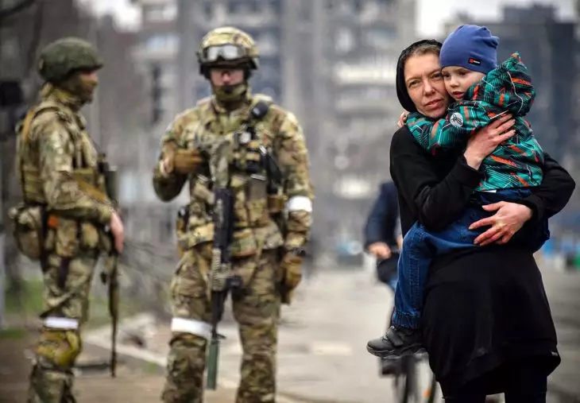
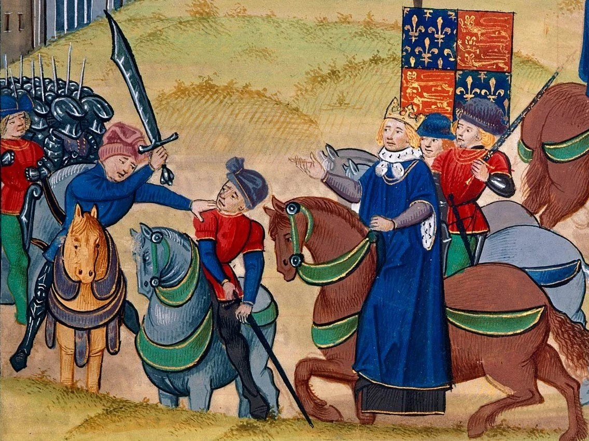

## Today's Agenda {background-image="./Images/background-scales_justice_v3.png" .center}

```{r}
# background-size="1920px 1080px"
library(tidyverse)
library(readxl)
```

<br>

**Section 1: Analyzing International Institutions**

<br>

**Sources of International Law**

- Treaties

<br>

::: r-stack
Justin Leinaweaver (Fall 2026)
:::

::: notes

Prep for Class

1. Review Canvas submissions

2. Bring paper and a pen for assigning principles at end of class

3. Readings
    - Cassese (2005), read p170-171 contrasting treaties under the old and new legal orders
    - Hollis (2012), read p19-30 on defining "treaties" in international law
    - The Vienna Convention on the Law of Treaties (1969)

<br>

**SLIDE**: This week we have been familiarizing ourselves with the sources of international law

:::


## {background-image="./Images/background-scales_justice_v3.png" .center .smaller}

::: {.r-fit-text}
**The Statute of the International Court of Justice (ICJ)**
:::

**Article 38**

1. The Court, whose function is to decide in accordance with international law such disputes as are submitted to it, shall apply: 

a. international conventions, whether general or particular, establishing rules expressly recognized by the contesting states; 

b. international custom, as evidence of a general practice accepted as law; 

c. the general principles of law recognized by civilized nations; 

d. subject to the provisions of Article 59, judicial decisions and the teachings of the most highly qualified publicists of the various nations, as subsidiary means for the determination of rules of law. 

::: notes

**Why is Article 38 of the Statute of the International Court of Justice a "useful" answer to the question, what are the sources of international law?**

<br>

The International Court of Justice (ICJ) is the principal judicial organ of the United Nations (UN).

- Think of a supreme court for the UN (e.g. SCOTUS)

- Its two main jobs are to 1) settle legal disputes between states, and 2) give advisory opinions to the UN when questions about international law come up

<br>

Article 38 represents the UN sanctioned list of "things" we should consider when judging disputes in international politics 

- This represents the codified consensus of the world as to what is meant by "international law"

<br>

Of course, the Cassese chapter gave us a bunch of caveats to this, right?

- List is hierarchical for the ICJ, but is not an argument that one source is more important than the others in the big picture

- Different countries and groups all contest the concepts in this list to some degree

- etc.

<br>

**Everybody with me here?**
    
<br>

**SLIDE**: Last class we focused on the second item in this list international customary law

:::


## {background-image="./Images/background-scales_justice_v3.png" .center .smaller}

::: {.r-fit-text}
**The Statute of the International Court of Justice (ICJ)**
:::

**Article 38**

1. The Court, whose function is to decide in accordance with international law such disputes as are submitted to it, shall apply: 

a. international conventions, whether general or particular, establishing rules expressly recognized by the contesting states; 

b. [**international custom, as evidence of a general practice accepted as law;**]{style="color:blue;"}

c. the general principles of law recognized by civilized nations; 

d. subject to the provisions of Article 59, judicial decisions and the teachings of the most highly qualified publicists of the various nations, as subsidiary means for the determination of rules of law. 

::: notes

Ok, catch me up further on the big picture here

- **How would you explain customary international law to a normal person?**

<br>

In short...

1. States do a thing because they believe they need to (e.g. political or economic exigencies)

    - What Cassese refers to as "opinio necessitatis" or "practice dictated by necessity"

2. Most other states act similarly, and no "strong" objections arise

3. Eventually states come to see the rule as a legal obligation and follow it for that reason

    - What Cassese refers to as "opinio juris" or 'practice dictated by law'
    
<br>

**SLIDE**: Let's see that process in action

:::


## {background-image="./Images/background-scales_justice_v3.png" .center}

::: {.r-fit-text}
**Examples of Customary International Law**
:::

<br>

**You may not target civilians (e.g. non-combatants) in a war**

:::: {.columns}

::: {.column width="50%"}
{style="display: block; margin: 0 auto"}
:::

::: {.column width="50%"}

<br>

1. Opinio necessitatis 

2. No “strong and consistent” opposition 

3. Opinio juris
:::

::::

::: notes

Let's talk about the customary law that you may not target civilians (e.g. non-combatants) in a war

- **What kinds of exigencies or needs would lead a country to implement this rule on their own soldiers?**

- **Why is it likely that this rule never generated much opposition from states?**

<br>

**Give me another example of this process in action**

- **Cases we discussed in class or in the book chapter?**

- (Diplomatic immunity for ambassadors)

- (Control over the natural resources on the continental shelf extending from your coastline)

- (Many of the rules governing behavior in outer space were laid out in response to the escalating space race between the Soviets and the US. A UN GA resolution in 1963, *the Declaration of Legal Principles Governing the Activities of States in the Exploration and Use of Outer Space*, was later acknowledged by the ICJ as a legal obligation)

<br>

**Was the consensus of the class that Tannenwald's "nuclear taboo" is customary international law? Why or why not?**

<br>

**Any questions on our work on customary international law last class?**

<br>

**SLIDE**: Today we talk treaties!

:::


## {background-image="./Images/background-scales_justice_v3.png" .center .smaller}

::: {.r-fit-text}
**The Statute of the International Court of Justice (ICJ)**
:::

**Article 38**

1. The Court, whose function is to decide in accordance with international law such disputes as are submitted to it, shall apply: 

a. [**international conventions, whether general or particular, establishing rules expressly recognized by the contesting states;**]{style="color:blue;"}

b. international custom, as evidence of a general practice accepted as law;

c. the general principles of law recognized by civilized nations; 

d. subject to the provisions of Article 59, judicial decisions and the teachings of the most highly qualified publicists of the various nations, as subsidiary means for the determination of rules of law. 

::: notes

**Anybody want to take a stab at why we started with custom and not treaties this week?**

<br>

Two big reasons:

1. Historically speaking, custom is the original source of both domestic and international law, and

2. As we're about to discuss, under the old world order treaties were not the tools we think of them as today

<br>

**SLIDE**: Let's start there!

:::


## {background-image="./Images/background-scales_justice_v3.png" .center}

::: {.r-fit-text}
**Cassese (2005) on Treaties under the "Old" Order**
:::

{style="display: block; margin: 0 auto"}

::: notes

I had you read two small excerpts from the Cassese chapter on treaties because they help connect us to the old world order

- e.g. Think Hugo Grotius and his justifications of war

<br>

**Talk to me about treaty-making in the "old" legal order**

- **What stood out to you from the reading?**

<br>

In essence, treaties under the old legal order were a form of extortion in writing

- Weaker states were often coerced into accepting the terms of a treaty

- While there were rules meant to invalidate the worst of these treaties, there are almost no examples of them being invoked successfully

- This means threats against negotiators were used, and so were misrepresentations of the facts on the ground (e.g. misleading maps)

- In terms of interpreting what a treaty actually said, the principle was that the treaty should always be read so as to NOT interfere in the sovereignty of the states

- And, even if a weak state got a powerful state to agree to certain rules, powerful states could simply walk away (denounce) whenever they wished 

<br>

**Does this sound anything like the negotiating style of any world leaders today?**

- President Trump threatens to invade the territory of a treaty ally (Greenland, Denmark and NATO)

- President Trump threatens to invalidate our security arrangements with South Korea because they won't join his war with Iran

- President Trump tears up the JCPOA nuclear deal with Iran then launches a war against them

- President Trump pulls the US out of the WHO, the UNFCCC, and on and on and on

<br>

A dangerous side road to get lost down...

- **SLIDE**: Ok, but what IS a treaty?

:::


## {background-image="./Images/background-scales_justice_v3.png" .center}

**Vienna Convention on the Law of Treaties (1969)**

<br>

**Article 2**

1. For the purposes of the present Convention: 

(a) “treaty” means an international agreement concluded between States in written form and governed by international law, whether embodied in a single instrument or in two or more related instruments and whatever its particular designation

::: notes

The Vienna Convention on the Law of Treaties (1969) represents a codification and extension of the customs related to treaties and treaty-making that have developed since WWII.

<br>

In short...

- "A treaty is basically an agreement between parties on the international scene" (Shaw 2008, 903). 

- When you hear words like convention, protocol, act, charter, covenant, pact, concordat THINK treaty

<br>

The Hollis chapter excerpt goes through this definition with a fine-toothed comb!

- **What did you think of Hollis' style of writing?**

- For those of you heading to law school, you'll have to grow to love it!

<br>

**SLIDE**: Let's selectively highlight some of the points being made by Hollis in the excerpt

:::


## {background-image="./Images/background-scales_justice_v3.png" .center}

**Vienna Convention on the Law of Treaties (1969)**

<br>

**Article 2**

1. For the purposes of the present Convention: 

(a) “treaty” means an [**international agreement**]{style="color:blue;"} concluded between States in written form and governed by international law, whether embodied in a single instrument or in two or more related instruments and whatever its particular designation

::: notes

Hollis argues that "international agreement" adds to our definition in three important ways

- Let's briefly talk through them to see if we can clarify why they are important

<br>

**What does including the word "international" do in the definition?**

- (It bounds the scope of the agreement either in terms of the international actors involved OR the obligations being created in international law)

- So, a treaty either involves international actors OR creates obligations in international law

<br>

**What is the first key thing the word "agreement" does in the definition?**

- (A treaty requires multiple participants generating actual commitments)

- ("Commitment" meaning "a shared expectation of future behavior" either a change in the status quo or a continuation of current behavior)

- So, "treaty" is a special form of international law that is more than just a piece of paper issued by countries with various words on it

- It must represent actual commitments of behavior

<br>

**What is the second key thing the word "agreement" does in the definition?**

- (Reveals an ongoing debate!)

- On one side: "Agreement" refers to "the actual shared expectation of commitment"

    - e.g. the commitment includes the understandings we generated during the negotiation

- On the other side: "Agreement" refers to the treaty instrument itself

    - e.g. the commitment depends on the words on the page

<br>

THIS is Hollis starting to think like a political scientist, and not just as a lawyer

- As social scientists we know that state behavior depends on FAR more than just where the commas ended up in the treaty

- This means understanding outcomes starts with treaty text, but should never end there!

<br>

**SLIDE**: I think "concluded between states" and "in written form" are pretty clear, so let's jump to what isn't as clear.

:::


## {background-image="./Images/background-scales_justice_v3.png" .center}

**Vienna Convention on the Law of Treaties (1969)**

<br>

**Article 2**

1. For the purposes of the present Convention: 

(a) “treaty” means an international agreement concluded between States in written form and [**governed by international law**]{style="color:blue;"}, whether embodied in a single instrument or in two or more related instruments and whatever its particular designation

::: notes

**Why does Hollis argue that "governed by international law" is the most important and controversial part of the definition?**

<br>

For some, this simply states the fact that a treaty is international law and is, therefore, interpreted by the rules of international law

<br>

However, Hollis argues the importance of this addition comes when there is dispute about whether something IS or IS NOT a treaty

- This actually does arise as a problem quite frequently where after discussions one country thinks commitments were made and the other does not

- This seems to be a monthly occurrence for the Trump administration

<br>

Fundamentally, for a treaty to exist state participants must have intended for a treaty to exist

- Seems straightforward, but in practice can be harder to figure out

- Helpful if states use the word "treaty" in their output or the word "shall" in the text

- BUT "there are no magic words to create a treaty or deny an agreement that status"

<br>

Let's next use the Vienna Convention on the Law of Treaties to clarify a few other important things

- **SLIDE**: Everybody read Article 11

:::


## {background-image="./Images/background-scales_justice_v3.png" .center}

**Vienna Convention on the Law of Treaties (1969)**

<br>

**Article 11**

The consent of a State to be bound by a treaty may be expressed by signature, exchange of instruments constituting a treaty, ratification, acceptance, approval or accession, or by any other means if so agreed. 

::: notes

So, let's imagine that multiple participants have drafted a treaty that includes mutual obligations

- The question next becomes, how do they "bind themselves" to it?

- In other words, how do they make the commitment "official" in international law terms?

- Remember, treaties ONLY bind the states that have committed to them

<br>

Article 11 introduces the various conceptual ways a treaty may establish the rules of participation

- Articles 12 through 18 then give the basic rules of these options

<br>

Under the "old" order signature was typically the binding act

- Communication and travel across the globe was slow so political leaders empowered their negotiators to make deals and commit to them on their own

- This is what Article 12 refers to as giving your representative "full powers"

<br>

In today's world signature has become an act of political theater and now all countries use ratification as the binding decision

- **Does anybody know what the ratification involves?**

- (Essentially, it is a domestic process whereby some group beyond the state's executive agree to join the treaty)

- (In democracies its the legislature, in dictatorships it can be a council of advisors or a legislature or some other group of political elites)

<br>

**Why do you think essentially all states, even dictatorships, have moved to ratification as the key binding step?**

- **Does anybody think Vladimir Putin wants the Duma to weigh in on his decisions?**

<br>

The preference for ratification has been the result of both domestic and international pressures

1. International Pressure: Other states want some assurance these agreements will last

    - Need to know your state is committed and not just until the next election.

    - Assures buy-in from the wider society for the deal.

    - Means a change in leadership SHOULD be less likely to upend tons of international law.

2. Domestic Incentive: Spread the blame for unpopular deals

    - Spreads the blame across the elites.

3. Domestic Incentive: Gives elites a seat at the table.

    - Protection for the leader from those who might wish to replace them.

<br>

**SLIDE**: The Vienna Convention represents a stark break with the old legal order

:::


## The New Legal Order {background-image="./Images/background-scales_justice_v3.png" .center}

<br>

**Article 31**: A treaty shall be interpreted in good faith...

**Article 34**: A treaty does not create either obligations or rights for a third State without its consent. 

**Articles 49-52**: Treaties agreed using fraud or coercion have no legal effect

**Article 53**: Treaties that violate jus cogens have no legal effect

**Article 54**: Termination of a treaty requires consultation with the other treaty participants

::: notes

I cannot emphasize strongly enough how much the Vienna Convention represents a break with the old world legal order.

- I'm not sure how these principles will survive the Trump administration but I remain hopeful.

<br>

We haven't yet discussed the jus cogens in Article 53

- "Compelling law" aka "peremptory norms"

- These are customary international laws that cannot be appealed, modified or ignored.

- Examples: aggression, colonial domination, slavery, genocide, apartheid, massive pollution of atmosphere or seas, racial discrimination, torture, war crimes, crimes against humanity.

<br>

So, you can't use a treaty to create international laws committing genocide, war crimes, etc.

- Kind of a big deal change (unfortunate it was needed)

<br>

**Any questions on the basics of treaty law?**

<br>

**SLIDE**: Let's hear your examples!

<br>

**NOTES**

The Making of Treaties

Formalities (907-909)

- "Treaties may be made or concluded by the parties in virtually any manner they wish. There is no prescribed form or procedure..." (907)
- There are some rules that apply to the creation of international conventions: To represent a state in a treaty negotiation a person must have "full powers" (see Art 7 of Convention), but being head of state automatically confers such authority per the ICJ's previous rulings.

Consent (909-913)

- "...since states may (in the absence of a rule being also one of customary law) be bound only by their consent" (910).
- Text of agreement must be "adopted" by negotiators (Art 9)
- Then each state must signify its intent to be bound by the treaty
- Art 11: Signature, exchange of instruments, ratification, acceptance, approval, accession or whatever other procedure the states agree on. (910)

Other Shaw (2008) sections

- Entry into Force (925-926)
- Application of Treaties (926-930)
- The amendment and modification of treaties (930-932)
- Treaty interpretation (932-938)
- Invalidity, Termination and Suspension of the operation of treaties (939-953)
- Dispute Settlement (952-953)
- Treaties between states and IOs (953-955)

:::


## {background-image="./Images/background-scales_justice_v3.png" .center}

::: {.r-fit-text}

**The United Nations Treaty Collection**

1. What treaty did you pick?

2. Why did you pick it?

3. What problem is it trying to solve?

:::

::: notes

For today I asked each of you to review the treaties held in the UN Treaty Collection and find us coole examples to discuss

- **Was this your first time exploring the UN TC?**

- **Big picture impressions of the treaties that exist?**

<br>

PRESENT and DISCUSS each

- *Track problems being targeted on the board*

<br>

**SLIDE**: For next class

<br>

Canvas DISCUSSION: International Treaties

Select a treaty from the UN Treaty Collection (no overlapping cases; first-come, first-served) and report back to us on the following:

1. What is the treaty you have selected?
2. Provide a web link to the treaty page on the UNTC website
3. Why did you select this treaty? (e.g. Why are you interested in this area of international law?)
4. Read the preamble of the treaty (assuming it has one this would be the text BEFORE Article 1) and tell us why this treaty exists. In other words, and according to the text of the treaty itself, what problem were the participants trying to solve?

Note: The UNTC webpage "Multilateral Treaties Deposited with the Secretary-General" has links to treaties organized by subject (in chapters). Select a "chapter" you are interested in and that will take you to a list of treaties in that subject area. Each treaty page should include a pdf of the treaty itself, the participants and the recorded reservations.

:::


## {background-image="./Images/background-scales_justice_v3.png" .center .smaller}

::: {.r-fit-text}
**The Statute of the International Court of Justice (ICJ)**
:::

**Article 38**

1. The Court, whose function is to decide in accordance with international law such disputes as are submitted to it, shall apply: 

a. [**international conventions, whether general or particular, establishing rules expressly recognized by the contesting states; **]{style="color:blue;"}

b. [**international custom, as evidence of a general practice accepted as law;**]{style="color:blue;"}

c. the general principles of law recognized by civilized nations; 

d. subject to the provisions of Article 59, judicial decisions and the teachings of the most highly qualified publicists of the various nations, as subsidiary means for the determination of rules of law. 

::: notes

Ok, how are we doing so far?

- **Does everybody have a good sense of how to answer the question "what is international law" using Article 38 of the Statutes of the ICJ?**

<br>

Our assignment for Friday will be to use the Cassese book to unpack the third item on this list

- **SLIDE**: Cassese proposes a set of six fundamental principles and I want us to evaluate them

:::


## For Next Class {background-image="./Images/background-scales_justice_v3.png" .center}

<br>

**The "Fundamental Principles" (Cassese Chapter 3)**

- The Sovereign Equality of States (3.2)
- Non-Intervention in the Int. / Ext. Affairs of Other States (3.3)
- Prohibition of the Threat or Use of Force (3.4)
- Peaceful Settlement of Disputes (3.5)
- Respect for Human Rights (3.6)
- Self-Determination of Peoples (3.7)

::: notes

Ok, here's the deal.

- We're going to divy out these six principles to the class and your job will be to help us evaluate your assigned principle

<br>

ON BOARD (3.2 to 3.7): So, three people per principle, let's claim slots!

<br>

Details of the assignment are on Canvas

- **Any questions?**

- See you next class!

<br>

Canvas DISCUSSION: Recent Cases of the "Fundamental Principles" in Action

Your assignment is to find a case (e.g. news article, press release, etc.) that demonstrates one of the principles in Cassese Chapter 3 in action on the global stage. For example, a state representative could invoke this principle as a justification for an action they have taken, or a state representative / NGO / non-state actor may cite this principle as a call for action by others. I will assign you ONE of the principles to focus on for this assignment.

1. Submit an APA citation for the case you have found,
2. Explain how your chosen case exhibits your assigned principle, and
3. Evaluate the principle being invoked here. Is this evidence that the princple matters in a substantial way or not?

The Principles (Cassese Chapter 3)

- The Sovereign Equality of States (3.2)
- Non-Intervention in the Int. / Ext. Affairs of Other States (3.3)
- Prohibition of the Threat or Use of Force (3.4)
- Peaceful Settlement of Disputes (3.5)
- Respect for Human Rights (3.6)
- Self-Determination of Peoples (3.7)


:::

