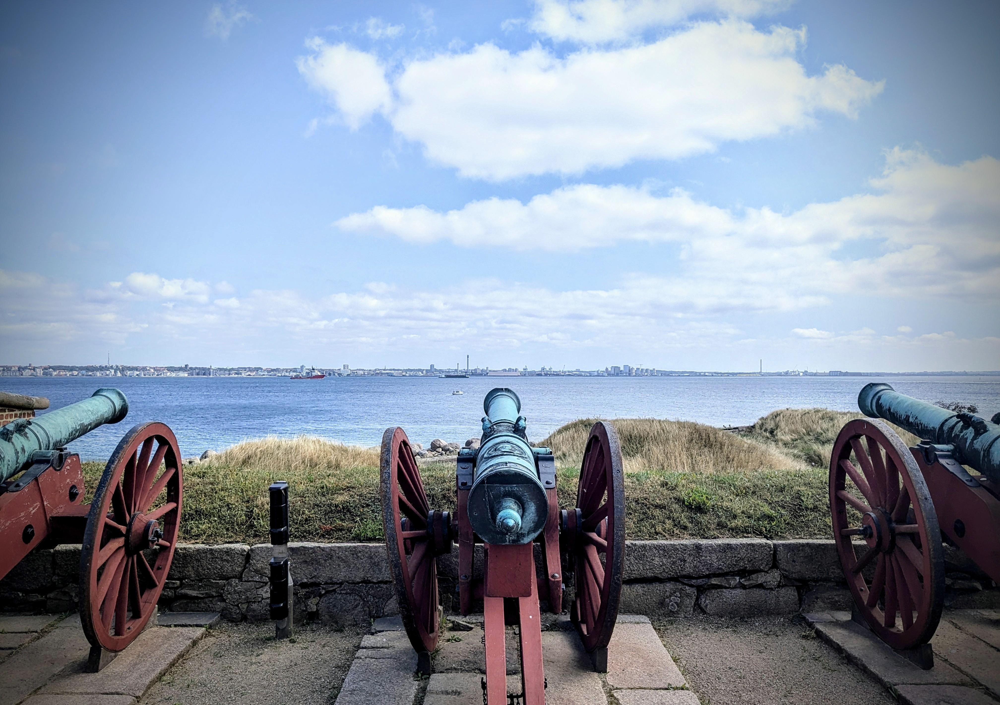

## Today's Agenda {background-image="./Images/background-scales_justice_v3.png" .center}

```{r}
# background-size="1920px 1080px"
library(tidyverse)
library(readxl)
```

<br>

**Section 1: Analyzing International Institutions**

<br>

**Sources of International Law**

- "The Fundamental Principles Governing International Relations"

- *Sit in groups (by assigned fundamental principle)*

<br>

::: r-stack
Justin Leinaweaver (Fall 2026)
:::

::: notes

**Prep for Class**

1. Check Canvas submissions

2. Markers x 4

<br>

**SLIDE**: Our work this week

:::


## {background-image="./Images/background-scales_justice_v3.png" .center .smaller}

::: {.r-fit-text}
**The Statute of the International Court of Justice (ICJ)**
:::

**Article 38**

1. The Court, whose function is to decide in accordance with international law such disputes as are submitted to it, shall apply: 

a. international conventions, whether general or particular, establishing rules expressly recognized by the contesting states; 

b. international custom, as evidence of a general practice accepted as law; 

c. the general principles of law recognized by civilized nations; 

d. subject to the provisions of Article 59, judicial decisions and the teachings of the most highly qualified publicists of the various nations, as subsidiary means for the determination of rules of law. 

::: notes

**One more time, why is this a good answer to the question, what is international law?**

- (The International Court of Justice (ICJ) is the principal judicial organ of the United Nations (UN))

- Article 38 represents the UN sanctioned list of "things" we should consider when judging disputes in international politics 

- SO, This represents the codified consensus of the world as to what is meant by "international law"

<br>

**SLIDE**: Last class we focused on the second item in this list international customary law

:::


## {background-image="./Images/background-scales_justice_v3.png" .center .smaller}

::: {.r-fit-text}
**The Statute of the International Court of Justice (ICJ)**
:::

**Article 38**

1. The Court, whose function is to decide in accordance with international law such disputes as are submitted to it, shall apply: 

a. international conventions, whether general or particular, establishing rules expressly recognized by the contesting states; 

b. [**international custom, as evidence of a general practice accepted as law;**]{style="color:blue;"}

c. the general principles of law recognized by civilized nations; 

d. subject to the provisions of Article 59, judicial decisions and the teachings of the most highly qualified publicists of the various nations, as subsidiary means for the determination of rules of law. 

::: notes

This week we have been exploring the primary sources of international law

<br>

On Monday we analyzed how customs could produce international law

- **Tell me this story using an example, how can custom create an international law?**

- (Diplomatic immunity: We need ambassadors to do their jobs so leave them alone)

- (Foreign diplomatic premises are inviolable)

- (Countries control their own natural resources and the continental shelf is their land extending into the ocean, so, they are entitled to it!)

- (Innocent passage of foreign ships in territorial sea)

- (Protecting non-combatants during war)

<br>

**SLIDE**: My favorite example!

:::


## Customary Law: Territorial Seas {background-image="./Images/background-scales_justice_v3.png" .center}

{style="display: block; margin: 0 auto"}

::: notes

Under the old legal order there was continuous disputes over how much of the sea a country could claim as its own territory

- The Dutch jurist Cornelius van Bynkershoek proposed the three-mile rule because that's how far cannons could shoot at the time

- So, the sea you can defend is the sea you can claim!

<br>

Some historians argue the three mile rule may actually have been either:

- One league (e.g. approximately three miles) which is the common unit of distance at sea at the time, or

- The approximate distance of the horizon from shore for a six foot tall person

- But I prefer the cannon story!

<br>

This standard lasted some 200 years, but over time defense technologies improved and countries wanted to push the border out further

- Ultimately, the UN Convention on the Law of the Sea codified a standard of 12 miles for territorial waters

<br>

**SLIDE**: Last class we shifted to treaties

:::


## {background-image="./Images/background-scales_justice_v3.png" .center .smaller}

::: {.r-fit-text}
**The Statute of the International Court of Justice (ICJ)**
:::

**Article 38**

1. The Court, whose function is to decide in accordance with international law such disputes as are submitted to it, shall apply: 

a. [**international conventions, whether general or particular, establishing rules expressly recognized by the contesting states; **]{style="color:blue;"}

b. international custom, as evidence of a general practice accepted as law;

c. the general principles of law recognized by civilized nations; 

d. subject to the provisions of Article 59, judicial decisions and the teachings of the most highly qualified publicists of the various nations, as subsidiary means for the determination of rules of law. 

::: notes

On Wednesday we analyzed how treaties can create international law

- **How does this process differ from that created by means of custom?**

<br>

Per Cassese:

- Many synonyms: treaties, conventions, protocols, covenants, acts, etc

- Major feature: "they only bind the parties to them"

- For "third states... treaties are something devoid of legal consequence"

- "In short, nothing can be one without or against the will of a sovereign state."

- And, of course, under the current legal order signature is NOT ratification!

<br>

What were some of the interesting treaties you found for last class!

- **What problem were they tying to solve and how widespread was the adoption?**

<br>

**SLIDE**: Our work for today

:::


## {background-image="./Images/background-scales_justice_v3.png" .center .smaller}

::: {.r-fit-text}
**The Statute of the International Court of Justice (ICJ)**
:::

**Article 38**

1. The Court, whose function is to decide in accordance with international law such disputes as are submitted to it, shall apply: 

a. international conventions, whether general or particular, establishing rules expressly recognized by the contesting states; 

b. international custom, as evidence of a general practice accepted as law;

c. [**the general principles of law recognized by civilized nations;**]{style="color:blue;"}

d. subject to the provisions of Article 59, judicial decisions and the teachings of the most highly qualified publicists of the various nations, as subsidiary means for the determination of rules of law. 

::: notes

Today we explore the third source of international law enumerated by the Statutes of the ICJ

- What Cassese describes as the "fundamental principles governing international relations"

<br>

In Chapter 3 Cassese makes the argument that if you carefully review all of international law you will discover a set of ideas held in common by all states that describe a sort of global constitution.

- In Cassese's words, these principles can be found from a "careful consideration of international practice"

- And by "international practice" he includes: treaties, UN General Assembly resolutions, Declarations of states, Statements by government representatives in the UN, diplomatic practice and case law

<br>

**What are the two characteristics Cassese asserts are true of each of these “fundamental principles”?**

- (p48: 1. universal scope; 2. legally binding force)

<br>

**What is universal scope?**

- (Applies to all and in all places)

**What is legally binding force?**

- (All states committed to these principles.)

<br>

**SLIDE**: Sound impressive and important, no?

:::


## {background-image="./Images/background-scales_justice_v3.png" .center}

**The "Fundamental Principles" (Cassese Chapter 3)**

- The Sovereign Equality of States (3.2)
- Non-Intervention in the Int. / Ext. Affairs of Other States (3.3)
- Prohibition of the Threat or Use of Force (3.4)
- Peaceful Settlement of Disputes (3.5)
- Respect for Human Rights (3.6)
- Self-Determination of Peoples (3.7)

::: {.fragment}
1. [Explain the principle in simple terms, and]{style="color:blue;"}

2. [Illustrate with the cases you found]{style="color:blue;"}
:::

::: notes

For today each of you selected a single principle and gathered data meant to help us understand and evaluate these principles in our world

- **Is everybody sitting in groups by "fundamental principle"?**

<br>

Let's begin today with clarification

- **REVEAL**: Groups, I want you to explain your principle to us

- Use your cases to help us understand just what the principle means

- NOT time for analysis yet. Save your "is this working or not?" argument for later

- Just introduce us to the basics

- **Make sense?**

- Go!

<br>

*PRESENT EACH (BUT save ANALYSES for next step)*

<br>

**Notes**

1. The Sovereign Equality of States (48-53)

    - PART 1: Sovereignty - The section specifies SIX sweeping powers tied to this principle
        1) "The power to wield authority over all the individuals living in the territory"
        - This power is referred to as "jurisdiction" (e.g. the power of central authority to exercise public functions over individuals located in a territory)
        - There are multiple forms of jurisdiction: 1) prescriptive jurisdiction (states may pass binding legislation applicable to persons and entities in the territory of the State; may also include legislation targeting the State's nationals behavior while abroad AND extraterritorial legislation pertaining to conduct abroad that is "prejudicial to the state"); 2) jurisdiction to adjudicate (the power to pronounce on legal disputes); 3) jurisdiction to enforce (normally confined to acts committed on your own territory
        2) The power to freely use and dispose of the territory under the state's jurisdiction and perform all activities deemed necessary or beneficial to the population living there 
        3) The right that no other state intrude in the state's territory. aka the right to exclude others
        4) The right to immunity from the jurisdiction of foreign courts for acts or actions performed by the State in its sovereign capacity, and for execution measures taken against the use or planned use of public property or assets for the discharge of public functions 
        5) The right to immunity for state representatives acting in their official capacity 
        6) The right to respect for life and property of the State's nationals and State officials abroad
    - PART 2: Equality of states - All sovereign states on equal footing.
        - "Alternatively, legal constraints, if any, are only valid if accepted, in full freedom, by the State concerned"

2. Non-Intervention in the Internal or External Affairs of Other States (53-55)

    - Very much rooted in the old world model (thanks Hugo Grotius), enshrined in a few customary rules
    1) A state may not interfere in the internal organization of a foreign state.
    2) States may not encroach on the internal affairs of other States (don't apply pressure to specific national bodies like a court or legislature
    3) States must refrain from "instigating, organizing or officially supporting the organization on their territory of activities prejudicial to foreign countries". This one is NOT as sweeping a rule as it appears. Doesn't include subversive activity carried out by "private persons without State involvement" 
    4) State may not aid insurgents in a civil war (unless they qualify as a national liberation movement)
    - BUT, in the old era (pre-1945) states were allowed to ignore these rules if they felt their interests were at stake
    - Since 1945 these rules have been bolstered by 1) "far-reaching legal restraints on the use or threat of force", 2) the drive towards international cooperation has expanded the opportunity for IGOs and States to interfere in each others interests which makes states want to clarify the areas that are off-limits for interference, and 3) the spread of human rights doctrines empowering states AND INDIVIDUALS ability to challenge the actions of States
    - Much debate about whether other forms of pressure count against these rules (e.g. economic pressure, fomenting unrest, propaganda, etc). Very hard to "verify compliance" with the rules given the rule as elaborated in the UN Declaration of 1970: "Only those economic measures designed 'to coerce another state in order to obtain from it the subordination of the exercise of its sovereign rights and to secure from it advantages of any kind."
    - Cassese argues this remains a very important principle despite the problem of evaluating it.

3. Prohibition of the Threat or Use of Force (55-57)

    - Don't forget, some general rules exist that explicitly allow the use of force which complicates interpreting this principle
    - First laid down by the UN Charter (Art 2.4), Cassese interprets it as including:
    1) An "absolute all-inclusive prohibition"
    2) Only military force proscribed (not economic sanctions)
    3) Ony interstate threats banned (repress your own people as you wish)
    - In the 1970s pressure from "socialist and afro-asian countries" led to elaborations/tweaks in the 1970 Declaration on Friendly Relations and the the 1974 Declaration on the Definition of Aggression. Currently seems to be:
    1) No threat or use of force against groups with a representative organization if entitled to self-determination
    2) ICJ held in 1986 that we must distinguish between "armed attack" and other threats or use of force that do not constitute an armed attack (assistance to rebels)
    3) Force must not be used to forestall an imminent attack (anticipatory self defense)
    - The debate about pre-emption does not appear settled. UN Charter seems to ban it, but countries like the US and Israel argue that in a world of missles and nukes waiting for attack before responding would lead to massive killings and destruction
    4) You cannot use force against an "indirect armed aggression"
    5) You cannot use conquest to take territory belonging to another state or people. There is no transfer of legal sovereignty even if you come to occupy the territory
    6) Extreme forms of economic coercion are banned

4. Peaceful Settlement of Disputes (58-9)

    - A natural extension of the prohibition against force in the UN Charter. States obligated to pursue peaceful resolutions and must be done in meaningful ways, not just keeping up appearances or faking it.
    1) States are mandated to, in good faith (bona fide), endeavor to resolve their disputes peacefully (e.g. negotiation, conciliation, mediation, arbitration, judicial)
    2) In the event of failure of the chosen mechanism, states are compelled to try a different peaceful option
    3) States must 'refrain from any action which may aggravate the situation so as to endanger the maintenance of international peace and security'

5. Respect for Human Rights (59-60)

    - Arguably this principle DIRECTLY CONFLICTS with sovereignty and non-interference principles.
    - "... no state currently challenges the concept that human rights must be respected everywhere in the world"
    - The "general principle" prohibits "gross and large-scale violations of basic human rights and fundamental freedoms
    - Massive infringements make a state accountable to the whole community, but sporadic or isolated violations probably not of general concern.
    - This principle DOES NOT create a list of specific regulations States must obey; Instead, the goal is to avoid serious and repeated infringements 

6. Self-Determination of Peoples (60-64)

    - The acceptance of this principle has been selective and limited (to avoid encouraging chaos). 
    - Firmly entrenched in ONLY three circumstances: 1. anti-colonialism, 2. ban on foreign military occupation, 3. all racial groups must have full access to government.
    1) States which oppress peoples falling within one of the three categories are duty-bound to allow the free exercise of self-determination.
    2) The peoples entitled to self-determination have a legal right in relation to the oppressor state as well as a host of Rights and claims in regard to other states. 
    3) Third states are legally authorized to support people's entitled to self-determination by granting them any assistance short of dispatching armed troops. Conversely, they must refrain from aiding and abetting oppressor states.
    - Implications for the principles on the use of force: In terms of legitimate use of force this principle has had two main effects. First it prohibits States from using Force to deny self-determination, but second, it seems to give a sort of legal license to use force to the groups who have been denied self-determination.
    - Major Limitation: Specifically, does not currently apply to ethnic groups, and national, religious, cultural or linguistic minorities.
    - The desire to extend rights to these groups runs directly into the important values held by states related to political stability and territorial integrity. There is also the practical danger of granting such rights to any and all groups seeking it as this could lead to chaos of state fragmentation

:::


## {background-image="./Images/background-scales_justice_v3.png" .center}

::: {.r-fit-text}
**Assessing Cassese's "Fundamental Principles" in the world today**
:::

::: {.fragment}

- Agreement: Strongly disagree, Disagree, Neither, Agree, Strongly agree

- Frequency: Never, Rarely, Sometimes, Often, Always

- Importance: Not important, Slightly important, Moderately important, Important, Very important

- Quality: Very poor, Poor, Acceptable, Good, Very good

:::

::: notes

*Split class into groups across the principles, e.g. create groups of students who each studied a different one*

- *(4 groups to maximize board space)*

- Go sit with your new group and claim some space on the board

<br>

Ok, groups, your next job is to analyze the "fundamental principles"

- BUT, to make this easier and to allow us to compare across groups, I first want us to design a measurement scale

<br>

**REVEAL**: Here are examples of five-point Likert scale measures

- Groups, take a couple minutes to design a measurement tool we can use

- **Questions on the task?**

- Work directly on the board so we can see where you're going

<br>

*PRESENT and DISCUSS each*

<br>

**Ok, which one (or two?) are we adopting?**

<br>

**SLIDE**

:::


## {background-image="./Images/background-scales_justice_v3.png" .center}

::: {.r-fit-text}
**Assessing Cassese's "Fundamental Principles" in the world today**
:::

- The Sovereign Equality of States (3.2)
- Non-Intervention in the Int. / Ext. Affairs of Other States (3.3)
- Prohibition of the Threat or Use of Force (3.4)
- Peaceful Settlement of Disputes (3.5)
- Respect for Human Rights (3.6)
- Self-Determination of Peoples (3.7)

::: notes

Excellent, groups, your next job is to apply this tool (or tools ) to the six principles

- Classify all six on the board and get ready to explain your analyses to the class

- Go!

<br>

*Evaluate each principle and discuss*

<br>

**SLIDE**: Wrapping it up

:::


## {background-image="./Images/background-scales_justice_v3.png" .center .smaller}

::: {.r-fit-text}
**The Statute of the International Court of Justice (ICJ)**
:::

**Article 38**

1. The Court, whose function is to decide in accordance with international law such disputes as are submitted to it, shall apply: 

a. international conventions, whether general or particular, establishing rules expressly recognized by the contesting states; 

b. international custom, as evidence of a general practice accepted as law; 
c. the general principles of law recognized by civilized nations; 

d. subject to the provisions of Article 59, judicial decisions and the teachings of the most highly qualified publicists of the various nations, as subsidiary means for the determination of rules of law. 

::: notes

Ok, here we are at the end of our second week

- **How are we doing? Do you have a good sense of the basics of international law from a lawyer's perspective?** 

<br>

**Based on our work this week, how would you explain international law to someone with no background in the material?**

- *Encourage this discussion as a chance to reflect on the complexity*

<br>

**SLIDE**: Very often, when I hear "international law" being invoked in the media, my reaction is...

:::


## {background-image="./Images/02_1-Princess_Bride.gif" .center}

::: notes

I love the Princess Bride. Such a good movie.

<br>

The umbrella term "international law" includes a number of fairly distinct kinds of rules

- Some of those rules seem to work a great deal like domestic law and some of them really don't

<br>

Our plan for next week is to segue from lawyers analyzing international law to political scientists analyzing it

- **SLIDE**: And that means it is time for some scientific theory!

:::


## Next Class {background-image="./Images/background-scales_justice_v3.png" .center}

<br>

**Do International Institutions Matter?**

- Realism (Mearsheimer) vs Institutionalism (Keohane)

- What can international institutions accomplish in the real world?

::: notes

Next week is our crash course in the IR theories relevant to our work in this class

- Monday we start with Mearsheimer's realism

- Read the excerpts I've assigned and give me your best version of the argument on Canvas

:::


