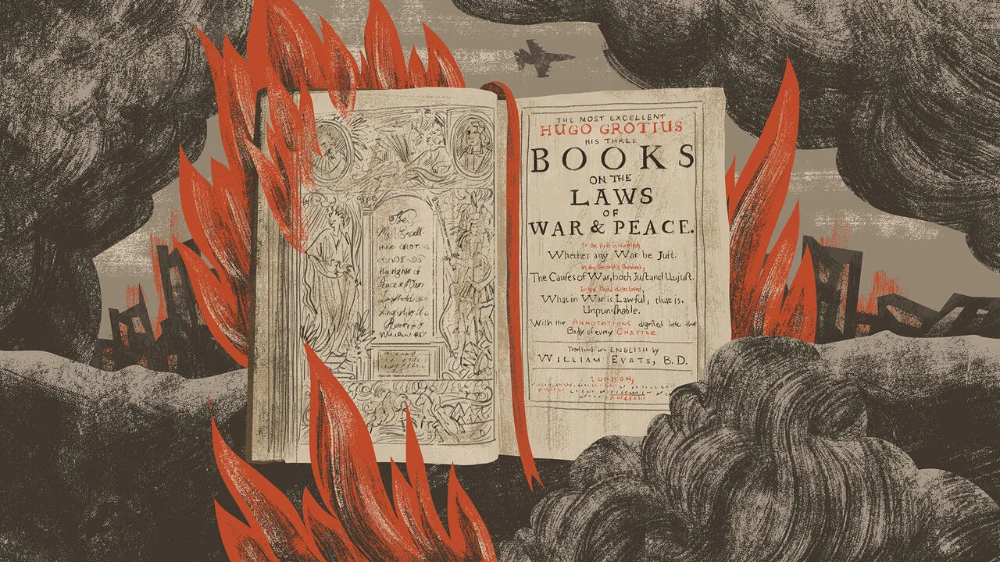
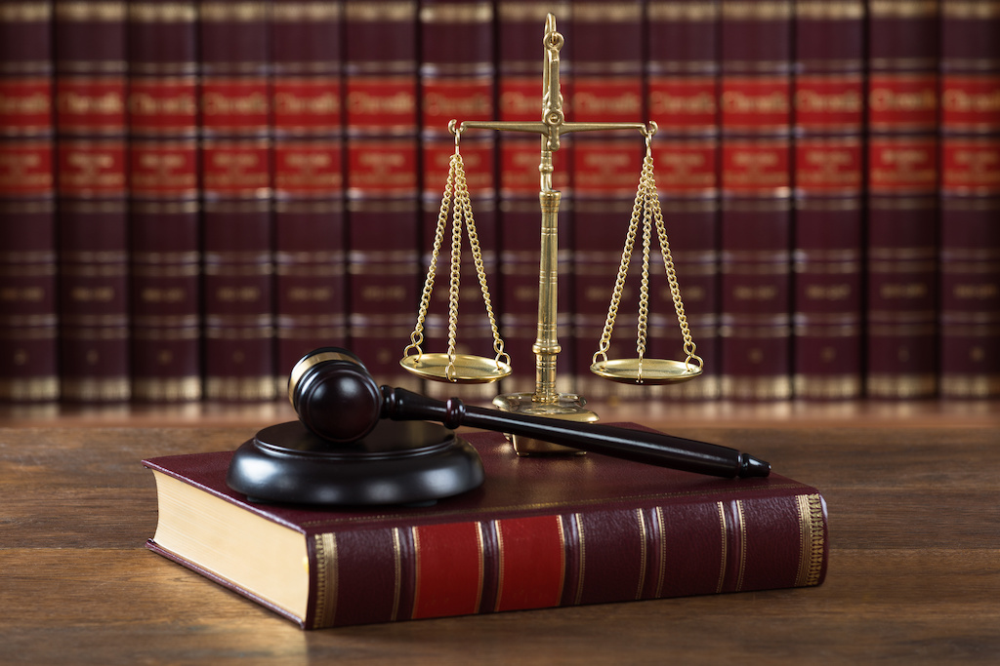
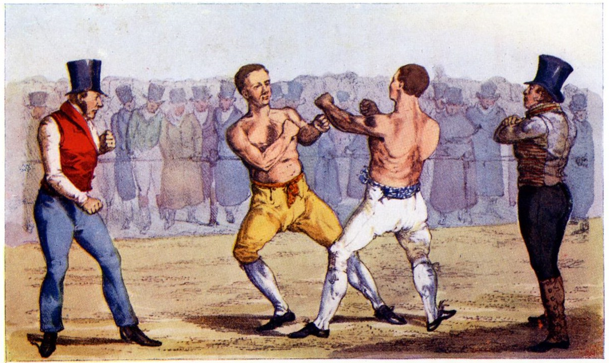

## Today's Agenda {background-image="./Images/background-scales_justice_v3.png" .center}

```{r}
# background-size="1920px 1080px"
library(tidyverse)
library(readxl)
```

<br>

**Section 1: Analyzing International Institutions**

<br>

**Do international institutions matter?**

- Mearsheimer's (1994) Argument

<br>

::: r-stack
Justin Leinaweaver (Fall 2026)
:::

::: notes

**Prep for Class**

1. Check Canvas submissions

<br>

The first section of our class this semester has focused on the foundational concepts, tools and ideas we need to analyze international institutions

<br>

**SLIDE**: To kick things off, we started with an introduction to the "old" legal order

:::


## {background-image="./Images/background-scales_justice_v3.png" .center}

::: {.r-fit-text}
**Hugo Grotius and the "Old" Legal Order**
:::

{style="display: block; margin: 0 auto"}

::: notes

And who better to introduce us to the "old" legal order than the so-called "father of international law," Hugo Grotius?

- **What were the key takeaways for you of studying the life and work of Hugo Grotius?**

- (Gets his big break when called upon to build a legal defense for Dutch piracy against the Portugese)

- (Advanced a principle that individuals have the private right to wage war so long as it is done outside state jurisdiction and to defend a "right", e.g. a "just" cause)

- (Developed a version of international order and war that basically gave states the right to do anything, e.g. might makes right)

- (He advanced "progressive" views about the equality of all people, BUT did it to justify economic exploitation)

<br>

Pre-WWII, international law was basically a permission slip for state brutality

- If a state wants to take "it" and they succeed in doing so, then the international community must recognize "it" as theirs

<br>

After the wars and atrocities of the early 20th century things began to change rapidly

- **SLIDE**: So, last week was our crash course in the letter of international law as it is understood by lawyers and judges

:::


## International law as a Textual Matter  {background-image="./Images/background-scales_justice_v3.png" .center}

{style="display: block; margin: 0 auto"}

::: notes

I think Cassese and Hollis did excellent jobs BOTH:

1. Mapping out the textual basics of international law today, and

2. Helping us see the many ways in which the structure of international law has evolved since the work of Grotius

<br>

**Recap for me, in what key ways has the system of international law changed since the "old" world order?**

<br>

- (The rise of new countries, especially socialist states and those in the developing world, put pressure on a system designed by, and primarily benefiting, old world powers)

- (A slow but steady chipping away at a system built on never doing anything to interfere with state sovereignty into one that began to prioritize the needs of the international community)

- (A significant attempt to codify customary law in order to clarify the rights and obligations of all states, BUT ALSO, to expand those rules to better reflect the interests of all states)

- (A significant expansion of the idea that human rights and the laws of conscience are also a source of important rules, e.g. no genocide or slavery regardless of state practice)

<br>

**SLIDE**: So, after two weeks of work we can now define international law from the perspective of international lawyers!

:::


## {background-image="./Images/background-scales_justice_v3.png" .center .smaller}

::: {.r-fit-text}
**The Statute of the International Court of Justice (ICJ)**
:::

**Article 38**

1. The Court, whose function is to decide in accordance with international law such disputes as are submitted to it, shall apply: 

a. international conventions, whether general or particular, establishing rules expressly recognized by the contesting states; 

b. international custom, as evidence of a general practice accepted as law; 
c. the general principles of law recognized by civilized nations; 

d. subject to the provisions of Article 59, judicial decisions and the teachings of the most highly qualified publicists of the various nations, as subsidiary means for the determination of rules of law. 

::: notes

**Remind me, what makes Article 38 of The Statute of the International Court of Justice such a good source for defining international law?**

<br>

(The ICJ is an international organization created as part of the UN system for adjudicating legal disputes between states)

- (They recruit the best legal minds from around the world and then give them very precise instructions for how to do their jobs)

- (THIS list represents an explicit listing of what, precisely, the UN community has come to define as "international law")

<br>

**As a quick recap, what did you find from our case studies last class?**

- **Are you convinced the "general principles" in part C are as universal and binding as Cassese argues? Why or why not?**

<br>

In a sense, I think of these principles as an academic exercise that make perfect sense from a lawyer's perspective

- He is generalizing from a sample of international instruments

- Underpinning all of these instruments seems to be a perspective on what is appropriate state behavior 

- So, I think he has usefully described a set of principles underpinning his sample

- Does that mean the principles themselves can settle future conflicts? I'm skeptical

- BUT, as a legal tool for adjudicating disputes in the ICJ I think it makes sense

<br>

And, of course, it turns out that all of this only scratches the surface of our interest in international law

- As social scientists we have learned over and over again that actual human behavior depends on far more than just what the rules say

- Our interest is in explaining actual outcomes in the political world and that means we need to restate the question

- **SLIDE**

:::


## Do international institutions matter? {background-image="./Images/background-scales_justice_v3.png" .center}

{style="display: block; margin: 0 auto"}

::: notes

If we now have a pretty good idea about what international law is, we can now ask how and when it matters!

- In other words, under what conditions can an international institution actually change the behavior of sovereign states in the world?

<br>

Shifting to explaining outcomes means shifting to doing science!

- Explaining "why" something happens requires theory, and so, this week is our crash course in a very old debate

- **SLIDE**

:::


## Do international institutions matter? {background-image="./Images/background-scales_justice_v3.png" .center}

{style="display: block; margin: 0 auto"}

::: notes

This week we examine the roots of the academic debate about the impact of international institutions

- Today we read and reflect on Mearsheimer's argument as a representative of the realist paradigm

- And next class we read and reflect on Keohane's argument as a representative of the institutionalist paradigm

- Then on Friday we'll go find empirical evidence from current events to see which theory is more useful for explaining the real world

<br>

**As a preview of our work for today focusing on Mearsheimer's argument, what is his central conclusion?**

- **In other words, according to Mearsheimer do international institutions matter?**

- (God no!)

- Therefore, international institutions "have minimal influence on state behavior" (Mearsheimer 1994, p7).

<br>

Before we dig into Mearsheimer's argument we need to take a quick detour into the word "institution"

- Institution is the broad conceptual label we use in political science to describe the kinds of "rules" that are implemented in society

- **SLIDE**: Here is Douglass North's very well known and oft cited definition

:::


## Do international institutions matter? {background-image="./Images/background-scales_justice_v3.png" .center}

{style="display: block; margin: 0 auto"}

"Institutions are the [rules of the game]{style="color:blue;"} in a society or, more formally, are the [humanly devised]{style="color:blue;"} constraints that [shape human interaction]{style="color:blue;"}" (North 1990).

::: notes

Here is the definition of institution from Douglass North that I tend to see the most in political science literature.

<br>

**Per this definition, would North be comfortable describing customs, treaties and Cassese's fundamental principles all as institutions?**

- (Absolutely yes)

- North's definition is intentionally very broad, encompassing both written and unwritten rules of behavior.

- The idea here is to acknowledge that political scientists are interested in explaining how societies make and enforce rules regardless of the precise shape of those rules

<br>

As you probably noticed on p8, Mearsheimer explains that he really hates broad definitions of the word, "institution" and so he offers a VERY long definition of his own!

- **SLIDE**: Let's compare and contrast!

<br>

...start by comparing North's definition to just the start of Mearsheimer's definition

<br>

Mearsheimer on broad definitions: "The concept is sometimes defined so broadly as to encompass all of international relations, which gives it little analytical bite. For example, defining institutions as "recognized patterns of behavior or practice around which expectations converge" allows the concept to cover almost every regularized pattern of activity between states, from war to tariff bindings negotiated under the General Agreement on Tariffs and Trade (GATT), thus rendering it largely meaningless" (p8).

:::


## {background-image="./Images/background-scales_justice_v3.png" .center .smaller}

**North (1990)**

- "Institutions are the [rules of the game]{style="color:blue;"} in a society or, more formally, are the [humanly devised]{style="color:blue;"} constraints that [shape human interaction]{style="color:blue;"}."

**Mearsheimer (1994)**

"I define institutions as a set of rules that stipulate the ways in which states should cooperate and compete with each other. They prescribe acceptable forms of state behavior, and proscribe unacceptable kinds of behavior. These rules are negotiated by states, and according to many prominent theorists, they entail the mutual acceptance of higher norms, which are 'standards of behavior defined in terms of rights and obligations.' These rules are typically formalized in international agreements, and are usually embodied in organizations with their own personnel and budgets. Although rules are usually incorporated into a formal international organization, it is not the organization per se that compels states to obey the rules. Institutions are not a form of world government. States themselves must choose to obey the rules they created. Institutions, in short, call for the 'decentralized cooperation of individual sovereign states, without any effective mechanism of command'" (8-9).

::: notes

To start, just focus on the similarities

- **Work with the person next to you and get ready to report back, in what ways are these two definitions focused on the same things?**

- *PRESENT and DISCUSS*

<br>

(**SLIDE**: My highlights)

:::


## {background-image="./Images/background-scales_justice_v3.png" .center .smaller}

**North (1990)**

- "Institutions are the [rules of the game]{style="color:blue;"} in a society or, more formally, are the [humanly devised]{style="color:blue;"} constraints that [shape human interaction]{style="color:blue;"}."

**Mearsheimer (1994)**

"I define institutions as [a set of rules]{style="color:blue;"} that stipulate the ways in which states should cooperate and compete with each other. [They prescribe acceptable forms of state behavior, and proscribe unacceptable kinds of behavior]{style="color:blue;"}. These rules are negotiated by states, and according to many prominent theorists, they entail the mutual acceptance of higher norms, which are ['standards of behavior defined in terms of rights and obligations]{style="color:blue;"}.' These rules are typically formalized in international agreements, and are usually embodied in organizations with their own personnel and budgets. Although rules are usually incorporated into a formal international organization, it is not the organization per se that compels states to obey the rules. Institutions are not a form of world government. States themselves must choose to obey the rules they created. Institutions, in short, call for the 'decentralized cooperation of individual sovereign states, without any effective mechanism of command'" (8-9).

::: notes

On the one hand, and focusing just on these parts, these two definitions are quite similar

- Sentence 1: Institutions as rules

- Sentence 2: Rules shape interactions

- Sentence 3: Rules typically either bestow rights or attach obligations

<br>

BUT, in almost every other part of this paragraph Mearsheimer wants to dramatically narrow the concept down

- **Work with the person next to you and get ready to report back, how specifically is Mearsheimer trying to change North's definition?**

- *PRESENT and DISCUSS*

<br>

(**SLIDE**: My highlights)

:::


## {background-image="./Images/background-scales_justice_v3.png" .center .smaller}

**North (1990)**

- "Institutions are the [rules of the game]{style="color:blue;"} in a society or, more formally, are the [humanly devised]{style="color:blue;"} constraints that [shape human interaction]{style="color:blue;"}."

**Mearsheimer (1994)**

"I define institutions as [a set of rules]{style="color:blue;"} that stipulate the ways in which [states should cooperate and compete]{style="color:red;"} with each other. [They prescribe acceptable forms of state behavior, and proscribe unacceptable kinds of behavior]{style="color:blue;"}. These rules are [negotiated by states]{style="color:red;"}, and according to many prominent theorists, they entail the mutual acceptance of higher norms, which are ['standards of behavior defined in terms of rights and obligations]{style="color:blue;"}.' These rules are [typically formalized in international agreements]{style="color:red;"}, and are [usually embodied in organizations with their own personnel and budgets]{style="color:red;"}. Although rules are usually incorporated into a formal international organization, it is not the organization per se that compels states to obey the rules. [Institutions are not a form of world government. States themselves must choose to obey the rules they created]{style="color:red;"}. Institutions, in short, call for the 'decentralized cooperation of individual sovereign states, [without any effective mechanism of command']{style="color:red;"}" (8-9).

::: notes

In one sense, Mearsheimer's paragraph is simply identifying a subset of cases he wants to analyze

- e.g. North defines "institution" and Mearsheimer narrows the field to focus just on "international institutions"

- Think of the old saw: all thumbs are fingers, but not all fingers are thumbs

- All international institutions are institutions, but not all institutions are international institutions

<br>

According to Mearsheimer, international institutions are:

1. Focused on structuring state competition or cooperation,

2. Created by states,

3. Typically formalized in international agreements,

4. Usually "embodied in" international organizations, and

5. States must choose to obey the rules

<br>

**FIRST, in what ways is this consistent with our work last week on the sources of international law?**

<br>

**Now, in what specific ways does this conflict with our work last week on the sources of international law?**

<br>

The aim of this exercise is to enable us to measure if international institutions actually matter

- I worry that the end of this definition makes that harder

- A definition should be used to clarify meaning, e.g. to help the reader understand what it is we are trying to explain

- Components of a definition should be relatively uncontroversial and tied to empirical reality

- Asserting that international institutions are not a world government isn't clarifying the concept, it's making an argument about effectiveness

- Limiting the cases to only those "negotiated" by states might exclude customs and principles that matter

- Limiting the cases to only those with no "effective mechanisms of control" is setting up the analysis to conclude they don't matter

<br>

Bottom line, I don't think a research project that aims to measure the effectiveness of international law should require we only study cases between states with purely voluntary requirements

- That seems like putting your thumb on the scale to find no effect

<br>

**Does all that make sense?**

- I think that is why this definition has not caught on like he might have hoped!

<br>

**SLIDE**: Ok, enough preamble, let's get to the theory!

:::


## {background-image="./Images/background-scales_justice_v3.png" .center}

::: {.r-fit-text}
**The False Promise of International Institutions (Mearsheimer 1994)**
:::

- ?

- ?

- ?

- ...

Therefore, international institutions are only an intervening variable in world politics ("have minimal influence on state behavior")

::: notes

The excerpt you read for today is primarily focused on elaborating the key assumptions and conclusions of offensive realism.

- HOWEVER, our focus is on the impact of institutions so we'll zoom in on that part of the argument.

<br>

Your first job is to diagram the argument

- e.g. to identify the set of premises that collectively build support for the conclusion

- So, what we're looking for here are the big ideas that Mearsheimer invokes to help build out the logic of his world view

<br>

**ON YOUR OWN**, take a few minutes to diagram this argument.

- What are the key premises needed to support this conclusion?

- Focus on the explanation under the "Realism" header in the article

<br>

*Split class into four groups (maximize board space)*

- Go sit with your group!

<br>

Share your argument diagram with the rest of your group

- Consolidate to one diagram of the argument and put it directly on the board!

- Go!

<br>

*PRESENT and DISCUSS each*

<br>

**SLIDE**: One version of the argument

:::


## {background-image="./Images/background-scales_justice_v3.png" .center .smaller}

::: {.r-fit-text}
**The False Promise of International Institutions (Mearsheimer 1994)**
:::

- In an anarchic and highly uncertain system, states must strategically focus on their own offensive capacity to survive

- International cooperation is risky for these states because of relative gains and worries about cheating

- International institutions can be used by powerful states to maintain or increase their power

- When the balance of power shifts, the institutions should change to better reflect the interests of the newly powerful

Therefore, international institutions are only an intervening variable in world politics ("have minimal influence on state behavior")

::: notes

**Are the premises clear?**

<br>

The bottom line: Institutions simply reflect the balance of power

<br>

**Is this a strong or weak inductive argument?**

- **e.g. if we accept the premises are true does it make the conclusion more likely to be true?**

<br>

**Everybody have this written down?**

<br>

**SLIDE**: Going back to Art 38

<br>

*My first attempt*

- Key assumptions of offensive realism

    - System is anarchic, states can hurt each other, uncertainty is high, states strategically focus on survival

- Cooperation in this system is risky because of relative gains concerns and worries about cheating 

- Powerful states may use institutions to maintain or increase their power

    - Enshrine rules that make cooperation benefit the powerful 

- When the balance of power shifts so too should the institutions that are operating

Therefore, international institutions "have minimal influence on state behavior" (only an intervening variable)

:::


## {background-image="./Images/background-scales_justice_v3.png" .center .smaller}

::: {.r-fit-text}
**The Statute of the International Court of Justice (ICJ)**
:::

**Article 38**

1. The Court, whose function is to decide in accordance with international law such disputes as are submitted to it, shall apply: 

a. international conventions, whether general or particular, establishing rules expressly recognized by the contesting states; 

b. international custom, as evidence of a general practice accepted as law; 
c. the general principles of law recognized by civilized nations; 

d. subject to the provisions of Article 59, judicial decisions and the teachings of the most highly qualified publicists of the various nations, as subsidiary means for the determination of rules of law. 

::: notes

Put this all together for me

- Cassese points to this list as a grand consensus by the international community of how international law can be used to settle disputes

<br>

**What does Mearsheimer see in this list?**

- (A strategic effort by the dominant powers in the global order, e.g. the United States, to maintain or extend its power)

<br>

**Based on what you've studied so far, is it plausible to you that all international law is simply an intervening variable between what powerful states want and what other states do?**

<br>

Let's stipulate that, indeed, the US and the West have designed most of the international institutions since WW2

- HOWEVER, we have not always gotten what we want in disputes with other countries even when operating within these rules

- **How might Mearsheimer explain the US not always getting its way when acting through international laws or organizations?**

- (Maybe the US is like "the house" in a casino? The games are set up so we win 53% of the time which keeps everyone coming to the table and us always ahead?)

<br>

**SLIDE**: Going back to our international law quotes from Week 1

:::


## {background-image="./Images/background-scales_justice_v3.png" .center}

"International law is that law that the [**wicked do not obey**]{style="color:red;"} and the [**righteous do not enforce**]{style="color:blue;"}" (Eban 1957).

<br>

"[**International law**]{style="color:red;"} is to law what [**professional wrestling**]{style="color:blue;"} is to wrestling" (Stephen Budiansky).

<br>

"...[**almost**]{style="color:red;"} all nations observe [**almost**]{style="color:red;"} all principles of international law and [**almost**] all of their obligations [**almost**]{style="color:red;"} all the time" (Henkin 1979). 

::: notes

**Just curious, would Mearsheimer like any of the quotes from our first day of class? Why or why not?**

- (Maybe the Budiansky quote if he believes international law is really just a fig leaf covering American power?)

<br>


**SLIDE**: For next class

:::


## Next Class {background-image="./Images/background-scales_justice_v3.png" .center}

<br>

::: {.r-fit-text}

**Do international institutions matter?**

- Keoheane's (1984) Argument

:::

::: notes

For next class I have assigned you chapters from Robert Keohane's incredibly important book

- Ponder saw it sitting on my desk and recognized it!

- That's really saying something since he's an Americanist!

<br>

**Questions on the assignment?**

<br>

Canvas ASSIGNMENT: Keoheane's (1984) Argument

1. How does Keohane define an international institution? How different is this from Mearsheimer's definition?
2. What is Keohane's central argument about the impact of international institutions on the relations between states?
3. What are the key assumptions underpinning Keohane's central argument (aim to identify at least three key ideas)?

:::
