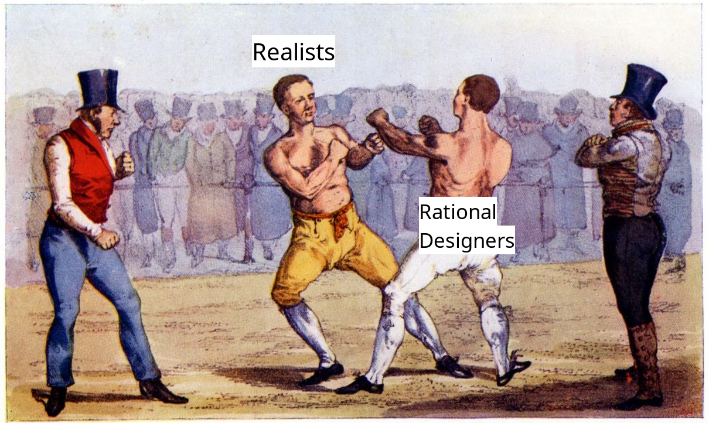
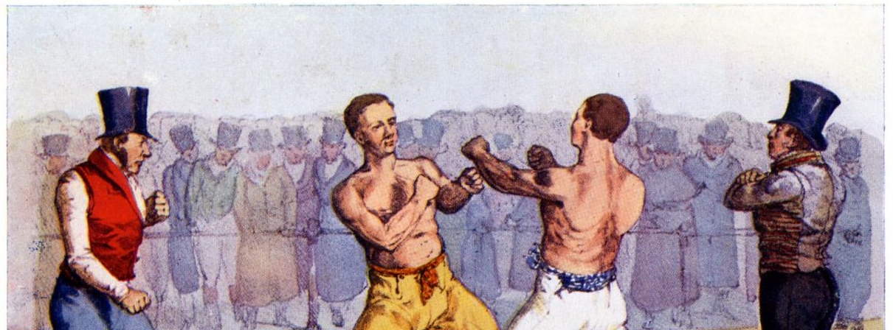
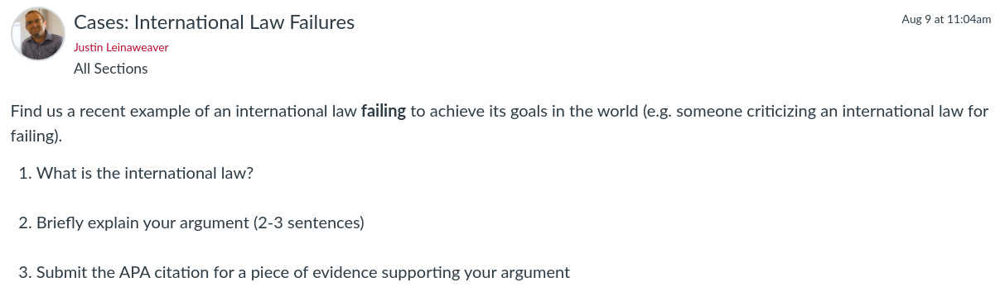
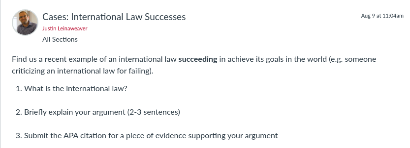

## Today's Agenda {background-image="./Images/background-scales_justice_v3.png" .center}

```{r}
# background-size="1920px 1080px"
library(tidyverse)
library(readxl)
```

<br>

**I. Basics of Analyzing International Institutions**

Do international institutions matter?

- Mearsheimer's (1994) Argument and Case Studies

<br>

::: r-stack
Justin Leinaweaver (Fall 2026)
:::

::: notes

**Prep for Class**

1. Check Canvas submissions

<br>

Let's kick off our work today by recapping the very important material we covered last week.

:::


## The Statute of the International Court of Justice (ICJ) {background-image="./Images/background-scales_justice_v3.png" .center .smaller}

**Article 38**

1. The Court, whose function is to decide in accordance with international law such disputes as are submitted to it, shall apply: 

a. international conventions, whether general or particular, establishing rules expressly recognized by the contesting states; 

b. international custom, as evidence of a general practice accepted as law; 

c. the general principles of law recognized by civilized nations; 

d. subject to the provisions of Article 59, [.e. that only the parties bound by the decision in any particular case,] judicial decisions and the teachings of the most highly qualified publicists of the various nations, as subsidiary means for the determination of rules of law. 

::: notes

**What is this and why is it a useful answer to the question, what is international law?**

- ICJ is the UN's main judicial organization and has two primary jobs:
    1. Settle legal disputes between states
    2. Give advisory opinions on legal questions referred to it by authorized United Nations organs and specialized agencies

- Art 28 is the guidance states gave it for how to adjudicate international disputes

So, this represents an explicit argument by the states in the UN system about:

1. What "international laws" they want considered in disputes between them, AND

2. How different sources of international law should take precedence over each other

:::


## The Statute of the International Court of Justice (ICJ) {background-image="./Images/background-scales_justice_v3.png" .center .smaller}

**Article 38**

1. The Court, whose function is to decide in accordance with international law such disputes as are submitted to it, shall apply: 

a. [**international conventions**]{style="color:blue;"}, whether general or particular, establishing rules expressly recognized by the contesting states; 

b. international custom, as evidence of a general practice accepted as law; 

c. the general principles of law recognized by civilized nations; 

d. subject to the provisions of Article 59, [.e. that only the parties bound by the decision in any particular case,] judicial decisions and the teachings of the most highly qualified publicists of the various nations, as subsidiary means for the determination of rules of law. 

::: notes

**Tell me something interesting about treaties as a source of international law.**

<br>

**What kinds of problems are they good at solving?**

<br>

**What kinds are they ill-equipped to solve?**

:::


## The Statute of the International Court of Justice (ICJ) {background-image="./Images/background-scales_justice_v3.png" .center .smaller}

**Article 38**

1. The Court, whose function is to decide in accordance with international law such disputes as are submitted to it, shall apply: 

a. international conventions, whether general or particular, establishing rules expressly recognized by the contesting states; 

b. [**international custom**]{style="color:blue;"}, as evidence of a general practice accepted as law; 

c. the general principles of law recognized by civilized nations; 

d. subject to the provisions of Article 59, [.e. that only the parties bound by the decision in any particular case,] judicial decisions and the teachings of the most highly qualified publicists of the various nations, as subsidiary means for the determination of rules of law. 

::: notes

**Tell me something interesting about custom as a source of international law.**

<br>

**What kinds of problems are they good at solving?**

<br>

**What kinds are they ill-equipped to solve?**

:::


## The Statute of the International Court of Justice (ICJ) {background-image="./Images/background-scales_justice_v3.png" .center .smaller}

**Article 38**

1. The Court, whose function is to decide in accordance with international law such disputes as are submitted to it, shall apply: 

a. international conventions, whether general or particular, establishing rules expressly recognized by the contesting states; 

b. international custom, as evidence of a general practice accepted as law; 

c. [**the general principles of law**]{style="color:blue;"} recognized by civilized nations; 

d. subject to the provisions of Article 59, [.e. that only the parties bound by the decision in any particular case,] judicial decisions and the teachings of the most highly qualified publicists of the various nations, as subsidiary means for the determination of rules of law. 

::: notes

**Tell me something interesting about the general principles of law introduced to us by Cassese.**

<br>

<br>

**What kinds of problems are they good at solving?**

<br>

**What kinds are they ill-equipped to solve?**

<br>

**Questions on these elements or sources?**

:::


## {background-image="./Images/background-scales_justice_v3.png" .center}

**Abbott, Keohane, Moravcsik, Slaughter & Snidal (2000)**

<br>

{style="display: block; margin: 0 auto"}

::: notes

Last week we then shifted from sources of international law to one approach to analyzing international institutions.

**What is "legalization" and how does it help us analyze international laws?**

- Legalization gives us three dimensions across which international institutions can vary
    - "Obligation means that states or other actors are bound by a rule or commitment or by a set of rules or commitments" (401).
    
    - Precision means that rules unambiguously define the conduct they require, authorize, or proscribe.
    
    - Delegation means that third parties have been granted authority to implement, interpret, and apply the rules; to resolve disputes; and (possibly) to make further rules

- Each dimension is a matter degree meaning it runs from "softer" forms of law to "harder" forms

- Each dimension can vary independently meaning harder levels of obligation do not automatically move levels of precision or delegation

<br>

**Any questions on legalization?**

- We'll be using this tool a great deal this semester and definitely starting next week!

<br>

**notes**

- "Legalization" refers to a particular set of characteristics that institutions may (or may not) possess. These characteristics are defined along three dimensions: obligation, precision, and delegation. Obligation means that states or other actors are bound by a rule or commitment or by a set of rules or commitments. Specifically, it means that they are legally bound by a rule or commitment in the sense that their behavior thereunder is subject to scrutiny under the general rules, procedures, and discourse of international law, and often of domestic law as well. Precision means that rules unambiguously define the conduct they require, authorize, or proscribe. Delegation means that third parties have been granted authority to implement, interpret, and apply the rules; to resolve disputes; and (possibly) to make further rules" (401).

:::


## Do international institutions matter? {background-image="./Images/background-scales_justice_v3.png" .center}

{style="display: block; margin: 0 auto"}

::: notes

This is our last week of new material in Section 1 of the class that focuses on the Basics of Analyzing International Institutions

- There's no escaping it, we simply have to engage with the academic debate about whether or not international law "matters" in a substantial way.

<br>

For Realists like Mearsheimer, international institutions are a sort-of affectation of the international community.

- We see them all over the place and they often get invoked, but don't merit the weight we pretend they carry

- Think of anything someone might wear, do or say meant entirely to impress other people.

<br>

**Per the reading for today, what is the central takeaway about international institutions Mearsheimer is trying to convince you to accept?**

- (**SLIDE**: International institutions "have minimal influence on state behavior" (7).)

:::


## {background-image="./Images/background-scales_justice_v3.png" .center}

{style="display: block; margin: 0 auto"}

Therefore, international institutions "have [minimal influence]{style="color:red;"} on state behavior" (Mearsheimer 1994, p7).

::: notes

**If this is the conclusion, how strong a stand is Mearsheimer taking here against the importance of international law?**

- **What does "minimal influence" mean to you?**

<br>

**SLIDE**: Before we unpack his argument and then analyze it with your cases, let's start by making sure we are on the same page with Mearsheimer when it comes to institutons.

:::


## {background-image="./Images/background-scales_justice_v3.png" .center}

{style="display: block; margin: 0 auto"}

"Institutions are the [rules of the game]{style="color:blue;"} in a society or, more formally, are the [humanly devised]{style="color:blue;"} constraints that [shape human interaction]{style="color:blue;"}" (North 1990).

::: notes

Here is the definition of institution from Douglass North that I tend to see the most in political science literature.

<br>

**Which of the sources in ICJ Art 38 does this classify as an institution?**

- (All of them!)

Very broad definition encompassing both written and unwritten rules of behavior.

:::


## {background-image="./Images/03_1-Boxing_v5.png" .center}

"...as a set of rules that stipulate the ways in which states [should]{style="color:blue;"} cooperate and compete with each other" (Mearsheimer 1994, p8).

"Institutions are the [rules of the game]{style="color:blue;"} in a society or, more formally, are the [humanly devised]{style="color:blue;"} constraints that [shape human interaction]{style="color:blue;"}" (North 1990).

::: notes

Here is Mearsheimer's definition of an institution

**Compare and contrast these for me.**

- **How are they different? How the same?**

- (General vs applied to international only)
- (North’s is much broader.) 
- (Mearsheimer’s definition seems intended to omit the kinds of informal rules we talked about like not wearing a hat in church.)

<br>

**What does thinking about the differences between the two tell us about Mearsheimer’s world view?**

- **Is Mearsheimer dismissing customary law here? Why or why not?**

- (Incredibly revealing of how a neorealist looks at the world.)
    - He wants you to focus on rules formally made by states and NOT those other types.
    - If a state didn’t write it and agree to it then it doesn’t matter.

<br>

**Keep in mind, the way we define our most basic concepts are in and of themselves arguments we are making about how the world works**

- He may be framing the issue to weaken international institutions from the beginning!

:::


## {background-image="./Images/background-scales_justice_v3.png" .center}

**The False Promise of International Institutions (Mearsheimer 1994)**

- ?

- ?

- ?

- ...

Therefore, international institutions "have minimal influence on state behavior" (7).

::: notes

The excerpt you read for today is primarily focused on elaborating the key assumptions and conclusions of offensive realism.

- HOWEVER, our focus is on the impact of institutions so we'll zoom in on that part of the argument.

<br>

Our first job is to diagram the argument
- Premises to the conclusion

**Just to be clear, what do we mean by an assumption?**

- (A statement we do not intend to prove.)
- (The pieces that combine to make an argument.)

We use assumptions because otherwise it would be impossible to explain anything.

- Have to start somewhere and assumptions let us skip some questions to focus on other ones.

<br>

ON YOUR OWN, take a few minutes to diagram this argument.

- What are the key premises needed to support this conclusion.

<br>

Share your diagram with the person next to you (or small groups).

- Consolidate to one diagram of the argument

<br>

*ON BOARD*

- Let's collect premises!

- **SLIDE**: One version of the argument...

:::


## {background-image="./Images/background-scales_justice_v3.png" .center}

**The False Promise of International Institutions (Mearsheimer 1994)**

- Powerful states create institutions to maintain or increase their power

- Institutions simply reflect the balance of power

- When the balance of power shifts so too should the institutions

Therefore, international institutions "have minimal influence on state behavior" (7).

::: notes

**Are the premises clear?**

<br>

**Is this a strong or weak inductive argument?**

- **e.g. if we accept the premises are true does it make the conclusion more likely to be true?**

<br>

**Everybody have this written down?**

- **SLIDE**: Assignment for today

:::


## For Today {background-image="./Images/background-scales_justice_v3.png" .center}

{style="display: block; margin: 0 auto"}

::: notes

In a moment I will ask each of you to introduce your case to us but I want to focus your presentation on analyzing Mearsheimer's argument.

<br>

**SLIDE**: Specifically, I want you to tell us three things.

:::


## For Today {background-image="./Images/background-scales_justice_v3.png" .center}

{style="display: block; margin: 0 auto"}

1. What is the law? 

2. What is the "failure"?

3. Is it evidence consistent with one (or more) of Mearsheimer's premises?

::: notes

In other words, tell us the law, what the failure is and whether it is empirical support for one of Mearsheimer's premises.

<br>

Remember, we evaluate a model by its usefulness, and we evaluate its usefulness by its ability to explain and predict the real world.

<br>

HOWEVER, convincing people your model is valuable often hinges on finding empirical evidence showing its assumptions are consistent with reality

- Technically, assumptions are assumed and so "truth" is irrelevant, but if your model's assumptions are bat-crap crazy no one else will adopt it and your "science" ends in a cul de sac.

<br>

**Make sense?**

<br>

**SLIDE**: Important note!

:::


## Don't Select on the DV {background-image="./Images/background-scales_justice_v3.png" .center}

:::: {.columns}
::: {.column width="50%"}

:::

::: {.column width="50%"}

:::
::::

::: notes

IMPORTANT research design note.

- We are NOT testing Mearsheimer's argument!

- Your cases represent an activity known as selecting on the dependent variable.

<br>

To test a research question (e.g. Do institutions matter?) you need variation on the outcome!

- Unfortunately, you see books, articles and videos making this mistake ALL THE TIME

<br>

Oh wow, Elon Musk makes sure to read books and eat a healthy breakfast clearly that must be the path to riches!

- Instead, follow 1,000 people's reading and eating habits and see if they correlate with wealth.

<br>

**Make sense?**

:::


## {background-image="./Images/background-scales_justice_v3.png" .center}

{style="display: block; margin: 0 auto"}

1. What is the law? 

2. What is the "failure"?

3. Is it evidence consistent with one (or more) of Mearsheimer's premises?

::: notes

Our exercise is simply to evaluate if the premises appear consistent with empirical reality.

- Even if they are we still haven't proved anything

- Just made the case that this model might be useful stronger.

<br>

Ok, take a moment to prepare and then we'll go around the room!

- PRESENT and DISCUSS each

:::


## {background-image="./Images/background-scales_justice_v3.png" .center}

"International law is that law that the [**wicked do not obey**]{style="color:red;"} and the [**righteous do not enforce**]{style="color:blue;"}" (Eban 1957).

"[**International law**]{style="color:red;"} is to law what [**professional wrestling**]{style="color:blue;"} is to wrestling" (Stephen Budiansky).

"...[**almost**]{style="color:red;"} all nations observe [**almost**]{style="color:red;"} all principles of international law and [**almost**] all of their obligations [**almost**]{style="color:red;"} all the time" (Henkin 1979). 

::: notes

**Just curious, would Mearsheimer like any of the quotes from our first day of class? Why or why not?**

:::


## Next Class {background-image="./Images/background-scales_justice_v3.png" .center}

Read the Koremenos, Lipson and Snidal (2001) excerpts, then...



::: notes

On the reading, make sure you understand the conjectures in Table 1 (p797)

<br>

CASES: Find us an example of an international law succeeding in achieving its aims in the world (e.g. someone crediting an international law for a good thing happening)

<br>

**Questions on the assignment?**

:::
