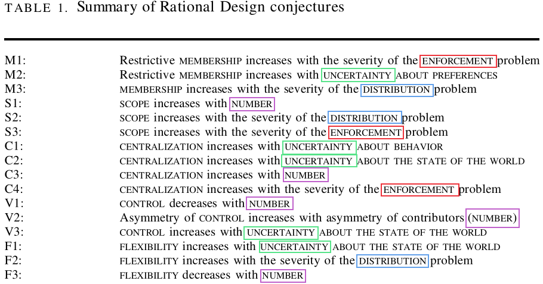
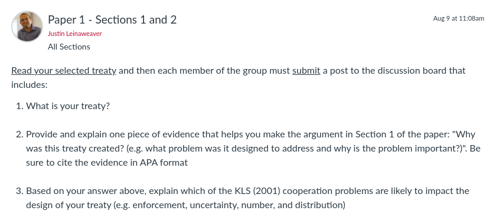

---
output:
  xaringan::moon_reader:
    css: ["default", "extra.css"]
    lib_dir: libs
    seal: false
    nature:
      highlightStyle: github
      highlightLines: true
      countIncrementalSlides: false
      ratio: '16:9'
---

```{r, echo = FALSE, warning = FALSE, message = FALSE}
library(tidyverse)
#library(readxl)
#library(stargazer)
#library(kableExtra)
#library(modelr)

knitr::opts_chunk$set(echo = FALSE,
                      eval = TRUE,
                      error = FALSE,
                      message = FALSE,
                      warning = FALSE,
                      comment = NA)
```

background-image: url('libs/Images/background-scales_justice_v3.png')
background-size: 105%
background-position: top
class: middle

.size45[**I. Basics of Analyzing International Institutions**]

<br>

.size45[**Today's Agenda**

Do international institutions matter?

- Koremenos, Lipson and Snidal's (2001) Argument and Case Studies
]

<br>

.center[.size40[
  Justin Leinaweaver (Fall 2023)
]]

???

### Prep for Class
1. Check Canvas submissions

2. **Save 10 minutes at end of class for paper assignment prep!**

<br>

**SLIDE**: This week...


---

background-image: url('libs/Images/03_1-Boxing_v3.png')
background-size: 100%
background-position: center
class: bottom, center

.size55[.content-box-blue[**Do international institutions matter?**]]

???

We are exploring the academic debate about international institutions.

- For our purposes we are essentially contrasting the "Realists" with the "Rational Designers"

<br>

Last class we examined Mearsheimer's argument that international institutions "have minimal influence on state behavior."

### What were the key premises in that argument?
- (**SLIDE**)


---

background-image: url('libs/Images/background-blue_cubes_lighter3.png')
background-size: 100%
background-position: center
class: middle

.center[.size35[.content-box-white[**The False Promise of International Institutions (Mearsheimer 1994)**]]]

.size40[
- Powerful states create institutions to maintain or increase their power

- Institutions simply reflect the balance of power

- When the balance of power shifts so too should the institutions

Therefore, international institutions "have minimal influence on state behavior" (7).
]

???

### How well did our cases in class provide confidence for us in these assumptions?

### - Strongest assumptions?

### - Weakest assumptions?

<br>

### According to this argument, when should we expect states to create new international institutions?
- (Powerful states create institutions to maintain or increase their power (13))


---

background-image: url('libs/Images/03_2-Dom_vs_Intl_Law.png')
background-size: 100%
background-position: center
class: middle

???

Last week we discussed the striking similarities in the ways domestic and international law are organized and evaluated.

- Both a mix of written rules on top of customary rules

- Both depend on enforcement and adjudication

<br>

### With our "failure" cases considered, can you tell me in what specific ways international and domestic law are different from each other?

1. (states must CHOOSE to bind themselves)
    - Ratify a treaty, or develop customary law
    - Not true of the laws we live under!

2. (Punishment for violators is DEEPLY uncertain)
    - In domestic law it is only somewhat uncertain!

3. (Violations of international law may lead to punishment OR to changes in the law itself!)
    - Getting caught for speeding repeatedly NEVER leads to an increase in speed limits just for you.

<br>

Today's reading on the rational design of international institutions will help us add even more things to the "how are they similar" list!

- Koremenos, Lipson and Snidal have been part of a number of hugely influential research projects.
    - In fact, we'll be seeing their names again next week.

- These three are SUPER smart and this paper has opened up a huge and interesting research agenda into international institutions.

<br>

### What is the central conclusion of the KLS article you read for today?

### - How do they answer the question, do international institutions matter?

- (**SLIDE**)


---

background-image: url('libs/Images/03_1-Boxing_v5.png')
background-size: 100%
background-position: middle
class: middle, center

.size45[Therefore, international institutions "have .textred[minimal influence] on state behavior" (Mearsheimer 1994, p7).]

.size110[
<br>
]

.size45[Therefore, states design international institutions to .textblue[facilitate and strengthen] international cooperation (KLS 2001).]

???

KLS bottom-line argument: Therefore, states design international institutions to facilitate and strengthen international cooperation.

### On its face, are these conclusions incompatible with each other? Why or why not?
- (Best case scenario for Mearsheimer: Both could absolutely be true!)

- (However, very unlikely given the costs in designing intl institutions)

<br>

**SLIDE**: Define institution...


---

background-image: url('libs/Images/03_1-Boxing_v5.png')
background-size: 100%
background-position: middle
class: middle, center

.size45["...as a set of rules that stipulate the ways in which states .textblue[should] cooperate and compete with each other" (Mearsheimer 1994, p8).]

.size90[
<br>
]

.size45["Institutions are the .textblue[rules of the game] in a society or, more formally, are the .textblue[humanly devised] constraints that .textblue[shape human interaction]" (North 1990).]

???

Here we see our current definitions of "institution."

<br>

Last class we discussed how Mearsheimer might have been trying to frame the discussion with his definition in order to make his argument look better.

### Why might Mearsheimer's definition make his conclusion more likely?

<br>

### How do KLS define the concept?
- (**SLIDE**)


---

background-image: url('libs/Images/03_1-Boxing_v4.png')
background-size: 100%
background-position: top
class: bottom, center

.size40["We define international institutions as .textblue[explicit] arrangements, .textblue[negotiated] among international actors, that .textblue[prescribe, proscribe], and/or .textblue[authorize] behavior" (KLS 2001, p762).]

???

### What does "prescribe" mean?
- (state authoritatively or as a rule that (an action or procedure) should be carried out.)
    - To compel a behavior
    - Do this

### What about "proscribe"?
- (forbid)
    - Don't do this

### And "authorize"?
- (give official permission for or approval to (an undertaking or agent))
- Create an agent to do this.


---

background-image: url('libs/Images/background-blue_cubes_lighter3.png')
background-size: 100%
background-position: center
class: middle, center

.size50[.content-box-white[**Defining International Law (Institutions)**]]

<br>

.size35["Institutions are the .textblue[rules of the game] in a society or, more formally, are the .textblue[humanly devised] constraints that .textblue[shape human interaction]" (North 1990).]

<br>

.size35["...as a set of rules that stipulate the ways in which states .textblue[should] cooperate and compete with each other" (Mearsheimer 1994, p8).]

<br>

.size35["....textblue[explicit] arrangements, .textblue[negotiated] among international actors, that .textblue[prescribe, proscribe], and/or .textblue[authorize] behavior" (Koremenos, Lipson and Snidal 2001, 762).]

???

### How does this new definition alter our understanding of the key concept?

### - How is it different from North's or Mearsheimer's?

Mearsheimer 
- uses the word rules but really what he means is power.

- Rules are constructed and enforced by the powerful.

- Their influence over state behavior cannot meaningfully be understood in the absence of powerful states.

Koremenos, Lipson and Snidal
- Explicitly focused on the international level (differs from North)

- Arrangements can be created by "international actors," not just states.

- These arrangements can be seen as holding power OVER those actors (compel or forbid action).

- AND meaningful authority can be delegated to an agent (e.g. authorize!) who then acts on the same level as states


---

background-image: url('libs/Images/background-blue_cubes_lighter3.png')
background-size: 100%
background-position: center
class: middle

.center[.size40[.content-box-white[**Koremenos, Lipson & Snidal (2001): Rational Design**]]]

.size40[
- Rational design

- Shadow of the future

- Transaction costs

- Risk aversion

Therefore, states design international institutions to facilitate and strengthen international cooperation.
]

???

Starting on p780 KLS give us these four "Conjectures About Rational Design" which represent the key assumptions underpinning their key conclusion.

*Split class into four groups: one per assumption*

<br>

Groups get ready to present your assumption to the class:

1. What does this assumption mean?

2. Use examples from your cases for today to evaluate if this assumption is consistent with reality.

<br>

### Questions on the assignment?

- Go!

<br>

**SLIDES** x 4


---

background-image: url('libs/Images/03_2-Teamwork.avif')
background-size: 100%
background-position: center
class: bottom

.center[.size45[.content-box-white[**1. Rational Design (KLS 2001)**]]]

???

1) Rational design: States and other international actors, acting for self-interested reasons, design institutions purposefully to advance their joint interests.

<br>

### Examples from your "success" cases that support this assumption?

<br>

- Some international problems are too big for one state to address acting alone!
    - Climate change, acid rain, etc
    
- Some international problems require coordination by multiple states
    - International postal union, air traffic control, etc
    


---

background-image: url('libs/Images/03_2-shadow_future.webp')
background-size: 100%
background-position: center
class: top

.center[.size45[.content-box-white[**2. Shadow of the Future (KLS 2001)**]]]

???

2) Shadow of the future: The value of future gains is strong enough to support a cooperative arrangement.

- Even if gains are small in the short-term, repeating them year and year compounds into significant amounts

<br>

### Examples from your "success" cases that support this assumption?

<br>


---

background-image: url('libs/Images/03_2-Design_Expenses.png')
background-size: 100%
background-position: center
class: bottom

.center[.size45[.content-box-white[**3. Transaction Costs (KLS 2001)**]]]

???

3) Transaction costs: Establishing and participating in international institutions is costly.

<br>

### Examples from your "success" cases that support this assumption?

<br>

All institutions are costly
- Designing, building, staffing and budgeting for the UN is incredibly costly


---

background-image: url('libs/Images/03_2-risk_aversion.jpg')
background-size: 80%
background-position: center
class: top

.center[.size45[.content-box-blue[**4. Risk Aversion (KLS 2001)**]]]

???

4) Risk aversion: States are risk-averse and worry about possible adverse effects when creating or modifying international institutions.

<br>

### Examples from your "success" cases that support this assumption?

- Institutions with exit options

- Treaties with threshold effects before binding rules applied
    - See most environmental treaties


---

background-image: url('libs/Images/background-blue_cubes_lighter3.png')
background-size: 100%
background-position: center
class: middle

.center[.size35[.content-box-white[**When do international institutions matter?**]]] 

.center[.size35[.content-box-white[**Comparing Key Assumptions**]]]

<br>

.pull-left[
.size35[
**Mearsheimer (1994)**

- Powerful states create institutions to maintain or increase their power

- Institutions reflect and shift with the balance of power
]]

.pull-right[
.size35[
**KLS (2001)**

- Rational design

- Shadow of the future

- Transaction costs

- Risk aversion
]]

???

Let's compare and contrast with Mearsheimer's offensive realist argument.

### How much overlap is there across these assumptions?
- (A lot!)

- states are strategic

- cooperation is hard (due to anarchy and uncertainty)

- States are risk averse and fear their choices may come back to destroy them

<br>

### How are they distinctly different?
- (Rational Design assumes that survival is not the only goal)

- (Rational Design acknowledges the importance of time and repeated interactions in calculating benefits)

<br>

### Based on your case studies this week, which set of assumptions better sets us up to explain state behavior on the international level? Why?


---

background-image: url('libs/Images/03_2-KLS_Table1.png')
background-size: 80%
background-position: center
class: middle, slideblue

???

This takes us to the heart of this paper, the rational design conjectures
- summarized by Table 1 (p797) but are explored in the bulk of the text

<br>

Remember, their argument assumes that states intentionally use institutional design to make cooperation possible.
- These conjectures lay out a series of ways that can be accomplished

- Each conjecture ties a specific design to a specific problem

- So, if the area of cooperation is complicated by a serious enforcement problem, M1 tells us to consider restricting the membership of the institution

<br>

**SLIDE**: The design choices


---

background-image: url('libs/Images/03_2-KLS_Table1b.png')
background-size: 80%
background-position: center
class: middle, slideblue

???

The paper focuses on five specific design choices
- Not meant as an exhaustive list, but pretty darn thorough.

<br>

When designing an institution you can:

1. Adjust your membership rules to be more inclusive or more restrictive

2. Adjust the scope of the issues covered to be broad or narrow

3. Adjust the centralization of tasks (more vs less)

4. Adjust the rules for controlling the institution, and

5. Offer states who participate some flexibility in the arrangements

<br>

**SLIDE**: These design choices are made in order to address or overcome specific problems that arise in cooperation


---

background-image: url('libs/Images/03_2-KLS_Table1a.png')
background-size: 80%
background-position: center
class: middle, slideblue

???

KLS identify four broad problems that complicate efforts to achieve international cooperation (p773-780)

1. How will the agreement be enforced?

2. How will uncertainty be overcome?
    - (3 flavors: preferences, behavior, and the state of the world)

3. Who should be invited to participate? (Number)

4. And how should disputes over the distribution of benefits be addressed?

<br>

**SLIDE**: I'd like us to explore each of these design mechanisms in more detail, but beginning with the problems and not the designs.


---

background-image: url('libs/Images/background-blue_cubes_lighter3.png')
background-size: 100%
background-position: center
class: middle

```{r, echo = FALSE, fig.align = 'center', out.width = '70%'}

```

.size50[
1. Explain the problem, and

2. Explain the design options to address it
]

???

*Same groups as before*: One problem per group

<br>

I want you to clarify for us both the problem itself AND how we can overcome the problem with specific institutional designs.

- Make sure to give us examples!

- NOTE that each problem shows up multiple times on the Table and you have to present all of them

<br>

### Questions on the assignment?

- Go!

<br>

PRESENT and DISCUSS each

<br>

#### Notes
p763
Membership rules ( MEMBERSHIP )
- "Who belongs to the institution? Is membership exclusive and restrictive, like the G-7’s limitation to rich countries? Or is it inclusive by design, like the UN? Is it regional, like ASEAN, or is it universal? Is it restricted to states, or can NGOs join?" (770).

Scope of issues covered ( SCOPE )
- "What issues are covered?" (770).

Centralization of tasks ( CENTRALIZATION )
- "Are some important institutional tasks performed by a single focal entity or not? Scholars often misleadingly equate centralization with centralized enforcement. We use the term more broadly to cover a wide range of centralized activities. In particular we focus on centralization to disseminate information, to reduce bargaining and transaction costs, and to enhance enforcement" (771).

Rules for controlling the institution ( CONTROL )
- "How will collective decisions be made? Control is determined by a range of factors, including the rules for electing key officials and the way an institution is financed. We focus on voting arrangements as one important and observable aspect of control" (772).

Flexibility of arrangements ( FLEXIBILITY )
- "How will institutional rules and procedures accommodate new circumstances? Institutions may confront unanticipated circumstances or shocks, or face new demands from domestic coalitions or clusters of states wanting to change important rules or procedures. What kind of flexibility does an institution allow to meet such challenges?" (773).


---

background-image: url('libs/Images/03_2-KLS_Table1a.png')
background-size: 80%
background-position: center
class: middle, slideblue

???

Ok, everybody think about their "failed" cases from last class.

- I know you didn't have to read or analyze the treaties themselves for that exercise, however I still want to ask...

### Is there anything from the Rational Design conjecturs that might have helped with your "failed" cases? Why or why not?

<br>

**SLIDE**: Next week we work on your first paper!


---

background-image: url('libs/Images/background-blue_cubes_lighter3.png')
background-size: 100%
background-position: center
class: middle

.size45[.content-box-white[**Paper 1 - Treaty Design Analysis**]]

.size35[
Submit a report that describes and analyzes a multilateral, international treaty.
]

???

For the first paper everyone will select a new treaty to analyze.

- I have made a big list available on Canvas that you can pick from.

- You're welcome to find something else but the treaty you pick must be multilateral and not be one we are analyzing in class this semester

<br>

**SLIDE**: Your report will have three sections

--


.size35[
1. Why was this treaty created? (e.g. what problem was it designed to address and why is the problem important?)

2. What specifically does it do? Describe the design of the treaty using the dimensions of legalization and the rational design conjectures

3. How effective has the treaty been in addressing the problem that motivated its creation?
]

???

### Questions on the three sections?

<br>

Now, I'm going to ask you to attack this assignment in small groups (3-4 people?)

- Each group will focus on the same treaty

- Your group means you have other people helping you research

- Ultimately, it is your paper but the prep will be distributed

<br>

Let's figure out how to split the class into groups and pick treaties.

- Then we'll talk about your assignment for Tuesday

<br>

**SLIDE**: Next class


---

background-image: url('libs/Images/background-blue_triangles.jpg')
background-size: 100%
background-position: center
class: middle

.size65[.content-box-white[**For Next Class**]]

```{r, echo = FALSE, fig.align = 'center', out.width = '100%'}

```

???

Canvas: Read your selected treaty and then each member of the group must submit a post to the discussion board that includes:

1. What is your treaty?

2. Provide and explain one piece of evidence that helps you make the argument in Section 1 of the paper (Why was this treaty created?). Be sure to cite the evidence in APA format

3. Based on your answer above, explain which of the KLS cooperation problems are likely to impact the design of your treaty (e.g. enforcement, uncertainty, number, and distribution)

<br>

### Questions on the assignment?


