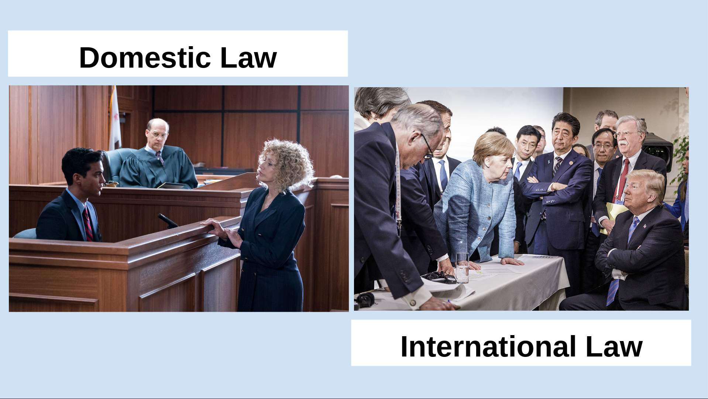
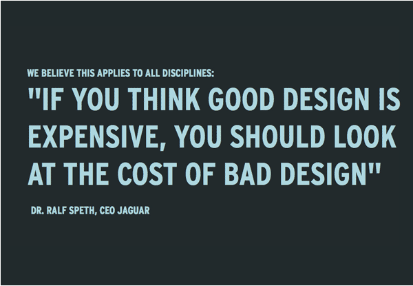
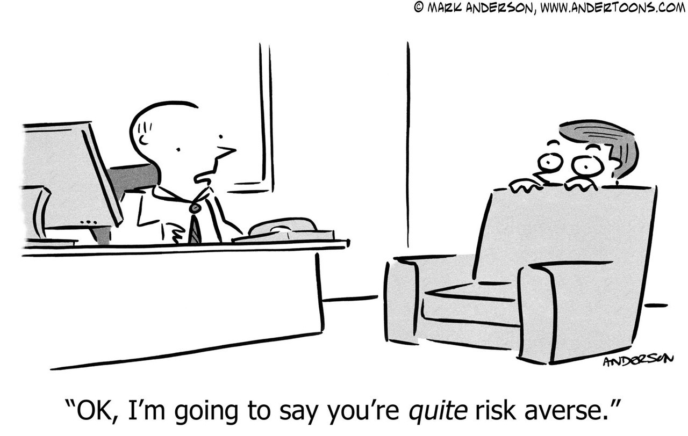
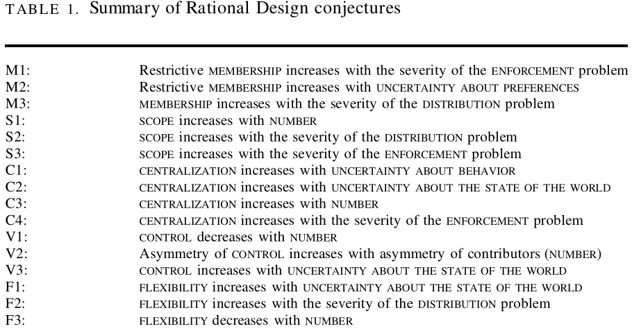
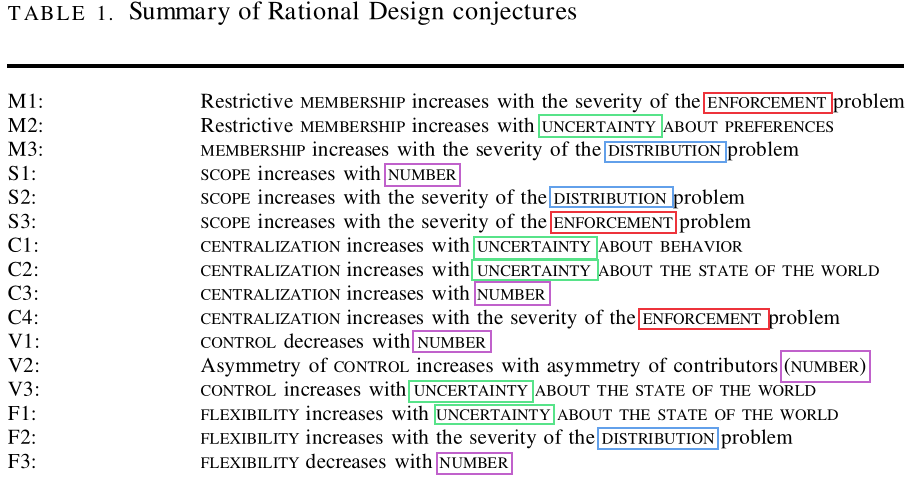
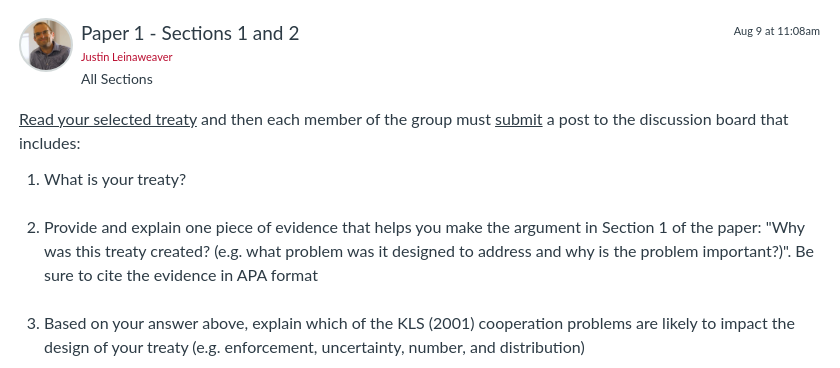

## Today's Agenda {background-image="./Images/background-scales_justice_v3.png" .center}

```{r}
# background-size="1920px 1080px"
library(tidyverse)
library(readxl)
```

<br>

**I. Basics of Analyzing International Institutions**

Do international institutions matter?

- Koremenos, Lipson and Snidal's (2001) Argument and Case Studies

<br>

::: r-stack
Justin Leinaweaver (Fall 2026)
:::

::: notes

**Prep for Class**

1. Check Canvas submissions

2. **Save 10 minutes at end of class for paper assignment prep!**

<br>

Last week we studied the sources and basic structures of international law.

- To do this we rooted ourselves in Art 38 of the ICJ statutes.

:::


## The Sources of International Law {background-image="./Images/background-scales_justice_v3.png" .center}

{style="display: block; margin: 0 auto"}

::: notes

**Based on our work last week, what would your answer be to the question, what is international law?**

- (A combination of rules written in treaties, determined by custom or through the development of legal principles and expectations over time)

<br>

**And based on that answer, how different is domestic from international law?**

- (Fairly similar in terms of source and composition)

- (Both include written rules and customary rules)

<br>

**SLIDE**: Good that brought us up to our work this week focused a bit more on the impact or effectiveness of international law

:::


## Do international institutions matter? {background-image="./Images/background-scales_justice_v3.png" .center}

{style="display: block; margin: 0 auto"}

::: notes

Last class we examined Mearsheimer's answer to the question: Do international institutions matter?

**What was Mearsheimer's answer?**

- (international institutions "have minimal influence on state behavior")

<br>

**And how do we understand "minimal influence"?**

- (Some impact on state behavior and NOT just about weak states being bullied or strong states doing only what they planned to do anyway)

<br>

**What was the essence of Mearsheimer's argument? Why does he believe international institutions don't matter very much?**

- (**SLIDE**)

:::


## {background-image="./Images/background-scales_justice_v3.png" .center}

**The False Promise of International Institutions (Mearsheimer 1994)**

- Powerful states create institutions to maintain or increase their power

- Institutions simply reflect the balance of power

- When the balance of power shifts so too should the institutions

Therefore, international institutions "have minimal influence on state behavior" (7).

::: notes

Offensive realism applied!

- Institutions are a reflection of power.

<br>

**How well did Mearsheimer's argument explain the failure cases you brought to last class?**

- **In other words, and based on your cases, how often do international laws fail because powerful states can safely ignore them?**

<br>

**Did anybody have an example of a weak state ignoring an international law without punishment?**

- **Would such a case still fit in Mearsheimer's argument? Why or why not?**

:::


## {background-image="./Images/background-scales_justice_v3.png" .center}

{style="display: block; margin: 0 auto"}

::: notes

Alright, back to the comparison question!

<br>

**Based just on the failure cases, in what ways are domestic and international law different?**

1. (states must CHOOSE to bind themselves)
    - Ratify a treaty, or develop customary law
    - Not true of the laws we live under!

2. (Punishment for violators is DEEPLY uncertain)
    - In domestic law it is only somewhat uncertain!

3. (Violations of international law may lead to punishment OR to changes in the law itself!)
    - Getting caught for speeding repeatedly NEVER leads to an increase in speed limits just for you.

<br>

Today's reading on the rational design of international institutions will help us add even more things to the "how are they similar" list!

- Koremenos, Lipson and Snidal have been part of a number of hugely influential research projects.
    - In fact, we'll be seeing their names again next week.

- These three are SUPER smart and this paper has opened up a huge and interesting research agenda into international institutions.

<br>

**What is the central conclusion of the KLS article you read for today?**

- **How do they answer the question, do international institutions matter?**

- (**SLIDE**)

:::


## {background-image="./Images/03_1-Boxing_v5.png" .center}

Therefore, international institutions "have [minimal influence]{style="color:red;"} on state behavior" (Mearsheimer 1994, p7).

Therefore, states design international institutions to [facilitate and strengthen]{style="color:blue;"} international cooperation (KLS 2001).

::: notes

KLS bottom-line argument: Therefore, states design international institutions to facilitate and strengthen international cooperation.

<br>

**On its face, are these conclusions incompatible with each other? Why or why not?**

- (Best case scenario for Mearsheimer: Both could absolutely be true!)

- (However, very unlikely given the costs in designing intl institutions)

<br>

**SLIDE**: Let's start with how KLS "set the table" by defining an institution.

:::


## {background-image="./Images/background-scales_justice_v3.png" .center}

{style="display: block; margin: 0 auto"}

"We define international institutions as [explicit]{style="color:blue;"} arrangements, [negotiated]{style="color:blue;"} among international actors, that [prescribe, proscribe]{style="color:blue;"}, and/or [authorize]{style="color:blue;"} behavior" (KLS 2001, p762).

::: notes

**What does "prescribe" mean?**

- (state authoritatively or as a rule that (an action or procedure) should be carried out.)
    - To compel a behavior
    - Do this

**What about "proscribe"?**

- (forbid)
    - Don't do this

**And "authorize"?**

- (give official permission for or approval to (an undertaking or agent))
- Create an agent to do this.

:::


## Defining International Law (Institutions) {background-image="./Images/background-scales_justice_v3.png" .center}

"Institutions are the [rules of the game]{style="color:blue;"} in a society or, more formally, are the [humanly devised]{style="color:blue;"} constraints that [shape human interaction]{style="color:blue;"}" (North 1990).]

<br>

"...as a set of rules that stipulate the ways in which states [should]{style="color:blue;"} cooperate and compete with each other" (Mearsheimer 1994, p8).

<br>

"...[explicit]{style="color:blue;"} arrangements, [negotiated]{style="color:blue;"} among international actors, that [prescribe, proscribe]{style="color:blue;"}, and/or [authorize]{style="color:blue;"} behavior" (Koremenos, Lipson and Snidal 2001, 762).

::: notes

**How does this new definition alter our understanding of the key concept?**

- **How is it different from North's or Mearsheimer's?**

Mearsheimer 

- uses the word rules but really what he means is power.

- Rules are constructed and enforced by the powerful.

- Their influence over state behavior cannot meaningfully be understood in the absence of powerful states.

Koremenos, Lipson and Snidal

- Explicitly focused on the international level (differs from North)

- Arrangements can be created by "international actors," not just states.

- These arrangements can be seen as holding power OVER those actors (compel or forbid action).

- AND meaningful authority can be delegated to an agent (e.g. authorize!) who then acts on the same level as states

:::


## {background-image="./Images/background-scales_justice_v3.png" .center}

**Koremenos, Lipson & Snidal (2001): Rational Design**

- Rational design

- Shadow of the future

- Transaction costs

- Risk aversion

Therefore, states design international institutions to facilitate and strengthen international cooperation.

::: notes

Starting on p780 KLS give us these four "Conjectures About Rational Design" which represent the key assumptions underpinning their key conclusion.

<br>

I'd like to step through these four assumptions as a class, but first, I will ask everyone to review the success cases on Canvas.

- Let's load our discussion of this argument with real world examples!

<br>

**SLIDE**: Ok, let's start with the rational design assumption

<br>

<br>

OLD PLAN

*Split class into four groups: one per assumption*

<br>

Groups get ready to present your assumption to the class:

1. What does this assumption mean?

2. Use examples from your cases for today to evaluate if this assumption is consistent with reality.

<br>

Questions on the assignment?

- Go!

<br>

**SLIDES** x 4

:::


## {background-image="./Images/background-scales_justice_v3.png" .center}

{style="display: block; margin: 0 auto"}

**1. Rational Design (KLS 2001)**

::: notes

**What does this assumption mean? Can you explain it to me in simple terms?**

- (Rational design: States and other international actors, acting for self-interested reasons, design institutions purposefully to advance their joint interests.)

<br>

**Give me an example or two from our "success" cases that show states rationally designing international institutions.**

<br>

- Some international problems are too big for one state to address acting alone!
    - Climate change, acid rain, etc
    
- Some international problems require coordination by multiple states
    - International postal union, air traffic control, etc
    
<br>

**SLIDE**: Shadow of the future

:::


## {background-image="./Images/background-scales_justice_v3.png" .center}

{style="display: block; margin: 0 auto"}

**2. Shadow of the Future (KLS 2001)**

::: notes

**What does this assumption mean? Can you explain it to me in simple terms?**

- (Shadow of the future: The value of future gains is strong enough to support a cooperative arrangement.)

- Even if gains are small in the short-term, repeating them year and year compounds into significant amounts

<br>

**Give me an example or two from our "success" cases that show state cooperation that depends on the shadow of the future to work.**

<br>

**SLIDE**: Transaction costs

:::


## {background-image="./Images/background-scales_justice_v3.png" .center}

{style="display: block; margin: 0 auto"}

**3. Transaction Costs (KLS 2001)**

::: notes

**What does this assumption mean? Can you explain it to me in simple terms?**

- (Transaction costs: Establishing and participating in international institutions is costly.)

<br>

**Give me an example or two from our "success" cases that show institutional design is costly.**

<br>

All institutions are costly

- Designing, building, staffing and budgeting for the UN is incredibly costly

- Precise rules are hard to write, agree and maintain!

<br>

**SLIDE**: Risk Aversion

:::


## {background-image="./Images/background-scales_justice_v3.png" .center}

{style="display: block; margin: 0 auto"}

**4. Risk Aversion (KLS 2001)**

::: notes

**What does this assumption mean? Can you explain it to me in simple terms?**

- (Risk aversion: States are risk-averse and worry about possible adverse effects when creating or modifying international institutions.)

<br>

**Examples from your "success" cases that support this assumption?**

- Institutions with exit options

- Treaties with threshold effects before binding rules applied
    - See most environmental treaties
    
:::


## {background-image="./Images/background-scales_justice_v3.png" .center}

**When do international institutions matter?**

**Comparing Key Assumptions**

<br>

:::: {.columns}
::: {.column width="50%"}
**Mearsheimer (1994)**

- Powerful states create institutions to maintain or increase their power

- Institutions reflect and shift with the balance of power
:::

::: {.column width="50%"}
**KLS (2001)**

- Rational design

- Shadow of the future

- Transaction costs

- Risk aversion
:::
::::

::: notes

Let's compare and contrast with Mearsheimer's offensive realist argument.

**How much overlap is there across these assumptions?**

- (A lot!)

- states are strategic

- cooperation is hard (due to anarchy and uncertainty)

- States are risk averse and fear their choices may come back to destroy them

<br>

**How are they distinctly different?**

- (Rational Design assumes that survival is not the only goal)

- (Rational Design acknowledges the importance of time and repeated interactions in calculating benefits)

<br>

*Split class into groups (4)*

- Go sit with your group!

:::


## {background-image="./Images/background-scales_justice_v3.png" .center}

:::: {.columns}
::: {.column width="50%"}
**Mearsheimer (1994)**

- Powerful states create institutions to maintain or increase their power

- Institutions reflect and shift with the balance of power
:::

::: {.column width="50%"}
**KLS (2001)**

- Rational design

- Shadow of the future

- Transaction costs

- Risk aversion
:::
::::

**Which model better explains the variation in our cases this week?**

::: notes

GROUPS I want you to review ALL of our case studies from this week, both the successes and the failures.

- Get ready to present an argument about which model better explains the data we have collected: Mearsheimer or KLS

<br>

**Questions on the assignment?**

- Go!

<br>

*PRESENT and DISCUSS each*

:::


## {background-image="./Images/background-scales_justice_v3.png" .center}

{style="display: block; margin: 0 auto"}

::: notes

This takes us to the heart of this paper, the rational design conjectures

- summarized by Table 1 (p797) but are explored in the bulk of the text

<br>

Remember, their argument assumes that states intentionally use institutional design to make cooperation possible.

- These conjectures lay out a series of ways that can be accomplished

- Each conjecture ties a specific design to a specific problem

- So, if the area of cooperation is complicated by a serious enforcement problem, M1 tells us to consider restricting the membership of the institution

<br>

**SLIDE**: The design choices

:::


## {background-image="./Images/background-scales_justice_v3.png" .center}

{style="display: block; margin: 0 auto"}

::: notes

The paper focuses on five specific design choices

- Not meant as an exhaustive list, but pretty darn thorough.

<br>

When designing an institution you can:

1. Adjust your membership rules to be more inclusive or more restrictive

2. Adjust the scope of the issues covered to be broad or narrow

3. Adjust the centralization of tasks (more vs less)

4. Adjust the rules for controlling the institution, and

5. Offer states who participate some flexibility in the arrangements

<br>

**Any questions or need for clarificartion on the design choices?**

<br>

**Does anybody have an example from our case studies of one of these designs in action?**

<br>

**SLIDE**: These design choices are made in order to address or overcome specific problems that arise in cooperation

<br>

**Notes**

p763

Membership rules ( MEMBERSHIP )

- "Who belongs to the institution? Is membership exclusive and restrictive, like the G-7’s limitation to rich countries? Or is it inclusive by design, like the UN? Is it regional, like ASEAN, or is it universal? Is it restricted to states, or can NGOs join?" (770).

Scope of issues covered ( SCOPE )

- "What issues are covered?" (770).

Centralization of tasks ( CENTRALIZATION )

- "Are some important institutional tasks performed by a single focal entity or not? Scholars often misleadingly equate centralization with centralized enforcement. We use the term more broadly to cover a wide range of centralized activities. In particular we focus on centralization to disseminate information, to reduce bargaining and transaction costs, and to enhance enforcement" (771).

Rules for controlling the institution ( CONTROL )

- "How will collective decisions be made? Control is determined by a range of factors, including the rules for electing key officials and the way an institution is financed. We focus on voting arrangements as one important and observable aspect of control" (772).

Flexibility of arrangements ( FLEXIBILITY )

- "How will institutional rules and procedures accommodate new circumstances? Institutions may confront unanticipated circumstances or shocks, or face new demands from domestic coalitions or clusters of states wanting to change important rules or procedures. What kind of flexibility does an institution allow to meet such challenges?" (773).

:::


## {background-image="./Images/background-scales_justice_v3.png" .center}

{style="display: block; margin: 0 auto"}

::: notes

KLS identify four broad problems that complicate efforts to achieve international cooperation (p773-780)

1. Disagreement over how it will be enforced?

2. The levels of uncertainty in the problem
    - (3 flavors: uncertainty in preferences, behavior, and the state of the world)

3. Disagreement over who should be invited to participate? (Number)

4. And how should disputes over the distribution of benefits be addressed?

<br>

**Any questions on the nature of these problems in an area of international cooperation?**

<br>

**Any of our case studies from this week show this problem in action?**

<br>

**SLIDE**: Ok, what's the point of this table?

:::


## {background-image="./Images/background-scales_justice_v3.png" .center}

{style="display: block; margin: 0 auto"}

::: notes

Here's what I want you using this to do.

- Think of this like a tool, like legalization, that helps you deeply analyze an international law.

<br>

If a treaty you are analyzing includes restrictive membership, that tells you something important about the problems those states are facing!

- Restrictive membership means enforcement and uncertainty problems!

- Otherwise, why restrict who can join?

<br

Each mechanism that is included in a treaty tells you something valuable about the challenges facing those states!

<br>

**Does that make sense?**

- Your job when analyzing a treaty is to consider WHY the design choices have been made and this table can help you do that!

<br>

**SLIDE**: Next week we work on your first paper!

:::


## Paper 1 - Treaty Design Analysis {background-image="./Images/background-scales_justice_v3.png" .center}

Submit a report that describes and analyzes a multilateral, international treaty.

::: notes

For the first paper everyone will select a new treaty to analyze.

- I have made a big list available on Canvas that you can pick from.

- You're welcome to find something else but the treaty you pick must be multilateral and not be one we are analyzing in class this semester

<br>

**SLIDE**: Your report will have three sections

:::


## Paper 1 - Treaty Design Analysis {background-image="./Images/background-scales_justice_v3.png" .center}

Submit a report that describes and analyzes a multilateral, international treaty.

1. Why was this treaty created? (e.g. what problem was it designed to address and why is the problem important?)

2. What specifically does it do? Describe the design of the treaty using the dimensions of legalization and the rational design conjectures

3. How effective has the treaty been in addressing the problem that motivated its creation?

::: notes

**Questions on the three sections?**

<br>

Now, I'm going to ask you to attack this assignment in small groups (3-4 people?)

- Each group will focus on the same treaty

- Your group means you have other people helping you research

- Ultimately, it is your paper but the prep will be distributed

<br>

Let's figure out how to split the class into groups and pick treaties.

- Then we'll talk about your assignment for Tuesday

<br>

**SLIDE**: Next class

:::


## For Next Class {background-image="./Images/background-scales_justice_v3.png" .center}

{style="display: block; margin: 0 auto"}

::: notes

Canvas: Read your selected treaty and then each member of the group must submit a post to the discussion board that includes:

1. What is your treaty?

2. Provide and explain one piece of evidence that helps you make the argument in Section 1 of the paper (Why was this treaty created?). Be sure to cite the evidence in APA format

3. Based on your answer above, explain which of the KLS cooperation problems are likely to impact the design of your treaty (e.g. enforcement, uncertainty, number, and distribution)

<br>

**Questions on the assignment?**

:::