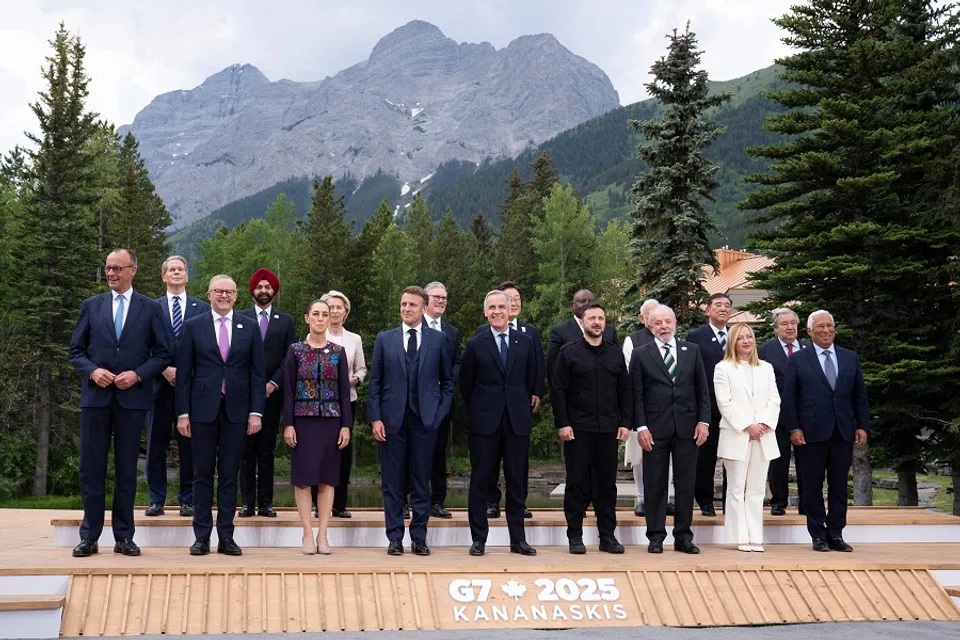
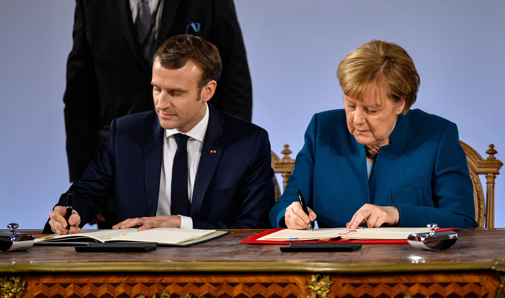
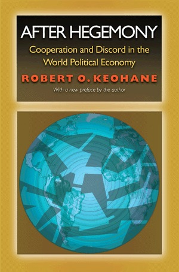

## Today's Agenda {background-image="./Images/background-scales_justice_v3.png" .center}

```{r}
# background-size="1920px 1080px"
library(tidyverse)
library(readxl)
```

<br>

**Section 1: Analyzing International Institutions**

<br>

**Do international institutions matter?**

- Keohane's (1984) Argument

<br>

::: r-stack
Justin Leinaweaver (Fall 2026)
:::

::: notes

**Prep for Class**

1. Check Canvas submissions

2. Move quickly through the recap material to get to the Keohane stuff

<br>

This week we have continued our work developing the concepts and tools we need for analyzing international institutions

- **SLIDE**: Specifically, we have shifted to examining a VERY old debate in international relations

:::


## Do international institutions matter? {background-image="./Images/background-scales_justice_v3.png" .center}

{style="display: block; margin: 0 auto"}

::: notes

As social scientists we know that human behavior depends on far more than just what the rules say we should do

- And this debate, especially at the international level, has raged for a long, long time in international relations

<br>

Last class we unpacked Mearsheimer's answer to the question: Do international institutions matter?

- At its heart, Mearsheimer's argument is an offensive realist approach to explaining international political outcomes

- **Remind me, what are the FIVE key assumptions of offensive realism Mearsheimer specified in the article?**

1. (System is anarchic)
2. (States can hurt each other (offensive capacity))
3. (Uncertainty is high)
4. (States are strategic)
5. (States focused on survival)

<br>

**And when we apply these assumptions to this question, what is Mearsheimer's answer about institutions?**

<br>

(International institutions "have minimal influence on state behavior")

- (Powerful states create institutions to lock-in or increase their power)

- (Other states comply with the institutions BECAUSE the powerful states tell them to)

- (The institutions are merely intervening variables and not causal AT ALL!)

- (Powerful states -> Self-serving institutions -> Weak states change behavior)

<br>

**SLIDE**: Let's apply Mearsheimer's perspective to Article 38

:::


## International Law Created by Custom {background-image="./Images/background-scales_justice_v3.png" .center}

{style="display: block; margin: 0 auto"}

::: notes

**Give me an example of an international custom BECOMING international laws through the process described by Cassese**

<br>

**And what would Mearsheimer say is actually happening in these cases?**

<br>

**SLIDE**: Next up, treaties!

:::


## International Law Created by Treaties {background-image="./Images/background-scales_justice_v3.png" .center}

{style="display: block; margin: 0 auto"}

::: notes

**Give me an example of one of the treaties you submitted last week**

- **What was the problem and how did the states come together to solve it?**

<br>

**And what would Mearsheimer say is actually happening in these cases?**

<br>

**SLIDE**: We finally shifted to what Cassese describes as the "The Fundamental Principles Governing International Relations"

:::


## {background-image="./Images/background-scales_justice_v3.png" .center}

::: {.r-fit-text}
**The "Fundamental Principles Governing International Relations"**
:::

- The Sovereign Equality of States (3.2)
- Non-Intervention in the Int. / Ext. Affairs of Other States (3.3)
- Prohibition of the Threat or Use of Force (3.4)
- Peaceful Settlement of Disputes (3.5)
- Respect for Human Rights (3.6)
- Self-Determination of Peoples (3.7)

::: notes

**According to Cassese where does this list come from?**

- **How did he identify these "fundamental principles"?**

- (Identified from a "careful consideration of international practice")

- And by "international practice" he includes: treaties, UN General Assembly resolutions, Declarations of states, Statements by government representatives in the UN, diplomatic practice and case law

<br>

**Why does Cassese argue these principles belong on a list with customary laws and treaty laws?**

- (p48: All the fundamental principles have...) 

1. universal scope (Applies to all and in all places)

2. legally binding force (All states committed to these principles)

<br>

**And what would Mearsheimer say if you handed him this list if he asked you for an example of an international law?**

<br>

**SLIDE**: In sum

:::


## {background-image="./Images/background-scales_justice_v3.png" .center .smaller}

::: {.r-fit-text}
**The Statute of the International Court of Justice (ICJ)**
:::

**Article 38**

1. The Court, whose function is to decide in accordance with international law such disputes as are submitted to it, shall apply: 

a. international conventions, whether general or particular, establishing rules expressly recognized by the contesting states; 

b. international custom, as evidence of a general practice accepted as law; 

c. the general principles of law recognized by civilized nations; 

d. subject to the provisions of Article 59, judicial decisions and the teachings of the most highly qualified publicists of the various nations, as subsidiary means for the determination of rules of law. 

::: notes

**According to Mearsheimer's theory of international politics, what does Article 38 represent?**

- (The balance of power since WW2)

- (A US dominated order that has enshrined its authority using these kinds of rules)

<br>

**SLIDE**: Today we need to consider an alternative explanation!

:::


## Do international institutions matter? {background-image="./Images/background-scales_justice_v3.png" .center}

:::: {.columns}

::: {.column width="50%"}
{width="350"}
:::

::: {.column width="50%"}
{width="350"}
:::

::::

::: notes

Robert Keohane's book *After Hegemony* is considered an absolute classic in political science

- So much so that when Ponder saw it sitting on my desk he remembered reading it in school

- That suggests it left a pretty impressive mark on his mind, although I didn't ask him if he enjoyed it...

<br>

I know this was a tough read in terms of his style and general word choices

- I had to look up words while redoing the reading

- "Adventitious" to mean happening by chance? Really???

<br>

HOWEVER, I am absolutely confident that the insights and arguments in this book are absolutely worth the effort.

- For those of you heading to grad school you will almost certainly be buying this book at some point down the road

<br>

Ok, let's start with the big picture

- While Keohane is very interested in the question I have on the slide, he wants us to ask it differently

- **In chapter 4, what are the different policy outcomes Keohane wants us differentiate between?**

- (**SLIDE**: Harmony vs Cooperation vs Discord)

:::


## {background-image="./Images/background-scales_justice_v3.png" .center}

::: {.r-fit-text}
**Possible Policy Outcomes (e.g. the DV)**

- Harmony

- Discord

- Cooperation

:::

::: notes

Keohane's interest is in explaining differences in world politics between harmony, discord and cooperation

<br>

**How does Keohane define "harmony"?**

- **In other words, what does the world look like if it is harmonious?**

- ("Harmony refers to a situation in which actors' policies (pursued in their own self-interest without regard for others) automatically facilitate the attainment of others' goals" (51).)

- (For example, think of the invisible hand in classical market economics. Individuals acting in their own self-interest within a well functioning market produces positive utility for everyone.)

<br>

So, harmony isn't the problem.

- The problem is that in the absence of harmony we either institute cooperation or suffer through discord

<br>

**How does Keohane define the "bad" outcome, e.g. discord?**

- ("a situation in which governments regard each others' policies as hindering the attainment of their goals, and hold each other responsible for these constraints" (52).")

- This means a world in which:

    1. a state's actions harm other states, AND 
    
    2. other states blame their harms on each other

<br>

**How does Keohane define cooperation?**

- ("Cooperation" is a process of "policy coordination")

- States in conflict, or facing a potential conflict, make adjustments in their policies in order to reduce the problem points between them

- "intergovernmental cooperation takes place when the policies actually followed by one government are regarded by its partners as facilitating realization of their own objectives, as the results of a process of policy coordination (51-52).

<br>

Let's make sure we're all clear on these competing outcomes using your Canvas submissions on Q1

- **How do we tell the difference between "cooperation" and "discord" in a real world policy area?**

- **In other words, if this is the key outcome to explain, how hard is it to tell the successes from the failures?**

- *PRESENT and DISCUSS each*

<br>

**SLIDE**: So now we can understand how Keohane wants to reframe our question

:::


## {background-image="./Images/background-scales_justice_v3.png" .center}

::: {.r-fit-text}
**Can international institutions facilitate cooperation?**
:::

{style="display: block; margin: 0 auto"}

::: notes

**Is this a harder or easier test of the effectiveness of international institutions? Why or why not?**

<br>

I think this is a MUCH harder test. 

<br>

**SLIDE**: If you want to convince Keohane an institution has "worked," meaning it has achieved "cooperation," then you have to show him...

:::


## Evidence of "cooperation" requires: {background-image="./Images/background-scales_justice_v3.png" .center}

<br>

::: {.incremental}

1. A point of conflict (or serious potential) between states

2. BOTH sides have made adjustments (concessions), AND

3. BOTH sides see the policies now being pursued BY OTHER STATES as helping them achieve their own goals

:::

::: notes

**REVEAL x 3**

1. A point of conflict (or serious potential) between states
2. BOTH sides have made adjustments (concessions), AND
3. BOTH sides see the policies now being pursued BY OTHER STATES as helping them achieve their own goals

<br>

So, Keohane is not messing around here

- **Is everybody clear on the challenge of showing institutions "matter" in this framework?**

<br>

**If international institutions simply reflect the balance of power as Mearsheimer argues, then would Keohane argue that those institutions "matter"?**

- (NOPE!)

<br>

So, Keohane's aim is to help us understand how "egoistic" states in a realist-style world can design international institutions that achieve REAL and SIGNIFICANT policy coordination

<br>

**SLIDE**: One more tweak to our question

:::


## {background-image="./Images/background-scales_justice_v3.png" .center}

::: {.r-fit-text}
**Can "international regimes" facilitate cooperation?**
:::

<br>

An international regime is a "set of implicit or explicit **principles, norms, rules and decision-making procedures** around which actors expectations converge in a given area of international relations."

::: notes

Keohane prefers we use "international regime" instead of "international institution"

- According to the book it seems to be that "international regimes" are meant to be a subset of the broader concept "institutions"

<br>

**What was your answer to Canvas Q2?**

- **Does Keohane's "international regime" differ in any significant ways from the Douglass North's definition of an institution?**

<br>

I'll be honest, I don't have a good answer to this question

- I suspect that North would accept that each of the four "distinct" components raised by Keohane are "institutions"

- Keohane seems to be suggesting that the "institutions" he is interested in are complex and can only be understood if you consider all four of these things working together

- I think this might be similar to how Hollis discussed the debate between those who think a treaty binds states to the words on the page vs those who think the broader context of the negotiation is also binding

<br>

So, for Keohane, studying international regimes requires thinking about all four of these elements:

1. What are the common principles shared by these states?

2. What are the norms operating in this issue area?

3. What explicit rules of behavior have the states agreed?

4. What decision-making procedures have been put in place to manage the regime going forward?

<br>

**Do those make sense?**

<br>

**SLIDE**: Enough preamble, let's get to Keohane's argument

<br>

*NOTES*

An international regime is a "set of implicit or explicit principles, norms, rules and decision-making procedures around which actors expectations converge in a given area of international relations." 57

The concept of international regime is complex because it is defined in terms of four distinct components: principles, norms, rules and decision-making procedures 59

International regimes should not be interpreted as elements of a new international order "beyond the nation state." They should be comprehended chiefly as arrangements motivated by self-interest: as components of systems in which sovereignty remains a constitutive principle. This means that, as realists emphasize, they will be shaped largely by their most powerful members pursuing their own interests. 63

:::


## {background-image="./Images/background-scales_justice_v3.png" .center}

::: {.r-fit-text}
**How can "international regimes" facilitate cooperation?**
:::

<br>

"Like imperfect markets, world politics is characterized by institutional deficiencies that inhibit mutually advantageous cooperation. ... From the deficiency of the “self-help system” ... [we] derive a need for international regimes" (85-88).

::: notes

*Split class into four groups (maximize board space)*

- Groups, use your Canvas Q3 submissions to build a list on the board

- **In what specific ways can an international regime facilitate cooperation?**

- Go!

<br>

*PRESENT and DISCUSS each*

- (**SLIDE**: Your list...)

<br>

Canvas Q3. Chapter 6: List the specific ways that Keohane argues a "regime" can solve the problems of states and facilitate cooperation. Aim to identify at least THREE specific mechanisms institutions can provide.

<br>

*Keohane Chapter 6: A functional theory of international regimes*

Like imperfect markets, world politics is characterized by institutional deficiencies that inhibit mutually advantageous cooperation. 85

From the deficiency of the "self-help system"... We derive a need for international regimes. Insofar as they fill this need, international regimes perform the functions of establishing patterns of legal liability, providing relatively symmetrical information, and arranging the costs of bargaining so that specific agreements can be more easily made. Regimes are developed in part because actors in world politics believe that with such arrangements they will be able to make mutually beneficial agreements that would otherwise be difficult or impossible to attain. 88

Legal Liability: 88-89

- International regimes as "quasi-agreements" meaning they are legally unenforceable but, like contracts, help to organize relationships in mutually beneficial ways 
- international regimes also resemble conventions meaning practices, regarded as common knowledge in a community, that actors conform to not because they are uniquely best, but because others conform to them as well 
- what these arrangements have in common is that they are designed not to implement centralized enforcement of agreements, but rather to establish stable mutual expectations about others patterns of behavior and to develop working relationships that will allow the parties to adapt their practices to new situations. Contracts, conventions, and quasi agreements provide information and generate patterns of transaction costs: costs of reneging on commitments are increased, and the costs of operating within these frameworks are reduced. 
- like contracts and quasi agreements, international regimes are frequently altered: their rules are changed, bent, or broken to meet the exigencies of the moment.

Transaction Costs 89-92

- ... International regimes alter the relative costs of transactions 
- international regimes reduced transaction costs of legitimate bargains and increase them for illegitimate ones 
- international regimes also affect transaction costs in the more mundane sense of making it cheaper for governments to get together to negotiate agreements 
- once a regime has been established, the marginal cost of dealing with each additional issue will be lower than it would be without a regime 
- clustering of issues under a regime facilitates side payments among these issues: more potential quids are available for the quo 

Uncertainty and information 92-96

- from the perspective of market failure theories, the informational functions of regimes are the most important of all 
- in the absence of appropriate institutions, some mutually advantageous bargains will not be made because of uncertainty. 
- three important sources of uncertainty are asymmetrical information, moral hazard, and irresponsibility 

Asymmetrical information 93-95

- asymmetrical information means that some actors may know more about a situation than others. Expecting that the resulting bargains would be unfair, "outsiders" will be reluctant to make agreements with "insiders" (Williamson 1975)
- the problem of asymmetrical information only appears when dishonest behavior is possible. ... Not all communication reduces uncertainty, since communication may lead to asymmetrical or unfair bargaining outcomes as a result of deception.
- as the market for lemons example suggests, and as we will see in more detail below, a government's reputation therefore becomes an important asset in persuading others to enter into agreements with it. 94
- regimes provide information to members, thereby reducing risks of making agreements. 

Moral Hazard 95-96

- agreements May alter incentives in such a way is to encourage less cooperative behavior. Insurance companies face this problem of "moral hazard."
- think about the problem of moral hazard in terms of banking. Governments cannot afford to let large Banks fail which means they often provide them insurance as a backstop, but that insurance encourages the bank to take on more risk to maximize profit which in turn increases the risks of failure.

Irresponsibility 96

- some actors may be irresponsible, making commitments that they may not be able to carry out. Governments or firms may enter into agreements that they intend to keep, assuming that the environment will continue to be benign; if adversity sets in, they may be unable to keep their commitments. 
- Paraphrase: think of opening an insurance market where you don't adjust rates by health. People who are the sickest will be most likely to want to join and the people who are healthy least likely thus making for an unsustainable market because the insurance company will be paying out far more than it takes in. 
- in international politics, self-selection means that for certain types of activities--such as sharing research and development information--weak states (with much to gain but little to give) may have more incentive to participate than strong ones, but less incentive actually to spend funds on research and development. Without the strong states, the enterprise as a whole will fail.

Regimes and market failure 97

- international regimes Help states to deal with all of these problems. As the principles and rules of a regime reduce the range of expected behavior, uncertainty declines, and as information becomes more widely available, the asymmetry of its distribution is likely to lessen. ... Thus international regimes are useful to governments. Far from being threats to governments (in which case it would be hard to understand why they exist at all), they permit governments to attain objectives that would otherwise be unattainable.

Compliance with international regimes 98-106

- international regimes are decentralized institutions. Decentralization does not imply an absence of mechanisms for compliance, but it does mean that any sanctions for violation of regime principles or rules have to be enacted by the individual members (Young 1979). The regime provides procedures and rules through which such sanctions can be coordinated. Decentralized enforcement of a regime rules and principles is neither swift nor certain.
- the extent of international compliance should not be overstated 
- Paraphrase: this all leads to a big question and a challenge for realism, if countries tend to meet most of their obligations why would they do that in circumstances where the rules might conflict with their own interests. 

Why should States comply 1: the value of existing regimes 100-103

- the importance of transaction costs and uncertainty means that regimes are easier to maintain than they are to create. 
- once an international regime has been established, however, it begins to benefit from the relatively high and symmetrical level of information that it generates, and from the ways in which it makes regime supporting bargains easier to consummate. 
- viewing international regimes as information providing and transaction cost reducing entities rather than as quasi-governmental rule makers helps us to understand such persistence. Effective international regimes facilitate informal contact and communication among officials. ... These trans governmental relationships may increase opportunities for cooperation in world politics by providing policymakers with high quality information about what their counterparts are likely to do. 
- in these terms, international regimes embody sunk costs, and we can understand why they persist even when all members would prefer somewhat different mixtures of principles, rules, and institutions. 
- paraphrase: the bottom line is that the high costs of regime building help existing regimes to persist

Why should States comply 2: networks of issues and regimes 103-106

- as the prisoners dilemma example suggests, social pressure, exercise through linkages, among issues, provides the most compelling set of reasons for governments to comply with their commitments. That is, egoistic governments May comply with rules because if they fail to do so, other governments will observe their behavior, evaluate it negatively, and perhaps take retaliatory action. 
- disturbing one regime does not merely affect behavior in the issue area regulated by it, but is likely to affect other regimes in the network as well. For a government rationally to break the rules of a regime, the net benefits of doing so must outweigh the net costs of the effects of this action on other international regimes. 
- think of this as retaliatory linkage 
- paraphrase: even if a government isn't worried about retaliation they still have to worry about their behavior establishing bad precedents. "Governments worry about establishing bad precedents because they fear that their own rule violations will promote rule violations by others, even if no specific penalty is imposed on themselves."
- the dilemmas of collective action are partially solved through the device of reputation... As long as it continuing series of issues is expected to arise in the future, and as long as actors monitor each other's behavior and discount the value of agreements on the basis of past compliance, having a good reputation is valuable even to the egoist whose role in collective activities is so small that she would bear few of the costs of her own malfactions. 
- a good reputation makes it easier for a government to enter into advantageous international agreements; tarnishing that reputation imposes costs by making agreements more difficult to reach. 
- for reasons of reputation, as well as fear of retaliation and concern about the effects of precedence, egoistic governments may follow the rules and principles of international regimes even when myopic self-interest counsels them not to.

:::


## {background-image="./Images/background-scales_justice_v3.png" .smaller}

::: {.r-fit-text}
**How can "international regimes" facilitate cooperation?**
:::

|      |      |
|:-----|:-----|
|*Legal Liability*|Coordination WITHOUT sacrificing autonomy|
|*Transaction Costs*|Makes "good" deals cheaper and "bad" deals more expensive|
|*Asymmetrical information*|Establish and reinforce reputations|
|*Moral Hazard, Irresponsibility & Market Failure*|Regimes are sunk costs and usually worth protecting|
||Promote trans governmental relationships that reinforce cooperation|
||Create the possibility of retaliatory linkages|
||Threaten to make bad actions turn into bad precedents|

::: notes

International regimes:

*Note: The chapter walks through Moral Hazard, Irresponsibility and Market Failure as problems facing regimes or caused by regimes and then kind of addresses them in the "why do state comply" sections*

1. *Legal Liability*: Coordination WITHOUT sacrificing autonomy

    - (like quasi-agreements that provide benefits in the absence of centralized enforcement)

2. *Transaction Costs*: Makes "good" deals cheaper and "bad" deals more expensive

    - (e.g. cheaper to cooperate, more expensive to promote discord)

3. *Asymmetrical information*: Establish and reinforce reputations

    - (e.g. Provide information to members that makes cooperation less risky)

4. *Problems created by regimes (Moral Hazard, Irresponsibility and Market Failure)*: Regimes are sunk costs and usually worth protecting

    - (e.g. Maintaining an existing regime in the face of problems is cheaper than starting from scratch)

5. *Problems created by regimes*: Promote trans governmental relationships that reinforce cooperation
    
    - (e.g. Effective international regimes facilitate informal contact and communication among officials. ... These trans governmental relationships may increase opportunities for cooperation in world politics by providing policymakers with high quality information about what their counterparts are likely to do.)
    
6. *Problems created by regimes*: Create the possibility of retaliatory linkages

    - (e.g. That is, egoistic governments May comply with rules because if they fail to do so, other governments will observe their behavior, evaluate it negatively, and perhaps take retaliatory action.)
    
7. *Problems created by regimes*: Threaten to make bad actions turn into bad precedents

    - (e.g. “Governments worry about establishing bad precedents because they fear that their own rule violations will promote rule violations by others, even if no specific penalty is imposed on themselves.”)

<br>

And so much more!

- **How are we doing with all of this?**

- **Any questions or clarifications needed on Keohane's argument?**

<br>

**SLIDE**: For next class

:::


## {background-image="./Images/background-scales_justice_v3.png" .center}

::: {.r-fit-text}
**Next Class: A Comparative Case Study**
:::

<br>

**International institutions...**

- Case 1: “have minimal influence on state behavior”

- Case 2: can facilitate cooperation

::: notes

For next class I am asking you to go find us cases for a comparative case study

- Remember, we test theory with empirical evidence!

- If your theory can't explain the real world then we need a better theory

<br>

FIRST, find us a recent example of an international institution EITHER failing in its stated goals OR succeeding in them ENTIRELY as a reflection of the balance of power in the world.

- In other words, find us evidence that Mearsheimer's view of international institutions is "correct"

<br>

SECOND, find us a recent example of an international institution successfully performing one of the key mechanisms raised by Keohane in his functional theory of regimes (Chapter 6)

- In other words, find us evidence that regimes can facilitate cooperation

<br>

**Questions on the assignment?**

- Submission prompts are on Canvas

<br>

Canvas DISCUSSION: Case Study 1 - Case Study 1 - International institutions “have minimal influence on state behavior”

Find us a recent example of an international institution (custom, treaty or international organization) EITHER failing in its stated goals OR succeeding in them ENTIRELY as a reflection of the balance of power in the world. In other words, find us evidence that Mearsheimer's view of international institutions explains outcomes in the real world. You may not submit the same case claimed by someone else in class (e.g. specific action in response to a specific moment).

1. What is the international institution you are evaluating?
2. Submit the APA citation for a piece of evidence supporting your argument
3. Briefly explain your argument (e.g. why is this an example of Mearsheimer being "right"?)

Canvas DISCUSSION: Case Study 2 - Institutions can facilitate cooperation

Find us a recent example of an international institution (custom, treaty or international organization) successfully performing one of the key mechanisms raised by Keohane in his functional theory of regimes (Chapter 6). You may not submit the same case claimed by someone else in class (e.g. specific mechanism by a specific regime).

1. What is the international institution you are evaluating?
2. Submit the APA citation for a piece of evidence supporting your argument
3. Briefly explain your argument (e.g. why is this an example of Keohane's theory in action?)

:::
