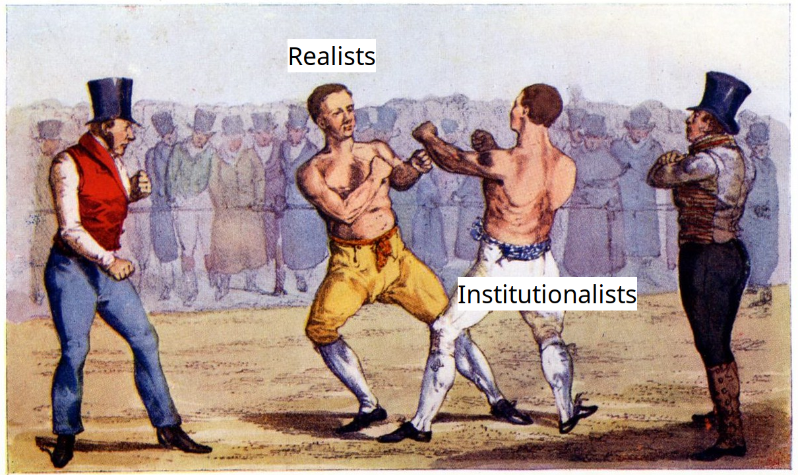

## Today's Agenda {background-image="./Images/background-scales_justice_v3.png" .center}

```{r}
# background-size="1920px 1080px"
library(tidyverse)
library(readxl)
```

<br>

**Section 1: Analyzing International Institutions**

<br>

**Do international institutions matter?**

- Comparative Case Study Analyses

<br>

::: r-stack
Justin Leinaweaver (Fall 2026)
:::

::: notes

**Prep for Class**

1. Check Canvas submissions

<br>

Last week we defined international law using the perspective of judges and lawyers

- Article 38 of the Statute of the ICJ proved very useful for organizing this perspectve

<br>

**SLIDE**: This week our focus has shifted to the perspective of social scientists

:::


## Do international institutions matter? {background-image="./Images/background-scales_justice_v3.png" .center}

{style="display: block; margin: 0 auto"}

::: notes

Our interest this week has been to add two important theories to your toolbox for understanding international politics

- Mearsheimer (1994) gave us a crash course in how the realist paradigm thinks about international institutions

- Keohane (1984) gave us a crash course in how the institutionalist paradigm thinks about international institutions

<br>

Our job for today is to make sure:

1. We're clear on what these theories assume, AND 

2. We are comfortable applying them to actual outcomes in the world.

<br>

Ultimately, theory is only as useful as it is accurate in making predictions about the real world

- SO, does reality look more like offensive realism or institutionalism?

- Let's find out!

<br>

**SLIDE**: First, let's make sure we're clear on the theories themselves

:::


## Do international institutions matter? {background-image="./Images/background-scales_justice_v3.png" .center}

<br>

### What [baseline assumptions]{style="color:blue;"} about international politics do Mearsheimer and Keohane [agree]{style="color:blue;"} on?

::: notes

Everybody review your notes from this week

- Focus on the theoretical rationale of each approach

- Get ready to report back to me, what are the key assumptions that both Mearsheimer and Keohane appear to agree upon?

- Go!

<br>

*ON BOARD: Column 1 - Points of Agreement*

- Systemic anarchy

- States have the capacity to hurt each other (offensive capacity)

- States behave strategically (instrumental rationality)

- High uncertainty (states can never be certain about the intentions of other states)

<br>

That is a ton of shared assumptions about the world!

- **SLIDE**: Now add the other side!

:::


## Do international institutions matter? {background-image="./Images/background-scales_justice_v3.png" .center}

<br>

### What [baseline assumptions]{style="color:red;"} about international politics do Mearsheimer and Keohane [disagree]{style="color:red;"} on?

::: notes

Get ready to report back to me, what are the key assumptions that both Mearsheimer and Keohane appear to disagree on?

- Go!

<br>

*ON BOARD: Column 2 - Points of Disagreement*

**Mearsheimer (1994)**

- States fear for their survival

- Cooperation without enforcement allows for cheating (threat to survival)

- Cooperation without enforcement may produce unequal gains (relative gains threat to survival)

**Keohane (1984)**

- Cooperation, even without enforcement, can:

- Coordinate behavior

- Reduce transaction costs for preferred behaviors

- Increase transaction costs for discouraged behaviors

- Establish and reinforce reputations

- Encourage continued good behavior through: sunk costs, transgovernmental friendships, retaliatory linkages and the fear of bad precedents

<br>

**Ok, so fundamentally, where do these two theories differ most substantially?**

(**SLIDE**)

:::


## Do international institutions matter? {background-image="./Images/background-scales_justice_v3.png" .center .smaller}

**Both Theories Assume:**

- Systemic anarchy
- Offensive capacity
- Strategic behavior
- Uncertain intentions

**Mearsheimer (1994)**

- Cooperation in the absence of enforcement is a threat to your survival so states won't be willing to do it

**Keohane (1984)**

- Cooperation in the absence of enforcement can generate substantial positive outcomes so states will be willing to do it

::: notes

The fundamental disagreement is about the impacts of cooperation in the absence of enforcement

- For Mearsheimer, that is a world in which you increase the threats to your survival so you won't do it

- For Keohane, that is a world in which you can increase positive outcomes on the world stage and so you do it

<br>

**IS everybody clear on these points of agreement and differences?**

<br>

**SLIDE**: Alright, let's turn to the empirics!

:::


## A Comparative Case Study {background-image="./Images/background-scales_justice_v3.png" .center}

<br>

::: {.r-fit-text}

**International institutions...**

- **“...have minimal influence on state behavior”**

VS 

- **...can facilitate cooperation ("policy coordination")**

:::

::: notes

For today, each of you went out and found us a piece of evidence that supports one of these competing theories

<br>

*Split class in half*

- Group 1, you focus on the Mearsheimer discussion board

- Group 2, you focus on the Keohane discussion board

<br>

I am NOT asking you to adopt your assigned perspective as the "correct" one.

- REMEMBER, these are theories meant to help us explain outcomes

- The exercise for us is to see how well these theories explain some outcomes in the world

<br>

SO, groups, focus on the evidence submitted in your assigned discussion board

- Build an argument on the board that helps us see in what cases this theory is most useful

- What are the strongest pieces of evidence consistent with the theoretical perspective of each researcher

- **Make sense?**

- Make sure to write in complete sentences! Go!

<br>

*PRESENT and DISCUSS each*

<br>

**Bottom line, where do you end up?**

- **Which theory is more useful? Why?**

<br>

**SLIDE**: For next class

<br>

Canvas DISCUSSION: Case Study 1 - Case Study 1 - International institutions “have minimal influence on state behavior”

Find us a recent example of an international institution (custom, treaty or international organization) EITHER failing in its stated goals OR succeeding in them ENTIRELY as a reflection of the balance of power in the world. In other words, find us evidence that Mearsheimer's view of international institutions explains outcomes in the real world. You may not submit the same case claimed by someone else in class (e.g. specific action in response to a specific moment).

1. What is the international institution you are evaluating?
2. Submit the APA citation for a piece of evidence supporting your argument
3. Briefly explain your argument (e.g. why is this an example of Mearsheimer being "right"?)

Canvas DISCUSSION: Case Study 2 - Institutions can facilitate cooperation

Find us a recent example of an international institution (custom, treaty or international organization) successfully performing one of the key mechanisms raised by Keohane in his functional theory of regimes (Chapter 6). You may not submit the same case claimed by someone else in class (e.g. specific mechanism by a specific regime).

1. What is the international institution you are evaluating?
2. Submit the APA citation for a piece of evidence supporting your argument
3. Briefly explain your argument (e.g. why is this an example of Keohane's theory in action?)


:::


## For Next Class {background-image="./Images/background-scales_justice_v3.png" .center}

<br>

**Analyzing International Institutions: Legalization**

<br>

Abbott, Keohane, Moravcsik, Slaughter and Snidal. (2000). The Concept of Legalization. *International Organization*. Vol. 54, No. 3.


::: notes

Next week we shift from the history, the law and the competing theories and into the tools we need to analyze international institutions

- This article will introduce you to the concepts of legalization

- Legalization will help us cut through the dense language and structure of international laws in order to better understand their design and likely effectiveness

<br>

You'll have a reading, a Canvas assignment and a treaty example to bring to class

- **Questions on the assignment?**

:::