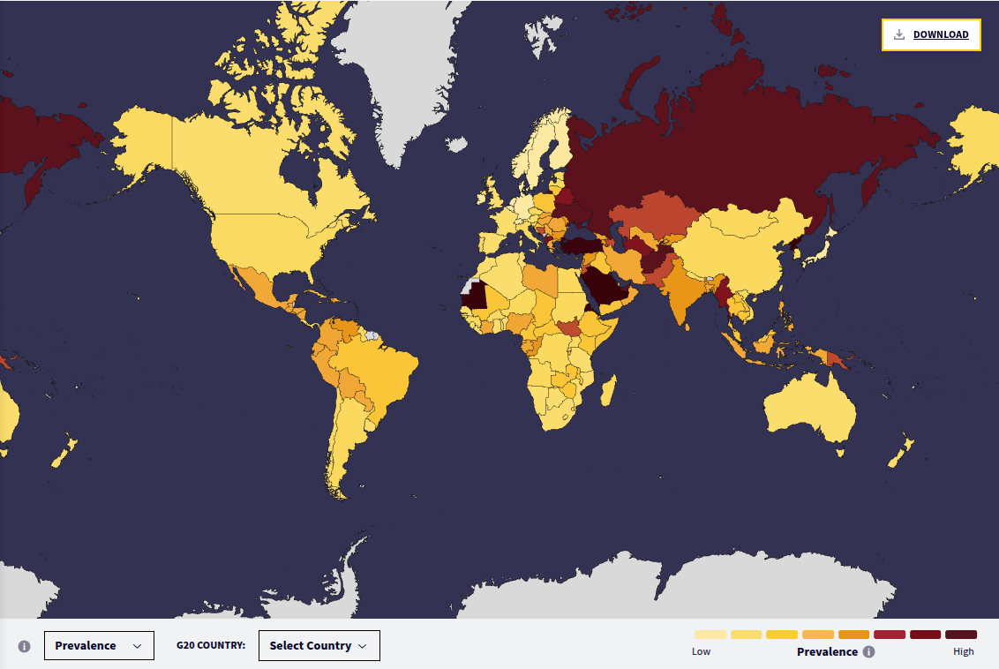
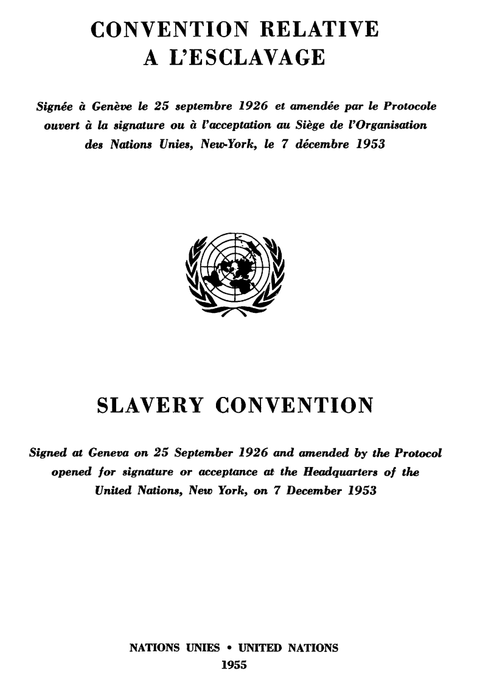
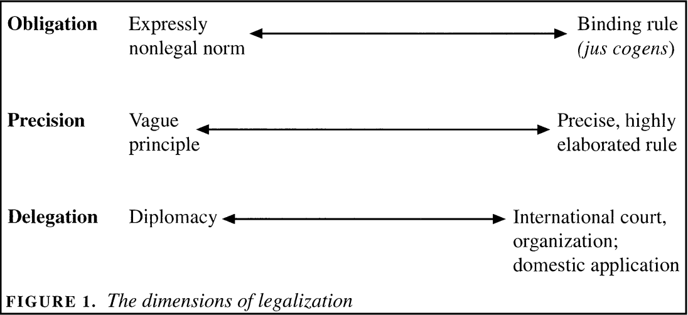
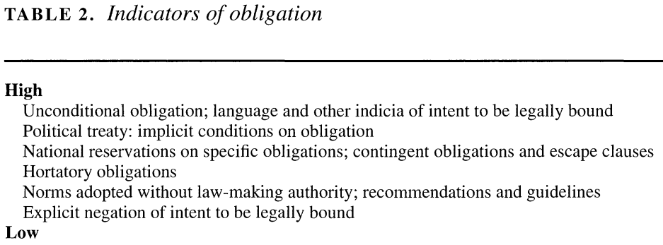
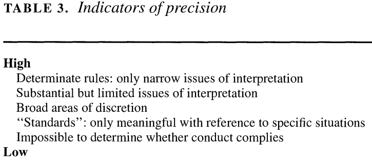
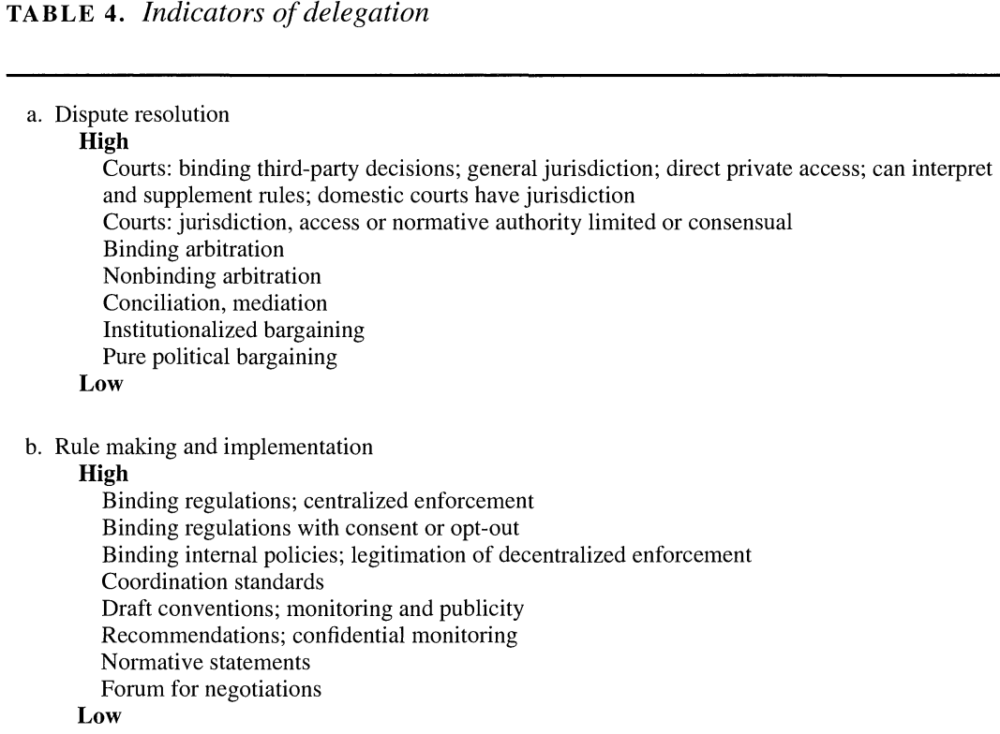
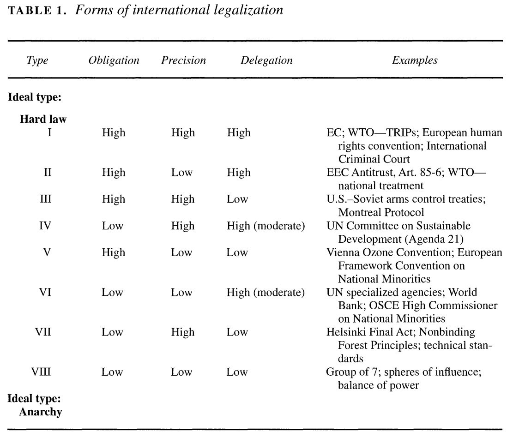

## Today's Agenda {background-image="./Images/background-scales_justice_v3.png" .center}

```{r}
# background-size="1920px 1080px"
library(tidyverse)
library(readxl)
```

<br>

**Section 1: Analyzing International Institutions**

<br>

**Do international institutions matter?**

- Using "Legalization" to analyze international institutions (Abbott, Keohane, Moravcsik, Slaughter & Snidal 2000)

<br>

::: r-stack
Justin Leinaweaver (Fall 2026)
:::

::: notes

**Prep for Class**

1. Check Canvas submissions

2. Open RStudio so you can record answers from class applying legalization to the Slavery convention for future years

<br>

The first section of our class has focused on getting you up to speed on the concepts and tools we need to analyze international institutions

<br>

We have spent the first three weeks focused on defining and understanding the concepts of international law and international institutions

- To do this we have been reading, exploring and analyzing the work of a diverse set of scholars including historians, judges, law professors and political scientists

- **SLIDE**: All of this has been an effort to answer this question...

:::


## {background-image="./Images/background-scales_justice_v3.png" .center}

::: {.r-fit-text}
**What is international law?**
:::

::: notes

Take a minute, talk to the people around you and get ready to report back your answer to this question

- *DISCUSS*

<br>

**SLIDE**: Let's reframe our different sources from the last three weeks as competing answers to this question

:::


## What is international law? {background-image="./Images/background-scales_justice_v3.png" .center}

<br>

International law is...

::: {.incremental}

- A tool for justifying the actions of states outside their borders (Grotius)

- A substantial body of rules underpinned by coherent principles built through state practice (Cassese and Hollis)

- An intervening variable for explaining outcomes (Mearsheimer)

- A set of tools meant to facilitate policy coordination (Keohane)
:::

::: notes

**How would Hugo Grotius answer this question?**

- (**REVEAL**: International law is a tool for justifying the actions of states outside their borders)

- (Under the "old" legal order a set of rules that allowed states to take what they want and have their conquests accepted as "just", e.g. might makes right)

<br>

**How would Hugo Cassese answer this question?**

- (**REVEAL**: International law is a substantial body of rules underpinned by coherent principles built through state practice and legal principle)

- (An umbrella term referring to rules established EITHER through international custom, international treaty or referring to the principles underpinning international relations of the last 75 years)

<br>

**How would Mearsheimer answer this question?**

- (**REVEAL**: International law is an intervening variable for explaining outcomes) 
- (A fig leaf covering the interests of powerful states applied to the weak states)

<br>

**How would Keohane answer this question?**

- (**REVEAL**: International law is a set of tools meant to facilitate policy coordination IN THE ABSENCE OF CENTRALIZED ENFORCEMENT)

<br>

**SLIDE**: The good news...

:::


## What is international law? {background-image="./Images/background-scales_justice_v3.png" .center}

<br>

International law is...

- A tool for justifying the actions of states outside their borders (Grotius)

- A substantial body of rules underpinned by coherent principles built through state practice (Cassese and Hollis)

- An intervening variable for explaining outcomes (Mearsheimer)

- A set of tools meant to facilitate policy coordination (Keohane)

::: notes

The good news is that this debate does not need to remain purely normative or theoretical

- Each of these claims are empirical in nature and that means we can use data to evaluate them!

- The exercise for us is to use data to evaluate HOW and WHETHER international rules impact important political outcomes between AND within states

<br>

**For example, and focusing on the contrast here between Griotius and the legal scholars (Cassese and Hollis), what measurable outcomes would we expect to see in the world?**

- (Do states behave like international rules are binding on their behavior?)

    - e.g. state X takes action Y that is consistent with the obligations of an international institution

    - Even better if they claim they are doing it BECAUSE of the obligation!

    - Cassese predicts states should consistently behave like international law "matters" and invoke it as the reasons for their actions
    
- (Do states ever transform domestic rules to be more consistent with international ones?)

<br>

**If Mearsheimer is right, what measurable outcomes would we expect to see in the world?**

- (Does international law transform meaningfully to mimic changes in the balance of power?)

- e.g. International institution Y changes in response to demands by powerful states

<br>

**If Keohane is right, what measurable outcomes would we expect to see in the world?**

- (Can we find concrete examples of treaty designs tailored to address specific collective action problems?
    
- (If we can, have those designs enabled meaningful policy coordination or not?)

- e.g. problem X prevents cooperation UNTIL institution Y is established?

<br>

So, that is our next job.

- We want to actually test these big ideas using data from the real world

- In other words, can we find evidence that international institutions matter?

<br>

**SLIDE**: An important first step for us will be to dig into some specifics!

:::


## {background-image="./Images/background-scales_justice_v3.png"}

::: {.r-fit-text}
**Was the Slavery Convention (1926) effective?**
:::

{.absolute right=0 bottom=0 width="850"}

{.absolute left=0 top=175 width="300"}

::: notes

For today I asked each of you to bring a copy of the 1926 Slavery Convention to class

- This international institution was designed to end slavery and that seems like a pretty clear and easy to measure goal!

<br>

On the right is a map showing where slavery is prevalent in the world today as produced by the human rights organization Walk Free.

- Rather than continuing to debate "international law" purely in the abstract, our focus now shifts to asking if specific international institutions like this convention actually had measurable impacts in the world

<br>

In order to evaluate these possible impacts, we need tools for unpacking an international institution

- Treaties tend to include a LOT of words, and we need methods for identifying their key elements

- Over the next two weeks I'll introduce you to two tools designed to help us identify the key parts of a treaty or organization for these purposes

- This week we focus on the concepts of legalization and next week the rational design conjectures.

<br>

**SLIDE**: Enough stalling, let's work with our first tool

:::


## {background-image="./Images/background-scales_justice_v3.png" .center}

**Abbott, Keohane, Moravcsik, Slaughter & Snidal (2000)**



::: notes

That brings us to a VERY important article in the IR literature

- I cannot emphasize enough how big these names are in the study of international relations over the last 25 years.

<br>

Legalization represents one way to approach analyzing and comparing international institutions regardless of their source.

- Legalization gives us three dimensions across which international institutions can vary

- Each dimension is a matter degree meaning it runs from "softer" forms of law to "harder" forms

- Each dimension can vary independently meaning harder levels of obligation do not automatically move levels of precision or delegation
    - A BIG part of the negotiation to create new international institutions is often directly an effort to move each of these pieces in order to find a final design that is acceptable
    
    - e.g. State X wants harder obligations so State Y demands less precision to compensate

<br>

Two **VERY important** notes on this tool:

1. Low levels of legalization across all three dimensions is NOT an argument that the institutions don't exist or that they don't matter
    - Soft law, even if primarily composed of vague recommendations to guide future negotiations, can still be very powerful in terms of moving behavior!
    
    - Example: The UNFCCC got the world to agree on a goal of averting dangerous climate change. Wasn't a binding rule BUT it completely structured the design of each new climate change treaty!
    
2. NONE of this is about making an effectiveness argument

    - Does the law "work" is a very important question that legalization can help you explore BUT not answer

<br>

**Any questions on the broad strokes of the tool?**

<br>

Let's talk through each dimension

- **SLIDE**: Starting with obligation

<br>

*Big picture notes*

- "Legalization" refers to a particular set of characteristics that institutions may (or may not) possess. These characteristics are defined along three dimensions: obligation, precision, and delegation. Obligation means that states or other actors are bound by a rule or commitment or by a set of rules or commitments. Specifically, it means that they are legally bound by a rule or commitment in the sense that their behavior thereunder is subject to scrutiny under the general rules, procedures, and discourse of international law, and often of domestic law as well. Precision means that rules unambiguously define the conduct they require, authorize, or proscribe. Delegation means that third parties have been granted authority to implement, interpret, and apply the rules; to resolve disputes; and (possibly) to make further rules" (401).
- Table 1 rank ordering is more a suggestion not a "strict ordering"
:::


## {background-image="./Images/background-scales_justice_v3.png" .center}

**Operationalizing Legalization**



::: notes

**What does it mean to evaluate a treaty in terms of its "obligations"?**

- "Obligation means that states or other actors are bound by a rule or commitment or by a set of rules or commitments" (401).

- "Bound" means that your behavior regarding this obligation "is subject to scrutiny under the general rules, procedures, and discourse of international law, and often of domestic law as well" (401). 

- In essence, obligation asks how significant or constraining of your behavior are the rules in the treaty

- Are they merely suggestions or absolute commandments?

- Think: States "shall" or states "must" vs states "are encouraged to"...

<br>

**Any questions on the six levels of obligation suggested by Table 2?**

<br>

**Per the reading, what are "conditions on obligation" in row 2?**

- (Treaties often specify that no one is bound by any rules until enough other states have also joined the treaty)

    - An effort to avoid a first mover disadvantage

<br>

**What are "contingent obligations"?**

- (A way to soften hard obligations using contingent conditions)

- (e.g. You must cut your climate emissions BUT based on national capabilities)

<br>

**And what are "escape clauses"?**

- (Another way to soften hard obligations allowing states to ignore a rule or leave a treaty under certain circumstances)

- (e.g. You may infringe on civil liberties during national emergencies)

<br>

**SLIDE**: Let's practice!

<br>

*Reading Notes*

Obligation (Table 2 p410)

- 'pacta sunt servanda' ("agreements must be kept") means essentially that "rules and commitments" in international agreements ARE obligatory meaning performed in good faith (409)
- 'rebus sic stantibus': “things standing thus” stipulates that, where there has been a fundamental change of circumstances, a party may withdraw from or terminate the treaty in question.
- Note how frequently seemingly hard obligations are softened by phrasing through things like contingent obligation (cut your climate emissions based on national capabilities) or offering an escape clause (infringe on civil liberties during national emergencies or simply allow states to walk away from a treaty as desired)
- More complicated are situations where seemingly strict obligations are created by institutions that lack the power to do so (UN GA resolutions). Interestingly, even though these are actually often nonbinding they can shape state behavior in significant ways thus demonstrating a greater power than ever assumed.

:::


## {background-image="./Images/background-scales_justice_v3.png" .center}

::: {.r-fit-text}
**Evaluating the obligations in the Slavery Convention (1926)**
:::

:::: {.columns}
::: {.column width="40%"}

:::

::: {.column width="60%"}


**Levels**: 

High, Medium or Low

:::
::::

::: notes

Let's now use this dimension of legalization to classify the Slavery Convention

- Start by working in small groups (2-3)

- Go through the treaty and identify the "obligations" for states it includes

- Don't assume that all of them will be the same level of obligation

<br>

*ON BOARD*

- Let's make a list of obligations and classify each one as either "High", "Medium" or "Low"

<br>

**FA26**

- ?

<br>

**SLIDE**: Next dimension: precision

:::


## {background-image="./Images/background-scales_justice_v3.png" .center}

**Operationalizing Legalization**



::: notes

**What would it mean to evaluate a treaty in terms of its "precision"?**

- "A precise rule specifies clearly and unambiguously what is expected of a state or other actor (in terms of both the intended objective and the means of achieving it) in a particular set of circumstances. In other words, precision narrows the scope for reasonable interpretation" (412).

- "For a set of rules, precision implies not just that each rule in the set is unambiguous, but that the rules are related to one another in a noncontradictory way, creating a framework within which case-by-case interpretation can be coherently carried out" (413).

<br>

**Any questions on the five levels of precision suggested by Table 3?**

<br>

**SLIDE**: Practice

<br>

*Other Reading Notes*

- Precision (Table 3 p415)
- Precise rules are often highly elaborated or dense (although not always)
- "The more "rule-like" a normative prescription, the more a community decides ex ante which categories of behavior are unacceptable; such decisions are typically made by legislative bodies. The more "standard-like" a prescription, the more a community makes this determination ex post, in relation to specific sets of facts; such decisions are usually entrusted to courts" (413).
- Given the absence of "judicial, quasi-judicial, and administrative authorities" in most areas of IR, imprecise rules are often left to interpretation by the states themselves.
- "Much of international law is in fact quite precise, and precision and elaboration appear to be increasing dramatically" (414).

:::


## {background-image="./Images/background-scales_justice_v3.png" .center}

::: {.r-fit-text}
**Evaluating the precision of the Slavery Convention (1926)**
:::

:::: {.columns}
::: {.column width="40%"}

:::

::: {.column width="60%"}


**Levels**: 

High, Medium or Low

:::
::::

::: notes

Let's now use this dimension of legalization to classify the Slavery Convention

- Start by working in small groups (2-3)

- Go through the treaty and focus on the "precision" of the expectations for states

<br>

*ON BOARD*

Groups, how do you classify the precision of this treaty?

- Give us examples too!

<br>

**FA23**

- ?

<br>

**SLIDE**: Final dimension, delegation

:::


## {background-image="./Images/background-scales_justice_v3.png" .center}

**Operationalizing Legalization**



::: notes

**What would it mean to evaluate a treaty in terms of its "delegation"?**

- Can be split into two parts: Dispute resolution and rule-making/implementation

- the extent to which states and other actors delegate authority to designated third parties including courts, arbitrators, and administrative organizations to implement agreements.

- In addition, "As Table 4b indicates, a range of institutions from simple consultative arrangements to full-fledged international bureaucracies helps to elaborate imprecise legal norms, implement agreed rules, and facilitate enforcement" (417).

<br>

**Any questions on the levels of delegation suggested by Table 4?**

<br>

**SLIDE**: Practice

<br>

**Reading Notes**

Delegation (Table 4 p)

- "The third dimension of legalization is the extent to which states and other actors delegate authority to designated third parties including courts, arbitrators, and administrative organizations to implement agreements. The characteristic forms of legal delegation are third-party dispute settlement mechanisms authorized to interpret rules and apply them to particular facts (and therefore in effect to make new rules, at least interstitially) under established doctrines of international law" (415).
- See Table for the VERY wide range of ways this can be implemented
- Some institutions even allow for individuals and private groups to "initiate a legal proceeding"
- In addition, "As Table 4b indicates, a range of institutions from simple consultative arrangements to full-fledged international bureaucracies helps to elaborate imprecise legal norms, implement agreed rules, and facilitate enforcement" (417).
- "Many operational activities serve to implement legal norms. Virtually all international organizations gather and disseminate information relevant to implementation; many also generate new information" (417).
- "Legalized delegation, especially in its harder forms, introduces new actors and new forms of politics into interstate relation" (418).
- "Deciding disputes, adapting or developing new rules, implementing agreed norms, and responding to rule violations all engender their own type of politics, which helps to restructure traditional interstate politics" (418).

:::


## {background-image="./Images/background-scales_justice_v3.png" .center}

::: {.r-fit-text}
**Evaluating the delegation in the Slavery Convention (1926)**
:::

:::: {.columns}
::: {.column width="40%"}

:::

::: {.column width="60%"}


**Levels**: 

High, Medium or Low

:::
::::

::: notes

Let's now use this dimension of legalization to classify the Slavery Convention we examined last week.

- Start by working in small groups (2-3)

- Go through the treaty and identify any clauses in the treaty that delegates authority to third party actors

<br>

*ON BOARD*

- Let's make a list of delegation elements and classify each one as either "High", "Medium" or "Low"

<br>

**FA23**

- ?

<br>

**SLIDE**: Let's step back and think about these dimensions as a summary of this convention

:::


## {background-image="./Images/background-scales_justice_v3.png" .center}

::: {.r-fit-text}
**Applying Legalization to the Slavery Convention (1926)** 
:::

:::: {.columns}
::: {.column width="50%"}


:::

::: {.column width="50%"}

:::
::::

::: notes

Having now read through the convention using these three dimensions, I'd like you to step back and reflect on the tool itself

- **Does the legalization tool produce a useful summary of the convention? Why or why not?**

- e.g. Let's report back on your answers to Canvas Q1: *1. Based on the work we've done over the first three weeks of class, how confident are you that these three specific dimensions of legalization allow us to capture the important elements of an international institution? Are they missing anything you believe is important for understanding the impacts of international law? Be sure to explain your reasoning.*

<br>

**Is there anything in the convention that struck you as important but isn't represented by the three dimensions of legalization?**

<br>

**SLIDE**: Placement as hard vs soft law

:::


## {background-image="./Images/background-scales_justice_v3.png" .center}

{style="display: block; margin: 0 auto"}

::: notes

This all brings us "back" to Table 1 in the paper

- Using these three dimensions of legalization allows us to classify international institutions in a hierarchical manner

- Those on the "high" end of each dimension we call "hard" law.

- Those on the "low" end we think of as "soft" law.

<br>

**Based on our work in class today, where in Table 1 does the Slavery Convention fit? What is it comparable to?**

<br>

For the second Canvas question I asked you to reflect a bit on this table

- The order of the rows in Table 1 suggest that some of the dimensions of legalization are more important than others for establishing "hard law". 

- **According to this ordering which of the three dimensions of legalization are most important for moving an institution towards "hard law"?**

- (Lines 5,6 and 7 give away the game: Obligation > Delegation > Precision)

<br>

**Do we agree with this rank ordering? Why or why not?**

- NOTE that the authors admit that the rank ordering in Table 1 is more a suggestion than a "strict ordering"

<br>

**SLIDE**: For next class

:::


## Next Class {background-image="./Images/background-scales_justice_v3.png" .center}

<br>

**Practice with the Legalization Tool**

- Analyze: The Treaty on the Prohibition of Nuclear Weapons (2017)

- Bring to Class: The International Convention for the Regulation of Whaling (1946)

::: notes

Before class you'll submit your analysis of the Treaty on the Prohibition of Nuclear Weapons to Canvas

<br>

Then bring the International Convention for the Regulation of Whaling (1946) to class

<br>

**Questions on any of our material from today or the assignment?**

:::


