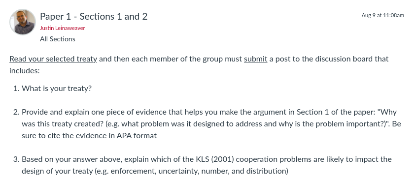
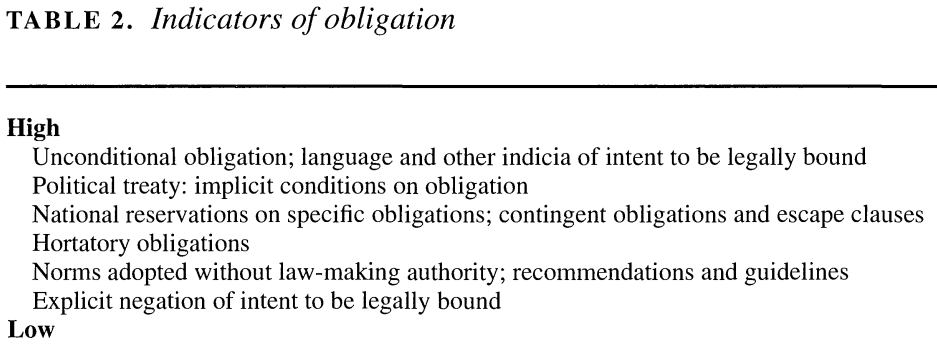
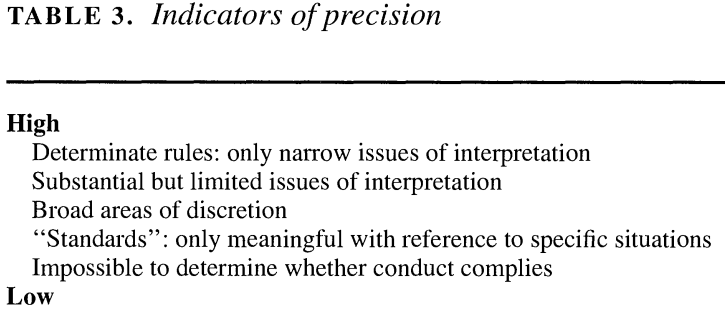
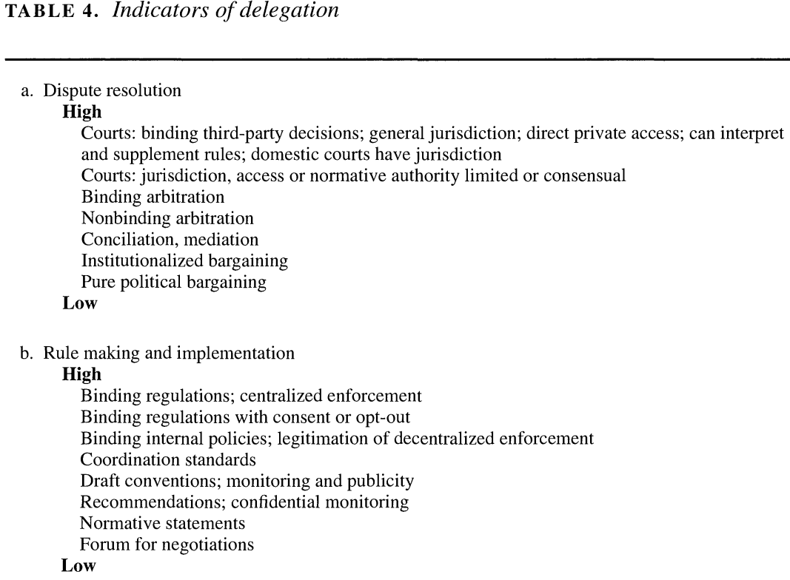

---
output:
  xaringan::moon_reader:
    css: ["default", "extra.css"]
    lib_dir: libs
    seal: false
    nature:
      highlightStyle: github
      highlightLines: true
      countIncrementalSlides: false
      ratio: '16:9'
---

```{r, echo = FALSE, warning = FALSE, message = FALSE}
library(tidyverse)
#library(readxl)
#library(stargazer)
#library(kableExtra)
#library(modelr)

knitr::opts_chunk$set(echo = FALSE,
                      eval = TRUE,
                      error = FALSE,
                      message = FALSE,
                      warning = FALSE,
                      comment = NA)
```

background-image: url('libs/Images/background-scales_justice_v3.png')
background-size: 105%
background-position: top
class: middle

.size50[**I. Basics of Analyzing International Institutions**]

<br>

.size50[**Today's Agenda**

Groups working on Paper 1: Sections 1 and 2
]

<br>

.center[.size40[
  Justin Leinaweaver (Fall 2023)
]]

???

### Prep for Class
1. Review Canvas submissions

<br>

**SLIDE**: This week we work in class on the first paper


---

background-image: url('libs/Images/background-blue_cubes_lighter3.png')
background-size: 100%
background-position: center
class: middle

.size45[.content-box-white[**Paper 1 - Treaty Design Analysis**]]

.size35[
Submit a report that describes and analyzes a multilateral, international treaty.

1. Why was this treaty created? (e.g. what problem was it designed to address and why is the problem important?)

2. What specifically does it do? Describe the design of the treaty using the dimensions of legalization and the rational design conjectures

3. How effective has the treaty been in addressing the problem that motivated its creation?
]

???

### Questions on the prompt?


---

background-image: url('libs/Images/background-blue_triangles.jpg')
background-size: 100%
background-position: center
class: middle

.size65[.content-box-white[**For Today**]]

```{r, echo = FALSE, fig.align = 'center', out.width = '100%'}

```

???

Canvas: Read your selected treaty and then each member of the group must submit a post to the discussion board that includes:

1. What is your treaty?

2. Provide and explain one piece of evidence that helps you make the argument in Section 1 of the paper (Why was this treaty created?). Be sure to cite the evidence in APA format

3. Based on your answer above, explain which of the KLS cooperation problems are likely to impact the design of your treaty (e.g. enforcement, uncertainty, number, and distribution)

<br>

### Everybody ready to go with this?

<br>

Today we'll step through building an outline for the first two sections of your paper.

- **SLIDE**: Let's begin with Section 1


---

background-image: url('libs/Images/background-blue_cubes_lighter3.png')
background-size: 100%
background-position: center
class: middle

.center[
.size55[.content-box-white[**Paper 1 - Treaty Design Analysis**]]
]

<br>

.size45[
1) Why was this treaty created? (e.g. what problem was it designed to address and why is the problem important?)
- Outline on Board: Premises to the conclusion

- Each premise requires evidence
]

???

Groups: Take 20 minutes to work on Section 1 of the paper

1. Review the cases you each submitted, then 

2. Write an outline for this section of the paper on the board
    - Diagram should be a list of premises leading to a clear conclusion
    
    - Goal should be 3 - 4 premises
    
    - Each premise should identify the evidence you have to support it (or flag where evidence is needed!)
    
<br>

### Questions on this task?

- I'm only giving you 20 minutes for this task because:
    - Each of you already submitted a reason + evidence, 
    - I don't want you to overthink it, and 
    - we need the bulk of our time today for Section 2

- Get to it!

<br>

*Give groups feedback as they work*

- *Encourage them to check in on work of other groups for ideas*


---

background-image: url('libs/Images/background-blue_cubes_lighter3.png')
background-size: 100%
background-position: center
class: middle

.center[
.size55[.content-box-white[**Paper 1 - Treaty Design Analysis**]]
]

.size40[
2) What specifically does it do? Describe the design of the treaty using the dimensions of legalization and the rational design conjectures
]

???

Groups: Take the rest of our time today to work on Section 2 of the paper

- I'm going to ask you to complete three separate tasks

- It will be up to you to manage your time on these tasks so don't mess around!

--

.size40[
i. List the key obligations and evaluate the precision of each
]

???

<br>

First task: Make a list of the key obligations ON THE BOARD and classify each by their level of precision

--

.size40[
ii. List the delegated powers: DR vs RM/IM
]

???

<br>

Second task: Make two lists of delegated powers ON THE BOARD
- One list focused on dispute resolution
- One list focused on rule making and implementation

--

.size40[
iii. What do we learn about the international effort to solve this problem using the KLS design conjectures?
]

???

<br>

Final task: Use the KLS design conjectures to analyze your treaty

- The KLS conjectures let you use what you've learned in Section 1 + your analyses in Section 2 to more deeply analyze your treaty

- In other words, the KLS conjectures should tell you something specific about the challenges facing this international law

<br>

### Questions on these tasks?

- Get to it!

<br>

*Give groups feedback as they work*

- *Encourage them to check in on work of other groups for ideas*

<br>

(IF NEEDED: **SLIDE** with legalization tables and **SLIDE** with design conjectures)


---

background-image: url('libs/Images/background-blue_cubes_lighter3.png')
background-size: 100%
background-position: center
class: middle

.center[.size45[.content-box-white[**The Dimensions of Legalization**]]]

.pull-left[
```{r, echo = FALSE, fig.align='center', out.width = '100%'}

```

```{r, echo = FALSE, fig.align='center', out.width = '100%'}

```
]

.pull-right[
```{r, echo = FALSE, fig.align='center', out.width = '100%'}

```
]


---

background-image: url('libs/Images/background-blue_cubes_lighter3.png')
background-size: 100%
background-position: center
class: middle

.center[.size45[.content-box-white[**The KLS Design Conjectures**]]]

<br>

```{r, echo = FALSE, fig.align='center', out.width = '85%'}
knitr::include_graphics("libs/Images/03_2-KLS_Table1.png")
```


---

background-image: url('libs/Images/background-blue_triangles.jpg')
background-size: 100%
background-position: center
class: middle

.size65[.content-box-white[**For Next Class**]]

<br>

```{r, echo = FALSE, fig.align = 'center', out.width = '100%'}

```

???


