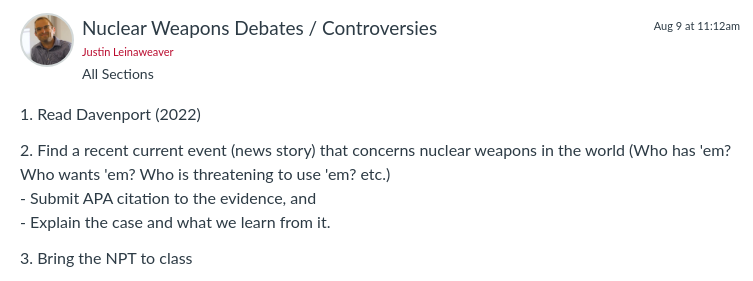

---
output:
  xaringan::moon_reader:
    css: ["default", "extra.css"]
    lib_dir: libs
    seal: false
    nature:
      highlightStyle: github
      highlightLines: true
      countIncrementalSlides: false
      ratio: '16:9'
---

```{r, echo = FALSE, warning = FALSE, message = FALSE}
library(tidyverse)
#library(readxl)
#library(stargazer)
#library(kableExtra)
#library(modelr)

knitr::opts_chunk$set(echo = FALSE,
                      eval = TRUE,
                      error = FALSE,
                      message = FALSE,
                      warning = FALSE,
                      comment = NA)
```

background-image: url('libs/Images/background-scales_justice_v3.png')
background-size: 105%
background-position: top
class: middle

.size50[**I. Basics of Analyzing International Institutions**]

<br>

.size50[**Today's Agenda**

Groups working on Paper 1: Section 3
]

<br>

.center[.size40[
  Justin Leinaweaver (Fall 2023)
]]

???

### Prep for Class
1. Review Canvas submissions

<br>

**SLIDE**: Today we continue our work on the first paper


---

background-image: url('libs/Images/background-blue_cubes_lighter3.png')
background-size: 100%
background-position: center
class: middle

.size45[.content-box-white[**Paper 1 - Treaty Design Analysis**]]

.size35[
Submit a report that describes and analyzes a multilateral, international treaty.

1. Why was this treaty created? (e.g. what problem was it designed to address and why is the problem important?)

2. What specifically does it do? Describe the design of the treaty using the dimensions of legalization and the rational design conjectures

3. How effective has the treaty been in addressing the problem that motivated its creation?
]

???

### Questions on the prompt?

<br>

### Does each group have an outline of Section 1 completed?

<br>

### Does each group have three lists of descriptive analyses completed for Section 2?
### 1) Obligations + Precision of rules
### 2) Delegation: Dispute resolution, rule making and implementation
### 3) Insights from applying the KLS conjectures to your treaty


---

background-image: url('libs/Images/background-blue_triangles.jpg')
background-size: 100%
background-position: center
class: middle

.size65[.content-box-white[**For Today**]]

<br>

```{r, echo = FALSE, fig.align = 'center', out.width = '100%'}
knitr::include_graphics("libs/Images/04_1-Assignment_next_class.png")
```

???

### Everybody ready for today's assignment?


---

background-image: url('libs/Images/background-blue_cubes_lighter3.png')
background-size: 100%
background-position: center
class: middle

.center[
.size55[.content-box-white[**Paper 1 - Treaty Design Analysis**]]
]

<br>

.size45[
3) How effective has the treaty been in addressing the problem that motivated its creation?
- Outline on Board: Premises to the conclusion

- Each premise requires evidence
]

???

Groups: Take the first half of class (35 minutes) to work on Section 3 of the paper

1. Review the cases you each submitted, then 

2. Write an outline for this section of the paper on the board
    - Diagram should be a list of premises leading to a clear conclusion
    
    - Goal should be 3 - 4 premises
    
    - Each premise should identify the evidence you have to support it (or flag where evidence is needed!)
    
<br>

### Questions on this task?

- Get to it!

<br>

*Give groups feedback as they work*

- *Encourage them to check in on work of other groups for ideas*


---

background-image: url('libs/Images/background-blue_cubes_lighter3.png')
background-size: 100%
background-position: center
class: middle

.size45[.content-box-white[**Paper 1 - Treaty Design Analysis**]]

.size35[
Submit a report that describes and analyzes a multilateral, international treaty.

1. Why was this treaty created? (e.g. what problem was it designed to address and why is the problem important?)

2. What specifically does it do? Describe the design of the treaty using the dimensions of legalization and the rational design conjectures

3. How effective has the treaty been in addressing the problem that motivated its creation?
]

???

The rest of today is a writing workshop.

- Focus on whatever parts of this assignment you'd like.


---

background-image: url('libs/Images/background-blue_triangles.jpg')
background-size: 100%
background-position: center
class: middle

.center[.size40[.content-box-purple[**Section 2**]]

.size40[.content-box-purple[**International Institutions for Mutual Restraint**]]

.size40[.content-box-purple[**(agreeing what states ought not to do)**]]]

<br>

```{r, echo = FALSE, fig.align = 'center', out.width = '90%'}

```

???

Next week we dive into our first empirical section of the class.

- We focus on international institutions designed for mutual restraint

- aka How do we get states to stop doing something specific?

<br>

We'll start this section by analyzing the Treaty on the Non-Proliferation of Nuclear Weapons (NPT)

- I like to start these sections with real world implications hence the assignment for Tuesday

<br>

Read Davenport (2022) on the current state of nukes in the world, then...

<br>

Find a recent current event (news story) that concerns nuclear weapons in the world (Who has 'em? Who wants 'em? Who is threatening to use 'em? etc.)

- Submit APA citation to the evidence

- Explain the case and what we learn from it.

- NO OVERLAP in cases!

<br>

### Questions on the assignment?


