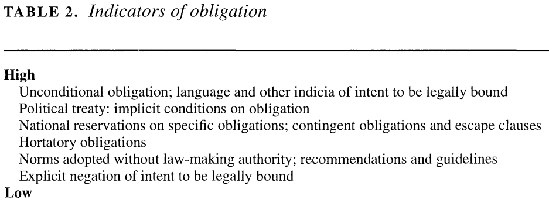
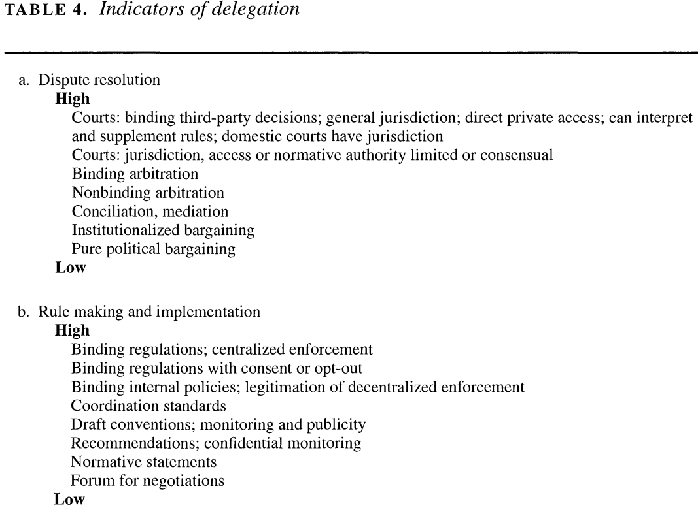
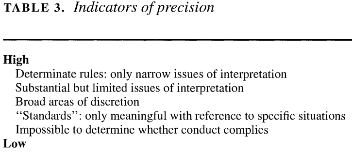

---
output:
  xaringan::moon_reader:
    css: ["default", "extra.css"]
    lib_dir: libs
    seal: false
    nature:
      highlightStyle: github
      highlightLines: true
      countIncrementalSlides: false
      ratio: '16:9'
---

```{r, echo = FALSE, warning = FALSE, message = FALSE}
library(tidyverse)
#library(readxl)
#library(stargazer)
#library(kableExtra)
#library(modelr)

knitr::opts_chunk$set(echo = FALSE,
                      eval = TRUE,
                      error = FALSE,
                      message = FALSE,
                      warning = FALSE,
                      comment = NA)
```

background-image: url('libs/Images/background-scales_justice_v3.png')
background-size: 105%
background-position: top
class: middle

.size45[**II. International Institutions for Mutual Restraint**]

<br>

.size50[**Today's Agenda: Design Analysis**

- Treaty on the Non-Proliferation of Nuclear Weapons (NPT)
]

<br>

.center[.size40[
  Justin Leinaweaver (Fall 2023)
]]

???

### Prep for Class
1. Review Canvas submissions

2. Open rmd file so you can record treaty analysis notes from board

<br>

#### References
- [Treaty on the Non-Proliferation of Nuclear Weapons (NPT)](https://treaties.un.org/doc/Publication/UNTS/Volume%20729/volume-729-I-10485-English.pdf)

- [UNTC Listing](https://treaties.un.org/pages/showDetails.aspx?objid=08000002801d56c5)

- [Davenport 2022](https://www.armscontrol.org/factsheets/Nuclearweaponswhohaswhat)


---

background-image: url('libs/Images/background-blue_cubes_lighter3.png')
background-size: 100%
background-position: center
class: middle

.size55[.content-box-white[**Semester Plan of Attack**]]

.size45[
.textblue[**I. Basics of Analyzing International Institutions**]

- The sources of international law

- The debate about impact

- The dimensions of Legalization

- The Rational Design Conjectures

]

???

The first four weeks of our class we've been laying the foundations for studying international institutions.

<br>

Specifically, we have explored:

- The sources of international law: Treaties, Custom and General Principles

- The debate about the impact of those laws on state behavior,

- How the legalization dimensions can help us summarize an international law, and

- How the Rational Design Conjectures can help us analyze those laws.

<br>

### Any questions on this material?


---

background-image: url('libs/Images/background-blue_cubes_lighter3.png')
background-size: 100%
background-position: center
class: middle

.size55[.content-box-white[**Semester Plan of Attack**]]

.size45[
.textblue[**II. International Institutions for Mutual Restraint**]

- The Treaty on the Non-Proliferation of Nuclear Weapons (NPT)

- The Convention Against Torture (CAT)

- Principal-Agent Theory

- The International Criminal Court

]

???

Today we start Section 2 of class in which we'll focus on International Institutions for Mutual Restraint

- e.g. agreeing what states ought not to do

<br>

Plan:

- This week we kick things off with the NPT treaty that aims to limit the spread of nuclear weapons around the world.

- Next week we'll analyze the CAT which directly targets some of the worst human rights abuses around the world

- We will then use PA theory to deepen our thinking about the costs and benefits of delegation

- Finally we'll use PA theory to analyze our first IO of the term, the ICC.

<br>

**SLIDE**: So, today we focus on the problem of nuclear weapons and how states have tried to address this problem


---

background-image: url('libs/Images/05_1-Earth_Bombs_95.png')
background-size: 100%
background-position: center
class: inverse, middle

.center[.size50[**Treaty on the Non-Proliferation of Nuclear Weapons (NPT)**]]

.size45[

<br>

1. What is the current state of the problem?

2. What is the treaty designed to do?

3. What is the likelihood that this design will succeed?
]

???

Today we kick off our week on the NPT

- The global attempt to prevent the nukes that were developed during WWII from spreading around the world

<br>

I'd like us to work today through these three questions

- On Thursday we will explore and evaluate the effectiveness question using the academic literature

<br>

### Any questions on our plan?


---

background-image: url('libs/Images/05_1-Earth_Bombs.jpg')
background-size: 100%
background-position: center
class: bottom

.center[.size50[.content-box-blue[1) What is the current state of the problem?]]]

???

For today I asked each of you to find us a recent current event that concerns nuclear weapons in the world

- e.g. Who has 'em? Who wants 'em? Who is threatening to use 'em? etc.

<br>

Let's spend some time exploring what you've found.

- *ON BOARD*: Track countries, topics and any other important notes as we discuss

- *25 mins: Really encourage discussion and flesh out the implications of these stories*

<br>

All that said:

### 1) What is our collective sense of the current level of risk from nuclear weapons in the world today?

### 2) What are the biggest nuclear threats to the world right now? 

<br>

[Figures from Davenport (2022) as needed](https://www.armscontrol.org/factsheets/Nuclearweaponswhohaswhat)

- **SLIDE**: 2021 nuclear warhead inventories map

- **SLIDE**: 2021 nuclear warhead inventories bar chart

- **SLIDE**: 1945-2021 nuclear warhead inventories line plot


---

background-image: url('libs/Images/05_1-WarheadInventories.webp')
background-size: 90%
background-position: center
class: slideblue


---

background-image: url('libs/Images/05_1-BarChart_WarheadInventories.webp')
background-size: 90%
background-position: center
class: slideblue


---

background-image: url('libs/Images/05_1-GlobalNuclearWarheadInventories_1945-2021.webp')
background-size: 90%
background-position: center
class: slideblue

???

### Do we interpret this figure to mean that the risk of nuclear war is falling over time? Why or why not?


---

background-image: url('libs/Images/05_1-NPT_Signing.jpg')
background-size: 90%
background-position: center
class: slideblue, bottom

???

Image: US Ambassador Llewellyn E. Thompson signs the NPT as Soviet Foreign Minister Andrei A. Gromyko watches in Moscow, Russia, on July 1, 1968.

- A fascinating artifact of the time given that this was a GLOBAL treaty, but the primary signing ceremony involved only two actors

- Of course, this was also where most of the nukes were at the time

- Also, this is one of those, "signature doesn't matter" in terms of the law BUT can mean a TON in terms of the politics!


--

.center[.size45[.content-box-blue[2) What is the treaty designed to do?]]]

???

<br>

<br>

Our second task for today is to summarize the treaty in terms of its design.

- We'll follow a similar path to what you did on the first paper.

- *SPLIT class into small groups (3), NEW PARTNERS!*

- Go sit with your group


---

background-image: url('libs/Images/background-blue_cubes_lighter3.png')
background-size: 100%
background-position: center
class: middle

.center[.size45[.content-box-white[**Treaty on the Non-Proliferation of Nuclear Weapons**]]]

<br>

.pull-left[
```{r, echo = FALSE, fig.align='center', out.width = '100%'}

```
]

.pull-right[
```{r, echo = FALSE, fig.align='center', out.width = '100%'}

```
]

???

There are 11 articles in this treaty and we're going to hit them all!

- Our job will be to first identify all the parts of the treaty that specify obligations or delegations of specific powers

- Don't stress precision yet, just help us flag the key elements of the treaty

<br>

GROUPS: Start with Article 1 and summarize the obligations / delegations in it for me. 

- Don't rush this, it's not a race. Talk to your group then report back to the class.

<br>

*REPEAT for EACH*

- *DON'T skip the ones common to all treaties at the end, those are rules too!*

<br>

*ON BOARD*: Articles
1a. Don't transfer nukes 
1b. Don't help nuke development (precise! Don't assist, encourage or induce!)

2a. Don't accept nukes
2b. Don't manufacture nukes
2c. Don't accept assistance in manufacture of nukes

3.
4.
5.
6.
7.
8.
9.
10.
11.


---

background-image: url('libs/Images/background-blue_cubes_lighter3.png')
background-size: 100%
background-position: center
class: middle

.center[.size45[.content-box-white[**Treaty on the Non-Proliferation of Nuclear Weapons**]]]

<br>

```{r, echo = FALSE, fig.align='center', out.width = '80%'}

```

???

Now let's talk precision.

- Often it can be helpful to consider precision as a quality of the entire document rather than piece-by-piece

- This is because of the interlocking nature of the treaty's design

<br>

### In broad strokes, is this a hard or soft law approach to precision? Why?

### - Are there substantive differences in the levels of precision across the rules we identified?


---

background-image: url('libs/Images/background-blue_cubes_lighter3.png')
background-size: 100%
background-position: center
class: middle

.center[.size40[.content-box-white[**Koremenos, Lipson & Snidal (2001): Rational Design**]]]

.size40[
- Rational design

- Shadow of the future

- Transaction costs

- Risk aversion

Therefore, states design international institutions to facilitate and strengthen international cooperation.
]

???

Think back to the Rational Design article by Koremenos, Lipson & Snidal (2001).

### Does the design of the NPT offer support for the key premises in those authors model of international cooperation? Why or why not?

- *Talk to your group, then report back!*

<br>

#### Notes
- Rational design: States and other international actors, acting for self-interested reasons, design institutions purposefully to advance their joint interests.
- Shadow of the future: The value of future gains is strong enough to support a cooperative arrangement.
- Transaction costs: Establishing and participating in international institutions is costly.
- Risk aversion: States are risk-averse and worry about possible adverse effects when creating or modifying international institutions.


---

background-image: url('libs/Images/background-blue_cubes_lighter3.png')
background-size: 100%
background-position: center
class: middle

.center[.size45[.content-box-white[**Treaty on the Non-Proliferation of Nuclear Weapons**]]]

<br>

```{r, echo = FALSE, fig.align='center', out.width = '80%'}
knitr::include_graphics("libs/Images/03_2-KLS_Table1.png")
```

???

Let's now use the Rational Design Conjectures to analyze the design of the NPT.

### Given the design of the treaty, what do we learn about the biggest challenges facing this effort to achieve international cooperation?

- *Talk to your group, then report back!*

<br>

#### Notes
Membership rules ( MEMBERSHIP )
- "Who belongs to the institution? Is membership exclusive and restrictive, like the G-7’s limitation to rich countries? Or is it inclusive by design, like the UN? Is it regional, like ASEAN, or is it universal? Is it restricted to states, or can NGOs join?" (770).

Scope of issues covered ( SCOPE )
- "What issues are covered?" (770).

Centralization of tasks ( CENTRALIZATION )
- "Are some important institutional tasks performed by a single focal entity or not? Scholars often misleadingly equate centralization with centralized enforcement. We use the term more broadly to cover a wide range of centralized activities. In particular we focus on centralization to disseminate information, to reduce bargaining and transaction costs, and to enhance enforcement" (771).

Rules for controlling the institution ( CONTROL )
- "How will collective decisions be made? Control is determined by a range of factors, including the rules for electing key officials and the way an institution is financed. We focus on voting arrangements as one important and observable aspect of control" (772).

Flexibility of arrangements ( FLEXIBILITY )
- "How will institutional rules and procedures accommodate new circumstances? Institutions may confront unanticipated circumstances or shocks, or face new demands from domestic coalitions or clusters of states wanting to change important rules or procedures. What kind of flexibility does an institution allow to meet such challenges?" (773).


---

background-image: url('libs/Images/05_1-WarheadInventories.webp')
background-size: 90%
background-position: center
class: slideblue

???

### Given everything we've discussed today, is it fair to evaluate the NPT in terms of the spread of nukes since 1968? Why or why not?

<br>

### Focusing on the design of the treaty itself, what are "fair" tests of the effectiveness of the NPT?

### In other words, based on what the treaty is ACTUALLY DESIGNED TO DO, what evidence would we need to argue the treaty has worked?


---

background-image: url('libs/Images/background-blue_triangles.jpg')
background-size: 100%
background-position: center
class: middle

.size70[.content-box-white[**Next Class**]]

<br>

.size40[
**Has the NPT reduced nuclear proliferation?**

1. Jo and Gartzke (2007). "Determinants of Nuclear Weapons Proliferation." *Journal of Conflict Resolution*.

2. Fuhrmann & Berejikian (2012) "Disaggregating Noncompliance: Abstention versus Predation in the Nuclear Nonproliferation Treaty." *Journal of Conflict Resolution*.
]

???

This semester we will be engaging directly with the academic literature that explores the effectiveness of international institutions.

- That is where the useful work on international institutions is being done.

- This means that the material is hard, but learning to extract useful knowledge from hard material is why you're here!

<br>

So, I have only assigned you the argument portions of each article

- Specifically I've assigned the introduction that frames the piece, the theoretical argument section and the conclusion that wraps it up

<br>

Your job to get ready for class is simply to identify the argument being tested

- Who are the interests the paper is focusing on?

- What are the institutions that structure their behavior?

- What are the interactions that complicate their behavior?

<br>

In class we'll diagram and discuss those models and then review the analyses together.

### Questions on the assignment?


