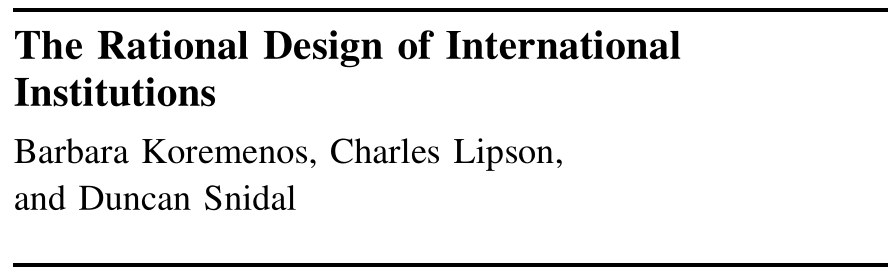
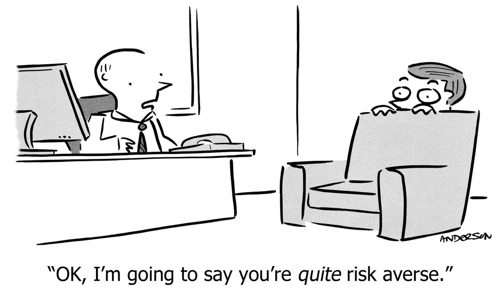
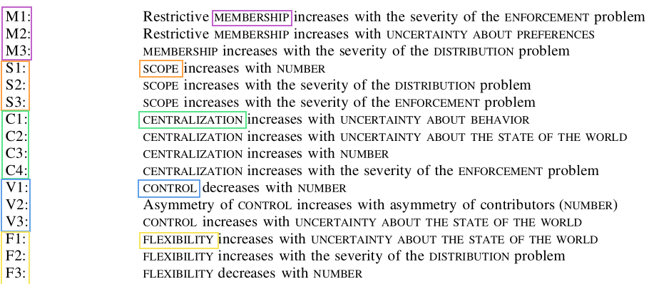

## Today's Agenda {background-image="./Images/background-scales_justice_v3.png" .center}

```{r}
# background-size="1920px 1080px"
library(tidyverse)
library(readxl)
```

<br>

**Section 1: Analyzing International Institutions**

- Using “rational design” to analyze international institutions (Koremenos, Lipson and Snidal 2001)

<br>

::: r-stack
Justin Leinaweaver (Fall 2026)
:::

::: notes

**Prep for Class**

1. Check Canvas submissions

<br>

Section 1 of our class has focused on developing our tools for understanding and analyzing international institutions

- This has meant reading some history to get a sense of the old legal order,

- This has meant engaging with legal scholarship to get a sense of the sources of international law,

- This has meant unpacking the debates in international relations about the effectiveness of institutions, and

- Last week this meant learning a new tool for analyzing institutions

<br>

**SLIDE**: As a warm-up, let's talk Q1 from your Canvas submissions

:::


## {background-image="./Images/background-scales_justice_v3.png"}

::: {.r-fit-text}
**Why apply legalization to international institutions?**
:::

{.absolute right=0 bottom=100 width="650"}

{.absolute left=0 top=175 width="350"}

::: notes

**Reflect on our work last week and tell me, what is the value of applying the legalization concepts to studying international institutions?**

- **e.g. in what specific ways does it help us analyze an international institution?**

<br>

The dimensions of legalization allow us to summarize an international institution by its key elements

<br>

That institution can then be presented in terms of:

- The specific obligations the states or other actors have bound themselves to,

- The degree of wiggle room in those obligations (e.g. level of precision), and

- The degree to which meaningful authorities have been delegated to third parties 

<br>

On its own that's an incredibly useful output

- These kinds of summaries allow us to generalize more broadly about the design and experience of international law in the world.


<br>

**SLIDE**: But more than that...

:::


## {background-image="./Images/background-scales_justice_v3.png"}

::: {.r-fit-text}
**Why apply legalization to international institutions?**
:::

{.absolute bottom=0 right=0 width="720"}

{.absolute top=130 left=0 width="450"}

::: notes

These summaries make meaningful analyses much more possible

- A clear understanding of these three elements allows us to design tests of effectiveness that are actually linked to what an institution was designed to do

<br>

For example, the 1926 Slavery Convention set some huge ambitions for the world

- **BUT, given what is actually in the institution, what did we argue would be more useful tests of effectiveness?**

<br>

So, legalization helps us BOTH:

- Generate useful summaries of international institutions, and

- Develop research designs to test the effectiveness of those institutions

<br>

**SLIDE**: This week we add another tool to our analyzing international institutions toolbox

:::


## {background-image="./Images/background-scales_justice_v3.png"}

{style="display: block; margin: 0 auto"}

<br>

:::: {.r-fit-text}

::: {.incremental}

1. A theory of "rational design"

2. A tool for summarizing international institutions

:::
::::

::: notes

This research article by Koremenos, Lipson and Snidal sets out to do two things

<br>

**REVEAL**: FIRST, this article is definitely theory focused rather than empirical

- Very much like the research we explored last week from Mearsheimer and Keohane

- Fundamentally, these authors argue that: "...states use international institutions to further their own goals, and they design institutions accordingly" (762).

<br>

**REVEAL**: While I think their theory is absolutely compelling, I include this article alongside legalization because it is also a tool!

- While legalization focuses on summarizing international institutions by their obligations, precision and delegation

- KLS focuses on summarizing international institutions by membership, scope, centralization, control and flexibility

- My argument to you will be that doing BOTH is necessary for critically analyzing an institution

<br>

**SLIDE**: Let's start with the theory piece of this article

:::


## Rational Design as a Theory {background-image="./Images/background-scales_justice_v3.png" .center}

<br>

- Rational design

- Shadow of the future

- Transaction costs

- Risk aversion

Therefore, states design international institutions to facilitate and strengthen international cooperation.

::: notes

Starting on p780, KLS give us these four "Conjectures About Rational Design"

- I'm not sure about the word "conjecture" here, but I'm happy to think of them as the assumptions underpinning their theory about international institutions

<br>

**SLIDE**: Let's quickly step through these four assumptions to make sure everyone is clear on them

:::


## Rational Design as a Theory {background-image="./Images/background-scales_justice_v3.png" .center}

**Assumption 1. Rational Design**

{style="display: block; margin: 0 auto"}

::: notes

*Rational design: States and other international actors, acting for self-interested reasons, design institutions purposefully to advance their joint interests* (p781).

<br>

**Ok, what are they assuming here?**

- **Can you explain it to me in simple terms?**

<br>

**Is this closer to Mearsheimer or Keohane's theory of international institutions?**

- (We probabably lose Mearsheimer with "join interests")

- (Keohane much happier with this, but it is possible this is a lesser bar than Keohane's "policy coordination" standard)

<br>

**SLIDE**: Shadow of the future

:::


## Rational Design as a Theory {background-image="./Images/background-scales_justice_v3.png" .center}

**Assumption 2. Shadow of the Future**

{style="display: block; margin: 0 auto"}


::: notes

*Shadow of the future: The value of future gains is strong enough to support a cooperative arrangement* (781).

<br>

**What does this assumption mean? Can you explain it to me in simple terms?**

- (Even if gains are small in the short-term, repeating them year after year compounds into significant amounts...)

- (Amounts that exceed the value of short-term defections!)

<br>

**Is this closer to Mearsheimer or Keohane's theory of international institutions?**

- (Way closer to Keohane!)

- (This flies in the face of Mearsheimer's worries about cheating and relative gains. Who gets the biggest gains over the long term? It might not be me!)

<br>

**SLIDE**: Transaction costs

:::


## Rational Design as a Theory {background-image="./Images/background-scales_justice_v3.png" .center}

**Assumption 3. Transaction Costs**

{style="display: block; margin: 0 auto"}


::: notes

*Transaction costs: Establishing and participating in international institutions is costly* (p782)

<br>

**What does this assumption mean? Can you explain it to me in simple terms?**

- (Importantly, these researchers want us to acknowledge the cost barrier to forming an international institution)

- Designing, building, staffing and budgeting for the UN is incredibly costly

- Precise rules are hard to write, agree and maintain!

<br>

**Is this closer to Mearsheimer or Keohane's theory of international institutions?**

- (Everybody's happy with this one, right?)

<br>

**SLIDE**: Risk Aversion

:::


## Rational Design as a Theory {background-image="./Images/background-scales_justice_v3.png" .center}

**Assumption 4. Risk Aversion**

{style="display: block; margin: 0 auto"}

::: notes

*Risk aversion: States are risk-averse and worry about possible adverse effects when creating or modifying international institutions* (782).

<br>

**What does this assumption mean? Can you explain it to me in simple terms?**

- ("Risk-averse actors prefer a certain outcome to a chancy one when each has the same expected value.")

<br>

**Is this closer to Mearsheimer or Keohane's theory of international institutions?**

- ("This assumption is the bedrock of modern realism, where states’ fears of destruction and keen interest in preserving their sovereignty dominate their strategic calculations. However, even realist states may trade off some sovereignty if they reap large enough gains in return.")

<br>

**SLIDE**: In sum
    
:::


## Rational Design as a Theory {background-image="./Images/background-scales_justice_v3.png" .center}

<br>

- Rational design

- Shadow of the future

- Transaction costs

- Risk aversion

Therefore, states design international institutions to facilitate and strengthen international cooperation.

::: notes

Sounds a great deal like Keohane, no?

- “Like imperfect markets, world politics is characterized by institutional deficiencies that inhibit mutually advantageous cooperation. ... From the deficiency of the “self-help system” ... [we] derive a need for international regimes” (Keohane 1984, 85-88).

<br>

KLS agree that self-interested, risk-averse states can absolutely achieve gains from cooperation, but only if they carefully design international institutions!

<br>

**Everybody with me?**

<br>

**SLIDE**: But it turns out that rational design is a theory AND a tool

:::


## {background-image="./Images/background-scales_justice_v3.png" .center}

::: {.r-fit-text}
**Rational Design as a Theory AND a Tool**
:::

<br>

{style="display: block; margin: 0 auto"}

::: notes

Table 1 (p797) represents the heart of the paper

- The "rational design conjectures" link specific institutional designs to specific problems facing states

<br>

While I want us to build up to applying these insights to our study of international institutions...

- **SLIDE**: We'll start with just the first half of each of them

:::


## Rational Design as a Tool {background-image="./Images/background-scales_justice_v3.png" .center}

<br>

{style="display: block; margin: 0 auto"}

::: notes

These are the five conceptual tools KLS proposes to summarize an international institution

- Think of these like an alternative, or supplement, to the legalization dimensions

<br>

When designing an institution you can:

1. Adjust your membership rules to be more inclusive or more restrictive

2. Adjust the scope of the issues covered to be broad or narrow

3. Adjust the centralization of tasks (more vs less)

4. Adjust the rules for controlling the institution, and

5. Offer states who participate some flexibility in the arrangements

<br>

**Any questions on these elements or need for clarification?**

<br>

**SLIDE**: Let's apply the tool

<br>

**Notes** p763

Membership rules ( MEMBERSHIP )

- "Who belongs to the institution? Is membership exclusive and restrictive, like the G-7’s limitation to rich countries? Or is it inclusive by design, like the UN? Is it regional, like ASEAN, or is it universal? Is it restricted to states, or can NGOs join?" (770).
- "Membership rules determine who beneŽ ts from an institution and who pays the costs. They work in several ways beyond simply reducing or enlarging size. By setting criteria for inclusion, for example, they affect the group’s homogeneity and asymmetries" (783).

Scope of issues covered ( SCOPE )

- "What issues are covered?" (770).
- "International issues do not come as pre-packaged units. Instead, they are constructed and evolve in complicated ways. While the resulting issue scope partly derives from technological, cognitive-ideational, and other factors that are not analyzed here, rational institutional analysis can explain key patterns of linkage within institutions. We focus on the deliberate choices states make about which issues to include in an institutional framework. In particular, when do states bring together issues they might otherwise have dealt with separately?" (785)

Centralization of tasks ( CENTRALIZATION )

- "Are some important institutional tasks performed by a single focal entity or not? Scholars often misleadingly equate centralization with centralized enforcement. We use the term more broadly to cover a wide range of centralized activities. In particular we focus on centralization to disseminate information, to reduce bargaining and transaction costs, and to enhance enforcement" (771).
- "International institutions can be centralized in a variety of ways. An international agency may have centralized information-gathering capacities, for example, without having centralized adjudicative or enforcement capacities" (787).

Rules for controlling the institution ( CONTROL )

- "How will collective decisions be made? Control is determined by a range of factors, including the rules for electing key officials and the way an institution is financed. We focus on voting arrangements as one important and observable aspect of control" (772).

Flexibility of arrangements ( FLEXIBILITY )

- "How will institutional rules and procedures accommodate new circumstances? Institutions may confront unanticipated circumstances or shocks, or face new demands from domestic coalitions or clusters of states wanting to change important rules or procedures. What kind of flexibility does an institution allow to meet such challenges?" (773).

:::


## {background-image="./Images/background-scales_justice_v3.png" .center}

:::: {.columns}
::: {.column width="50%"}
{width="450"}
:::

::: {.column width="50%"}

<br>

<br>


**Legalization**


:::
::::

::: notes

**Refresh my memory, what were our takeaways from analyzing the Slavery Convention (1926) with legalization?**

<br>

- **Where on the hard vs soft law scale is this?**

- (Hard obligations, soft on precision, basically no delegation)

<br>

- **Does "soft" law mean ineffective?**

<br>

**SLIDE**: Let's now repeat this with KLS

:::


## {background-image="./Images/background-scales_justice_v3.png" .center}

:::: {.columns}
::: {.column width="50%"}
{width="450"}
:::

::: {.column width="50%"}

<br>

**Rational Design**

::: {.incremental}

1. Membership rules

2. Scope of issues

3. Centralization of tasks

    - Disseminate info, reduce transaction costs, enhance enforcement, etc.

4. Rules for control

5. Flexibility of arrangements
:::
:::
::::

::: notes

*Split class into small groups (3 per)*

<br>

Groups, let's step through applying this tool to the Slavery Convention

- For each one talk to each other and then report back to the class

<br>

**REVEAL: What are the membership rules of the Slavery Convention?**

- **Are they inclusive or exclusive?**

<br>

Slavery convention is very inclusive, everybody is invited

- AND, since the convention 1) bans playing any role in the slave trade, and 2) encourages states to pressure non-participants, it even has the chance to impact non-participants!

<br>

*KLS Notes*

- "Who belongs to the institution? Is membership exclusive and restrictive, like the G-7’s limitation to rich countries? Or is it inclusive by design, like the UN? Is it regional, like ASEAN, or is it universal? Is it restricted to states, or can NGOs join?" (770).
- "Membership rules determine who benefits from an institution and who pays the costs. They work in several ways beyond simply reducing or enlarging size. By setting criteria for inclusion, for example, they affect the group’s homogeneity and asymmetries" (783).

<br>

**How broad or narrow is the scope of the Slavery Convention?**

- **Which articles define and refine the scope?**

<br>

- Narrowly focused on slavery
- Does impact shipping/trade a bit which is a bit further afield
- Also allows prison labor as an attempt to encourage US and others to participate
- But nothing crazy afield like tying tariff rates to compliance

<br>

*KLS Notes*

- "What issues are covered?" (770).
- "International issues do not come as pre-packaged units. Instead, they are constructed and evolve in complicated ways. While the resulting issue scope partly derives from technological, cognitive-ideational, and other factors that are not analyzed here, rational institutional analysis can explain key patterns of linkage within institutions. We focus on the deliberate choices states make about which issues to include in an institutional framework. In particular, when do states bring together issues they might otherwise have dealt with separately?" (785)

<br>

**How much does the Slavery Convention centralize the tasks of providing the benefits of the institution?**

- **Which articles discuss the dissemination of information?**

- **Which articles reduce bargaining and transaction costs?**

- **Which articles enhance enforcement?**

<br>

- Very little info sharing (states share updates on the domestic laws they create to ban slavery)
- No scheduled meetings or discussions (COPs) so no obvious way to reduce transaction costs
- No outside body other than ICJ ajudication, no meanginful enforcement

<br>

**What kinds of rules does the Slavery Convention include for controlling the institution?**

- None? Basically no delegation

<br>

**Finally, does the Slavery Convention offer participants any flexibility in the arrangements?**

- Prison labor allowed
- Colonial exceptions - My commitments do not apply to my territories
- Art 10: You can leave the treaty (denounce) with 1 year notice

<br>

**SLIDE**: Summarizing the Slavery Convention

:::


## {background-image="./Images/background-scales_justice_v3.png" .center .smaller}

:::: {.columns}
::: {.column width="50%"}
{width="450"}
:::

::: {.column width="50%"}
**Legalization**


**Rational Design**

1. Membership rules

2. Scope of issues

3. Centralization of tasks

4. Rules for control

5. Flexibility of arrangements
:::
::::

::: notes

Now that we've applied these two tools I suspect we have a much deeper appreciation for what the Slavery Convention actually is as an international institution

- **So, what are our takeaways here?**

- **How substantial is the Slavery Convention as a piece of international law?**

<br>

**SLIDE**: Comparing the tools

:::


## {background-image="./Images/background-scales_justice_v3.png" .center}

::: {.r-fit-text}
**Tools for Summarizing International Institutions**
:::

<br>

:::: {.columns}
::: {.column width="50%"}
**Legalization**


:::

::: {.column width="50%"}
**Rational Design**

1. Membership rules

2. Scope of issues

3. Centralization of tasks

4. Rules for control

5. Flexibility of arrangements
:::
::::

::: notes

Ok, let's report back on Q2 from your Canvas assignment now

<br>

**What do the rational design conjectures add to your toolbox beyond what can be accomplished using the legalization concepts?**

<br>

- **How much overlap between the concepts?**

- **How much is distinctive between them?**

<br>

**Any questions on our work for today?**

<br>

**SLIDE**: For next class

:::


## For Next Class {background-image="./Images/background-scales_justice_v3.png" .center}

<br>

**Re-Analyzing the International Convention for the Regulation of Whaling**

- Apply the KLS tool to the treaty

::: notes

**Questions on the assignment?**

<br>

Canvas ASSIGNMENT: Re-analyzing the Whaling Convention (1946)

Review the Whaling Convention (1946) and then answer the following questions:

1. Briefly restate your classification of the treaty using the legalization concepts (exercise done in class last Friday). How close to "hard law" does this institution come (per the Table 1 scale in Abbott et al 2000)?
2. Provide your measures of this treaty across the five DVs in the rational design article. Each should be fully explained and use citations to specific parts of the treaty to support your argument.

    - Membership rules (MEMBERSHIP)
    - Scope of issues covered (SCOPE)
    - Centralization of tasks (CENTRALIZATION )
    - Rules for controlling the institution (CONTROL)
    - Flexibility of arrangements (FLEXIBILITY)

:::