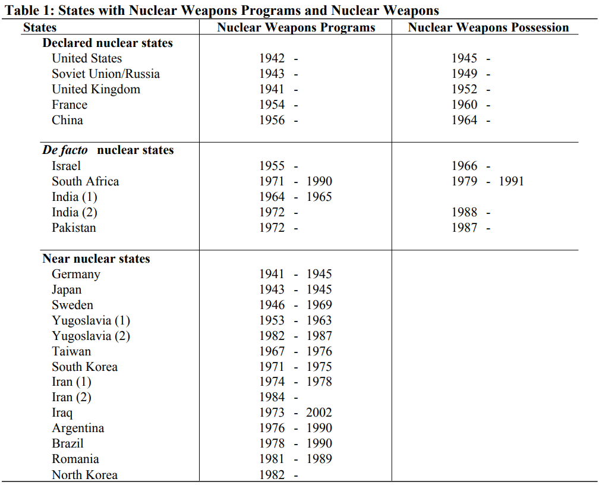
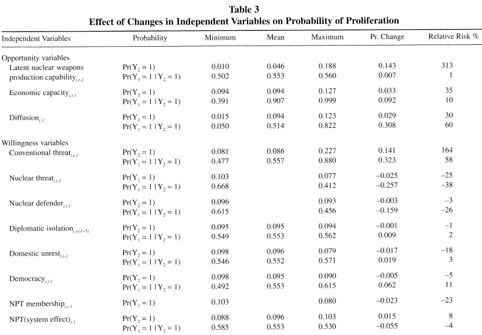
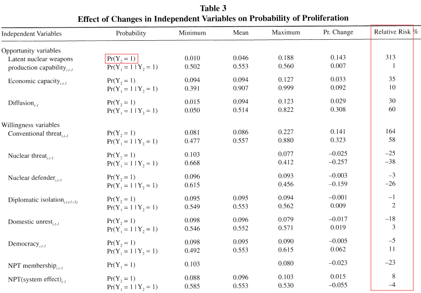
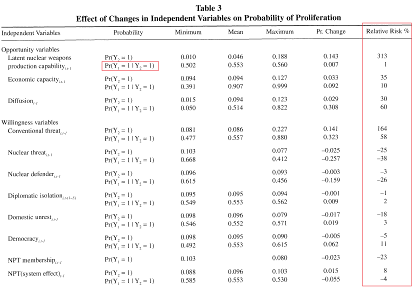
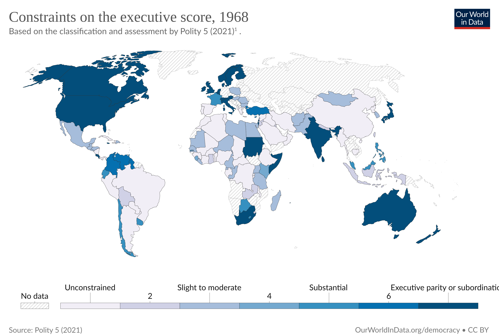
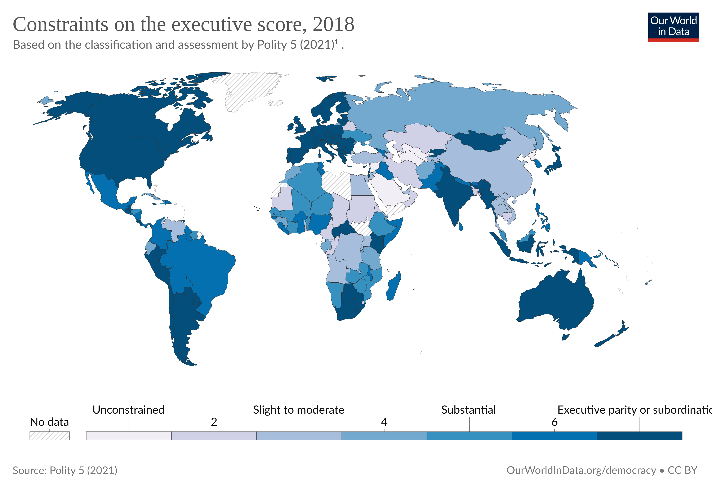
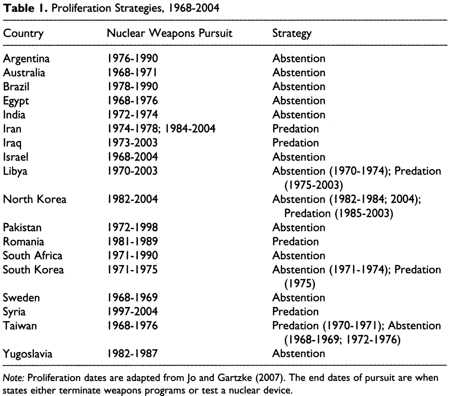
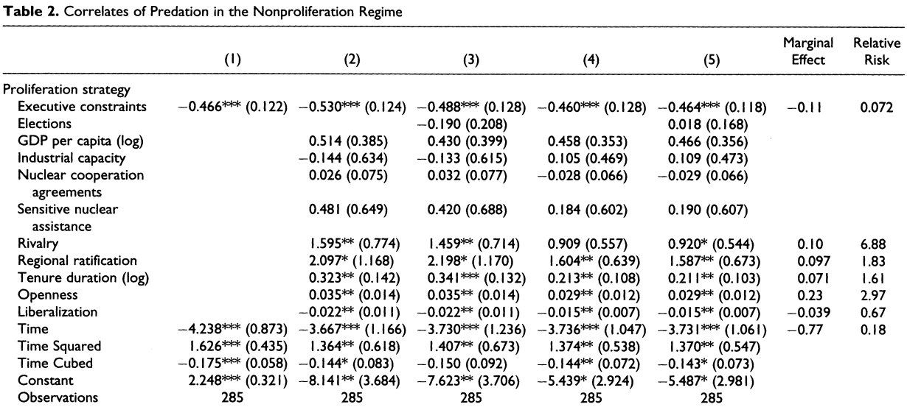
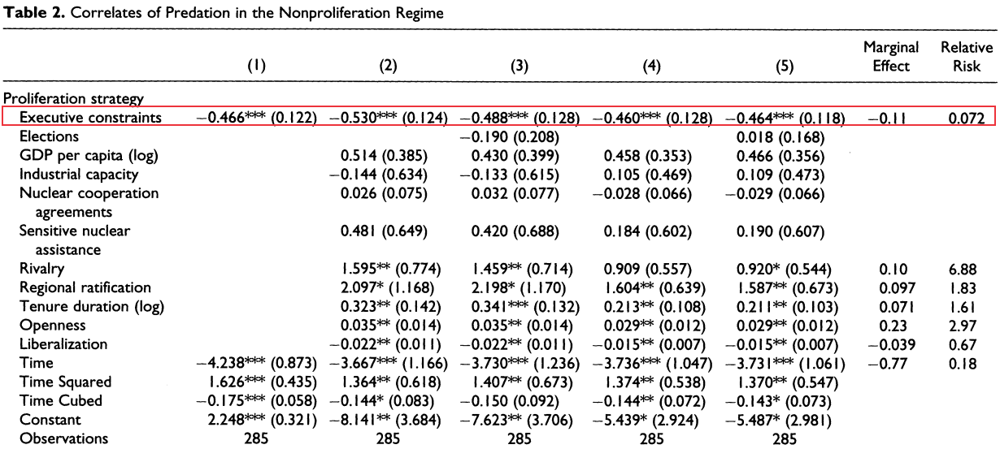

---
output:
  xaringan::moon_reader:
    css: ["default", "extra.css"]
    lib_dir: libs
    seal: false
    nature:
      highlightStyle: github
      highlightLines: true
      countIncrementalSlides: false
      ratio: '16:9'
---

```{r, echo = FALSE, warning = FALSE, message = FALSE}
library(tidyverse)
#library(readxl)
#library(stargazer)
#library(kableExtra)
#library(modelr)

knitr::opts_chunk$set(echo = FALSE,
                      eval = TRUE,
                      error = FALSE,
                      message = FALSE,
                      warning = FALSE,
                      comment = NA)
```

background-image: url('libs/Images/background-scales_justice_v3.png')
background-size: 105%
background-position: top
class: middle

.size45[**II. International Institutions for Mutual Restraint**]

<br>

.size50[**Today's Agenda: Effectiveness Analysis**

- Treaty on the Non-Proliferation of Nuclear Weapons (NPT)
]

<br>

.center[.size40[
  Justin Leinaweaver (Fall 2023)
]]

???

### Prep for Class
1. ?

<br>

1. Jo, D.-J., & Gartzke, E. (2007). Determinants of Nuclear Weapons Proliferation. Journal of Conflict Resolution, 51(1), 167–194. 
    - Opportunity, Willingness and the NPT
    - NPT membership has small negative effect on proliferation BUT system effect appears to go in opposite direction (bigger % world ratify, more proliferation?) 
    - ASSIGN: p167-171, 185-187
    - BRING: Jo_Gartzke2007-Data_Notes.pdf

2. Fuhrmann, M., & Berejikian, J. D. (2012). Disaggregating Noncompliance: Abstention versus Predation in the Nuclear Nonproliferation Treaty. Journal of Conflict Resolution, 56(3), 355–381. 
    - Can we explain the choice of predation (join NPT but go after nukes) vs abstention (don't join NPT and go after nukes); constraints on the executive reduce predation
    - ASSIGN: p355-363, 372-374


---

background-image: url('libs/Images/05_1-Earth_Bombs.jpg')
background-size: 100%
background-position: center
class: bottom

.center[.size45[.content-box-blue[Based on its design, what is the likelihood that the NPT will succeed?]]]

???

Let's talk key takeaways from last class on the NPT.

### What are the most substantive obligations in the treaty?

### - How precise are they?

<br>

### Based on the design of the NPT, what is an appropriate test of "success"?

### - Is it preventing all nuclear proliferation? Why or why not?

<br>

Keep the treaty design in mind as we evaluate the tests in today's articles.

- Ask yourself as we go, is this a "fair" test of treaty effectiveness?

- e.g. Is this test consistent with the design of the actual treaty?


---

background-image: url('libs/Images/background-blue_triangles.jpg')
background-size: 100%
background-position: center
class: middle

.size70[.content-box-white[**For Today**]]

<br>

.size40[
**Has the NPT reduced nuclear proliferation?**

1. Jo and Gartzke (2007). "Determinants of Nuclear Weapons Proliferation." *Journal of Conflict Resolution*.

2. Fuhrmann & Berejikian (2012) "Disaggregating Noncompliance: Abstention versus Predation in the Nuclear Nonproliferation Treaty." *Journal of Conflict Resolution*.
]

???

For today you read the arguments to two attempts to evaluate the effectiveness of the NPT.

- Both articles come from the Journal of Conflict Resolution which is very high quality source for this subject

<br>

*Split class in half, assign to each article*

<br>

**SLIDE**: Each article proposes and tests a specific model of how nuclear proliferation works and I'd like each group to diagram the model for us.


---

background-image: url('libs/Images/background-blue_triangles2.png')
background-size: 100%
background-position: center
class: middle

.size45[.content-box-white[**Frieden, Lake and Schultz (2016)**]]

.size30[
**Interests**

"…[The] preferences of actors over the possible outcomes that might result from their political choices" (45).

**Institutions**

"A set of rules, known and shared by the community, that structure political interactions in particular ways" (67).

**Interactions**

"The ways in which the choices of two or more actors combine to produce political outcomes" (51).
]

???

As you have undoubtedly done for me in other classes, this semester we will summarize our models in terms of their interests, interactions and institutions

- Think of these like a shortcut to identifying the key components of political behavior.

<br>

Our job while diagramming a model will be to break the argument into three parts:

1. Who are the actors and what do they want?

2. What are the rules that structure the behavior of those actors?

3. How do the actions of other actors prevent the primary actors from getting what they want?

<br>

A word of caution: This is not a universal template. 

- It will not always be easy to translate a paper's argument into this structure.
    - In fact, the Jo and Gartke piece makes this TOUGH!

- However, thinking about the components in these ways will help us understand the models much more deeply.

<br>

### Any questions on these three concepts?


---

background-image: url('libs/Images/background-blue_triangles.jpg')
background-size: 100%
background-position: center
class: middle

.size70[.content-box-white[**For Today**]]

<br>

.size40[
**Has the NPT reduced nuclear proliferation?**

1. Jo and Gartzke (2007). "Determinants of Nuclear Weapons Proliferation." *Journal of Conflict Resolution*.

2. Fuhrmann & Berejikian (2012) "Disaggregating Noncompliance: Abstention versus Predation in the Nuclear Nonproliferation Treaty." *Journal of Conflict Resolution*.
]

???

Ok, groups I want you to diagram the model for us **ON THE BOARD**.

<br>

### Questions on your job?

- Get to it!

<br>

*Go talk to the Jo and Gartzke (2007) group*

- Jo and Gartzke (2007) aren't proposing a single model, they're aiming to test a bunch of mechanisms they found in the literature

1. Start by listing all of the mechanisms they suggest for explaining proliferation, then

2. Step back from the list and try to organize those mechanisms using our three part approach

<br>

Group 1 present Jo and Gartzke (2007) argument.

- This was a tough one to diagram given its focus on reviewing the literature instead of testing a single model!

- **SLIDE**: My version


---

background-image: url('libs/Images/background-blue_cubes_lighter3.png')
background-size: 100%
background-position: center
class: middle

.center[.size35[.content-box-white[**Jo and Gartzke (2007): The Model**]]]

.size30[
Interests
- States (Leaders?) want political survival

Institutions
- International rules make proliferation costly
- Domestic institutions (regime type) channel public demands to the leader

Interactions
- If proliferation is possible (technology, materials, & economic capacity) then it can increase state security, raise status, and appease / distract the public
- Ratifying the NPT should reduce / reverse those incentives 
]

???

The paper doesn't present a single, unified model.
- Instead it tests a bunch of different mechanisms taken from the literature.

- However, this represents my best stab at describing it as a unified model.

<br>

### Group 1, what do you think? Am I missing anything you'd like to add?

<br>

### Do the authors ever explicitly tell us who the main actor is in the model and what that actor wants?
- (Not really.)
    - This could also be nukes but that doesn't fit all the mechanisms as well.

<br>    
    
### Is this a logical model? Why or why not?

<br>

Let's now talk about how these authors test their model with data.
1. How did researchers measure the key concepts?

2. What did they do to "analyze" the data?

<br>

### Per the model above, what is the dependent variable in this paper? e.g. what are they trying to explain?
- (**SLIDE**: Nuclear proliferation)

<br>

#### Notes
- Two primary "determinants of nuclear proliferation": Opportunity and Willingness
- Opportunity in three categories (four?)
    - Do they have the technology/knowledge?
    - Do they have the "nuclear fissile materials"?
    - Do they have the "economic capacity"?
    - Can they withstand the international pressure to stop?
- Willingness aka "eagerness of a country to possess nuclear weapons"
    - How insecure does the state feel? (big threats, isolation vs alliances)
    - Does the leader need to distract their citizens?
    - Are they an autocracy?
    - Have they bound themselves to the NPT?
    - Do they see a nuclear weapon as status improving?


---

background-image: url('libs/Images/background-blue_cubes_lighter3.png')
background-size: 100%
background-position: center
class: middle

.center[.size45[.content-box-white[**Jo and Gartzke (2007): Measuring the DV**]]]

.pull-left[
```{r, echo = FALSE, fig.align = 'center', out.width = '100%'}

```
]

.pull-right[
.size25[
NPROGRAM (declared nuclear states)
- The year in which the highest decision maker in a given state authorized (or terminated) a nuclear weapons program

NPROGRAM (non-declared states)
- The year in which a suspect state’s nuclear activities are seen to increase noticeably
    - nuclear reactor construction or purchase,
    - uranium milling or enrichment plant construction,
    - plutonium reprocessing facility construction
]]

???

Let's talk about how the authors measure the key outcome variables: 
- Do you have a nuclear program and, if so, do you have nukes?

<br>

First, the NPROGRAM variable represents whether or not a state has a nuclear weapons production program.

- I've put the main coding instructions on the slide

- These represent the instrument being used by these researchers to measure the existence of a nuclear weapons program.

### What do we think of these instruments? Are they clear and specific enough to be used reliably? Why or why not?

<br>

The instruments are only part of the challenge, we also need to consider the source of the data these are being applied to.

- Everybody open up the Data Notes Document on Canvas

- From p2-6 they discuss the states they believe have programs and the evidence they cite for them

### What kinds of sources are the authors relying on?

<br>

### Given that these programs are almost certainly designed to be clandestine, how confident are we that this list is "correct" AND that it is "complete"?

### - In other words, does this list of cases and sources increase your confidence that they have valid and reliable data? Why or why not?

<br>


#### NOTES on NPROGRAM
- "We regard the year in which the highest decision maker in a given state authorized a nuclear weapons program as the year in which the state first possesses a nuclear weapons program" (1). 
- "Similarly, we assume that the year in which the highest decision maker terminated an existing nuclear weapons program is effectively the final year of the program" (1). 

- "Reasonably reliable dates are available for declared nuclear states’ nuclear weapons programs. Little if any clear information can be obtained for non-declared states, however, since such programs are often of necessity
clandestine. For unofficial nuclear weapons states (nuclear weapons programs that are not recognized in the NPT), we adopt the year in which a suspect state’s nuclear activities are seen to increase noticeably as the beginning year of their weapons program" (1-2).

- Footnote 2: "Nuclear activities include nuclear reactor construction or purchase, uranium milling or enrichment plant construction, and plutonium reprocessing facility construction, but exclude small nuclear research reactor construction or purchase intended (and used) for basic nuclear research."


---

background-image: url('libs/Images/background-blue_cubes_lighter3.png')
background-size: 100%
background-position: center
class: middle

.center[.size45[.content-box-white[**Jo and Gartzke (2007): Measuring the DV**]]]

.pull-left[
```{r, echo = FALSE, fig.align = 'center', out.width = '100%'}

```
]

.pull-right[
.size25[
NWEAPON
- Does a state have the "necessary nuclear weapon components ready to be assembled" (footnote 7)
]]

???

There second DV is the more obvious one, the NWEAPON variable.

- This is meant to represent whether or not a state has a nuclear weapon (or the components ready to be assembled).

<br>

### Is this instrument clear and specific enough to produce useful data?

<br>

### Are we more confident in this version of the outcome than the program variable?

<br>

**SLIDE**: Switch to the predictor variables

<br>

#### NOTES on NWEAPON
- Footnote 7: "Pinpointing the date of de facto nuclear status remains controversial. We use the criteria of whether a state has necessary nuclear weapon components ready to be assembled."


---

background-image: url('libs/Images/background-blue_cubes_lighter3.png')
background-size: 100%
background-position: center
class: middle

.center[.size45[.content-box-white[**Jo and Gartzke (2007): Measuring the Predictors**]]]

<br>

.size55[
**Key Predictor Variables**

1. NPT Membership (dummy)

2. NPT System Effect
]

???

There are two predictor variables related to the NPT

<br>

The first is a simple dummy variable

- 0 for non-ratifiers, 1 for ratifiers

<br>
    
The second variable represents a systems effect for the NPT

- It is measured as the proportion of the world's states that have ratified the NPT.

- e.g. More states ratify, bigger effect

<br>

### Does the construction of these two variables make sense?

<br>

**SLIDE**: Let's go back to our model diagram


---

background-image: url('libs/Images/background-blue_cubes_lighter3.png')
background-size: 100%
background-position: center
class: middle

.center[.size35[.content-box-white[**Jo and Gartzke (2007): The Model**]]]

.size30[
Interests
- States (Leaders?) want political survival

Institutions
- International rules make proliferation costly
- Domestic institutions (regime type) channel public demands to the leader

Interactions
- If proliferation is possible (technology, materials, & economic capacity) then it can increase state security, raise status, and appease / distract the public
- Ratifying the NPT should reduce / reverse those incentives
]

???

### Why do we need both predictors to test our model?

### - In other words, what aspects of the model does each variable target?

- (**SLIDE**)


---

background-image: url('libs/Images/background-blue_cubes_lighter3.png')
background-size: 100%
background-position: center
class: middle

.center[.size35[.content-box-white[**Jo and Gartzke (2007): The Model**]]]

.size30[
Interests
- States (Leaders?) want political survival

Institutions
- .textblue[**International rules make proliferation costly (NPT System)**]
- Domestic institutions (regime type) channel public demands to the leader

Interactions
- If proliferation is possible (technology, materials, & economic capacity) then it can increase state security, raise status, and appease / distract the public
- .textblue[**Ratifying the NPT should reduce / reverse those incentives (NPT Member)**]
]

???

I think its useful to see how these two versions of the NPT are necessitated by the model.

- NPT member is an effect that happens to you as the leader of the state and changes the dynamics internally
    - Ratification makes the rules binding on you and we shouldn't expect states to obey rules they haven't bound themselves to.

- NPT system represents a test of the institution about costly proliferation
    - More states ratify, more states have agreed to punish proliferators
    
<br>

### Does this make sense?

<br>

### Based on your analyses of the NPT's design, should we expect wide adoption of the NPT to have an effect on states separate from ratification? Why or why not?


---

background-image: url('libs/Images/background-blue_cubes_lighter3.png')
background-size: 100%
background-position: center
class: middle

.center[.size50[.content-box-white[**Jo and Gartzke (2007): Analyses**]]]

```{r, echo = FALSE, fig.align = 'center', out.width = '74%'}

```

???

Now let's see what they "found" with their analyses

- They examined country-years from 1939 to 1992

- So, unlike our case study approach that may have looked at one event or one year of events this paper examines approximately 4,700 country-years

<br>

We'll focus on Table 3 which are the real world probabilities generated by the big fancy statistical model.

- The rows correspond to each of the mechanisms proposed in the model

- The columns show the likelihood of having nukes or a nuke program conditional on the predictor in that row changing

- We'll focus on changes from the minimum to the maximum summarized by the fional column as relative risk

- The relative risk is the % change in the likelihood of having a nuclear weapons program given a maximum change in each predictor variable.


---

background-image: url('libs/Images/background-blue_cubes_lighter3.png')
background-size: 100%
background-position: center
class: middle

.center[.size50[.content-box-white[**Jo and Gartzke (2007): Analyses**]]]

```{r, echo = FALSE, fig.align = 'center', out.width = '74%'}

```

???

Start by focusing on the rows labeled $Pr(Y_2 = 1)$ which are the tests of having a nuclear weapons program

### According to this data and methods, which predictors in the model have the biggest impacts on nuclear weapons programs?

- "Latent capability" or having the technology needed shows a 313% increase!
- Facing a "conventional threat", e.g. a neighbor country that might attack, increases the likelihood of having a nuclear program by 164%!

<br>

### What SHOULD we expect to see from ratifying the NPT?
- (A big decrease!)

### And what do we see?
- (Ratify the NPT, reduce likelihood by 23%)

<br>

### Ok, and what about the systems effect?
- (BUT bigger system effect, MORE likely nuke program by 8%!)

- Global norms NOT in action!?


---

background-image: url('libs/Images/background-blue_cubes_lighter3.png')
background-size: 100%
background-position: center
class: middle

.center[.size50[.content-box-white[**Jo and Gartzke (2007): Analyses**]]]

```{r, echo = FALSE, fig.align = 'center', out.width = '74%'}

```

???

$Pr(Y_1 = 1|Y_2 = 1)$ is the probability of having nuclear weapons.

### Which mechanisms have the biggest effects on having a nuke?

<br>

### And what is the effect of the NPT on having a nuke?

<br>

### Bottom line takeaways on the Jo and Gartzke piece? Are you convinced the NPT matters but maybe just a little bit?

### What about the argument that the system effect works in the wrong direction? Could the NPT be making things worse?

<br>

#### General Notes
- cross-section time series data
- 1939 to 1992
- country-year observations
- probit with robust SEs (results in Table 1)


- The NPT system effects are pretty small and hard to interpret
    - Slightly more likely to have a program, slightly less likely to have a weapon
    - Authors suggest this may be due to how the NPT spreads civilian nuclear technology to parties.


---

background-image: url('libs/Images/background-blue_cubes_lighter3.png')
background-size: 100%
background-position: center
class: middle

.center[.size50[.content-box-white[**Has the NPT reduced nuclear proliferation?**]]]

<br>

.size45[
1. Jo and Gartzke (2007): What are the key mechanisms that explain nuclear proliferation?

2. Fuhrmann & Berejikian (2012): What are the key mechanisms that explain why some leaders cheat on the NPT?
]

???

Fuhrmann & Berejikian (2012) group, take it away!

<br>

**SLIDE**: My version


---

background-image: url('libs/Images/background-blue_cubes_lighter3.png')
background-size: 100%
background-position: center
class: middle

.center[.size35[.content-box-white[**Fuhrmann & Berejikian (2012): The Model**]]]

.size30[
Interests
- Governments that want nuclear weapons

Institutions
- Domestic institutions that constrain the executive (veto players, elections, etc.) make it harder to implement a strategy of predation
- Domestic institutions that constrain the executive (veto players, elections, etc.) make it more likely that predation will be exposed

Interactions
- Join the NPT and add "significant" nuclear aid, tech assistance and status (+), but also international oversight and pressure not to proliferate (-)

]

???

So, you want nuclear weapons? Now you have to choose a strategy to get there.

- Abstention: Don't join the NPT, pursue nukes
    - e.g. eschew cooperation and refrain from making a commitment in the first place

- Predation: Join the NPT and keep pursuing nukes
    - e.g. cheating on formal commitments

<br>

### Group 2, what do you think? Am I missing anything you'd like to add?

<br>

### Is this a logical model? Why or why not?

<br>

Let's now talk about how these authors test their model with data.
1. How did researchers measure the key concepts?

2. What did they do to "analyze" the data?

<br>

### Per the model, what is the dependent variable in this paper? e.g. what are they trying to explain?
- (**SLIDE**: Whether a state chooses a strategy of predation or abstention to acquire nuclear weapons)

<br>

#### old notes
- Noncompliance in an NPT world means choosing a strategy of either abstention or predation

- Predation: Get the benefits of the NPT (access to nuclear technology, aid, assistance and strategic benefits) and work to dodge the costs (IAEA monitoring, sanctions) 

- Abstention: Shield yourself from the costs of the treaty, avoid tying your hands against regional rivals in an arms race, but no assistance!

- Domestic institutions that constrain the executive (veto players, elections, etc.) make it riskier to choose predation


---

background-image: url('libs/Images/background-blue_cubes_lighter3.png')
background-size: 100%
background-position: center
class: middle

.center[.size45[.content-box-white[**Fuhrmann & Berejikian (2012): Data Sources**]]]

.size45[
- Time-series, cross-sectional data

- 1968-2004

- Uses Jo and Gartzke's (2007) data!

- 18 countries, 285 country-year observations
]

???

We've covered the heart of this with the last paper!

- I do appreciate that they moved the start of their dataset forward to the NPT!


---

background-image: url('libs/Images/background-blue_cubes_lighter3.png')
background-size: 100%
background-position: center
class: middle

.center[.size40[.content-box-white[**Fuhrmann & Berejikian (2012): Measuring the DVs**]]]

.size45[
Predation
- 0 vs 1 = Nuclear program & member of the NPT

Abstention
- 0 vs 1 = Nuclear program & NOT a member
]

???

The data measurements for the DV's is quite simple.

### What are the pros and cons of measuring these two strategies using dummy variables?

### - Any concerns that real world state behavior isn't this clean?

<br>

**SLIDE**: Connect back to the model!


---

background-image: url('libs/Images/background-blue_cubes_lighter3.png')
background-size: 100%
background-position: center
class: middle

.center[.size35[.content-box-white[**Fuhrmann & Berejikian (2012): The Model**]]]

.size30[
Interests
- Governments that want nuclear weapons

Institutions
- Domestic institutions that constrain the executive (veto players, elections, etc.) make it harder to implement a strategy of predation
- Domestic institutions that constrain the executive (veto players, elections, etc.) make it more likely that predation will be exposed

Interactions
- Join the NPT and add "significant" nuclear aid, tech assistance and status (+), but also international oversight and pressure not to proliferate (-)

]

???

### Per this model, which of the two DVs is the one we actually care about testing?

- (Predation!)

- The question is, does the treaty stop the behavior it was designed to stop.

- Interestingly, predation occurs in roughly 45% of the cases in this study!

<br>

### Per the model, what is the primary predictor the researchers are using to explain the variation in predation?
- (**SLIDE**: Constraints on the executive!)


---

background-image: url('libs/Images/background-blue_cubes_lighter3.png')
background-size: 100%
background-position: center
class: middle

.center[.size40[.content-box-white[**Fuhrmann & Berejikian (2012): Measuring the Predictor**]]]

.size45[
Executive Constraints
- "the degree of checks and balances between branches of a government"

- 1 ("unlimited executive authority") to 7 ("executive parity or subordination")
]

???

The "Executive Constraints" variable is taken from the Polity IV Project

- It "...measures the degree of checks and balances between branches a government based on a 7-point scale" (363).

- 1 = "unlimited executive authority
    - Think DPRK, Libya or Iraq under Saddam

- 7 = "executive parity or subordination"
  - Think Western Europe, Australia, and the US (usually)
  
<br>

**SLIDE**: 1968 data as a map


---

background-image: url('libs/Images/background-blue_cubes_lighter3.png')
background-size: 100%
background-position: center

```{r, echo = FALSE, fig.align = 'center', out.width = '87%'}

```

???

### Per the model, and at the birth of the NPT, what would you say were the prospects for "predation"?
- (High!)

<br>

**SLIDE**: Compare to 2018 data as a map

---

background-image: url('libs/Images/background-blue_cubes_lighter3.png')
background-size: 100%
background-position: center

```{r, echo = FALSE, fig.align = 'center', out.width = '87%'}

```

???

### And at the end of the Polity data window? Still high?

### - How has the world changed over time?


---

background-image: url('libs/Images/background-blue_cubes_lighter3.png')
background-size: 100%
background-position: center

```{r, echo = FALSE, fig.align = 'center', out.width = '66%'}

```

???

Table 1 shows us a summary of the data they are exploring.

### Does everybody see the roots of this from the Jo and Gatrtzke article?

<br>

### Just to reiterate, are we confident in their coding of the strategy variable here? Why or why not?


---

background-image: url('libs/Images/background-blue_cubes_lighter3.png')
background-size: 100%
background-position: center
class: middle

```{r, echo = FALSE, fig.align = 'center', out.width = '100%'}

```

???

Table 2 summarizes the regression analysis they used to test their model
- Technically a series of probit regressions with Huber's robust standard errors for spatial dependence and clustering over states

<br>

Data Analysis Refresher
- Columns are separate regressions

- Rows estimate the relationship of different predictors to the outcome variable

- Each coefficient tells you the size and direction of the effect

- Stars mean the measured effect is "significant" e.g. a better fit to the data than the null hypothesis

<br>

### Out of all this chaos on the Table, what is the single row we are primarily interested in?

- (**SLIDE**: executive constraints)


---

background-image: url('libs/Images/background-blue_cubes_lighter3.png')
background-size: 100%
background-position: center
class: middle

```{r, echo = FALSE, fig.align = 'center', out.width = '100%'}

```

???

### So, what is true for the estimated effect of executive constraints on predation across all five tests?

- Executive constraints is significant and negative across all five models 

- PLUS the magnitude is "quite large" (367).
    - Marginal effect is a 7% decrease in relative risk per level of executive constraints added

- Example: Moving from executive constraints of 1 (Libya, Iraq and DPRK) to only 3 (Egypt, Syria (2000—4), South Korea (1970-71)) reduces predation by 66%!

- Example: Go from the mean of executive constraints to 1 sd above is a 93% reduction in risk of predation!

<br>

### What does this mean for us? Is the NPT effective?

- In the aggregate, it DOES appear to dramatically reduce the likelihood of states choosing a strategy of predation!

<br>

### Have Fuhrmann & Berejikian (2012) convinced you that evaluating the effectiveness of the NPT requires thinking about domestic politics?


---

background-image: url('libs/Images/background-blue_cubes_lighter3.png')
background-size: 100%
background-position: center
class: middle

.center[.size50[.content-box-white[**Has the NPT reduced nuclear proliferation?**]]]

<br>

.size45[
1. Jo and Gartzke (2007) "Determinants of Nuclear Weapons Proliferation"

2. Fuhrmann & Berejikian (2012) "Disaggregating Noncompliance: Abstention versus Predation in the Nuclear Nonproliferation Treaty"
]

???

### So, do we believe the NPT has effectively reduced nuclear proliferation? Why or why not?

<br>

SOOOO much more research on this topic...


---

background-image: url('libs/Images/03_1-Boxing_v5.png')
background-size: 100%
background-position: middle
class: middle, center

.size45[Therefore, international institutions "have .textred[minimal influence] on state behavior" (Mearsheimer 1994, p7).]

.size110[
<br>
]

.size45[Therefore, states design international institutions to .textblue[facilitate and strengthen] international cooperation (KLS 2001).]

???

### Would we describe the NPT's effect on nuclear proliferation more in line with the Realists or the Rational Designers? Why?


---

background-image: url('libs/Images/background-blue_triangles.jpg')
background-size: 100%
background-position: center
class: middle

.size50[.content-box-white[**Next Class**]]

.size45[
1. Amnesty International 2022/2023 Report
    - Read the Global Overview
    - Read one of the Regional Overviews
    - Read one country from that region

2. Review the treaty reservations

3. *Bring to Class*: The Convention Against Torture (CAT)
]

???

Next week we shift to our next example of an international institution designed for mutual restraint.

- The Convention against Torture

<br>

To get ready for this exploration I want you to review the latest report from Amnesty International on the state of human rights practices around the world.

- Everyone will read the Global Overview p14-20

<br>

*Split class into four groups: One per region*
- p21-29 Africa
- p29-37 Americas
- p37-45 Asia-Pacific
- p45-63 Europe and Central-Asia

<br>

Groups: Read the regional overview and read one of the country reports from your group's assigned region, no overlap

### Questions on the assignment?


