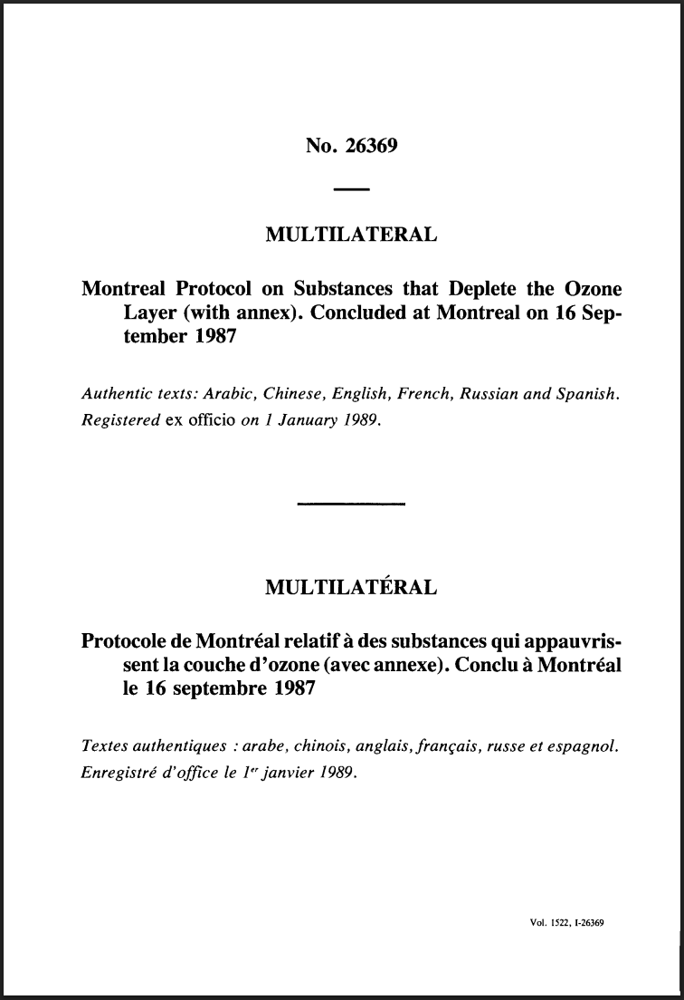
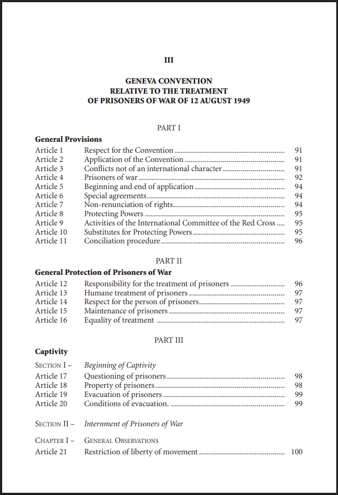
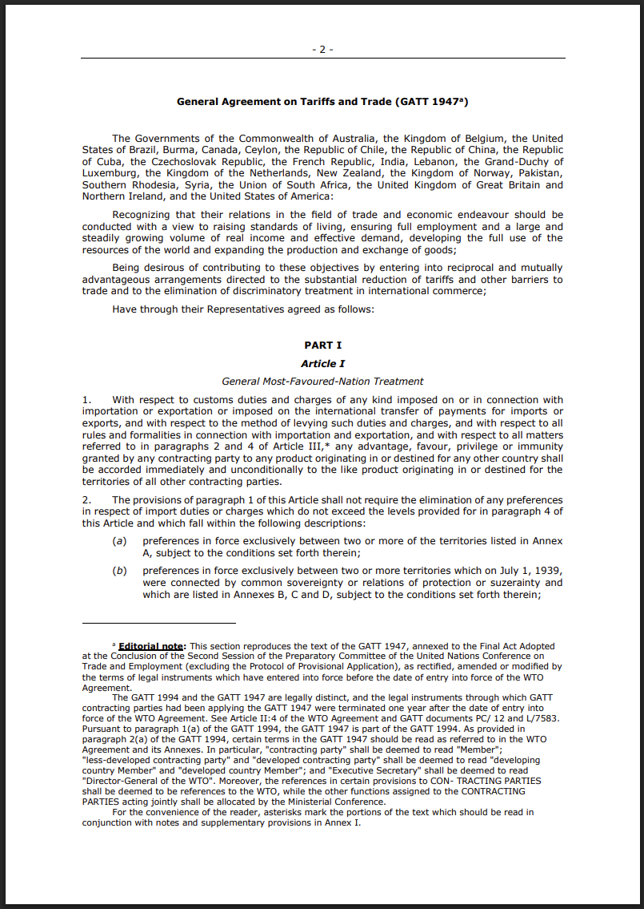

## Today's Agenda {background-image="./Images/background-scales_justice_v3.png" .center}

```{r}
# background-size="1920px 1080px"
library(tidyverse)
library(readxl)
```

<br>

**Section 1: Analyzing International Institutions**

- Practice using “rational design” to analyze international institutions

<br>

::: r-stack
Justin Leinaweaver (Fall 2026)
:::

::: notes

**Prep for Class**

1. Check Canvas submissions

<br>

**SLIDE**: Over the last two weeks I've been introducing you to tools meant to help us analyze international institutions

:::


## {background-image="./Images/background-scales_justice_v3.png"}

{.absolute left=0 top=0 width="400"}

{.absolute top=50 left=300 width="400"}

{.absolute right=0 bottom=0 width="400"}

::: notes

As we have seen, international institutions are incredibly complicated entities

- Each one targets a substantial problem in the world and then states design rules meant to help us address that problem in the absence of outside enforcement

<br>

Given the size of the problems being tackled and the obstacle of trying to do this without enforcement explains why these treaties get SUPER long and detailed

- The Montreal Protocol, designed to address the hole in the ozone layer, is laid out across twenty articles and one annex

- The third Geneva Convention, designed to establish humanitarian legal protections for prisoners of war, required 143 articles and five annexes

- The General Agreement on Tariffs and Trade, the precursor to the World Trade Organization, includes 38 articles, nine annexes and something like 336k words

<br>

So, when someone says international law doesn't matter, I have to ask, what are you talking about?

- The original GATT was negotiated by states who spent six months on the process

- Since then states have revised the framework through massive multilateral negotiations eight times over the last 47 years

- Assuming international institutions don't matter requires making the argument that states dumped massive amounts of time and money into a pointless and LOOONG process

- That starts to seem more like theory as religion rather than theory as a tool for explaining real world outcomes...

<br>

Our aim in this class is to actually evaluate the effect of international institutions in the world

- To do that we need tools to help us analyze these massive institutions

- **SLIDE**: Tools like the dimensions of legalization!

:::


## {background-image="./Images/background-scales_justice_v3.png"}

::: {.r-fit-text}
**Applying Legalization to International Institutions**
:::

{.absolute right=0 bottom=100 width="650"}

{.absolute left=0 top=175 width="350"}

::: notes

Legalization provides us a series of conceptual dimensions meant to help us summarize an international institution 

- It's an approach focused on finding the key obligations, evaluating the precision of those obligations and then identifying the elements of delegation meant to help the institution function over time

<br>

**What were our big takeaways from applying legalization to the Slavery Convention?**

<br>

**On balance, is the Slavery Convention closer to hard or soft law?**

- **What does that tell us about the nature of the problem in 1926?**

<br>

**SLIDE**: This week we shifted to a second tool, the rational design conjectures

:::


## {background-image="./Images/background-scales_justice_v3.png" .center}

::: {.r-fit-text}
**Applying Rational Design to International Institutions**
:::

:::: {.columns}
::: {.column width="50%"}
{width="350"}
:::

::: {.column width="50%"}

<br>

1. Membership rules

2. Scope of issues

3. Centralization of tasks

4. Rules for control

5. Flexibility of arrangements

:::
::::

::: notes

Last class we introduced the first half of the rational design conjectures

- Specifically, these five design choices available to states when creating an international institution

<br>

Talk me through these from your notes

- **What membership rules are created by the Slavery Convention?**

- **How broad or narrow is the scope of issues covered by the convention?**

- **How much centralization of key tasks is created by the convention?**

- **How substantial is the control of this institution by the participating states?**

- **How flexible are the rules of the convention to changing circumstance or needs of the participants?**

<br>

**SLIDE**: Compare and contrast

<br>

**Notes** p763

Membership rules ( MEMBERSHIP )

- "Who belongs to the institution? Is membership exclusive and restrictive, like the G-7’s limitation to rich countries? Or is it inclusive by design, like the UN? Is it regional, like ASEAN, or is it universal? Is it restricted to states, or can NGOs join?" (770).

Scope of issues covered ( SCOPE )

- "What issues are covered?" (770).

Centralization of tasks ( CENTRALIZATION )

- "Are some important institutional tasks performed by a single focal entity or not? Scholars often misleadingly equate centralization with centralized enforcement. We use the term more broadly to cover a wide range of centralized activities. In particular we focus on centralization to disseminate information, to reduce bargaining and transaction costs, and to enhance enforcement" (771).

Rules for controlling the institution ( CONTROL )

- "How will collective decisions be made? Control is determined by a range of factors, including the rules for electing key officials and the way an institution is financed. We focus on voting arrangements as one important and observable aspect of control" (772).

Flexibility of arrangements ( FLEXIBILITY )

- "How will institutional rules and procedures accommodate new circumstances? Institutions may confront unanticipated circumstances or shocks, or face new demands from domestic coalitions or clusters of states wanting to change important rules or procedures. What kind of flexibility does an institution allow to meet such challenges?" (773).

:::


## {background-image="./Images/background-scales_justice_v3.png" .center}

::: {.r-fit-text}
**Analyzing International Institutions**
:::

<br>

:::: {.columns}
::: {.column width="50%"}
**Legalization**


:::

::: {.column width="50%"}

**Rational Design**

1. Membership rules

2. Scope of issues

3. Centralization of tasks

4. Rules for control

5. Flexibility of arrangements

:::
::::

::: notes

**In big picture terms, what is the value of applying both of these tools to an international institution that we are studying?**

<br>

My argument to you is that these tools represent a crucial step towards evaluating the impact of international institutions in the empirical world

<br>

Asking did the Slavery Convention work is a good book title, but the answer requires narrowing down what we mean by the convention

- Legalization and rational design give us a series of concrete and specific mechanisms we can identify and measure

<br>

If international institutions exist to facilitate cooperation amongst states by solving specific problems, THEN

- Legalization helps us think broadly about the approach of the designers (e.g. soft vs hard law), and

- Rational design helps us dig more deeply into the specific design mechanisms that allow the institution to function

<br>

**Make sense?**

<br>

**SLIDE**: Today I want us to unpack the second half of the rational design conjectures

:::


## The Rational Design Conjectures {background-image="./Images/background-scales_justice_v3.png" .center}

<br>

:::: {.columns}
::: {.column width="50%"}
**Design Choices**

1. Membership rules

2. Scope of issues

3. Centralization of tasks

4. Rules for control

5. Flexibility of arrangements
:::

::: {.column width="50%"}

**Baseline Assumptions**

- Rational design

- Shadow of the future

- Transaction costs

- Risk aversion

:::
::::

::: notes

The next piece in the KLS article is meant to help us better understand HOW we can use these design choices in order to solve specific international problems

- This step requires theory and setting that up is this list of baseline assumptions

<br>

We reviewed these last class, so don't need to hit these in detail again

- Instead, let me ask the recap question this way

- **How close does this list come to Keohane's theory of international regimes?**

- (VERY close!)

- Remember, Keohane was all about rooting his thinking in egoist states pursuing their own ends but running into international market failures

- Shadow of the future, transaction costs and risk aversion are very similar to the problems Keohane walked us through (e.g. legal liability, transaction costs, asymmetrical information, moral hazard, irresponsibility and market failures)

<br>

**How many of these assumptions would Mearsheimer accept?**

- (I think three of these four sound perfectly comfortable coming out of a realist's mouth)

    - Rational design, transaction costs and risk aversion come very close to capturing the cheating and relative gains concerns important to Mearsheimer

- BUT, the shadow of the future is probably a deal-breaker

    - The prospect of future gains is directly tied to a fear about relative gains
    
    - How can I know if the future gains will benefit you more than me (which threatens my survival!)?
    
<br>    
    
In theory terms, the fight over absolute vs relative gains tends to be where these theories fail to merge

<br>

Ok, so, we now have five ways we can design an international institution and a set of baseline assumptions about what states want from an international institution

- **SLIDE**: Since KLS assumes that states are strategically rational, each of these mechanisms can be used to solve specific problems

<br>

*Notes*

- "rational design": States and other international actors, acting for self-interested reasons, design institutions purposefully to advance their joint interests (p781).

- "shadow of the future": The value of future gains is strong enough to support a cooperative arrangement (781).)

- Transaction costs: Establishing and participating in international institutions is costly (p782)

- Risk aversion: States are risk-averse and worry about possible adverse effects when creating or modifying international institutions (782).

:::


## {background-image="./Images/background-scales_justice_v3.png" .center}

**Six broad problems that complicate efforts to achieve international cooperation**

1. Enforcement

2. Uncertainty about preferences

3. Uncertainty about behavior

4. Uncertainty about the state of the world

5. Number

6. Distribution

::: notes

And here are the six "complications" the article introduces to us

- Technically, it's four, but I'm splitting out the three types of uncertainty

<br>

Let's make sure we're clear on these problems

<br>

**What does it mean to say that some international problems are complicated by the need for enforcement?**

- (Enforcement is a key complication "...when individuals do not have an incentive to voluntarily contribute to group goals" 783)

- Think of this like a collective action problem where the incentive to free ride is high

- This tends to create a serious dispute over how or whether the agreement should be "enforced"

<br>

**What does it mean to say that some international problems are complicated by uncertainty about the preferences of other states?**

- ("Governments are often unsure what their counterparts really want" 779)

- Do the other states actually want to cooperate on this issue or not?

- Everybody says climate change is important, but do they actually believe it?

<br>

**What does it mean to say that some international problems are complicated by uncertainty about the behavior of other states?**

- ("States may be unsure about the actions taken by others" 778.)

- You promise not to develop biological weapons, but did you actually stop? These are secret activities so I can't be sure!

- You promise to reduce the SO2 that causes acid rain, but are you? It's hard to track your actual emissions, did you really cut down?

<br>

**What does it mean to say that some international problems are complicated by uncertainty about the state of the world?**

- ("Uncertainty about the state of the world refers to states’ knowledge about the consequences of their own actions, the actions of other states, or the actions of international institutions. This could be scientific and technical knowledge or political and economic knowledge" 778.)

- It is simply hard to make rules and deals when we aren't clear on the underlying problem itself

- Example: Climate change!

<br>

**What does it mean to say that some international problems are complicated by numbers?**

- (Disagreement over who should be invited to participate; 777-778)

- Should we invite EVERYONE to participate in the deal?

- OR only those whose actions affect others?

- OR only those impacted by the actions of others?

- OR only those with the WILL or WILLLINGNESS to act on the issue?

- *"Number of actors refers to the actors that are potentially relevant to joint welfare because their actions affect others or others’ actions affect them" 777.*

- *"Number also includes asymmetrical distribution of actors’ capabilities. On some issues many states may be nominally involved, but only a few really drive the issue" 778.*

<br>

**Finally, what does it mean to say that some international problems are complicated by distribution issues?**

- (How should disputes over the distribution of benefits be addressed? 775)

    - e.g. Who gets what and how much? Who pays those costs?

- "When more than one cooperative agreement is possible, actors may face a distribution problem. Its magnitude depends on how each actor compares its preferred alternative to other actors’ preferred alternatives" 775.

- "Distribution problems are closely related to bargaining costs."

<br>

**Is everybody clear on the specific problems discussed in the article?**

<br>

**SLIDE**: That brings us back to Table 1

:::


## {background-image="./Images/background-scales_justice_v3.png" .center}

{style="display: block; margin: 0 auto"}

::: notes

Table 1 uses the baseline assumptions to connect specific institutional designs with specific international complications

<br>

For example, the M1-M3 conjectures focus on design choices related to membership in your institution

- M1 suggests that when you face a severe enforcement problem you can restrict membership in the institution to address it.

- **Why might that work?**

- (If some states lack the incentive to contribute (they will free ride), then don't invite them to join)

- In other words, restrict membership to only those willing to contribute and the enforcement problem goes away

- **Does that make sense?**

<br>

From this direction, the KLS conjectures can help you interpret the design of an existing institution as an indicator of the obstacles those designers faced

- Each mechanism that is included in a treaty tells you something valuable about the challenges facing those states!

- If an institution restricts membership to a small group, M1 and M2 suggest that they probably faced enforcement and uncertainty problems

- **Does that make sense?**

<br>

Let's apply these insights to the Slavery Convention

- You've already used the KLS design tools on the treaty

- Now talk to the person next to you and get ready to report back:

- **What does the design of the Slavery Convention suggest were the biggest complications facing the design of this institution?**

- *DISCUSS*

<br>

Before class today each of you analyzed the International Convention for the Regulation of Whaling (1946)

- **Report back on Canvas Q1: Is the ICRW closer to hard or soft law? Why?**

- (*ON BOARD*: track notes for them)

<br>

Ok, now use what you submitted on Canvas Q2 and work with the people next to you

- Get ready to report back: **What does the design of the ICRW suggest were the biggest complications facing the design of this institution?**

- *DISCUSS*

<br>

**SLIDE**: I think it can also be useful to flip Table 1 so the problems lead to the design choices

<br>

Analyzing the Whaling Convention (1946)

- Report Canvas Q1: Legalization classification of the Whaling Convention (1946): Refresh my memory, how did we classify the convention using legalization? Where on the hard law scale is this? Does low on the scale mean ineffective?

- Split class into four groups (maximize board space): Groups share with each other your Canvas Q2 work (summarizing the ICRW with the KLS design measures) and get ready to report back the broader lessons of this design on the whaling "problem" in 1946

- Round robin report back: Group 1, pick one specific treaty design and tell us what we learn about the problem from this chosen design. Rotate through the groups.
:::


## {background-image="./Images/background-scales_justice_v3.png" .center}

**In order to address...**

1. The enforcement problem: Restrict membership, increase scope and/or centralize tasks

2. Uncertainty about preferences: Restrict membership

3. Uncertainty about behavior: Centralize tasks

4. Uncertainty about the state of the world: Centralize tasks, increase state control and/or add flexibility

5. The number problem: Increase scope, centralize tasks, decrease state control, decrease flexibility and/or increase asymmetric control

6. A distribution problem: Increase membership, increase scope, and/or increase flexibility

::: notes

**Is everybody clear on how I got to this list from Table 1?**

- I simply flipped the mechanism and the complication

<br>

From this direction the KLS conjectures give us practical advice for designing international institutions that can overcome serious obstacles to cooperation

- I actually kind of wish they had organized it this way, but that could just be my preference as a person interested in policy-making
    
<br>

**Any questions on the full conjectures as represented in Table 1 in either direction?**

<br>

**SLIDE**: For next class

:::


## For Next Class {background-image="./Images/background-scales_justice_v3.png" .center}

<br>

Choose a problem currently facing the international community that you would like to see addressed using an international institution

- On Canvas, submit the problem and your analyses of it using legalization and the rational design conjectures

::: notes

For next class I want us to tie all of our work with these tools back into current events

- On Canvas I've asked you to choose an international problem you are interested in seeing be solved

- I have then asked you a series of questions that will require you to apply our tools to the problem

- Which specific complications does the problem face?

- What should we do about them according to KLS?

- Are we better off with hard or soft law?

<br>

**Questions on the assignment?**

<br>

Canvas ASSIGNMENT: Applying the Tools to Current Problems

Choose a problem currently facing the international community that you would like to see addressed using an international institution.

1. What is the problem and why is it important? Support your explanation with a link to a news story showing the impact of the problem in our world today. 
2. Evaluate your problem for EACH of the six "broad problems that complicate efforts to achieve international cooperation" from the rational design article. How significant is EACH complication for your chosen problem? Completing this step will require thinking carefully about who precisely is taking actions that cause the problem in question and why they do those actions.
3. Given your analysis in Q2, what pieces of advice would you suggest for designing an international institution to address your chosen problem? Be sure to cite specific arguments from the rational design article in this answer.
4. Do you believe we can better achieve the designs in Q3 with soft or hard law? Why? Be sure to cite specific arguments from the legalization article in this answer.


:::