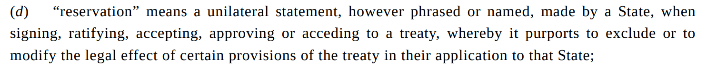

---
output:
  xaringan::moon_reader:
    css: ["default", "extra.css"]
    lib_dir: libs
    seal: false
    nature:
      highlightStyle: github
      highlightLines: true
      countIncrementalSlides: false
      ratio: '16:9'
---

```{r, echo = FALSE, warning = FALSE, message = FALSE}
library(tidyverse)
library(readxl)
#library(stargazer)
#library(kableExtra)
#library(modelr)

knitr::opts_chunk$set(echo = FALSE,
                      eval = TRUE,
                      error = FALSE,
                      message = FALSE,
                      warning = FALSE,
                      comment = NA)
```

background-image: url('libs/Images/background-scales_justice_v3.png')
background-size: 105%
background-position: top
class: middle

.size45[**II. International Institutions for Mutual Restraint**]

<br>

.size50[**Today's Agenda: Design Analysis**

- The Convention Against Torture (CAT)
]

<br>

.center[.size40[
  Justin Leinaweaver (Fall 2023)
]]

???

### Prep for Class
1. Open rmd file so you can record treaty analysis notes from board

<br>

#### References
- [UNTC Page](https://treaties.un.org/Pages/ViewDetails.aspx?src=IND&mtdsg_no=IV-9&chapter=4&clang=_en)
- [Treaty Text](https://treaties.un.org/doc/Treaties/1987/06/19870626%2002-38%20AM/Ch_IV_9p.pdf)

<br>


---

background-image: url('libs/Images/background-blue_cubes_lighter3.png')
background-size: 100%
background-position: center
class: middle

.size55[.content-box-white[**Semester Plan of Attack**]]

.size45[
.textblue[**II. International Institutions for Mutual Restraint**]

- The Treaty on the Non-Proliferation of Nuclear Weapons (NPT)

- The Convention Against Torture (CAT)

- Principal-Agent Theory

- The International Criminal Court

]

???

Second section of the class: International Institutions for Mutual Restraint

- Last week international institutions to prevent nuclear proliferation.

<br>

### Key takeaways? How are we, the world, doing with this problem?


---

background-image: url('libs/Images/06_1-CAT_Convention1.jpg')
background-size: 100%
background-position: center
class: top, center

.size50[.content-box-white[**The Convention Against Torture (CAT) (1984)**]]

???

This week's plan is to explore the international effort to stop the government use of torture.

- Today we summarize and analyze the treaty 

- Thursday we explore the debate about whether the CAT has been effective or not

<br>

**SLIDE**: We'll organize our work similarly to how we did it last week.


---

background-image: url('libs/Images/06_1-CAT_Convention1_blurred_filtered.png')
background-size: 100%
background-position: center
class: middle

.center[.size50[.content-box-white[The Convention Against Torture (CAT) (1984)]]]

.size45[

<br>

.content-box-white[1) What is the current state of the problem?]

.content-box-white[2) What is the treaty designed to do?]

.content-box-white[3) What is the likelihood that this design will succeed?]
]

???

Three broad questions although the nature of this treaty will lead us to attack each in slightly different ways.

<br>

**SLIDE**: Let's dive into our first question...


---

background-image: url('libs/Images/background-blue_cubes_lighter3.png')
background-size: 100%
background-position: center
class: middle

.center[.size55[.content-box-purple[1) What is the current state of the problem?]]]

<br>

```{r, echo = FALSE, fig.align = 'center', out.width = '50%'}

```

???

### Key overarching takeaways from the "Global Analysis" section?


---

background-image: url('libs/Images/background-blue_cubes_lighter3.png')
background-size: 100%
background-position: center
class: middle

.center[.size55[.content-box-purple[1) What is the current state of the problem?]]]

<br>

.pull-left[
```{r, echo = FALSE, fig.align = 'center', out.width = '100%'}

```
]

.pull-right[
.size35[
**Regional Overviews**

- Africa (p21)

- Americas (p29)

- Asia-Pacific (p37)

- Europe and Central Asia (p45)
]]

???

GROUPS: What are your key takeaways from the region and the individual country cases

- PRESENT and BRIEFLY DISCUSS each

<br> 

**SLIDE**: Before we dig into the treaty let me ask you to reflect on our discussion so far.


---

background-image: url('libs/Images/06_1-CAT_Convention1_blurred_filtered.png')
background-size: 100%
background-position: center
class: middle, center

.size50[.content-box-white[**The Convention Against Torture (CAT) (1984)**]

<br>

<br>

<br>

.content-box-white[Do we need an international law to ban torture?]
]

???

I'm not trying to be flippant here.
- International law for mutual restraint means deciding that there are some issues states and their citizens cannot decide for themselves.

<br>

Given everything we just discussed from the AI report I want you to reflect on two things

### 1) Is this problem clear enough and serious enough to merit international law infringing on state sovereignty?

<br>

### 2) Is this a problem international law is likely to be effective in solving? Why or why not?


---

background-image: url('libs/Images/06_1-CAT_Convention1_blurred_filtered.png')
background-size: 100%
background-position: center
class: middle

.size50[.center[.content-box-white[**The Convention Against Torture (CAT) (1984)**]]]

<br>

.size50[
.content-box-white[2) What is the treaty designed to do?]

.content-box-white[Part 1: The Key Rules]

.content-box-white[Part 2: The Committee]

.content-box-white[Part 3: Participation]
]

???

Our second task for today is to summarize the treaty in terms of its design.

- We'll follow a similar path to last week but we'll match our work to the three parts of the treaty

<br>

*SPLIT class into small groups (3), NEW PARTNERS!*

- Go sit with your group


---

background-image: url('libs/Images/background-blue_cubes_lighter3.png')
background-size: 100%
background-position: center
class: middle

.center[.size45[.content-box-white[**The Convention Against Torture (CAT) (1984)**]]]

<br>

.center[.size40[.content-box-white[Part 1: The Key Rules (Art 1-16)]]]

<br>

.pull-left[
```{r, echo = FALSE, fig.align='center', out.width = '100%'}
knitr::include_graphics("libs/Images/02_2-Legalization_Table2.png")
```
]

.pull-right[
```{r, echo = FALSE, fig.align='center', out.width = '100%'}
knitr::include_graphics("libs/Images/02_2-Legalization_Table3.png")
```
]

???

GROUPS: Start by summarizing the key obligations in Part I of the treaty

- ID the rules and classify each article by level of precision

<br>

*ON BOARD: (save space for three parts of treaty)

- BUILD and DISCUSS the LIST

<br>

### Is Article 1's definition of torture an obligation or something else?
- (It is the precision that makes the rest of Part 1 possible)
- Without the clear definition in 1, all the other article obligations are dramatically reduced

### Why does the definition include the list of use cases for torture ("for such purposes as...")? Why not just make the definition the first half of sentence 1 alone?
- (Spit-balling: If you don't narrow it down like this it could be applied to many different situations states aren't focused on here, e.g. cuts to social welfare benefits could cause harm)

<br>

#### Class Notes - 2023-09-26
- Art 2.1 (make torture a domestic crime)
- Art 3.1 (no extradition to countries where torture is likely)
- Art 11 (Must enshrine domestic rules for interrogations)
- Art 13 (prisoners have the right to request investigations for maltreatment)
- Art 14 (Enforcible right to compensation for torture)
- Art 15 (No testimony may be compelled or used through torture)
- Art 16 (Domestic ban must be applied to all territories controlled)


---

background-image: url('libs/Images/background-blue_cubes_lighter3.png')
background-size: 100%
background-position: center
class: middle

.center[.size45[.content-box-white[**The Convention Against Torture (CAT) (1984)**]]]

<br>

.center[.size40[.content-box-white[Part 2: The Committee (Art 17-24)]]]

<br>

```{r, echo = FALSE, fig.align='center', out.width = '50%'}
knitr::include_graphics("libs/Images/02_2-Legalization_Table4.png")
```

???

GROUPS: Focus your summary of Part II on summarizing the delegation in the treaty

- There are absolutely obligations in this part and precision matters too, but I want us to focus on trying to summarize how substantial this delegation appears to be.

<br>

*ON BOARD: (save space for three parts of treaty)

- BUILD and DISCUSS the LIST

<br>

*Make sure to discuss Art 21 and Art 22 which are held up by Hathaway (2007) as important enough to be a separate DV from simple CAT ratification!*

- Art 21: Do you accept oversight by states?

- Art 22: Do you accept oversight by individuals?

- Both of those open you to oversight and negotiation with other states BUT Art 22 threatens to open you to something very different: It empowers non-state actors to make serious claims on your behavior!

<br>

### That done, were there any state obligations that stood out for you in Part II that we want to add to our list?

- BUILD and DISCUSS the LIST

<br>

#### Class Notes - 2023-09-26
- ?


---

background-image: url('libs/Images/background-blue_cubes_lighter3.png')
background-size: 100%
background-position: center
class: middle

.center[.size45[.content-box-white[**The Convention Against Torture (CAT) (1984)**]]]

<br>

.center[.size40[.content-box-white[Part 3: Participation (Art 25-33)]]]

<br>

.pull-left[
```{r, echo = FALSE, fig.align='center', out.width = '90%'}
knitr::include_graphics("libs/Images/02_2-Legalization_Table2.png")
```

```{r, echo = FALSE, fig.align='center', out.width = '80%'}
knitr::include_graphics("libs/Images/02_2-Legalization_Table3.png")
```

]

.pull-right[
```{r, echo = FALSE, fig.align='center', out.width = '100%'}
knitr::include_graphics("libs/Images/02_2-Legalization_Table4.png")
```
]

???

Groups, let's finish by reviewing Part III of the treaty.

- Most treaties include basic boilerplate language about joining the treaty but the CAT has some possibly important stuff in here.

- Read through Part III and let me know if anything stands out.

<br>

*ON BOARD*: (save space for three parts of treaty)

- BUILD and DISCUSS the LIST


---

background-image: url('libs/Images/background-blue_cubes_lighter3.png')
background-size: 100%
background-position: center
class: middle

.center[.size45[.content-box-white[**Vienna Convention on the Law of Treaties (1969)**]]]

<br>

```{r, echo = FALSE, fig.align='center', out.width = '100%'}

```

.size35[
Art 19: Formulation of reservations

Art 20: Acceptance of and objection to reservations

Art 21: Legal effects of reservations and of objections to reservations

Art 22: Withdrawal of reservations and of objections to reservations 
]

???

Let's now talk treaty reservations.

- Refresher from the Shaw (2008) chapter a few weeks back

- "“reservation” means a unilateral statement, however phrased or named, made by a State, when signing, ratifying, accepting, approving or acceding to a treaty, whereby it purports to exclude or to modify the legal effect of certain provisions of the treaty in their application to that State;" (Art 2)

- These articles try to make clear how reservations can and cannot be made

- Reservations are different from "statements ... not intended to have the legal effect of a reservation, such as understandings, political statements or interpretive declarations" (915).

- Reservations are also different from statements meant to guide domestic application / interpretation.

- Vienna Art 20 has the rules for whether a reservation is acceptable. Not an easy answer as it depends on the context of the situation and the degree to which the reservation messes with the object and purpose of the treaty. 
    - At the weak end an objection to a reservation may just modify the relationship between the reserving and the objecting state and only as it pertains to the article being reservation-ed. At the strong end reservations can be nullified if deeply problematic or unacceptable to the other states.
    - In general, if you don't object within 12 months of the reservation you've accepted it.

<br>

### Questions on these general rules of reservations?

<br>

- Best case scenario: Allowing reservations encourages wider participation by allowing states to modify their obligations on minor issues.

- Worst case scenario: Completely ruins the agreement and thoroughly complicates state interactions

<br>

**SLIDE**: CAT reservation rules...

<br>

#### Vienna Convention Notes
Vienna Convention on the Law of Treaties (1969)
ART 2(D)
"'reservation' means a unilateral statement, however phrased or named, made by a State, when signing, ratifying, accepting, approving or acceding to a treaty, whereby it purports to exclude or to modify the legal effect of certain provisions of the treaty in their application to that State;"

ART 19: FORMULATION OF RESERVATIONS
("A State may, when signing, ratifying, accepting, approving or acceding to a treaty, formulate a reservation unless:
(a) the reservation is prohibited by the treaty;
(b) the treaty provides that only specified reservations, which do not include the reservation in question, may be made; or
(c) in cases not falling under sub-paragraphs (a) and (b), the reservation is incompatible with the object and purpose of the treaty."

ART 20: ACCEPTANCE OF AND OBJECTION TO RESERVATIONS
ART 21: LEGAL EFFECTS OF RESERVATIONS AND OF OBJECTIONS TO RESERVATIONS
ART 22: WITHDRAWAL OF RESERVATIONS AND OF OBJECTIONS TO RESERVATIONS


---

background-image: url('libs/Images/background-blue_cubes_lighter3.png')
background-size: 100%
background-position: center
class: top, middle

.center[.size40[.content-box-white[**The Convention Against Torture (CAT) (1984)**]]]

.size30[
**Article 28**

1) Each State may, at the time of signature or ratification of this Convention or accession thereto, declare that it does not recognize the competence of the Committee provided for in article 20. (Committee investigates allegations of systematic torture)

**Article 29**

1) Any State Party to this Convention may propose an amendment and file it with the Secretary-General of the United Nations. (Must be accepted by 2/3 of all parties)

**Article 30**

2) Each State may, at the time of signature or ratification of this Convention or accession thereto, declare that it does not consider itself bound by paragraph I of this article. (Dispute resolution by arbitration)
]

???

### How substantial a set of loopholes does this make possible in the CAT?

### - Do any of these things hit directly on the elements you identified today as important design elements of the CAT?

<br>

Let's look at some of the specific reservations to the CAT!

- Everybody open the link in the syllabus and scan through the reservations attached below the table of dates.

<br>

First, let's locate examples of what Shaw (2008) would classify as 'simple declarations.'

- *ON BOARD or YOU HIGHLIGHT ON THE SCREEN*

<br>

Now, let's try to find examples that seriously alter the design of the CAT.

### Give me examples of states with reservations that you believe most substantially alter the CAT.

- *ON BOARD or on screen*

- *Really encourage these discussions*

<br>

### Should the state parties have rejected Pakistan's reservation? Why or why not?

<br>

### What about the US reservations to the torture definition in Art 1? Are these going too far? Why or why not?


---

background-image: url('libs/Images/background-blue_cubes_lighter3.png')
background-size: 100%
background-position: center
class: middle

.center[.size40[.content-box-white[**Koremenos, Lipson & Snidal (2001): Rational Design**]]]

.size40[
- Rational design

- Shadow of the future

- Transaction costs

- Risk aversion

Therefore, states design international institutions to facilitate and strengthen international cooperation.
]

???

Let's once again shift back to the Rational Design article by Koremenos, Lipson & Snidal (2001).

### Does the design of the CAT offer support for the key premises in those authors model of international cooperation? Why or why not?

- *Talk to your group, then report back!*

<br>

#### Notes
- Rational design: States and other international actors, acting for self-interested reasons, design institutions purposefully to advance their joint interests.
- Shadow of the future: The value of future gains is strong enough to support a cooperative arrangement.
- Transaction costs: Establishing and participating in international institutions is costly.
- Risk aversion: States are risk-averse and worry about possible adverse effects when creating or modifying international institutions.


---

background-image: url('libs/Images/background-blue_cubes_lighter3.png')
background-size: 100%
background-position: center
class: middle

.center[.size45[.content-box-white[**The Convention Against Torture (CAT) (1984)**]]]

<br>

```{r, echo = FALSE, fig.align='center', out.width = '80%'}
knitr::include_graphics("libs/Images/03_2-KLS_Table1.png")
```

???

Let's now use the Rational Design Conjectures to analyze the design of the NPT.

### Given the design of the treaty, what do we learn about the biggest challenges facing this effort to achieve international cooperation?

- *Talk to your group, then report back!*


---

class: middle

```{r, fig.retina=3, fig.align='center', out.width='95%', fig.height=6, fig.width=10, cache=TRUE}
# Use V-dem to map current torture levels
d <- read_excel("../../Data/V-Dem/V-Dem-CY-Core_csv_v13/V_Dem_Personal_Integrity_Rights-1789-2022.xlsx", guess_max = 10000, na = "NA") |>
  filter(year == 2022)

## Make a map
## Use rnaturalearth to define world map data
worldmap <- rnaturalearth::ne_countries(scale = 'medium', type = 'countries', returnclass = 'sf')

# Match codes
d$newcode1 <- countrycode::countrycode(d$COWcode, origin = "cown", destination = "iso3c")

# Merge data
d10 <- left_join(worldmap, d, by = c("adm0_a3" = "newcode1"))

# Audit missing data
d10$v2cltort_ord[d10$name == "Kosovo"] <- 3
d10$v2cltort_ord[d10$name == "S. Sudan"] <- 1
d10$v2cltort_ord[d10$name == "Serbia"] <- 3

d10 |>
  ggplot() +
  geom_sf(aes(fill = factor(v2cltort_ord))) +
  labs(fill = "", title = "V-Dem's 'Freedom From Torture' (2022)") +
  theme(legend.position = "right") +
  scale_fill_manual(values = c("red", "pink", "khaki", "skyblue", "blue"), na.value = "darkgrey")
```

???

Map is using latest data from the V-Dem project

- This variable measures a country-year by the level of torture being practiced

- 0: Not respected by public authorities. Torture is practiced systematically and is incited and approved by the leaders of government.

- 1: Weakly respected by public authorities. Torture is practiced frequently but is often not incited or approved by top leaders of government. At the same time, leaders of government are not actively working to prevent it.

- 2: Somewhat. Torture is practiced occasionally but is typically not approved by top leaders of government.

- 3: Mostly respected by public authorities. Torture is practiced in a few isolated cases but is not incited or approved by top government leaders.

- 4: Fully respected by public authorities. Torture is non-existent.

<br>

### Given everything we've discussed today, is it fair to evaluate the CAT in terms of the level of torture happening within countries after ratification? Why or why not?

<br>

### Focusing on the design of the treaty itself, what are "fair" tests of the effectiveness of the CAT?

### - In other words, based on what the treaty is ACTUALLY DESIGNED TO DO, what evidence would we need to argue the treaty has worked?


---

background-image: url('libs/Images/background-blue_triangles.jpg')
background-size: 100%
background-position: center
class: middle

.size50[.content-box-white[**Next Class: Has the CAT been effective?**]]

.size40[
1. Hathaway (2007) "Why Do Countries Commit to Human Rights Treaties?"

2. Vreeland (2008) "Political Institutions and Human Rights: Why Dictatorships Enter into the United Nations Convention Against Torture"

3. Hollyer & Rosendorff (2011) "Why Do Authoritarian Regimes Sign the Convention Against Torture? Signaling, Domestic Politics and Non-Compliance"
]

???

Next class we dive into the academic literature that tries to answer this question!

<br>

Your job to get ready for class is simply to identify the argument being tested

- Who are the interests the paper is focusing on?

- What are the institutions that structure their behavior?

- What are the interactions that complicate their behavior?

<br>

In class we'll diagram and discuss those models and then review the analyses together.

### Questions on the assignment?


