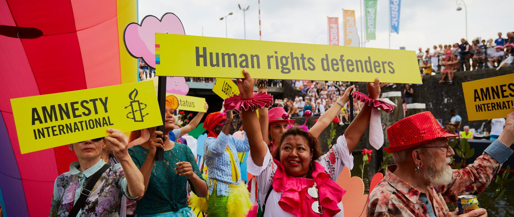

## Today's Agenda {background-image="./Images/background-scales_justice_v3.png" .center}

```{r}
# background-size="1920px 1080px"
library(tidyverse)
library(readxl)
```

<br>

**Section 2: How effective have international institutions been in reducing the use of torture by governments around the world?**

- Is torture an important problem we can address with an international institution?

<br>

::: r-stack
Justin Leinaweaver (Fall 2026)
:::

::: notes

**Prep for Class**

1. Review Canvas submissions

2. Have the class circle up seminar style!

3. SAVE the importance of torture argument in your notes

<br>

**SLIDE**: Kicking off Section 2

:::


## {background-image="./Images/background-scales_justice_v3.png" .center}

**How effective have international institutions been in reducing the use of torture by governments around the world?**

- Week 6: Defining and Measuring the Outcome

- Week 7: The Convention Against Torture (CAT)

- Week 8: Explaining the Effect of the CAT on Torture 

- Week 9: The International Criminal Court (ICC)

- Week 10: Can the ICC help us reduce global torture?

- Week 11: Case Studies of ICC Effectiveness

::: notes

Section 2 of our class is focused on attacking an important research question

- And, importantly, this is NOT settled in the literature

- They are big answers out there but our understanding of the mechanisms and impacts is still being developed

<br>

Over the next six weeks we will:

- Define and measure the outcome of interest: The use of torture by governments

- Unpack the design of the Convention Against Torture (CAT) using the legalization and rational design conjectures

- Analyze the data that connects the CAT to the use of torture by governments

- Unpack the design of the International Criminal Court (ICC) using the legalization and rational design conjectures PLUS adding some insights from principal-agent theory

- And then use case studies of the ICC in action to identify its effect on torture by governments

<br>

**Sound good?**

<br>

**SLIDE**: Our work today is meant to set us up for this research project

:::


## {background-image="./Images/background-scales_justice_v3.png" .center}

### Per Amnesty International, what is the current state of human rights on our planet?



::: notes

Let's start big picture and just talk about the global overview in the latest Amnesty International report

- **What stood out to you in their reporting?**

- **This doesn't have to focus on torture yet, give me big picture takeaways**

<br>

*DISCUSS*

<br>

**SLIDE**: Let's now start to zoom in on the torture problem

:::


## {background-image="./Images/background-scales_justice_v3.png" .center}

::: {.r-fit-text}

**The Impacts of Torture on Current Events**

::: {.fragment}
 
1. Where is torture impacting current events?

2. Why is this an important international concern?

:::
:::

::: notes

Ok, let's run through the cases you submitted to Canvas for today with two aims in mind

- FIRST, we need to broaden the cases informing our intuitions on torture

    - e.g. what it it and where it is practiced
    
- SECOND, we need to frame the problem as one of INTERNATIONAL and not just DOMESTIC concern

<br>

**REVEAL**: So, I want each of you to introduce the case you submitted for today, AND give us one big picture reason you think this is an important international concern

- *ON BOARD: Therefore, torture is an important international problem*

- I'll track the importance argument on the board as we develop it! Go!

<br>

**So, what is our strongest and most coherent argument that torture is an international problem and not just a matter of domestic concern?**

- *DISCUSS and reword or reorder the argument as needed*

<br>

Ok, I'm sold, torture is a serious and important international problem

- Now, what do we do about it?

- *Split class into four groups*

- Go sit with your group and claim space on the board!

<br>

**SLIDE**: Key obstacles to overcome

:::


## {background-image="./Images/background-scales_justice_v3.png" .center .smaller}

**What are the key obstacles facing any international institution trying to address the use of torture by governments?**

- Mearsheimer's critiques of international institutions

    - (e.g. balance of power, relative gains and cheating)

- Keohane's market failures approach to facilitating cooperation

    - (e.g. legal liability, transaction costs, asymmetrical information, moral hazard, market failure)

- KLS's "complications" in rational design

    - (e.g. enforcement, uncertainty about preferences, uncertainty about behavior, uncertainty about the state of the world, number and distribution)


::: notes

Groups, I want you to make us a list of the key obstacles you believe face any international institution that is trying to address the use of torture by governments

- Specifically, I want you to include items from...

<br>

**Any questions?**

- Work directly on the board and please write in complete sentences!

- Go!

<br>

*PRESENT and DISCUSS each*

- Let's hear what each group identified as the key obstacles and why

<br>

**SLIDE**: Institutional designs

:::


## {background-image="./Images/background-scales_justice_v3.png" .center}

**Given this list of obstacles, what suggestions would you offer any group of countries intent on designing an international institution to reduce torture?**

- "Hard" vs "soft" law: Obligations, precision and delegation

- Which rational design conjectures are most relevant?

::: notes

GROUPS discuss and get ready to pitch us

- Given this list of obstacles, what suggestions would you offer any group of countries intent on designing an international institution to reduce torture?

- I want a list of specific pieces of design advice you would offer these countries!

<br>

*PRESENT and DISCUSS each*

<br>

**Big wrap-up question: Given the scope of the problem, the obstacles we face and the limitations of international law, what does success for an international institution targeting torture really look like?**

- *DISCUSS*

<br>

**SLIDE**: Next class

:::


## For Next Class {background-image="./Images/background-scales_justice_v3.png" .center}

<br>

**Evaluating the CIRIGHTS measures of torture**

- Evaluate the methodology for strengths and weaknesses

- Find us something interesting in the data

::: notes

Canvas ASSIGNMENT: Evaluating the CIRIGHTS measures of torture
Read the codebook excerpt and spend some time exploring the data provided by the research team
1. What are AT LEAST THREE strengths of this measure of torture? Ideally, your evaluations should be rooted in the validity and reliability of the measures.
2. What are AT LEAST THREE weaknesses of this measure of torture? Ideally, your evaluations should be rooted in the validity and reliability of the measures.
3. Did any country's scores surprise you as you scrolled through the data (for good or ill)? Give us something you noticed from the data that's worth discussing in class.


:::