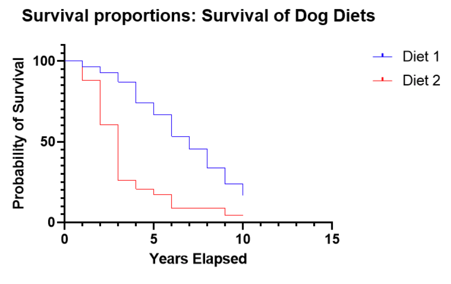

---
output:
  xaringan::moon_reader:
    css: ["default", "extra.css"]
    lib_dir: libs
    seal: false
    nature:
      highlightStyle: github
      highlightLines: true
      countIncrementalSlides: false
      ratio: '16:9'
---

```{r, echo = FALSE, warning = FALSE, message = FALSE}
library(tidyverse)
#library(readxl)
#library(stargazer)
#library(kableExtra)
#library(modelr)

knitr::opts_chunk$set(echo = FALSE,
                      eval = TRUE,
                      error = FALSE,
                      message = FALSE,
                      warning = FALSE,
                      comment = NA)
```

background-image: url('libs/Images/background-scales_justice_v3.png')
background-size: 105%
background-position: top
class: middle

.size45[**II. International Institutions for Mutual Restraint**]

<br>

.size50[**Today's Agenda: Effectiveness Analysis**

- The Convention Against Torture (CAT)
]

<br>

.center[.size40[
  Justin Leinaweaver (Fall 2023)
]]

???

### Prep for Class
1. ?

<br>

#### References
1. Hathaway (2007) "Why Do Countries Commit to Human Rights Treaties?"
2. Vreeland (2008) "Political Institutions and Human Rights: Why Dictatorships Enter into the United Nations Convention Against Torture"
3. Hollyer & Rosendorff (2011) "Why Do Authoritarian Regimes Sign the Convention Against Torture? Signaling, Domestic Politics and Non-Compliance"


---

background-image: url('libs/Images/06_1-CAT_Convention1_blurred_filtered.png')
background-size: 100%
background-position: center
class: middle, center

.size50[
.content-box-purple[**The Convention Against Torture (CAT) (1984)**]

<br>

<br>

<br>
]

.size45[.content-box-purple[Based on its design, what is the likelihood that the CAT will succeed?]]

???

Let's talk key takeaways from last class on the CAT.

### What are the most substantive obligations in the treaty?

### - How precise are they?

<br>

### How substantial is the delegation in the treaty?

<br>

### Based on the design of the CAT, what is an appropriate test of "success"?

<br>

Keep the treaty design in mind as we evaluate the tests in today's articles.

- Ask yourself as we go, is this a "fair" test of treaty effectiveness?

- e.g. Is this test consistent with the design of the actual treaty?


---

background-image: url('libs/Images/background-blue_triangles.jpg')
background-size: 100%
background-position: center
class: middle

.size50[.content-box-white[**Today: Has the CAT been effective?**]]

.size40[
1. Hathaway (2007) "Why Do Countries Commit to Human Rights Treaties?"

2. Vreeland (2008) "Political Institutions and Human Rights: Why Dictatorships Enter into the United Nations Convention Against Torture"

3. Hollyer & Rosendorff (2011) "Why Do Authoritarian Regimes Sign the Convention Against Torture? Signaling, Domestic Politics and Non-Compliance"
]

???


For today you read the arguments in three attempts to evaluate the effectiveness of the CAT.

<br>

*Split class in thirds, assign to each article*

<br>

GROUPS, take a few minutes to do two things *ON THE BOARD*:

1. Diagram the model in your paper in terms of its interests, institutions and interactions

2. Give us your article's answer to the question, has the CAT been effective?

<br>

### Questions?

- Let's get to work!

- *Go to the Hollyer & Rosendorff (2011) group and caution them they are working on a formal model paper.* Message: Just do your best!

<br>

Group 1 present Hathaway (2007) argument.

- **SLIDE**: My version

<br>

#### Notes
- **Interests**: "…[The] preferences of actors over the possible outcomes that might result from their political choices" (45).

- **Institutions**: "A set of rules, known and shared by the community, that structure political interactions in particular ways" (67).

- **Interactions**: "The ways in which the choices of two or more actors combine to produce political outcomes" (51).


---

background-image: url('libs/Images/background-blue_cubes_lighter3.png')
background-size: 100%
background-position: center
class: middle

.center[.size35[.content-box-white[**Hathaway (2007): The Model**]]]

.size30[
Interests
- States want to join human rights treaties that are not costly (?)

Institutions
- Most human rights treaties lack meaningful external enforcement
- States vary in how much they empower actors inside and outside of government to enforce rules

Interactions
- Ratification may empower human rights advocacy groups to pressure the government
- Ratification may empower transnational actors (aid, trade, or other) to pressure the government
]

???

Bottom line here: The decision to join a human rights treaty depends on the interaction of domestic institutions and the consequences of joining. 

<br>

### Group 1, what do you think? Am I missing anything you'd like to add?

### - Does Hathaway ever explicitly tell us WHY the state wants to join human rights treaties?
- (From my skim before class, it is not clear what motivates states to join these treaties in the first place)

<br>    
    
### Is this a logical model? Why or why not?

<br>

Hathaway's argument pushes us to think about the complexity of international law: 
- Effectiveness = Treaty design x domestic politics x international politics

- The good: Treaties can influence behavior without international enforcement

- The bad: Only works in states with domestic enforcement capabilities.
    - If none, e.g. dictatorship, even hard law is likely ineffective. 

- So,
    - autocracies will ratify for reasons besides their use of torture.
    - democracies will ratify ONLY if they don't torture and don't anticipate needing to torture in future.

<br>

Let's take a quick jog through the analyses!

<br>

#### Old Notes
- Domestic enforcement capacity matters
    - Most human rights treaties create rules but include no meaningful international enforcement (592).
    - More developed domestic systems empower actors inside and outside of government to enforce treaty rules (593).
    
- Collateral consequences matter
    - Ratification may empower human rights advocacy groups to pressure the government (596).
    - Ratification may empower transnational actors (aid, trade, or other) to pressure the government (596)

- So, Hathaway (2007) expects states to consider these two dynamics BEFORE ratifying a treaty.


---

background-image: url('libs/Images/background-blue_cubes_lighter3.png')
background-size: 100%
background-position: center
class: middle

.center[.size35[.content-box-white[**Hathaway (2007): Data Sources & Operationalizations**]]]

.size30[
**Outcome Variables**
- Ratification of the CAT (UNTC)
- Acceptance of CAT Art. 21 and 22 (UNTC)

**Predictor Variables**
- Domestic Enforcement Capacity = Level of democracy from 0-10 (Polity IV)

- Collateral Consequences = Count of human rights NGOs actively working (Human Rights Internet)

- Government Use of Torture = CIRI Human Rights (based on reports from Amnesty International and the US State Department)
]

???

### First of all, and based on our analyses of the design of the CAT, are we willing to consider these two outcomes as equally substantial commitments? Why or why not?

- Why separately examine Art 21 and 22? ("...create harder obligations than the other legal instruments examined here, for they establish more formal (if infrequently used) enforcement mechanisms" (592).)

<br>

*Walk them through the three predictors*

<br>

### In terms of accurately reflecting the mechanisms in the model, are we comfortable with these data choices? Why or why not?

<br>

### What should we expect to see in the data if Hathaway (2007) is right?
- (**SLIDE**)


---

background-image: url('libs/Images/background-blue_cubes_lighter3.png')
background-size: 100%
background-position: center
class: middle

.center[.content-box-white[.size40[**Hathaway (2007): Domestic Enforcement Capacity Test**]]]

<br>

```{r, fig.align='center', fig.retina=3, out.width='80%', fig.asp = 0.618}
tibble(
  Democracy = 0:10,
  torture = 1
) |>
  ggplot(aes(x = Democracy, y = torture)) +
  geom_point(color = "white") +
  geom_hline(yintercept = 1) +
  #geom_line() +
  coord_cartesian(ylim = c(0, 2)) +
  labs(y = "Partial Effect of Torture") +
  theme_bw() +
  scale_x_continuous(breaks = 0:10)
```

???

Before we dig into the figures in the paper, let's set up what we'll be looking at.

- The results in the paper come from a Cox Proportional Hazard Regression

<br>

This marginal effects plot allows us to visualize the effect of democracy and torture on the probability a state ratifies the CAT.

- x-axis: Level of democracy

- y-axis: Effect of increasing torture level on the likelihood of ratifying CAT

<br>

Each point on the plot is a hazard ratio

- Values > 1 on the y-axis are more likely ratifications by that kind of state

- Values < 1 on the y-axis are less likely ratifications by that kind of state

- And Values = '1' essentially means no effect

<br>

### Make sense?


---

background-image: url('libs/Images/background-blue_cubes_lighter3.png')
background-size: 100%
background-position: center
class: middle

.center[.content-box-white[.size40[**Hathaway (2007): Domestic Enforcement Capacity Test**]]]

<br>

```{r, fig.align='center', fig.retina=3, out.width='80%', fig.asp = 0.618}
tibble(
  Democracy = 0:10,
  torture = 1.5
) |>
  ggplot(aes(x = Democracy, y = torture)) +
  geom_point(color = "blue", size = 3) +
  geom_line(color = "blue") +
  geom_hline(yintercept = 1, linewidth = .3) +
  coord_cartesian(ylim = c(0, 2)) +
  labs(y = "Partial Effect of Torture") +
  theme_bw() +
  scale_x_continuous(breaks = 0:10)
```

???
    
### So, if the analysis produced this line, what would it mean for the effects of democracy and torture on CAT ratifications?

- (Per this line, all countries (e.g. any level of democracy) who use torture are more likely to ratify the CAT)

<br>

### Given that CAT aims to criminalize torture, what kind of line should we expect to see?

- (**SLIDE**)


---

background-image: url('libs/Images/background-blue_cubes_lighter3.png')
background-size: 100%
background-position: center
class: middle

.center[.content-box-white[.size40[**Hathaway (2007): Domestic Enforcement Capacity Test**]]]

<br>

```{r, fig.align='center', fig.retina=3, out.width='80%', fig.asp = 0.618}
tibble(
  Democracy = 0:10,
  torture = .5
) |>
  ggplot(aes(x = Democracy, y = torture)) +
  geom_hline(yintercept = 1, color = "darkgrey", linewidth = .4) +
  geom_point(size = 3, color = "red") +
  geom_line(color = "red") +
  coord_cartesian(ylim = c(0, 2)) +
  labs(y = "Partial Effect of Torture") +
  theme_bw() +
  scale_x_continuous(breaks = 0:10)
```

???

This line would indicate that for all countries, regardless of level of democracy, using torture makes them less likely to ratify the CAT (-50%).

- If the CAT makes torture harder then we'd hope states that do it a lot would hesitate to join!

<br>

### Make sense?


---

background-image: url('libs/Images/background-blue_cubes_lighter3.png')
background-size: 100%
background-position: center
class: middle

.center[.content-box-white[.size40[**Hathaway (2007): Domestic Enforcement Capacity Test**]]]

```{r, echo = FALSE, fig.align = 'center', out.width = '65%'}

```

???

Ok, here's the real results.

### Ignore the dashed lines (confidence intervals) for a moment and tell me, what did Hathaway (2007) find?

Figure 1

- Dictatorships who use torture are MORE likely to ratify the CAT
- Democracies that use torture are LESS likely to ratify
- Democracy of 1, hazard ratio of 1.4 (+40%)
- Democracy of 10, hazard ratio of .7 (-30%)

<br>

**SLIDE**: And here are the results for acceptance of Articles 21 and 22.


---

background-image: url('libs/Images/background-blue_cubes_lighter3.png')
background-size: 100%
background-position: center
class: middle

.center[.content-box-white[.size40[**Hathaway (2007): Domestic Enforcement Capacity Test**]]]

```{r, echo = FALSE, fig.align = 'center', out.width = '65%'}

```

???

### Ignore the dashed lines (confidence intervals) for a moment and tell me, what did Hathaway (2007) find?

- Figure 2: Same general trend but weaker effect

<br>

### So, what does this mean for the Domestic Enforcement Capacity Test?

Domestic Enforcement Matters!
- Regimes with no domestic enforcement feel free to ratify CAT and keep torturing

- Regimes with strong domestic enforcement who torture are less likely to ratify CAT

<br>

She doesn't find compelling evidence for the collateral consequences hypothesis so we'll skip that.

- e.g. more human rights NGOs matter for ratification


---

background-image: url('libs/Images/06_1-CAT_Convention1_blurred_filtered.png')
background-size: 100%
background-position: center
class: middle, center

.size50[
.content-box-purple[**The Convention Against Torture (CAT) (1984)**]

<br>

<br>

<br>
]

.size45[.content-box-purple[Per Hathaway (2007), has the CAT been effective?]]

???

### Group 1, what is Hathaway's answer to the question?

(Yes and no!)

- Overall she finds that countries who ratify the CAT experience more torture than those who don't, but this is likely a selection effect

- In democracies (systems with domestic rule enforcement) the CAT provides meaningful rules against torture!
    - If you use torture, you probably won't join

- In dictatorships (systems without domestic enforcement) the CAT probably won't deter torture use so they feel free to join

<br>

### Make sense?


---

background-image: url('libs/Images/background-blue_triangles.jpg')
background-size: 100%
background-position: center
class: middle

.size50[.content-box-white[**Today: Has the CAT been effective?**]]

.size40[
1. Hathaway (2007) "Why Do Countries Commit to Human Rights Treaties?"

2. Vreeland (2008) "Political Institutions and Human Rights: Why Dictatorships Enter into the United Nations Convention Against Torture"

3. Hollyer & Rosendorff (2011) "Why Do Authoritarian Regimes Sign the Convention Against Torture? Signaling, Domestic Politics and Non-Compliance"
]

???

Vreeland (2008) represents an attempt to explain the puzzle that Hathaway (2007) found.

- Dictatorships having little domestic enforcement might make joining the CAT low risk, but why choose to take on any risk at all?

<br>

Vreeland (2008) group, take it away!

<br>

**SLIDE**: My version


---

background-image: url('libs/Images/background-blue_cubes_lighter3.png')
background-size: 100%
background-position: center
class: middle

.center[.size35[.content-box-white[**Vreeland (2008): The Model**]]]

.size30[
Interests
- Dictatorships want political survival

Institutions
- Dictatorships vary in their openness to power sharing (opposition parties)
- The international costs of ratifying the CAT are low (opt-out Art 21 & 22)

Interactions
- Dictatorships allow power sharing to "encapsulate" the opposition
- In closed systems, torture is mostly unnecessary as a signalling tool
- In open systems, torture is a useful tool if opposition gets out of line
- In open systems, ratifying the CAT is a "relatively cheap concession"
]

???

### Group 2, anything you want to add here?

<br>    
    
### Is this a logical model? Why or why not?

<br>

**SLIDE**: To the data!

<br>

#### Old Notes

- Political survival may require organized political parties or limited power sharing

- Those groups demand concessions for them to support the government and the CAT is one available concession

- If the dictator opts out of the optional Articles then the CAT is an incredibly cheap concession to make.

- Torture is a rational, strategic choice (Wantchekon and Healy 1999) used to extract information and exert social control (Rejali 2007)

- System openness (power sharing) determines the value of torture (if closed unnecessary, if open may be needed).

- If the system is open to opposition parties, joining CAT is a "relatively cheap concession" (raises the costs of torture in small ways).

Therefore, torture is a strategic tool in dictatorships and the CAT doesn't help in the worst cases.


---

background-image: url('libs/Images/background-blue_cubes_lighter3.png')
background-size: 100%
background-position: center
class: middle

.center[.size35[.content-box-white[**Vreeland (2008): Data Sources & Operationalizations**]]]

.size35[
**Outcome Variables**
- Government Use of Torture = CIRI Human Rights Data
- Signature and Ratification of the CAT (UNTC)

**Predictor Variables**
- Is the dictatorship "open" to multiple political parties? (Gandhi 2004)
    - 1 = "if more than one party exists legally"
    - 0 = "otherwise"
]

???

Vreeland is jumping off from the observations made in Hathaway (2007).

- Key here is to explain why dictatorships who torture are more likely to join the CAT and hinging the explanation on openness.


---

background-image: url('libs/Images/background-blue_cubes_lighter3.png')
background-size: 100%
background-position: center
class: middle

.center[.size50[.content-box-white[**Method: Survival Analysis**]]]

```{r, echo = FALSE, fig.align = 'center', out.width = '80%'}

```

???

Vreeland (2008) uses a survival analysis to test his model.

- Survival analysis comes initially from medical research

- For each time interval, survival probability is calculated as the number of subjects surviving divided by the number of patients at risk.

<br>

On the slide I'm showing you the results of an experiment comparing two diets for dogs.

- The y-axis is the probability of survival (is the dog still alive?)

- The x-axis is time

<br>

The blue line is the first diet, the red line is the second

- At time 0 all of the subjects are alive so the probability of survival is 100%

- After 5 years nearly 70% of the dogs on Diet 1 are alive compared to less than 20% on Diet 2

<br>

### So, what conclusion do these survival curves help us draw?
- (Diet 1 is WAY better!)

<br>

### Make sense?


---

background-image: url('libs/Images/background-blue_cubes_lighter3.png')
background-size: 100%
background-position: center
class: middle

.center[.size50[.content-box-white[**Vreeland (2008): Analyses**]]]

```{r, echo = FALSE, fig.align = 'center', out.width = '70%'}

```

???

Vreeland applies this method to ratifying the CAT

- The y axis is "survival" meaning the probability of survival (e.g. states have NOT ratified)

- The x axis is time

<br>

So, at time 0, 100% of the countries had not ratified the CAT.

- As you trace the line to the right (across time) you see the number of states ratifying reducing the height of the line

- IMPORTANTLY, the line falls MUCH faster for dictatorships with opposition parties!

<br>

### What is our takeaway from this survival analysis?
- (Dictatorships that face organized, domestic opposition are more likely to ratify the CAT!)
<br>

### Make sense?

<br>

#### Notes
- "As one moves across the x-axis, the lines descend, as more and more countries sign/ratify over time. Note that in both figures the dashed line, representing dictatorships with multiple parties, descends more rapidly than the solid line, which represents dictatorships without parties. Tests indicate that this difference is statistically significant for both signing and ratifying. Dictatorships with multiple political parties are more likely to enter into the CAT" (87).

- A score of .5 would mean states ratifying at half the baseline rate.

- A score of 2 would mean states ratifying at twice the baseline rate.


---

background-image: url('libs/Images/06_1-CAT_Convention1_blurred_filtered.png')
background-size: 100%
background-position: center
class: middle, center

.size50[
.content-box-purple[**The Convention Against Torture (CAT) (1984)**]

<br>

<br>

<br>
]

.size45[.content-box-purple[Per Vreeland (2008), has the CAT been effective?]]

???

### Group 2, what is Vreeland's answer to the question?

(Not good)

- The good: Dictatorships are incentivized to ratify the CAT when they face an organized opposition

- The bad: Dictatorships facing an organized opposition are more likely to use torture!

- In sum, for dictatorships torture is a strategic tool and the CAT doesn't help.

<br>

### Make sense?

- **SLIDE**: Next Argument


---

background-image: url('libs/Images/background-blue_triangles.jpg')
background-size: 100%
background-position: center
class: middle

.size50[.content-box-white[**Today: Has the CAT been effective?**]]

.size40[
1. Hathaway (2007) "Why Do Countries Commit to Human Rights Treaties?"

2. Vreeland (2008) "Political Institutions and Human Rights: Why Dictatorships Enter into the United Nations Convention Against Torture"

3. Hollyer & Rosendorff (2011) "Why Do Authoritarian Regimes Sign the Convention Against Torture? Signaling, Domestic Politics and Non-Compliance"
]

???

Hollyer & Rosendorff (2011) aim to finish what Hathaway and Vreeland started.

- Hathaway showed us that domestic enforcement was key to making the CAT work

- Vreeland showed us that dictatorships facing a domestic opposition have reasons to join CAT and keep torturing

- H&R want to make clear that Vreeland didn't go far enough!

<br>

Hollyer & Rosendorff (2011) group, take it away!

<br>

This paper builds what is referred to as a formal model 

- Formal modeling is a way of turning theoretical arguments into mathematical proofs.

- In essence, these are an attempt to present social science models using mathematical proofs

- Benefit: Incredibly clear specification of the components and mechanisms in the model, often helps to identify implications

- Drawbacks: Often complicated, may be misleading 

<br>

We won't step through the whole model because it gets super complicated and isn't important for our purposes today.

- **SLIDE**: However, we should step through the basics of the formal model together.

<br>

### OLD Notes
Conclusion: Dictators join the CAT to make torture a more effective strategy!

- Domestic opposition works to overthrow the government
- Dictators use torture to repress the opposition (survive)
- Torture is a costly strategy for political survival
- Global CAT participation makes it much harder to torture and leave (escape to exile)
    - Art. 4: torture = crime in all CAT states
    - Art. 5: CAT states must arrest you
    - Art. 6 & 8: CAT states must extradite you
- Signing the CAT (and using torture) signals the opposition you can never leave ("strong type") 

Therefore, dictators join the CAT to make torture a more effective strategy!

<br>

This is what Jim Vreeland calls the "badass" theory of torture.


---

background-image: url('libs/Images/background-blue_cubes_lighter3.png')
background-size: 100%
background-position: center
class: middle

.center[.size50[.content-box-white[**H&R's Formal Model: Actors**]]]

.pull-left[
.center[.size35[**The Government (G)**]]

```{r, echo = FALSE, fig.align = 'center', out.width = '70%'}

```
]

.pull-right[

<br>

.center[.size35[**The Opposition (D)**]]

```{r, echo = FALSE, fig.align = 'center', out.width = '100%'}

```
]

???

Two actors in the model: Government (G) and Opposition (D)

<br>

### What does each actor want?
- (The benefits of holding office! e.g. the office-seeking assumption)

<br>

So, the leader wants to keep office and the opposition want to replace him.

<br>

Why is everybody so deadset on controlling the government?

- **SLIDE**: Importantly and interestingly, the model breaks these benefits into two parts.


---

background-image: url('libs/Images/background-blue_cubes_lighter3.png')
background-size: 100%
background-position: center
class: middle

.center[.size50[.content-box-white[**H&R's Formal Model: Interests**]]]

.pull-left[
.center[.size35[**Benefits of office (C)**]]

```{r, echo = FALSE, fig.align = 'center', out.width = '70%'}

```
]

.pull-right[

<br>

.center[.size35[**Value of office (R)**]]

```{r, echo = FALSE, fig.align = 'center', out.width = '100%'}

```
]

???

All office holders receive two distinct sets of rewards

1. The benefits of holding office ('C') e.g. Money!
    - Salary for holding office
    - Ability to reward supporters with jobs, 
    - Ability to control resources
    - Ability to extract bribes, 
    - etc.

2. The value of holding onto office ('R') e.g. Security!
    - ability to protect yourself and supporters by controlling state and military

<br>

So, hold office and extract rewards both in terms of money and and in terms of control.

- **SLIDE**: Now let's talk interactions!


---

background-image: url('libs/Images/background-blue_cubes_lighter3.png')
background-size: 100%
background-position: center
class: middle, center

.size55[.content-box-white[**H&R's Formal Model: Interactions**]]

<br>

.size55[Each round the government survives based on the level of torture and opposition effort applied:

$\pi(t,e) = \frac{t}{t+e}$

]

???

The leader wants to keep control of the government and the opposition wants to replace him.

<br>

This model simplifies this contest for control into two choices:

- The leader gets to choose how much torture to use each round to maintain control, and

- The opposition chooses how much effort (risk) to take on in the round trying to remove the leader

<br>

This formula reflects the interaction and estimates the likelihood of political survival given a set level of torture and a set level of opposition.

<br>

**SLIDE**: Let's explore this relationship visually


---

background-image: url('libs/Images/background-blue_cubes_lighter3.png')
background-size: 100%
background-position: center
class: middle

.left-column[
.textblack[.size45[

<br>

<br>

$\pi(t,e) = \frac{t}{t+e}$
]]]

.right-column[
```{r, fig.retina=3, fig.align='center', fig.asp=.65, out.width = '95%', cache=TRUE}
tibble(
  Torture = c(rep(0, 8)),
  Opposition = rep(1:8, 1),
  Probability = Torture / (Torture + Opposition)
) %>%
  ggplot(aes(x = Opposition, y = Probability, color = factor(Torture))) +
  geom_point() +
  geom_line() +
  theme_bw() +
  coord_cartesian(ylim = c(0, 1)) +
  scale_y_continuous(labels = scales::percent_format()) +
  scale_x_continuous(breaks = 1:8) +
  labs(x = "Level of Opposition Effort to Remove the Government", 
       y = "Probability of Keeping Office", 
       title = "Hollyer and Rosendorff's (2011) Model of CAT Signature",
       color = "") +
  scale_color_manual(values = c("darkgreen")) +
  guides(color = "none") +
  annotate("text", x = 2, y = .1, label = "Torture = 0", color = "darkgreen", size = 5)
```
]

???

Here we see a visualization of the likelihood of keeping your office in this model if you choose not to torture anybody this round.

- Clearly this shows that ANY level of opposition effort will be enough to remove you from office (0% chance to keep office).

<br>

### Does this make sense?

<br>

Clearly a simplification of reality, but let's see if this helps us think about this dynamic.


---

background-image: url('libs/Images/background-blue_cubes_lighter3.png')
background-size: 100%
background-position: center
class: middle

.left-column[
.textblack[.size45[

<br>

<br>

$\pi(t,e) = \frac{t}{t+e}$
]]]

.right-column[
```{r, fig.retina=3, fig.align='center', fig.asp=.65, out.width = '95%', cache=TRUE}
# Torture 0 vs 1
tibble(
  Torture = c(rep(0, 8), rep(1,8)),
  Opposition = rep(1:8, 2),
  Probability = Torture / (Torture + Opposition)
) %>%
  ggplot(aes(x = Opposition, y = Probability, color = factor(Torture))) +
  geom_point() +
  geom_line() +
  theme_bw() +
  coord_cartesian(ylim = c(0, 1)) +
  scale_y_continuous(labels = scales::percent_format()) +
  scale_x_continuous(breaks = 1:8) +
  labs(x = "Level of Opposition Effort to Remove the Government", 
       y = "Probability of Keeping Office", 
       title = "Hollyer and Rosendorff (2011)",
       color = "") +
  scale_color_manual(values = c("darkgreen", "orange")) +
  guides(color = "none") +
  annotate("text", x = 2, y = .1, label = "Torture = 0", color = "darkgreen", size = 5) +
  annotate("text", x = 7, y = .2, label = "Torture = 1", color = "orange3", size = 5)
```
]

???

Here we see the effect of increasing your torture level to just '1.'

<br>

### Per this visualization, what is your likelihood of keeping office if you torture at a level of '1' and the opposition risks '1' to remove you?
- (50% chance of survival!)

<br>

### And if the opposition raises their level to an effort of '3'?
- (Cuts your chances in half! 25% chance of survival!)


---

background-image: url('libs/Images/background-blue_cubes_lighter3.png')
background-size: 100%
background-position: center
class: middle

.left-column[
.textblack[.size45[

<br>

<br>

$\pi(t,e) = \frac{t}{t+e}$
]]]

.right-column[
```{r, fig.retina=3, fig.align='center', fig.asp=.65, out.width = '95%', cache=TRUE}
# Torture 0 vs 1 vs 5
tibble(
  Torture = c(rep(0, 8), rep(1,8), rep(5,8)),
  Opposition = rep(1:8, 3),
  Probability = Torture / (Torture + Opposition)
) %>%
  ggplot(aes(x = Opposition, y = Probability, color = factor(Torture))) +
  geom_point() +
  geom_line() +
  theme_bw() +
  coord_cartesian(ylim = c(0, 1)) +
  scale_y_continuous(labels = scales::percent_format()) +
  scale_x_continuous(breaks = 1:8) +
  labs(x = "Level of Opposition Effort to Remove the Government", 
       y = "Probability of Keeping Office", 
       title = "Hollyer and Rosendorff (2011)",
       color = "") +
  scale_color_manual(values = c("darkgreen", "orange", "red")) +
  guides(color = "none") +
  annotate("text", x = 2, y = .1, label = "Torture = 0", color = "darkgreen", size = 5) +
  annotate("text", x = 7, y = .2, label = "Torture = 1", color = "orange3", size = 5) +
  annotate("text", x = 7, y = .5, label = "Torture = 5", color = "red", size = 5)
```
]

???

Here we see the effect of increasing your torture level to a mid-level on the scale ('5').

<br>

### Per this viz, what does a torture level of '5' vs an opposition effort of '1' get you?
- (A better than 80% chance of survival)

<br>

### And if they match your torture with effort? 5 vs 5?
- (Back to a 50-50 coin flip)


---

background-image: url('libs/Images/background-blue_cubes_lighter3.png')
background-size: 100%
background-position: center
class: middle

.left-column[
.textblack[.size45[

<br>

<br>

$\pi(t,e) = \frac{t}{t+e}$
]]]

.right-column[
```{r, fig.retina=3, fig.align='center', fig.asp=.65, out.width = '95%', cache=TRUE}
# Torture 0 vs 1 vs 5 vs 9
tibble(
  Torture = c(rep(0, 8), rep(1,8), rep(5,8), rep(9,8)),
  Opposition = rep(1:8, 4),
  Probability = Torture / (Torture + Opposition)
) %>%
  ggplot(aes(x = Opposition, y = Probability, color = factor(Torture))) +
  geom_point() +
  geom_line() +
  theme_bw() +
  coord_cartesian(ylim = c(0, 1)) +
  scale_y_continuous(labels = scales::percent_format()) +
  scale_x_continuous(breaks = 1:8) +
  labs(x = "Level of Opposition Effort to Remove the Government", 
       y = "Probability of Keeping Office", 
       title = "Hollyer and Rosendorff (2011)",
       color = "") +
  scale_color_manual(values = c("darkgreen", "orange", "red", "darkred")) +
  guides(color = "none") +
  annotate("text", x = 2, y = .1, label = "Torture = 0", color = "darkgreen", size = 5) +
  annotate("text", x = 7, y = .2, label = "Torture = 1", color = "orange3", size = 5) +
  annotate("text", x = 7, y = .48, label = "Torture = 5", color = "red", size = 5) +
  annotate("text", x = 7, y = .65, label = "Torture = 9", color = "darkred", size = 5)
```
]

???

### According to the model, why not increase torture way beyond what you think the opposition will do?

<br>

### What is happening here? Why is the effect of continuously increasing torture having smaller returns?

Torture Problem 1

- Probability capped at 100% and no strategy guarantees success

- Here we start to see the upper threshold of the effect.
    - The moves from 0 to 1 and 1 to 5 were BIG
    - The move from 5 to 9 is much smaller
    
- In other words, increasing torture forever doesn't guarantee survival


---

background-image: url('libs/Images/background-blue_cubes_lighter3.png')
background-size: 100%
background-position: center
class: middle

```{r, fig.retina=3, fig.align='center', fig.asp=.85, out.width = '70%', fig.width=6, cache=TRUE}
# Benefits vs torture
x1 <- tibble(
  Benefits = 5,
  Torture = 1:9,
  Total = Benefits - Torture,
  classified = case_when(
    Total < 0 ~ "low",
    Total > 0 ~ "high")
) 

x1 %>%
  ggplot(aes(x = Torture, y = Total, color = classified)) +
  geom_point(size = 3) +
  geom_line(size = 1.2) +
  theme_bw() +
  labs(x = "Level of Torture", y = "Benefits from Holding Office",
       title = "Benefits of Torture", subtitle = "Remember: Stay in office only if benefits - costs > 0") +
  scale_x_continuous(breaks = 1:9) +
  scale_y_continuous(breaks = seq(-5, 5, 2)) +
  ylim(-4, 4) +
  geom_hline(yintercept = 0, color = "darkred", linetype = "dashed") +
  guides(color = "none") +
  scale_color_manual(values = c("blue", "red"))
```

???

Torture Problem 2

- Here we visualize the trade-off between the level of torture you choose and the benefits of office you receive.

- The x-axis is your level of torture

- The y-axis is the level of benefits you extract from the country as the leader

<br>

### What does this show us?

Torture is an expensive strategy!

1. The more it is used, the more anger/opposition generated in the public
    - Systems with extensive torture unlikely to have thriving communities and economies (see DPRK)
    
    - Being the leader of a rich country is fun, being the leader of an impoverished and angry country is less so

2. The more it is used, the more violent/callous/dangerous the security services tend to become which makes them harder to control

<br>

In sum, as you increase the torture level you have to pay for it and those costs reduce the benefits you get for being the leader!

<br>

### Make sense?


---

background-image: url('libs/Images/background-blue_cubes_lighter3.png')
background-size: 100%
background-position: center
class: middle

.center[.size45[.content-box-white[**H&R's Formal Model: Costs vs Benefits**]]]

.pull-left[
```{r, fig.retina=3, fig.align='center', fig.asp=.9, out.width = '100%', fig.width=6, cache=TRUE}
# Torture 0 vs 1 vs 5 vs 9
tibble(
  Torture = c(rep(0, 8), rep(1,8), rep(5,8), rep(9,8)),
  Opposition = rep(1:8, 4),
  Probability = Torture / (Torture + Opposition)
) %>%
  ggplot(aes(x = Opposition, y = Probability, color = factor(Torture))) +
  geom_point() +
  geom_line() +
  theme_bw() +
  coord_cartesian(ylim = c(0, 1)) +
  scale_y_continuous(labels = scales::percent_format()) +
  scale_x_continuous(breaks = 1:8) +
  labs(x = "Level of Opposition Effort to Remove the Government", 
       y = "Probability of Keeping Office", 
       title = "Hollyer and Rosendorff (2011)",
       color = "") +
  scale_color_manual(values = c("darkgreen", "orange", "red", "darkred")) +
  guides(color = "none") +
  annotate("text", x = 2, y = .1, label = "Torture = 0", color = "darkgreen", size = 5) +
  annotate("text", x = 7, y = .2, label = "Torture = 1", color = "orange3", size = 5) +
  annotate("text", x = 7, y = .48, label = "Torture = 5", color = "red", size = 5) +
  annotate("text", x = 7, y = .65, label = "Torture = 9", color = "darkred", size = 5)
```
]

.pull-right[
```{r, fig.retina=3, fig.align='center', fig.asp=.9, out.width = '100%', fig.width=6, cache=TRUE}
# Benefits vs torture
x1 <- tibble(
  Benefits = 5,
  Torture = 1:9,
  Total = Benefits - Torture,
  classified = case_when(
    Total < 0 ~ "low",
    Total > 0 ~ "high")
) 

x1 %>%
  ggplot(aes(x = Torture, y = Total, color = classified)) +
  geom_point(size = 3) +
  geom_line(size = 1.2) +
  theme_bw() +
  labs(x = "Level of Torture", y = "Benefits from Holding Office",
       title = "Benefits of Torture without CAT", subtitle = "Remember: Stay in office only if benefits - costs > 0") +
  scale_x_continuous(breaks = 1:9) +
  scale_y_continuous(breaks = seq(-5, 5, 2)) +
  ylim(-4, 4) +
  geom_hline(yintercept = 0, color = "darkred", linetype = "dashed") +
  guides(color = "none") +
  scale_color_manual(values = c("blue", "red"))
```
]

???

Now, we put these two pieces together

- On the left we see how torture and opposition effort combine to predict the likelihood of staying in office

- On the right we see a visualization of the trade-off between the level of torture you choose and the benefits of office you receive.

<br>

### So, per the plot on the right what levels of torture are worth it for a leader who is NOT a CAT participant?
- (4 and lower)

<br>

### And what do we think happens to the line on the right if you ratify the CAT? - (**SLIDE**)


---

background-image: url('libs/Images/background-blue_cubes_lighter3.png')
background-size: 100%
background-position: center
class: middle

.center[.size45[.content-box-white[**H&R's Formal Model: Costs vs Benefits**]]]

.pull-left[
```{r, fig.retina=3, fig.align='center', fig.asp=.9, out.width = '100%', fig.width=6, cache=TRUE}
# Torture 0 vs 1 vs 5 vs 9
tibble(
  Torture = c(rep(0, 8), rep(1,8), rep(5,8), rep(9,8)),
  Opposition = rep(1:8, 4),
  Probability = Torture / (Torture + Opposition)
) %>%
  ggplot(aes(x = Opposition, y = Probability, color = factor(Torture))) +
  geom_point() +
  geom_line() +
  theme_bw() +
  coord_cartesian(ylim = c(0, 1)) +
  scale_y_continuous(labels = scales::percent_format()) +
  scale_x_continuous(breaks = 1:8) +
  labs(x = "Level of Opposition Effort to Remove the Government", 
       y = "Probability of Keeping Office", 
       title = "Hollyer and Rosendorff (2011)",
       color = "") +
  scale_color_manual(values = c("darkgreen", "orange", "red", "darkred")) +
  guides(color = "none") +
  annotate("text", x = 2, y = .1, label = "Torture = 0", color = "darkgreen", size = 5) +
  annotate("text", x = 7, y = .2, label = "Torture = 1", color = "orange3", size = 5) +
  annotate("text", x = 7, y = .48, label = "Torture = 5", color = "red", size = 5) +
  annotate("text", x = 7, y = .65, label = "Torture = 9", color = "darkred", size = 5)
```
]

.pull-right[
```{r, fig.retina=3, fig.align='center', fig.asp=.9, out.width = '100%', fig.width=6, cache=TRUE}
# Benefits vs torture AFTER cat
tibble(
  Benefits = 5,
  Torture = 1:9,
  Total = Benefits + 1 - Torture,
  classified = case_when(
    Total < 0 ~ "low",
    Total > 0 ~ "high")
) %>%
  ggplot(aes(x = Torture, y = Total, color = classified)) +
  geom_point(size = 3) +
  geom_line(size = 1.2) +
  geom_point(data = x1, size = .5) +
  geom_line(data = x1, linewidth = .25) +
  theme_bw() +
  labs(x = "Level of Torture", y = "Benefits from Holding Office",
       title = "Benefits of Torture AFTER CAT", subtitle = "Remember: Stay in office only if benefits - costs > 0") +
  scale_x_continuous(breaks = 1:9) +
  scale_y_continuous(breaks = seq(-5, 5, 2)) +
  ylim(-4, 4) +
  geom_hline(yintercept = 0, color = "darkred", linetype = "dashed") +
  guides(color = "none") +
  scale_color_manual(values = c("blue", "red"))
```
]

???

Ratifying the CAT increases the value of holding office!

- You NEED to security benefits of leadership more if you ratify the CAT and keep torturing

<br>

A dictator who uses torture and gets overthrown is definitely in mortal danger if he stays in his country.

- This is why dictators often try to flee just ahead of the mob.

<br>

HOWEVER, if you ratify the CAT and continue to torture you have fewer options to flee to!

- A dictator who ratifes the CAT and uses torture can't safely leave the country for fear of being arrested and sent to the ICC

<br>

Ratifying the CAT and using torture binds your hands as a dictator.

- Your choices become to either 1) torture more, 2) be killed by your people or 3) go to jail

- Given those choices, torture offers the best chance of success!

<br>

SO, according to this model, ratifying the CAT should make "bad" governments use MORE torture!

- More torture reduces the BENEFITS of office (money) BUT increases the VALUE of office (security)

<br>

### Does this make sense?


---

background-image: url('libs/Images/06_1-CAT_Convention1_blurred_filtered.png')
background-size: 100%
background-position: center
class: middle, center

.size50[
.content-box-purple[**The Convention Against Torture (CAT) (1984)**]

<br>

<br>

<br>
]

.size45[.content-box-purple[Per Hollyer & Rosendorff (2011), has the CAT been effective?]]

???

### Group 3, what is H&R's answer to the question?

The worst dictators know that ratifying the CAT makes it impossible for them to give up power.

- So they do it to send a signal to their people that they are NEVER leaving.

- Ratifying the CAT becomes a visible, costly signal to your people that they will have to kill you to get rid of you

<br>

This is why Jim Vreeeland refers to this as the "badass theory of torture."

- The CAT, in essence, empowers the worst leaders around the world to commit to doing horrible things to stay in office.

<br>

### Scary right?

<br>

### OLD NOTES

Three testable implications of the model (p295)

1. "the most severe torturers" will sign the CAT
    - Fig 1 p298
    - More torture, more likely to sign CAT

2. authoritarian CAT signatories higher prob of survival than non-signatories
    - Fig 2 p306
    - Dark line shows risk of losing office for signatories, line is much, much lower than that for non-signatories

3. Opposition effort declines on CAT signing
    - The data here is much tougher to unpack...


---

background-image: url('libs/Images/background-blue_cubes_lighter3.png')
background-size: 100%
background-position: center
class: middle

.center[.size50[.content-box-white[**Has the CAT reduced torture?**]]]

<br>

.size40[
1. Hathaway (2007) "Why Do Countries Commit to Human Rights Treaties?"

2. Vreeland (2008) "Political Institutions and Human Rights: Why Dictatorships Enter into the United Nations Convention Against Torture"

3. Hollyer & Rosendorff (2011) "Why Do Authoritarian Regimes Sign the Convention Against Torture? Signaling, Domestic Politics and Non-Compliance"
]

???

### So, bottom line, has the CAT worked to reduce torture? Is it an effective institution? Why or why not?


---

background-image: url('libs/Images/background-blue_triangles.jpg')
background-size: 100%
background-position: center
class: middle

.size70[.content-box-white[**Next Class**]]

```{r, echo = FALSE, fig.align = 'center', out.width = '100%'}

```

???

### Questions on the assignment?


