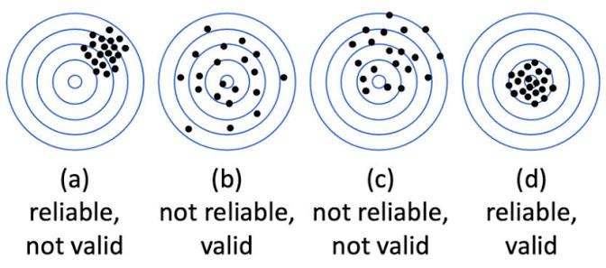

## Today's Agenda {background-image="./Images/background-scales_justice_v3.png" .center}

```{r}
# background-size="1920px 1080px"
library(tidyverse)
library(readxl)

library(sf)
library(rnaturalearth)
library(rnaturalearthdata)
library(countrycode)

# Input the data
d <- read_excel("../../../../00-DATA_Teaching/CIRIGHTS/version2024/cirights_v3.12.10.24.xlsx", na = "NA")
```

<br>

**Section 2: How effective have international institutions been in reducing the use of torture by governments around the world?**

- Defining and Measuring the Outcome: The CIRIGHTS measures of torture 

<br>

::: r-stack
Justin Leinaweaver (Fall 2026)
:::

::: notes

**Prep for Class**

1. Review Canvas submissions

2. Open the data in a spreadsheet or RStudio for the data exploration at end of class

<br>

Section 2 of our class aims to answer this important question:

- How effective have international institutions been in reducing the use of torture by governments around the world?

- This week we are focusing our work on defining and measuring the outcome variable, the use of torture by governments

<br>

**SLIDE**: Evaluating a measure requires drawing on skills you've been learning in our major's methodology track

:::


## Evaluating a Measure {background-image="./Images/background-scales_justice_v3.png" .center}



::: notes

The root of all scientific understanding is an effort to test theories with empirical data

- Converting real world phenomena into measurements is one of the hardest and most important steps we must perform

<br>

Reliability and validity are shorthand concepts used to describe how good a job you have done measuring a real world phenomena

<br>

**What makes a measure "valid"?**

- ("Validity is the term used to refer to the extent to which our measures correspond to the concepts they are intended to reflect" (Brians et al 2011, 105).)

<br>

**What makes a measure "reliable"?**

- ("...we are assessing how stable the values" of a measure are (107).)

- Each time we apply our tool to the same case does it produce the same measurement?

<br>

**What's the priority order here? Would you rather have a measure that is valid or reliable?**

- (Validity is the most important quality.)

- (Technically, your measure cannot be valid if it is unreliable, but an invalid measure can be reliable...)

<br>

In short, this is our reminder to think about different sources of error when analyzing a measurement

<br>

**Questions on the concepts?**

<br>

**SLIDE**: Keep our big picture aim in mind

:::


## {background-image="./Images/background-scales_justice_v3.png" .center}

### How effective have international institutions been in reducing the use of torture by governments around the world?

<br>

::: {.fragment}

The CIRIGHTS measure of torture is (NOT) sufficiently valid and reliable for answering our research question

:::

::: notes

Our analysis of the CIRIGHTS data project is not a toy exercise.

- Fundamentally, what we have to figure out is if this data is valid and reliable enough to use to answer our question

<br>

*Split class in half, and give each half the board*

- **REVEAL**

- Group 1 you focus on the affirmative case

    - Why is the CIRIGHTS measure of torture sufficiently valid and reliable for answering our research question?

- Group 2 you focus on the negative case

    - Why is the CIRIGHTS measure of torture NOT sufficiently valid and reliable for answering our research question?

<br>

**Questions?**

- Make sure your reasons are complete sentences and include page citations!

- Go!

<br>

Groups, swap arguments

- Is there anything you want to add to the other group's work?

- Go!

<br>

**SLIDE**: In sum...

<br>

*My Notes*

Primary data source

- The US State Department Country Reports on Human Rights Practices

- Although, note on p1 that they also use AI reports for the "Personal Integrity Rights" scores

<br>

"**Torture** refers to the purposeful inflicting of extreme pain, whether mental or physical, by government officials or by private individuals at the instigation of government officials" (p11).]

- Practiced frequently (0)

- Practiced occasionally (1)

- Not practiced / Unreported (2)

<br>

*FA26 Class Notes*

Strengths

- Specific on how they define types of torture
- Based on action, not words
- Previous years are amended when new instances of torture are reported
- Only 3 levels
- Definition includes mental and physical torture
- Graded on an interval scale rather than counts, based on description
- State-instigated (includes paramilitary; unsanctioned but by state actors)
- Scorers must only use available data from same source (not allowed to factor in personal experience of previous year data; outside info must be vetted)

Weaknesses

- The scope of the State Department's information varies by country
- The living conditions are not considered 
- Visitors / foreign nationals don't count as victims
- Only counts in internationally recognized territory
- Unreported and unpracticed treated the same way
- The scoring category numerical thresholds are arbitrary and aren't scaled to population size
- The verification process is subjective to the scorer
- 50 people to everyone is a wide range for a single category
- Because Amnesty International is used for some of the data


:::


## {background-image="./Images/background-scales_justice_v3.png" .center}

### How effective have international institutions been in reducing the use of torture by governments around the world?

<br>

::: {.fragment}

Cross-national Comparisons: Same Year, Different Countries

- How big a difference would you need to see in the scores between two countries in order to say they use torture differently?

:::

::: notes

Ok, the bottom line question is, where do we end up with the CIRIGHTS measure of torture?

<br>

HOWEVER, the correct answer is NOT represented by either argument on the board!

- ALL measurements have uncertainty, your job is analyze the data to figure out HOW you can use it to answer your question

<br>

First, we need to say how we could use this data for cross-national comparisons

- **REVEAL**

- Same Year, Different Countries

- **How big a difference would you need to see in the scores between two countries in order to say they use torture differently?**

- *DISCUSS*

<br>

**SLIDE**: Longitudinal Comparisons

:::


## {background-image="./Images/background-scales_justice_v3.png" .center}

### How effective have international institutions been in reducing the use of torture by governments around the world?

<br>

Longitudinal Comparisons: Different Years, Same Country

- How big a difference would you need to see in the scores across time within a single country in order to say their use of torture has changed over time?

::: notes

Longitudinal data includes measures for the same individuals but across time

- **SO, how big a difference would you need to see in the scores across time within a single country in order to say their use of torture has changed over time?**

- *DISCUSS*

<br>

**SLIDE**: Put it all together!

:::


## {background-image="./Images/background-scales_justice_v3.png" .center}

### How effective have international institutions been in reducing the use of torture by governments around the world?

<br>

Longitudinal, Cross-national Comparisons: Different Years, Different Countries

- How big a difference would you need to see in the scores across time across different countries in order to say torture is being used differently across the globe and across time?

::: notes

**How could we use the CIRIGHTS torture data to describe the use of torture globally and across time?**

- **How big a difference would you need to see in the scores across time across different countries in order to say torture is being used differently across the globe and across time?**

- *DISCUSS*

<br>

**SLIDE**: Report back on your data analyses!

:::


## {background-image="./Images/background-scales_justice_v3.png" .center}

### How effective have international institutions been in reducing the use of torture by governments around the world?

<br>

Report back your findings from univariate analysis of the CIRIGHTS torture data

::: notes

Report back findings from the data review on Canvas

- What did you find in your univariate analyses? 

- What do we learn about the countries in the world and their use of torture?

- What did you do and what did you find?

<br>

- Current year analyses?

- Across time analyses?

<br>

**SLIDE**: My version - global map, global trends, US trends

<br>

```{r, echo=TRUE}
# Overall
range(d$year)
table(d$Torture)

# Cross-national Comparisons: Same Year, Different Countries
table(d$Torture[d$year == 2022])

# Longitudinal Comparisons: Different Years, Same Country
d |>
  filter(country == "United States of America") |>
  select(country, year, Torture) |>
  print(n = 50)

# Plot it
d |>
  filter(country == "United States of America") |>
  ggplot(aes(x = year, y = Torture)) +
  geom_line(linewidth = .2) +
  geom_point() +
  theme_bw() +
  scale_y_continuous(breaks = 0:2) +
  scale_x_continuous(breaks = seq(1980, 2025, 5))

# Longitudinal, Cross-national Comparisons: Different Years, Different Countries
# addmargins(table(d$year, d$Torture))

# Counts and Proportions
d |>
  group_by(year) |>
  summarize(
    Torture0 = sum(Torture == 0, na.rm = TRUE),
    Torture1 = sum(Torture == 1, na.rm = TRUE),
    Torture2 = sum(Torture == 2, na.rm = TRUE),
    Total = Torture0 + Torture1 + Torture2,
    Torture0_pct = Torture0 / Total,
    Torture1_pct = Torture1 / Total,
    Torture2_pct = Torture2 / Total,
  ) |>
  print(n = 50)
```

:::


## {background-image="./Images/background-scales_justice_v3.png"}

```{r, fig.align='center', fig.height=6}
# Global map (2022)
world <- ne_countries(scale = "medium", returnclass = "sf")
d2 <- d |> filter(year == 2022)

# countrycode::guess_field(world$adm0_a3)
# world$extra_code <- countrycode::countrycode(sourcevar = world$adm0_a3, origin = "iso3c", destination = "iso3c")

# countrycode::guess_field(d2$cow)
# countrycode::guess_field(d2$unctry)
# d2$iso3c <- countrycode::countrycode(sourcevar = d2$cow, origin = "cown", destination = "iso3c")
d2$iso3c <- countrycode::countrycode(sourcevar = d2$cow, origin = "cown", destination = "iso3c")

# countrycode::guess_field(d2$unctry)
# d2$iso3c <- countrycode::countrycode(sourcevar = d2$unctry, origin = "iso3n", destination = "iso3c")

d3 <- left_join(world, d2, by = c("adm0_a3" = "iso3c"))

ggplot(data = d3) +
  geom_sf(aes(fill = as.factor(Torture))) +
  labs(fill = "", title = "CIRIGHTS: Torture in 2022", caption = "Source: CIRIGHTS (2024)") +
  scale_fill_manual(values = c("#CC2908", "orange", "#4D70F0"))
```


## {background-image="./Images/background-scales_justice_v3.png"}

```{r, fig.align='center', fig.height=6}
d |>
  group_by(year) |>
  summarize(
    Torture0 = sum(Torture == 0, na.rm = TRUE),
    Torture1 = sum(Torture == 1, na.rm = TRUE),
    Torture2 = sum(Torture == 2, na.rm = TRUE)
  ) |>
  pivot_longer(cols = Torture0:Torture2, names_to = "Levels", values_to = "Count") |>
  ggplot(aes(x = year, y = Count, fill = Levels)) +
  geom_col() +
  scale_fill_manual(values = c("#CC2908", "orange", "#4D70F0")) +
  labs(x = "", y = "Country Count", title = "Global Trends in Torture (CIRIGHTS)", fill = "", caption = "Source: CIRIGHTS (2024)") +
  theme_bw()
  

```


## {background-image="./Images/background-scales_justice_v3.png"}

```{r, fig.align='center', fig.height=6}
d |>
  filter(country == "United States of America") |>
  ggplot(aes(x = year, y = Torture)) +
  annotate("rect", xmin = 1980, xmax = 2022, ymin = 1.34, ymax = 2, fill = "#4D70F0", color = "white", alpha=.4) +
  annotate("rect", xmin = 1980, xmax = 2022, ymin = .67, ymax = 1.34, fill = "orange", color = "white", alpha=.4) +
  annotate("rect", xmin = 1980, xmax = 2022, ymin = 0, ymax = .67, fill = "#CC2908", color = "white", alpha=.4) +
  geom_line(linewidth = 1) +
  #geom_col() +
  theme_bw() +
  scale_y_continuous(breaks = 0:2) +
  scale_x_continuous(breaks = seq(1980, 2025, 5)) +
  labs(x = "", title = "CIRIGHTS: Torture in the US", caption = "Source: CIRIGHTS (2024)") 

```

::: notes

**SLIDE**: For next class

:::


## For Next Class {background-image="./Images/background-scales_justice_v3.png" .center}

<br>

**Evaluating the V-Dem measures of torture**

- Evaluate the methodology for strengths and weaknesses

- Find us something interesting in the data

::: notes

Next class we shift to a second data project's attempts to measure torture around the world

<br>

Canvas ASSIGNMENT: Evaluating the V-Dem measures of torture

Do the background readings on V-Dem and spend some time exploring the data provided by the research team

1. What are AT LEAST THREE strengths of this measure of torture? Ideally, your evaluations should be rooted in the validity and reliability of the measures.
2. What are AT LEAST THREE weaknesses of this measure of torture? Ideally, your evaluations should be rooted in the validity and reliability of the measures.
3. Did any country's scores surprise you as you scrolled through the data (for good or ill)? Give us something you noticed from the data that's worth discussing in class.


:::
