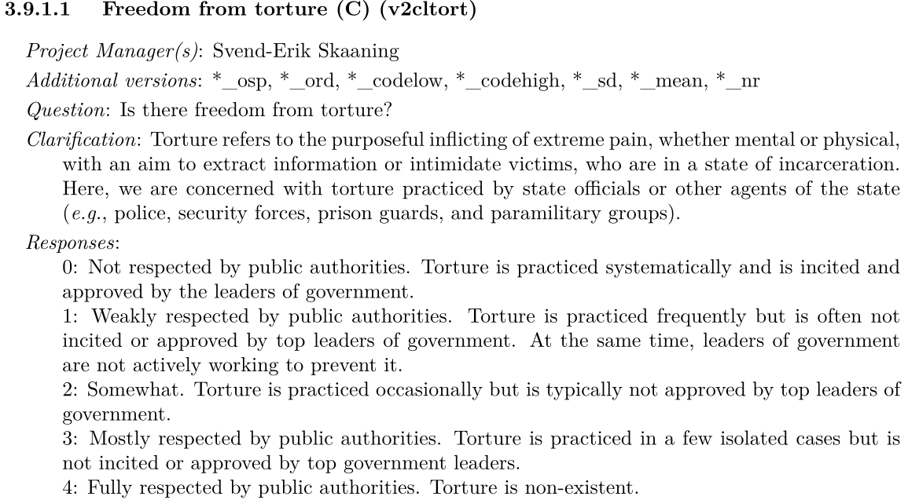
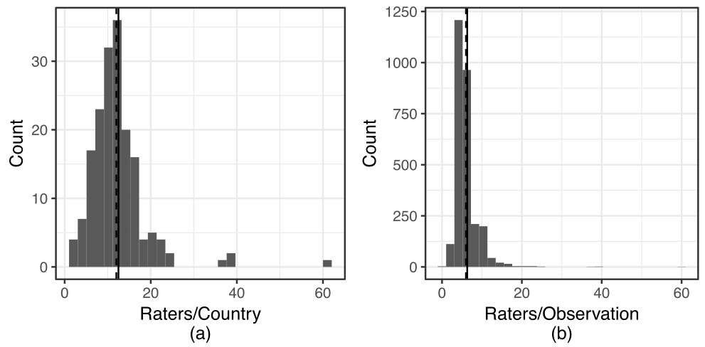
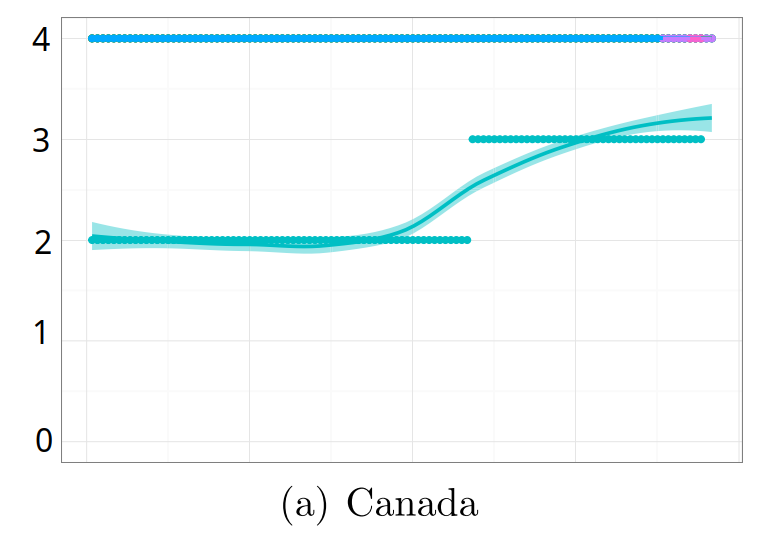
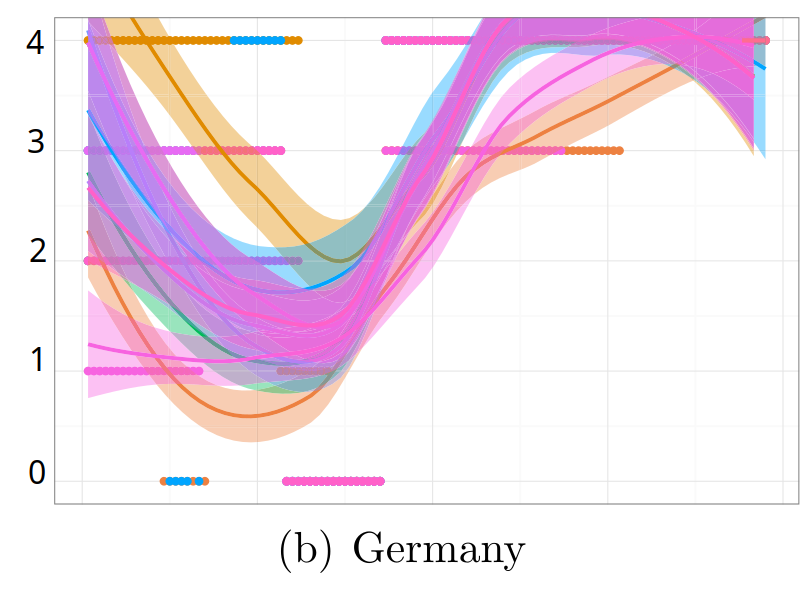
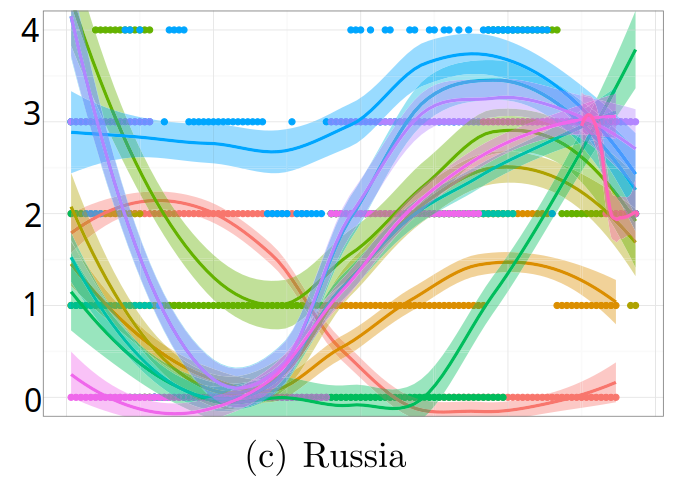

## Today's Agenda {background-image="./Images/background-scales_justice_v3.png" .center}

```{r}
# background-size="1920px 1080px"
library(tidyverse)
library(readxl)
library(kableExtra)

library(sf)
library(rnaturalearth)
library(rnaturalearthdata)
library(countrycode)

# Input V-Dem
d <- read_excel("../../Data/DATA-VDem16-Torture_and_Killing-1789-2025.xlsx", na = "NA")

# Input old V-Dem for adding context to the Marqardt figures
d2 <- read_excel("../../../../00-DATA_Teaching/V-Dem_Institute/Version-15/V_Dem_Personal_Integrity_Rights-1789-2024.xlsx", na = "NA")
```

<br>

**Section 2: How effective have international institutions been in reducing the use of torture by governments around the world?**

- Defining and Measuring the Outcome: The V-Dem measures of torture 

<br>

::: r-stack
Justin Leinaweaver (Fall 2026)
:::

::: notes

**Prep for Class**

1. Review Canvas submissions

2. Open the data in a spreadsheet or RStudio for the data exploration at end of class

<br>

Let's always keep in mind, our big picture aim for this week is to answer an important research question:

- How effective have international institutions been in reducing the use of torture by governments around the world?

<br>

This week we are setting the table for this question by:

- Discussing the importance of the problem on the world stage, and

- Evaluating competing measures of the use of torture by governments around the world and across time

<br>

**SLIDE**: Last class we explored the CIRIGHTS data project

:::


## {background-image="Images/background-scales_justice_v3.png" .center}

{style="display: block; margin: 0 auto"}

<br>

"**Torture** refers to the purposeful inflicting of extreme pain, whether mental or physical, by government officials or by private individuals at the instigation of government officials" (p11).

::: notes

**From our work last class, what concerns do you have about the validity of the torture measure produced by CIRIGHTS?**

- *"Validity is the term used to refer to the extent to which our measures correspond to the concepts they are intended to reflect" (Brians et al 2011, 105).*

<br>

**From our work last class, what concerns do you have about the reliability of the torture measure produced by CIRIGHTS?**

- *"...we are assessing how stable the values" of a measure are (107).*

<br>

Bottom line on CIRIGHTS:

1. **Are we comfortable using the CIRIGHTS data for cross-national analyses? (e.g. same year, different countries)**

2. **Are we comfortable using the CIRIGHTS data for longitudinal analyses? (e.g. different year, same country)**

3. **Are we comfortable using the CIRIGHTS data for cross-national, longitudinal analyses? (e.g. different years, different countries)**

<br>

**SLIDE**: Today we move to the V-Dem project

:::


## {background-image="./Images/background-scales_justice_v3.png" .center}

### How effective have international institutions been in reducing the use of torture by governments around the world?

<br>

The V-Dem measure of torture is (NOT) sufficiently valid and reliable for answering our research question

::: notes

*Split class in half, and give each half the board*

- Group 1 you focus on the affirmative case

    - Why is the V-Dem measure of torture sufficiently valid and reliable for answering our research question?

- Group 2 you focus on the negative case

    - Why is the V-Dem measure of torture NOT sufficiently valid and reliable for answering our research question?

<br>

**Questions?**

- Make sure your reasons are complete sentences and include page citations!

- Go!

<br>

Groups, swap arguments

- Is there anything you want to add to the other group's work?

- Go!

<br>

**SLIDE**: Let's now talk about how V-Dem does post-measurement data processing!

<br>

*My Notes*

- Two versions of the variable: Freedom from torture

1. v2cltort

    - V-Dem measurement model estimates (recommended for regression analysis)

    - FAQ: "More precisely, the output of the measurement model is an interval-level point estimate of the latent trait that typically varies from –5 to 5, and its associated measurement error. These estimates are the best for use in statistical analysis."
    
2. v2cltort_ord

    - Most likely ordinal value of model estimates on the original scale (recommended for substantive interpretation of graphs and data)
    
<br>



<br>

- Civil Liberties coding advice: "The following questions are focused on actual practices (de facto) rather than formal legal or constitutional rights (de jure). Note that if there is significant variation in the respect for a particular civil liberty across the territory, the score should reflect the "average situation" across the territorial scope of the country unit (for each period) as defined in the coder instructions" (p176).


    

:::


## {background-image="Images/background-scales_justice_v3.png" .center}

::: {.r-fit-text}
**Every Country-Year is Coded by Multiple Experts**
:::



::: notes

The team behind V-Dem has published a bunch of research on their methods.

- I'll pull some highlights from a 2018 article in Political Analysis to give you the intuition behind their work.

- Marquardt & Pemstein (2018). IRT Models for Expert-Coded Panel Data. Political Analysis, 26(4), 431–456. 

<br>

Step 1 of their process is to get multiple country experts to use the instruments for a single country-year

<br>

Here I'm showing you histograms on the number of experts per country-year and the number of experts per observation in the dataset.

- The project's goal is a minimum of five experts per country

- Panel (a) shows
    - The average is 12 experts/country
    - Only 27 countries had fewer than the target

- Panel (b) shows the number of expert ratings per variable
    - Average is 6
    - Each expert is allowed to skip measurements they don't feel confident in rating

<br>

**Everybody understand these histograms?**

- **Per the methodology document on the V-Dem website, why do they use experts for this work?**

- ("We use experts because many key features of democracy are not directly observable. For example, it is easy to observe whether or not a legislature has the legal right to investigate an executive. However, assessing the extent to which the legislature actually does so requires evaluation by experts with extensive conceptual and case knowledge.")

<br>

**What does that imply for the reliability of the data they produce?**

<br>

**SLIDE**: Their next challenge is to combine all these ratings to produce a single score

:::


## {background-image="Images/background-scales_justice_v3.png" .center}

::: {.r-fit-text}
**What do we do when the experts disagree?**
:::

:::: {.columns}
::: {.column width="50%"}

:::

::: {.column width="50%"}
```{r}
# d_full |>
#   filter(country_text_id == "CAN", year >= 1900) |>
#   select(country_name, year, v2clkill:v2clkill_nr) |>
#   View()

# Canada data transformed model results back onto five point scale with 70% CI
d2 |>
  filter(country_text_id == "CAN", year %in% c(2015, 2005, 1995, 1985, 1975, 1965, 1955, 1945, 1935, 1925, 1915, 1905)) |>
  select(year, v2clkill_nr, v2clkill_ord_codelow, v2clkill_ord, v2clkill_ord_codehigh) |>
  kbl(align = 'c') %>%
  kable_styling(bootstrap_options = c("striped", "hover", "condensed", "responsive"), font_size = 16)
```
:::
::::

::: notes

Let's use Canada as an example of the challenge facing the researchers.

- *NOTE: You remade all y axis labels to match the data*

<br>

On the left is a line plot of different coder ratings for the "Freedom from political killings" variable from 1900 to 2015.

- The y-axis is the four point scale for "Freedom from political killings"
    - Note they've take the 0-4 scale and made it 1-5 here

- The x-axis is time in years

<br>

On the right is our tabular data with snapshots every ten years since 1905

- This shows the number of experts who coded this variable in that year, the consensus result and a 70% confidence interval

<br>

In essence, the second step of the process is when all the expert ratings are fed into a model that uses the logic of Item Response Theory (IRT) to identify a consensus value (with CIs)

- Essentially, IRT is an attempt to use observed outcomes to learn something about the underlying dynamics that produced them

- In other words, V-Dem assumes each expert's coding tells us something about the natural world and combining them together gets us a better estimate of it.

<br>

**What do we notice here? Talk to me about the expert ratings of Canada.**

- Almost total consensus on top score with one outlier consistently rating across time

- The one outlier doesn't move the final rating or the CI

- The researchers note that this outlier speaks to the reliability, or lack thereof, of the experts they recruit

<br>

**SLIDE**: Let's look at another case!

:::


## {background-image="Images/background-scales_justice_v3.png" .center}

::: {.r-fit-text}
**What do we do when the experts disagree?**
:::

:::: {.columns}
::: {.column width="50%"}

:::

::: {.column width="50%"}
```{r}
# d_full |>
#   filter(country_text_id == "CAN", year >= 1900) |>
#   select(country_name, year, v2clkill:v2clkill_nr) |>
#   View()

# Canada data transformed model results back onto five point scale with 70% CI
d2 |>
  filter(country_text_id == "DEU", year %in% c(2015, 2005, 1995, 1985, 1975, 1965, 1955, 1945, 1935, 1925, 1915, 1905)) |>
  select(year, v2clkill_nr, v2clkill_ord_codelow, v2clkill_ord, v2clkill_ord_codehigh) |>
  kbl(align = 'c') %>%
  kable_styling(bootstrap_options = c("striped", "hover", "condensed", "responsive"), font_size = 16)
```
:::
::::

::: notes

Again, remember you have to add '1' to the scores in the table to match their line plot.

**What do we notice here? Talk to me about the expert ratings of Germany.**

- Compellingly, while the coders differ the trends they identify are very consistent

    - Things get worse during the world wars and improve afterwards

<br>

**Per the FAQ on the V-Dem website, why do the researchers believe their instruments and approach helps minimize the role of expert bias in messing up the scores?**

- (1. Experts are asked to code specific, low-level concepts not high level aggregates)

- (2. Instruments are designed with specific levels for coding)

- (3. The V-Dem Measurement Model (MM) already tries to adapt for experts to vary in terms of whether they tend to swing high or low vs others)

- (4. Experts are trained and practice on hypothetical cases which helps tweak the model)

- (5. Over time each expert leaves a tack record that can be evaluated and compared to others for future model tweaks)

<br>

Certainly doesn't end the problem but they are working on it!

<br>

**Questions on this?**

<br>

**SLIDE**: Let's look at a tougher case!

:::


## {background-image="Images/background-scales_justice_v3.png" .center}

::: {.r-fit-text}
**What do we do when the experts disagree?**
:::

:::: {.columns}
::: {.column width="50%"}

:::

::: {.column width="50%"}
```{r}
# d_full |>
#   filter(country_text_id == "CAN", year >= 1900) |>
#   select(country_name, year, v2clkill:v2clkill_nr) |>
#   View()

# Canada data transformed model results back onto five point scale with 70% CI
d2 |>
  filter(country_text_id == "RUS", year %in% c(2015, 2005, 1995, 1985, 1975, 1965, 1955, 1945, 1935, 1925, 1915, 1905)) |>
  select(year, v2clkill_nr, v2clkill_ord_codelow, v2clkill_ord, v2clkill_ord_codehigh) |>
  kbl(align = 'c') %>%
  kable_styling(bootstrap_options = c("striped", "hover", "condensed", "responsive"), font_size = 16)
```
:::
::::

::: notes

Russia is a particularly hard case for this variable, "freedom from political killing", but even here there are detectable trends in the data.

**Talk to me about the line plot and the consensus scores in the table. How confident are we in these consensus scores?**

<br>

**Ok, what does this mean for us in terms of validity and reliability of the V-Dem measures?**

1. Be careful using any country-year with small number of coders

2. Definitely consider the CI when interpreting changes in a score

:::


## {background-image="./Images/background-scales_justice_v3.png" .center}

### How effective have international institutions been in reducing the use of torture by governments around the world?

<br>

::: {.fragment}

Cross-national Comparisons: Same Year, Different Countries

- How big a difference would you need to see in the scores between two countries in order to say they use torture differently?

:::

::: notes

Ok, the bottom line question is, where do we end up with the V-Dem measure of torture?

<br>

HOWEVER, the correct answer is NOT represented by either argument on the board!

- ALL measurements have uncertainty, your job is analyze the data to figure out HOW you can use it to answer your question

<br>

First, we need to say how we could use this data for cross-national comparisons

- **REVEAL**

- Same Year, Different Countries

- **How big a difference would you need to see in the scores between two countries in order to say they use torture differently?**

- *DISCUSS*

<br>

**SLIDE**: Longitudinal Comparisons

:::


## {background-image="./Images/background-scales_justice_v3.png" .center}

### How effective have international institutions been in reducing the use of torture by governments around the world?

<br>

Longitudinal Comparisons: Different Years, Same Country

- How big a difference would you need to see in the scores across time within a single country in order to say their use of torture has changed over time?

::: notes

Longitudinal data includes measures for the same individuals but across time

- **SO, how big a difference would you need to see in the scores across time within a single country in order to say their use of torture has changed over time?**

- *DISCUSS*

<br>

**SLIDE**: Put it all together!

:::


## {background-image="./Images/background-scales_justice_v3.png" .center}

### How effective have international institutions been in reducing the use of torture by governments around the world?

<br>

Longitudinal, Cross-national Comparisons: Different Years, Different Countries

- How big a difference would you need to see in the scores across time across different countries in order to say torture is being used differently across the globe and across time?

::: notes

**How could we use the CIRIGHTS torture data to describe the use of torture globally and across time?**

- **How big a difference would you need to see in the scores across time across different countries in order to say torture is being used differently across the globe and across time?**

- *DISCUSS*

<br>

**SLIDE**: Report back on your data analyses!

:::


## {background-image="./Images/background-scales_justice_v3.png" .center}

### How effective have international institutions been in reducing the use of torture by governments around the world?

<br>

Report back your findings from univariate analysis of the V-Dem torture data

::: notes

Report back findings from the data review on Canvas

- What did you find in your univariate analyses? 

- What do we learn about the countries in the world and their use of torture?

- What did you do and what did you find?

<br>

- Current year analyses?

- Across time analyses?

<br>

**SLIDE**: My version - global map, global trends, US trends

<br>

```{r, echo=TRUE, eval=TRUE}
# Overall
range(d$year)
summary(d$v2cltort)
table(d$v2cltort_ord)

# Cross-national Comparisons: Same Year, Different Countries
table(d$v2cltort_ord[d$year == 2025])
summary(d$v2cltort[d$year == 2025])

# Longitudinal Comparisons: Different Years, Same Country
d |>
  filter(country_text_id == "USA") |>
  ggplot(aes(x = year, y = v2cltort)) +
  geom_line(linewidth = .2) +
  geom_point() +
  theme_bw() +
  scale_y_continuous(limits = c(-1, 3)) +
  scale_x_continuous(breaks = seq(1780, 2025, 20))

d |>
  filter(country_text_id == "USA") |>
  ggplot(aes(x = year, y = v2cltort_ord)) +
  geom_line(linewidth = .2) +
  geom_point() +
  theme_bw() +
  scale_y_continuous(limits = c(0, 4)) +
  scale_x_continuous(breaks = seq(1780, 2025, 20))


# Longitudinal, Cross-national Comparisons: Different Years, Different Countries
d |>
  filter(country_text_id %in% c("USA", "RUS")) |>
  ggplot(aes(x = year, y = v2cltort_ord, color = country_text_id)) +
  geom_line(linewidth = .2) +
  geom_point() +
  theme_bw() +
  scale_y_continuous(limits = c(0, 4)) +
  scale_x_continuous(breaks = seq(1780, 2025, 20))
```
:::


## {background-image="./Images/background-scales_justice_v3.png"}

```{r, fig.align='center', fig.height=6}
# Global map (2022)
world <- ne_countries(scale = "medium", returnclass = "sf")
d2 <- d |> filter(year == 2022)

# countrycode::guess_field(world$adm0_a3)
# world$extra_code <- countrycode::countrycode(sourcevar = world$adm0_a3, origin = "iso3c", destination = "iso3c")

#countrycode::guess_field(d2$COWcode)
#countrycode::guess_field(d2$unctry)
d2$iso3c <- countrycode::countrycode(sourcevar = d2$COWcode, origin = "cown", destination = "iso3c")

# countrycode::guess_field(d2$unctry)
# d2$iso3c <- countrycode::countrycode(sourcevar = d2$unctry, origin = "iso3n", destination = "iso3c")

d3 <- left_join(world, d2, by = c("adm0_a3" = "iso3c"))

ggplot(data = d3) +
  geom_sf(aes(fill = as.factor(v2cltort_ord))) +
  labs(fill = "", title = "V-Dem: Freedom from Torture in 2022", caption = "Source: V-Dem (2026)") +
  scale_fill_manual(values = c("#CC2908", "#F788B3", "orange", "#88E3F7", "#4D70F0"))

# 0 Not respected by public authorities
# 1 Weakly respected by public authorities.
# 2 Somewhat.
# 3 Mostly respected by public authorities.
# 4 Fully respected by public authorities
```


## {background-image="./Images/background-scales_justice_v3.png"}

```{r, fig.align='center', fig.height=6}
# Global map (2025)
world <- ne_countries(scale = "medium", returnclass = "sf")
d2 <- d |> filter(year == 2025)

# countrycode::guess_field(world$adm0_a3)
# world$extra_code <- countrycode::countrycode(sourcevar = world$adm0_a3, origin = "iso3c", destination = "iso3c")

#countrycode::guess_field(d2$COWcode)
#countrycode::guess_field(d2$unctry)
d2$iso3c <- countrycode::countrycode(sourcevar = d2$COWcode, origin = "cown", destination = "iso3c")

# countrycode::guess_field(d2$unctry)
# d2$iso3c <- countrycode::countrycode(sourcevar = d2$unctry, origin = "iso3n", destination = "iso3c")

d3 <- left_join(world, d2, by = c("adm0_a3" = "iso3c"))

ggplot(data = d3) +
  geom_sf(aes(fill = as.factor(v2cltort_ord))) +
  labs(fill = "", title = "V-Dem: Freedom from Torture in 2025", caption = "Source: V-Dem (2026)") +
  scale_fill_manual(values = c("#CC2908", "#F788B3", "orange", "#88E3F7", "#4D70F0"))

# 0 Not respected by public authorities
# 1 Weakly respected by public authorities.
# 2 Somewhat.
# 3 Mostly respected by public authorities.
# 4 Fully respected by public authorities
```


## {background-image="./Images/background-scales_justice_v3.png"}

```{r, fig.align='center', fig.height=6}
d |>
  group_by(year) |>
  summarize(
    Torture0 = sum(v2cltort_ord == 0, na.rm = TRUE),
    Torture1 = sum(v2cltort_ord == 1, na.rm = TRUE),
    Torture2 = sum(v2cltort_ord == 2, na.rm = TRUE),
    Torture3 = sum(v2cltort_ord == 3, na.rm = TRUE),
    Torture4 = sum(v2cltort_ord == 4, na.rm = TRUE)
  ) |>
  pivot_longer(cols = Torture0:Torture4, names_to = "Levels", values_to = "Count") |>
  ggplot(aes(x = year, y = Count, fill = Levels)) +
  geom_col() +
  scale_fill_manual(values = c("#CC2908", "#F788B3", "orange", "#88E3F7", "#4D70F0")) +
  labs(x = "", y = "Country Count", title = "Global Trends in Torture (V-Dem)", fill = "", caption = "Source: V-Dem (2026)") +
  theme_bw()
```


## {background-image="./Images/background-scales_justice_v3.png"}

```{r, fig.align='center', fig.height=6}
d |>
  filter(country_name == "United States of America") |>
  ggplot(aes(x = year, y = v2cltort_ord)) +
  annotate("rect", xmin = 1780, xmax = 2025, ymin = 0, ymax = .8, fill = "#CC2908", alpha=.4) +
  annotate("rect", xmin = 1780, xmax = 2025, ymin = .8, ymax = 1.6, fill = "#F788B3", alpha=.4) +
  annotate("rect", xmin = 1780, xmax = 2025, ymin = 1.6, ymax = 2.4, fill = "orange", alpha=.4) +
  annotate("rect", xmin = 1780, xmax = 2025, ymin = 2.4, ymax = 3.2, fill = "#88E3F7", alpha=.4) +
  annotate("rect", xmin = 1780, xmax = 2025, ymin = 3.2, ymax = 4, fill = "#4D70F0", alpha=.4) +
  geom_line(linewidth = 1) +
  theme_bw() +
  scale_y_continuous(limits = c(0,4), breaks = 0:4) +
  #scale_x_continuous(breaks = seq(1980, 2025, 5)) +
  labs(x = "", title = "V-Dem: Torture in the US", caption = "Source: V-Dem (2026)") 
```

::: notes

**SLIDE**: For next class

:::


## The Convention Against Torture (CAT) {background-image="./Images/background-scales_justice_v3.png" .center}

{style="display: block; margin: 0 auto"}

::: notes

Next week we dive into the Convention Against Torture!

<br>

To get ready, I'm asking you to read and begin to evaluate the CAT

<br>

Canvas Assignment: Summarizing the Convention Against Torture

1. Classify the Convention Against Torture using the legalization concepts (obligation, precision and delegation). Be sure to cite specific parts of the treaty to support your classifications.

2. Classify the Convention Against Torture using the dependent variables from the rational design article. Be sure to cite specific parts of the treaty to support your classifications.

- Membership rules (MEMBERSHIP)
- Scope of issues covered (SCOPE)
- Centralization of tasks (CENTRALIZATION )
- Rules for controlling the institution (CONTROL)
- Flexibility of arrangements (FLEXIBILITY)

:::
