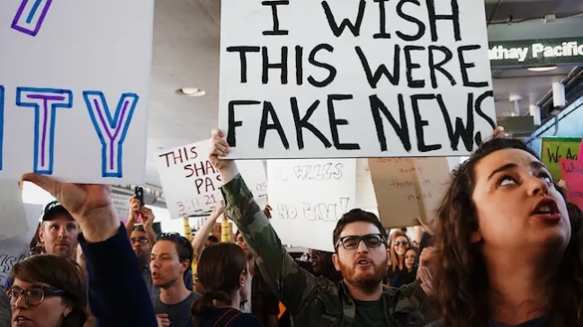
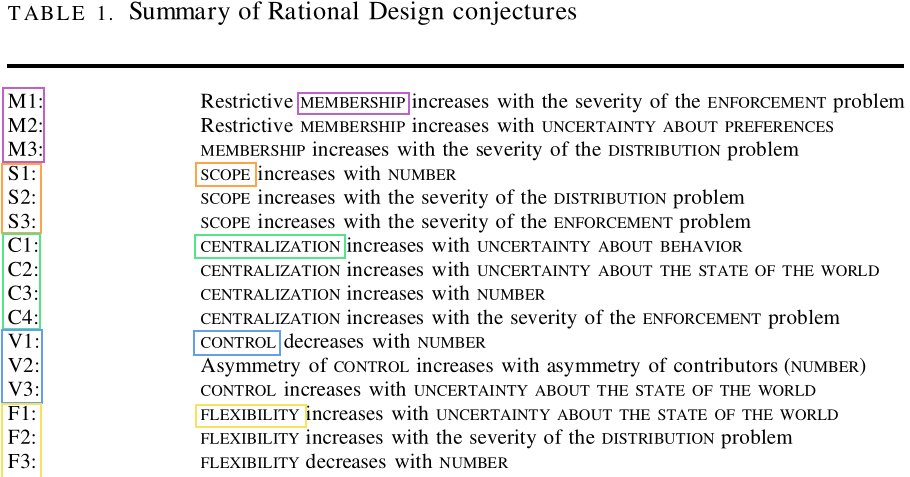

## Today's Agenda {background-image="./Images/background-scales_justice_v3.png" .center}

```{r}
# background-size="1920px 1080px"
library(tidyverse)
library(readxl)
```

<br>

**Section 2: How effective have international institutions been in reducing the use of torture by governments around the world?**

- The Convention Against Torture (CAT)

- Parts 1 and 2

<br>

::: r-stack
Justin Leinaweaver (Fall 2026)
:::

::: notes

**Prep for Class**

1. Review Canvas submissions

2. SAVE treaty analysis notes from board: CODING-The_Convention_Against_Torture.txt

<br>

Section 2 of our class focuses on this big RQ

- How effective have international institutions been in reducing the use of torture by governments around the world?

<br>

The key to any research project is to begin by focusing on the outcome variable of interest

- e.g. the dependent variable

- Until you have a clear idea of what you are trying to explain, you can't actually do productive work to explain it.

<br>

**SIDE**: So, last week we started with current events

<br>

**References**

- [UNTC Page for ratifications and reservations](https://treaties.un.org/Pages/ViewDetails.aspx?src=IND&mtdsg_no=IV-9&chapter=4&clang=_en)

- [Treaty Text](https://www.ohchr.org/en/instruments-mechanisms/instruments/convention-against-torture-and-other-cruel-inhuman-or-degrading)

:::


## {background-image="./Images/background-scales_justice_v3.png" .center}

::: {.r-fit-text}
**How is torture impacting current events today?**
:::

{style="display: block; margin: 0 auto"}

::: notes

1. We reviewed the global section of the Amnesty International human rights report for 2026, AND

2. Each of you submitted a recent current event that helps us see the connections between torture and the news

<br>

**Give me some examples from either your cases or the AI report of how torture is impacting current events around the world**

- *Share a few examples and move on!*

<br>

From there we shifted our focus to measurement

- I'm confident we all have a sense for what we mean by the concept of "torture"

- BUT until you try to actually measure a thing, you don't really understand the complexity of it

<br>

**SLIDE**: We then spent time digging into two academic research projects focused on measuring torture

:::


## Measuring Torture {background-image="./Images/background-scales_justice_v3.png"}

{.absolute width="550" left=50}

{.absolute width="550" right=50 bottom=0}


:::: notes

Without getting too into the weeds here:

1. **Any BIG concerns with the validity or reliability of the CIRIGHTS measure of torture?**

2. **Any BIG concerns with the validity or reliability of the V-Dem measure of torture?**

<br>

**Ok then, what did we find from our univariate analyses?**

- **Based on these datasets, where is torture a serious problem today?**

- **e.g. specific countries, regions, hotspots, etc**

<br>

**Based on these datasets, how has the use of torture been changing across time?**

<br>

**SLIDE**: Ok, put this all together for me

:::


## {background-image="./Images/background-scales_justice_v3.png" .center}

### Why is the use of torture by governments an important problem for the international community to address?

::: notes

**What is the strongest argument we can make that torture is a serious INTERNATIONAL problem?**

- **e.g. a problem requiring an international institution to address**

<br>

**Do we have a good response to someone arguing that torture is a domestic policy choice within the rights of sovereign states to decide upon and that shouldn't involve the international community?**

<br>

Good table setting!

- **SLIDE**: This week we shift our focus to the international institution designed to address torture: The 1984 Convention Against Torture (CAT)

:::


## {background-image="./Images/background-scales_justice_v3.png" .center}

::: {.r-fit-text}
**Analyzing the Design of an International Institution**

<br>

The Convention Against Torture (1984)

- Part 1: The Key Rules

- Part 2: The Committee

- Part 3: Participation

:::

::: notes

The treaty is split into three parts and I have suggested labels for these parts here

- I asked each of you to prepare for class today by analyzing Parts 1 and 2 of the CAT

- That pre-class work should have us ready to dig in!

<br>

*SPLIT class into small groups (3), NEW PARTNERS!*

- Go sit with your group

<br>

**SLIDE**: Summarizing Part 1

:::


## {background-image="./Images/background-scales_justice_v3.png" .center}

**The Convention Against Torture (1984)**

- Part 1: The Key Rules (Art 1-16)

:::: {.columns}
::: {.column width="50%"}


:::

::: {.column width="50%"}


:::
::::

:::: notes

GROUPS: Share your analyses of the treaty and get ready to report back on the obligations, precision and delegation in Part 1

<br>

*ON BOARD: (save space for three parts of treaty)*

- *BUILD and DISCUSS the LIST*

<br>

**Is Article 1's definition of torture an obligation or something else?**

- (It is the precision that makes the rest of Part 1 possible)

- Without the clear definition in 1, all the other article obligations are dramatically reduced

<br>

**Why does the definition include the list of use cases for torture ("for such purposes as...")? Why not just make the definition the first half of sentence 1 alone?**

- (Spit-balling: If you don't narrow it down like this it could be applied to many different situations states aren't focused on here, e.g. cuts to social welfare benefits could cause harm)

<br>

**SLIDE**: Ok, connect these obligations to the KLS mechanisms

:::


## {background-image="./Images/background-scales_justice_v3.png" .center}

**The Convention Against Torture (1984)**

- Part 1: The Key Rules (Art 1-16)

{style="display: block; margin: 0 auto"}

::: notes

**What elements of Part 1 of the treaty are connected to the design mechanisms proposed by KLS?**

- **AND, what do those design choices suggest about the complications the CAT designers faced?**

<br>

**SLIDE**: Part 2

:::


## {background-image="./Images/background-scales_justice_v3.png" .center}

**The Convention Against Torture (CAT) (1984)**

- Part 2: The Committee (Art 17-24)

:::: {.columns}
::: {.column width="50%"}


:::

::: {.column width="5%"}
:::

::: {.column width="45%"}

:::
::::

:::: notes

GROUPS: Share your analyses of the treaty and get ready to report back on the obligations, precision and delegation in Part 2

<br>

*ON BOARD: (save space for three parts of treaty)*

- *BUILD and DISCUSS the LIST*

<br>

**SLIDE**: Shift to KLS (and a deeper discussion of Art 21 and Art 22)

:::


## {background-image="./Images/background-scales_justice_v3.png" .center}

**The Convention Against Torture (CAT) (1984)**

- Part 2: The Committee (Art 17-24)

{style="display: block; margin: 0 auto"}

::: notes

**What elements of Part 2 of the treaty are connected to the design mechanisms proposed by KLS?**

- **AND, what do those design choices suggest about the complications the CAT designers faced?**

<br>

*Make sure to discuss Art 21 and Art 22 which are held up by Hathaway (2007) as important enough to be a separate DV from simple CAT ratification!*

<br>

Talk to me about Article 21

- **What does this article do to the treaty and why is it included?**

- (Art 21: Do you accept oversight by states?)

<br>

**What does Article 22 do? Have we seen anything like this in other treaties so far?**

- **Per KLS, why is this included?**

- (Art 22: Do you accept oversight by individuals?)

- Both of those open you to oversight and negotiation with other states BUT Art 22 threatens to open you to something very different: It empowers non-state actors to make serious claims on your behavior!

<br>

**SLIDE**: In sum and predictions

:::


## {background-image="./Images/background-scales_justice_v3.png" .center}

**The Convention Against Torture (CAT) (1984)**

- Part 1: The Key Rules (Art 1-16)
- Part 2: The Committee (Art 17-24)

:::: {.columns}
::: {.column width="50%"}
**Legalization**

- Obligation

- Precision

- Delegation (dispute resolution)

- Delegation (rule making / implementation)
:::

::: {.column width="50%"}
**KLS Design Mechanisms**

1. Membership rules

2. Scope of issues

3. Centralization of tasks

4. Rules for control

5. Flexibility of arrangements
:::
::::

::: notes

**Ok, big picture, is the CAT soft or hard law?**

<br>

**How did we do with out predictions last Monday?**

- **What did you predict?**

- **What did you miss?**

- **e.g. any surprises?**

<br>

**SLIDE**: For next class

:::


## For Next Class {background-image="./Images/background-scales_justice_v3.png" .center}

<br>

::: {.r-fit-text}

**Reviewing Part 3 of the CAT**

- Legalization, KLS and the impacts of reservations

:::
::: notes


<br>

Canvas ASSIGNMENT: Reviewing Part 3 of the CAT

1. Read Part 3 of the CAT (Art 25-33): How does Part 3 impact your application of the legalization dimensions to the CAT (1. obligation, 2. precision, 3. delegation (settling disputes), 4. delegation (rule making and implementation))? Be sure to cite specific parts of the treaty to support your classifications.

2. Review the reservations submitted by states when binding themselves to the CAT: Which countries included reservations when joining the CAT that you believe should not have been accepted by the other parties? Flag for us the most egregious examples and explain why you believe each is problematic.

:::


