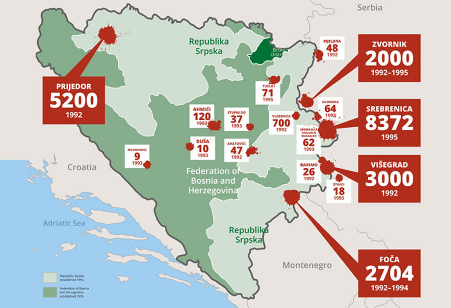
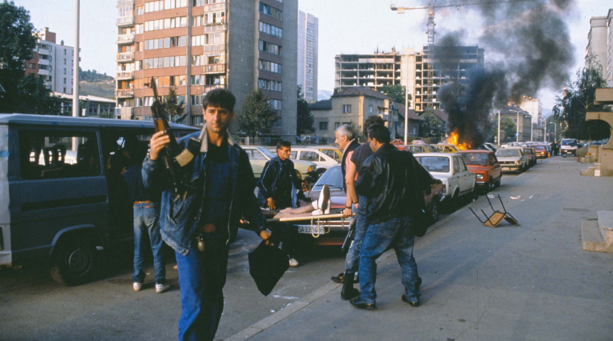
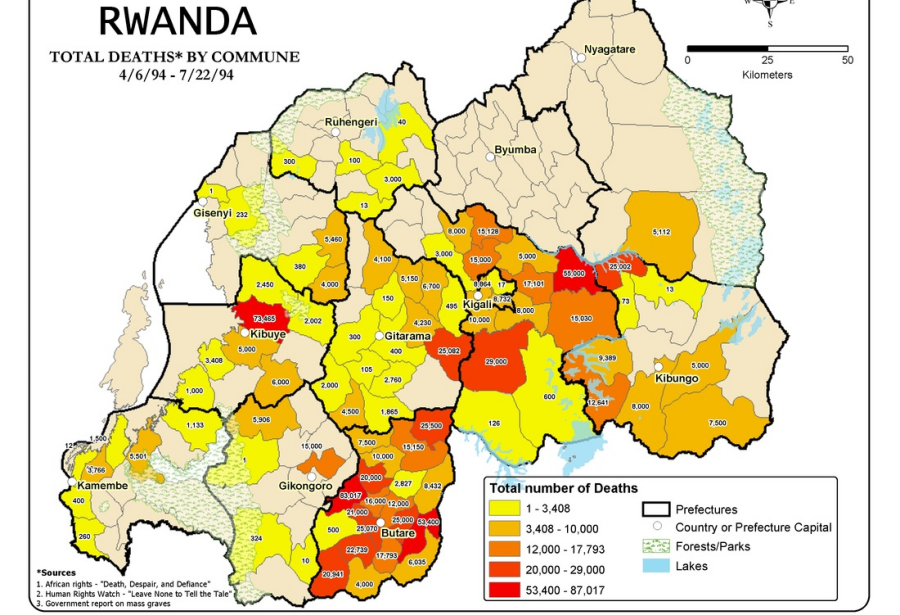
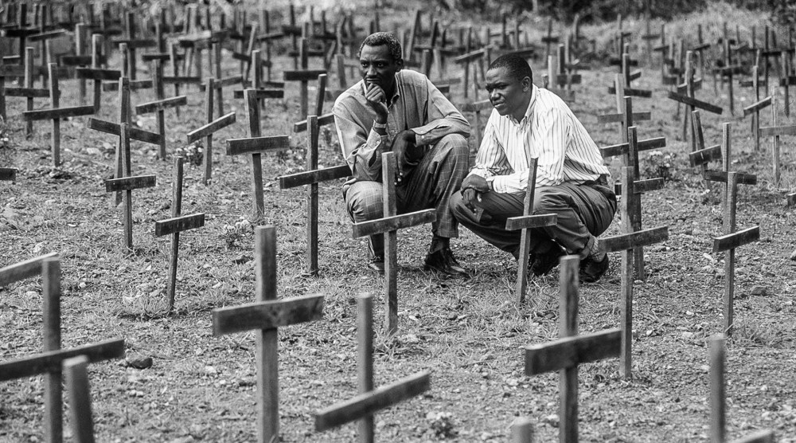
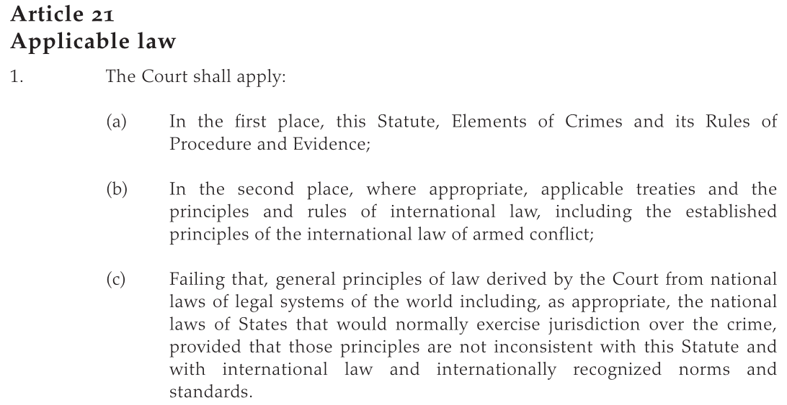
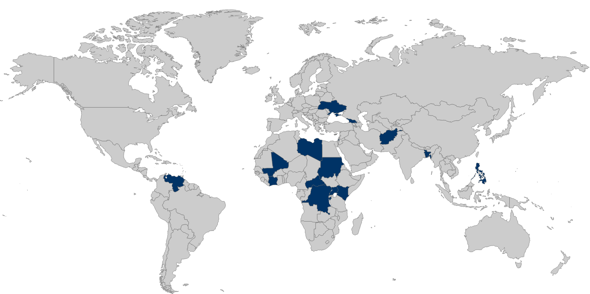
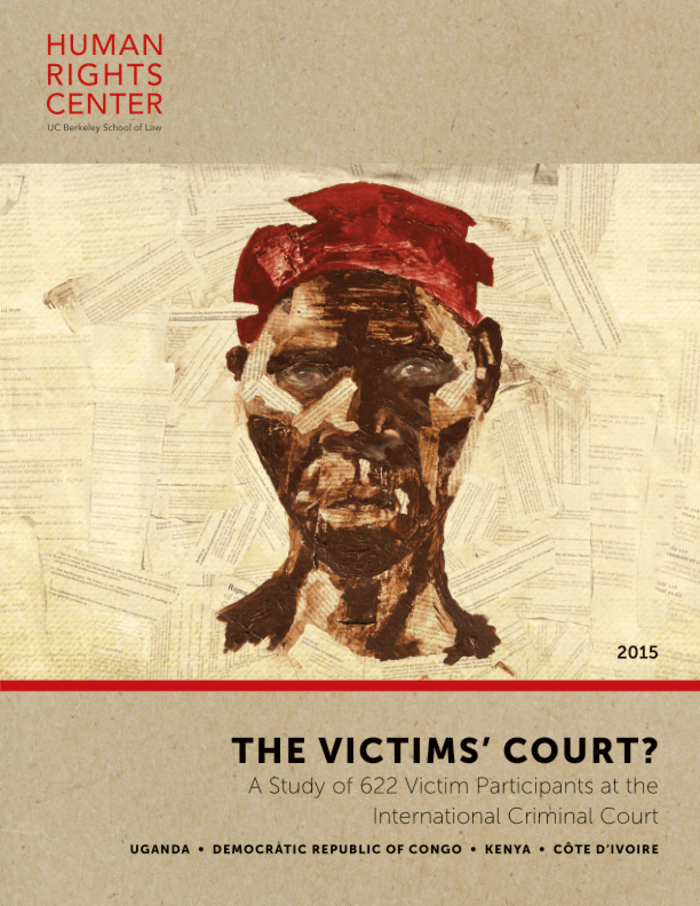

---
output:
  xaringan::moon_reader:
    css: ["default", "extra.css"]
    lib_dir: libs
    seal: false
    nature:
      highlightStyle: github
      highlightLines: true
      countIncrementalSlides: false
      ratio: '16:9'
---

```{r, echo = FALSE, warning = FALSE, message = FALSE}
library(tidyverse)
#library(readxl)
#library(stargazer)
#library(kableExtra)
#library(modelr)

knitr::opts_chunk$set(echo = FALSE,
                      eval = TRUE,
                      error = FALSE,
                      message = FALSE,
                      warning = FALSE,
                      comment = NA)
```

background-image: url('libs/Images/background-scales_justice_v3.png')
background-size: 105%
background-position: top
class: middle

.size45[**II. International Institutions for Mutual Restraint**]

<br>

.size50[**Today's Agenda: Design Analysis**

- The International Criminal Court (ICC) and the Rome Statute (1998)
]

<br>

.center[.size40[
  Justin Leinaweaver (Fall 2023)
]]

???

### Prep for Class
1. Check Canvas submissions

2. Open the treaty AND the reading for today "Understanding the International Criminal Court"

<br>

[UNTC Page](https://treaties.un.org/Pages/ViewDetails.aspx?src=IND&mtdsg_no=XVIII-10&chapter=18&clang=_en)

[Treaty Text](https://www.icc-cpi.int/sites/default/files/RS-Eng.pdf)

[Understanding the ICC](https://www.icc-cpi.int/sites/default/files/Publications/understanding-the-icc.pdf)


---

background-image: url('libs/Images/07_2-ICC.webp')
background-size: 100%
background-position: center
class: top

.center[.size40[.content-box-purple[**International Institutions for Mutual Restraint**]]]

???

Today we continue our exploration of international institutions designed for mutual restraint by digging into the design of the International Criminal Court (ICC) 

- We'll use the reading to cover the broad strokes of how the court works, 

- we'll use your cases to illustrate it in action, and then 

- we'll dig into the design of the Rome Statute itself.


---

background-image: url('libs/Images/07_2-ICC.webp')
background-size: 100%
background-position: center
class: top, left

.right-column[
.size30[
.content-box-white[
**Rome Statute of the International Criminal Court (1998)**

**Article 1: The Court**

An International Criminal Court (‘the Court’) is hereby established. It shall be a permanent institution and shall have the power to exercise its jurisdiction over persons for the most serious crimes of international concern, as referred to in this Statute, and shall be complementary to national criminal jurisdictions. The jurisdiction and functioning of the Court shall be governed by the provisions of this Statute.
]]]

???

Let's start in big picture terms with Article 1 of the treaty.

- We'll use this as a jumping off point for discussing the Court primarily as it is discussed in the first three sections of the reading

- "The ICC at a glance", "The structure of the ICC" and "Crimes within the jurisdiction of the ICC"

<br>

This article contains a ton of important detail about the need for and the design of the court.


---

background-image: url('libs/Images/07_2-ICC.webp')
background-size: 100%
background-position: center
class: top, left

.right-column[
.size30[
.content-box-white[
**Rome Statute of the International Criminal Court (1998)**

**Article 1: The Court**

An International Criminal Court (‘the Court’) is hereby established. It shall be a .textblue[**permanent institution**] and shall have the power to exercise its jurisdiction over persons for the most serious crimes of international concern, as referred to in this Statute, and shall be complementary to national criminal jurisdictions. The jurisdiction and functioning of the Court shall be governed by the provisions of this Statute.
]]]

???

### Why does Article 1 invoke the language of a "permanent institution"?

### - Why was this needed?

- (**SLIDE**)


---

background-image: url('libs/Images/background-blue_cubes_lighter3.png')
background-size: 100%
background-position: center

.pull-left[
```{r, echo = FALSE, fig.align = 'center', out.width = '90%'}

```

```{r, echo = FALSE, fig.align = 'center', out.width = '100%'}

```
]

.pull-right[
```{r, echo = FALSE, fig.align = 'center', out.width = '90%'}

```

```{r, echo = FALSE, fig.align = 'center', out.width = '100%'}

```
]

???

In the modern era, but before the ICC, the world was confronted with two atrocities that inspired outrage similar to that following WWII.

- In both Yugoslavia and Rwanda in the early 1990s: Genocide, war crimes and crimes against humanity

<br>

The problem was that no one at the international level had the clear authority to do anything about either case

- Both were domestic actions happening within a single state's sovereign borders

<br>

The UN Security Council, which is charged with maintaining international peace and order, eventually created ad hoc tribunals to investigate and punish criminal acts in each case

- SC resolution 827 in 1993 created the International Criminal Tribunal for the former Yugolsavia (ICTY)

- SC resolution 955 in 1994 created the International Criminal Tribunal for Rwanda (ICTR).

<br>

The creation of these tribunals, especially ICTY, led to considerable international criticism.

### BRAINSTORM: Why might a state, an NGO or an IO have a problem with this ad hoc approach by the SC?

1. (**Inconsistency**) 
    - Not every atrocity gets its own tribunal. 
    - If justice is inconsistent then it is less likely to influence the calculations of "bad" leaders
    
2. (**Selective justice**)
    - Aren't these just examples of "justice" by the victors?
    - Powerful states disagree with some actions by weaker states so they are punished as "crimes"

3. (**Distraction**)
    - Transparent cover for failure by the major powers to stop the crimes themselves

4. (**Lack legitimacy**)
    - What right does the SC have to create international courts? None specified in Charter.


---

background-image: url('libs/Images/07_2-ICC.webp')
background-size: 100%
background-position: center
class: top, left

.right-column[
.size30[
.content-box-white[
**Rome Statute of the International Criminal Court (1998)**

**Article 1: The Court**

An International Criminal Court (‘the Court’) is hereby established. It shall be a .textblue[**permanent institution**] and shall have the power to exercise its jurisdiction over persons for the most serious crimes of international concern, as referred to in this Statute, and shall be complementary to national criminal jurisdictions. The jurisdiction and functioning of the Court shall be governed by the provisions of this Statute.
]]]

???

The ICC was designed to be a "permanent institution" in order to address these concerns

- The ICC provides a consistency of application, plus

- An equality of protection, plus

- It is rooted in legitimate international authority.

<br>
    
All combined to, hopefully, push leaders to make "better" decisions


---

background-image: url('libs/Images/background-blue_cubes_lighter3.png')
background-size: 100%
background-position: center
class: middle

.center[.size50[.content-box-white[**PA Theory: Why Delegate?**]]]

.size40[
"Delegation is a conditional grant of authority from a principal to an agent that empowers the latter to act on behalf of the former" (Hawkins et al 2006, 4).

- Always governed by a contract

- Limited in time or scope

- Must be revocable

- Roles are mutually constitutive
]

???

### How do we understand the creation of a "permanent institution" using the definition of "delegation" from PA Theory?

### - Doesn't this conflict with the second and third conditions here?

<br>

**Revocable?**
- Since each "principal", e.g. state party to the treaty, has the option to withdraw from the Rome Statute they maintain the "revocable" condition of the relationship.

**Limited?**
- I think you'll see that a number of limitations on both time and scope remain despite the ICC being "permanent".


---

background-image: url('libs/Images/07_2-ICC.webp')
background-size: 100%
background-position: center
class: top, left

.right-column[
.size30[
.content-box-white[
**The Rome Statute (1998)**

**Article 1: The Court**

An International Criminal Court (‘the Court’) is hereby established. It shall be a permanent institution and shall have the power to exercise its .textblue[**jurisdiction over persons**] for the most serious crimes of international concern, as referred to in this Statute, and shall be complementary to national criminal jurisdictions. The jurisdiction and functioning of the Court shall be governed by the provisions of this Statute.
]]]

???

A second important characteristic of the ICC illustrated by Article 1 is its specification of "jurisdiction over persons." 

### Given everything we've studied this semester about international law, why is this a big deal?

<br>

Novel innovation in 20th century international law to directly connect individuals to an international institution.

- Previously an indirect connection; states agree rules between themselves and then implement them domestically to impact individuals.

<br>

Pushes international law in some very intriguing directions

1. Establishes the idea that you, as an individual, are deserving of international protection even if that means limiting the soverign authority of your state

2. Establishes the idea that you, as an individual, are responsible for your actions and the actions of those who report to you.

<br>

Many states, especially the US, have viewed this as a massive threat to their  sovereignty.

- Proposes a set of societal rules and individual rights that are hierarchically superior to your domestic laws, and

- Puts in the heads of your citizens that they must think for themselves BEFORE following your orders

- What leader wants to run a system where you don’t make all the rules and your subordinates don’t have to follow your commands?


---

background-image: url('libs/Images/07_2-ICC.webp')
background-size: 100%
background-position: center
class: top, left

.right-column[
.size30[
.content-box-white[
**The Rome Statute (1998)**

**Article 1: The Court**

An International Criminal Court (‘the Court’) is hereby established. It shall be a permanent institution and shall have the power to exercise its jurisdiction over persons for .textblue[**the most serious crimes of international concern**], as referred to in this Statute, and shall be complementary to national criminal jurisdictions. The jurisdiction and functioning of the Court shall be governed by the provisions of this Statute.
]]]

???

A third important characteristic of the ICC illustrated by Article 1 is its specification of a somewhat limited subject jurisdiction.

### Per the reading, which crimes fall within the jurisdiction of the ICC?
- (a. the crime of genocide; b. crimes against humanity; c. War crimes; d. the crime of aggression)

- Note that this is covered in the treaty itself in Arts 5-8

<br>

We can think of this as another important attempt by the princples to narrow the scope of the new agent.


---

background-image: url('libs/Images/07_2-ICC.webp')
background-size: 100%
background-position: center
class: top, left

.right-column[
.size30[
.content-box-white[
**The Rome Statute (1998)**

**Article 1: The Court**

An International Criminal Court (‘the Court’) is hereby established. It shall be a permanent institution and shall have the power to exercise its jurisdiction over persons for the most serious crimes of international concern, as referred to in this Statute, and shall be .textblue[**complementary to national criminal jurisdictions**]. The jurisdiction and functioning of the Court shall be governed by the provisions of this Statute.
]]]

???

A fourth important characteristic of the ICC illustrated by Article 1 is its requirement that the court be "complementary to national criminal jurisdictions."

### Per the reading, what does this mean?
- (Article 17: National courts have priority over the ICC unless “unwilling or unable genuinely to carry out the investigation or prosecution...”)

<br>

### If you are a state trying to decide whether to joi the ICC, would you be fully comforted by the "complementarity" principal or not?
- (Could be a bigger infringement than you realized if the ICC gets to decide “genuine” effort)
- (Almost ANYTHING could be their jurisdiction)

<br>

### Ok, putting all this together, when does the ICC have jurisdiction over a case?
1. Person alleged to have committed crime in Art 5
2. Must be citizen of ICC party state or have committed crime in ICC party state
3. Domestic courts must fail to “genuinely” investigate or prosecute.


---

background-image: url('libs/Images/07_2-ICC.webp')
background-size: 100%
background-position: center
class: top, right

```{r, echo = FALSE, out.width = '70%'}

```

???

One other set-up idea comes from Article 21 of the Rome Statute governing how the ICC judges are supposed to adjudicate their cases.

### How does this compare to the ICJ article 38 we have so frequently discussed this semester?

<br>

### Why the differing focus here on primarily the Rome Statute?

- (Not about state vs state conflicts with a wide range of scopes; this is narrowly about individual offenses as defined primarily by this treaty)

<br>

#### Notes

ICJ Article 38
1. The Court, whose function is to decide in accordance with international law such disputes as are submitted to it, shall apply:
    - international conventions, whether general or particular, establishing rules expressly recognized by the contesting states;
    - international custom, as evidence of a general practice accepted as law;
    - the general principles of law recognized by civilized nations;
    - subject to the provisions of Article 59, judicial decisions and the teachings of the most highly qualified publicists of the various nations, as subsidiary means for the determination of rules of law.
    
2. This provision shall not prejudice the power of the Court to decide a case ex aequo et bono, if the parties agree thereto.


---

background-image: url('libs/Images/background-blue_cubes_lighter3.png')
background-size: 100%
background-position: center
class: middle

.center[.size40[.content-box-white[**Princpal-Agent Theory**]]]

.size35[
**Elements of Delegation**: Always governed by a contract, limited in time or scope, must be revocable and the roles are mutually constitutive

**Benefits of Delegation**: Divide the labor & create gains from specialization, Managing policy externalities, Facilitating collective decision-making, Resolving disputes, Enhancing credibility, Creating policy bias

**Control Mechanisms**: Rules vs Discretion, Monitoring and Reporting Requirements, Screening and Selection Procedures, Institutional Checks and Balances, Sanctions
]

???

### Before we start digging into the specifics of your cases and the rome Statute itself, are there any questions on the PA Theory material from last class?

<br>

### Based on the big picture material we've been reviewing, which of these "benefits" is the ICC supposed to provide to the principals?

<br>

**SLIDE**: Ok, let's hear about each of the sections your groups were assigned.


---

background-image: url('libs/Images/background-blue_cubes_lighter3.png')
background-size: 100%
background-position: center
class: middle

.center[.size50[.content-box-white[**Group 1: Referrals, analyses and investigations**]]]

```{r, echo = FALSE, fig.align = 'center', out.width = '100%'}

```

???

https://www.icc-cpi.int/situations-under-investigations

<br>

Group 1, talk to us about how the ICC handles referrals, analyses and investigations

- What did you find in your searches of current events?

<br>

#### Notes
- p31-32
    - 33) How do cases come before the Court?
    - 34) Can the Prosecutor decide on his own initiative to open an investigation?
    - 35) What happens when a situation is referred to the ICC for investigation?
    - 36) How is an investigation conducted?
    - 37) Will the ICC prosecute all persons suspected of committing the most
serious crimes?
    - 38) Can other courts try the perpetrators that the ICC does not prosecute?


---

background-image: url('libs/Images/07_2-Putin_Arrest_Warrant.jpg')
background-size: 100%
background-position: center
class: top

.center[.size50[.content-box-white[**Group 2: Arrests and the rights of suspects**]]]

???

Group 2, talk to us about how the ICC handles arrests and the rights of suspects

- What did you find in your searches of current events?

<br>

#### Notes
- Arrests p35-37
    - 39) Who has the power to issue a warrant of arrest or a summons to appear?
    - 40) What information do the judges need from the Prosecution before they can issue a warrant of arrest or a summons to appear?
    - 41) What reasons may justify the issuing of a warrant of arrest?
    - 42) What happens after a warrant of arrest is issued?
    - 43) Does the ICC have the power to arrest suspects?
    - 44) Who has to execute the warrants of arrest?
    - 45) What happens after a person is arrested?
    - 46) What are the conditions of detention at the Detention Centre in The Hague?
- Rights of Suspects, p39
    - 47) Are detainees deemed to have been convicted by virtue of their transfer to the Court?
    - 48) What rights do suspects have?
    - 49) What happens if a suspect does not have the means to pay for legal assistance?
    - 50) Can detainees obtain interim release pending trial?
    - 51) What is the role of the Office of Public Counsel for the Defence (OPCD)?
- Confirmation of Charges Before Trial, p40
    - 52) Do suspects appear before the Court as soon as they arrive in The Hague?
    - 53) What decisions can a Pre-Trial Chamber issue following a confirmation of charges hearing?
    - 54) Does the confirmation of charges prejudge the suspect’s guilt?
    - 55) What happens after the confirmation of charges?


---

background-image: url('libs/Images/07_2-ICC_Trial.jpg')
background-size: 100%
background-position: center
class: top

.center[.size50[.content-box-white[**Group 3: ICC Trials**]]]

???

Group 3, talk to us about how the ICC handles its trials

- What did you find in your searches of current events?

<br>

#### Notes
- The Trial, p42-43
    - 56) Where does the trial take place?
    - 57) What happens at the commencement of the trial?
    - 58) What happens if the accused makes an admission of guilt?
    - 59) How is the trial conducted?
    - 60) Who can present evidence?
- Judgement and Sentence, p46
    - 61) When is the sentence pronounced by the Court?
    - 62) What penalties may be imposed by the Court?
    - 63) Where are the sentences served?
- Appeals and Revision, p47
    - 64) When may a decision be appealed?
    - 65) Does the convicted person remain in custody pending an appeal?
    - 66) When can a decision be revised?
    - 67) What happens if someone has been the victim of unlawful arrest or detention?


---

background-image: url('libs/Images/background-blue_cubes_lighter3.png')
background-size: 100%
background-position: center
class: middle

.pull-left[
.size50[

<br>

.center[.content-box-white[**Group 4**]]

<br>

.center[.content-box-white[**Victims' Participation**]]]
]

.pull-right[
```{r, echo = FALSE, fig.align = 'center', out.width = '93%'}

```
]

???

Group 4, talk to us about how the ICC handles the participation of victims

- What did you find in your searches of current events?

<br>

#### Notes
- p51-55
    - 68) What is the difference between a victim and a witness?
    - 69) Who is considered a “victim” before the ICC?
    - 70) What are the rights of victims before the ICC?
    - 71) How can victims participate in the proceedings?
    - 72) Can all victims in a situation participate in the proceedings?
    - 73) Do victims have to travel to the seat of the Court in The Hague?
    - 74) How can victims find a legal representative?
    - 75) What happens if the victims cannot afford a legal representative?
    - 76) What is the role of the Office of Public Counsel for Victims?
    - 77) Does the Court protect victims participating in proceedings?
    - 78) What decisions may the judges take concerning reparations for victims at the end of a trial?
    - 79) What is the role of the Trust Fund for Victims?
    - 80) Do victims have to first participate in the proceedings before they are entitled to reparations?

<br>

**SLIDE**: I'd like to shift our focus over to the Rome Statute itself


---

background-image: url('libs/Images/background-blue_cubes_lighter3.png')
background-size: 100%
background-position: center
class: middle

.center[.size45[.content-box-white[**Treaty Design Analysis: The Rome Statute (1998)**]]]

.pull-left[

.size30[
Group 1) How effectively can states delay / obstruct an investigation they do not want? (*Art. 86-102*)
    
Group 2) How does the ICC prosecutor decide to investigate? (*Art. 53-61*)

Group 3) How does enforcement work? (*Art 103-111*)

Group 4) Who are the judges? How autonomous are they? (*Art 34-52*)
]]

.pull-right[

<br>

```{r, echo = FALSE, fig.align = 'center', out.width = '100%'}
knitr::include_graphics("libs/Images/02_2-Legalization_Table4.png")
```
]

???

I'd like us to focus our review of the treaty on the delegation aspect of Legalization.

- Specifically, how substantial is the ICC as an act of delegation?

- Put differently, how autonomous is the agent itself?

<br>

Groups, focus your review on the articles I have specified here and use them to answer this question.

### Everyody clear on the task?

- Let's go!

<br>

PRESENT and DISCUSS each

<br>

#### Class Notes

1. How effectively can states delay / obstruct an investigation they do not want?
    - *Part 9. International cooperation and judicial assistance, Art. 86-102*
    - ?
    
2. How does the ICC prosecutor decide to investigate?
    - *Part 5. Investigation and prosecution, Art. 53-61*
    - ?

3. How does enforcement work?
    - *Part 10. Enforcement, Art 103-111*
    - ?

4. Who are the judges? How autonomous are they?
    - *Part 4. Composition and administration of the court, Art 34-52*
    - ?


---

background-image: url('libs/Images/background-blue_triangles_flipped.png')
background-size: 100%
background-position: center
class: middle

.size70[.content-box-purple[**Next Class**]]

<br>

.size45[
1. Hillebrecht (2016) "The Deterrent Effects of the International Criminal Court: Evidence from Libya"

2. Hillebrecht & Straus (2017) "Who Pursues the Perpetrators? State Cooperation with the ICC"

]

???

Your job is to read the arguments and conclusions in these three articles

- Page numbers in the syllabus: Hillebrecht 2016 p616-628, 637-638; Hillebrecht and Straus 2017 p162-172, 185-187

- Be ready to diagram the argument in class

- Give the analyses a skim too!


