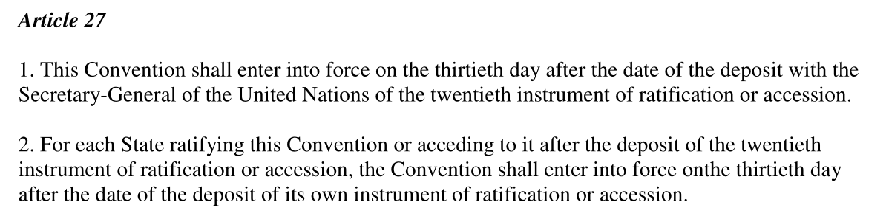

## Today's Agenda {background-image="./Images/background-scales_justice_v3.png" .center}

```{r}
# background-size="1920px 1080px"
library(tidyverse)
library(readxl)

library(sf)
library(rnaturalearth)
library(rnaturalearthdata)
library(countrycode)

# Dataset 1 - CAT Ratifications: DATA-Ratifications-CAT-2026-07.xlsx
rats <- read_excel("../../Data/DATA-Ratifications-CAT-2026-07.xlsx", na = "NA")
    
# Dataset 2 - CAT Ratifications + CIRIGHTS data: DATA-CAT_CIRIGHTS-1981-2022.xlsx
ciri <- read_excel("../../Data/DATA-CAT_CIRIGHTS-1981-2022.xlsx", na = "NA")
    
# Dataset 3 - CAT Ratifications + V-Dem data: DATA-CAT_VDem-1980-2025.xlsx
vdem <- read_excel("../../Data/DATA-CAT_VDem-Ordinal-1980-2025.xlsx", na = "NA")
```

<br>

**Section 2: How effective have international institutions been in reducing the use of torture by governments around the world?**

- Bivariate data analyses of CAT ratifications and torture outcomes

<br>

::: r-stack
Justin Leinaweaver (Fall 2026)
:::

::: notes

**Prep for Class**

1. Review Canvas submissions

2. Datasets

    - Dataset 1 - CAT Ratifications: DATA-Ratifications-CAT-2026-07.xlsx
    
    - Dataset 2 - CAT Ratifications + CIRIGHTS data: DATA-CAT_CIRIGHTS-1981-2022.xlsx
    
    - Dataset 3 - CAT Ratifications + V-Dem data: DATA-CAT_VDem-1980-2025.xlsx

<br>

Before class I asked you to perform data analyses in order to answer three broad questions that connect ratifying the CAT and the use of torture around the world

- Let's use our time to report back on your work!

<br>

Our first two questions focus on performing univariate analyses on our main predictor variable: States binding themselves to the CAT

- We did a similar exercise last week but focused on the the outcome variable: torture

- Those exercises helped us think critically about the validity and reliability of the data we have, 

- To identify where torture is a significant problem in the world today, AND

- To identify how torture has been changing across time

<br>

**SLIDE**: So, let's start by analyzing the speed of adoption for the CAT

<br>

**References**

- [UNTC Page](https://treaties.un.org/Pages/ViewDetails.aspx?src=IND&mtdsg_no=IV-9&chapter=4&clang=_en)

- [Treaty Text](https://treaties.un.org/doc/Treaties/1987/06/19870626%2002-38%20AM/Ch_IV_9p.pdf)

:::


## Canvas Question 1 {background-image="./Images/background-scales_justice_v3.png" .center}

<br>

### How long did it take for the CAT to enter into force after the agreement was completed?

<br>

{style="display: block; margin: 0 auto"}

::: notes

The Convention Against Torture includes protections for states who are willing to ratify the treaty early

- In many areas of international cooperation there is a first-mover disadvantage

- e.g. you are likely at a disadvantage if you bind yourself to rules that others have not yet bound themselves to

- So, the CAT does not require anything of participants until 30 days after the 20th state has bound itself to the treaty

<br>

Now, I know the front page of the treaty already gives you everything you need to answer this question

- e.g. the adoption date and the date the treaty went into force

- However, I asked you to calculate the date the treaty went into force using the data as a validation check on our data

<br>

**So, how did you use the data to calculate the date of entry into force?**

- **Talk me through your procedure**

```{r, echo=TRUE}
# Spreadsheet: 
# 1) Filter to binding states
# 2) sort by binding date
# 3) go to row 20, 
# 4) add 30 days to 20th binding date

# Find the 20th binding action
bind20 <- rats |>
  filter(Binding == 1) |>
  arrange(`Binding Date`) |>
  slice_head(n = 20) |>
  slice_tail(n = 1)

bind20 |> select(country, `Binding Date`)

# Add 30 days
ymd(bind20$`Binding Date`) + 30
```

<br>

So, Denmark was the 20th UN member state to bind itself to the CAT

- Binding date: May 27, 1987

- CAT enters into force 30 days later: June 26, 1987

<br>

With that date confirmed, now we can answer our first question

- **How long did it take for the CAT to enter into force after being adopted by the UN GA?**

```{r, echo=TRUE}
# Subtract the date of adoption (928 days)
(diff1 <- ymd(bind20$`Binding Date`) + 30 - ymd("1984-12-10"))

# Convert to years
as.numeric(diff1/365)
```

<br>

Good warm-up, right?!

<br>

**SLIDE**: Question 2

:::


## Canvas Question 2 {background-image="./Images/background-scales_justice_v3.png" .center}

<br>

### How long did it take for 3/4 of the UN member states to bind themselves to the CAT?

::: notes

**Alright, hit me, how long did it take to 75% of UN member states to bind themselves to the CAT?**

- (9,326 days of 25.6 years!)

<br>

**And who was the 75th percent ratifier?**

- (Pakistan)

<br>

**How did you figure it out?**

- **Talk me through your process**

<br>

**What did you learn from calculating the speed of ratification for countries around the world?**

- **Who ratified quickly and who didn't? Any surprises?**

- (**SLIDE**: Some univariate results to discuss)

<br>

```{r, echo=TRUE}
# What is 75% of the UN member states?
(target1 <- nrow(rats) * .75)

# Find the 75% binding action (146th binding action)
bind75th <- rats |>
  filter(Binding == 1) |>
  arrange(`Binding Date`) |>
  slice_head(n = 146) |> 
  slice_tail(n = 1)

bind75th |> select(country, `Binding Date`)

# Pakistan binding date minus date of adoption
(diff2 <- ymd(bind75th$`Binding Date`) - ymd("1984-12-10"))

# Convert to years
as.numeric(diff2/365)
```

:::


## {background-image="./Images/background-scales_justice_v3.png" .center}

```{r, echo=FALSE, fig.height=6, fig.align='center'}
# Barplot: cumulative ratifications by year
cumsum1 <- rats |>
  filter(Binding == 1) |>
  arrange(`Binding Date`) |>
  select(country, `Binding Action`:`Binding Date`) |>
  mutate(
    binding_yr = year(`Binding Date`)
  ) |>
  group_by(binding_yr) |>
  summarize(
    count1 = n()
    ) |>
  ungroup() |>
  complete(binding_yr = min(binding_yr):max(binding_yr), fill = list(count1 = 0)) |>
  arrange(binding_yr) |>
  mutate(
    cumsum1 = cumsum(count1)
  )

cumsum1 |>
  ggplot(aes(x = binding_yr, y = cumsum1)) +
  geom_col(fill = "grey") +
  theme_bw() +
  labs(x = "", y = "Cumulative Sum of Treaty Ratifications",
       title = "Ratifications of the Convention Against Torture Across Time")
```

::: notes

*Explain a cumulative sum bar plot to them*

<br>

**What do we learn about the ratification of the CAT from this visualization?**

<br>

**SLIDE**: Add lines of best fit


:::


## {background-image="./Images/background-scales_justice_v3.png" .center}

```{r, echo=FALSE, fig.height=6, fig.align='center'}
# Overlay lines of best fit
cumsum1_1st <- cumsum1 |> filter(binding_yr <= 2001)
cumsum1_2nd <- cumsum1 |> filter(binding_yr > 2001)

cumsum1 |>
  ggplot(aes(x = binding_yr, y = cumsum1)) +
  geom_col(fill = "grey") +
  geom_smooth(data = cumsum1_1st, method = "lm") +
  geom_smooth(data = cumsum1_2nd, method = "lm") +
  theme_bw() +
  labs(x = "", y = "Cumulative Sum of Treaty Ratifications",
       title = "Ratifications of the Convention Against Torture Across Time")
```

::: notes

**Is it surprising to see two distinct phases of binding behavior? Why or why not?**

<br>

**SLIDE**: Map of rats by year
:::


## {background-image="./Images/background-scales_justice_v3.png" .center}

```{r, echo=FALSE, fig.height=6, fig.align='center'}
# Map of the world with rats by year
mapping_data1 <- rats |>
  filter(Binding == 1) |>
  arrange(`Binding Date`) |>
  select(country, `Binding Action`:`Binding Date`) |>
  mutate(
    binding_yr = year(`Binding Date`),
    binding_yr2 = case_when(
      binding_yr < 1990 ~ "By 1990",
      binding_yr < 2000 ~ "By 2000",
      binding_yr < 2010 ~ "By 2010",
      binding_yr < 2020 ~ "By 2020",
      binding_yr < 2030 ~ "By 2030"
    )
  )

world <- ne_countries(scale = "medium", returnclass = "sf")

#countrycode::guess_field(mapping_data1$country)
mapping_data1$iso3c <- countrycode::countrycode(sourcevar = mapping_data1$country, origin = "country.name", destination = "iso3c")

d3 <- left_join(world, mapping_data1, by = c("adm0_a3" = "iso3c"))

# ggplot(data = d3) +
#   geom_sf(aes(fill = binding_yr)) +
#   labs(fill = "", title = "Ratifications of the Convention Against Torture") +
#   scale_fill_gradient(low = "yellow", high = "red", na.value = "grey50")

ggplot(data = d3) +
  geom_sf(aes(fill = binding_yr2)) +
  labs(fill = "", title = "Ratifications of the Convention Against Torture") +
  scale_fill_brewer(type = "seq", palette = "GnBu", direction = -1, na.value = "red")
```

::: notes

**Any surprises here?**

<br>

**SLIDE**: On to Question 3!

:::


## Canvas Question 3 {background-image="./Images/background-scales_justice_v3.png" .center}

<br>

### According to the CIRIGHTS data project, did countries that ratified the CAT reduce their use of torture in the following years?

::: notes

**Alright, let's share answers to this question and the techniques you applied to generate them!**

- *Go around the room to share*

<br>

**SLIDE**: My versions

- line plot - means
- Stacked bar plot: For each year count torture by level: 0, 1 and 2
- Avg effects after ratification

:::


## {background-image="./Images/background-scales_justice_v3.png" .center}

```{r, echo=FALSE, fig.height=6}
# Line plot - Means: Average torture score ratifiers vs non-ratifiers
# REMEMBER: Higher numbers are good
ciri2 <- ciri |>
  select(country, `Binding Date`, CR_Torture1981:CR_Torture2022) |>
  pivot_longer(cols = CR_Torture1981:CR_Torture2022, names_to = "year", values_to = "torture", names_prefix = "CR_Torture") |>
  mutate(
    year = as.numeric(year),
    `Binding Date` = ymd(`Binding Date`),
    binding_year = year(`Binding Date`)
  ) |>
  rename(binding_dte = `Binding Date`) |>
  mutate(
    bound = if_else(year <= binding_year, 0, 1, missing = 0)
  )

ciri2 |>
  group_by(year, bound) |>
  summarize(
    torture = mean(torture, na.rm = TRUE)
  ) |>
  ggplot(aes(x = year, y = torture, color = as.factor(bound))) +
  annotate("rect", xmin = 1980, xmax = 2022, ymin = 1.34, ymax = 2, fill = "#4D70F0", color = "white", alpha = .4) +
  annotate("rect", xmin = 1980, xmax = 2022, ymin = .67, ymax = 1.34, fill = "orange", color = "white", alpha = .4) +
  annotate("rect", xmin = 1980, xmax = 2022, ymin = 0, ymax = .67, fill = "#CC2908", color = "white", alpha = .4) +
  geom_line(linewidth=1.4) +
  theme_bw() +
  scale_y_continuous(limits = c(0, 2)) +
  scale_x_continuous(breaks = seq(1980, 2025, 5)) +
  scale_color_manual(values = c("red", "blue")) +
  guides(color = FALSE) +
  labs(x = "", y = "Mean Torture Score", title = "On average, states that join the CAT receive worse torture scores by CIRIGHTS than non-participating states", subtitle = "(Note: The lower the score, the greater the use of torture in that state)", caption = "Source: CIRIGHTS (2024)") +
  annotate("text", x = 2018, y = 1.5, label = "Non-Participant", color = "red", size = 5) +
  annotate("text", x = 2018, y = .5, label = "Participant", color = "blue", size = 5)
```


## {background-image="./Images/background-scales_justice_v3.png" .center}

```{r, echo=FALSE, fig.height=6}
# Stacked bar plot: For each year count torture by level: 0, 1 and 2
# Can we identify what is happening?
ciri2 |>
  group_by(year, bound) |>
  summarize(
    torture0 = sum(torture == 0, na.rm = TRUE),
    torture1 = sum(torture == 1, na.rm = TRUE),
    torture2 = sum(torture == 2, na.rm = TRUE)
  ) |>
  ungroup() |>
  pivot_longer(cols = torture0:torture2, names_to = "level1", values_to = "count1", names_prefix = "torture") |> 
  mutate(
    bound = if_else(bound == "0", "CAT Non-Participant", "CAT Participant")
  ) |>
  ggplot(aes(x = year, y = count1, fill = level1)) +
  #geom_col(position = "fill") +
  geom_col() +
  scale_fill_manual(values = c("#CC2908", "orange", "#4D70F0")) +
  scale_x_continuous(breaks = seq(1980, 2025, 5)) +
  facet_wrap(~ bound) +
  theme_bw() +
  labs(x = "", y = "Count of UN members", fill = "CIRIGHTS", caption = "Source: CIRIGHTS (2024)", title = "The distribution of states by torture score appears fairly stable amongst the CAT participants") +
  theme(legend.position = "bottom")
```


## {background-image="./Images/background-scales_justice_v3.png" .center}

```{r, echo=FALSE, fig.height=7, fig.align='center'}

# Examine the experience of individual PARTICIPATING states (in aggregate)
# Three groups: What torture level before you joined? 0, 1 or 2?
# Avg scores in the years since for that group? Line plot
base_torture <- ciri2 |>
  filter(!is.na(binding_dte)) |>
  filter(year == binding_year) |>
  mutate(
    base_torture = case_when(
      torture == 0 ~ "Base Torture 0",
      torture == 1 ~ "Base Torture 1",
      torture == 2 ~ "Base Torture 2",
    )
  ) |>
  select(country, base_torture)

left_join(ciri2, base_torture, by = "country") |>
  filter(year > binding_year) |>
  group_by(base_torture, year) |>
  summarize(
    torture = mean(torture, na.rm = TRUE)
  ) |>
  ungroup() |>
  filter(!is.na(base_torture)) |>
  ggplot(aes(x = year, y = torture, color = base_torture)) +
  annotate("rect", xmin = 1985, xmax = 2022, ymin = 1.34, ymax = 2, fill = "#4D70F0", color = "white", alpha=.3) +
  annotate("rect", xmin = 1985, xmax = 2022, ymin = .67, ymax = 1.34, fill = "orange", color = "white", alpha=.3) +
  annotate("rect", xmin = 1985, xmax = 2022, ymin = 0, ymax = .67, fill = "#CC2908", color = "white", alpha=.3) +
  geom_line(linewidth = 1.4) +
  theme_bw() +
  scale_color_manual(values = c("#CC2908", "orange", "#4D70F0")) +
  scale_x_continuous(breaks = seq(1980, 2025, 5)) +
  scale_y_continuous(limits = c(0,2)) +
  labs(x = "", y = "Mean Torture Score", caption = "Source: CIRIGHTS (2024)\nNote: The lower the score, the greater the use of torture in that state", color = "Level at Binding", title = "Torture behavior by CAT participants after the binding action") +
  geom_smooth(se = FALSE, linewidth = .5, linetype = "dashed") +
  theme(legend.position = "bottom")
```

::: notes

In this visualization I am analyzing the behavior of states only AFTER they bind themselves to the CAT

:::


## Canvas Question 4 {background-image="./Images/background-scales_justice_v3.png" .center}

<br>

### According to the V-Dem data project, did countries that ratified the CAT reduce their use of torture in the following years?

::: notes

**Alright, let's share answers to this question and the techniques you applied to generate them!**

- *Go around the room to share*

<br>

**SLIDE**: My versions

- line plot - means
- Stacked bar plot: For each year count torture by level: 0, 1 and 2
- Avg effects after ratification

:::


## {background-image="./Images/background-scales_justice_v3.png" .center}

```{r, echo=FALSE, fig.height=6}
# Line plot - Means: Average torture score ratifiers vs non-ratifiers
vdem2 <- vdem |>
  select(country, `Binding Date`, VDem_Torture1980:VDem_Torture2025) |>
  pivot_longer(cols = VDem_Torture1980:VDem_Torture2025, names_to = "year", values_to = "torture", names_prefix = "VDem_Torture") |>
  mutate(
    year = as.numeric(year),
    `Binding Date` = ymd(str_remove(`Binding Date`, pattern = " 00:00:00")),
    binding_year = year(`Binding Date`)
  ) |>
  rename(binding_dte = `Binding Date`) |>
  mutate(
    bound = if_else(year <= binding_year, 0, 1, missing = 0)
  )

vdem2 |>
  group_by(year, bound) |>
  summarize(
    torture = mean(torture, na.rm = TRUE)
  ) |>
  ggplot(aes(x = year, y = torture, color = as.factor(bound))) +
  annotate("rect", xmin = 1985, xmax = 2025, ymin = 0, ymax = .8, fill = "#CC2908", alpha=.4) +
  annotate("rect", xmin = 1985, xmax = 2025, ymin = .8, ymax = 1.6, fill = "#F788B3", alpha=.4) +
  annotate("rect", xmin = 1985, xmax = 2025, ymin = 1.6, ymax = 2.4, fill = "orange", alpha=.4) +
  annotate("rect", xmin = 1985, xmax = 2025, ymin = 2.4, ymax = 3.2, fill = "#88E3F7", alpha=.4) +
  annotate("rect", xmin = 1985, xmax = 2025, ymin = 3.2, ymax = 4, fill = "#4D70F0", alpha=.4) +
  geom_line(linewidth=1.4) +
  theme_bw() +
  scale_y_continuous(limits = c(0, 4)) +
  scale_x_continuous(breaks = seq(1980, 2025, 5), limits = c(1985, 2025)) +
  scale_color_manual(values = c("red", "blue")) +
  guides(color = FALSE) +
  labs(x = "", y = "Mean 'Freedom from Torture' Score", title = "On average, states that join the CAT receive BETTER torture scores from V-Dem than non-participating states", caption = "Source: V-Dem (2026)") +
  annotate("text", x = 2021, y = 1.85, label = "Non-Participant", color = "red", size = 5) +
  annotate("text", x = 2021, y = 3, label = "Participant", color = "blue", size = 5)
```

::: notes

V-Dem Freedom from Torture (v2cltort) Ordinal Scale

0: Torture is practiced systematically and approved by government leaders.

1: Torture is frequent without top leader approval, but leaders fail to prevent it.

2: Torture occurs occasionally without leadership approval.

3: Torture is limited to isolated cases and unapproved by authorities.

4: Torture is non-existent.

:::


## {background-image="./Images/background-scales_justice_v3.png" .center}

```{r, echo=FALSE, fig.height=6}
# Stacked bar plot: For each year count torture by level: 0, 1 and 2
# Can we identify what is happening?
vdem2 |>
  group_by(year, bound) |>
  summarize(
    torture0 = sum(torture == 0, na.rm = TRUE),
    torture1 = sum(torture == 1, na.rm = TRUE),
    torture2 = sum(torture == 2, na.rm = TRUE),
    torture3 = sum(torture == 3, na.rm = TRUE),
    torture4 = sum(torture == 4, na.rm = TRUE)
  ) |>
  ungroup() |>
  pivot_longer(cols = torture0:torture4, names_to = "level1", values_to = "count1", names_prefix = "torture") |> 
  mutate(
    bound = if_else(bound == "0", "CAT Non-Participant", "CAT Participant")
  ) |>
  ggplot(aes(x = year, y = count1, fill = level1)) +
  geom_col() +
  scale_fill_manual(values = c("#CC2908", "#F788B3", "orange", "#88E3F7", "#4D70F0")) +
  scale_x_continuous(breaks = seq(1980, 2025, 5)) +
  facet_wrap(~ bound) +
  theme_bw() +
  labs(x = "", y = "Count of UN members", fill = "V-Dem 'Freedom from Torture'", caption = "Source: V-Dem (2026)", title = "The V-Dem measurement suggests most CAT participants do not approve of the use of torture") +
  theme(legend.position = "bottom")
```

::: notes

V-Dem Freedom from Torture (v2cltort) Ordinal Scale

0: Torture is practiced systematically and approved by government leaders.

1: Torture is frequent without top leader approval, but leaders fail to prevent it.

2: Torture occurs occasionally without leadership approval.

3: Torture is limited to isolated cases and unapproved by authorities.

4: Torture is non-existent.

:::


## {background-image="./Images/background-scales_justice_v3.png" .center}

```{r, echo=FALSE, fig.height=7, fig.align='center'}
# Examine the experience of individual PARTICIPATING states (in aggregate)
# Five groups: What torture level before you joined? 0, 1, 2, 3, or 4?
# Avg scores in the years since for that group? Line plot
base_torture <- vdem2 |>
  filter(!is.na(binding_dte)) |>
  filter(year == binding_year) |>
  mutate(
    base_torture = case_when(
      torture == 0 ~ "Base Torture 0",
      torture == 1 ~ "Base Torture 1",
      torture == 2 ~ "Base Torture 2",
      torture == 3 ~ "Base Torture 3",
      torture == 4 ~ "Base Torture 4",
    )
  ) |>
  select(country, base_torture)

left_join(vdem2, base_torture, by = "country") |>
  filter(year > binding_year) |>
  group_by(base_torture, year) |>
  summarize(
    torture = mean(torture, na.rm = TRUE)
  ) |>
  ungroup() |>
  filter(!is.na(base_torture)) |>
  ggplot(aes(x = year, y = torture, color = base_torture)) +
  annotate("rect", xmin = 1987, xmax = 2025, ymin = 0, ymax = .8, fill = "#CC2908", alpha=.25) +
  annotate("rect", xmin = 1987, xmax = 2025, ymin = .8, ymax = 1.6, fill = "#F788B3", alpha=.25) +
  annotate("rect", xmin = 1987, xmax = 2025, ymin = 1.6, ymax = 2.4, fill = "orange", alpha=.25) +
  annotate("rect", xmin = 1987, xmax = 2025, ymin = 2.4, ymax = 3.2, fill = "#88E3F7", alpha=.25) +
  annotate("rect", xmin = 1987, xmax = 2025, ymin = 3.2, ymax = 4, fill = "#4D70F0", alpha=.25) +
  geom_line(linewidth = 1.4) +
  theme_bw() +
  scale_color_manual(values = c("#CC2908", "#F788B3", "orange", "#88E3F7", "#4D70F0")) +
  scale_x_continuous(breaks = seq(1985, 2025, 5)) +
  #scale_y_continuous(limits = c(0,4)) +
  labs(x = "", y = "Mean Torture Score", caption = "Source: V-Dem (2026)\nNote: The lower the score, the greater the use of torture in that state", color = "Level at Binding", title = "Is the CAT successfully moving the worst behaving states into, at least, denying their bad actions?") +
  geom_smooth(se = FALSE, linewidth = .5, linetype = "dashed") +
  theme(legend.position = "bottom")
#+
#  facet_wrap(~base_torture, scales = "free_y")
```

::: notes

In this visualization I am analyzing the behavior of states only AFTER they bind themselves to the CAT

:::

::: notes


<br>

V-Dem Freedom from Torture (v2cltort) Ordinal Scale

0: Torture is practiced systematically and approved by government leaders.

1: Torture is frequent without top leader approval, but leaders fail to prevent it.

2: Torture occurs occasionally without leadership approval.

3: Torture is limited to isolated cases and unapproved by authorities.

4: Torture is non-existent.

:::


## Section 2 {background-image="./Images/background-scales_justice_v3.png" .center}

<br>

### How effective has the CAT been in reducing the use of torture by governments around the world?

- Best answer so far?


## For Next Class {background-image="./Images/background-scales_justice_v3.png" .center}

<br>

{style="display: block; margin: 0 auto"}

::: notes

Canvas ASSIGNMENT: Unpacking Hathaway's (2007) argument and analyses

Be ready to discuss the Hathaway article in class. To help you prepare for our discussion read the article and answer the following prompts:

1. What is the RQ?
2. On what specific page numbers does Hathaway explain the central argument in the paper? (e.g. the proposed answer to the RQ)
3. Big picture, what is the proposed answer to the question?
4. On what specific page numbers does Hathaway explain and evaluate the sources of the data being analyzed?
5. On what specific page numbers does Hathaway describe and explain the tests of the data?
6. What is the bottom line conclusion of the paper? What does Hathaway think we know about the world now that we didn't before?

:::

