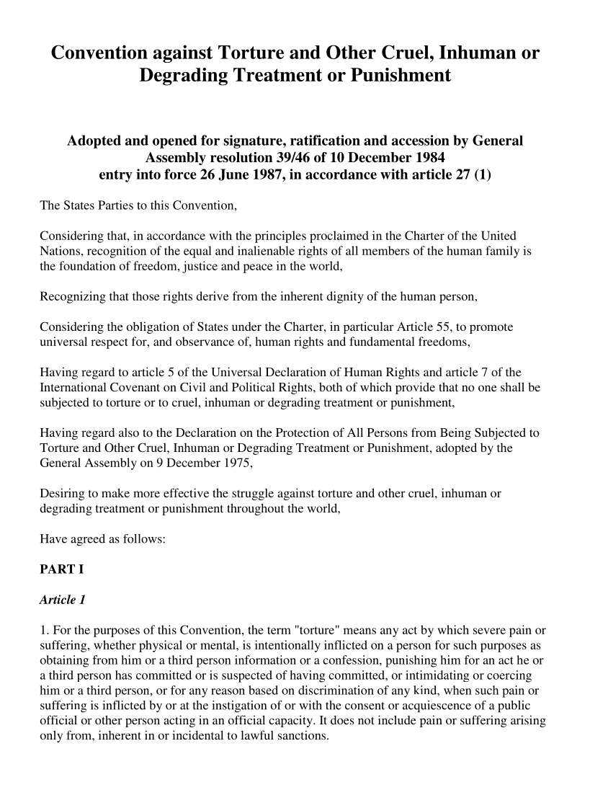
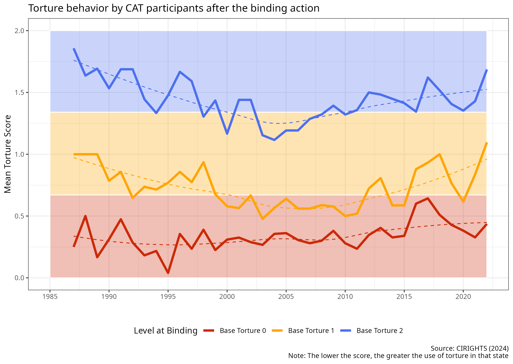
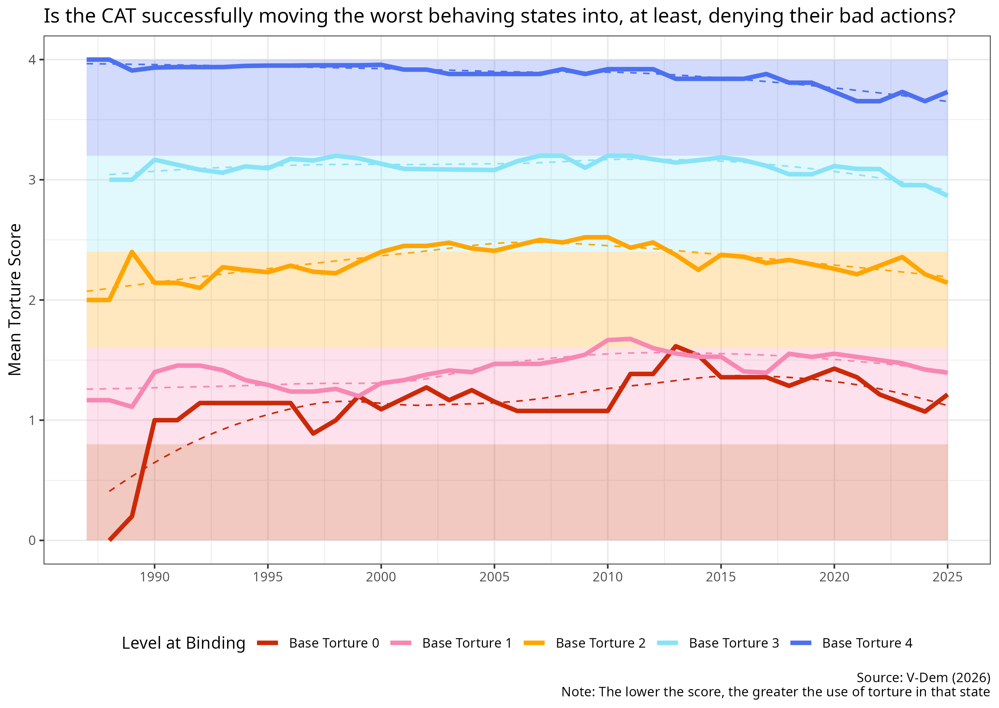
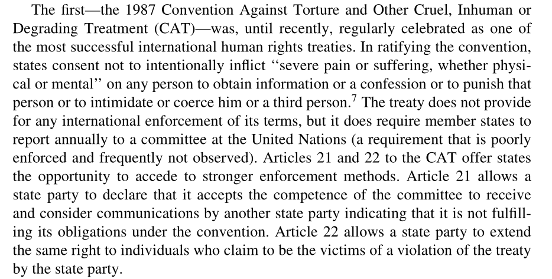
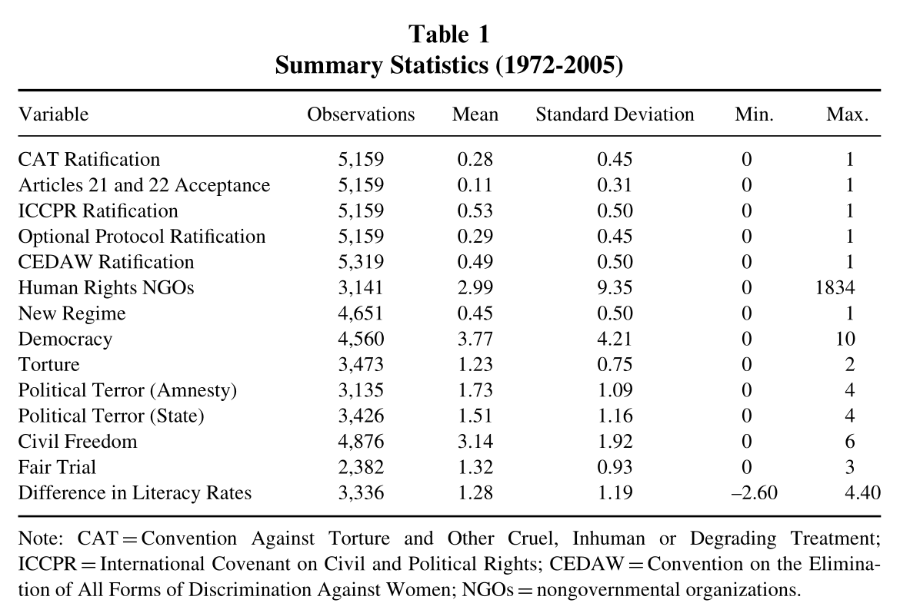
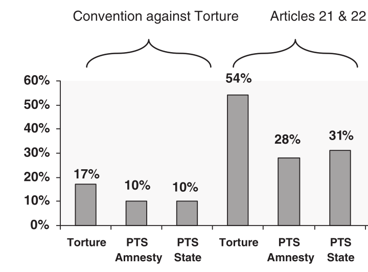
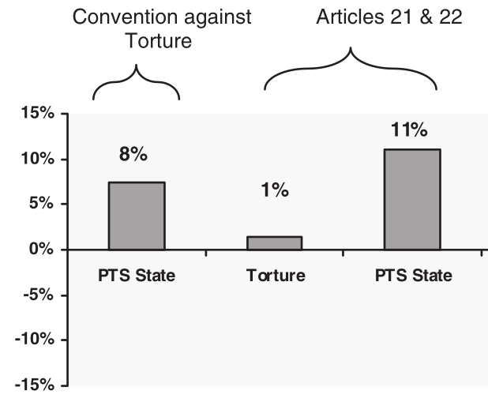
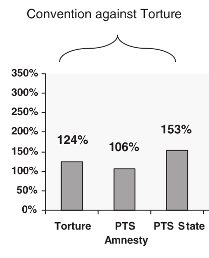
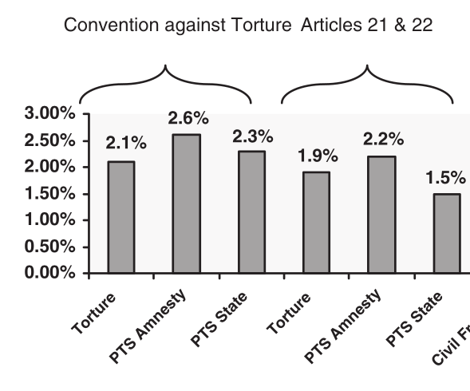

## Today's Agenda {background-image="./Images/background-scales_justice_v3.png" .center}

```{r}
# background-size="1920px 1080px"
library(tidyverse)
library(readxl)
```

<br>

**Section 2: How effective have international institutions been in reducing the use of torture by governments around the world?**

- Hathaway (2007) "Why Do Countries Commit to Human Rights Treaties?"

<br>

::: r-stack
Justin Leinaweaver (Fall 2026)
:::

::: notes

**Prep for Class**

1. Check Canvas submissions

<br>

**SLIDE**: Section 2 of our class has focused on answering this research question

:::


## {background-image="./Images/background-scales_justice_v3.png" .center}

**How effective have international institutions been in reducing the use of torture by governments around the world?**

- Week 6: Defining and Measuring the Outcome

- Week 7: The Convention Against Torture (CAT)

- Week 8: Explaining the Effect of the CAT on Torture 

- Week 9: The International Criminal Court (ICC)

- Week 10: Can the ICC help us reduce global torture?

- Week 11: Case Studies of ICC Effectiveness

::: notes

How effective have international institutions been in reducing the use of torture by governments around the world?

<br>

**SLIDE**: Two weeks ago we began by...

:::


## {background-image="./Images/background-scales_justice_v3.png" .center}

**How effective have international institutions been in reducing the use of torture by governments around the world?**

- Week 6: Defining and Measuring the Outcome

    - Reviewed the Amnesty International Global Report for 2026
    
    - Discussed the impacts of torture on current events
    
    - Analyzed the CIRIGHTS and V-DEM measures of torture
    
    - Identified cross-national and cross-temporal variation in the data

::: notes

*Read the slide*

<br>

No research project can make any useful progress until you have a solid foundation in the variation you are trying to explain

- For our project that has meant spending time defining, measuring and analyzing torture around the world and across time

<br>

**SLIDE**: The cross-national variation

:::


## {background-image="./Images/background-scales_justice_v3.png"}

{.absolute width="650" left=0 top=0}

{.absolute width="650" right=0 bottom=0}

::: notes

**Based on your univariate analyses, have we identified variation in torture around the world that needs to be explained?**

- (Tons!)

<br>

This means we're in good shape so far.

- Our measures clearly show significant variation in the use of torture around the world

<br>

**Just from looking at these maps, do any possible explanatory variables jump out at you?**

- (Wealth?)

- (History of colonial oppression?)

- (Regime type?)

<br>

Our focus in this class is on the effects of international institutions on political outcomes

- **SLIDE**: SO, last week we shifted our focus to the Convention Against Torture (CAT)

:::


## {background-image="./Images/background-scales_justice_v3.png" .center}

:::: {.columns}
::: {.column width="50%"}

:::

::: {.column width="50%"}

<br>

<br>

**Analyzing the Treaty**

- Legalization

- Rational design conjectures

- Treaty specific provisions

:::
::::

::: notes

Talk to me about your analysis of the Convention Against Torture from last week

- **What stood out to you in reading and reflecting on this treaty?**

<br>

**If someone came to you and asked if the CAT was likely to work based on its design, what's the best case scenario for effectiveness?**

- **In other words, what mechanisms in the treaty are most likely to help?**

- (Significant flexibility in participation and avoiding oversight promotes ratification?)

<br>

**And if they asked what is most likely to stop the CAT from being effective?**

- **What would you highlight for them?**

- (Some substantial seeming reservations attached changing the meaning of the obligations)

- (States allowed to opt out of oversight preventing information dissemination as a form of oversight / enforcement)

<br>

We then ended last week bivariate tests of the effectiveness of the CAT

- **What did we find in our data analyses? Has CAT participation reduced torture behavior or not?**

- (**SLIDE**: Depends on the measurement...)

:::


## {background-image="./Images/background-scales_justice_v3.png"}

{.absolute width="570" left=0 top=0}

{.absolute width="570" right=0 bottom=0}

::: notes

**Takeaways from our bivariate analyses?**

<br>

Per CIRISGHTS:

- Doesn't seem to have shifted states from their baseline level of torture very much

- The war on terror seems to have worsened torture behavior among those states that were on the "good" side of the torture equation and maybe things are getting back to normal again?

<br>

Per VDEM:

- Maybe some good effects in the worst three levels of governments by torture level?

- Definitely something going on in the bottom level

<br>

**SLIDE**: Our plan for this week

:::


## {background-image="./Images/background-scales_justice_v3.png" .center}

**How effective have international institutions been in reducing the use of torture by governments around the world?**

- [Week 6: Defining and Measuring the Outcome]{style="color:gray;"}

- [Week 7: The Convention Against Torture (CAT)]{style="color:gray;"}

- **Week 8: Explaining the Effect of the CAT on Torture**

- [Week 9: The International Criminal Court (ICC)]{style="color:gray;"}

- [Week 10: Can the ICC help us reduce global torture?]{style="color:gray;"}

- [Week 11: Case Studies of ICC Effectiveness]{style="color:gray;"}

::: notes

Our plan for this week is to explore two pieces of published research that each tries to explain the effect of the CAT on torture in the world

<br>

Super useful to see examples of high quality research focused on the same puzzle we are working on!

- These researchers will propose theories, gather data and then run tests on that data

- My hope is we learn as much from what they did as from what they concluded!

<br>

**SLIDE**: Today we start with Oona Hathaway's (2007) contribution to the literature

:::


## {background-image="./Images/background-scales_justice_v3.png" .center}

<br>

{style="display: block; margin: 0 auto"}

::: notes

Let's set the table with your work from Canvas

<br>

**What is the RQ in Hathaway's (2007) article?**

- (Why do states bind themselves to human rights treaties?)

<br>

**How and why does Hathaway present this as a puzzle to be explained?**

- (Because "they constitute the paradigmatic hard case...)

- ("Human rights treaties do not offer states any obvious reciprocal benefits...")

- ("It is much less obvious why a state would join an agreement that requires
it to provide fair trials when all the state explicitly receives in return is a reciprocal promise by other members to treat their own citizens with similar respect.")

<br>

**SLIDE**: CAT summarized

:::


## {background-image="./Images/background-scales_justice_v3.png" .center}

<br>

{style="display: block; margin: 0 auto"}

::: notes

On page 591, Hathaway summarizes the CAT in a paragraph

- **How did she do? Anything we missed or anything you might quibble with?**

<br>

**On what pages can I find the theory in the paper (e.g. the the proposed answer to the RQ)?**

- (p590 - 598)

<br>

Now, let me confess, I don't love the theory in this paper

- I understand what she's trying to do here, but she's pulling together A LOT of different threads and calling them all one thing

- The more complicated your model, the more room for error and the less useful it is as a simple explanation for a political outcome

<br>

**SLIDE**: Alright, let's unpack the proposed theory in the article using the III method proposed by Frieden, Lake and Schultz (2009)

:::


## {background-image="./Images/background-scales_justice_v3.png" .center}

**Hathaway (2007): The Model**

<br>

**Interests**

- ?

::: notes

Our first job is to identify the interests in the model

- The interests refer to the actors whose decision-making the model is trying to explain

<br>

**Based on the research question in this article, whose behavior is Hathaway (2007) focused on explaining?**

- (**SLIDE**: Why do COUNTRIES choose to join human rights treaties?)

:::


## {background-image="./Images/background-scales_justice_v3.png" .center}

**Hathaway (2007): The Model**

<br>

**Interests**

- States...

::: notes

I'm using "states" as a synonym for country that is slightly more precise

- Country tends to refer to a state tied to a specific piece of land

- State refers more to the government tied to a political community

<br>

Ok, so we now the primary interests in this model are states, but that's only half the job

- The "interests" refers to BOTH the actor AND the preferences of the actor

- e.g. What does the actor want from this decision?

- FLS define this as: "…[The] preferences of actors over the possible outcomes that might result from their political choices" (Frieden, Lake and Schultz 2026, 45).

<br>

Talk to the people around you and get ready to report back

- **What do the states facing this treaty decision want according to this model?**

<br>

(**SLIDE**)

:::


## {background-image="./Images/background-scales_justice_v3.png" .center}

**Hathaway (2007): The Model**

<br>

**Interests**: 

- States will join human rights treaties whose benefits outweigh their costs

::: notes

Again, this is pretty broad and a little generic, but...

- It is essentially a rational actor assumption which I'm ok with

- In this model we expect states to evaluate decisions like this in terms of the costs and benefits of joining

- If the benefits outweigh the costs, then join. 

- Otherwise, don't.

<br>

**Make sense?**

<br>

**SLIDE**: Institutions

:::


## {background-image="./Images/background-scales_justice_v3.png" .center}

**Hathaway (2007): The Model**

<br>

**Interests**: 

- States will join human rights treaties whose benefits outweigh their costs

**Institutions**

- ?

::: notes

The institutions refer to the baseline rules in the system the actors are operating within

- Per FLS: "A set of rules, known and shared by the community, that structure political interactions in particular ways" (Frieden, Lake and Schultz 2026, 67).

<br>

Think about the rules or structures that Hathaway emphasizes in her model of state decision-making about human rights treaties

- Ok, talk to the people around you and get ready to report back

- **What are the institutions in this model?**

<br>

(**SLIDE**)

:::


## {background-image="./Images/background-scales_justice_v3.png" .center .smaller}

**Hathaway (2007): The Model**

<br>

**Interests**: 

- States will join human rights treaties whose benefits outweigh their costs

**Institutions**

- Domestic: States vary in whether or not non-state actors can enforce treaty rules on the government

- Domestic: States vary in how much authority the executive has to make policy

- International: Most human rights treaties lack meaningful external enforcement

::: notes

In my reading of this paper I see three baseline structures Hathaway wants us to focus on

- Two are domestic and relate to the rules associated with your type of government structure; think broad regime types

- And the only international rule she is seemingly interested in is the baseline understanding that these treaties lack enforcement

- **Make sense?**

<br>

Now, we could come up with a bunch of different other rules that we think are important in this process

- e.g. what about the rules established by the Vienna Convention on the Law of Treaties

<br>

But remember, a model is not true or false, it is a simplification of reality meant to help us zoom in on specific mechanisms that we want to measure

- In Hathaway's model, these are the rules she is interested in exploring

- **Make sense?**

<br>

**SLIDE**: Interactions time

:::


## {background-image="./Images/background-scales_justice_v3.png" .center .smaller}

**Hathaway (2007): The Model**

<br>

**Interests**: 

- States will join human rights treaties whose benefits outweigh their costs

**Institutions**

- Domestic: States vary in whether or not non-state actors can enforce treaty rules on the government

- Domestic: States vary in how much authority the executive has to make policy

- International: Most human rights treaties lack meaningful external enforcement

**Interactions**

- ?

::: notes

The interactions represent the complications that arise with different actors pursuing their interests at the same time

- "The ways in which the choices of two or more actors combine to produce political outcomes" (Frieden, Lake and Schultz 2026, 51).

<br>

Think about the elements of the model that focus on what happens when a state actually starts adding together the costs and benefits of the human rights treaty

- Ok, talk to the people around you and get ready to report back

- **What are the interactions in this model?**

<br>

(**SLIDE**: There are a BUNCH of interactions in this model)

:::


## {background-image="./Images/background-scales_justice_v3.png" .center .smaller}

**Hathaway (2007): The Model**

<br>

**Interactions**

- Violating the rules of the treaty **ONLY MATTERS** if your system allows domestic actors to enforce treaty rules

::: {.fragment}
- State executives who struggle for policy "wins" may see treaty-making as a useful tool to show their influence

- States with larger NGO populations will experience more pressure to join human rights treaties
:::

::: {.fragment}
- Newer states who need to establish a "good" reputation are more likely to join

- States with a good human rights record have little to gain from joining (and may be exposed for bad), but dictators with bad records can join without fear of punishment

- States surrounded by other states who join will feel pressure to do the same
:::

::: notes

Interactions in three sections

<br>

I. domestic enforcement capacity

- Democracies should not join treaties they are currently violating
    
- Dictatorships can happily join human rights treaties regardless of bad behavior

<br>

**REVEAL**: II. Domestic collateral consequences

<br>

**REVEAL**: III. Transnational collateral consequences)

- What Hathaway refers to a "perverse effect" of human rights treaties

<br>

**Do the interactions make sense?**

<br>

**SLIDE**: The model in total

:::


## {background-image="./Images/background-scales_justice_v3.png" .center .smaller}

**Hathaway (2007): The Model**

<br>

**Interests**: 

- States will join human rights treaties whose benefits outweigh their costs

**Institutions**

- Domestic: States vary in whether non-state actors can enforce treaty rules and the powers of the executive

- International: No meaningful external enforcement

**Interactions**

- Domestic enforcement capacity matters for costs and benefits

- Domestic collateral consequences matter for costs and benefits

- Transnational collateral consequences matter for costs and benefits

::: notes

**What do you think of the model?**

- **Persuasive? Useful?**

<br>

Hathaway's argument pushes us to think about the complexity of answering questions about treaty participation and effectiveness: 

- State actions towards human rights treaties depend on Treaty design x domestic politics x international politics

<br>

The good news is that this model suggests treaties can influence behavior without international enforcement

<br>

The bad news is that depending on domestic enforcement means creating weird incentives

- Bad states can happily join and celebrate a human rights treaty with little to fear from being bad

- Good states will be reticent to join for fear that they will end up losing some sovereignty on an issue they already are working on!

<br>

**SLIDE**: Let's take a look at Hathaway's analyses

:::


## {background-image="./Images/background-scales_justice_v3.png" .center .smaller}

::: {.r-fit-text}
**Hathaway (2007): Data Sources & Operationalizations**
:::

**Outcome Variables**

- Ratification of the CAT (UNTC)
- Acceptance of CAT Art. 21 and 22 (UNTC)

::: {.fragment}

**Predictor Variables**

- Domestic Enforcement Capacity = Level of democracy from 0-10 (Polity IV)

- Collateral Consequences = Count of human rights NGOs actively working (Human Rights Internet)

- Government Use of Torture = CIRI Human Rights (based on reports from Amnesty International and the US State Department)
:::

::: notes

**First of all, and based on our analyses of the design of the CAT, are we willing to consider these two outcomes as equally substantial commitments? Why or why not?**

<br>

Hathaway argues that Art 21 and 22 "...create harder obligations than the other legal instruments examined here, for they establish more formal (if infrequently used) enforcement mechanisms" (592).)

<br>

**REVEAL**: And here are the main predictors operationalized

- CIRI is the project that became CIRIGHTS

<br>

**In terms of accurately reflecting the mechanisms in the model, are we comfortable with these data choices? Why or why not?**

<br>

**SLIDE**: If time remains, descriptive stats table!

:::


## {background-image="./Images/background-scales_justice_v3.png" .center}

{style="display: block; margin: 0 auto"}

::: notes

I love a descriptive statistics table

- Our only chance to get a sense of the sample of data the researcher is working with

- So, here is what we know about the states being analyzed from 1972 - 2005

<br>

*Talk through the columns: Observations, Mean, Std Dev, Min and Max*

<br>

*Have them walk you through each main variable*

- Outcomes: 

    - CAT ratification
    - Art 21 and 22 acceptance
    
- Predictors

    - Human Rights NGOs
    - New Regime
    - Democracy
    - Torture

<br>

Ok, what should we expect to see in the data if Hathaway (2007) is right?

- **SLIDE**

:::


## {background-image="./Images/background-scales_justice_v3.png" .center}

**Hathaway (2007): Domestic Enforcement Capacity Test**

<br>

```{r, fig.align='center', fig.retina=3, out.width='80%', fig.asp = 0.618}
tibble(
  Democracy = 0:10,
  torture = 1
) |>
  ggplot(aes(x = Democracy, y = torture)) +
  geom_point(color = "white") +
  geom_hline(yintercept = 1) +
  #geom_line() +
  coord_cartesian(ylim = c(0, 2)) +
  labs(y = "Partial Effect of Torture") +
  theme_bw() +
  scale_x_continuous(breaks = 0:10)
```

::: notes

Before we dig into the figures in the paper, let's set up what we'll be looking at.

- The results in the paper come from a Cox Proportional Hazard Regression

<br>

This marginal effects plot allows us to visualize the effect of democracy and torture on the probability a state ratifies the CAT.

- x-axis: Level of democracy

- y-axis: Effect of increasing torture level on the likelihood of ratifying CAT

<br>

Each point on the plot is a hazard ratio

- Values > 1 on the y-axis are more likely ratifications by that kind of state

- Values < 1 on the y-axis are less likely ratifications by that kind of state

- And Values = '1' essentially means no effect

<br>

**Make sense?**

:::


## {background-image="./Images/background-scales_justice_v3.png" .center}

**Hathaway (2007): Domestic Enforcement Capacity Test**

<br>

```{r, fig.align='center', fig.retina=3, out.width='80%', fig.asp = 0.618}
tibble(
  Democracy = 0:10,
  torture = 1.5
) |>
  ggplot(aes(x = Democracy, y = torture)) +
  geom_point(color = "blue", size = 3) +
  geom_line(color = "blue") +
  geom_hline(yintercept = 1, linewidth = .3) +
  coord_cartesian(ylim = c(0, 2)) +
  labs(y = "Partial Effect of Torture") +
  theme_bw() +
  scale_x_continuous(breaks = 0:10)
```

::: notes
    
**So, if the analysis produced this line, what would it mean for the effects of democracy and torture on CAT ratifications?**

- (Per this line, all countries (e.g. any level of democracy) who use torture are more likely to ratify the CAT)

<br>

**Given that CAT aims to criminalize torture, what kind of line should we expect to see?**

- (**SLIDE**)

:::


## {background-image="./Images/background-scales_justice_v3.png" .center}

**Hathaway (2007): Domestic Enforcement Capacity Test**

<br>

```{r, fig.align='center', fig.retina=3, out.width='80%', fig.asp = 0.618}
tibble(
  Democracy = 0:10,
  torture = .5
) |>
  ggplot(aes(x = Democracy, y = torture)) +
  geom_hline(yintercept = 1, color = "darkgrey", linewidth = .4) +
  geom_point(size = 3, color = "red") +
  geom_line(color = "red") +
  coord_cartesian(ylim = c(0, 2)) +
  labs(y = "Partial Effect of Torture") +
  theme_bw() +
  scale_x_continuous(breaks = 0:10)
```

::: notes

This line would indicate that for all countries, regardless of level of democracy, using torture makes them less likely to ratify the CAT (-50%).

- If the CAT makes torture harder then we'd hope states that do it a lot would hesitate to join!

<br>

**Make sense?**

:::


## {background-image="./Images/background-scales_justice_v3.png" .center}

**Hathaway (2007): Domestic Enforcement Capacity Test**

{style="display: block; margin: 0 auto"}

::: notes

Ok, here's the real results.

**Ignore the dashed lines (confidence intervals) for a moment and tell me, what did Hathaway (2007) find?**

Figure 1

- Dictatorships who use torture are MORE likely to ratify the CAT

    - Democracy of 1, hazard ratio of 1.4 (+40%)

- Democracies that use torture are LESS likely to ratify

    - Democracy of 10, hazard ratio of .7 (-30%)

<br>

**SLIDE**: And here are the results for acceptance of Articles 21 and 22.

:::


## {background-image="./Images/background-scales_justice_v3.png" .center}

**Hathaway (2007): Domestic Enforcement Capacity Test**

{style="display: block; margin: 0 auto"}

::: notes

**Ignore the dashed lines (confidence intervals) for a moment and tell me, what did Hathaway (2007) find?**

- Figure 2: Same general trend but weaker effect

<br>

**So, what does this mean for the Domestic Enforcement Capacity Test?**

<br>

Domestic Enforcement Matters!

- Regimes with no domestic enforcement feel free to ratify CAT and keep torturing

- Regimes with strong domestic enforcement who torture are less likely to ratify CAT

<br>

**SLIDE**: And what about the collateral consequences?

:::


## {background-image="./Images/background-scales_justice_v3.png" .center}

**Hathaway (2007): Domestic Collateral Consequences**

<br>

:::: {.columns}
::: {.column width="50%"}
**Fig 12: Democracy**


:::

::: {.column width="50%"}
**Fig 13: NGOs**


:::
::::

::: notes

*Note: Why are there three bars per figure for CAT? Regression model has an interaction with torture level so each predictor is adjusted by torture which produces three estimates of the likelihood of ratification*

<br>

**How does Figure 12 help us test the effect of a weak executive on the likelihood of joining the CAT or its optional articles?**

<br>

Since the paper focuses on interaction effects, this one is hard to isolate

- This assumes the change in ratification as a state moves up the democracy scale (e.g. weakens the executive) BUT assuming that state does not use torture

- "For each additional one point increase in “Democracy” in a state with no human rights violations, the chance that the state will ratify a treaty changes by the following amount" (610)

- **Make sense?**

<br>

**Are you surprised to see the effect be so much larger for Arts 21 and 22 vs ratifying the treaty itself? Why or why not?**

<br>

**How does Figure 13 help us test the effect of NGOs on the likelihood of joining the CAT or its optional articles?**

- (Each 10 NGOs increase ratification by 1%-11%; Fig 13, p610)

<br>

**Does this suggest that domestic NGO pressure is a good path to achieving state behavior change?** 

- **In other words, is that a big or small effect? Why?**

<br>

**SLIDE**: Transnational collateral consequences

:::


## {background-image="./Images/background-scales_justice_v3.png" .center}

**Hathaway (2007): Transnational Collateral Consequences**

<br>

:::: {.columns}
::: {.column width="50%"}
**Fig 14: New States**


:::

::: {.column width="50%"}
**Fig 15: Regional Pressure**


:::
::::

::: notes

The effect of being a new state has a HUGE positive impact on ratification

- **Are we confident this is a reputation story or could it be something else?**

<br>

The regional pressure dynamic is tough to wrap my head around (Regional ratifiers, Fig 15, p612)

- Each 1% more ratification in your region, increase ratification for you by around 2% 

- BUT, what does 1% more ratification in your region actually mean? 

    - What is your region?
    - Does each 1 state add a percent of the regional total?

<br>

**SLIDE**: In sum

:::


## {background-image="./Images/06_1-CAT_Convention1_blurred_filtered.png"}

::: {.r-fit-text}
**The Convention Against Torture (CAT) (1984)**

- Per Hathaway (2007), has the CAT been effective?
:::

::: notes

**Group 1, what is Hathaway's answer to the question?**

- (Yes and no!)

- Overall she finds that countries who ratify the CAT experience more torture than those who don't, but this is likely a selection effect

- In democracies (systems with domestic rule enforcement) the CAT provides meaningful rules against torture!
    - If you use torture, you probably won't join

- In dictatorships (systems without domestic enforcement) the CAT probably won't deter torture use so they feel free to join

<br>

**Make sense?**

:::


## For Next Class {background-image="./Images/background-scales_justice_v3.png" .center}

<br>

Hollyer & Rosendorff. (2011). "Why Do Authoritarian Regimes Sign the Convention Against Torture? Signaling, Domestic Politics and Non-Compliance." *Quarterly Journal of Political Science.* 6: p275–327

::: notes

The paper we explore next class is HARD, but AWESOME

- Jim Vreeland at NYU calls it the badass theory of torture

- Some big important ideas in there we need to unpack and evaluate if we want to understand the effect of international institutions in the world

<br>

Do not let yourself get overwhelmed by the formal model in the article

- As ever, the aim is to annotate the article, not memorize it

- Find the key components and be ready to discuss them in class

<br>

**Questions on the assignment?**

:::