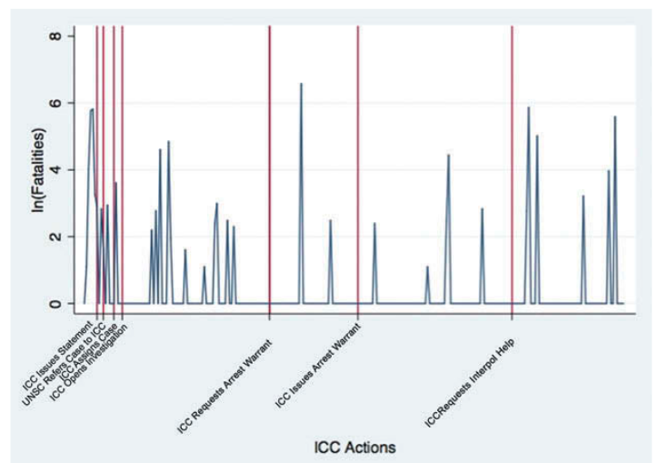
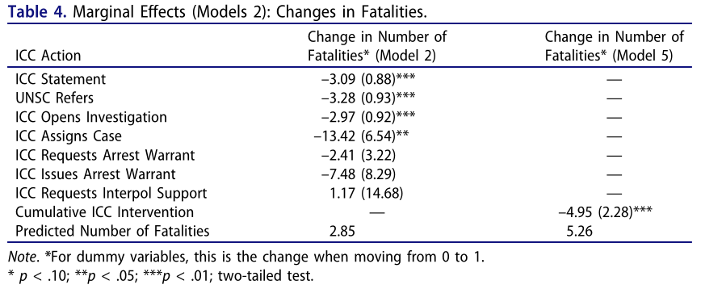
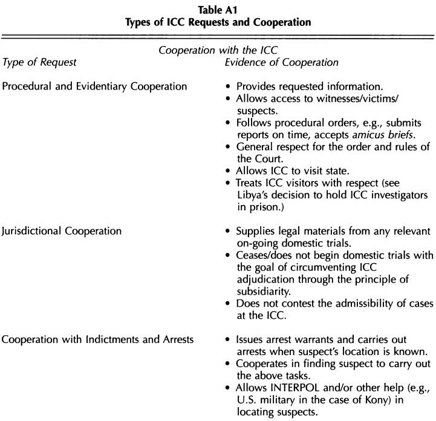
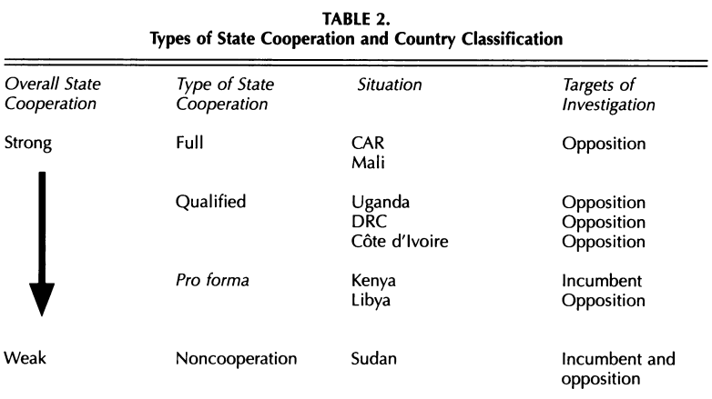

---
output:
  xaringan::moon_reader:
    css: ["default", "extra.css"]
    lib_dir: libs
    seal: false
    nature:
      highlightStyle: github
      highlightLines: true
      countIncrementalSlides: false
      ratio: '16:9'
---

```{r, echo = FALSE, warning = FALSE, message = FALSE}
library(tidyverse)
#library(readxl)
#library(stargazer)
#library(kableExtra)
#library(modelr)

knitr::opts_chunk$set(echo = FALSE,
                      eval = TRUE,
                      error = FALSE,
                      message = FALSE,
                      warning = FALSE,
                      comment = NA)
```

background-image: url('libs/Images/background-scales_justice_v3.png')
background-size: 105%
background-position: top
class: middle

.size45[**II. International Institutions for Mutual Restraint**]

<br>

.size50[**Today's Agenda: Effectiveness Analysis**

- The International Criminal Court (ICC)
]

<br>

.center[.size40[
  Justin Leinaweaver (Fall 2023)
]]

???

### Prep for Class
1. ?

<br>


---

background-image: url('libs/Images/background-blue_cubes_lighter3.png')
background-size: 100%
background-position: center
class: middle, center

.size55[**Treaty Design Analysis**]

.size40[**The Rome Statute of the ICC**]

<br>

.pull-left[
```{r, echo = FALSE, fig.align = 'center', out.width = '100%'}
knitr::include_graphics("libs/Images/02_2-Legalization_Fig1.png")
```
]

.pull-right[
```{r, echo = FALSE, fig.align = 'center', out.width = '100%'}
knitr::include_graphics("libs/Images/03_2-KLS_Table1.png")
```
]

???

### Key takeaways from last class on the design of the ICC?


---

background-image: url('libs/Images/background-blue_triangles_flipped.png')
background-size: 100%
background-position: center
class: middle

.size70[**Has the ICC been effective?**]

.size45[
1. Hillebrecht (2016) "The Deterrent Effects of the International Criminal Court: Evidence from Libya"

2. Hillebrecht & Straus (2017) "Who Pursues the Perpetrators? State Cooperation with the ICC"

]

???

For today you read the arguments to two attempts to evaluate the effectiveness of the ICC

<br>

*Split class in half, assign to each article*

Before I ask each group to diagram the argument in their paper, let's all agree on the end point of each, e.g. the conclusions.

### Groups, what is the key conclusion in your paper?
- (**SLIDE**)


---

background-image: url('libs/Images/background-blue_cubes_lighter3.png')
background-size: 100%
background-position: center
class: middle

.size70[**Has the ICC been effective?**]

<br>

.size45[
1. Hillebrecht (2016): ICC involvement in a conflict reduces "the level of mass atrocities committed" 

2. Hillebrecht & Straus (2017): State leaders consider domestic politics and international costs when deciding whether or not to cooperate with the ICC 
]

???

Ok, groups I want you to diagram the model that explains this conclusion us on the board!

<br>

### Questions on your job?

Get to it!


---

background-image: url('libs/Images/background-blue_cubes_lighter3.png')
background-size: 100%
background-position: center
class: middle

.size70[**Has the ICC been effective?**]

<br>

.size45[
1. **Hillebrecht (2016): ICC involvement in a conflict reduces "the level of mass atrocities committed"**

2. Hillebrecht & Straus (2017): State leaders consider domestic politics and international costs when deciding whether or not to cooperate with the ICC
]

???

Group 1 present Hillebrecht (2016) argument.

- (**SLIDE**: My version)


---

background-image: url('libs/Images/background-blue_cubes_lighter3.png')
background-size: 100%
background-position: center
class: middle

.center[.size30[.content-box-white[**Hillebrecht (2016): Model to Test**]]]

.size30[
- Deterrence of human rights abuses depends on "the likelihood of accountability, rather than the severity of the punishment" (624)

- The likelihood of accountability depends on "the willingness and ability of domestic and international actors to turn suspected war criminals over to the ICC" (624)

- The likelihood of accountability depends on the international community providing "the political and financial capital needed to initiate, investigate, and try cases at the ICC" (625).

- The likelihood of accountability depends on the ICC making "it clear that
investigations and trials will take place in a timely manner" (625).

Therefore, "Action at the ICC will lead to a decrease in the violence committed during a conflict, particularly government-sponsored killing of civilians" (626).
]

???

Premise 1
- The first chunk of this section (623-624 before "With those caveats in place") is an argument to support the first premise here.
- Hillebrecht is trying to convince you that deterrence comes from the likelihood of accountability NOT punishment
    - In other words, even if the ICC is hampered in a million ways from getting its hands on you it can still change your behavior.
    - The threat of prosecution for human rights violations has been increasing across time (at both domestic and international levels)
    - Each prosecution of a human rights abuser sets an important precedent that no one is above the law (rule of law) and human rights law will be enforced
    - "the domestic criminal justice literature has found increasing support for the deterrent effect of criminal accountability"

Premise 2
- "the number of states willing to host wanted war criminals is shrinking"
- "Moreover, transfer to The Hague might be preferable to facing punishment at home, as Qaddafi’s own death later went on to show."
- States must show they are willing to allow their own citizens to be prosecuted
- States must also not shield "allies and trading partners"

Premise 3

Premise 4
- Only three judgements so far (2016), it is picking up the pace more recently

<br>

### What do we think of the model?

### - Is it logical?

### - Is it convincing?

### - How do we use this model to make predictions in the world?

<br>

**SLIDE**: Quick trip through the data analysis starting with the source of the data!


---

background-image: url('libs/Images/background-blue_cubes_lighter3.png')
background-size: 100%
background-position: center
class: middle

.center[.size35[.content-box-white[**Hillebrecht (2016): 1) Sources & 2) Operationalizations**]]]

.size35[
**Outcome Variables**
- The number of government-sponsored fatalities accumulated per day (Armed Conflict Location and Event Dataset, ACLED)

**Predictor Variables**
1. ICC Actions in Libya
    - 7 separate dummies
2. ICC Actions (cumulative)
]

???

*Walk through the data collected and how it measured*

- "ACLED uses source materials from local, regional, national, and continental news media, NGO reports, and Africa-focused news reports" 628.
- "This means that while the victims could be considered combatants in other contexts, in these events they are noncombatants. The ACLED data are conservative in their counting for fatalities and only include numbers of fatalities when explicitly reported by their source materials. When sources conflict, ACLED uses the lower count."
- Footnote 10: "The ACLED data are conservative in their counting of civilian casualties, but this does not imply that it is a biased undercount. Rather, the ACLED data triangulate accounts of civilian deaths from a number of sources, thereby mitigating potential over- or undercounting biases that might result from only relying on major newspapers or local NGOs. The fact that ACLED is conservative in its counting of civilian casualities should make it even more likely to see an effect of the ICC on lowering the civilian casualty count" (628).
- ACLED also includes data on whether the perpetrator was a government agent or rebel (630).

7 dummies see table 1 (622)
- "(1) when the ICC issued a statement regarding the potential crimes against humanity in Libya, (2) when the UN Security Council referred the case to the ICC, (3) when the ICC opened the investigation, (4) when the ICC assigned the case to a chamber, (5) when the ICC requested that the chamber issue arrest warrants, (6) when the ICC issued the warrants, and (7) when the ICC asked INTERPOL for help with the arrests." (629) 
- OMITS: news briefing and "Libya’s receipt of the arrest warrants and subsequent meeting about the arrest warrants in June 2011 due to the redundancy of those events with aforementioned actions"

Cumulative
- "This cumulative measure is predicated on the idea that each of the ICC’s actions builds on previous actions. The ICC’s actions are sequential and path dependent, meaning that the ICC cannot, for example, issue arrest warrants without first getting a referral.


<br>

### Strengths and weaknesses of these data choices?

<br>

### What should we expect to see in the data if Hathaway (2007) is right?
- (**SLIDE**)


---

background-image: url('libs/Images/background-blue_cubes_lighter3.png')
background-size: 100%
background-position: center
class: middle

.center[.content-box-white[.size40[**Hillebrecht (2016): 3) Analysis**]]]

<br>

.pull-left[
```{r, echo = FALSE, fig.align = 'center', out.width = '100%'}

```
]

.pull-right[
```{r, echo = FALSE, fig.align = 'center', out.width = '100%'}

```
]

???

<br>

### Bottom line takeaways on the Hillebrecht (2016) piece?


---

background-image: url('libs/Images/background-blue_cubes_lighter3.png')
background-size: 100%
background-position: center
class: middle

.size70[**Has the ICC been effective?**]

<br>

.size45[
1. Hillebrecht (2016): ICC involvement in a conflict reduces "the level of mass atrocities committed"

2. **Hillebrecht & Straus (2017): State leaders consider domestic politics and international costs when deciding whether or not to cooperate with the ICC**
]

???

Hillebrecht & Straus (2017) group, take it away!

<br>

**SLIDE**: My version


---

background-image: url('libs/Images/background-blue_cubes_lighter3.png')
background-size: 100%
background-position: center
class: middle

.center[.size30[.content-box-white[**Hillebrecht & Straus (2017): Model to Test**]]]

.size35[
1. The International Legal Lasso: Cooperate if the ICC will indict your opposition

2. The Downstream Threat of Accountability: Cooperate if the ICC will investigate the opposition first

3. Potential Costs of Noncooperation: Cooperate if you depend on forreign aid, foreign direct investment, and international trade

Therefore, leaders consider ICC cooperation as a function of who specifically is being indicted / investigated and the potential international costs of noncooperation .
]

???

- "...the fundamental idea that political elites' cooperation with the ICC is predicated on their ability to balance the risk of being prosecuted themselves with their willingness to use cooperation to advance their own political agenda" (167).
- Cooperate with ICC to "remove or undermine their domestic opposition" and "advance their international reputation" (167)
    - signalling cooperation may also provide a "bargaining chip in trade deals and other multilateral or international negotiations" (167).
- Risks of cooperation: indictment, alienating domestic constituencies opposed to the court

Premise 1: All the international benefits of cooperation + a domestic windfall! (169)
- H1 and H2 are two sides of the same coin

Premise 2
- If the ICC is involved, odds are, bad acts committed by both sides.
- Cooperation heightens the risk of future accountability
    - 1) ICC sets up a field office, conduct investigations, and get testimony from witnesses and victims which may uncover your bad deeds
    - 2) "the precedent of cooperation with the ICC raises expectations about accountability among domestic and international audiences" for when the ICC comes knocking for you later
- "Given the slowness and vagaries of international justice, putting members of the opposition on trial first buys ruling elites years of immunity" (170).

Premise 3
- "Despite its challenges, the ICC has become a flagship institution of the international human rights infrastructure, and cooperating with the ICC is a signal of states' commitments to human rights and the rule of law" (171).
- "For small and medium power states to increase their stature and influence, whether that means economically, militarily, or socioculturally, they need to play by certain international norms and expectations" (171).

Section IV also has some interesting material on the ICC as a strategic actor although it doesn't lead to a hypothesis.

<br>

### What do we think of the model?

### - Is it logical?

### - Is it convincing?

### - How do we use this model to make predictions in the world?

<br>

**SLIDE**: Let's examine the data analyses


---

background-image: url('libs/Images/background-blue_cubes_lighter3.png')
background-size: 100%
background-position: center
class: middle

.center[.size25[.content-box-white[**Hillebrecht & Straus (2017): 1) Sources & 2) Operationalizations**]]]

```{r, echo = FALSE, fig.align = 'center', out.width = '55%'}

```

???

The DV operationalized

Cooperation with the ICC in three areas
1. Procedural and evidentiary: "...means that states provide the Court with the information it requires, allows access to victims, facilitates and protects ICC personnel conducting field visits, and generally follows the orders and timeframe set by the Court" (173).
2. Jurisdictional: "this entails accepting the jurisdiction of the Court and not starting or continuing domestic trials with the goal of circumventing the ICC's authority" (173).
3. Practical cooperation with indictments and arrests: "This means issuing arrest warrants and carrying out arrests when a suspect's location is known and/or allowing INTERPOL or other relevant agencies to carry out these tasks" (173).

Level of cooperation in each area
1. "Full": "the state fulfills the vast majority of the ICC's requests..."
2. "Qualified": "...the state cooperates up until a certain point but has a set of nonnegotiable issues on which it will not yield. Often these are of a practical or jurisdictional nature."
3. "Pro forma": "...the state does the minimum to approximate cooperation and poses
technical challenges to cooperation. States exhibiting pro forma cooperation
couch their behavior within the language and processes of the Court, often
using legal technicalities to limit their cooperation. They typically cooper-
ate on procedural matters but seek to block the Court from exercising full
jurisdictional authority." 
4. "noncooperation" or rejection: "...the state opts against cooperation and outwardly contests the ICC's work."

Authors acknowledge the boundaries are "fuzzy"


---

background-image: url('libs/Images/background-blue_cubes_lighter3.png')
background-size: 100%
background-position: center
class: middle

.center[.size25[.content-box-white[**Hillebrecht & Straus (2017): 1) Data Sources & 2) Operationalizations**]]]

<br>

```{r, echo = FALSE, fig.align = 'center', out.width = '75%'}

```

???

Discuss measuring "opposition" vs "incumbent"

<br>

Discuss using these case studies as a test of the hypotheses (176-185)

In class split up the cases and present each?

<br>

### Bottom line takeaways on the Hillebrecht & Straus (2017) piece?


---

background-image: url('libs/Images/background-blue_triangles_flipped.png')
background-size: 100%
background-position: center
class: middle

.size70[**Has the ICC been effective?**]

.size45[
1. Hillebrecht (2016) "The Deterrent Effects of the International Criminal Court: Evidence from Libya"

2. Hillebrecht & Straus (2017) "Who Pursues the Perpetrators? State Cooperation with the ICC"

]

???

### So, bottom line, has the ICC "worked"? Is it an effective institution? Why or why not?

<br>

### How does the ICC compare to the effectiveness of the CAT?


---

background-image: url('libs/Images/background-blue_cubes_lighter3.png')
background-size: 100%
background-position: center
class: middle

Update to paper 2 prompt

Groups pick their IO and submit evidence to help you answer the "Why did we "need" this international organization?"

Paper 2 - IO Design Analysis
- 1) Why did we "need" this international organization? 2) In what specific ways was the foundational treaty of your selected international organization designed to provide the "benefits" of delegation? Be sure to consider PA theory, legalization and the rational design literatures. 3) Argue: Based on its design how likely is it to be effective?


.size50[**Paper 1 - Treaty Design Analysis**]

.size40[
1. Why did we "need" this piece of international law? Why is it important? To whom?
2. What specifically does it do? Classify using legalization and the rational design conjectures
3. Based on its design how likely is it to be effective?
]

???


---

background-image: url('libs/Images/background-blue_triangles.jpg')
background-size: 100%
background-position: center
class: middle

.size70[**Next Class**]

.size50[
1. ???
]

???


