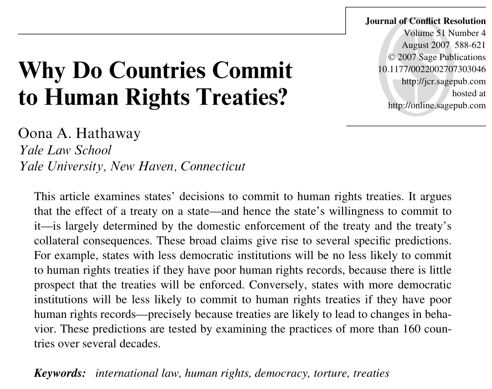
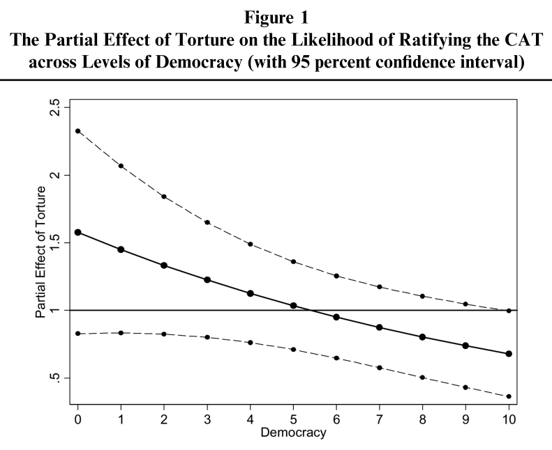
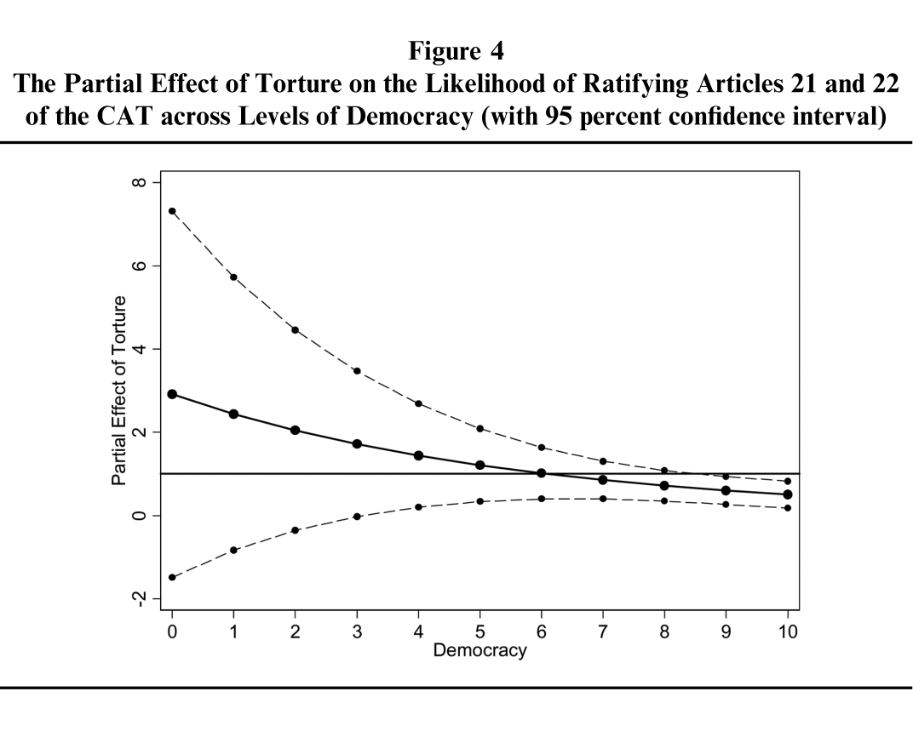
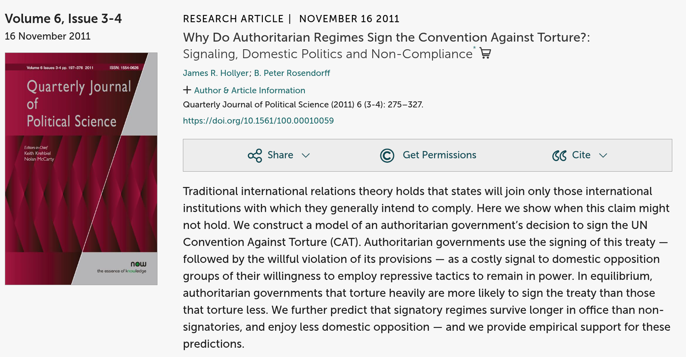
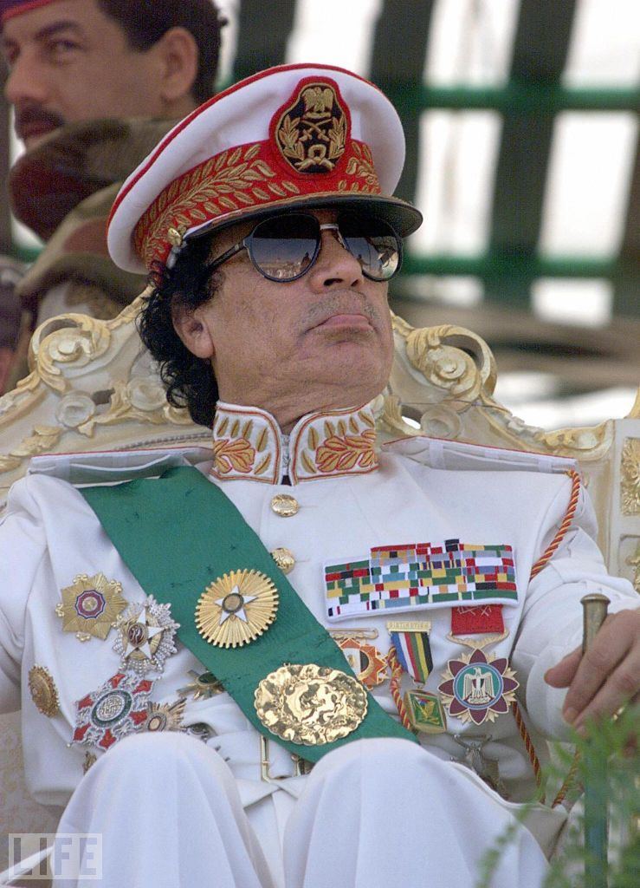
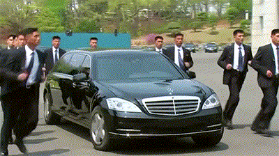
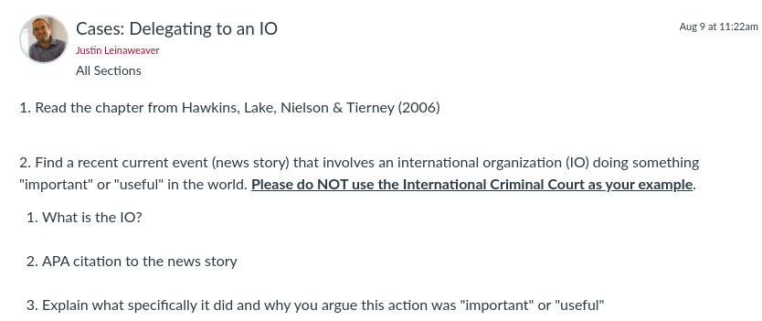

## Today's Agenda {background-image="./Images/background-scales_justice_v3.png" .center}

```{r}
# background-size="1920px 1080px"
library(tidyverse)
library(readxl)
```

<br>

**Section 2: How effective have international institutions been in reducing the use of torture by governments around the world?**

- Hollyer & Rosendorff (2011) "Why Do Authoritarian Regimes Sign the Convention Against Torture? Signaling, Domestic Politics and Non-Compliance"

<br>

::: r-stack
Justin Leinaweaver (Fall 2026)
:::

::: notes

**Prep for Class**

1. Check Canvas submissions

<br>

**SLIDE**: Our plan in Section 2 of the class

:::


## {background-image="./Images/background-scales_justice_v3.png" .center}

**How effective have international institutions been in reducing the use of torture by governments around the world?**

- [Week 6: Defining and Measuring the Outcome]{style="color:gray;"}

- [Week 7: The Convention Against Torture (CAT)]{style="color:gray;"}

- **Week 8: Explaining the Effect of the CAT on Torture**

- [Week 9: The International Criminal Court (ICC)]{style="color:gray;"}

- [Week 10: Can the ICC help us reduce global torture?]{style="color:gray;"}

- [Week 11: Case Studies of ICC Effectiveness]{style="color:gray;"}

::: notes

Our focus in Section 2 is on answering this research question

- And our work this week is to engage with some of the research published on this topic

<br>

Anytime you are beginning a research project it is important to begin with the academic literature

<br>

You need to see how experts in the field:

- Define the key concepts,

- Design theories to answer the question,

- Locate and evaluate data, 

- Perform analyses to test their theories, and 

- Draw conclusions from all their work

<br>

The more good quality research you read, the better able you will be to perform good quality research!

<br>

**SLIDE**: Last class...

:::


## {background-image="./Images/background-scales_justice_v3.png" .center}

<br>

{style="display: block; margin: 0 auto"}

::: notes

Last class we dug into Oona Hathaway's (2007) research article that sought to explain why states choose to join human rights treaties like the Convention Against Torture

<br>

**Remind me, why does Hathaway frame joining the CAT as a puzzle?**

- (Because "they constitute the paradigmatic hard case...)

- ("Human rights treaties do not offer states any obvious reciprocal benefits...")

- ("It is much less obvious why a state would join an agreement that requires
it to provide fair trials when all the state explicitly receives in return is a reciprocal promise by other members to treat their own citizens with similar respect.")

<br>

**SLIDE**: The model

:::


## {background-image="./Images/background-scales_justice_v3.png" .center .smaller}

**Hathaway (2007): The Model**

<br>

**Interests**: 

- States will join human rights treaties whose benefits outweigh their costs

**Institutions**

- Domestic: States vary in whether non-state actors can enforce treaty rules and the powers of the executive

- International: No meaningful external enforcement

**Interactions**

- Domestic enforcement capacity matters for costs and benefits

- Domestic collateral consequences matter for costs and benefits

- Transnational collateral consequences matter for costs and benefits

::: notes

Ok, refresh my memory about the model

- **What does it mean to say that domestic enforcement capacity matters?**

    - (If domestic actors can punish you for bad behavior then you will be hesitant to sign up to new rules)

- **What does it mean to say that domestic collateral consequences matters?**

    - (More diluted power as the executive, more likely to join)
    - (More NGOs, more pressure to join)

- **What does it mean to say that transantional collateral consequences matters?**

    - (Regional pressure matters)
    - (New states may join to bolster their image as good actors)
    - (Perverse incentive: Bad states more likely to join because no fear of bad consequences!)

<br>

**What do we like about this model?**

<br>

**Any concerns with the logic or mechanisms in the model?**

- **Is she leaving anything obvious out that bears on this question?**

<br>

**Remind me, what did Hathaway find in her analysis?**

- **Did the CAT work?**

- (**SLIDE**)

:::


## {background-image="./Images/background-scales_justice_v3.png"}

{.absolute width="550" left=0 top=0}

{.absolute width="550" right=0 bottom=0}

::: notes

1. Dictatorships who use torture are MORE likely to ratify the CAT (+40%)

2. Democracies that don't torture are LESS likely to ratify (-30%)

3. Same general trends focused on Art 20 and Art 21 but weaker effects

<br>

Hathaway's argument pushes us to think about the complexity of answering questions about treaty participation and effectiveness: 

- State actions towards human rights treaties depend on Treaty design x domestic politics x international politics

<br>

The good news is that this model suggests treaties can influence behavior without international enforcement

<br>

The bad news is that depending on domestic enforcement means creating weird incentives

- Bad states can happily join and celebrate a human rights treaty with little to fear from being bad

- Good states will be reticent to join for fear that they will end up losing some sovereignty on an issue they already are working on!

<br>

**SLIDE**: We need more research on this topic!

:::


## {background-image="./Images/background-scales_justice_v3.png" .center}

<br>

{style="display: block; margin: 0 auto"}

::: notes

Mirror approach from last class

- Question

- Where is the theory?

- Who are the interests? institutions? interactions?


Hollyer & Rosendorff (2011) aim to continue what Hathaway started.

<br>

This paper builds what is referred to as a formal model 

- Formal modeling is a way of turning theoretical arguments into mathematical proofs.

- In essence, these are an attempt to present social science models using mathematical proofs

- Benefit: Incredibly clear specification of the components and mechanisms in the model, often helps to identify implications

- Drawbacks: Often complicated, may be misleading 

<br>

We won't step through the whole model because it gets super complicated and isn't important for our purposes today.

- **SLIDE**: However, we should step through the basics of the formal model together.

<br>

**OLD Notes**

Conclusion: Dictators join the CAT to make torture a more effective strategy!

- Domestic opposition works to overthrow the government
- Dictators use torture to repress the opposition (survive)
- Torture is a costly strategy for political survival
- Global CAT participation makes it much harder to torture and leave (escape to exile)
    - Art. 4: torture = crime in all CAT states
    - Art. 5: CAT states must arrest you
    - Art. 6 & 8: CAT states must extradite you
- Signing the CAT (and using torture) signals the opposition you can never leave ("strong type") 

Therefore, dictators join the CAT to make torture a more effective strategy!

<br>

This is what Jim Vreeland calls the "badass" theory of torture.

:::


## {background-image="./Images/background-scales_justice_v3.png" .center}

[**H&R's Formal Model: Actors**]

:::: {.columns}
::: {.column width="50%"}
**The Government (G)**

{style="display: block; margin: 0 auto"}
:::

::: {.column width="50%"}
**The Opposition (D)**

{style="display: block; margin: 0 auto"}
:::
::::

::: notes

Two actors in the model: Government (G) and Opposition (D)

<br>

**What does each actor want?**

- (The benefits of holding office! e.g. the office-seeking assumption)

<br>

So, the leader wants to keep office and the opposition want to replace him.

<br>

Why is everybody so dead set on controlling the government?

- **SLIDE**: Importantly and interestingly, the model breaks these benefits into two parts.

:::


## {background-image="./Images/background-scales_justice_v3.png" .center}

[**H&R's Formal Model: Interests**]

:::: {.columns}
::: {.column width="50%"}
**Benefits of office (C)**

{style="display: block; margin: 0 auto"}
:::

::: {.column width="50%"}
**Value of office (R)**

{style="display: block; margin: 0 auto"}
:::
::::

::: notes

All office holders receive two distinct sets of rewards

1. The benefits of holding office ('C') e.g. Money!

    - Salary for holding office
    - Ability to reward supporters with jobs, 
    - Ability to control resources
    - Ability to extract bribes, 
    - etc.

2. The value of holding onto office ('R') e.g. Security!

    - ability to protect yourself and supporters by controlling state and military

<br>

So, hold office and extract rewards both in terms of money and and in terms of control.

- **SLIDE**: Now let's talk interactions!

:::


## {background-image="./Images/background-scales_justice_v3.png" .center}

[**H&R's Formal Model: Interactions**]

<br>

Each round the government survives based on the level of torture and opposition effort applied:

$\pi(t,e) = \frac{t}{t+e}$

::: notes

The leader wants to keep control of the government and the opposition wants to replace him.

<br>

This model simplifies this contest for control into two choices:

- The leader gets to choose how much torture to use each round to maintain control, and

- The opposition chooses how much effort (risk) to take on in the round trying to remove the leader

<br>

This formula reflects the interaction and estimates the likelihood of political survival given a set level of torture and a set level of opposition.

<br>

**SLIDE**: Let's explore this relationship visually

:::


## {background-image="./Images/background-scales_justice_v3.png" .center}

:::: {.columns}
::: {.column width="50%"}

<br>

$\pi(t,e) = \frac{t}{t+e}$

:::

::: {.column width="50%"}
```{r, fig.retina=3, fig.align='center', fig.asp=.65, out.width = '95%', cache=FALSE}
tibble(
  Torture = c(rep(0, 8)),
  Opposition = rep(1:8, 1),
  Probability = Torture / (Torture + Opposition)
) %>%
  ggplot(aes(x = Opposition, y = Probability, color = factor(Torture))) +
  geom_point() +
  geom_line() +
  theme_bw() +
  coord_cartesian(ylim = c(0, 1)) +
  scale_y_continuous(labels = scales::percent_format()) +
  scale_x_continuous(breaks = 1:8) +
  labs(x = "Level of Opposition Effort to Remove the Government", 
       y = "Probability of Keeping Office", 
       title = "Hollyer and Rosendorff's (2011) Model of CAT Signature",
       color = "") +
  scale_color_manual(values = c("darkgreen")) +
  guides(color = "none") +
  annotate("text", x = 2, y = .1, label = "Torture = 0", color = "darkgreen", size = 5)
```
:::
::::

::: notes

Here we see a visualization of the likelihood of keeping your office in this model if you choose not to torture anybody this round.

- Clearly this shows that ANY level of opposition effort will be enough to remove you from office (0% chance to keep office).

<br>

**Does this make sense?**

<br>

Clearly a simplification of reality, but let's see if this helps us think about this dynamic.

:::


## {background-image="./Images/background-scales_justice_v3.png" .center}

:::: {.columns}
::: {.column width="50%"}

<br>

$\pi(t,e) = \frac{t}{t+e}$

:::

::: {.column width="50%"}
```{r, fig.retina=3, fig.align='center', fig.asp=.65, out.width = '95%', cache=FALSE}
# Torture 0 vs 1
tibble(
  Torture = c(rep(0, 8), rep(1,8)),
  Opposition = rep(1:8, 2),
  Probability = Torture / (Torture + Opposition)
) %>%
  ggplot(aes(x = Opposition, y = Probability, color = factor(Torture))) +
  geom_point() +
  geom_line() +
  theme_bw() +
  coord_cartesian(ylim = c(0, 1)) +
  scale_y_continuous(labels = scales::percent_format()) +
  scale_x_continuous(breaks = 1:8) +
  labs(x = "Level of Opposition Effort to Remove the Government", 
       y = "Probability of Keeping Office", 
       title = "Hollyer and Rosendorff (2011)",
       color = "") +
  scale_color_manual(values = c("darkgreen", "orange")) +
  guides(color = "none") +
  annotate("text", x = 2, y = .1, label = "Torture = 0", color = "darkgreen", size = 5) +
  annotate("text", x = 7, y = .2, label = "Torture = 1", color = "orange3", size = 5)
```
:::
::::

::: notes

Here we see the effect of increasing your torture level to just '1.'

<br>

**Per this visualization, what is your likelihood of keeping office if you torture at a level of '1' and the opposition risks '1' to remove you?**

- (50% chance of survival!)

<br>

**And if the opposition raises their level to an effort of '3'?**

- (Cuts your chances in half! 25% chance of survival!)

:::


## {background-image="./Images/background-scales_justice_v3.png" .center}

:::: {.columns}
::: {.column width="50%"}

<br>

$\pi(t,e) = \frac{t}{t+e}$

:::

::: {.column width="50%"}
```{r, fig.retina=3, fig.align='center', fig.asp=.65, out.width = '95%', cache=FALSE}
# Torture 0 vs 1 vs 5
tibble(
  Torture = c(rep(0, 8), rep(1,8), rep(5,8)),
  Opposition = rep(1:8, 3),
  Probability = Torture / (Torture + Opposition)
) %>%
  ggplot(aes(x = Opposition, y = Probability, color = factor(Torture))) +
  geom_point() +
  geom_line() +
  theme_bw() +
  coord_cartesian(ylim = c(0, 1)) +
  scale_y_continuous(labels = scales::percent_format()) +
  scale_x_continuous(breaks = 1:8) +
  labs(x = "Level of Opposition Effort to Remove the Government", 
       y = "Probability of Keeping Office", 
       title = "Hollyer and Rosendorff (2011)",
       color = "") +
  scale_color_manual(values = c("darkgreen", "orange", "red")) +
  guides(color = "none") +
  annotate("text", x = 2, y = .1, label = "Torture = 0", color = "darkgreen", size = 5) +
  annotate("text", x = 7, y = .2, label = "Torture = 1", color = "orange3", size = 5) +
  annotate("text", x = 7, y = .5, label = "Torture = 5", color = "red", size = 5)
```
:::
::::

::: notes

Here we see the effect of increasing your torture level to a mid-level on the scale ('5').

<br>

**Per this viz, what does a torture level of '5' vs an opposition effort of '1' get you?**

- (A better than 80% chance of survival)

<br>

**And if they match your torture with effort? 5 vs 5?**

- (Back to a 50-50 coin flip)

:::


## {background-image="./Images/background-scales_justice_v3.png" .center}

:::: {.columns}
::: {.column width="50%"}

<br>

$\pi(t,e) = \frac{t}{t+e}$

:::

::: {.column width="50%"}
```{r, fig.retina=3, fig.align='center', fig.asp=.65, out.width = '95%', cache=FALSE}
# Torture 0 vs 1 vs 5 vs 9
tibble(
  Torture = c(rep(0, 8), rep(1,8), rep(5,8), rep(9,8)),
  Opposition = rep(1:8, 4),
  Probability = Torture / (Torture + Opposition)
) %>%
  ggplot(aes(x = Opposition, y = Probability, color = factor(Torture))) +
  geom_point() +
  geom_line() +
  theme_bw() +
  coord_cartesian(ylim = c(0, 1)) +
  scale_y_continuous(labels = scales::percent_format()) +
  scale_x_continuous(breaks = 1:8) +
  labs(x = "Level of Opposition Effort to Remove the Government", 
       y = "Probability of Keeping Office", 
       title = "Hollyer and Rosendorff (2011)",
       color = "") +
  scale_color_manual(values = c("darkgreen", "orange", "red", "darkred")) +
  guides(color = "none") +
  annotate("text", x = 2, y = .1, label = "Torture = 0", color = "darkgreen", size = 5) +
  annotate("text", x = 7, y = .2, label = "Torture = 1", color = "orange3", size = 5) +
  annotate("text", x = 7, y = .48, label = "Torture = 5", color = "red", size = 5) +
  annotate("text", x = 7, y = .65, label = "Torture = 9", color = "darkred", size = 5)
```
:::
::::

::: notes

**According to the model, why not increase torture way beyond what you think the opposition will do?**

<br>

**What is happening here? Why is the effect of continuously increasing torture having smaller returns?**

<br>

Torture Problem 1

- Probability capped at 100% and no strategy guarantees success

- Here we start to see the upper threshold of the effect.
    - The moves from 0 to 1 and 1 to 5 were BIG
    - The move from 5 to 9 is much smaller
    
- In other words, increasing torture forever doesn't guarantee survival

:::


## {background-image="./Images/background-scales_justice_v3.png" .center}

```{r, fig.retina=3, fig.align='center', fig.asp=.85, out.width = '70%', fig.width=6, cache=FALSE}
# Benefits vs torture
x1 <- tibble(
  Benefits = 5,
  Torture = 1:9,
  Total = Benefits - Torture,
  classified = case_when(
    Total < 0 ~ "low",
    Total > 0 ~ "high")
) 

x1 %>%
  ggplot(aes(x = Torture, y = Total, color = classified)) +
  geom_point(size = 3) +
  geom_line(size = 1.2) +
  theme_bw() +
  labs(x = "Level of Torture", y = "Benefits from Holding Office",
       title = "Benefits of Torture", subtitle = "Remember: Stay in office only if benefits - costs > 0") +
  scale_x_continuous(breaks = 1:9) +
  scale_y_continuous(breaks = seq(-5, 5, 2)) +
  ylim(-4, 4) +
  geom_hline(yintercept = 0, color = "darkred", linetype = "dashed") +
  guides(color = "none") +
  scale_color_manual(values = c("blue", "red"))
```

::: notes

Torture Problem 2

- Here we visualize the trade-off between the level of torture you choose and the benefits of office you receive.

- The x-axis is your level of torture

- The y-axis is the level of benefits you extract from the country as the leader

<br>

**What does this show us?**

<br>

Torture is an expensive strategy!

1. The more it is used, the more anger/opposition generated in the public

    - Systems with extensive torture unlikely to have thriving communities and economies (see DPRK)
    
    - Being the leader of a rich country is fun, being the leader of an impoverished and angry country is less so

2. The more it is used, the more violent/callous/dangerous the security services tend to become which makes them harder to control

<br>

In sum, as you increase the torture level you have to pay for it and those costs reduce the benefits you get for being the leader!

<br>

**Make sense?**

:::


## {background-image="./Images/background-scales_justice_v3.png" .center}

[**H&R's Formal Model: Costs vs Benefits**]

:::: {.columns}
::: {.column width="50%"}
```{r, fig.retina=3, fig.align='center', fig.asp=.9, out.width = '100%', fig.width=6, cache=TRUE}
# Torture 0 vs 1 vs 5 vs 9
tibble(
  Torture = c(rep(0, 8), rep(1,8), rep(5,8), rep(9,8)),
  Opposition = rep(1:8, 4),
  Probability = Torture / (Torture + Opposition)
) %>%
  ggplot(aes(x = Opposition, y = Probability, color = factor(Torture))) +
  geom_point() +
  geom_line() +
  theme_bw() +
  coord_cartesian(ylim = c(0, 1)) +
  scale_y_continuous(labels = scales::percent_format()) +
  scale_x_continuous(breaks = 1:8) +
  labs(x = "Level of Opposition Effort to Remove the Government", 
       y = "Probability of Keeping Office", 
       title = "Hollyer and Rosendorff (2011)",
       color = "") +
  scale_color_manual(values = c("darkgreen", "orange", "red", "darkred")) +
  guides(color = "none") +
  annotate("text", x = 2, y = .1, label = "Torture = 0", color = "darkgreen", size = 5) +
  annotate("text", x = 7, y = .2, label = "Torture = 1", color = "orange3", size = 5) +
  annotate("text", x = 7, y = .48, label = "Torture = 5", color = "red", size = 5) +
  annotate("text", x = 7, y = .65, label = "Torture = 9", color = "darkred", size = 5)
```
:::

::: {.column width="50%"}
```{r, fig.retina=3, fig.align='center', fig.asp=.9, out.width = '100%', fig.width=6, cache=TRUE}
# Benefits vs torture
x1 <- tibble(
  Benefits = 5,
  Torture = 1:9,
  Total = Benefits - Torture,
  classified = case_when(
    Total < 0 ~ "low",
    Total > 0 ~ "high")
) 

x1 %>%
  ggplot(aes(x = Torture, y = Total, color = classified)) +
  geom_point(size = 3) +
  geom_line(size = 1.2) +
  theme_bw() +
  labs(x = "Level of Torture", y = "Benefits from Holding Office",
       title = "Benefits of Torture without CAT", subtitle = "Remember: Stay in office only if benefits - costs > 0") +
  scale_x_continuous(breaks = 1:9) +
  scale_y_continuous(breaks = seq(-5, 5, 2)) +
  ylim(-4, 4) +
  geom_hline(yintercept = 0, color = "darkred", linetype = "dashed") +
  guides(color = "none") +
  scale_color_manual(values = c("blue", "red"))
```
:::
::::

::: notes

Now, we put these two pieces together

- On the left we see how torture and opposition effort combine to predict the likelihood of staying in office

- On the right we see a visualization of the trade-off between the level of torture you choose and the benefits of office you receive.

<br>

**So, per the plot on the right what levels of torture are worth it for a leader who is NOT a CAT participant?**

- (4 and lower)

<br>

**And what do we think happens to the line on the right if you ratify the CAT?** 

- (**SLIDE**)

:::


## {background-image="./Images/background-scales_justice_v3.png" .center}

[**H&R's Formal Model: Costs vs Benefits**]

:::: {.columns}
::: {.column width="50%"}
```{r, fig.retina=3, fig.align='center', fig.asp=.9, out.width = '100%', fig.width=6, cache=FALSE}
# Torture 0 vs 1 vs 5 vs 9
tibble(
  Torture = c(rep(0, 8), rep(1,8), rep(5,8), rep(9,8)),
  Opposition = rep(1:8, 4),
  Probability = Torture / (Torture + Opposition)
) %>%
  ggplot(aes(x = Opposition, y = Probability, color = factor(Torture))) +
  geom_point() +
  geom_line() +
  theme_bw() +
  coord_cartesian(ylim = c(0, 1)) +
  scale_y_continuous(labels = scales::percent_format()) +
  scale_x_continuous(breaks = 1:8) +
  labs(x = "Level of Opposition Effort to Remove the Government", 
       y = "Probability of Keeping Office", 
       title = "Hollyer and Rosendorff (2011)",
       color = "") +
  scale_color_manual(values = c("darkgreen", "orange", "red", "darkred")) +
  guides(color = "none") +
  annotate("text", x = 2, y = .1, label = "Torture = 0", color = "darkgreen", size = 5) +
  annotate("text", x = 7, y = .2, label = "Torture = 1", color = "orange3", size = 5) +
  annotate("text", x = 7, y = .48, label = "Torture = 5", color = "red", size = 5) +
  annotate("text", x = 7, y = .65, label = "Torture = 9", color = "darkred", size = 5)
```
:::

::: {.column width="50%"}
```{r, fig.retina=3, fig.align='center', fig.asp=.9, out.width = '100%', fig.width=6, cache=FALSE}
# Benefits vs torture AFTER cat
tibble(
  Benefits = 5,
  Torture = 1:9,
  Total = Benefits + 1 - Torture,
  classified = case_when(
    Total < 0 ~ "low",
    Total > 0 ~ "high")
) %>%
  ggplot(aes(x = Torture, y = Total, color = classified)) +
  geom_point(size = 3) +
  geom_line(size = 1.2) +
  geom_point(data = x1, size = .5) +
  geom_line(data = x1, linewidth = .25) +
  theme_bw() +
  labs(x = "Level of Torture", y = "Benefits from Holding Office",
       title = "Benefits of Torture AFTER CAT", subtitle = "Remember: Stay in office only if benefits - costs > 0") +
  scale_x_continuous(breaks = 1:9) +
  scale_y_continuous(breaks = seq(-5, 5, 2)) +
  ylim(-4, 4) +
  geom_hline(yintercept = 0, color = "darkred", linetype = "dashed") +
  guides(color = "none") +
  scale_color_manual(values = c("blue", "red"))
```
:::
::::

::: notes

Ratifying the CAT increases the value of holding office!

- You NEED to security benefits of leadership more if you ratify the CAT and keep torturing

<br>

A dictator who uses torture and gets overthrown is definitely in mortal danger if he stays in his country.

- This is why dictators often try to flee just ahead of the mob.

<br>

HOWEVER, if you ratify the CAT and continue to torture you have fewer options to flee to!

- A dictator who ratifes the CAT and uses torture can't safely leave the country for fear of being arrested and sent to the ICC

<br>

Ratifying the CAT and using torture binds your hands as a dictator.

- Your choices become to either 1) torture more, 2) be killed by your people or 3) go to jail

- Given those choices, torture offers the best chance of success!

<br>

SO, according to this model, ratifying the CAT should make "bad" governments use MORE torture!

- More torture reduces the BENEFITS of office (money) BUT increases the VALUE of office (security)

<br>

**Does this make sense?**

:::


## {background-image="./Images/06_1-CAT_Convention1_blurred_filtered.png" .center}

[**The Convention Against Torture (CAT) (1984)**]

<br>

[Per Hollyer & Rosendorff (2011), has the CAT been effective?]

::: notes

**Group 3, what is H&R's answer to the question?**

<br>

The worst dictators know that ratifying the CAT makes it impossible for them to give up power.

- So they do it to send a signal to their people that they are NEVER leaving.

- Ratifying the CAT becomes a visible, costly signal to your people that they will have to kill you to get rid of you

<br>

This is why Jim Vreeeland refers to this as the "badass theory of torture."

- The CAT, in essence, empowers the worst leaders around the world to commit to doing horrible things to stay in office.

<br>

**Scary right?**

<br>

**OLD NOTES**

Three testable implications of the model (p295)

1. "the most severe torturers" will sign the CAT
    - Fig 1 p298
    - More torture, more likely to sign CAT

2. authoritarian CAT signatories higher prob of survival than non-signatories
    - Fig 2 p306
    - Dark line shows risk of losing office for signatories, line is much, much lower than that for non-signatories

3. Opposition effort declines on CAT signing
    - The data here is much tougher to unpack...
    
:::


## {background-image="./Images/background-scales_justice_v3.png" .center}

[**Has the CAT reduced torture?**]

<br>

1. Hathaway (2007) "Why Do Countries Commit to Human Rights Treaties?"

2. Vreeland (2008) "Political Institutions and Human Rights: Why Dictatorships Enter into the United Nations Convention Against Torture"

3. Hollyer & Rosendorff (2011) "Why Do Authoritarian Regimes Sign the Convention Against Torture? Signaling, Domestic Politics and Non-Compliance"

::: notes

**So, bottom line, has the CAT worked to reduce torture? Is it an effective institution? Why or why not?**

:::


## For Next Class {background-image="./Images/background-scales_justice_v3.png" .center}

{style="display: block; margin: 0 auto"}

::: notes

**Questions on the assignment?**

:::