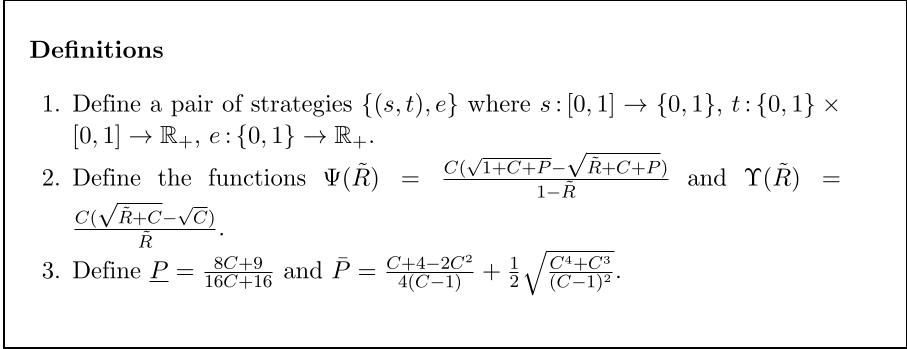
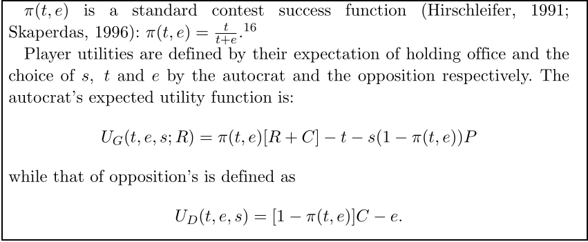
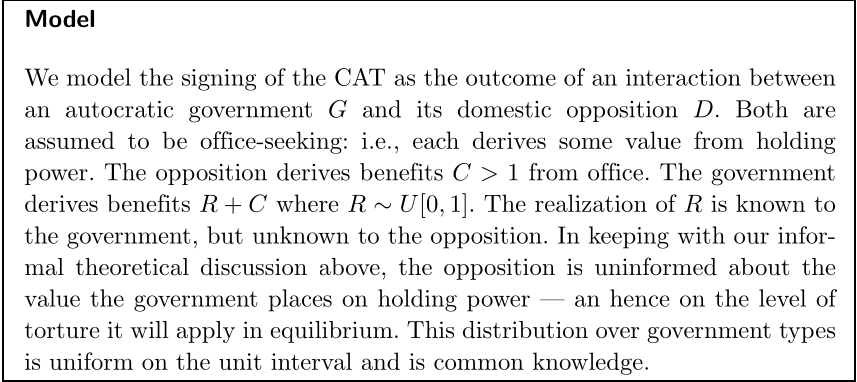
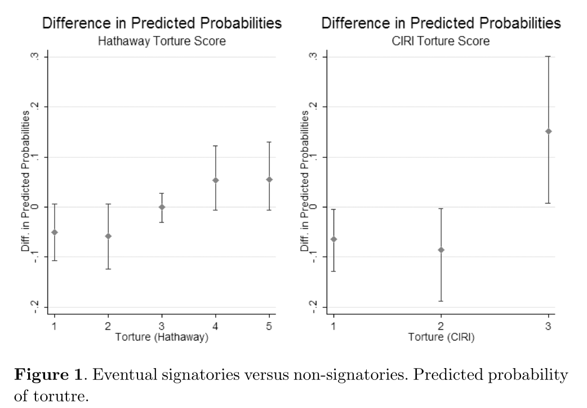
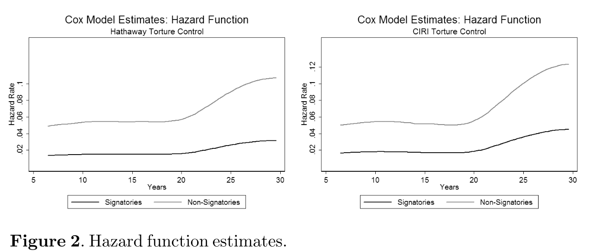
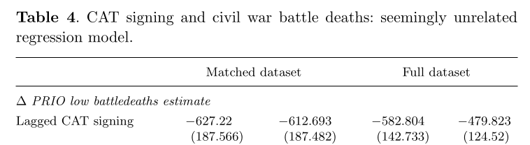

## Today's Agenda {background-image="./Images/background-scales_justice_v3.png" .center}

```{r}
# background-size="1920px 1080px"
library(tidyverse)
library(readxl)
```

<br>

**Section 2: How effective have international institutions been in reducing the use of torture by governments around the world?**

- Hollyer & Rosendorff (2011) "Why Do Authoritarian Regimes Sign the Convention Against Torture? Signaling, Domestic Politics and Non-Compliance"

<br>

::: r-stack
Justin Leinaweaver (Fall 2026)
:::

::: notes

**Prep for Class**

1. Check Canvas submissions

<br>

**SLIDE**: Section 2 of our class has focused on answering this research question

:::


## {background-image="./Images/background-scales_justice_v3.png" .center}

**How effective have international institutions been in reducing the use of torture by governments around the world?**

- [Week 6: Defining and Measuring the Outcome]{style="color:gray;"}

- [Week 7: The Convention Against Torture (CAT)]{style="color:gray;"}

- **Week 8: Explaining the Effect of the CAT on Torture**

- [Week 9: The International Criminal Court (ICC)]{style="color:gray;"}

- [Week 10: Can the ICC help us reduce global torture?]{style="color:gray;"}

- [Week 11: Case Studies of ICC Effectiveness]{style="color:gray;"}

::: notes

Over the last two weeks we have dug deeply into both our outcome and predictor variables

- Outcome: Torture by governments around the world and across time, and 

- Predictor: The Convention Against Torture (1984)

<br>

This week we have shifted our focus to the academic literature

- Anytime you are beginning a research project it is important to begin with the academic literature

<br>

The literature will show you how experts in the field:

- Define the key concepts,

- Design theories to answer the question,

- Locate and evaluate data, 

- Perform analyses to test their theories, and 

- Draw conclusions from all their work

<br>

The more good quality research you read, the better able you will be to perform good quality research!

<br>

**SLIDE**: Last class...

:::


## {background-image="./Images/background-scales_justice_v3.png" .center}

<br>

{style="display: block; margin: 0 auto"}

::: notes

Last class we dug into Oona Hathaway's (2007) research article that sought to explain why states choose to join human rights treaties like the Convention Against Torture

<br>

**Remind me, why does Hathaway frame joining the CAT, or any human rights treaty, as a puzzle?**

- (Because "they constitute the paradigmatic hard case...)

- ("Human rights treaties do not offer states any obvious reciprocal benefits...")

- ("It is much less obvious why a state would join an agreement that requires
it to provide fair trials when all the state explicitly receives in return is a reciprocal promise by other members to treat their own citizens with similar respect.")

<br>

**SLIDE**: Hathaway (2007) offered us a model for answering this research question

:::


## {background-image="./Images/background-scales_justice_v3.png" .center .smaller}

**Hathaway (2007): The Model**

<br>

**Interests**: 

- States will join human rights treaties whose benefits outweigh their costs

**Institutions**

- Domestic: States vary in whether non-state actors can enforce treaty rules and the powers of the executive

- International: No meaningful external enforcement

**Interactions**

- Domestic enforcement capacity matters for costs and benefits

- Domestic collateral consequences matter for costs and benefits

- Transnational collateral consequences matter for costs and benefits

::: notes

**According to the model, what states should we expect to join human rights treaties?**

- Democracies with weaker executives will be more likely to join
    
- States with large NGO populations will be more likely to join
    
- States surrounded by states that join will be more likely to join
    
- New states may join to bolster their image as good actors
    
- Perverse incentive 1: Bad states more likely to join because no fear of bad consequences

    - e.g. no domestic or international punishments for bad behavior
    
<br>

**According to the model, what states should NOT be expected to join human rights treaties?**

- Democracies that torture, or see some value in targeted repression, should NOT join
    
- Perverse incentive 2: Good states afraid to join because fear of consequences or repercussions from added oversight (domestic and international)

<br>

**Given everything you've studied so far this semester about international law, what does this model do well? Is this the "game" of human rights law as you understand it?**

<br>

**What did the tests of this model show in the paper?**

- **Did Hathaway find support for her model in the empirical record?**

- (**SLIDE**)

:::


## {background-image="./Images/background-scales_justice_v3.png"}

{.absolute width="550" left=0 top=0}

{.absolute width="550" right=0 bottom=0}

::: notes

Finds clear support for the domestic enforcement capacity hypothesis

- Dictatorships who use torture are MORE likely to ratify the CAT (+40%)

- Democracies that don't torture are LESS likely to ratify (-30%)

<br>

The collateral consequence hypotheses also find some support

- NGO # (Fig 13, p610): Each 10 NGOs increase ratification by 1%-11%

- New states (Fig 14, p611): New states much more likely to ratify (+106% - 153%)

- Regional ratifiers (Fig 15, p612): Each 1% more ratification in your region, increase ratification for you by around 2% 

<br>

Hathaway's argument pushes us to think about the complexity of answering questions about treaty participation and effectiveness: 

- State actions towards human rights treaties depend on Treaty design x domestic politics x international politics

<br>

**SLIDE**: Good review, let's push forward!

:::


## {background-image="./Images/background-scales_justice_v3.png" .center}

<br>

{style="display: block; margin: 0 auto"}

::: notes

This article from Hollyer and Rosendorff is AWESOME

- It is going to push us to think much harder about how domestic politics complicates international problem-solving

- As I mentioned last class, you will quickly come to understand why Jim Vreeland refers to this as the badass theory of torture

<br>

**What is the RQ in this article article?**

- (Why do dictatorships bind themselves to human rights treaties with no intention of complying with them?)

<br>

**How and why do these authors suggest this is a puzzle?**

- (1. The rules of international law (especially the VCLT) say that treaties are to be obeyed (pacta sunt servanda))

- (2. Downs et al (1996) suggest states only join treaties whose rules they already meet)

- (3. Much research suggests that compliance failures are problems of design or management, not willful disobedience)

<br>

**SLIDE**: This paper builds what is referred to as a formal model 

:::


## {background-image="./Images/background-scales_justice_v3.png"}

::: {.r-fit-text}
**A Formal Model of Torture (Hollyer and Rosendorff 2011)**
:::

{.absolute width="500" right=0 bottom=0}

{.absolute width="500" right=280 bottom=150}

{.absolute width="500" left=0 top=100}

::: notes

Formal modeling is a way of turning theoretical arguments into mathematical proofs.

- Benefits: Incredibly clear specification of the components and mechanisms in the model, often helps to identify implications

- Costs: Frequently very complicated to disentangle and understand

- Costs: The math may lead to interesting conclusions that are as much about the formula you've designed as the theory you are proposing

    - Hard to tell if this is a mistake or a new theory (e.g., may be misleading)

<br>

Today we'll work together to extract the key elements of the model using the III method proposed by Frieden, Lake and Schultz (2009)

- **SLIDE**

:::


## {background-image="./Images/background-scales_justice_v3.png" .center}

**Hollyer & Rosendorff (2011): The Model**

<br>

**Interests**

- ?

::: notes

Our first job is to identify the interests in the model

- The interests refer to the actors whose decision-making the model is trying to explain

<br>

**Who are the primary actors making decisions in this model?**

- (**SLIDE**)

:::


## {background-image="./Images/background-scales_justice_v3.png" .center}

**Hollyer & Rosendorff (2011): The Model**

<br>

:::: {.columns}
::: {.column width="20%"}
**Interests:**
:::

::: {.column width="40%"}
**The Government (G)**

{width="250"}
:::

::: {.column width="40%"}
**The Opposition (D)**

{width="550"}
:::
::::

::: {.fragment}
**Preferences: Both actors are office-seekers**
:::

::: notes

Two actors in the model: Government (G) and Opposition (D)

<br>

**And what does each actor want?**

- (**REVEAL**: The benefits of holding office!)

<br>

This is what we refer to as the office-seeking assumption

- So, the leader wants to keep office and the opposition want to replace him.

<br>

Why is everybody so dead set on controlling the government?

- **SLIDE**: Let's talk institutions!

:::


## {background-image="./Images/background-scales_justice_v3.png" .center}

**Hollyer & Rosendorff (2011): The Model**

<br>

**Interests**

- The government (G) and opposition (D) are office-seekers

**Institutions**

- ?

::: notes

The institutions refer to the baseline rules in the system the actors are operating within

- Per FLS: "A set of rules, known and shared by the community, that structure political interactions in particular ways" (Frieden, Lake and Schultz 2026, 67).

<br>

Think about the rules or structures that Hollyer and Rosendorff emphasize in their model

- I know they throw a lot of stuff at you, but let's try to summarize what's going on

- **According to the theory and model, why do both actors want to be the leader?**

- Talk to the people around you and get ready to report back

<br>

(**SLIDE**: Let's start with the stakes)

:::


## {background-image="./Images/background-scales_justice_v3.png" .center}

**Hollyer & Rosendorff (2011): The Model**

<br>

:::: {.columns}
::: {.column width="24%"}
**Institutions:**
:::

::: {.column width="38%"}
**Benefits of office (C)**

{width="350"}
:::

::: {.column width="38%"}
**Value of office (R)**

{width="350"}

{width="350"}
:::
::::

::: notes

All office holders receive two distinct sets of rewards

<br>

**What are the benefits of holding office, e.g. the "C" in the model?**

- Salary for holding office

- Ability to reward supporters with jobs, 

- Ability to control resources

- Ability to extract bribes, 

<br>

**What is the value of holding office, e.g. the "R" in the model?**

- The key here is that this value is unknown by the opposition

- It represents a catch-all outside the financial incentives of controlling the state

- e.g. ability to protect yourself and supporters by controlling state and military?

- e.g. the ego boost of being in charge?

<br>

When analyzing dictators most theorists acknowledge some psychological rewards of being leader and this "R" is meant to represent them

- **Make sense?**

<br>

**SLIDE**: In the diagram

:::


## {background-image="./Images/background-scales_justice_v3.png" .center}

**Hollyer & Rosendorff (2011): The Model**

<br>

**Interests**

- The government (G) and opposition (D) are office-seekers

**Institutions**

- Holding office provides rewards to the leader (C + R) and to the opposition (C)

::: {.fragment}
- The opposition can try to remove the government from power (e)
:::

::: {.fragment}
- The government can use torture to repress the opposition (t)
:::

::: notes

Ok, let's identify more of the institutions in the model

<br>

**In this game, what are the options available to the opposition to pursue its goals?**

- (**REVEAL**: Organize to disrupt the government's control, e.g. protests, strikes, etc.)

    - "Similarly, the opposition may undertake costly efforts to remove the government" (289).

<br>

**In this game, what are the options available to the government to help it hold onto office?**

- (**REVEAL**: The government can torture the opposition!)

    - "In the contest for power, the government may — at positive cost — engage in repressive measures entailing human rights violations against the opposition" (289).

<br>

**If these are the tools available to them, why can't both sides protest and torture to their heart's content?**

- **What limits are there on torture and protest in the model?**

- (**SLIDE**)

:::


## {background-image="./Images/background-scales_justice_v3.png" .center}

**Interests**

- The government (G) and opposition (D) are office-seekers

**Institutions**

- Holding office provides rewards (G: C + R, D: C)

- The opposition can try to remove the government from power (e)

- The government can use torture to repress the opposition (t)

- Choosing opposition (e) or repression (t) carries costs

::: notes

These actions carry costs

- Policy actions are not free in the real world

<br>

For the opposition: Organizing and protesting are costly actions

- It can be very hard to SAFELY organize opposition in an autocracy

- It is risky then to show up and actually protest or fight

<br>

For the government: Using repression is costly

- Need to pay a police force willing to repress their fellow citizens

- Need to implement extensive monitoring systems to track the people

- Need jails to hold the opposition
    
<br>

AND the KEY thing to keep in mind here is that the costs of repression are paid of the benefits of office

- If you spend all your money on repression, that's less money for you!

<br>

Ok, last piece of the puzzle

- **What happens to the model if the autocratic leader joins the Convention Against Torture?**

- (**SLIDE**)

:::


## {background-image="./Images/background-scales_justice_v3.png" .center}

**Interests**

- The government (G) and opposition (D) are office-seekers

**Institutions**

- Holding office provides rewards (C and R)

- The opposition can try to remove the government from power (e)

- The government can use torture to repress the opposition (t)

- Choosing opposition (e) or repression (t) carries costs

- Ratify CAT, increase the costs of losing office (P)

::: notes

**Why does joining the CAT increase the costs of losing office?**

- (Autocrats who leave office and flee their country must fear:)

- (1. The danger they will be extradited back home for prosecution, and)

- (2. The danger they will be prosecuted for crimes in their country while in exile through universal jurisdiction)

<br>

- ("These costs are meant to reflect the dangers of extradition and prosecution faced by deposed government officials after signing the CAT. As noted above, sitting autocratic leaders need fear few legal repercussions from signing the CAT. But, those that are removed from office face the non-trivial dangers imposed by its imposition of extradition requirements and universal jurisdiction for human rights violations" (289).)

<br>

**Does this basic structure of the interests and institutions make sense?**

<br>

Alright, let's shift to the interactions

- **SLIDE**: What happens when all of these pieces move at the same time?

:::


## {background-image="./Images/background-scales_justice_v3.png" .center}

**Hollyer & Rosendorff (2011): The Sequence of the Game**

::: {.incremental}

1. Nature chooses the type of government (level of R is chosen)

2. Government chooses to join the CAT or not

3. Government chooses "t" and opposition chooses "e"

4. Nature determines if the government survives

5. Outcomes for the Government

    - Survives: R + C - t
    
    - Don't join the CAT, lose office: 0
    
    - Join the CAT, lose office: P > 0

:::

::: notes

Essentially this formal model is then run, like a simulation on a computer in order to see what happens under different starting values for the different variables

<br>

**REVEAL 1**: Basically the computer chooses a random starting point (so we can see how different types of government play the game)

- In this case, "government type" is entirely being defined by the intangible benefits of office

- **What do you think of using "R" in place of other domestic institutions like the presence of a legislature?**

- **Is that the important way dictators differ from each other?**

<br>

**REVEAL 2**: We'll see the impacts of this choice at the end of the game

<br>

**REVEAL 3**: Government and opposition simultaneously choose their level of torture and protest

- Key here is that it is not a response to the other's choice in this round

- You have to pick NOT KNOWING what the other will do

- OTHERWISE, government could simply choose "t" to always perfectly match opposition's "e"

<br>

**REVEAL 4**: The computer calculates a likelihood of survival

- e.g. a "standard contest success function" (p290)

- We'll illustrate this in a second

<br>

**REVEAL 5**: The outcomes of the game

<br>

**REVEAL 6**: If the government survives they keep the intangible value of office (R) plus the benefits of office (C) but they pay the costs of their torture

<br>

**REVEAL 7**: If the government LOSES the game but never joined the CAT they get nothing

- They don't pay any costs for the torture because they are fleeing the country

<br>

**REVEAL 7**: If the government LOSES the game and did join CAT they now pay significant costs to flee

- Extradition

- Punishment abroad

- Execution...

<br>

**Big picture, does this make sense?**

<br>

**SLIDE**: The success function is, essentially, the interactions in this model

:::


## {background-image="./Images/background-scales_justice_v3.png" .center}

**Hollyer & Rosendorff (2011): Interactions**

<br>

Each round the government survives based on the level of torture and opposition effort applied:

<br>

$\pi(t,e) = \frac{t}{t+e}$

::: notes

Here is the "standard contest success function"

- H&R cite Hirschleifer (1991) and Skaperdas (1996) as sources for this

<br>

This shows us that leader survival is a function of two things

- The leader gets to choose how much torture to use each round to maintain control, and

- The opposition chooses how much effort (risk) to take on in the round trying to remove the leader

<br>

This formula reflects the interaction and estimates the likelihood of political survival given a set level of torture and a set level of opposition.

<br>

**SLIDE**: Let's explore this relationship visually

:::


## {background-image="./Images/background-scales_justice_v3.png" .center}

```{r, fig.retina=3, fig.align='center', fig.asp=.65, out.width = '95%', cache=FALSE}
tibble(
  Torture = c(rep(0, 8)),
  Opposition = rep(1:8, 1),
  Probability = Torture / (Torture + Opposition)
) %>%
  ggplot(aes(x = Opposition, y = Probability, color = factor(Torture))) +
  geom_point(color = "white", size = 0) +
  theme_bw() +
  coord_cartesian(ylim = c(0, 1)) +
  scale_y_continuous(labels = scales::percent_format()) +
  scale_x_continuous(breaks = 1:8) +
  labs(x = "Level of Opposition Effort to Remove the Government", 
       y = "Probability of Keeping Office", 
       title = "Hollyer and Rosendorff (2011): Interactions",
       color = "") +
  guides(color = "none")
```

::: notes

Let's represent the success function with different values of torture and opposition effort

- This is always a good strategy for understanding mathematical models

- e.g. what is the output when you plug in real numbers?

<br>

On the y-axis I am plotting the government's odds of survival

- 0% chance you've definitely been removed

- 100% chance you definitely stay the leader

- **Make sense?**

<br>

On the x-axis are the first 8 levels of opposition effort

- A "1" represents the least costs you can incur in opposing the government

    - e.g. make a few signs, send a few emails?

- An "8" represents the most costs you can incur

    - e.g. attack government soldiers, burn your own country to the ground, sacrifice everything
    
<br>

The model doesn't actually specify a cap on the amount of opposition effort possible, but you'll see the trend clearly enough with just 8 levels

<br>

**SLIDE**: So, what happens in this model if the government chooses not to torture

:::


## {background-image="./Images/background-scales_justice_v3.png" .center}

```{r, fig.retina=3, fig.align='center', fig.asp=.65, out.width = '95%', cache=FALSE}
tibble(
  Torture = c(rep(0, 8)),
  Opposition = rep(1:8, 1),
  Probability = Torture / (Torture + Opposition)
) %>%
  ggplot(aes(x = Opposition, y = Probability, color = factor(Torture))) +
  geom_point() +
  geom_line() +
  theme_bw() +
  coord_cartesian(ylim = c(0, 1)) +
  scale_y_continuous(labels = scales::percent_format()) +
  scale_x_continuous(breaks = 1:8) +
  labs(x = "Level of Opposition Effort to Remove the Government", 
       y = "Probability of Keeping Office", 
       title = "Hollyer and Rosendorff (2011): Interactions",
       color = "") +
  scale_color_manual(values = c("darkgreen")) +
  guides(color = "none") +
  annotate("text", x = 2, y = .1, label = "Torture = 0", color = "darkgreen", size = 5)
```

::: notes

**What does the model suggest will happen in this case?**

<br>

Here we see a visualization of the likelihood of keeping your office in this model if you choose not to torture anybody this round.

- Clearly this shows that ANY level of opposition effort will be enough to remove you from office (0% chance to keep office).

<br>

**Does this make sense?**

<br>

**SLIDE**: Definitely a wild simplification of reality, but let's how this changes with different values of "t" and "e"

:::


## {background-image="./Images/background-scales_justice_v3.png" .center}

```{r, fig.retina=3, fig.align='center', fig.asp=.65, out.width = '95%', cache=FALSE}
# Torture 0 vs 1
tibble(
  Torture = c(rep(0, 8), rep(1,8)),
  Opposition = rep(1:8, 2),
  Probability = Torture / (Torture + Opposition)
) %>%
  ggplot(aes(x = Opposition, y = Probability, color = factor(Torture))) +
  geom_point() +
  geom_line() +
  theme_bw() +
  coord_cartesian(ylim = c(0, 1)) +
  scale_y_continuous(labels = scales::percent_format()) +
  scale_x_continuous(breaks = 1:8) +
  labs(x = "Level of Opposition Effort to Remove the Government", 
       y = "Probability of Keeping Office", 
       title = "Hollyer and Rosendorff (2011): Interactions",
       color = "") +
  scale_color_manual(values = c("darkgreen", "orange")) +
  guides(color = "none") +
  annotate("text", x = 2, y = .1, label = "Torture = 0", color = "darkgreen", size = 5) +
  annotate("text", x = 7, y = .2, label = "Torture = 1", color = "orange3", size = 5)
```

::: notes

Here we see the effect of increasing your torture level to just '1.'

- **Interpret the results for me**

<br>

- **Per this visualization, what is your likelihood of keeping office if you torture at a level of '1' and the opposition risks '1' to remove you?**

    - (50% chance of survival!)

- **And if the opposition raises their level to an effort of '3'?**

    - (Cuts your chances in half! 25% chance of survival!)
    
- **And what if they max out their efforts on this plot ('8')?**

    - (You're down to like a 10% chance of survival)

<br>

**SLIDE**: More torture!

:::


## {background-image="./Images/background-scales_justice_v3.png" .center}

```{r, fig.retina=3, fig.align='center', fig.asp=.65, out.width = '95%', cache=FALSE}
# Torture 0 vs 1 vs 5
tibble(
  Torture = c(rep(0, 8), rep(1,8), rep(5,8)),
  Opposition = rep(1:8, 3),
  Probability = Torture / (Torture + Opposition)
) %>%
  ggplot(aes(x = Opposition, y = Probability, color = factor(Torture))) +
  geom_point() +
  geom_line() +
  theme_bw() +
  coord_cartesian(ylim = c(0, 1)) +
  scale_y_continuous(labels = scales::percent_format()) +
  scale_x_continuous(breaks = 1:8) +
  labs(x = "Level of Opposition Effort to Remove the Government", 
       y = "Probability of Keeping Office", 
       title = "Hollyer and Rosendorff (2011): Interactions",
       color = "") +
  scale_color_manual(values = c("darkgreen", "orange", "red")) +
  guides(color = "none") +
  annotate("text", x = 2, y = .1, label = "Torture = 0", color = "darkgreen", size = 5) +
  annotate("text", x = 7, y = .2, label = "Torture = 1", color = "orange3", size = 5) +
  annotate("text", x = 7, y = .5, label = "Torture = 5", color = "red", size = 5)
```

::: notes

Here we see the effect of increasing your torture level to a mid-level on the scale ('5').

- **Interpret the results for me**

<br>

- **Per this viz, what does a torture level of '5' vs an opposition effort of '1' get you?**

    - (A better than 80% chance of survival)

- **And if they match your torture with effort? 5 vs 5?**

    - (Back to a 50-50 coin flip)
    
- **And what if they max out their efforts on this plot ('8')?**

    - (You keep approximately a 40% chance of survival)

<br>

**SLIDE**: Let's do one more

:::


## {background-image="./Images/background-scales_justice_v3.png" .center}

```{r, fig.retina=3, fig.align='center', fig.asp=.65, out.width = '95%', cache=FALSE}
# Torture 0 vs 1 vs 5 vs 9
tibble(
  Torture = c(rep(0, 8), rep(1,8), rep(5,8), rep(9,8)),
  Opposition = rep(1:8, 4),
  Probability = Torture / (Torture + Opposition)
) %>%
  ggplot(aes(x = Opposition, y = Probability, color = factor(Torture))) +
  geom_point() +
  geom_line() +
  theme_bw() +
  coord_cartesian(ylim = c(0, 1)) +
  scale_y_continuous(labels = scales::percent_format()) +
  scale_x_continuous(breaks = 1:8) +
  labs(x = "Level of Opposition Effort to Remove the Government", 
       y = "Probability of Keeping Office", 
       title = "Hollyer and Rosendorff (2011): Interactions",
       color = "") +
  scale_color_manual(values = c("darkgreen", "orange", "red", "darkred")) +
  guides(color = "none") +
  annotate("text", x = 2, y = .1, label = "Torture = 0", color = "darkgreen", size = 5) +
  annotate("text", x = 7, y = .2, label = "Torture = 1", color = "orange3", size = 5) +
  annotate("text", x = 7, y = .48, label = "Torture = 5", color = "red", size = 5) +
  annotate("text", x = 7, y = .65, label = "Torture = 9", color = "darkred", size = 5)
```

::: notes

**According to the model, why not increase torture way beyond what you think the opposition will do?**

<br>

**What is happening here? Why is the effect of continuously increasing torture having smaller returns?**

<br>

The first big problem with torture in this model is that repression doesn't guarantee success

- Probability capped at 100% and no strategy guarantees success

- Here we start to see the upper threshold of the effect.

    - The moves from 0 to 1 and 1 to 5 were BIG

    - The move from 5 to 9 is much smaller
    
- In other words, increasing torture forever doesn't guarantee survival

<br>

**SLIDE**: The second big problem

:::


## {background-image="./Images/background-scales_justice_v3.png" .center}

```{r, fig.retina=3, fig.align='center', fig.asp=.85, out.width = '70%', fig.width=6, cache=FALSE}
# Benefits vs torture
x1 <- tibble(
  Benefits = 5,
  Torture = 1:9,
  Total = Benefits - Torture,
  classified = case_when(
    Total < 0 ~ "low",
    Total > 0 ~ "high")
) 

x1 %>%
  ggplot(aes(x = Torture, y = Total, color = classified)) +
  geom_point(size = 3) +
  geom_line(size = 1.2) +
  theme_bw() +
  labs(x = "Level of Torture", y = "Benefits from Holding Office",
       title = "Benefits of Torture", subtitle = "Remember: G wants to stay in office ONLY if benefits - costs > 0") +
  scale_x_continuous(breaks = 1:9) +
  scale_y_continuous(breaks = seq(-5, 5, 2)) +
  ylim(-4, 4) +
  geom_hline(yintercept = 0, color = "darkred", linetype = "dashed") +
  guides(color = "none") +
  scale_color_manual(values = c("blue", "red"))
```

::: notes

The second big problem with torture in this model is that repression is VERY expensive

- Here we visualize the trade-off between the level of torture you choose and the benefits of office you receive.

- The x-axis is your level of torture

- The y-axis is the level of benefits you extract from the country as the leader

<br>

**What does this show us?**

<br>

FIRST, the more torture you use, the more anger generated in the public

- Systems with extensive torture unlikely to have thriving communities and economies (see DPRK)
    
- Being the leader of a rich country is fun, being the leader of an impoverished and angry country is less so

- Torture this round will almost certainly inspire more opposition next round!

<br>

SECOND, increasing torture carries governmental costs

- The more it is used, the more violent and dangerous the security services tend to become

- Violent security services rapidly become a threat to the government's control of office!

<br>

In sum, as you increase the torture level you have to pay for it and those costs reduce the benefits you get for being the leader!

- At a certain level, torture makes holding office not worth the effort

<br>

**Make sense?**

<br>

**SLIDE**: Put it all together

:::


## {background-image="./Images/background-scales_justice_v3.png" .center}

**Hollyer and Rosendorff (2011): Interactions**

<br>

:::: {.columns}
::: {.column width="50%"}
```{r, fig.retina=3, fig.align='center', fig.asp=.9, out.width = '100%', fig.width=6, cache=FALSE}
# Torture 0 vs 1 vs 5 vs 9
tibble(
  Torture = c(rep(0, 8), rep(1,8), rep(5,8), rep(9,8)),
  Opposition = rep(1:8, 4),
  Probability = Torture / (Torture + Opposition)
) %>%
  ggplot(aes(x = Opposition, y = Probability, color = factor(Torture))) +
  geom_point() +
  geom_line() +
  theme_bw() +
  coord_cartesian(ylim = c(0, 1)) +
  scale_y_continuous(labels = scales::percent_format()) +
  scale_x_continuous(breaks = 1:8) +
  labs(x = "Level of Opposition Effort to Remove the Government", 
       y = "Probability of Keeping Office", 
       color = "") +
  scale_color_manual(values = c("darkgreen", "orange", "red", "darkred")) +
  guides(color = "none") +
  annotate("text", x = 2, y = .1, label = "Torture = 0", color = "darkgreen", size = 5) +
  annotate("text", x = 7, y = .2, label = "Torture = 1", color = "orange3", size = 5) +
  annotate("text", x = 7, y = .48, label = "Torture = 5", color = "red", size = 5) +
  annotate("text", x = 7, y = .65, label = "Torture = 9", color = "darkred", size = 5)
```
:::

::: {.column width="50%"}
```{r, fig.retina=3, fig.align='center', fig.asp=.9, out.width = '100%', fig.width=6, cache=FALSE}
# Benefits vs torture
x1 <- tibble(
  Benefits = 5,
  Torture = 1:9,
  Total = Benefits - Torture,
  classified = case_when(
    Total < 0 ~ "low",
    Total > 0 ~ "high")
) 

x1 %>%
  ggplot(aes(x = Torture, y = Total, color = classified)) +
  geom_point(size = 3) +
  geom_line(size = 1.2) +
  theme_bw() +
  labs(x = "Level of Torture", y = "Benefits from Holding Office",
       title = "Benefits of Torture without CAT", subtitle = "Remember: Stay in office only if benefits - costs > 0") +
  scale_x_continuous(breaks = 1:9) +
  scale_y_continuous(breaks = seq(-5, 5, 2)) +
  ylim(-4, 4) +
  geom_hline(yintercept = 0, color = "darkred", linetype = "dashed") +
  guides(color = "none") +
  scale_color_manual(values = c("blue", "red"))
```
:::
::::

::: notes

Now, we put these two pieces together

- On the left we see how torture and opposition effort combine to predict the likelihood of staying in office

- On the right we see a visualization of the trade-off between the level of torture you choose and the benefits of office you receive.

<br>

**So, per the plot on the right what levels of torture are worth it for an office-seeking leader?**

- (4 and lower)

<br>

Even though using more repression protects you in this round, at a certain point it simply isn't worth the risks.

<br>

**SLIDE**: NOW, what happens when the leader ratifies the CAT?

:::


## {background-image="./Images/background-scales_justice_v3.png" .center}

**Hollyer and Rosendorff (2011): Interactions**

<br>

:::: {.columns}
::: {.column width="50%"}
```{r, fig.retina=3, fig.align='center', fig.asp=.9, out.width = '100%', fig.width=6, cache=FALSE}
# Torture 0 vs 1 vs 5 vs 9
tibble(
  Torture = c(rep(0, 8), rep(1,8), rep(5,8), rep(9,8)),
  Opposition = rep(1:8, 4),
  Probability = Torture / (Torture + Opposition)
) %>%
  ggplot(aes(x = Opposition, y = Probability, color = factor(Torture))) +
  geom_point() +
  geom_line() +
  theme_bw() +
  coord_cartesian(ylim = c(0, 1)) +
  scale_y_continuous(labels = scales::percent_format()) +
  scale_x_continuous(breaks = 1:8) +
  labs(x = "Level of Opposition Effort to Remove the Government", 
       y = "Probability of Keeping Office", 
       color = "") +
  scale_color_manual(values = c("darkgreen", "orange", "red", "darkred")) +
  guides(color = "none") +
  annotate("text", x = 2, y = .1, label = "Torture = 0", color = "darkgreen", size = 5) +
  annotate("text", x = 7, y = .2, label = "Torture = 1", color = "orange3", size = 5) +
  annotate("text", x = 7, y = .48, label = "Torture = 5", color = "red", size = 5) +
  annotate("text", x = 7, y = .65, label = "Torture = 9", color = "darkred", size = 5)
```
:::

::: {.column width="50%"}
```{r, fig.retina=3, fig.align='center', fig.asp=.9, out.width = '100%', fig.width=6, cache=FALSE}
# Benefits vs torture AFTER cat
tibble(
  Benefits = 5,
  Torture = 1:9,
  Total = Benefits + 1 - Torture,
  classified = case_when(
    Total < 0 ~ "low",
    Total > 0 ~ "high")
) %>%
  ggplot(aes(x = Torture, y = Total, color = classified)) +
  geom_point(size = 3) +
  geom_line(size = 1.2) +
  geom_point(data = x1, size = .5) +
  geom_line(data = x1, linewidth = .25) +
  theme_bw() +
  labs(x = "Level of Torture", y = "Benefits from Holding Office",
       title = "Benefits of Torture AFTER CAT", subtitle = "Remember: Stay in office only if benefits - costs > 0") +
  scale_x_continuous(breaks = 1:9) +
  scale_y_continuous(breaks = seq(-5, 5, 2)) +
  ylim(-4, 4) +
  geom_hline(yintercept = 0, color = "darkred", linetype = "dashed") +
  guides(color = "none") +
  scale_color_manual(values = c("blue", "red"))
```
:::
::::

::: notes

Ok, what are we seeing here?

<br>

In the absence of the Convention Against Torture a dictator will likely use some repression to keep office

- BUT this repression will be limited, and

- If things get out of hand, he will flee into exile

<br>

A dictator who joins the Convention Against Torture can never safely flee into exile!

- This means the value of office is greater because his personal security is more threatened

- AND when the benefits of office increase, you can afford to do more torture

<br>

SO, according to this model, ratifying the CAT should make "bad" governments use MORE torture!

- More torture may decrease the BENEFITS of office (e.g. money) BUT it increases the VALUE of office (e.g. personal security)

- **Does this make sense?**

<br>

It turns out, that's not actually the bad part in the "badass theory"

<br>

The worst dictators know that ratifying the CAT makes it impossible for them to give up power.

- So they join the CAT to send a signal to their people that they are NEVER leaving.

- Ratifying the CAT becomes a visible, costly signal to your people that they will have to kill you to get rid of you

- This is why Vreeeland refers to this as the "badass theory of torture."

- The CAT, in essence, empowers the worst leaders around the world to commit to doing horrible things to stay in office.

<br>

**Scary right?**

<br>

**SLIDE**: The data

:::


## {background-image="./Images/background-scales_justice_v3.png" .center}

**Hollyer and Rosendorff (2011): Findings**

{style="display: block; margin: 0 auto"}

::: notes

Figure 1 (p298) shows the likelihood of a dictatorship signing the CAT as predicted by its use of torture

- The CIRI data on the right is essentially the CIRIGHTS data we studied in class

<br>

Focusing on the CIRI plot

- Those states that score the worst on the CIRIGHTS measure of torture are the MOST LIKELY to sign the CAT

- e.g. More torture, more likely to sign CAT

<br>

Hollyer and Rosendorff suggest this confirms the first part of the model

- In dictatorships, the CAT and torture go hand-in-hand!

<br>

**SLIDE**: And the second part...

:::


## {background-image="./Images/background-scales_justice_v3.png" .center}

**Hollyer and Rosendorff (2011): Findings**

{style="display: block; margin: 0 auto"}

::: notes

Figure 2 (p306) shows the likelihood a dictator will be removed from office over time

- The dark line shows the risk of losing office for CAT signatories

- The lighter line for non-signatories

<br>

The depressing takeaway?

- The dark line is WAY lower

- CAT signing dictatorships appear to stay in office much longer than non-signers

<br>

So, 

1. Fig 1 shows us dictators who torture join the CAT more than non-torturers

2. Fig 2 shows us that dictators who join the CAT stay in office longer

<br>

**SLIDE**: From here they move to testing the effectiveness of signing CAT as a signal of hopelessness to the opposition

:::


## {background-image="./Images/background-scales_justice_v3.png" .center}

**Hollyer and Rosendorff (2011): Findings**

<br>

{style="display: block; margin: 0 auto"}

::: notes

Given how hard it is to measure both opposition effort and a sense of hopelessness, H&R give us this test

- Here they focus on dictatorships engaged in civil wars

- They then look to see if signing the CAT impacts battle deaths in the following year

- "If the signing of the CAT leads to reductions in battle deaths experienced in civil wars, this suggests that the CAT acts as a useful signal to organized and armed domestic opposition groups" (307).

<br>

Table 4 provides the full regression results but for our purposes

- The coefficient on the lagged change in CAT signatory status is negative and highly significant, AND

- The association is also substantively large.

<br>

Hollyer and Rosendorff suggest that dictators not in civil wars who join the CAT may increase or decrease their use of repression in future years

- "This depends on the net result of two contrasting effects: the information effect of the CAT — by which opposition groups reduce their anti-regime efforts following signing — and the commitment effect — by which incumbent regimes cling more ferociously to power to avoid the post-tenure punishments associated with torture" (310).

- BUT that it is very hard to disentangle these effects using data

<br>

So, 

1. Fig 1 shows us dictators who torture join the CAT more than non-torturers

2. Fig 2 shows us that dictators who join the CAT stay in office longer

3. Table 4 shows that signing the CAT leads opposition groups in civil wars to fight less hard as they see your resolve to remain in power

<br>

**Any questions on the Hollyer and Rosendorff (2011) article?**

<br>

**SLIDE**: In sum
    
:::


## {background-image="./Images/background-scales_justice_v3.png" .center}

**How effective have international institutions been in reducing the use of torture by governments around the world?**

<br>

1. Hathaway (2007) "Why Do Countries Commit to Human Rights Treaties?"

2. Hollyer & Rosendorff (2011) "Why Do Authoritarian Regimes Sign the Convention Against Torture? Signaling, Domestic Politics and Non-Compliance"

::: notes

**So, bottom line, how has the established research answered our Section 2 research question?**

<br>

**Given our deep dive into the design of the Convention Against Torture, are any of these findings a surprise or not?**

<br>

**What kinds of design suggestions could we make to change the CAT that would address some of these bad outcomes?**

<br>

**SLIDE**: Next class

:::


## For Next Class {background-image="./Images/background-scales_justice_v3.png" .center}

<br>

**Examining the Link Between Regime Type and the CAT**

- Analyze v2x_polyarchy from the V-Dem dataset to get ready for multivariate analyses

::: notes

On Friday we update our analyses for a measure of regime type

- I'd like us to replicate the results from Hathaway (2007) and Hollyer and Rosendorff (2011) BUT using much more up to date data!

<br>

**Questions on the assignment?**

:::