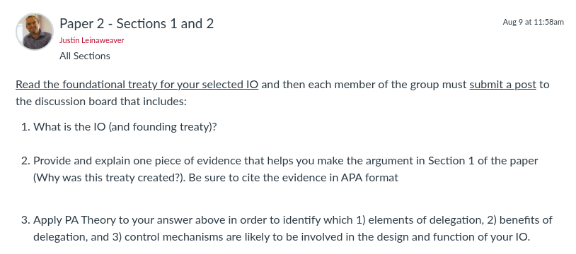

---
output:
  xaringan::moon_reader:
    css: ["default", "extra.css"]
    lib_dir: libs
    seal: false
    nature:
      highlightStyle: github
      highlightLines: true
      countIncrementalSlides: false
      ratio: '16:9'
---

```{r, echo = FALSE, warning = FALSE, message = FALSE}
library(tidyverse)
#library(readxl)
#library(stargazer)
#library(kableExtra)
#library(modelr)

knitr::opts_chunk$set(echo = FALSE,
                      eval = TRUE,
                      error = FALSE,
                      message = FALSE,
                      warning = FALSE,
                      comment = NA)
```

background-image: url('libs/Images/background-scales_justice_v3.png')
background-size: 105%
background-position: top
class: middle

.size45[**II. International Institutions for Mutual Restraint**]

<br>

.size50[**Today's Agenda**

Groups working on Paper 2: Sections 1 and 2
]

<br>

.center[.size40[
  Justin Leinaweaver (Fall 2023)
]]

???

### Prep for Class
1. Check Canvas submissions

<br>

**SLIDE**: This week we attack your next paper in the same way we did it for the first one.


---

background-image: url('libs/Images/background-blue_cubes_lighter3.png')
background-size: 100%
background-position: center
class: middle

.size45[.content-box-white[**Paper 2 - IO Design Analysis**]]

.size35[
Submit a report that describes and analyzes an international organization.

1. Why was this international organization created? (e.g. what problem was it designed to address and why is the problem important?)

2. In what specific ways was the foundational treaty of your selected international organization designed to provide the "benefits" of delegation? Be sure to consider PA Theory, Legalization and the Rational Design literatures.

3. How effective has the organization been in addressing the problem that motivated its creation?
]

???

### Questions on the prompt?


---

background-image: url('libs/Images/background-blue_triangles.jpg')
background-size: 100%
background-position: center
class: middle

.size60[.content-box-white[**Next Class**]]

```{r, echo = FALSE, fig.align = 'center', out.width = '100%'}

```

???

### Everybody ready to go with this?

<br>

Today we'll step through building an outline for the first two sections of your paper.

- **SLIDE**: Let's begin with Section 1


---

background-image: url('libs/Images/background-blue_cubes_lighter3.png')
background-size: 100%
background-position: center
class: middle

.center[
.size55[.content-box-white[**Paper 2 - IO Design Analysis**]]
]

<br>

.size45[
1) Why was this international organization created? (e.g. what problem was it designed to address and why is the problem important?)
- Outline on Board: Premises to the conclusion

- Each premise requires evidence
]

???

Groups: Take 20 minutes to work on Section 1 of the paper

1. Review the cases you each submitted, then 

2. Write an outline for this section of the paper on the board
    - Diagram should be a list of premises leading to a clear conclusion
    
    - Goal should be 3 - 4 premises
    
    - Each premise should identify the evidence you have to support it (or flag where evidence is needed!)
    
<br>

### Questions on this task?

- I'm only giving you 20 minutes for this task because:
    - Each of you already submitted a reason + evidence, 
    - I don't want you to overthink it, and 
    - we need the bulk of our time today for Section 2

- Get to it!

<br>

*Give groups feedback as they work*

- *Encourage them to check in on work of other groups for ideas*


---

background-image: url('libs/Images/background-blue_cubes_lighter3.png')
background-size: 100%
background-position: center
class: middle

.center[
.size55[.content-box-white[**Paper 2 - IO Design Analysis**]]
]

.size40[
2) In what specific ways was the foundational treaty of your selected international organization designed to provide the "benefits" of delegation? 

Be sure to consider:

- PA Theory (elements, benefits, control mechanisms)

- The dimensions of Legalization

- The Rational Design argument and conjectures
]

???

Groups: Take the rest of our time today to work on Section 2 of the paper

- It will be up to you to manage your time on these tasks so don't mess around!

- Just like the first exercise today, your goal is to identify 3-5 premises for an argument about the design of your IO

<br>

### Questions on these tasks?

- Get to it!

<br>

*Give groups feedback as they work*

- *Encourage them to check in on work of other groups for ideas*

<br>

IF NEEDED: **SLIDE** with PA Theory, legalization, and design conjectures

THEN: **SLIDE**: Assignment for next class


---

background-image: url('libs/Images/background-blue_cubes_lighter3.png')
background-size: 100%
background-position: center
class: middle

.center[.size40[.content-box-white[**Princpal-Agent Theory**]]]

.size35[
**Elements of Delegation**: Always governed by a contract, limited in time or scope, must be revocable and the roles are mutually constitutive

**Benefits of Delegation**: Divide the labor & create gains from specialization, Managing policy externalities, Facilitating collective decision-making, Resolving disputes, Enhancing credibility, Creating policy bias

**Control Mechanisms**: Rules vs Discretion, Monitoring and Reporting Requirements, Screening and Selection Procedures, Institutional Checks and Balances, Sanctions
]

???


---

background-image: url('libs/Images/background-blue_cubes_lighter3.png')
background-size: 100%
background-position: center
class: middle

.center[.size45[.content-box-white[**The Dimensions of Legalization**]]]

.pull-left[
```{r, echo = FALSE, fig.align='center', out.width = '100%'}
knitr::include_graphics("libs/Images/02_2-Legalization_Table2.png")
```

```{r, echo = FALSE, fig.align='center', out.width = '100%'}
knitr::include_graphics("libs/Images/02_2-Legalization_Table3.png")
```
]

.pull-right[
```{r, echo = FALSE, fig.align='center', out.width = '100%'}
knitr::include_graphics("libs/Images/02_2-Legalization_Table4.png")
```
]


---

background-image: url('libs/Images/background-blue_cubes_lighter3.png')
background-size: 100%
background-position: center
class: middle

.center[.size45[.content-box-white[**Rational Design (KLS 2001)**]]]

.pull-left[
.size30[
- Rational design

- Shadow of the future

- Transaction costs

- Risk aversion

Therefore, states design international institutions to facilitate and strengthen international cooperation (KLS 2001).
]
]

.pull-right[

<br>

<br>

```{r, echo = FALSE, fig.align='center', out.width = '100%'}
knitr::include_graphics("libs/Images/03_2-KLS_Table1.png")
```
]


---

background-image: url('libs/Images/background-blue_triangles.jpg')
background-size: 100%
background-position: center
class: middle

.size60[.content-box-white[**Next Class**]]

```{r, echo = FALSE, fig.align = 'center', out.width = '100%'}
knitr::include_graphics("libs/Images/08_2-Assignment.png")
```

???

### Questions on the assignment?