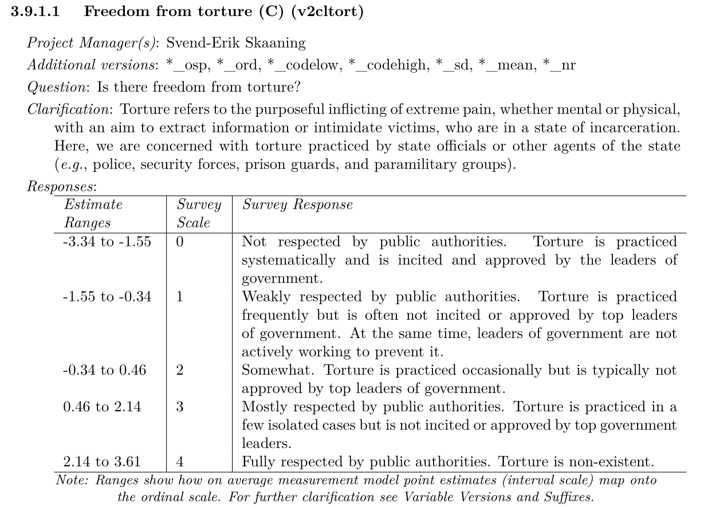

## Today's Agenda {background-image="./Images/background-scales_justice_v3.png" .center}

```{r}
# background-size="1920px 1080px"
library(tidyverse)
library(readxl)
library(lubridate)

# Data input
# Format dates
# Add years to ratify - 10 December 1984
d <- read_excel("../../Data/DATA-CAT_VDem_Polyarchy-1980-2025.xlsx", na = "NA") |>
  rename("signed_date" = `Signature Date`, "binding_date" = `Binding Date`) |>
  mutate(
    signed_date = ymd(str_remove(signed_date, " 00:00:00")),
    binding_date = ymd(str_remove(binding_date, " 00:00:00")),
    rat_delay = as.numeric(binding_date - ymd("1984-12-10")),
    rat_delay_yrs = as.numeric(rat_delay / 365)
  )

d2 <- d |>
  pivot_longer(cols = VDem_Torture1980:VDem_Torture2025, names_to = "torture_year", values_to = "torture", names_prefix = "VDem_Torture")
```

<br>

**Section 2: How effective have international institutions been in reducing the use of torture by governments around the world?**

- Replicating and extending the findings of Hathaway (2007) and Hollyer and Rosendorff (2011)

<br>

::: r-stack
Justin Leinaweaver (Fall 2026)
:::

::: notes

**Prep for Class**

1. Review Canvas submissions

2. DATA-CAT_VDem_Polyarchy-1980-2025.xlsx

3. Have the V-Dem codebook if you need it

<br>

This week we've been exploring some of the academic research that has investigated our research question

**SLIDE**: We started with Oona Hathaway's (2007) article

:::


## {background-image="./Images/background-scales_justice_v3.png" .center}

<br>

{style="display: block; margin: 0 auto"}

::: notes

**What were Hathaway's conclusions?**

- **When should we expect states to join a human rights treaty like the Convention Against Torture?**

- (Democracies with weaker executives will be more likely to join)

- (States with large NGO populations will be more likely to join)

- (States surrounded by states that join will be more likely to join)

- (New states may join to bolster their image as good actors)

- (Perverse incentive 1: Bad states more likely to join because no fear of bad consequences)

<br>

**And what states should we expect to avoid ratifying the CAT?**

- (Democracies that torture, or see some value in targeted repression, should NOT join)

- (Perverse incentive 2: Good states afraid to join because fear of consequences or repercussions from added oversight (domestic and international))

<br>

**SLIDE**: Then last class we shifted to the article by Hollyer and Rosendorff from 2011

:::


## {background-image="./Images/background-scales_justice_v3.png" .center}

<br>

{style="display: block; margin: 0 auto"}

::: notes

H&R developed a formal model to help us understand how dictatorships would approach the Convention Against Torture

- **What were their conclusions?**

- (Dictators who torture join the CAT more than non-torturers)

- (Dictators who join the CAT stay in office longer)

- (Dictators fighting in civil wars who join the CAT see the opposition weaken in the following years)

- (Dictators who join the CAT may increase or decrease their use of repression in future years)

    - "This depends on the net result of two contrasting effects: the information effect of the CAT — by which opposition groups reduce their anti-regime efforts following signing — and the commitment effect — by which incumbent regimes cling more ferociously to power to avoid the post-tenure punishments associated with torture" (310).

<br>

**SLIDE**: Our work for today

:::


## {background-image="./Images/background-scales_justice_v3.png" .center}

**How effective have international institutions been in reducing the use of torture by governments around the world?**

- [Week 6: Defining and Measuring the Outcome]{style="color:gray;"}

- [Week 7: The Convention Against Torture (CAT)]{style="color:gray;"}

- **Week 8: Explaining the Effect of the CAT on Torture**

- [Week 9: The International Criminal Court (ICC)]{style="color:gray;"}

- [Week 10: Can the ICC help us reduce global torture?]{style="color:gray;"}

- [Week 11: Case Studies of ICC Effectiveness]{style="color:gray;"}

::: notes

We've now read and analyzed two pieces of literature that each sought to answer our research question.

- I explained previously that engaging with the academic literature is a VITAL step to answering a research question

<br>

It turns out there is one additional step that takes this engagement into even more useful places: replication and extension

- **SLIDE**: Replications are awesome

:::


## {background-image="./Images/background-scales_justice_v3.png" .center}

**Replication is a phenomenal method for:**

::: {.incremental}

1. Deepening your **understanding** of a research topic, 

2. Providing a **public service** by rechecking published results,

3. Learning the **structure** of a publishable scientific analysis, and

4. Practicing the **skills** needed to execute quantitative research

:::

::: notes

**REVEAL x 4**

<br>

Gary King at Harvard has been arguing for literal decades that replication is an excellent way to teach students to be scientists

- King, G. (1995). Replication, replication. *PS: Political Science & Politics*, 28(3), 444-452.

- King, G. (2006). Publication, publication. *PS: Political Science & Politics*, 39(1), 119-125.

<br>

Even better for us, both articles this week are ripe for replication and extension

- The data in the Hathaway article ended in 2005 and the Hollyer and Rosendorff data ended in 1998!

    - Our V-dem data reaches to 2025!

- The articles focused on the CIRIGHTS measure of torture which doesn't capture much variation in institutional approaches to terrorism

    - Our V-Dem measures have five levels and way more global variation

<br>

So, let's use our work today to do some replicating and extending!

- Before we share your replication work we need to clarify some things

- **SLIDE**: Canvas Q1

:::


## {background-image="./Images/background-scales_justice_v3.png" .center}

**Can we use the electoral democracy index (v2x_polyarchy) from V-Dem to replicate and extend the analyses from this week?**

::: {.fragment}
- Hathaway's democracy focuses on weaker executives and institutions that allow non-state actors to hold the government accountable for breaking international laws
:::

::: {.fragment}
- H&R's authoritarian regimes lack accountability institutions that allows "elites" to use force to hold onto power
:::

::: notes

For the first Canvas question I asked you to think critically about the V-Dem measure of electoral democracy

- The question for us is, can we use this measure to examine the specific mechanisms being studied in the research articles?

<br>

Before we share your strengths and weaknesses, let's make sure we're on the same page in terms of targets

- **What specific mechanisms is Hathaway (2007) focused on under the label "democracy"?**

- (**REVEAL**)

-  (e.g. independent judiciary, opposition parties, etc)

<br>

- **What specific mechanisms are Hollyer and Rosendorff (2011) focused on under the label "authoritarian systems"?**

- (**REVEAL**)

- (e.g. independent judiciary, opposition parties, etc)

<br>

Ok, now let's talk strengths and weaknesses

- **How close does the V-Dem electoral democracy index come to representing these mechanisms?**

- (freedom of expression, v2x_freexp_altinf, p49-50)
- (freedom of association, v2x_frassoc_thick, p50)
- (suffrage, v2x_suffr, p50-51)
- (clean elections, v2xel_frefair, p51)
- (elected officials, v2x_elecoff, p51-52)

<br>

**SLIDE**: Classifying democracies and dictatorships using the V-Dem electoral democracy index

:::


## {background-image="./Images/background-scales_justice_v3.png"}

```{r, fig.asp=.618, fig.align='center'}
d |>
  filter(!is.na(polyarchy_median)) |>
  ggplot(aes(y = polyarchy_median, x = reorder(country_text_id, polyarchy_median))) +
  geom_point() +
  geom_segment(aes(y = polyarchy_25th, yend = polyarchy_75th)) +
  labs(x = "States", y = "Electoral Democracy Index", caption = "Source: V-Dem (2026)") +
  scale_x_discrete(labels = NULL) +
  theme_bw()
```

::: notes

My visualization here shows the mean polyarchy scores for the states in our dataset along with error bars around them running from the low to the high value for each

- In order to do the replications themselves we need to decide how to classify the states in the dataset as democracies or dictatorships

- OR, if that's not possible, then we need to decide where to draw the line between "low" and "high" scores of electoral democracy

<br>

**SO, how did you use the V-Dem electoral democracy index to split the sample between high and low scores in the replication?**

- *DISCUSS*

<br>

**SLIDE**: A cut-off of .5

:::


## {background-image="./Images/background-scales_justice_v3.png"}

```{r, fig.asp=.618, fig.align='center'}
d |>
  filter(!is.na(polyarchy_median)) |>
  mutate(
    poly_group = if_else(polyarchy_median > .5, "democracy", "dictatorship")
  ) |> 
  ggplot(aes(y = polyarchy_median, x = reorder(country_text_id, polyarchy_median))) +
  geom_point(aes(color = poly_group)) +
  geom_segment(aes(y = polyarchy_25th, yend = polyarchy_75th)) +
  labs(x = "States", y = "Electoral Democracy Index", caption = "Source: V-Dem (2026)") +
  scale_x_discrete(labels = NULL) +
  theme_bw()  +
  guides(color = "none") +
  scale_color_manual(values = c("blue", "red"))
  
  #geom_hline(colour = "red", yintercept = .5)
```

::: notes

As I understand it, the rough dichotomous approximation of polyarchy used by the V-Dem researchers is a cut-off at .5

- polyarchy > .5 = electoral democracy

- polyarchy <= .5 = dictatorship

- There are other measures in the dataset that do this alongside a few other tweaks (v2x_regime), but this approach basically captures 90% of the variation in those alternative measures

<br>

**SLIDE**: Ok, let's classify states by torture

:::


## {background-image="./Images/background-scales_justice_v3.png" .smaller}

::: {.panel-tabset}

### Instrument

{width="800"}

### Bar Plot

```{r, fig.asp=0.618, fig.align='center'}
d2 |>
  ggplot(aes(x = torture)) +
#  geom_histogram(color = "white") +
  geom_bar(fill = RColorBrewer::brewer.pal(n = 5, name = "RdBu"), width = .7) +
  theme_bw() +
  labs(x = "V-Dem Torture (ordinal measure)", y = "Count", caption = "Source: V-Dem (2026)")
```

:::

::: notes

**SO, how did you use the torture scores to split the sample between high and low scores in the replication?**

- *DISCUSS*

<br>

**REVEAL bar plot**

For my replications I qualified any state with a score of 0 or 1 as engaging in torture

- "2" strikes me as bad but moves into a different kind of problem than a 0 or 1

<br>

**SLIDE**: Alright, let's get to the replications!

:::


## Replication 1 {background-image="./Images/background-scales_justice_v3.png" .center}

<br>

**Domestic enforcement capacity matters (Hathaway 2007)**

- Are democracies that use torture slower to ratify the CAT than other democracies?

::: notes

*Split class into groups*

- Groups, share how you attacked this question and agree on a single answer then report back

<br>

*PRESENT and DISCUSS each: Walk us through your process*

<br>

**SLIDE**: My version to evaluate

:::


## {background-image="./Images/background-scales_justice_v3.png" .smaller}

::: {.panel-tabset}

### Process

<br>

1. Filter the dataset to only include "democracies" (polyarchy_median > .5)

2. Calculate the ratification delay in years (binding_date - "1984-12-10")

3. Calculate the mean torture level in the five years preceding the adoption of the CAT (1980 - 1984)

4. Make a scatter plot of mean torture level by ratification delay


<br>

### Output

```{r, fig.asp=.618, fig.align='center'}
# Are democracies that use torture slower to ratify the CAT than other democracies?
# Focus on democracies
# Classify by their level of torture from 1980 to 1984

d_temp <- d |>
  filter(polyarchy_median > .5) |>
  mutate(
    binding_cat = if_else(Binding == 1, "Ratified", "Not Ratified"),
    torture_mean_5yr = (VDem_Torture1980 + VDem_Torture1981 + VDem_Torture1982 + VDem_Torture1983 + VDem_Torture1984) / 5
  )

d_temp_labs <- d_temp |>
  filter(rat_delay_yrs > 15)

d_temp |> 
  ggplot(aes(x = jitter(torture_mean_5yr, amount = .1), y = rat_delay_yrs)) +
  geom_point() +
  geom_smooth(method = "lm", se = FALSE) +
  ggrepel::geom_text_repel(data = d_temp_labs, aes(labels = country)) +
  theme_bw() +
  labs(x = "Freedom from Torture (1980-1984, mean)", y = "Ratification Delay (years)",
       caption = "Source: V-Dem (2026) and the UNTC (2026")
```

:::

::: notes

This scatter plot visualizes the "democracies in the dataset by two characteristics:

- X-axis: Average level of torture from 1980-1984

- y-axis: Number of years it took them to ratify the CAT

- I've added a little jitter to the torture score to help us see the different points

<br>

**What does this suggest about the relationship between the use of torture and ratification of the CAT in democracies?**

- (Definitely not a "yes": "Democracies" with the worst torture records ratified at similar speeds to most other categories)

- (HOWEVER)

    - Maybe more spread in the 0 and 1 levels than in 2 and 4?
    
    - Category 3 is very intriguing, e.g. democracies who mostly do not torture. Is this the effect Hathaway suggested?
    
<br>

**What are the strengths and weaknesses of providing this as your answer to the first question?**

- *DISCUSS*

<br>

**Ok, do we walk away more or less convinced by Hathaway's (2007) argument about domestic enforcement capacity mattering?**

<br>

**SLIDE**: Replication 2

:::


## Replication 2 {background-image="./Images/background-scales_justice_v3.png" .center}

<br>

**Domestic enforcement capacity matters (Hathaway 2007) and torture as costly signaling mechanism (Hollyer and Rosendorff 2011)**

- Are dictatorships that use torture faster to ratify the CAT than other states?

::: notes

Groups, share how you attacked this question and agree on a single answer then report back

<br>

*PRESENT and DISCUSS each: Walk us through your process*

<br>

**SLIDE**: My version to evaluate

:::


## Replication 2 {background-image="./Images/background-scales_justice_v3.png" .center}

```{r, fig.asp=.618, fig.align='center'}
# Are dictatorships that use torture faster to ratify the CAT than other states?

d_temp <- d |>
  filter(polyarchy_median <= .5) |>
  mutate(
    binding_cat = if_else(Binding == 1, "Ratified", "Not Ratified"),
    torture_mean_5yr = (VDem_Torture1980 + VDem_Torture1981 + VDem_Torture1982 + VDem_Torture1983 + VDem_Torture1984) / 5
  )

d_temp_labs <- d_temp |>
  filter(rat_delay_yrs > 20)

d_temp |> 
  ggplot(aes(x = jitter(torture_mean_5yr, amount = .1), y = rat_delay_yrs)) +
  geom_point() +
  geom_smooth(method = "lm", se = FALSE) +
  ggrepel::geom_text_repel(data = d_temp_labs, aes(labels = country)) +
  scale_x_continuous(limits = c(0, 4)) +
  theme_bw() +
  labs(x = "Freedom from Torture (1980-1984, mean)", y = "Ratification Delay (years)",
       caption = "Source: V-Dem (2026) and the UNTC (2026")
```

::: notes

Same approach as before but now focusing on dictatorships

<br>

**What does this suggest about the relationship between the use of torture and ratification of the CAT in dictatorships?**

- (Supports a "yes": More torture = faster ratification on average

- (HOWEVER: lots of variation within wach category
    
<br>

**What are the strengths and weaknesses of providing this as your answer to the first question?**

- *DISCUSS*

<br>

**Ok, do we walk away more or less convinced by the perverse incentives proposed by Hathaway (2007) and the costly signaling proposed by H&R (2011)?**

<br>

**SLIDE**: Replication 3

:::


## Replication 3 {background-image="./Images/background-scales_justice_v3.png" .center}

<br>

**Changes in torture levels after joining CAT (Hollyer and Rosendorff 2011)**

- Do dictatorships that ratify the CAT increase or decrease their use of torture after joining? If so, how much and in which direction?

::: notes

Groups, share how you attacked this question and agree on a single answer then report back

<br>

*PRESENT and DISCUSS each: Walk us through your process*

<br>

**SLIDE**: My versions to evaluate

:::


## {background-image="./Images/background-scales_justice_v3.png" .smaller}

::: {.panel-tabset}

### Process

<br>

1. Filter the dataset to only dictatorships (polyarchy_median <= .5)

2. Create a variable to identify country-years pre and post ratification

3. Calculate the mean torture level for each state: pre vs post ratification

4. Calculate the difference between the pre vs post ratification torture means

5. Visualize the pre-ratification means for each dictatorship and add an arrow segment showing the changes in torture post-ratification

### Output

```{r, fig.asp=.618, fig.align='center'}
# Do dictatorships that ratify the CAT increase or decrease their use of torture after joining? If so, how much and in which direction?

# d_temp_labs2 <- d2 |>
#   filter(polyarchy_median <= .5) |>
#   filter(torture_year <= year(binding_date)) |>
#   group_by(country_text_id) |>
#   summarize(
#     mean_torture = mean(torture, na.rm = T) 
#   ) |>
#   filter(!is.na(mean_torture)) |>
#   arrange(mean_torture)

d2_temp <- d2 |>
  filter(polyarchy_median <= .5) |>
  mutate(
    groups1 = if_else(torture_year > year(binding_date), "Post-Ratification", "Pre-Ratification")
  ) |>
  filter(!is.na(groups1)) |>
  group_by(country_text_id, groups1) |>
  summarize(
    mean_torture = mean(torture, na.rm = T) 
  ) |>
  ungroup() |>
  pivot_wider(names_from = groups1, values_from = mean_torture) |>
  na.omit() |>
  mutate(
    Difference1 = `Post-Ratification` - `Pre-Ratification`,
    diff_group = if_else(Difference1 > 0, "Positive", "Negative")
  )

#summary(d2_temp$Difference1)
#table(d2_temp$Difference1 > 0)

d2_temp |>
  ggplot(aes(x = reorder(country_text_id, `Pre-Ratification`), y = `Pre-Ratification`)) +
  #geom_point(aes(y = `Post-Ratification`), color = "blue") +
  geom_point(color = "black") +
  geom_segment(aes(y = `Pre-Ratification`, yend = `Post-Ratification`, color = diff_group), arrow = arrow(length = unit(0.1, "inches"))) +
  theme_bw() +
  scale_y_continuous(limits = c(0, 4)) +
  scale_x_discrete(labels = NULL) +
  labs(x = "Dictatorships (V-Dem)", y = "Mean Freedom from Torture (V-Dem)", caption = "Source: V-Dem (2026), UNTC (2026)",
       title = "60% (47/78) of dictatorships that ratified the CAT improved their torture scores over time") +
  scale_color_manual(values = c("red", "blue"))  +
  guides(color = "none")
```

:::

::: notes

**What does this suggest about the relationship between the use of torture and ratification of the CAT in dictatorships?**

- (Seems like good and bad news!)

- The Good: Less torture!

- The Bad: Is it because ratifying the CAT is a successful costly signal that reduces opposition efforts?
    
<br>

**What are the strengths and weaknesses of providing this as your answer to the third question?**

- *DISCUSS*

<br>

**Ok, what is our answer to this question?**

- **Does our expanded and updated analysis agree with the research or not?**

<br>

**SLIDE**: Next Class

:::


## For Next Class {background-image="./Images/background-scales_justice_v3.png" .center}

<br>

**Principal-Agent Theory and International Organizations**

1. Read some background on PA theory, and

2. Find a recent, current event that involves an international organization (IO) doing something "important" or "useful" in the world.


