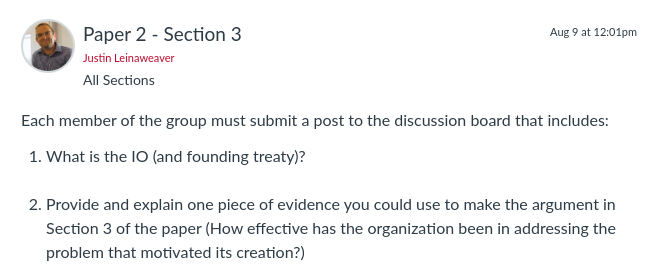
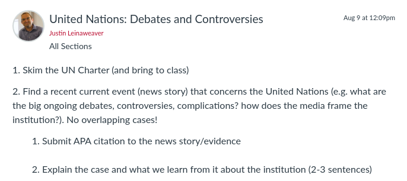

---
output:
  xaringan::moon_reader:
    css: ["default", "extra.css"]
    lib_dir: libs
    seal: false
    nature:
      highlightStyle: github
      highlightLines: true
      countIncrementalSlides: false
      ratio: '16:9'
---

```{r, echo = FALSE, warning = FALSE, message = FALSE}
library(tidyverse)
#library(readxl)
#library(stargazer)
#library(kableExtra)
#library(modelr)

knitr::opts_chunk$set(echo = FALSE,
                      eval = TRUE,
                      error = FALSE,
                      message = FALSE,
                      warning = FALSE,
                      comment = NA)
```

background-image: url('libs/Images/background-scales_justice_v3.png')
background-size: 105%
background-position: top
class: middle

.size45[**II. International Institutions for Mutual Restraint**]

<br>

.size50[**Today's Agenda**

Groups working on Paper 2: Section 3
]

<br>

.center[.size40[
  Justin Leinaweaver (Fall 2023)
]]

???

### Prep for Class
1. Check Canvas submissions

<br>

<br>

**SLIDE**: Today we continue our work on the second paper


---

background-image: url('libs/Images/background-blue_cubes_lighter3.png')
background-size: 100%
background-position: center
class: middle

.size45[.content-box-white[**Paper 2 - IO Design Analysis**]]

.size35[
Submit a report that describes and analyzes an international organization.

1. Why was this international organization created? (e.g. what problem was it designed to address and why is the problem important?)

2. In what specific ways was the foundational treaty of your selected international organization designed to provide the "benefits" of delegation? Be sure to consider PA Theory, Legalization and the Rational Design literatures.

3. How effective has the organization been in addressing the problem that motivated its creation?
]

???

### Questions on the prompt?

<br>

### Does each group have an outline of Section 1 and Section 2 completed?


---

background-image: url('libs/Images/background-blue_triangles.jpg')
background-size: 100%
background-position: center
class: middle

.size60[.content-box-white[**Next Class**]]

```{r, echo = FALSE, fig.align = 'center', out.width = '100%'}

```

???

### Everybody ready for today's assignment?


---

background-image: url('libs/Images/background-blue_cubes_lighter3.png')
background-size: 100%
background-position: center
class: middle

.center[
.size55[.content-box-white[**Paper 1 - Treaty Design Analysis**]]
]

<br>

.size45[
3) How effective has the organization been in addressing the problem that motivated its creation?
- Outline on Board: Premises to the conclusion

- Each premise requires evidence
]

???

Groups: Take the first half of class (35 minutes) to work on Section 3 of the paper

1. Review the cases you each submitted, then 

2. Write an outline for this section of the paper on the board
    - Diagram should be a list of premises leading to a clear conclusion
    
    - Goal should be 3 - 4 premises
    
    - Each premise should identify the evidence you have to support it (or flag where evidence is needed!)
    
<br>

### Questions on this task?

- Get to it!

<br>

*Give groups feedback as they work*

- *Encourage them to check in on work of other groups for ideas*


---

background-image: url('libs/Images/background-blue_cubes_lighter3.png')
background-size: 100%
background-position: center
class: middle

.size45[.content-box-white[**Paper 2 - IO Design Analysis**]]

.size35[
Submit a report that describes and analyzes an international organization.

1. Why was this international organization created? (e.g. what problem was it designed to address and why is the problem important?)

2. In what specific ways was the foundational treaty of your selected international organization designed to provide the "benefits" of delegation? Be sure to consider PA Theory, Legalization and the Rational Design literatures.

3. How effective has the organization been in addressing the problem that motivated its creation?
]

???

The rest of today is a writing workshop.

- Focus on whatever parts of this assignment you'd like.


---

background-image: url('libs/Images/background-blue_triangles.jpg')
background-size: 100%
background-position: center
class: middle

.center[.size40[.content-box-purple[**Section 3**]]

.size40[.content-box-purple[**International Institutions for Coordination**]]

.size40[.content-box-purple[**(agreeing what states ought to do)**]]]

<br>

```{r, echo = FALSE, fig.align = 'center', out.width = '75%'}

```

???

Next week we dive into international institutions designed for Coordination

- aka How do we get states to do something specific?

<br>

We'll start this section by analyzing the United Nations

- I like to start these sections with real world implications hence the assignment for Tuesday

<br>

### Questions on the assignment?