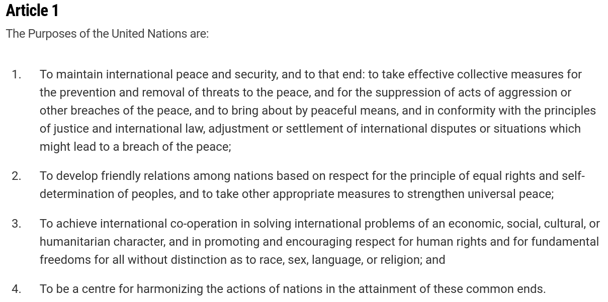
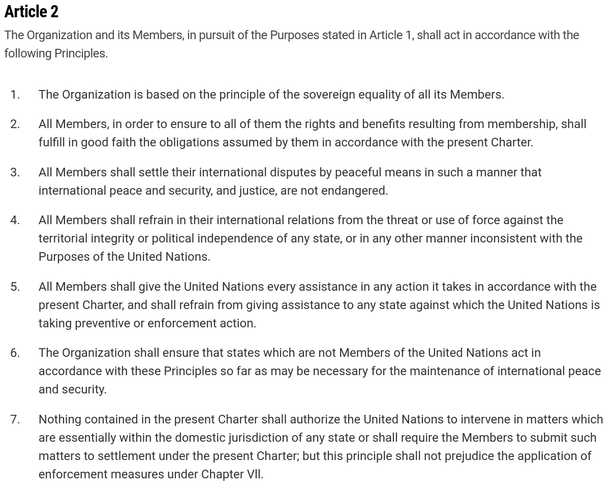
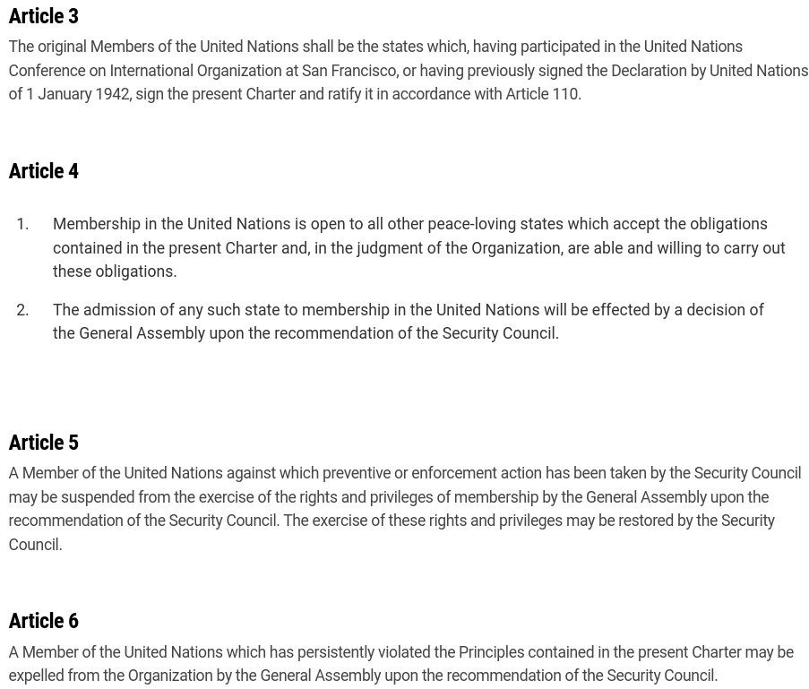
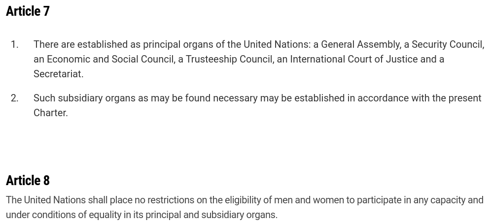
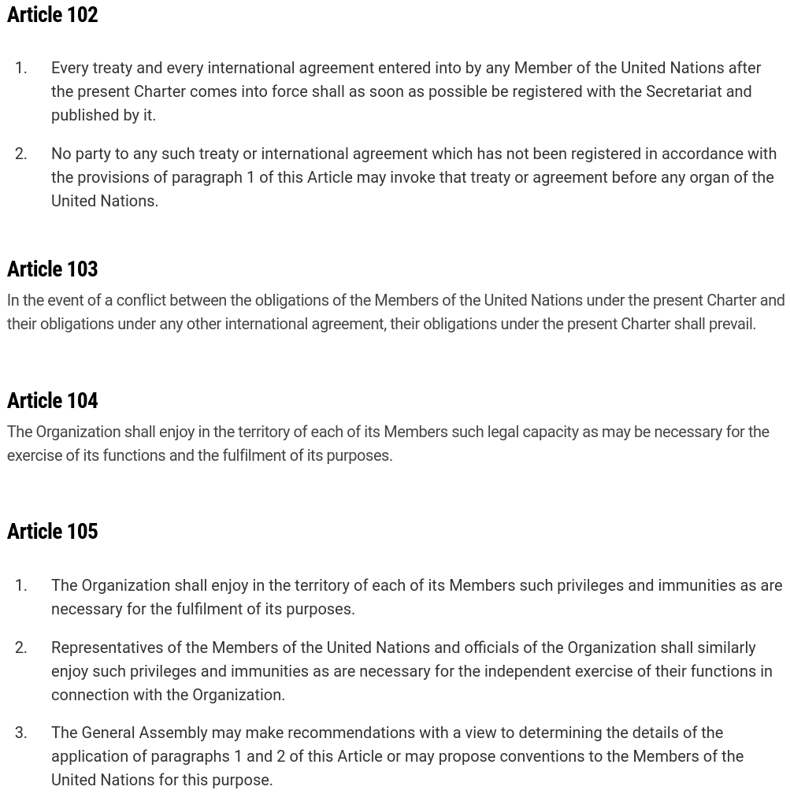

---
output:
  xaringan::moon_reader:
    css: ["default", "extra.css"]
    lib_dir: libs
    seal: false
    nature:
      highlightStyle: github
      highlightLines: true
      countIncrementalSlides: false
      ratio: '16:9'
---

```{r, echo = FALSE, warning = FALSE, message = FALSE}
library(tidyverse)
#library(readxl)
#library(stargazer)
#library(kableExtra)
#library(modelr)

knitr::opts_chunk$set(echo = FALSE,
                      eval = TRUE,
                      error = FALSE,
                      message = FALSE,
                      warning = FALSE,
                      comment = NA)
```

background-image: url('libs/Images/background-scales_justice_v3.png')
background-size: 105%
background-position: top
class: middle

.size50[**III. International Institutions for Coordination**]

<br>

.size50[**Today's Agenda: Design Analysis**

- The United Nations (UN)
]

<br>

.center[.size40[
  Justin Leinaweaver (Fall 2023)
]]

???

### Prep for Class
1. Review cases on Canvas

2. Open the [UN Charter](https://www.un.org/en/about-us/un-charter)

<br>

This week we shift to our next international institution designed to facilitate coordination: The United Nations


---

background-image: url('libs/Images/background-blue_cubes_lighter3.png')
background-size: 100%
background-position: center
class: middle

.size50[.content-box-white[**The United Nations**]]

<br>

.size50[
Week 10 - Design & Effectiveness (peace-keeping)

Week 11 - Can the UN Set Global Standards? (gender discrimination)

Week 12 - Does the UN need to be reformed?
]

???

The UN is a massive entity with a long and complicated history so we will explore it in a selective way

- There's just no way we could be comprehensive in just a few weeks.

<br>

This week we follow our usual pattern: Design on Tue, Effectiveness arguments on Thur
- These effectiveness args focus on the UN's peace-keeping and stability efforts

<br>

Next week we move to evaluating a much harder job the UN takes on: Coordinating states around standards of behavior

- Specifically we will examine the Commission on the Status of Women (CSW) and the Convention on the Elimination of All Forms of Discrimination against Women (CEDAW)

<br>

Week 12 we'll dig into some of the reform arguments (and there are TONS out there)

<br>

### Everybody good with the plan?


---

background-image: url('libs/Images/10_1-United-Nations.jpg')
background-size: 100%
background-position: center
class: bottom, center

.size45[.content-box-purple[**What is the United Nations?**]]

???

Before we discuss the news stories you brought to class, I want us to get on the same page by answering this very important question.

<br>

Over the last nine weeks we've analyzed treaties designed to establish rules and organizations meant to provide specific benefits to their state principals.

- The NPT tells states not to pursue or spread nukes

- The CAT tells state leaders not to commit torture

- The ICC tells state leaders to watch their butts when making decisions about how to treat their people.

<br>

**SLIDE**: Before we can analyze the effectiveness of the UN we need to clarify, in our heads at least, what it actually is.


---

background-image: url('libs/Images/10_1-United-Nations.jpg')
background-size: 100%
background-position: center
class: middle, center

.size45[.content-box-purple[**What is the United Nations?**]]

```{r, echo = FALSE, fig.align = 'center', out.width = '100%'}

```


???

Everybody open up Chapter 1 of the UN Charter and we'll start with the very first Article in the treaty.

### According to these "purposes," what is the UN?

### - Does this sound more like a set of rules OR the creation of an agent?

(Sounds "agent-y" to me)
- to take effective collective measures
- adjustment or settlement of international disputes
- develop friendly relations
- achieve international co-operation
- To be a centre

<br>

### Anything likely to be controversial in this list of "purposes"?


---

background-image: url('libs/Images/10_1-United-Nations.jpg')
background-size: 100%
background-position: center
class: middle, center

.size40[.content-box-purple[**What is the United Nations?**]]

```{r, echo = FALSE, fig.align = 'center', out.width = '65%'}

```


???

Now jump to Article 2.

### According to these "principles," what is the UN?

### - Does this sound more like a set of rules OR the creation of an agent?

(Definitely a mix! Still has "agent-y" bits, but adds some BIG rules)

Agent
- Art 2.1: Instructs "The Organization" how to treat the principals
- Art 2.6: Instructs "The Organization" how to treat non-members
- Art 2.7: Limits the organization

Rules
- Art 2.2: Members must follow the rules
- Art 2.3: Members must use peaceful means
- Art 2.4: Members no war or threats of war
- Art 2.5: Members must assist the UN

<br>

### Is Art 2 "hard" or "soft" law? Why?

<br>

### - How substantial a constraint on the UN is Art 2.1?

### - How substantial a constraint on the UN is Art 2.7?

<br>

### According to the first two articles is the UN an IO or a set of rules?
- (Both!)

<br>

### And, according to these two articles, how substantial / ambitious does this set the UN up to be?
- (Extremely!)

<br>

**SLIDE**: Jump to Chapter 2 (membership, Arts 3-6)


---

background-image: url('libs/Images/10_1-United-Nations.jpg')
background-size: 100%
background-position: center
class: middle, center

.size40[.content-box-purple[**What is the United Nations?**]]

```{r, echo = FALSE, fig.align = 'center', out.width = '60%'}

```

???

### According to Chapter 2, who gets to join and how hard is it to get in?
- (Must be peace-loving and rule-following)
- (Must get approval of the SC; recommendation)
- (Must get support of majority of the GA)

<br>

### Does this make it sound more like a set of rules or an IO?
- (Definitely an IO)

<br>

**SLIDE**: To Chapter 3!


---

background-image: url('libs/Images/10_1-United-Nations.jpg')
background-size: 100%
background-position: center
class: middle, center

.size40[.content-box-purple[**What is the United Nations?**]]

<br>

```{r, echo = FALSE, fig.align = 'center', out.width = '100%'}

```

???

### Does this make it sound more like a set of rules or an IO?
- (Definitely an IO!)

- Six "organs" sounds like a lot of different entities with powers to do things

<br>

**SLIDE**: Ok, last set-up chapter, go to Chapter 16!


---

background-image: url('libs/Images/10_1-United-Nations.jpg')
background-size: 100%
background-position: center
class: middle, center

.size40[.content-box-purple[**What is the United Nations?**]]

```{r, echo = FALSE, fig.align = 'center', out.width = '50%'}

```

???

### Does this make it sound more like a set of rules or an IO?

(Some mention of the organization BUT substantial new rules)

- Art 102: Only treaties registered with UN can have their obligations invoked.

- Art 103: All other treaties subordinate to it & in case of conflict, charter wins.

<br>

### Are Arts 102 and 103 "hard" or "soft" law? How substantial are they as commitments?


---

background-image: url('libs/Images/10_1-United-Nations.jpg')
background-size: 100%
background-position: center
class: bottom, center

.size45[.content-box-purple[**What is the United Nations?**]]

???

So, what is the UN?

- It is gibberish when people treat the UN as a single thing! 

<br>

The UN is a formal organization with limited powers

- Or maybe even six+ formal organizations with limited powers

<br>

The UN is also a generalized system of constitutional principles.

- Some of which are HUGELY substantial in their ambition

<br>

So, as we explore the UN moving forward I want us to be very careful when ascribing actions, behaviors and effects to the "UN."

- It isn't just one thing and we need to be much more specific for our analyses to lead to useful conclusions.

- Be careful of this in your papers as well!


---

background-image: url('libs/Images/10_1-United-Nations.jpg')
background-size: 100%
background-position: center
class: middle, center

.size60[.content-box-blue[What are the current debates or areas of conflict in terms of the United Nations?]]

???

For class today I asked you to find a recent current event (news story) that concerns the United Nations.

- My hope is that this will broaden our familiarity with the discussions around the UN

<br>

### So, what did you bring? And how does this case help us think about the United Nations?

### - e.g. ongoing debates, controversies, complications, media framing, etc.

<br>

*ON BOARD: Take big-picture notes*

- Debates
- Framings
- Complications
- ?

<br>

**SLIDE**: With the remainder of our time today I'd like us to explore four entities within the United Nations


---

background-image: url('libs/Images/10_1-UNGA.webp')
background-size: 100%
background-position: center
class: top

.center[.size45[.content-box-white[**Chapter 4: The General Assembly**]]]

???

Let's start with Chapter 4 on the General Assembly

- In small groups, skim through Chapter 4 and get ready to tell me: What is the "General Assembly" and how powerful is it.

<br>

- All member-states send a rep, each gets one vote.
- Art 10-13: Requires 2/3 members present voting yes to make a "recommendation." Resolutions.

It matters on the world stage (right?):
1. Makes “recommendations” that, as new norms, can be the basis of customary law; 
    - BUT Declarations are often ignored;
    
2. Decisive power over UN expenditure budget; 
    - BUT Advisory Committee on Administrative and Budgetary Questions (ACABQ) actually drafts the budget; 
    
3. Don’t pay dues, lose your vote (Art 19) must mean the vote matters if states pay up; 
    - BUT Only small states ever seem to lose their vote;
    
4. “secondary” or “subsidiary” authority to act when SC fails to do its duty; 
    - BUT VERY contentious interpretation;
    
5. Can suspend badly behaving states (e.g. South Africa); 
    - BUT Rests on belief that “credentials committee” has this power

6. Can create Councils and perform inquiries (e.g. Human Rights Council)

<br>

### Given the GA is the closest thing we have to a global legislature, any objections to giving it more power to act on the international stage?

1. Not all states included; 
2. Gives equal standing to dictators and democrats; 
3. Equal standing regardless of ability to do anything (e.g. power or wealth); 
4. Fills its Human Rights Council with abusive states.

<br>

**SLIDE**: Now let's focus on the Security Council


---

background-image: url('libs/Images/10_1-UNSC.jpg')
background-size: 100%
background-position: center
class: top

.center[.size45[.content-box-white[**Chapter 5: The Security Council**]]]

???

In small groups, skim through Chapter 5 and get ready to tell me: What is the "Security Council" and how powerful is it.

<br>

The UNSC is VERY powerful

1. Can interfere in domestic affairs of states under some conditions
    - Art 39: empowered to determine what is a “threat to or breach of international peace and security”
    - Art 41 and 42: empowered to respond with any measures deemed necessary e.g. military intervention, economic sanctions; peace enforcement (e.g. Iraq 1990)
    
2. Grounds for interference appear to be expanding
    - At founding “international peace and security” was fairly limited in scope
    - Bruce Cronin (2008) argues that recent history shows it being expanded to include nation-building, war crimes, peacekeeping, apartheid, humanitarian crises, civil wars and restoring democracy (Bruce Cronin 2008 see Hurd book p137)

3. Can target individuals, not just states.
    - Although norm is now to prefer "smart-sanctions"

4. Only 5 permanent members mirror global power structure: China, France, USSR, UK, US (15 total) thus power outside the organization mirrored within it

5. SC can create new obligations for states without requiring their consent!
    - Art 25 and 49: commit members to carry out SC decisions and provide assistance to that end. 

6. Recent Council actions indicate belief that resolutions should be carried into domestic legislation! (p138).

<br>

**SLIDE**: Now let's examine the design of the ICJ


---

background-image: url('libs/Images/10_1-ICJ.webp')
background-size: 100%
background-position: center
class: top

.center[.size45[.content-box-white[**Chapter 14: The ICJ**]]]

???

The Statute of the ICJ is a much more comprehensive document focused on establishing this agent, however, I want us to examine how the UN Charter sets it up.

In small groups, skim through Chapter 14 and get ready to tell me: What is the "ICJ" and how powerful is it supposed to be?

<br>

Art 93.1 - all UN members are “ipso facto parties to the Statute of the International Court of Justice.”

Keep in mind, there are three required conditions before the ICJ can hear a case:
1. legal dispute that is 
2. between states who 
3. consent to the jurisdiction of the court in that case.

<br>

The ICJ is powerful! (or not)

1. All UN members must comply with ICJ rulings (Art 94.1)
    - BUT judgements only apply to specific case and states involved; only if they were a party to the case
    - Very different to domestic US law: No stare decisis! No precedent! No judge made law.
    - Vague international laws stay kind of vague

2. Fail to comply, UN SC may be called upon to force you (Art 94.2)
    - BUT No obligation for SC to do anything about it AND p5 states can veto!
    - Nicaragua v US - 1986, US loses but vetoes action by SC to compel us to stop funding the contras

3. 70 states have made “optional clause declarations” (Art 36.2) so any state vs state conflict between them goes to ICJ
     - BUT States may write their “optional clauses” carefully to exclude areas they wish to avoid going to ICJ.

4. Able to issue advisory opinions about any issue when requested
    - Only if asked by GA or SC and not supposed to be binding or involve legal obligations, factual questions only.
    
<br>

The ICJ has one of my favorite examples of a lofty international institution combining big ideals with reality

- ICJ Art 2: Judges chosen regardless of nationality; they are to be independent experts

- HOWEVER

- ICJ Art 3.1: No more than one judge of any nationality at a time

- ICJ Art 31: No judge from your country hearing your case

<br>

**SLIDE**: Finally, let's hit the Secretariat


---

background-image: url('libs/Images/10_1-secretariat.webp')
background-size: 100%
background-position: center
class: top

.center[.size45[.content-box-white[**Chapter 15: The Secretariat**]]]

???

In small groups, skim through Chapter 15 and get ready to tell me: What is the "Secretariat" and how powerful is it supposed to be?

<br>

The Secretariat is the UN's bureaucracy

- The staff tasked with carrying out day-to-day operations and programs.

<br>

Often most visibly represented by the Secretary General

- Currently António Guterres (since 2017)


---

background-image: url('libs/Images/background-blue_cubes_lighter3.png')
background-size: 100%
background-position: center
class: middle

.center[.size45[.content-box-white[**What is the UN?**]]]

.pull-left[

<br>

.size40[
1. Constitutional Principles

2. Organizations
    - General Assembly
    - Security Council
    - ICJ
    - The Secretariat
    - and others
]]

.pull-right[
```{r, echo = FALSE, fig.align = 'center', out.width = '100%'}
knitr::include_graphics("libs/Images/02_2-Legalization_Fig1.png")
```

```{r, echo = FALSE, fig.align = 'center', out.width = '100%'}
knitr::include_graphics("libs/Images/03_2-KLS_Table1.png")
```
]

???

So, what is the UN?

- It is both a set of substantial principles meant to regulate state behavior, AND

- A series of rather substantial organizations each of which represents considerable delegations of authority

<br>

### All in all, is the UN "hard" or "soft" law?

<br>

### Which Rational Design conjectures do we see in its design?


---

background-image: url('libs/Images/background-blue_cubes_lighter3.png')
background-size: 100%
background-position: center
class: middle

.center[.size45[.content-box-white[**What is the UN?**]]]

.pull-left[

<br>

.size40[
1. Constitutional Principles

2. Organizations
    - General Assembly
    - Security Council
    - ICJ
    - The Secretariat
    - and others
]]

.pull-right[
.size40[

<br>

**Principal-Agent Theory**

- Benefits

- Control Mechanisms
]]

???

### How do the UN agents provide specific benefits to the state principals?

<br>

### Any what considerable control mechanisms are in place?


---

background-image: url('libs/Images/background-blue_triangles.jpg')
background-size: 100%
background-position: center
class: middle

.size70[.content-box-white[**Next Class**]]

.size45[
1. Radtke & Jo (2018) "Fighting the Hydra: United Nations sanctions and rebel groups"

2. Beardsley (2011) "Peacekeeping and the Contagion of Armed Conflict"

3. Ruggeri, Dorussen & Gizelis (2017) "Winning the Peace Locally: UN Peacekeeping and Local Conflict"
]

???

Thursday we examine three articles that aim to test the effectiveness of the "UN" in terms of its ability to promote peace and stability.


