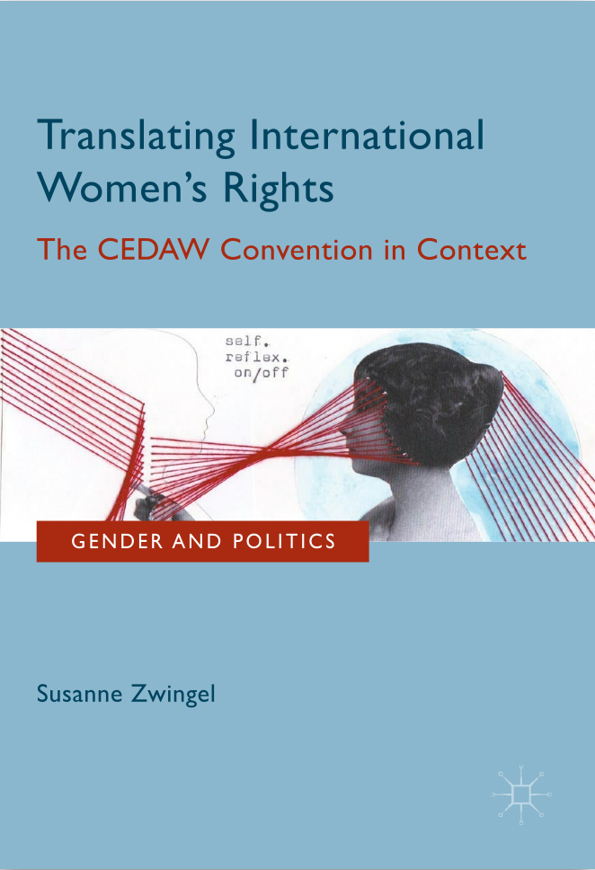
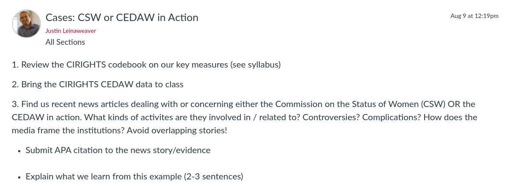

---
output:
  xaringan::moon_reader:
    css: ["default", "extra.css"]
    lib_dir: libs
    seal: false
    nature:
      highlightStyle: github
      highlightLines: true
      countIncrementalSlides: false
      ratio: '16:9'
---

```{r, echo = FALSE, warning = FALSE, message = FALSE}
library(tidyverse)
#library(readxl)
#library(stargazer)
#library(kableExtra)
#library(modelr)

knitr::opts_chunk$set(echo = FALSE,
                      eval = TRUE,
                      error = FALSE,
                      message = FALSE,
                      warning = FALSE,
                      comment = NA)
```

background-image: url('libs/Images/background-scales_justice_v3.png')
background-size: 105%
background-position: top
class: middle

.size50[**III. International Institutions for Coordination**]

<br>

.size45[**Today's Agenda: Design Analysis**]

.size40[
- Convention on the Elimination of All Forms of Discrimination against Women (CEDAW)

- Commission on the Status of Women (CSW)
]

<br>

.center[.size40[
  Justin Leinaweaver (Fall 2023)
]]

???

### Prep for Class
1. Open the readings for today
    - [UN Charter](https://www.un.org/en/about-us/un-charter)
    - [ECOSOC resolution 11(II) of 21 June 1946](https://documents-dds-ny.un.org/doc/RESOLUTION/GEN/NR0/043/10/IMG/NR004310.pdf?OpenElement)
    - Zwingel (2016) chapter 3

<br>

**SLIDE**: Before we dive into new material, let's make sure we're clear on the groundwork we laid last week.


---

background-image: url('libs/Images/10_1-United-Nations.jpg')
background-size: 100%
background-position: center
class: bottom, center

.size50[.content-box-purple[**What is the United Nations?**]]

???

Ok, hit me!

### What is the United Nations?

- (**SLIDE**)


---

background-image: url('libs/Images/11_1-United-Nations_filter.png')
background-size: 100%
background-position: center
class: middle, inverse

.center[.size50[.textblack[.content-box-purple[**What is the United Nations?**]]]]

.size45[
1. Constitutional Principles

2. Organizations
    - General Assembly
    - Security Council
    - ICJ
    - The Secretariat
    - and others
]

???

Keep in mind that the "UN" is BOTH a collection of substantial international rules AND a series of international organizations.

<br>

The first three chapters of the United Nations Charter focuses on setting the foundation for both of these elements:

- Article 1 gives us the "purposes" of the institution as a whole

- Article 2 gives us the "principles" meant to guide the UN's bodies AND the state members

- Article 7 sets up the "principal organs" of the UN and makes clear it can make more "subsidiary organs" as "necessary"

- Then, of course, Chapter 16 tries to set the UN Charter over and above all other international agreements

<br>

A deeply ambitious undertaking!


---

background-image: url('libs/Images/11_1-United-Nations_filter.png')
background-size: 100%
background-position: center
class: middle, inverse

.size55[.textblack[.content-box-purple[**Has the UN been effective?**]]]

.size40[
1. Radtke & Jo (2018) "Fighting the Hydra: United Nations sanctions and rebel groups"

2. Beardsley (2011) "Peacekeeping and the Contagion of Armed Conflict"

3. Ruggeri, Dorussen & Gizelis (2017) "Winning the Peace Locally: UN Peacekeeping and Local Conflict"
]

???

Last class we examined a selection of articles from the effectiveness literature focused on the UN's role in maintaining peace and security around the world.

<br>

### What were our takeaways from examining that research? 

### - In what ways has the UN been effective in maintaining peace and stability? 

### - In what ways is this effect limited?


---

background-image: url('libs/Images/11_1-CEDAW_Convention.jpg')
background-size: 100%
background-position: center
class: bottom, center

.size25[.content-box-white[**Convention on the Elimination of All Forms of Discrimination against Women (CEDAW)**]]

???

Our aim for this week is to ask how effective the UN is at establishing global standards of behavior

- In other words, can the UN achieve substantial things for the world beyond military interventions?

<br>

Specifically, we will explore two case studies of UN coordination in action

1. How substantial and effective has the Commission on the Status of Women (CSW) been in providing the benefits of delegation?

2. How substantial and effective has the Convention on the Elimination of All Forms of Discrimination against Women (CEDAW) been in changing the status of women around the world?


---

background-image: url('libs/Images/background-blue_cubes_lighter3.png')
background-size: 100%
background-position: center
class: middle

.center[.size45[.content-box-white[**Treaty Design Analysis: The UN Charter (1945)**]]]

.pull-left[

<br>

.size35[
1. General Assembly (*Chapter 4, Arts 9-22*)
    
2. Security Council (*Chapter V, Arts 23-32*)

3. International Court of Justice (*Chapter 14, Arts 92-96*)
    
4. The Secretariat (*Chapter 15, Arts 97-101*)
]]

.pull-right[
```{r, echo = FALSE, fig.align = 'center', out.width = '100%'}
knitr::include_graphics("libs/Images/02_2-Legalization_Fig1.png")
```

```{r, echo = FALSE, fig.align = 'center', out.width = '100%'}
knitr::include_graphics("libs/Images/03_2-KLS_Table1.png")
```
]

???

Last week we dug into these four main groups in the UN system

### How substantial are each of these in terms of their delegated powers?

<br>

*Make sure to push them on the question of the GA*
- If not substantial, why do countries fight over these non-binding resolutions so much?
- If soft law, can we identify concrete places in the world where the GA impacts the political world in a substantial way?
    - Could this be an exercise in credible commitment for smaller powers? Or coordination in anarchic situations? That could be super meaningful


---

background-image: url('libs/Images/background-blue_cubes_lighter3.png')
background-size: 100%
background-position: center
class: middle

.center[.size45[.content-box-white[**Treaty Design Analysis: The UN Charter (1945)**]]]

.pull-left[
.size45[
<br>

.center[The Economic and Social Council (ECOSOC)

(Chapter X, Arts 61-72)]
]]

.pull-right[
```{r, echo = FALSE, fig.align = 'center', out.width = '100%'}
knitr::include_graphics("libs/Images/02_2-Legalization_Fig1.png")
```

```{r, echo = FALSE, fig.align = 'center', out.width = '100%'}
knitr::include_graphics("libs/Images/03_2-KLS_Table1.png")
```
]

???

The Economic and Social Council (ECOSOC) is one of the "principal organs" created by Article 7 of the UN Charter *see [Chapter X](https://www.un.org/en/about-us/un-charter/chapter-10)).

- *Split into small groups*

<br>

Groups, take a few minutes to read and analyze Chapter X.

- Get ready to report back your analysis of the design of ECOSOC

- Use all three of our tools (legalization, KLS and PA Theory) to guide your analyses.

<br>

### Questions on what I'm asking you to do?

- Go!

<br>

*Report Back*

### What conclusions did your group draw about the design and likely functioning of ECOSOC?

<br>

### - LEGALIZATION: Is Chapter X primarily "hard" or "soft" law? Why?

### - LEGALIZATION: How substantial is this act of delegation in legalization terms?

### - KLS: Which Rational Design conjectures involved here? What do we learn from these choices?

### - PA: Primary PA Theory benefits of this design?

### - PA: What control mechanisms have been put into place?


---

background-image: url('libs/Images/11_1-CSW_1946.jpg')
background-size: 93%
background-position: center
class: middle, center, slideblue

.size50[.content-box-white[**Commission on the Status of Women (1946)**]]

???

On June 21, 1946 ECOSOC passed a resolution establishing the Commission on the Status of Women (CSW).

- These photos are taken from the UN archives showing some of the representatives to the Sub-commission on the Status of Women one month before the vote that converted their group into the CSW.

<br>

Everybody open up the resolution and let's repeat our design analysis on that. 

- Use all three of our tools (legalization, KLS and PA Theory) to guide your analyses.

<br>

*Report Back*

### What conclusions did your group draw about the design and likely functioning of the CSW?

<br>

### What is the best case scenario for the effectiveness of the CSW? 

### - In other words, what are its most substantial powers?

<br>

#### Notes

- [ECOSOC resolution 11(II) of 21 June 1946](https://documents-dds-ny.un.org/doc/RESOLUTION/GEN/NR0/043/10/IMG/NR004310.pdf)

- Per @UN_Photo on Twitter (Mar 12, 2018): "These photo finds from the archive document the last meetings of the Sub-commission on the Status of Women (operating under the Commission on Human Rights), prior to its becoming the Commission on the Status of Women just over one month later. (Hunter College, NY; 1946) #CSW62"


---

background-image: url('libs/Images/background-blue_cubes_lighter3.png')
background-size: 100%
background-position: center
class: middle

.pull-left[
.size55[

<br>

.center[.content-box-white[
**CEDAW and the United Nations**]]]
]

.pull-right[
```{r, echo = FALSE, fig.align = 'center', out.width = '80%'}

```
]

???

Susanne Zwingel has written a fairly comprehensive book exploring the development of women's rights as a focus for the United Nations and how that focus has been enshrined and advanced by CEDAW.

- Zwingel's book shows how even though CEDAW was primarily designed as an exercise in elaborating social norms, it has been embraced by activists worldwide as a tool for pushing concrete social change.

<br>

She has also provided an electronic copy of it to us for our work this semester!

- If anybody is interested, let me know and I can share the entire book with you (just please don't distribute it outside of class)


---

background-image: url('libs/Images/background-blue_cubes_lighter3.png')
background-size: 100%
background-position: center
class: middle

.pull-left[

<br>

.size55[
.center[.content-box-white[
**Is the creation of CEDAW evidence that the UN is effective at setting global standards?**]]]
]

.pull-right[
```{r, echo = FALSE, fig.align = 'center', out.width = '80%'}

```
]

???

I'd like us to use the chapter you read for today as the evidence we need to answer this question.

- According to Zwingel's historical analysis, is the creation of CEDAW evidence that the UN has been effective at establishing global standards of behavior? Why or why not?

<br>

Discuss this in your groups and get ready to report back to the class.

<br>

*REPORT BACK*

### What did you conclude from this process and outcome?

<br>

### What are the strengths and weaknesses of the UN process that produced CEDAW?

<br>

#### Notes
Zwingel (2016)
p35-36: Intro
- Chapter discusses "global discourse translation" that led to CEDAW
- Ratification is not the end goal, international norm creation is the goal

p36-40: Phase 1 - International Knowledge Formation on Women’s Issues (1945–1975)
- 1880s a number of discernible women’s organizations with international scope emerged
- Lit IDs four fields of activism up to mid-20th century: women’s suffrage, anti-war activism, demands for equal labor rights, and claims regarding the legal status of women, in particular in the field of marriage 
- 1945 and on women's orgs mobilized for world peace: the International Council of Women (ICW), the Women’s International League for Peace and Freedom (WILPF), and the newly founded and predominantly socialist Women’s International Democratic Federation (WIDF)
- Women's groups often linked ongoing decolonization efforts to the importance of liberating women as necessary for self-determination
- CSW played an important role in organizing this lobbying
- "In the time between 1946 and 1975, the CSW was the most important space within the UN for the articulation of women’s issues (Connors 1996a; Galey 1995)."
- "It had strong ties with national women’s organizations because many members of the CSW headed such organizations in their home countries (Connors 1996a)."
- CSW producing useful research documenting gender discrimination practices around the world
- "In the 1950s, the CSW initiated three legally binding documents: the Convention on the Political Rights of Women, which was adopted by the UN General Assembly in 1952 and came into effect in 19542; the Convention on the Nationality of Married Women (1957/1958); and the Convention on Consent to Marriage, Minimum Age for Marriage and Registration of Marriages (1962/1964)."
- Over time CSW begins to emphasize issues of economic development alongside the rights of women and this culminates in fights over family planning
- At GA request CSW drafts Declaration on the Elimination of Discrimination against Women (DEDAW) in 1967
- "DEDAW can be seen as a symbol for the institutional comprehension of women’s subordination, but it did not trigger much change."
- "The CSW as institutional and movement-oriented women’s space was paramount in this period, but it lost this hybrid character as governments started to send bureaucrats. This turned the CSW into a “more purely political and less of an expert body” (Galey 1995, p. 14) and reduced its mobilizing character."

p40-44: Phase 2 - Global Transformation: “A Feast of Knowledge and Power” (1975–1995)
- 1975 International Women’s Year of the United Nations
- 1976–1985 the UN Decade for Women with a focus on equality, development, and peace
- Series of global conferences held focused on women's rights and needs
- Three innovations coming out of the Decade need to be highlighted.
- First, a set of new institutions working for gender equality was created... the Voluntary Fund for the UN Decade for Women was founded in 1976 and later converted into the UN Development Fund for Women (UNIFEM). The International Research and Training Institute for the Advancement of Women (INSTRAW) was brought into being in 1982. The adoption of
CEDAW in 1979.
- Second, the global dialogue made possible by the conferences enabled a process of complex learning that first acknowledged differences among women and then envisaged joint strategies of action. A crucial factor in this learning was the articulation of women’s voices from the Global South (at the time, called “Third World”).
- As a base for and result of these complex learning processes, the Decade had produced, thirdly, a vibrant, articulate global women’s movement whose main nodes are transnational networks (Friedman 1995; Moghadam 2005; Naples and Desai 2002).
- Paradigmatic for this networking culture is the organization Development Alternatives with Women for a New Era (DAWN), a network of women from the South.
- At the end of 1993 and in clear reaction to the dynamics created at the Human Rights Conference, the UN General Assembly adopted the Declaration on the Elimination of Violence against Women (DEVAW).
 
p44-46: Phase 3 - Consolidation and New Challenges (1995–Present)
- More significantly, the general global context has shifted dramatically and turned the UN into a less significant international arena for gender equality claims. Two dimensions are particularly noteworthy in this regard. First, the macro-economic conditions have not been supportive for realizing women’s rights. ... The second dimension of global normative change is the growth of fundamentalist, often misogynist, ideologies. Economic hardships are known to give rise to fundamentalist doctrines, and they hardly ever envision a gender equal society.
- **Thus, the opening the UN had provided for women’s rights claims started to narrow in the mid-1990s. Much of the energy of gender equality advocates within the UN had to be invested in defending rather than expanding on the status quo reached in Beijing, as this status quo was being challenged by anti-feminist positions (Hannan 2013; Sen 2005). These positions typically had religious underpinnings and joined forces in a “transnational conservative counter-network” (Chappel 2006) lead by the Holy See and consisting of states and NGOs alike (Sjorup 1995).**
- In 2011, UN Women—the UN Entity for Gender Equality and the Empowerment of Women—came into being. It has replaced all previous gender-related agencies within the UN, is headed by an Under-Secretary General, and operates on a higher budget than its four predecessors together.

p46-47: CREATING CEDAW: THE DRAFTING PROCESS AND ITS RESULTS
- According to de Haan (2010b), it was an NGO—the Union of Australian Women—that proposed the creation of a Women’s Rights Convention as early as 1972.
- DEDAW was disappointing
- Until the adoption of CEDAW, there was no instrument within the UN human rights frame-work that systematically looked into female experiences of human rights violations.
- With its focus on women, CEDAW has been a crucial impulse for making the UN human rights system and international human rights law as a whole more gender sensitive.
- HOWEVER In other words, the Convention generally accepts the status quo and assumes that women should enjoy existing rights that were crafted with male humans in mind. It does not transform the human rights framework with a view of fully representing women’s experiences (Johnstone 2010a).

p47-49: Drafting the Convention
- Three stages
- First, the CSW worked on a draft from 1974 to 1976. ... When the CEDAW working group of the CSW first met, it anticipated obstacles to the enterprise, both in relation to the content of the Convention and its supervising mechanism (González 2000; Hussein 2004; Shahani 2004). ... Since some issues were not resolved, the document was adopted without a vote and alternative proposals on the controversial issues were included.
- The second and third phase of the drafting process took place in Working Groups of the Third Committee15 to the UN General Assembly (1977–1979), and finally, in December 1979, in the Third Committee as a whole. The agreement reached in the Third Committee was then immediately discussed and adopted by the UN General Assembly.
- Jacobson characterizes the debates in the Third Committee’s working group as “long and painful". ... There were sharp disagreements on content issues and on implementing and monitoring provisions (Burrows 1985; Fraser 1995; Jacobson 1991).
- In the debate preceding the adoption, most delegations showed enthusiasm regarding the importance of women’s rights, but the document itself was also heavily criticized (UN Doc. A/34/107).
- **The negotiation process was so contentious because the notion of women’s rights challenged deeply entrenched social traditions—traditions that were seen as culturally legitimate practices, not as human rights violations and certainly not as a realm in which a state’s sovereignty should be infringed upon.**
- Five lines of conflict can be identified in the drafting process.
1. The first circled around the strength of the enforcement mechanism. The delegations favoring a weak, non-intrusive mechanism succeeded (Rehof 1993).
2. secular versus religious visions: The first one saw women as individuals endowed with enforceable rights; the second one perceived them as fulfilling a specific role in family and society and understood the concept of women’s rights as linked to that role. ... Since the first position succeeded more often in the final wording of the Convention, many of the reservations entered to the Convention have aimed to preserve the second notion of women, often with a reference to religious or cultural traditions.
3. One ran between an emphasis on discrimination against women and discrimination based on gender. The first position is dominant in the text
4. a confrontation between capitalist and socialist views on women’s rights
5. between the different priorities of industrialized and developing countries

p49-51: The Convention’s Content
- See chapter

p52-58: Major Debates During the Drafting Process
- The debates on articles 1, 2, 5, 9, and 16 are particularly interesting in order to grasp controversial assumptions in respect to women’s rights during the drafting process.
- Art 1: No definition of "women" or "gender equality"; Much of its focus, but not all, is on making women "equal" in a world designed with men's interests given primary emphasis.
- Art 2: The heart of the obligations. "In a comprehensive way, article 2 represents both de jure and de facto equality."
- Art 5: Contested issues related to family responsibilities. Debate led this to be vague in terms of implementation
- NOTE: "General Recommendation 25, the Committee declared articles 1 through 5 together with article 24 to be the “general interpretive framework of States Parties’ obligations under the Convention.”"
- Art 9: These two dimensions challenge the legal concept of dependent nationality of women, which at the time of the Convention’s drafting was still rather widespread (Goonesekere 2012). According to this concept, a woman did not have a separate personal and legal identity but was under the “wing of protection” of either father or husband; accordingly, she acquired her husband’s nationality upon marriage, and children resulting from this union automatically obtained their father’s nationality."
- Arts 15 and 16: guarantee women equality in civil matters
- A significant amount of the procedural provisions in part 5 and 6 of the Convention were controversial during the drafting process. (e.g. monitoring)

p59-60: Assessing the Instrument
- "It contains a tension between a rather comprehensive vision both on discrimination against women and on equality of women with men, on the one hand, and a low-key monitoring mechanism modeled after the interests of states, on the other."
- While earlier international documents dealing with the status of women often had a protective character, CEDAW is predominantly based on non-discrimination (Hevener Kaufman 1986).
- In contrast to its substantial strengths, the Convention offers only a low-key mechanism to oversee the implementation of its ambitious goals. Three dimensions seem particularly problematic. According to the text of the treaty, the Committee has no mandate to establish connections to NGOs, it has no way to verify the admissibility of reservations, and its functionality is restricted by an annual meeting time of only two weeks. As the following chapters will show, this extremely unsatisfactory starting point has been widened both formally and informally.

p60-62: UNDERSTANDING THE CONVENTION IN A CHANGING GLOBAL ENVIRONMENT
- It took women’s rights advocates three decades, from 1945 to 1975, to make their point within UN agencies that women’s subordination is a relevant international policy issue. However, this new global awareness remained largely declaratory.
- The time for more substantial steps came between 1975 and 1995, when the world women’s conferences enabled powerful advocacy for women’s concerns that resonated worldwide.
- The contrast between strong ideals and halfhearted enforcement mechanisms is indicative of the influence of two types of drafters: women’s rights advocates and representatives of states’ interests.
- Rather, the drafting process is the starting point of global discourse translation, reminiscent of the first round of a boxing match. As the next chapters will show, the participants in this global discourse keep wrestling to make their viewpoints and claims succeed. The international meaning making process around women’s rights has just begun.


---

background-image: url('libs/Images/background-blue_cubes_lighter3.png')
background-size: 100%
background-position: center
class: middle, center

.size45[.content-box-white[**Treaty Design Analysis**]]

<br>

.size35[.content-box-white[**Convention on the Elimination of All Forms of Discrimination**]]

.size35[.content-box-white[**against Women (CEDAW)**]]

.pull-left[
```{r, echo = FALSE, fig.align = 'center', out.width = '100%'}
knitr::include_graphics("libs/Images/02_2-Legalization_Fig1.png")
```
]

.pull-right[
```{r, echo = FALSE, fig.align = 'center', out.width = '100%'}
knitr::include_graphics("libs/Images/03_2-KLS_Table1.png")
```
]

???

The Zwingel chapter also highlights what she views as the most substantive elements of CEDAW (p49-58)

- Let's now shift our focus to the CEDAW treaty text using Legalization and Rational Design.

<br>

### Would our class tools have highlighted the same design features? Why or why not?

- *Encourage this exploration and discussion*

<br>

I've posted a link to the treaty reservations on Canvas ([reservations](https://treaties.un.org/pages/ViewDetails.aspx?src=IND&mtdsg_no=IV-8&chapter=4&clang=_en)).

### Any reservations stand out as particularly problematic?

### - Let's name names!!


---

background-image: url('libs/Images/background-blue_triangles_flipped.png')
background-size: 100%
background-position: center
class: middle

.size70[.content-box-white[**Next Class**]]

```{r, echo = FALSE, fig.align = 'center', out.width = '100%'}

```

???

(1. CASES on the CSW or CEDAW, 2. CIRI codebook and data focused on the key measures)

- Find us recent news articles dealing with or concerning either the Commission on the Status of Women (CSW) OR the CEDAW in action. What kinds of activites are they involved in / related to? Controversies? Complications? How does the media frame the institutions? Avoid overlapping stories! 


