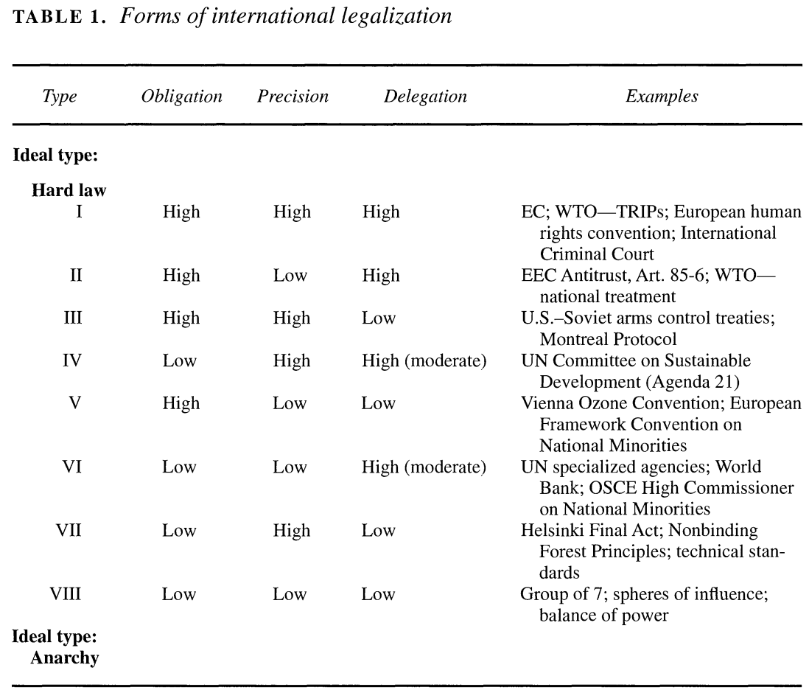

---
output:
  xaringan::moon_reader:
    css: ["default", "extra.css"]
    lib_dir: libs
    seal: false
    nature:
      highlightStyle: github
      highlightLines: true
      countIncrementalSlides: false
      ratio: '16:9'
---

```{r, echo = FALSE, warning = FALSE, message = FALSE}
library(tidyverse)
#library(readxl)
#library(stargazer)
#library(kableExtra)
#library(modelr)

knitr::opts_chunk$set(echo = FALSE,
                      eval = TRUE,
                      error = FALSE,
                      message = FALSE,
                      warning = FALSE,
                      comment = NA)
```

background-image: url('libs/Images/background-scales_justice_v3.png')
background-size: 105%
background-position: top
class: middle

.size50[**III. International Institutions for Coordination**]

<br>

.size45[**Today's Agenda: Design Analysis**

- Convention on the Elimination of All Forms of Discrimination against Women (CEDAW)
- Commission on the Status of Women (CSW)
]

<br>

.center[.size40[
  Justin Leinaweaver (Fall 2023)
]]

???

### Prep for Class
1. ?

<br>

Big Q this week: Can the UN Set Global Standards?

---

background-image: url('libs/Images/background-blue_cubes_lighter3.png')
background-size: 100%
background-position: center
class: middle

.size50[.content-box-white[**Semester Plan of Attack**]]

.size50[
1. Basics of Analyzing International Institutions

2. International Institutions for Mutual Restraint

3. .textblue[**International Institutions for Coordination**]

4. International Institutions for Aggregate Effort

]

???

Last week we dug into the UN.

### Key takeaways? Is the UN an effective IO? Why or why not?


---

background-image: url('libs/Images/11_1-CEDAW_Convention.jpg')
background-size: 100%
background-position: center
class: bottom, center

.size25[.content-box-white[**Convention on the Elimination of All Forms of Discrimination against Women (CEDAW)**]]

???

Setting up our aim for this week: How effective is the UN at establishing global standards of behavior? 
- A continuation of our analyses from last Thursday. 

- Specifically, explore CEDAW as a case study of UN delegation in action. 

- Is this evidence that the UN can achieve substantial things for the world?


---

background-image: url('libs/Images/background-blue_cubes_lighter3.png')
background-size: 100%
background-position: center
class: middle

.center[.size45[.content-box-white[**Treaty Design Analysis: The UN Charter (1945)**]]]

.pull-left[

<br>

.size35[
1. General Assembly (*Chapter 4, Arts 9-22*)
    
2. Security Council (*Chapter V, Arts 23-32*)

3. International Court of Justice (*Chapter 14, Arts 92-96*)
    
4. The Secretariat (*Chapter 15, Arts 97-101*)
]]

.pull-right[
```{r, echo = FALSE, fig.align = 'center', out.width = '100%'}
knitr::include_graphics("libs/Images/02_2-Legalization_Fig1.png")
```

```{r, echo = FALSE, fig.align = 'center', out.width = '100%'}
knitr::include_graphics("libs/Images/03_2-KLS_Table1.png")
```
]

???

[UN Charter](https://www.un.org/en/about-us/un-charter)

How substantial is the delegation included in the UN Charter? 
- Refresh group analyses from last week: General Assembly, Security Council, International Court of Justice, The Secretariat


---

background-image: url('libs/Images/background-blue_cubes_lighter3.png')
background-size: 100%
background-position: center
class: middle

.center[.size45[.content-box-white[**Treaty Design Analysis: The UN Charter (1945)**]]]

.pull-left[
.size45[
<br>

.center[The Economic and Social Council (ECOSOC)

(Chapter X, Arts 61-72)]
]]

.pull-right[
```{r, echo = FALSE, fig.align = 'center', out.width = '100%'}
knitr::include_graphics("libs/Images/02_2-Legalization_Fig1.png")
```

```{r, echo = FALSE, fig.align = 'center', out.width = '100%'}
knitr::include_graphics("libs/Images/03_2-KLS_Table1.png")
```
]

???

[Chapter X](https://www.un.org/en/about-us/un-charter/chapter-10)


---

background-image: url('libs/Images/11_1-CSW_1946.jpg')
background-size: 93%
background-position: center
class: middle, center, slideblue

.size50[.content-box-white[**Commission on the Status of Women (1946)**]]

???

[ECOSOC resolution 11(II) of 21 June 1946](https://documents-dds-ny.un.org/doc/RESOLUTION/GEN/NR0/043/10/IMG/NR004310.pdf?OpenElement)

Per @UN_Photo on Twitter (Mar 12, 2018): "These photo finds from the archive document the last meetings of the Sub-commission on the Status of Women (operating under the Commission on Human Rights), prior to its becoming the Commission on the Status of Women just over one month later. (Hunter College, NY; 1946) #CSW62"

<br>

Use legalization, KLS and PA Theory to analyze the Commission on the Status of Women (CSW) (ECOSOC resolution 11(II) of 21 June 1946)


---

background-image: url('libs/Images/11_1-Zwingel_Book_Cover.png')
background-size: 40%
background-position: left
class: middle, slideblue

.pull-right[
.center[.size55[.content-box-white[
**Is the CEDAW evidence that the UN is effective at setting global standards?**
]]]
]

???

Review the Zwingel (2016): Is the creation of the CEDAW evidence of the effectiveness of the UN? Why or why not?

- Small groups go through the reading and find us evidence pro vs con, see sections of reading below

- Save the content analyses (p49-58) for the next section

<br>

Zwingel (2016)
- p35-36: Intro
- p36-40: Phase 1 - International Knowledge Formation on Women’s Issues (1945–1975)
- p40-44: Phase 2 - Global Transformation: “A Feast of Knowledge and Power” (1975–1995)
- p44-46: Phase 3 - Consolidation and New Challenges (1995–Present)
- p46-47: CREATING CEDAW: THE DRAFTING PROCESS AND ITS RESULTS
- p47-49: Drafting the Convention
- p49-51: The Convention’s Content
- p52-58: Major Debates During the Drafting Process
- p59-60: Assessing the Instrument
- p60-62: UNDERSTANDING THE CONVENTION IN A CHANGING GLOBAL ENVIRONMENT


---

background-image: url('libs/Images/background-blue_cubes_lighter3.png')
background-size: 100%
background-position: center
class: middle, center

.size45[.content-box-white[**Treaty Design Analysis**]]

<br>

.size35[.content-box-white[**Convention on the Elimination of All Forms of Discrimination**]]

.size35[.content-box-white[**against Women (CEDAW)**]]

.pull-left[
```{r, echo = FALSE, fig.align = 'center', out.width = '100%'}
knitr::include_graphics("libs/Images/02_2-Legalization_Fig1.png")
```
]

.pull-right[
```{r, echo = FALSE, fig.align = 'center', out.width = '100%'}
knitr::include_graphics("libs/Images/03_2-KLS_Table1.png")
```
]

???

Analyze CEDAW treaty using legalization, KLS and PA theory (guided by the Zwingel reading p49-58)

<br>

Any [reservations](https://treaties.un.org/pages/ViewDetails.aspx?src=IND&mtdsg_no=IV-8&chapter=4&clang=_en) stand out as particularly problematic?


---

background-image: url('libs/Images/background-blue_cubes_lighter3.png')
background-size: 100%
background-position: center
class: middle

```{r, echo = FALSE, fig.align='center', out.width = '70%'}

```

???

### Where does the CSW fit?

### What about CEDAW?


---

background-image: url('libs/Images/background-blue_triangles_flipped.png')
background-size: 100%
background-position: center
class: middle

.size70[**Next Class**]

.size40[
1. CASES: Find us recent news articles dealing with or concerning either the Commission on the Status of Women (CSW) OR the CEDAW in action.

2. CIRI Human Right Project Codebook
]

???

(1. CASES on the CSW or CEDAW, 2. CIRI codebook and data focused on the key measures)

- Find us recent news articles dealing with or concerning either the Commission on the Status of Women (CSW) OR the CEDAW in action. What kinds of activites are they involved in / related to? Controversies? Complications? How does the media frame the institutions? Avoid overlapping stories! 


