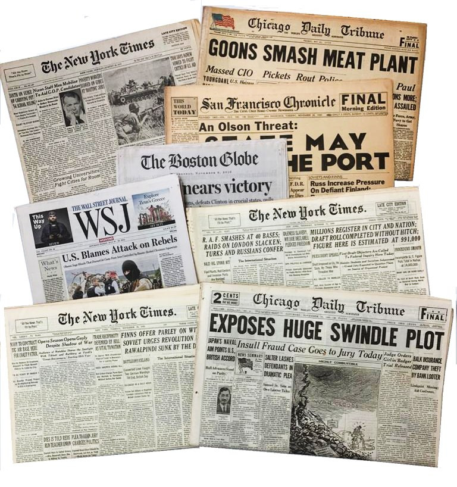
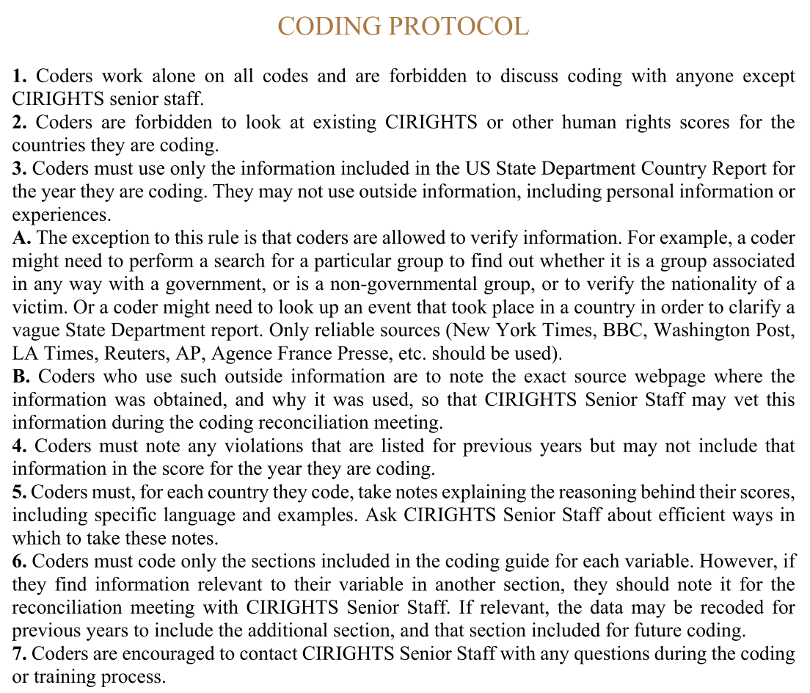
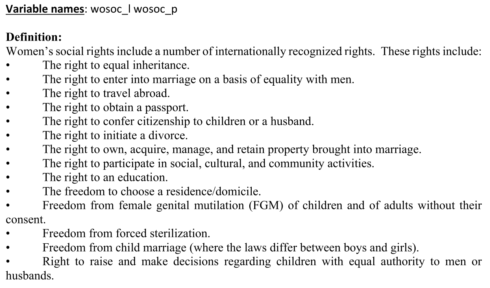
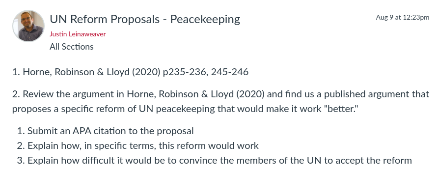

---
output:
  xaringan::moon_reader:
    css: ["default", "extra.css"]
    lib_dir: libs
    seal: false
    nature:
      highlightStyle: github
      highlightLines: true
      countIncrementalSlides: false
      ratio: '16:9'
---

```{r, echo = FALSE, warning = FALSE, message = FALSE}
library(tidyverse)
#library(readxl)
#library(stargazer)
#library(kableExtra)
#library(modelr)

knitr::opts_chunk$set(echo = FALSE,
                      eval = TRUE,
                      error = FALSE,
                      message = FALSE,
                      warning = FALSE,
                      comment = NA)
```

background-image: url('libs/Images/background-scales_justice_v3.png')
background-size: 105%
background-position: top
class: middle

.size50[**III. International Institutions for Coordination**]

<br>

.size45[**Today's Agenda: Effectiveness Analysis**]

.size40[
- Convention on the Elimination of All Forms of Discrimination against Women (CEDAW)

- Commission on the Status of Women (CSW)
]

<br>

.center[.size40[
  Justin Leinaweaver (Fall 2023)
]]

???

### Prep for Class
1. Check Canvas submissions

2. Open CIRIGHTS codebook and the CIRIGHTS_CEDAW data file

<br>

Our aim for this week has been to examine the UN's ability to tackle harder problems than peacekeeping.

### Seems strange to say it, but help me make the argument that addressing gender inequality is a harder problem than promoting peace in conflict zones.

### - What specific things did the Zwingel chapter highlight about why this was such a difficult challenge for the international community?

<br>

Ultimately, violent conflict is a problem we can tackle (or at least manage)

- Typically both sides in conflict zone prefer peace to war

- Powerful states typically aligned in preventing conflicts from spreading beyond borders/regions

- Mechanisms leading to violent conflict, assuming all want peace, easier to provide / address: information asymmetries, commitment problems, monitoring

- The management of conflict is the root of almost all modern international cooperation (we have rules, experience and tools)

<br>

Gender disputes are WAY more complicated because: 

- Global disputes over the central concept (what is "gender"?),

- Global disputes over the "appropriate" role for "women" in the family and society,

- Global disputes over the central goal
    - Ensure equality (meaning women have access to the same rights as men) OR
    - To identify and elevate rights important in women's lives without needing to use "men" as the baseline.
    
- Almost all of our tools weren't designed to address these challenges
    - Almost all international institutions designed by male hierarchies with male lives, preferences, and needs established as the baseline of importance

<br>

**SLIDE**: Today's aim


---

background-image: url('libs/Images/11_1-CEDAW_Convention.jpg')
background-size: 100%
background-position: center
class: middle, center, inverse

.textwhite[.size55[**Commission on the Status of Women (CSW)**

<br>

<br>

**Convention on the Elimination of All Forms of Discrimination against Women (CEDAW)**
]]

???

Our goal for today is to explore the effectiveness of the Commission on the Status of Women (CSW) and the Convention on the Elimination of All Forms of Discrimination against Women (CEDAW)

- There really isn't a ton of literature out there that does this in an accessible or easy to digest manner

- That makes sense given the complexities of the problem AND how the institutions were designed primarily to advance norms rather than hard and fast rules

<br>

So, let's start with this: 

- We need a research question to guide our work today!

<br>

### BRAINSTORM *ON BOARD*: So, what's a good research question for our work today?

- (Has the CSW/CEDAW had a substantial impact on the lives of women around the world?)

- (How effective has the CSW/CEDAW been?)

- (Have state participants with CSW/CEDAW changed their behavior more than non-participants?)

<br>

Ok, we have our research question.

- Next step is to specify our theory of the case

- In other words, based on the design and function of the CSW and CEDAW we need to identify the mechanisms that exist to change state behavior.

- **SLIDE**: Let's tackle each one in turn


---

background-image: url('libs/Images/11_1-CSW_1946.jpg')
background-size: 93%
background-position: center
class: middle, center, slideblue

.size50[.content-box-white[**Commission on the Status of Women (1946)**]]

???

First talk to me about the Commission on the Status of Women (CSW)

### How significant an act of delegation was the creation of the CSW?

<br>

### What specific tools does the CSW have to enable it to influence states and/or set global standards?

- (*ON BOARD*: Proposed Mechanisms)

<br>

#### Notes
- [ECOSOC resolution 11(II) of 21 June 1946](https://documents-dds-ny.un.org/doc/RESOLUTION/GEN/NR0/043/10/IMG/NR004310.pdf?OpenElement)


---

background-image: url('libs/Images/background-blue_cubes_lighter3.png')
background-size: 100%
background-position: center
class: middle, center

.size45[.content-box-white[**Treaty Design Analysis**]]

<br>

.size35[.content-box-white[**Convention on the Elimination of All Forms of Discrimination**]]

.size35[.content-box-white[**against Women (CEDAW)**]]

.pull-left[
```{r, echo = FALSE, fig.align = 'center', out.width = '100%'}
knitr::include_graphics("libs/Images/02_2-Legalization_Fig1.png")
```
]

.pull-right[
```{r, echo = FALSE, fig.align = 'center', out.width = '100%'}
knitr::include_graphics("libs/Images/03_2-KLS_Table1.png")
```
]

???

Now switch to CEDAW.

### What specific tools / norms / mechanisms does the CEDAW have to enable it to influence states and/or set global standards?

- (*ON BOARD*: Proposed Mechanisms)

<br>

### Any important limitations from the design of the CEDAW we should keep in mind?

### - Specific articles or language choices that raise concerns or are likely to limit the impacts?

<br>

Ok, so now we have the broad outlines of a theory of the case

- These are the mechanisms we are proposing by which these two international institutions have the capacity to influence state behavior.

<br>

#### Notes
Zwingel (2016, p59-60): Assessing the Instrument
- "It contains a tension between a rather comprehensive vision both on discrimination against women and on equality of women with men, on the one hand, and a low-key monitoring mechanism modeled after the interests of states, on the other."
- While earlier international documents dealing with the status of women often had a protective character, CEDAW is predominantly based on non-discrimination (Hevener Kaufman 1986).
- In contrast to its substantial strengths, the Convention offers only a low-key mechanism to oversee the implementation of its ambitious goals. Three dimensions seem particularly problematic. According to the text of the treaty, the Committee has no mandate to establish connections to NGOs, it has no way to verify the admissibility of reservations, and its functionality is restricted by an annual meeting time of only two weeks. As the following chapters will show, this extremely unsatisfactory starting point has been widened both formally and informally.


---

background-image: url('libs/Images/background-blue_cubes_lighter3.png')
background-size: 100%
background-position: center
class: middle

.center[.size70[.content-box-purple[**Prep for Today: Evidence**]]]

.pull-left[
```{r, echo = FALSE, fig.align = 'center', out.width = '90%'}

```
]

.pull-right[

<br>

```{r, echo = FALSE, fig.align = 'center', out.width = '100%'}
knitr::include_graphics("libs/Images/11_2-CIRIGHTS_Codebook_Cover.png")
```
]

???

For today I asked each of you to gather and review evidence relevant to our research question.

- Evidence 1: Real world cases of the CSW or CEDAW in action in the world

- Evidence 2: The CIRIGHTS data project's coding of women's political and economic rights

<br>

**SLIDE**: Let's start with the real world cases


---

background-image: url('libs/Images/11_2-CSW2023_Banner.jpg')
background-size: 100%
background-position: center
class: middle, center, slideblue

???

I would like each of you to present your case to the class as a test of one or more of these mechanisms.

### In other words, does your case support an argument that the CSW or CEDAW are effective international institutions? Why or why not?

- PRESENT and DISCUSS each

<br>

### - Do any of your cases highlight mechanisms we didn't propose based on the design of the institutions?

<br>

How confident are we in this answer given the quality of this evidence? 

### - In other words, is the list of submitted cases valid and reliable data for the purposes of testing our proposed mechanisms? Why or why not?

### - Case selection problems?

### - Cases do or do not illustrate the mechanisms we proposed?

### - Cases sufficiently detailed to examine state behavior?

<br>

### Bottom line, do our cases collectively support a strong effectiveness argument? Why or why not?


---

background-image: url('libs/Images/background-blue_cubes_lighter3.png')
background-size: 100%
background-position: center
class: middle, center

```{r, echo = FALSE, fig.align = 'center', out.width = '70%'}
knitr::include_graphics("libs/Images/11_2-CIRIGHTS_Codebook_Cover.png")
```

???

Clearly that test has some limitations (not least of which is that you didn't collect them explicitly with this test in mind).

<br>

Our second piece of evidence is access to an extracted piece of a dataset produced by the CIRIGHTS Project.

- The CIRIGHTS project aims to quantitatively measure various aspects of "a respect for human rights" in countries around the world.

- In other words, the CIRIGHTS researchers "code" each country-year for a variety of human rights 

<br>

### Per the codebook, where do the researchers get the data that they use to represent each country-year?
- (The primary source is the US State Department Country Reports on Human Rights Practices.)

<br>

### Has anybody read one of these reports produced by the US State Department?

### - Any concerns about using data produced by the US government for measuring human rights around the world?

<br>

### What is the coding decision specified in FAQ #6? How does this impact our ability to use CIRIGHTS data for measuring the experience of women around the world?

- ("The CIRIGHTS and previous CIRI Human Rights Data Projects code only government violations of the human rights of its citizens, so violations against non-citizens are not coded.")

<br>

**SLIDE**: Now let's talk about the coding protocol


---

background-image: url('libs/Images/background-blue_cubes_lighter3.png')
background-size: 100%
background-position: center
class: middle, center

```{r, echo = FALSE, fig.align = 'center', out.width = '70%'}

```

???

In small groups, review the coding protocol on p4.

- Get ready to report back, how confident should we be in this procedure.

<br>

### How confident should we be in the measurements produced by the CIRIGHTS team?

### - Strengths and weaknesses in their protocol?

<br>

**SLIDE**: Coding scheme for wopol


---

background-image: url('libs/Images/background-blue_cubes_lighter3.png')
background-size: 100%
background-position: center
class: middle, center

```{r, echo = FALSE, fig.align = 'center', out.width = '75%'}
knitr::include_graphics("libs/Images/11_2-wopol_def.png")
```

???

Our first quantitative measure represents women's political rights.

- Small groups, review this instrument and get ready to report back your level of confidence in the measures it would produce.

<br>

### How confident should we be in the wopol data?

<br>

**SLIDE**: Next up, and finally, is the women's economic rights variable


---

background-image: url('libs/Images/background-blue_cubes_lighter3.png')
background-size: 100%
background-position: center
class: middle, center

```{r, echo = FALSE, fig.align = 'center', out.width = '57%'}
knitr::include_graphics("libs/Images/11_2-wecon_def.png")
```

???

Small groups, review this instrument and get ready to report back your level of confidence in the measures it would produce.

<br>

### How confident should we be in the wecon data?

<br>

Note: Omitted Women’s social rights for too much missing data

<br>

**SLIDE**: Time to analyze!


---

background-image: url('libs/Images/background-blue_cubes_lighter3.png')
background-size: 100%
background-position: center
class: middle, center

.size60[.content-box-white[**Dataset Structure**]]

<br>

```{r, echo = FALSE, fig.align = 'center', out.width = '100%'}
knitr::include_graphics("libs/Images/11_2-CIRIGHTS_x_Rat1.png")
```

???

On Canvas I've given you an extract of the CIRIGHTS dataset focused on our two key variables AND I've added CEDAW ratification dates to each row.

- Observations are by country

- Variables
    - Ratification date for CEDAW
    - Women's political rights snapshots across time (1981, 1991, 2001, 2011, 2019)
    - Women's economic rights snapshots across time (1981, 1991, 2001, 2011, 2019)

- Blank cells are missing data

<br>

### How big a problem is the missing data here?

### - Evidence of selection bias?

<br>

**SLIDE**: How to read it...


---

background-image: url('libs/Images/background-blue_cubes_lighter3.png')
background-size: 100%
background-position: center
class: middle, center

.size60[.content-box-white[**Dataset Structure**]]

<br>

```{r, echo = FALSE, fig.align = 'center', out.width = '100%'}
knitr::include_graphics("libs/Images/11_2-CIRIGHTS_x_Rat2.png")
```

???

wopol and wecon values after ratification are the ones with a chance to be moved by CEDAW

### Everybody clear on how to think about the data as a test of CEDAW effectiveness?


---

background-image: url('libs/Images/background-blue_cubes_lighter3.png')
background-size: 100%
background-position: center
class: middle

.pull-left[

<br>

```{r, echo = FALSE, fig.align = 'center', out.width = '100%'}
knitr::include_graphics("libs/Images/11_2-CEDAW_UN_Logo.webp")
```
]

.pull-right[
.size45[
.content-box-white[**Make Three Lists**]
1. States that improved their scores

2. States that stayed the same

3. States that got worse
]]

???

Groups, make three lists and then discuss your results.

- Can we see concrete evidence of change post-ratification in this data? 

<br>

PRESENT FINDINGS and DISCUSS


---

background-image: url('libs/Images/background-blue_cubes_lighter3.png')
background-size: 100%
background-position: center
class: middle

```{r, echo = FALSE, fig.align = 'center', out.width = '100%'}
knitr::include_graphics("libs/Images/11_2-CEDAW_Reservations.png")
```

???

Natalie Zirngast's (2013) work produced this table.

<br>

### Which states had substantial reservations that we identified last class? 
- [LINK](https://treaties.un.org/pages/ViewDetails.aspx?src=IND&mtdsg_no=IV-8&chapter=4&clang=_en)

<br>

### Do those states have different effects in the data? 

- PRESENT and DISCUSS

<br>

#### Notes
- *CITE: Natalie Zirngast (2013) Demanding to be human: The moral authority of human rights and the Convention on the Elimination of All Forms of Discrimination against Women (CEDAW). Master's Thesis. Victoria University.*


---

background-image: url('libs/Images/background-blue_cubes_lighter3.png')
background-size: 100%
background-position: center
class: middle, center

```{r, echo = FALSE, fig.align = 'center', out.width = '72%'}
knitr::include_graphics("libs/Images/11_2-Englehart_Miller_2014_Cover.png")
```

???

Just to wrap up today I wanted to share the results of one published piece of research that tried to answer a similar research question to our work today.

- Englehart and Miller (2014)

<br>

Importantly, this paper argues that there is a strong positive effect of ratifying CEDAW on women's rights around the world.

- The catch is that the effect is not uniform across all countries.

- **SLIDE**: Let's examine the results to see what that means.

<br>

#### Notes
- "High-Performing Countries Ratify CEDAW and Drive the Results" (p31-35, Figs 1,2,3 and 4)
- "CEDAW Parties Simply Pick the Low-Hanging Fruit" (p35-36, Figs 5 and 6)
- (OMIT for being too dense/unclear in results?) "Changing Global Standards and the 'World Polity'" (p36-38, Table 3)


---

background-image: url('libs/Images/background-blue_cubes_lighter3.png')
background-size: 100%
background-position: center
class: middle, center

```{r, echo = FALSE, fig.align = 'center', out.width = '90%'}
knitr::include_graphics("libs/Images/11_2-Englehart_Miller_2014-Fig1.png")
```

???

Ok, Figure 1 visualizes the average CIRI political rights for women in a specific year split out for states that ratified CEDAW and those that did not.

- x-axis is the year

- y-axis is the average CIRI score for political rights of women

<br>

Time to practice describing and analyzing a data visualization.

- Talk to the person next to you and get ready to report back on what you learn from the figure

- Start by describing what you see AND THEN use that to draw a deeper conclusion

<br>

### What do we learn from this figure?

Simple Descriptions: 
1. In each year the average score for women's political rights is higher in states that ratified CEDAW

2. There is much more across time variation in the average scores for non parties than for parties to CEDAW

3. CEDAW parties may be, very slightly, increasing women's political rights across time

<br>

Critical Analyses:
1. Do we have the causation arrow pointing in the right direction? Does CEDAW improve rights OR do ONLY states with strong rights ratify CEDAW?


---

background-image: url('libs/Images/background-blue_cubes_lighter3.png')
background-size: 100%
background-position: center
class: middle, center

```{r, echo = FALSE, fig.align = 'center', out.width = '90%'}
knitr::include_graphics("libs/Images/11_2-Englehart_Miller_2014-Fig2.png")
```

???

Let's now try this for Figure 2.

- In a moment, report back both simple descriptions and your analyses of them

<br>

### What do you conclude from this?

Simple Description
1. Distinct positive slope for CEDAW parties

2. Considerable variation in non-parties

<br>

Critical Analysis:
1. Still just a correlation, not causation, HOWEVER I find this more compelling than the last one. Distinct increase in slope across time suggests SOMETHING is pushing these states to change their behavior in this way.
    - Maybe just low hanging fruit?
    
    
    
---

background-image: url('libs/Images/background-blue_cubes_lighter3.png')
background-size: 100%
background-position: center
class: middle, center

```{r, echo = FALSE, fig.align = 'center', out.width = '90%'}
knitr::include_graphics("libs/Images/11_2-Englehart_Miller_2014-Fig3.png")
```

???

Let's now try this for Figure 3.

- In a moment, report back both simple descriptions and your analyses of them

<br>

### What do you conclude from this?

Simple Description
1. Social rights falling in both lines?

<br>

### Any idea why social rights are so much lower than political and economic rights?

- (**SLIDE**)


---

background-image: url('libs/Images/background-blue_cubes_lighter3.png')
background-size: 100%
background-position: center
class: middle, center

```{r, echo = FALSE, fig.align = 'center', out.width = '90%'}

```

???

The opposite of low-hanging fruit? 
- See p33 in codebook

- MUCH harder to change these rights related to family hierarchies and women's autonomy in the home

<br>

**SLIDE**: To try and address these concerns about reversed correlation the authors change their approach.


---

background-image: url('libs/Images/background-blue_cubes_lighter3.png')
background-size: 100%
background-position: center
class: middle, center

```{r, echo = FALSE, fig.align = 'center', out.width = '87%'}
knitr::include_graphics("libs/Images/11_2-Englehart_Miller_2014-Fig5.png")
```

???

In this figure the x-axis now tracks the time since ratification

- So, this focuses only on CEDAW ratifiers.

<br>

In a moment, report back both simple descriptions and your analyses of them

<br>

### What do we learn from this?

### - Does time since ratifying CEDAW improve women's rights?

<br>

Figure 5 shows that CEDAW parties have a MUCH easier time improving women's political rights, but changing social structures is HARD.


---

background-image: url('libs/Images/background-blue_cubes_lighter3.png')
background-size: 100%
background-position: center
class: middle, center

```{r, echo = FALSE, fig.align = 'center', out.width = '87%'}
knitr::include_graphics("libs/Images/11_2-Englehart_Miller_2014-Fig6.png")
```

???

Last one.

### Does this tell a different story?

### - Is this a better test of the mechanisms? Why or why not?

<br>

Figure 6 is presented as an alternative demonstration of the positive effect of joining the CEDAW.

- Both lines moving up over time!

- Effects may be small but heading in the right directions!


---

background-image: url('libs/Images/11_1-CEDAW_Convention.jpg')
background-size: 100%
background-position: center
class: middle, center

.size40[.content-box-blue[**Commission on the Status of Women (CSW)**]

<br>

<br>

<br>

<br>

<br>

]

.size25[.content-box-blue[**Convention on the Elimination of All Forms of Discrimination against Women (CEDAW)**]]

???

### Bottom line conclusions? 

### - Based on our cases and quantitative evidence, are we convinced that the CSW and CEDAW have improved the rights of women?


---

background-image: url('libs/Images/background-blue_triangles_flipped.png')
background-size: 100%
background-position: center
class: middle

.size70[.content-box-purple[**Next Class**]]

<br>

```{r, echo = FALSE, fig.align = 'center', out.width = '100%'}

```

???

Give the class a warning about the Horne, Robinson & Lloyd (2020)

- The UN has a serious problem with allegations of crimes and exploitation in its peacekeeping operations.

- Some of these crimes include those of a sexual nature and can be pretty tough to read about.

- The article I've chosen studies the crimes in more broad strokes not fine details but I wanted to give you a head's up.

- The theory sections is totally safe but the introduction tries to help you see why this is a big deal and that subject is a tough one.


