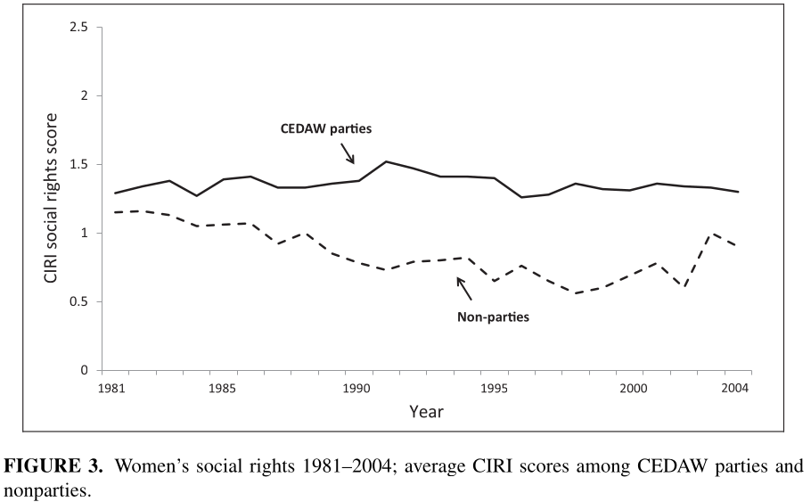

---
output:
  xaringan::moon_reader:
    css: ["default", "extra.css"]
    lib_dir: libs
    seal: false
    nature:
      highlightStyle: github
      highlightLines: true
      countIncrementalSlides: false
      ratio: '16:9'
---

```{r, echo = FALSE, warning = FALSE, message = FALSE}
library(tidyverse)
#library(readxl)
#library(stargazer)
#library(kableExtra)
#library(modelr)

knitr::opts_chunk$set(echo = FALSE,
                      eval = TRUE,
                      error = FALSE,
                      message = FALSE,
                      warning = FALSE,
                      comment = NA)
```

background-image: url('libs/Images/background-scales_justice_v3.png')
background-size: 105%
background-position: top
class: middle

.size50[**III. International Institutions for Coordination**]

<br>

.size45[**Today's Agenda: Effectiveness Analysis**

- Convention on the Elimination of All Forms of Discrimination against Women (CEDAW)
- Commission on the Status of Women (CSW)
]

<br>

.center[.size40[
  Justin Leinaweaver (Fall 2023)
]]

???

### Prep for Class
1. ?

<br>


---

background-image: url('libs/Images/11_1-CEDAW_Convention.jpg')
background-size: 100%
background-position: center
class: middle, center

.size40[.content-box-blue[**Commission on the Status of Women (CSW)**]

<br>

<br>

<br>

<br>

<br>

]

.size25[.content-box-blue[**Convention on the Elimination of All Forms of Discrimination against Women (CEDAW)**]]

???

Setting up our aim for this week: How effective is the UN at establishing global standards of behavior? 
- A continuation of our analyses from last Thursday. 

- Specifically, explore CEDAW as a case study of UN delegation in action. 

- Is this evidence that the UN can achieve substantial things for the world?


---

background-image: url('libs/Images/11_1-CSW_1946.jpg')
background-size: 93%
background-position: center
class: middle, center, slideblue

.size50[.content-box-white[**Commission on the Status of Women (1946)**]]

???

[ECOSOC resolution 11(II) of 21 June 1946](https://documents-dds-ny.un.org/doc/RESOLUTION/GEN/NR0/043/10/IMG/NR004310.pdf?OpenElement)

### Takeaways on delegation to the CSW?


---

background-image: url('libs/Images/background-blue_cubes_lighter3.png')
background-size: 100%
background-position: center
class: middle, center

.size45[.content-box-white[**Treaty Design Analysis**]]

<br>

.size35[.content-box-white[**Convention on the Elimination of All Forms of Discrimination**]]

.size35[.content-box-white[**against Women (CEDAW)**]]

.pull-left[
```{r, echo = FALSE, fig.align = 'center', out.width = '100%'}

```
]

.pull-right[
```{r, echo = FALSE, fig.align = 'center', out.width = '100%'}
knitr::include_graphics("libs/Images/03_2-KLS_Table1.png")
```
]

???

Analyze CEDAW treaty using legalization, KLS and PA theory (guided by the Zwingel reading p49-58)

<br>

Any [reservations](https://treaties.un.org/pages/ViewDetails.aspx?src=IND&mtdsg_no=IV-8&chapter=4&clang=_en) stand out as particularly problematic?


---

background-image: url('libs/Images/11_2-CSW2023_Banner.jpg')
background-size: 100%
background-position: center
class: middle, center, slideblue

???

Share and discuss CASES


---

background-image: url('libs/Images/background-blue_cubes_lighter3.png')
background-size: 100%
background-position: center
class: middle, center

```{r, echo = FALSE, fig.align = 'center', out.width = '70%'}
knitr::include_graphics("libs/Images/11_2-CIRIGHTS_Codebook_Cover.png")
```

???

Introduce the CIRIGHTS Project

Any questions from the intro?

- Data sources?

- Coding procedure?

<br>

**SLIDE**: Coding scheme for wopol and wecon


---

background-image: url('libs/Images/background-blue_cubes_lighter3.png')
background-size: 100%
background-position: center
class: middle, center

.pull-left[
```{r, echo = FALSE, fig.align = 'center', out.width = '100%'}

```
]

.pull-right[
```{r, echo = FALSE, fig.align = 'center', out.width = '100%'}
knitr::include_graphics("libs/Images/11_2-wecon_def.png")
```
]

???

Note: Omitted Women’s social rights for too much missing data

Discuss each measure

- Valid?

- Reliable?


---

background-image: url('libs/Images/background-blue_cubes_lighter3.png')
background-size: 100%
background-position: center
class: middle, center

.size55[**Dataset Structure**]

<br>

```{r, echo = FALSE, fig.align = 'center', out.width = '100%'}
knitr::include_graphics("libs/Images/11_2-CIRIGHTS_x_Rat1.png")
```

???

Observations are by country

Variables
- Ratification date for CEDAW
- Women's political rights snapshots across time (1981, 1991, 2001, 2011, 2019)
- Women's economic rights snapshots across time (1981, 1991, 2001, 2011, 2019)

Blank cells are missing data

### How big a problem is the missing data here?

### - Evidence of selection bias?

<br>

**SLIDE**: How to read it...


---

background-image: url('libs/Images/background-blue_cubes_lighter3.png')
background-size: 100%
background-position: center
class: middle, center

.size55[**Dataset Structure**]

<br>

```{r, echo = FALSE, fig.align = 'center', out.width = '100%'}
knitr::include_graphics("libs/Images/11_2-CIRIGHTS_x_Rat2.png")
```

???

wopol and wecon values after ratification are the ones with a chance to be moved by CEDAW

### Everybody clear on how to think about the data as a test of CEDAW effectiveness?


---

background-image: url('libs/Images/background-blue_cubes_lighter3.png')
background-size: 100%
background-position: center
class: middle

.pull-left[

<br>

```{r, echo = FALSE, fig.align = 'center', out.width = '100%'}

```
]

.pull-right[
.size45[
**Make Three Lists**
1. States that improved their scores

2. States that stayed the same

3. States that got worse
]]

???

Can we see concrete evidence of change post-ratification in this data? CIRIGHTS_CEDAW_Data-2023-06.xlsx

Work in small GROUPS (3) and assign half the groups to wopol and half to wecon

Make three lists
1. States that improved their scores
2. States that stayed the same
3. States that got worse

Share and discuss


---

background-image: url('libs/Images/background-blue_cubes_lighter3.png')
background-size: 100%
background-position: center
class: middle

```{r, echo = FALSE, fig.align = 'center', out.width = '100%'}
knitr::include_graphics("libs/Images/11_2-CEDAW_Reservations.png")
```

???

*CITE: Natalie Zirngast (2013) Demanding to be human: The moral authority of human rights and the Convention on the Elimination of All Forms of Discrimination against Women (CEDAW). Master's Thesis. Victoria University.*

### Which states had substantial reservations that we identified last class? 

### Do those states have different effects in the data? 

[LINK](https://treaties.un.org/pages/ViewDetails.aspx?src=IND&mtdsg_no=IV-8&chapter=4&clang=_en)


---

background-image: url('libs/Images/background-blue_cubes_lighter3.png')
background-size: 100%
background-position: center
class: middle, center

```{r, echo = FALSE, fig.align = 'center', out.width = '60%'}
knitr::include_graphics("libs/Images/11_2-Englehart_Miller_2014_Cover.png")
```

???

You show them the conclusions from Englehart and Miller 2014
- "High-Performing Countries Ratify CEDAW and Drive the Results" (p31-35, Figs 1,2,3 and 4)
- "CEDAW Parties Simply Pick the Low-Hanging Fruit" (p35-36, Figs 5 and 6)
- (OMIT for being too dense/unclear in results?) "Changing Global Standards and the 'World Polity'" (p36-38, Table 3)


---

background-image: url('libs/Images/background-blue_cubes_lighter3.png')
background-size: 100%
background-position: center
class: middle, center

.size30[.content-box-white[**High-Performing Countries Ratify CEDAW and Drive the Results**]]

.pull-left[
```{r, echo = FALSE, fig.align = 'center', out.width = '84%'}
knitr::include_graphics("libs/Images/11_2-Englehart_Miller_2014-Fig1.png")
```

```{r, echo = FALSE, fig.align = 'center', out.width = '84%'}

```
]

.pull-right[
```{r, echo = FALSE, fig.align = 'center', out.width = '87%'}

```

```{r, echo = FALSE, fig.align = 'center', out.width = '87%'}

```
]

???

"High-Performing Countries Ratify CEDAW and Drive the Results" (p31-35, Figs 1,2,3 and 4)


---

background-image: url('libs/Images/background-blue_cubes_lighter3.png')
background-size: 100%
background-position: center
class: middle, center

.size30[.content-box-white[**CEDAW Parties Simply Pick the Low-Hanging Fruit**]]

.pull-left[
```{r, echo = FALSE, fig.align = 'center', out.width = '100%'}

```
]

.pull-right[
```{r, echo = FALSE, fig.align = 'center', out.width = '100%'}

```
]

???

"CEDAW Parties Simply Pick the Low-Hanging Fruit" (p35-36, Figs 5 and 6)


---

background-image: url('libs/Images/11_1-CEDAW_Convention.jpg')
background-size: 100%
background-position: center
class: middle, center

.size40[.content-box-blue[**Commission on the Status of Women (CSW)**]

<br>

<br>

<br>

<br>

<br>

]

.size25[.content-box-blue[**Convention on the Elimination of All Forms of Discrimination against Women (CEDAW)**]]

???

Bottom line conclusions 


---

background-image: url('libs/Images/background-blue_triangles_flipped.png')
background-size: 100%
background-position: center
class: middle

.size70[**Next Class**]

.size40[
1. Horne, Robinson & Lloyd (2020): The Relationship between Contributors’ Domestic Abuses and Peacekeeper Misconduct in United Nations Peacekeeping Operations

2. Binder & Heupel (2015): The Legitimacy of the UN Security Council: Evidence from Recent General Assembly Debates

3. Dreher, Lang, Rosendorff & Vreeland (2022): Bilateral or Multilateral? International Financial Flows and the Dirty-Work Hypothesis
]

???

Give the class a warning about the Horne, Robinson & Lloyd (2020)

- The UN has a serious problem with allegations of crimes and exploitation in its peacekeeping operations.

- Some of these crimes include those of a sexual nature and can be pretty tough to read about.

- The article I've chosen studies the crimes in more broad strokes not fine details but I wanted to give you a head's up.

- The theory sections is totally safe but the introduction tries to help you see why this is a big deal and that subject is a tough one.

- Also, give me a head's up before next class if you have concerns about digging into this literature. I can make sure you are in a different group.


