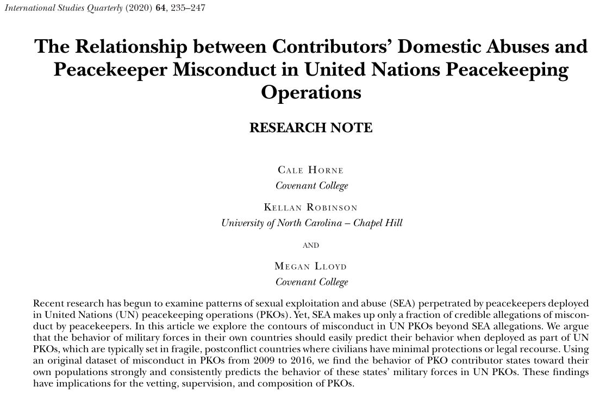
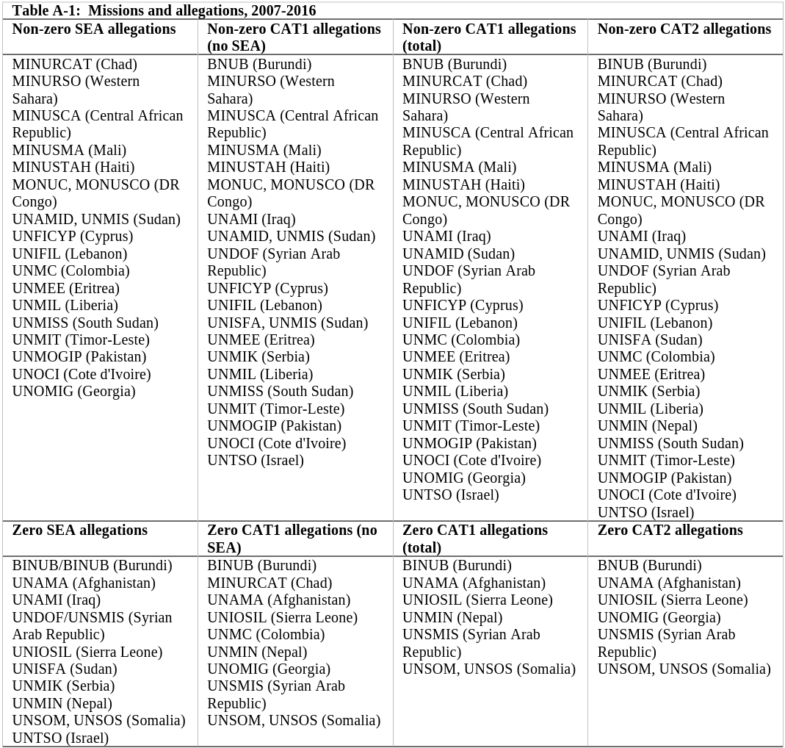
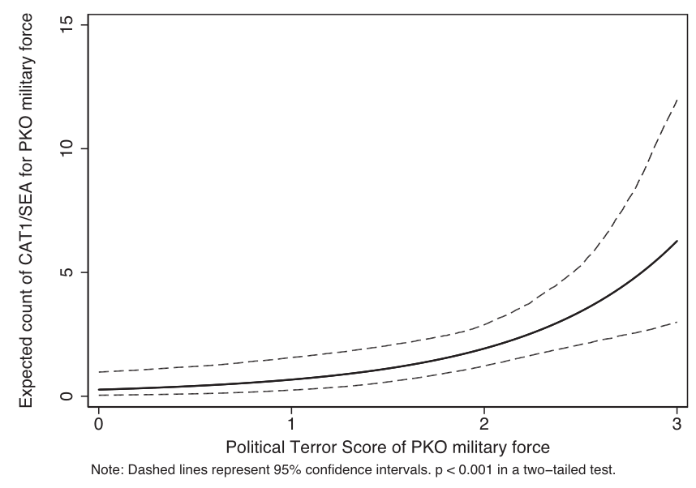
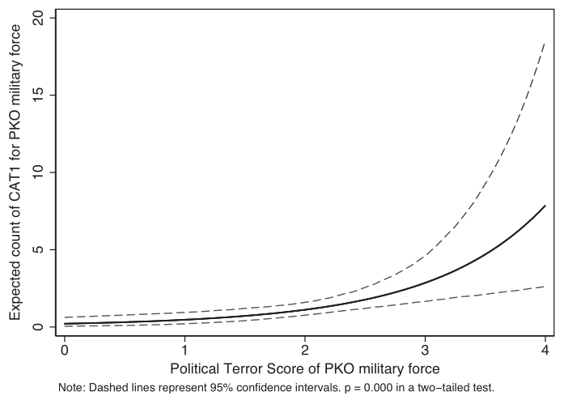
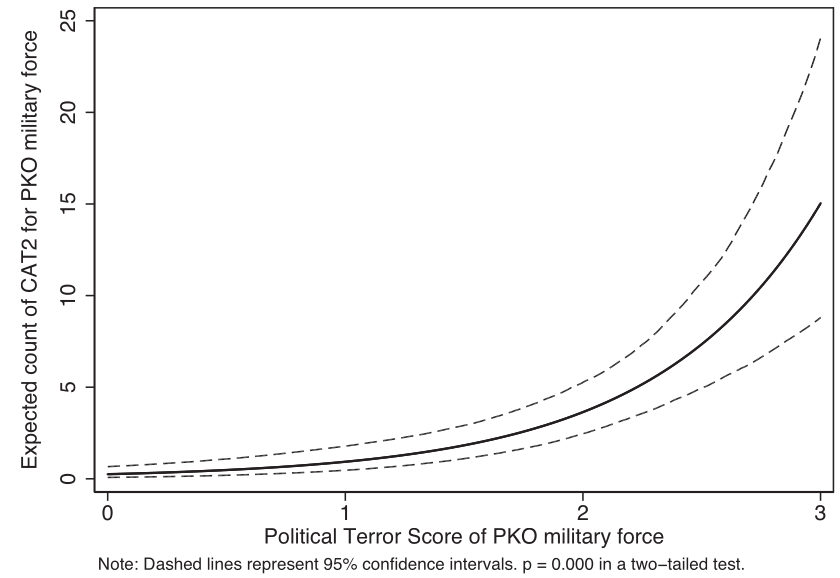
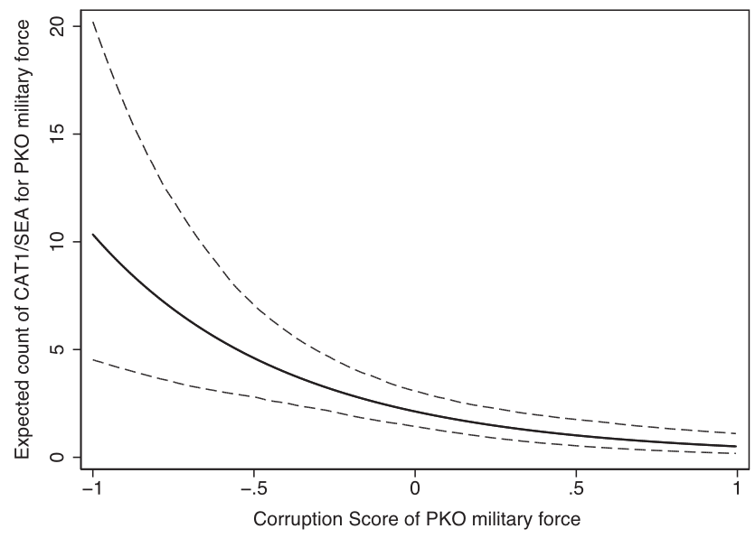
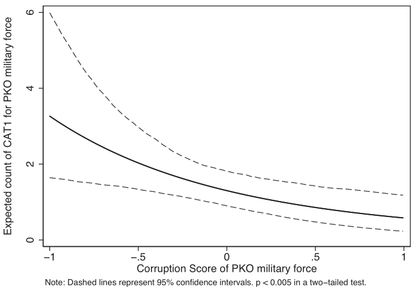
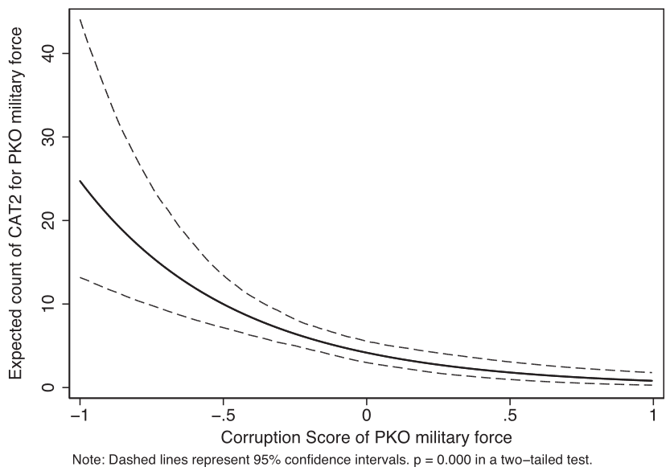
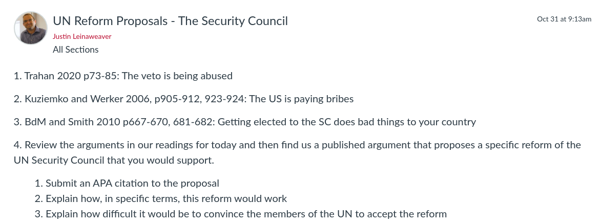

---
output:
  xaringan::moon_reader:
    css: ["default", "extra.css"]
    lib_dir: libs
    seal: false
    nature:
      highlightStyle: github
      highlightLines: true
      countIncrementalSlides: false
      ratio: '16:9'
---

```{r, echo = FALSE, warning = FALSE, message = FALSE}
library(tidyverse)
#library(readxl)
#library(stargazer)
#library(kableExtra)
#library(modelr)

knitr::opts_chunk$set(echo = FALSE,
                      eval = TRUE,
                      error = FALSE,
                      message = FALSE,
                      warning = FALSE,
                      comment = NA)
```

background-image: url('libs/Images/background-scales_justice_v3.png')
background-size: 105%
background-position: top
class: middle

.size50[**III. International Institutions for Coordination**]

<br>

.size50[**Today's Agenda: Reforming UN Peacekeeping**
- Horne, Robinson & Lloyd (2020)
]

<br>

.center[.size40[
  Justin Leinaweaver (Fall 2023)
]]

???

### Prep for Class
1. Review Canvas submissions

<br>

**SLIDE**: Before we dive in today, let's warm up with a couple of questions...


---

background-image: url('libs/Images/10_1-United-Nations.jpg')
background-size: 100%
background-position: center
class: bottom

.center[.size50[.content-box-blue[What is the United Nations?]]]

???

### At this point, If someone asked you what the UN is, what would you tell them?

<br>

As we've noted previously the UN is both:

- A set of constitutional principles, and 

- A collection of agents who have been delegated specific authorities.


---

background-image: url('libs/Images/2017_07_18-12_2-Food-aid-delivered-in-Sudan.jpg')
background-size: 100%
background-position: center
class: bottom

.center[.size50[.content-box-blue[What important and valuable things has the United Nations done for the world?]]]

???

<br>

### If you wanted to make the argument that the UN has done important and valuable things for the world, what would you include?

- Coordinated food aid, peacekeeping, advanced norms to reduce gender discrimination, settled conflicts peacefully in the ICJ, ...

<br>

For the last few weeks we've been analyzing the design and effectiveness of the UN.

- This week I want us to talk problems and solutions at the United Nations.

<br>

Given how big and amorphous the UN is, we are spoiled for choices of problems to examine.

- To keep things somewhat doable I've decided to focus our work on problems with peacekeeping and the Security Council

<br>

**SLIDE**: A point of warning


---

background-image: url('libs/Images/background-blue_cubes_lighter3.png')
background-size: 100%
background-position: center
class: middle

.size45[
Rep. Mario Diaz-Balart (R-Fla), Chairman of the House Appropriations subcommittee that oversees foreign aid:

"What’s the role of the Human Rights Council? To pursue and to promote human rights, yet they have among the world’s worst human rights abusers [on the council]," the Florida Republican said. "It would be funny if for the fact it weren't so dangerous and again that we're spending so much money on that" ([Oswald 2023, Feb 1](https://rollcall.com/2023/02/01/house-foreign-aid-cardinal-sanguine-on-fiscal-2024-funding/)).
]

???

These comments represent the kinds of common criticisms that are aimed at the UN.

- While these sound substantive (e.g. China is bad, spending is bad), they don't actually engage with the institutions in a useful way.

<br>

1. Countries that violate human rights can get onto the Human Rights Commission because that's how it was designed
    - The UN principals, "good" states and "bad," collaborate in a forum designed to produce benefits of delegation
    
    - Wanting to exclude the "bad" states is a fundamental misunderstanding of the purpose of the organization
        - Plus, we have plenty of those organizations (G20, G7, OECD, etc)

    - Criticizing the UN for doing precisely what it was designed to do is, frankly, stupid.

2. We have to pay for things we want in the world and the Human Rights Council budget is miniscule
    - Human Rights Council baseline budget was $133 million in 2022, HOWEVER the US portion of that was only $29 million [OHCHR](https://www.ohchr.org/en/about-us/funding-and-budget)
    
    - In FY2023 the US House budgeted $810 million as an allowance for House members to run their offices ([FY2023 deets](https://demandprogress.org/legislative-branch-funding-breakdown-in-the-fy-2023-omnibus-bill/))
    
    - We should absolutely be careful about where our money goes and how it is used, but let's make sure our critiques are rooted in empirical reality

<br>

My hope for us this week is to identify serious critiques rooted in empirical evidence and tied to the actual design of the institutions.

- Let's not waste time tilting at windmills or trying to get on TV by being the loudest voice

- Let's actually try to make things better.

<br>
    
### NOTES
- The US provides approximately 22% of the UN budget ([CFR](https://www.cfr.org/article/funding-united-nations-what-impact-do-us-contributions-have-un-agencies-and-programs)) but that's because we have BY FAR the largest economy in the world and we designed the damn thing.
- In 2021 our $12.5 billion paid for peacekeeping, the International Atomic Energy Agency, the World Health Organization (WHO)and many, many other institutions that generate significant value for us.
- In a 4.1 trillion dollar US budget (FY2022) that amounts to .3%
- In FY2023 the US House budgeted $810 million as an allowance for House members to run their offices ([FY2023 deets](https://demandprogress.org/legislative-branch-funding-breakdown-in-the-fy-2023-omnibus-bill/)) which represents a $35 million increase from last year.


---

background-image: url('libs/Images/background-blue_triangles_flipped.png')
background-size: 100%
background-position: center
class: middle, center

.size50[.content-box-blue[**The UN System has problems**]]

```{r, echo = FALSE, fig.align = 'center', out.width = '75%'}

```

???

For today I asked you to review a research note that identifies serious problems in UN peacekeeping and then to go find us ideas for improving the situation.

<br>

We'll start by exploring the research.

### What is the key variation that Horne, Robinson and Lloyd (2020) aim to explain in their paper?

- ("In this article we begin to explore the contours of misconduct in UN PKOs beyond SEA allegations" (235).)
    - PKO: peacekeeping operations
    - SEA: sexual exploitation and abuse
    
<br>

### And can we summarize the key conclusion of this paper?

### - What explains the variation in PKO misconduct?

- ("Bad" states develop "bad" militaries and then send some of those "bad" military personnel on peacekeeping missions where they keep doing "bad" things.)

<br>

Work in small groups and let's see if we can diagram this model

### - What are the interests, institutions and interactions that explain the patterns of misconduct in UN peacekeeping? (p236)

- Go!

<br>

Groups, put your version up on the board and present it to us!

<br>

(**SLIDE**: My version)


---

background-image: url('libs/Images/background-blue_cubes_lighter3.png')
background-size: 100%
background-position: center
class: middle

.center[.size30[.content-box-white[**Horne, Robinson & Lloyd (2020): The "Bad" State Model**]]]

.size30[
Interests
- "Bad" state leaders &rarr; political survival and profit

Institutions
- States choose whether or not to contribute peacekeepers from their military forces
- UN faces huge demand for peacekeeping, offers unaccountable reimbursements to TCCs and PKO personnel, and requires PKO training that misses the point

Interactions
- Selection Problem 1: "Bad" states recruit and enlist "bad" actors into their militaries
- Selection Problem 2: "Bad" states contribute their "worst" troops
- PKOs populated by the "worst" troops are more likely to do bad things 
]

???

This theory section lays out two competing models, one focused on "good" states and one on "bad" states

- Our interest is on understanding the dynamics of the "bad" states since they are,  apparently, the primary explanation for the variation of interest (e.g. misconduct).

<br>

There's a ton of interesting theory here, but I think the heart of it is a story about how bad institutional design creates and reinforces selection effects.

1. Selection Argument 1 is that "bad" states have military forces full of "bad" actors
    - States that use the military for controlling (violence) or extracting profit (corruption) from the domestic population will:
        - Actively recruit "individuals amenable to these behaviors", AND
        - Actively enlist those individuals "drawn to opportunities for unaccountable violence and/or graft"

2. Selection Argument 2 is that "bad" states are likely to contribute their "worst" troops for peacekeeping operations
    - "Bad" states view UN peacekeeping contributions as a chance to send their military forces to extract profit from other countries or to temporarily remove "bad" actors from their own country
    
<br>

How are  both of these selection effects stories about institutional failure?

- Selection effect 1 is the direct result of weak, or non-existent, domestic institutions that could protect the people

- Selection effect 2 is the direct result of weak, or non-existent, international institutions that could protect the people in need of PKOs
    - Huge demand for peacekeeping,
    
    - UN’s system of unaccountable reimbursements to TCCs AND peacekeepers creating perverse incentives for both, and
    
    - UN training badly designed to address these selection problems
        - The bad PKOs aren't committing crimes because they don't know they are crimes!
        - It's why they enlisted and why their governments chose them!

<br>

### What do we think of the model? Is it logical and convincing?

<br>

Let's practice thinking like researchers.

### What data would you need to test the implications of this model?

- (Outcome: A measure of misconduct by PKOs)

- (Predictor: Measures for how "bad" a TCC state is)
    - Some way to measure the state's use of violence against its own people
    
<br>

### Does that make sense?

<br>

**SLIDE**: Quick trip through the data analysis starting with the source of the data!

<br>

#### OLD Notes
Whole theory section on p236

1. Domestic military behavior predicts international military behavior

2. Militaries that harm their own people (violence or corruption) are more likely populated by individuals amenable to targeting the innocent

3. Some states contribute their "best" troops to peacekeeping and others their "worst."

4. There is huge demand for peacekeeping which means the "bad" almost certainly outnumber the "good."

5. UN mistakenly focuses its "misconduct prevention" on "peacekeeper training" which isn't at all the actual problem.

Therefore, "bad" states provide peacekeepers who do bad things.
"Bad" states develop "bad" militaries and then send some of those "bad" military personnel on peacekeeping missions where they keep doing "bad" things.


"UN’s system of unaccountable reimbursements to TCCs (such that reimbursements may or may not go to the costs of equipping and fielding the state’s PKO contingent), as well as procedures for allotting mission subsistence allowances, which provide perverse incentives for both states and individuals to join a PKO" (236).

Troop-contributing countries (TCCs)


Premise 1: Domestic military behavior predicts international military behavior
- Militaries are likely to perform internationally in the same ways as they do domestically (good or bad).
- "...the abusive behavior of militaries and governments in their own countries should predict their behavior when deployed abroad as part of a PKO" (236).
    1. Violence: "For states that either (1) routinely use their militaries to terrorize their own populations or (2) are unable or unwilling to curb abuses by these forces operating domestically, similar behavior is expected when these forces are deployed in PKOs."
    2. Corruption: "Similarly, for states where official corruption is the norm, the uniformed agents of the state are expected to engage in corrupt acts when deployed."
- Opposite applies too: "This pattern should stand in contrast with states boasting self-restrained and accountable militaries routinely used in ways consistent with the public good and rule of law."

Premise 2: Militaries that harm their own people (violence or corruption) are more likely populated by individuals amenable to targeting the innocent
- "Bad" militaries are likely populated by dangerous individuals (those amenable to violence against citizens or corruption)
- Selection effect in "who is recruited for and who seeks entry into military service."
    - Demand-side: "...systems where military forces are engaged in regular misconduct—be it unlawful violence or nonviolent corruption—should seek to recruit individuals amenable to these behaviors."
    - Supply-side: "...individuals drawn to opportunities for unaccountable violence and/or graft should seek entry into states’ security services in places where a uniform offers these rewards."
    
Premise 3: Some states contribute their "best" troops to peacekeeping and others their "worst."
- Best: "...to gain operational experience, national prestige, or moral influence at the UN or to equip troops at the UN’s expense (Bellamy and Williams 2010, 58–65)."
- Worst: Some states see sending peacekeepers as a chance for "simple profit, opportunities for extraction, or even temporarily removing bad actors from their own countries."
- The UN does a bad job tying reimbursement to peacekeeper behavior
    - "...the UN’s system of unaccountable reimbursements to TCCs (such that reimbursements may or may not go to the costs of equipping and fielding the state’s PKO contingent), as well as procedures for allotting mission subsistence allowances, which provide perverse incentives for both states and individuals to join a PKO (Pyman et al. 2013, 36)."
- "Arguments from selectorate theory suggest that militaries may capitalize on the resources and training gained through peacekeeping activities to increase their capacity for domestic repression—meaning even TCCs incentivized sending their best troops may have a propensity for misconduct in the field (Levine, Mackay, and Nasirzadeh 2016)."

Premise 4: There is huge demand for peacekeeping which means the "bad" almost certainly outnumber the "good"
- "However, the unexpected demand for post–Cold War peacekeeping, combined with the withdrawal of the western powers from most operations..."

Premise 5: UN mistakenly focuses its "misconduct prevention" on "peacekeeper training" which isn't at all the actual problem.
- "If our argument is correct, lack of education about what constitutes abuse is not the main source of misconduct among peacekeepers, and preemptive or remedial training may not be the answer to the problem of misconduct. Such misconduct ranges from low-level fraud to highly organized abuses of the most serious kind."
- "Sadly, most documented misconduct appears to be a conscious choice."


---

background-image: url('libs/Images/background-blue_cubes_lighter3.png')
background-size: 100%
background-position: center
class: middle

.center[.size30[.content-box-white[**Horne, Robinson & Lloyd (2020): Variables**]]]

.size30[
**Outcome Variable: Military Peacekeeper Misconduct**
- Annual count of crimes (Peacekeeper Attribute Project (PKAT) Dataset)
    - 3 types: Crimes of a sexual nature, Felony-type crimes, and Lesser abuses

**Predictor Variables**
1. Political Terror Scores for the TCC (PTS Project): 
    - 1 (the good) to 5 (the bad)
    
2. Control of Corruption scores for the TCC (World Bank)
    - -2.5 ("very poor") to 2.5 ("very good")
]

???

The Peacekeeper Attribute Project (PKAT) sounds very cool!

- Both the first two types are classified as "category 1" meaning the most serious infractions

- The lesser abuses are classified as "category 2"

<br>

Both predictor variables focus on the TCC (troop-contributing country), not the PKO personnel.

### - Remind me why that is important?

- (A test of the selection effects as predictors for bad actors, not as measures of those actors directly)

- We don't actually have a measure of those actors directly and evidence supporting the existence of the selection effect would be WAY more useful to policymakers.

<br>

The PTS is a "measure" of "political terror."

- They define political terror as violations of basic human rights to the physical integrity of the person by agents of the state within the territorial boundaries of the state in question.

- So, states that harm their own citizens get higher scores than those that don't.

### - And what is our prediction for the behavior of troops from states that violate human rights?
- (More misconduct!)

<br>

The World Development Indicators from the World Bank collects a "control of corruption" score

- This indicator measures “perceptions of the extent to which public power is used for private gain.

### - And what is our prediction for the behavior of troops from states that are more corrupt?
- (More misconduct!)

<br>

#### Appendix Notes (saved in reading folder)
- Category 1 SEA: "In this definition, sexual abuse is “[a]ctual or threatened physical intrusion of a sexual nature, whether by force or under unequal or coercive conditions. All sexual activity with a minor (a person under the age of 18) is considered as sexual abuse.” Sexual exploitation consists of “[a]ny actual or attempted abuse of position of vulnerability, differential power or trust, for sexual purposes, including, but not limited to, profiting monetarily, socially, or politically from the sexual exploitation of another. This includes acts such as transactional sex, solicitation of transactional sex, and exploitative relationships” (UN Missions—Key Terms n.d.) (237)."
- Category 1 Non-SEA: "...misconduct generally considered felonious in western systems of justice and oftentimes of behavior normally associated with organized crime" (237).
    - "cases involving risk of loss of life to staff or others; abuse of authority or staff; conflict of interest; gross mismanagement; bribery/corruption; illegal mineral trade; trafficking with prohibited goods; life threat/murder; abuse or torture of detainees; arms trade; physical assault; forgery, embezzlement; major theft/fraud; use, possession or distribution of illegal narcotics; waste of substantial resources; entitlement fraud; [and] procurement violations. (UN Missions – Other Misconduct n.d.)"
- Category 2: "...lesser abuses more characteristic of misdemeanor-level crime, ethical violations, or administrative incompetence" (237).
    - "discrimination; harassment; sexual harassment; abuse of authority; abusive behavior;3 basic misuse of equipment or staff; simple theft/fraud; infractions of regulations, rules or administrative issuances; traffic-related violations; conduct that could bring the UN to disrepute; breaking curfew; contract disputes; [and] basic
mismanagement. (UN Missions – Other Misconduct n.d.)" (237).

“The PTS seeks to measure political terror. We define political terror as violations of basic human rights to the physical integrity of the person by agents of the state within the territorial boundaries of the state in question.” 
- PTS scores come from three sources, each calculated on a 5-point ordinal scale, where 5 indicates the highest category of political violence against a population:
- PTS_A: Based on Amnesty International’s State of World’s Human Rights;
- PTS_H: Based on Human Rights Watch’s World Report;
- PTS_S: Based on the U.S. State Department’s Country Reports on Human Rights Practices.
- PTS_MISSION is coded as the average of PTS_A, PTS_H, and PTS_S.

Corruption:  CORR_MISSION_MIL:  
- Control of Corruption scores for the PKO, weighted by military contributor force size. 
- From the World Bank’s Worldwide Governance Indicators, this indicator measures “perceptions of the extent to which public power is used for private gain.”1 Control of Corruption scores range from -2.5 to 2.5, with a score of -2.5 indicating perceptions that state control of corruption is very poor, and a score of 2.5 indicating perceptions that state control over corruption is very good.


---

background-image: url('libs/Images/background-blue_cubes_lighter3.png')
background-size: 100%
background-position: center
class: middle

```{r, echo = FALSE, fig.align = 'center', out.width = '61%'}

```

???

Analysis across twenty-nine UN PKOs in existence in twenty-five host countries from 2009 to 2016.

- Unit of analysis is the mission-year (n = 151)

<br>

Table A-1 splits out the cases by whether or not it experienced zero (the bottom row) or more than zero (the top row) of those crimes.

- "The vast majority of allegations, about 73 percent of the total since 2007, fall into Category 2." 

- "About 42 percent of mission years reported no Category 1 allegations (including SEAs)"

- "slightly fewer than half of all observations reported no Category 1 allegations of any kind." 

- By contrast, only about one-third of observations reported no Category 2 allegations" (237).

<br>

### So, how much variation do we have on the outcome variable?

<br>

Remember, if there isn't good variation on your outcome variable, there's no analysis to be done!

- Our goal is to explain the variation in the outcome and that requires cases that look different from each other

- Otherwise it is selecting on the dependent variable or another form of serious selection bias.

<br>

### Make sense?

<br>

**SLIDE**: Let's step through the findings


---

background-image: url('libs/Images/background-blue_cubes_lighter3.png')
background-size: 100%
background-position: center
class: middle

```{r, echo = FALSE, fig.align = 'center', out.width = '40%'}

```

.pull-left[
```{r, echo = FALSE, fig.align = 'center', out.width = '80%'}

```
]

.pull-right[
```{r, echo = FALSE, fig.align = 'center', out.width = '83%'}

```
]

???

Figures
- 1) Expected Category 1 allegations among PKO military forces including SEAs, by the weighted Political Terror scores of the PKO military force

- 3) Expected Category 1 allegations among PKO military forces excluding SEAs, by the weighted Political Terror scores of the PKO military force

- 5) Expected Category 2 allegations among PKO military, by the weighted Political Terror scores of the PKO military force


---

background-image: url('libs/Images/background-blue_cubes_lighter3.png')
background-size: 100%
background-position: center
class: middle

```{r, echo = FALSE, fig.align = 'center', out.width = '40%'}

```

.pull-left[
```{r, echo = FALSE, fig.align = 'center', out.width = '80%'}

```
]

.pull-right[
```{r, echo = FALSE, fig.align = 'center', out.width = '83%'}

```
]

???

Figures
- 2) Expected Category 1 allegations among PKO military forces including SEAs, by the weighted Corruption scores of the PKO military force

- 4) Expected Category 1 allegations among PKO military forces excluding SEAs, by the weighted Corruption scores of the PKO military force

- 6) Expected Category 2 allegations among PKO military, by the weighted Corruption scores of the PKO military force


<br>

### Bottom line takeaways on the Horne, Robinson & Lloyd (2020) piece?


---

background-image: url('libs/Images/background-blue_triangles2.png')
background-size: 100%
background-position: center
class: middle

.size65[.content-box-blue[**Next Class**]]

<br>

```{r, echo = FALSE, fig.align = 'center', out.width = '100%'}

```

???


