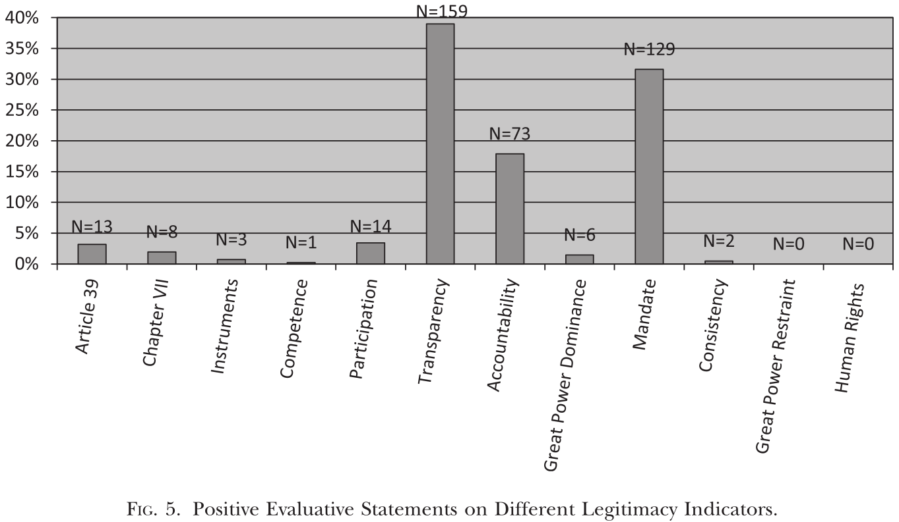

---
output:
  xaringan::moon_reader:
    css: ["default", "extra.css"]
    lib_dir: libs
    seal: false
    nature:
      highlightStyle: github
      highlightLines: true
      countIncrementalSlides: false
      ratio: '16:9'
---

```{r, echo = FALSE, warning = FALSE, message = FALSE}
library(tidyverse)
#library(readxl)
#library(stargazer)
#library(kableExtra)
#library(modelr)

knitr::opts_chunk$set(echo = FALSE,
                      eval = TRUE,
                      error = FALSE,
                      message = FALSE,
                      warning = FALSE,
                      comment = NA)
```

background-image: url('libs/Images/background-scales_justice_v3.png')
background-size: 105%
background-position: top
class: middle

.size50[**III. International Institutions for Coordination**]

<br>

.size50[**Today's Agenda: Reforming the UN**
- Let's make the UN more effective!
]

<br>

.center[.size40[
  Justin Leinaweaver (Fall 2023)
]]

???

### Prep for Class
1. ?

<br>

Let's reform the UN! Find us a published argument that proposes a specific reform of the United Natons (e.g. changes in the power of the GA, the use of the veto in the SC, the membership of the SC, how peacekeeping gets paid for and staffed, how the UN budget is paid for, etc.). Make sure you can explain how, in specific terms, this reform would work, why it would be beneficial and how you might convince the members of the UN to accept the reform. No overlap in specific proposal!

Bring to class a proposal of a specific reform of the UN (e.g. changes in the power of the GA, the use of the veto in the SC, the membership of the SC, peacekeeping, budgeting, etc.). 
- How specifically would it work?
- Why would it beneficial? To whom?
- Why is it a feasible change? How would you sell it?

Articles you found that are relevant
1. Reform the Veto
- Keaten (2018): "...outgoing U.N. human rights chief said Monday that the Security Council’s five permanent members wield too much power at the United Nations, warning the imbalance must change to avert possible “collapse” of the world body “at great cost to the international community.”
- Wenaweser & Alavi (2020). Innovating to Restrain the Use of the Veto in the United Nations Security Council): Very concisely lays out two "reasonable" reforms of the veto power: 1) The ACT Code of Conduct limits the veto for genocide/war crimes/crimes against humanity, 2) GA oversight of vetos
- The ACT code of conduct: U.N. Doc. A/70/621–S/2015/978
- The “French/Mexican initiative”: Link 1
2. Membership Reforms
- G4 (2006) A/60/L.46: Adds 6 PNVM seats (permanent non-veto members), 4 non-permanent with regional representation baked in
- AU (1995) UN GA A/59/L.67 proposal to add seats AND extend the veto
3. Strengthen the GA
- https://archive.globalpolicy.org/un-reform/un-reform-topics/reform-of-the-general-assembly.html

4. Defense of the status quo (US perspective)
- Abrams (2021) Biden Is Working to Undermine America’s Authority at the U.N.

“Uniting for Consensus” Group proposal: Adds a bunch of non-permanent, no veto states bc they argue adding permanent members creates independent power sources
- "Seventy-seven years of UN history “shows permanent members are accountable only to themselves,” Massari said. A new permanent member would only “expand the club of privilege, or oligopoly.” https://www.passblue.com/2023/02/14/italy-is-hopeful-about-un-reform-as-long-as-its-proposal-leads-the-way/

https://link.springer.com/article/10.1007/s11127-017-0468-2
Brainstorming Topics:
- Abolish the SC / transfer powers to the GA
- Make all UNSC seats non-permanent?
- What criteria should we use to decide who is permanent on the SC?
- Debate each of the most likely candidates: Germany, India, Brazil, Japan, ?
- Should the French seat go the EU? 

https://carnegieendowment.org/files/Patrick_et_al_UNSC_Reform_v2_1.pdf


---

background-image: url('libs/Images/background-blue_triangles.jpg')
background-size: 100%
background-position: center
class: middle

.size65[**Let's reform the UN!**]

.size40[
Bring to class a proposal of a specific reform of the UN (e.g. changes in the power of the GA, the use of the veto in the SC, the membership of the SC, peacekeeping, budgeting, etc.). 
- How specifically would it work?
- Why would it beneficial? To whom?
- Why is it a feasible change? How would you sell it?
]

???

No overlap in specific proposals.

- first-come, first-served!


---

background-image: url('libs/Images/background-blue_cubes_lighter3.png')
background-size: 100%
background-position: center
class: middle

.size70[**Has the UN been effective?**]

.size45[
1. Horne, Robinson & Lloyd (2020): "Bad" states provide peacekeepers who do bad things.

2. **Binder & Heupel (2015): The UNSC faces a legitimacy crisis in terms of its procedures and performance.**

3. Dreher, Lang, Rosendorff & Vreeland (2022): The US uses different kinds of foreign aid to buy the votes of non-permanent members of the UNSC. 
]

???

Beardsley (2011) group, take it away!

<br>

**SLIDE**: My version


---

background-image: url('libs/Images/background-blue_cubes_lighter3.png')
background-size: 100%
background-position: center
class: middle

.center[.size30[.content-box-white[**Binder & Heupel (2015): Model to Test**]]]

.size30[
- The UNSC is likely "the most powerful international institution in the history of the nation-state system" but it's ability to wield power depends on its perceived legitimacy.

- The UNSC may lack legal legitimacy due to its frequent efforts to broaden its own reach and influence possibly beyond the consent of other states

- The UNSC may lack procedural legitimacy because it does not allow equal participation, lacks transparency and accountability and is dominated by great powers

- The UNSC may lack performance legitimacy due to its very mixed record of maintaining "international peace and security."

Therefore, the UNSC faces a legitimacy crisis in terms of its procedures and performance.
]

???

Two big research questions (239):
1. "First, how legitimate is the Security Council in the eyes of UN member states?" 
2. "Second, on what grounds are these ascriptions based?"

This is a tough one to diagram...
- "[Legitimacy] is considered to be the key to effective governance" especially for IOs (238-239).
- "Legitimacy is an elusive concept. It is used mainly to designate rule as rightful, moral, or justified" (240).
- "Considering evaluative statements as expressions of state perceptions implies that we do not conceive of legitimacy as a static quality of institutions but rather as the temporary result of an ongoing process by which legitimacy is cultivated, sustained, or forfeited" (240).

1. Legal legitimacy of an IO depends on state consent to its creation and the degree to which it follows its own rules.
    - Lockean view, legitimacy depends upon consent
    - Pursuant to conventional perspectives on international law, state consent is the principal source of legitimacy in the international realm (Henkin 1995:26, Rabkin 2005:266–267).

2. Procedural legitimacy: 4 sources
    - "First, the legitimacy of an IO is said to depend on the equal participation of all of its member states in formal decision making (Dingwerth 2007)."
    - "Second, the legitimacy of an IO is considered to be a function of transparency that enables interested states and stakeholders to trace the decisionmaking process (Caney 2006:748–749)."
    - "A third procedural standard is accountability, which means that states and other actors in whose name an IO takes decisions and who are affected by these decisions can hold the IO responsible (Grant and Keohane 2005)."
    - "Fourth, an IO’s legitimacy can be undermined if the organization is dominated by great powers and if weaker states are forced to bow to their interests and accede to their values (Coicaud and Heiskanen 2001:525–527)."
    - "Many scholars have pointed out that the Security Council does not meet these procedural standards" (241).
    - "Their criticism is that those states most affected by Council action are almost always excluded from the decision-making process, and that Council decision making is highly opaque and largely insulated from public scrutiny (Paul 2004:375). There is no judicial or quasi-judicial body entitled to determine whether the Council has overstepped its competences or violated international law, nor is the GA in a position to call the Council to account (Koskenniemi 1995). Finally, the dominance of the Security Council by a few powerful veto-holding states has been identified as the core challenge to the body’s legitimacy (Caron 1993:566)" (241).

3. Performance legitimacy
    - legitimacy depends on output.
    - "IOs are created with a specific aim; if they do not fulfill their purpose or if they create negative externalities, they will not be considered legitimate. Given that IOs frequently lack fair procedures, scholars have argued that good performance becomes the most important source of IO legitimacy (Scharpf 1999; Gutner and Thompson 2010). The most obvious way to assess IO performance is to examine whether the IO fulfills its mandate. Another way is to determine whether the IO applies its rules consistently, as consistency is believed to increase rule compliance (Franck 1990). Performance legitimacy of IOs can also depend on whether an IO manages to restrain great powers. International institutions can help build a legitimate order if they ensure that the hegemonic state does not exploit weaker states (Ikenberry 2001). Finally, the performance of an IO can be assessed by determining whether it avoids grave negative side-effects and, particularly, whether it respects fundamental human rights (Buchanan and Keohane 2006)" (241).
    - "As regards each of these criteria, Security Council observers consider its track record over the past 20 years to be ambivalent at best" (241-242).


<br>

### What do we think of the model?

### - Is it logical?

### - Is it convincing?

### - How do we use this model to make predictions in the world?

<br>

**SLIDE**: Quick trip through the data analysis starting with the source of the data!


---

background-image: url('libs/Images/background-blue_cubes_lighter3.png')
background-size: 100%
background-position: center
class: middle

.center[.size35[.content-box-white[**Binder & Heupel (2015): 1) Sources & 2) Operationalizations**]]]

.size35[
**Outcome Variable: "Evaluative statements by UN member states on the Security Council"**
- "GA debates on Security Council annual reports" (1991, 1994, 1997, 2000, 2003, 2006, and 2009)
- Each statement is coded by type of legitimacy and positive vs negative

**Legitimacy Indicators**
- Legal: 1) Article 39, 2) Chapter VII, 3) Instruments, 4) Competence
- Procedural: 1) Participation, 2) Transparency, 3) Accountability, 4) Great power dominance
- Performance: 1) Mandate, 2) Great power restraint, 3) Human rights
]

???

*Walk through the data collected and how it measured*

- 1,531 evaluative statements coded
- 1991, 1994, 1997, 2000, 2003, 2006, and 2009 (every 3 years since end of Cold War)
- Hand coding means reading each statement and then coding using their dictionary of indicators

Why are the statements meaningful?
- States provide (or remove) legitimacy to the UNSC through public statements
- "When making evaluative claims about the Security Council, states may ascribe legitimacy to it or they may reject its legitimacy on different grounds. We distinguish three such grounds as stressed by different legitimacy theories, namely legal legitimacy, procedural legitimacy, and performance legitimacy" (240).
- "In international politics, legitimation may occur through public statements, diplomatic exchanges, or practical support (Westra 2010:523); states may also apply strategies of delegitimation when they condemn a powerful state or revoke support from it in international institutions (Walt 2005). Some scholars focus on how subordinates legitimate power holders (Beetham 1991:19)" (240).

Why annual reports?
- "The annual reports summarize all of the activities of the Council and its subsidiary bodies including mediation, peace missions, sanctions regimes, international criminal tribunals, and cross-cutting issues. The reports also give an overview of all Council resolutions, meetings, communication brought to the attention of the Council, and the state of the reform debate on the Council’s working methods" (242).
- "Following the logic of systematic sampling, we analyzed every third debate since the end of the Cold War."

Indicators
- p243 has details on the indicators

<br>

**SLIDE**: Example


---

background-image: url('libs/Images/background-blue_cubes_lighter3.png')
background-size: 100%
background-position: center
class: middle

.center[.size35[.content-box-white[**Binder & Heupel (2015): 1) Sources & 2) Operationalizations**]]]

.size35[
**Outcome Variable: "Evaluative statements by UN member states on the Security Council"**

**Example**
- "We would also like to underscore the importance of the Council’s focusing its efforts on threats to international peace and security. Diluting the Council’s
agenda with issues that are not directly related to its mandate . . . calls into question the legitimacy of its functions" (Columbia 2006).
]

???

This is coded as legal legitimacy (“Article 39”) in 2006 by Columbia and negative.

### Make sense?

<br>

### Strengths and weaknesses of these data choices?

"The study of public rhetoric is challenging. It is difficult to ascertain whether statements made are in line with sincere beliefs or whether they are made strategically as part of a “stage performance” (242). But authors argue it is useful because:
1. "First, providing reasons and justification for positions in the public sphere is not only an important political act in itself (Kratochwil 1989; Hurd 1999:391), but it is also revealing with regard to the beliefs held by the intended audience" (242).
2. "Second, public rhetoric, even if used strategically, may nevertheless be consequential. Scholars have highlighted the “civilizing force of hypocrisy” (Elster 1995:251) and the process of “argumentative self-entrapment” (Risse 2000:23)" (242).

---

background-image: url('libs/Images/background-blue_cubes_lighter3.png')
background-size: 100%
background-position: center
class: middle

.center[.content-box-white[.size30[**Binder & Heupel (2015): 3) Analysis**]]]

.pull-left[
```{r, echo = FALSE, fig.align = 'center', out.width = '70%'}

```
]

.pull-right[
```{r, echo = FALSE, fig.align = 'center', out.width = '70%'}

```
]

```{r, echo = FALSE, fig.align = 'center', out.width = '45%'}

```

???

"We analyzed the debates using the qualitative data analysis software Atlas.ti. The coding of the debates was carried out by both authors on the basis of a common coding scheme, which assured a high level of intercoder reliability" (242-243).

- "Our findings suggest that the Security Council suffers from a legitimacy deficit in the eyes of UN member states. Negative evaluations of the Council far outweigh
positive ones. This holds for all three grounds for legitimacy. Yet, the Council does not find itself in an intractable legitimacy crisis because it still enjoys some rudimentary degree of legitimacy. The legitimacy deficit results primarily from concerns regarding procedural shortcomings; misgivings regarding performance short-comings rank second. Whether or not the Council complies with its legal mandate has not attracted much attention" (239).


---

background-image: url('libs/Images/background-blue_cubes_lighter3.png')
background-size: 100%
background-position: center
class: middle

.center[.content-box-white[.size30[**Binder & Heupel (2015): 3) Analysis**]]]

<br>

.pull-left[
```{r, echo = FALSE, fig.align = 'center', out.width = '100%'}

```
]

.pull-right[
```{r, echo = FALSE, fig.align = 'center', out.width = '100%'}

```
]

???

<br>

### Bottom line takeaways on the Horne, Binder & Heupel (2015) piece?


---

background-image: url('libs/Images/background-blue_cubes_lighter3.png')
background-size: 100%
background-position: center
class: middle

.size70[**Has the UN been effective?**]

.size45[
1. Horne, Robinson & Lloyd (2020): "Bad" states provide peacekeepers who do bad things.

2. Binder & Heupel (2015): The UNSC faces a legitimacy crisis in terms of its procedures and performance.

3. **Dreher, Lang, Rosendorff & Vreeland (2022): The US uses different kinds of foreign aid to buy the votes of non-permanent members of the UNSC.**
]

???

Dreher, Lang, Rosendorff & Vreeland (2022) group, take it away!

<br>

**SLIDE**: My version


---

background-image: url('libs/Images/background-blue_cubes_lighter3.png')
background-size: 100%
background-position: center
class: middle

.center[.size30[.content-box-white[**DLRV (2022): Model to Test**]]]

.size30[
- The US cares about voting behavior in the UNSC so uses foreign aid to buy support for its positions (bribery!)

- There are political costs to the US government (and the recipient) of directing bilateral aid (bribes) to countries that are "politically distant"

- The World Bank and IMF provide a lot of aid money each year and the US holds a "privileged position" in determining where that aid goes

- Directing aid (bribe) money through a multilateral institution is more costly than aiding (bribing) directly so only worth it if the country is "politically distant"

Therefore, the US uses different kinds of foreign aid to buy the votes of non-permanent members of the UNSC. 
]

???

Premise 1: The US cares about voting behavior in the UNSC so uses foreign aid to buy support for its positions on the UNSC (bribery!)
- "The UNSC makes binding resolutions to investigate international disputes, impose sanctions and embargoes, and authorize the use of armed force" (1935).
- "In the absence of UNSC approval, domestic public support for foreign policies is more difficult to achieve, and the US Congress is more recalcitrant (Voeten 2001). Importantly, UNSC resolutions are most valuable for the US government when they pass unanimously" (1935).
- TONS of literature showing the US buys votes both on the SC and in the GA!!!

Premise 2: There are political costs to the US government of directing bilateral aid to countries that are "politically distant"
- Two big dangers of bilateral aid to "politically distant" countries: 1) US voters tend not to support aid for purely strategic aims, 2) providing aid to "politically distant" countries "is inconsistent with standard aid policy" and tends to mobilize opposition to the government.
- Also, "If the government follows a questionable foreign policy, rival political elites (e.g., opposition parties, opposition movements, or competitors inside the ruling party) can offer cues to the domestic audience that mobilize opposition to the government (Aldrich et al. 2006; Berinsky 2007)" (1933).
- Similar logic at play for recipient country. Recipient leader may pay domestic costs (looks suspicious) for accepting aid from opposing country.

Premise 3: The World Bank and IMF provide a lot of aid money each year and the US holds a "privileged position" in determining where that aid goes
- "Like US bilateral flows, IMF and World Bank money has been flowing in large quantities to many countries since the end of World War II" (1934).
- "The boards typically operate according to a consensus rule, and management has agenda-setting power. Management, in turn, is subject to pressure from the US government, both because proposals are preemptively shaped to avoid US opposition and because representatives of the US government are actively involved in important IMF and World Bank discussions..." (1934).

Premise 4: Directing bribe money through a multilateral institution is more costly than bribing directly so only worth it if the country is "politically distant"
- "Multilateral organizations provide a convenient means of obfuscation" (1934).
    - "...it is harder to mobilize opposition against multilateral assistance because there is less clarity of attribution"
    - "George Ingram, a former senior staff member of the US House Committee on Foreign Affairs, recounts: “Typically, when the U.S. wants to support a country that is ruled by a corrupt, uncooperative, or autocratic government, U.S. assistance goes through private channels . . . or multilateral organizations” (Ingram 2019).
    - "The key benefit of using multilateral agencies in this context is that their decision-making is difficult to observe for the domestic audience. Partly because of nontransparent governance (Stasavage 2004) and a “culture of secrecy” (Grigorescu 2013) and partly due to voters’ “rational ignorance” (Vaubel 1986), voters know little about the functioning of multilateral organizations" (1934).
- Dangers of relying on the multilateral channel: 1) US shares power so "principal-agent costs are higher", 2) "overuse damages the organization's reputation for independence" which makes it worse for hiding your influence later.
    - These costs mean it is only worth it when the target of aid is politically distant

### Other Notes

- "Multilateral organizations can do the “dirty work” of their most powerful members (Vaubel 1986, 48) and help “launder” unpopular policies (Abbott and Snidal 1998, 18)" (1932).
- Bilateral foreign aid is used for "promoting development" and to advance the "foreign policy goals of donor governments. Donors give more aid to countries that are politically closer or geopolitically more important to them (Alesina and Dollar 2000)" (1933).
- "Powerful governments also use their influence over multilateral organizations like the IMF and the World Bank to favor countries they consider strategically important (Copelovitch 2010; Kilby 2013b; Stone 2011; Vreeland and Dreher 2014). Such countries receive more financing at better terms and other favorable treatments (Stone 2008)" (1933).
- "Multilateral lending increases efficiency, makes use of organizational expertise, and shares the financial burden at the cost of losing control over how exactly the money is spent... Bilateral aid, in contrast, gives donors more control and is perhaps better suited as a tool of strategic foreign policy" (1933).

THE DIRTY-WORK HYPOTHESIS
- "We expect governments to cooperate and exchange favors with other governments when the expected benefits exceed expected costs" (1933).
    - Benefits: improved national security, economic gains, legitimacy, or political support resulting from cooperative behavior of the targeted government
    - Costs: price paid in terms of financial transfers but also the potential mobilization of domestic opposition for granting such favors.
- "If the government follows a questionable foreign policy, rival political elites (e.g., opposition parties, opposition movements, or competitors inside the ruling party) can offer cues to the domestic audience that mobilize opposition to the government (Aldrich et al. 2006; Berinsky 2007)" (1933).
- "Both audience cost theory and experimental evidence suggest that domestic audiences punish their governments for inconsistency in foreign policy and for a lack of responsiveness to their preferred foreign policies" (same).
- Two big dangers of bilateral aid to "politically distant" countries: 1) US voters tend not to support aid for purely strategic aims, 2) providing aid to "politically distant" countries "is inconsistent with standard aid policy" and tends to mobilize opposition to the government.
- Why might execs want to give money to nonallies their citizens oppose? An attempt to incentivize the "political support from an otherwise unfriendly country" (1934).
- "Multilateral organizations provide a convenient means of obfuscation" (1934).
    - "...it is harder to mobilize opposition against multilateral assistance because there is less clarity of attribution"
    - "George Ingram, a former senior staff member of the US House Committee on Foreign Affairs, recounts: “Typically, when the U.S. wants to support a country that is ruled by a corrupt, uncooperative, or autocratic government, U.S. assistance goes through private channels . . . or multilateral organizations” (Ingram 2019).
    - "The key benefit of using multilateral agencies in this context is that their decision-making is difficult to observe for the domestic audience. Partly because of nontransparent governance (Stasavage 2004) and a “culture of secrecy” (Grigorescu 2013) and partly due to voters’ “rational ignorance” (Vaubel 1986), voters know little about the functioning of multilateral organizations" (1934).
- Dangers of relying on the multilateral channel: 1) US shares power so "principal-agent costs are higher", 2) "overuse damages the organization's reputation for independence" which makes it worse for hiding your influence later.
    - These costs mean it is only worth it when the target of aid is politically distant
- Similar logic at play for recipient country. Recipient leader may pay domestic costs (looks suspicious) for accepting aid from opposing country.

APPLIED to UNSC
- "Like US bilateral flows, IMF and World Bank money has been flowing in large quantities to many countries since the end of World War II" (1934).
- "The boards typically operate according to a consensus rule, and management has agenda-setting power. Management, in turn, is subject to pressure from the US government, both because proposals are preemptively shaped to avoid US opposition and because representatives of the US government are actively involved in important IMF and World Bank discussions..." (1934).

<br>

### What do we think of the model?

### - Is it logical?

### - Is it convincing?

### - How do we use this model to make predictions in the world?

<br>

**SLIDE**: Quick trip through the data analysis starting with the source of the data!


---

background-image: url('libs/Images/background-blue_cubes_lighter3.png')
background-size: 100%
background-position: center
class: middle

.center[.size35[.content-box-white[**DLRV (2022): 1) Sources & 2) Operationalizations**]]]

.size30[
**Outcome Variable: UNSC Votes on Resolutions**
- Successes: The UN Bibliographic Information System
- Vetos: The official UN Veto List
- Failed Majorities: Keyword search of UNSC meeting minutes
- 2,530 total decisions (230 vetoes, 41 failed majorities), 36,550 votes
- 1946 - 2015

**Predictor Variables: Aid Disbursements**
- US bilateral overseas development aid (ODA)
- Multilateral IMF loans
- Multilateral World Bank loans
- Source: OECD
]

???

*Walk through the data collected and how it measured*

- p1936
- Article references Appendix A for details on data collection

Figure 1
- "Using the resolution-level data, we calculate a dyad-year count of how often countries vote against other members in the UNSC in a given year. Figure 1 shows the distribution of this variable for dyads involving the United States" (1937).
- "Examples of countries in the upper end of the distribution (with values of 8 or above) include Russia (in multiple years) but also nonpermanent members like Uganda and Poland (both in 1982) and Trinidad and Tobago (in 1986)."
- "Countries in the lower end of the distribution (with values of 1) include the permanent members France and the United Kingdom (in multiple years) and nonpermanent members like Morocco (in 1963), the Philippines (in 1980), Costa Rica (in 1997), and Gabon (in 2011)."
- "Many UNSC resolutions are unanimously adopted; the variable is positively skewed and often (∼50%) equals zero."

Aid Data
- Source: OECD
- "We measure US aid as logged disbursements of ODA in millions of constant 2015 USD" (1937).
- 1960-2015
- "A total of 150 countries received ODA from the United States, and the average country received US$4.6 billion over the entire period. We use disbursements rather than commitments because the US executive branch deviates from committed aid levels for political purposes (Carter and Stone 2015) and to follow the related literature (Vreeland and Dreher 2014)."
- "IMF loans are measured in logged millions of current SDR (special drawing rights, the IMF’s unit of account). During this period, 143 different countries participated in IMF programs" (1938).
- "When focusing on financing provided by the World Bank, we start from the project-level data that the bank provides for more than 19,000 projects. For the analysis, we calculate the sum of World Bank loan commitments across all projects for recipient i in year t in logged millions of USD. In our data, 170 different countries received loans from the World Bank, and we record positive amounts for a total of 3,897 country-year observations. For observations with at least one active World Bank project, the mean aggregated loan size in our sample is US$240 million."

<br>

### Strengths and weaknesses of these data choices?


---

background-image: url('libs/Images/background-blue_cubes_lighter3.png')
background-size: 100%
background-position: center
class: middle

.center[.content-box-white[.size40[**DLRV (2022): 3) Analysis**]]]

.pull-left[

<br>

```{r, echo = FALSE, fig.align = 'center', out.width = '100%'}

```
]

.pull-right[
```{r, echo = FALSE, fig.align = 'center', out.width = '70%'}

```

```{r, echo = FALSE, fig.align = 'center', out.width = '70%'}

```
]

???

- "Figure 2. Voting with the United States in the UNSC, US aid recipients. Estimated coefficients, and 95% confidence intervals, of voting with the United States as temporary UNSC member, for countries that received US aid in the previous period and for those that did not. Outcome variables are US aid (A), IMF loans (B), and World Bank loans (C). Plots correspond to specifications 2, 5, and 8 of table A4. Based on additional “seemingly unrelated regressions,” the p-value of a one-tailed test shows that the coefficient of the interaction of Allied and UNSC, voted all with US is significantly larger in the US aid regression than in the IMF regression (p p :004). When we compare the coefficients in the US aid and World Bank regressions, the p-value is .081" (1942).


---

background-image: url('libs/Images/background-blue_cubes_lighter3.png')
background-size: 100%
background-position: center
class: middle

.center[.content-box-white[.size40[**DLRV (2022): 3) Analysis**]]]

.pull-left[

<br>

```{r, echo = FALSE, fig.align = 'center', out.width = '100%'}

```
]

.pull-right[
```{r, echo = FALSE, fig.align = 'center', out.width = '70%'}

```

```{r, echo = FALSE, fig.align = 'center', out.width = '70%'}

```
]

???

"Figure 3. Voting with the United States in the UNSC, political proximity. Marginal effects, and 95% confidence intervals, of voting with the United States as temporary UNSC member, at different values of Allied (see eq. [2]). The histogram shows the distribution of Allied. Outcome variables are US aid (A), IMF loans (B), and World Bank loans (C). Plots correspond to specifications 2, 5, and 8 of table A5. Based on additional “seemingly unrelated regressions,” the p-value of a one-tailed test shows that the coefficient of the interaction of Allied and UNSC, voted all with US is significantly larger in the US aid regression than in the IMF regression (p p :0005). When we compare the coefficients in the US aid and World Bank regressions, the p-value is .048" (1943).


<br>

### Bottom line takeaways on the Dreher, Lang, Rosendorff & Vreeland (2022) piece?


---

background-image: url('libs/Images/background-blue_triangles_flipped.png')
background-size: 100%
background-position: center
class: middle

.size70[**The UN System has problems**]

.size40[
1. Horne, Robinson & Lloyd (2020): The Relationship between Contributors’ Domestic Abuses and Peacekeeper Misconduct in United Nations Peacekeeping Operations

2. Binder & Heupel (2015): The Legitimacy of the UN Security Council: Evidence from Recent General Assembly Debates

3. Dreher, Lang, Rosendorff & Vreeland (2022): Bilateral or Multilateral? International Financial Flows and the Dirty-Work Hypothesis
]

???

### So, bottom line, are we convinced the UN has serious problems or are these issues what you would expect from any international organization? Why or why not?


---

background-image: url('libs/Images/background-blue_triangles.jpg')
background-size: 100%
background-position: center
class: middle

.size65[**Next Class: The Kyoto Protocol**]

.size40[
1. Lanchbery (1997): "What to Expect from Kyoto"

2. The IPCC (1995) "Second Assessment Report"

3. Data-Kyoto_Protocol_Negotiation.xlsx

4. The Kyoto Protocol (1997)
]

???


