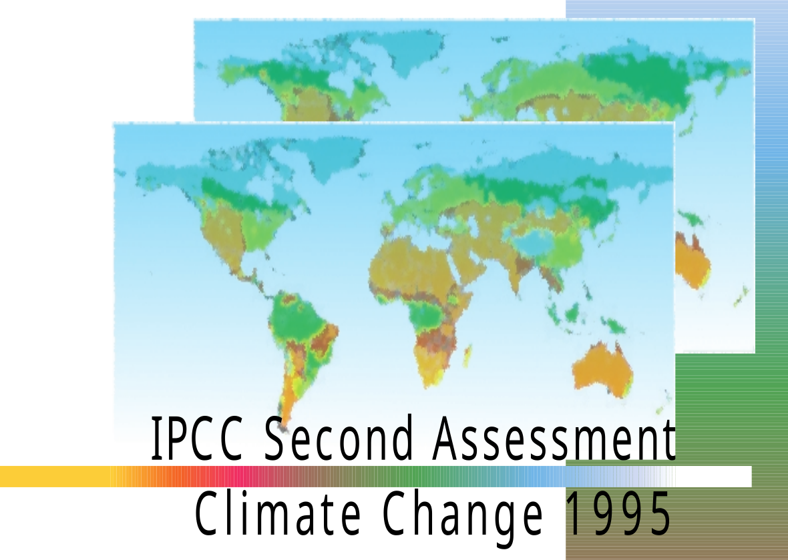

---
output:
  xaringan::moon_reader:
    css: ["default", "extra.css"]
    lib_dir: libs
    seal: false
    nature:
      highlightStyle: github
      highlightLines: true
      countIncrementalSlides: false
      ratio: '16:9'
---

```{r, echo = FALSE, warning = FALSE, message = FALSE}
library(tidyverse)
library(readxl)
library(lubridate)
library(sf)
library(rnaturalearth)
library(rnaturalearthdata)

knitr::opts_chunk$set(echo = FALSE,
                      eval = TRUE,
                      error = FALSE,
                      message = FALSE,
                      warning = FALSE,
                      comment = NA)

d <- read_excel("../../Data/Kyoto_Protocol_and_WDI/Data-Kyoto_Protocol_Negotiation.xlsx", na = "NA")
```

background-image: url('libs/Images/background-scales_justice_v3.png')
background-size: 105%
background-position: top
class: middle

.size45[**IV. International Institutions for Aggregate Effort**]

<br>

.size50[**Today's Agenda: Design Analysis**

- Kyoto Protocol to the United Nations Framework Convention on Climate Change
]

<br>

.center[.size40[
  Justin Leinaweaver (Fall 2023)
]]

???

### Prep for Class
1. Post on Canvas
    - UNFCCC
    - Kyoto Protocol
    - [UN General Assembly Resolution 43/53 of 6 December 1988](https://www.ipcc.ch/site/assets/uploads/2019/02/UNGA43-53.pdf)
    - [Reservations](https://treaties.un.org/Pages/ViewDetails.aspx?src=TREATY&mtdsg_no=XXVII-7-a&chapter=27&clang=_en)
    - Effectiveness and negotiation data
    
2. Post assignment prompt on Canvas at end of class

<br>

*FUTURE: Optional to just give them the negotiation data and time to review it rather than diving straight into your maps*


---

background-image: url('libs/Images/background-blue_cubes_lighter3.png')
background-size: 100%
background-position: center
class: middle

.size50[.content-box-white[**Semester Plan of Attack**]]

.size50[
1. Basics of Analyzing International Institutions

2. International Institutions for Mutual Restraint

3. .textblue[**International Institutions for Coordination**]

4. International Institutions for Aggregate Effort

]

???

Over the last three weeks we explored the complex international institution: The United Nations

- We explored its design as both a Charter of constitutional principles and a series of delegated agents with various powers and make-ups.

- We explored its effectiveness as a peacekeeper and as a distributor of global norms

- Last week we explored how we might reform the institution to improve its ability to coordinate preferred behaviors among member states.

<br>

Let's do a quick refresher tied to PA theory

### What are the benefits of delegation according to PA theory?
- (1. Divide the labor & create gains from specialization, 2. Managing policy externalities, 3. Facilitating collective decision-making, 4. Resolving disputes, 5. Enhancing credibility, 
6. Creating policy bias)

<br>

### Pick one of these benefits and give me a specific function/institution within the UN that provides it.

- (ICJ: Specialization, resolving disputes)


---

background-image: url('libs/Images/background-blue_cubes_lighter3.png')
background-size: 100%
background-position: center
class: middle

.size50[.content-box-white[**Semester Plan of Attack**]]

.size50[
1. Basics of Analyzing International Institutions

2. International Institutions for Mutual Restraint

3. International Institutions for Coordination

4. .textblue[**International Institutions for Aggregate Effort**]

]

???

Today we shift to the final section of our class

<br>

For the rest of the semester we analyze international institutions designed for aggregate effort

- By aggregate effort we mean outcomes that depend on the contributions of all states 

<br>

The specific aggregate effort problem we will focus on is the global effort to address climate change

- Due to the various and varied causes, climate change presents a problem that will take the effort of all states working together to address

- Think of this like a style of problem that requires overcoming free riding

<br>

We will focus on two specific international institutions

1. The Kyoto Protocol, agreed in 1997, was the first global effort to reduce CO2 emissions
    - It focused on the period from 2008 to 2012

2. The Paris Agreement, agreed in 2015, is the next treaty in that same lineage (e.g. the rules that came after Kyoto)
    - It has been designed to adapt and evolve over time


---

background-image: url('libs/Images/background-blue_cubes_lighter3.png')
background-size: 100%
background-position: center
class: middle

```{r, echo = FALSE, fig.align = 'center', out.width = '80%'}

```

???

To kick off our work today on climate change I want us to begin by discussing the Second Assessment Report produced by the IPCC in 1995.

- I know this is a VERY dated look at climate science, HOWEVER...

- This allows us to examine and consider the state of the art at the time the Kyoto Protocol was being negotiated.

<br>

Everybody open the [UN General Assembly Resolution 43/53 of 6 December 1988](https://www.ipcc.ch/site/assets/uploads/2019/02/UNGA43-53.pdf) on Canvas.

- Read through it and get ready to tell me about the IPCC

- How significant an act of delegation is the IPCC?

<br>

### Ok, who is the IPCC and how significant is this delegation?

### - What are the key elements from the GA resolution?

- (Clause 5. Who are they and what is their mission? A body of the WMO)
- (Clause 6. Urges global cooperation)
- (Clause 10. Initial requests for a reoport, topics to include)

<br>

Now go to the Foreword in the SAR and review the process by which the report was written

### Based on the design in the GA Resolution and the steps outlined in the Foreward, how confident should we be in the conclusions made by the IPCC?

### - Strengths and weaknesses?

- 


---

background-image: url('libs/Images/background-blue_cubes_lighter3.png')
background-size: 100%
background-position: center
class: middle

.size40[.content-box-white[**Summary for Policymakers: The Science of Climate Change**]]

.size35[
1. Greenhouse gas concentrations have continued to increase

2. Anthropogenic aerosols tend to produce negative radiative forcings

3. Climate has changed over the past century

4. The balance of evidence suggests a discernible human influence on global climate

5. Climate is expected to continue to change in the future

6. There are still many uncertainties
]

???

Alright, let's talk the state of the art of government edited science in 1995!

- Open the SAR to the Summary for Policymakers: The Science of Climate Change (p21 in the document, but p31 in the pdf)

<br>

### How definitive are these conclusions?

### - What was the state of the art as states headed in to negotiate the Kyoto Protocol?

<br>

### What level of climate action does this report support in terms of demanding emissions cuts around the world?

- *Make sure to zoom in on Point 4 and Point 6*


---

background-image: url('libs/Images/13_1-UNFCCC_Conference.png')
background-size: 100%
background-position: center
class: middle, center

???

My plan is to have us focus our work this week on the Kyoto Protocol

<br>

HOWEVER, without the 1992 United Nations Framework Convention on Climate Change there is no Kyoto Protocol

- While we could easily spend a full day exploring the design of this first global climate treaty, the emission cuts don't come until Kyoto.

- So, I want to quickly hit a few important points of the UNFCCC and then transition into Kyoto

<br>

**SLIDE**: Everybody open up the UNFCCC on Canvas and read Article 2


---

background-image: url('libs/Images/background-blue_cubes_lighter3.png')
background-size: 100%
background-position: center
class: middle, center

.size40[
.content-box-white[**UNFCCC Article 2**]

"The ultimate objective of this Convention and any related legal instruments that the Conference of the Parties may adopt is to achieve, in accordance with the relevant provisions of the Convention, stabilization of greenhouse gas concentrations in the atmosphere at a level that would prevent dangerous anthropogenic interference with the climate system.  Such a level should be achieved within a time frame sufficient to allow ecosystems to adapt naturally to climate change, to ensure that food production is not threatened and to enable economic development to proceed in a sustainable manner."]

???

Article 2 of the UNFCCC represents the "ultimate objective" for the international community's effort on climate change.

- It took a LOT of debate to get to this wording.

<br>

Everybody read this and give me your analysis of it.

### - What stands out to you as important? Why?

<br>

### - Anything in Article 2 that strikes you as problematic?

- (Might include two sentences that contradict each other...)
    1. Stabilize GHGs before dangerous human interference in the system, BUT
    
    2. Don't interrupt efforts to fight hunger and preserve economic growth.

<br>

This is the first important legacy of the UNFCCC: 
- The global community agreed to this wording of the ultimate objective and that has endured for 30 years
    
    
    

---

background-image: url('libs/Images/background-blue_cubes_lighter3.png')
background-size: 100%
background-position: center
class: middle

.size45[
.content-box-white[**Article 3: Principles**]

1. ...protect the climate system...

2. ...specific needs and special circumstances of developing country Parties...

3. ...precautionary measures...

4. ...a right to...sustainable development...

5. ...supportive and open international economic system...
]

???

Now review the principles in Article 3.

### What catches your eye in Article 3?

### - What stands out to you as important? Why?

<br>

Some HUGE and controversial ideas in here!
- Principle 1 has tons: protect the system, future generations, common but differentiated responsibilities, rich states should "take the lead"

- Principle 2: Developing states have special duties and responsibilities

- P3: Attempt to adopt the precautionary principle!

- P4: Economic growth should not be harmed

- P5: No using environmental rules to harm trade

<br>

These substantial principles represent the second legacy of the UNFCCC

- For good or ill, these ideas continue to represent complex points of debate in the climate negotiations


---

background-image: url('libs/Images/background-blue_cubes_lighter3.png')
background-size: 100%
background-position: center
class: middle

.size50[
**Annex I Parties** include the industrialized countries that were members of the OECD in 1992, plus countries with economies in transition (the EIT Parties)

**Annex II Parties** consist of the OECD members of Annex I, but not the EIT Parties.
]

???

Now turn to the Annexes at the end of the treaty (p32-33)

- In short, Annex I and II, represent the world's agreement on who the "rich" states were in 1992

- Annex I states were expected to cut their emissions

- Annex II states to help pay for some of the costs incurred by developing states

- I'm not gonna lie, this snapshot in time of who was meant to act and who was meant to pay for the effort might not have been the best approach to this problem...

<br>

In short, the UNFCCC:

- gives us our over-arching goals and principals, 

- establishes some basic conceptual definitions, 

- strongly encourages states to increase their tracking, reporting and information sharing related to emissions

- creates an expectation for future COPs (conferences that state members will attend to keep working together on the problem), and then

- Lays out the foundation for a series of delegations of power (to be fleshed out later) including
    - A secretariat,
    - A financial mechanism,
    - Subsidiary bodies for scientific advice and implementation
    
<br>

In sum, the UNFCCC gives us vital foundational material but mostly just mapping out the needs rather than setting any firm rules of behavior

- A very strong example of what we call the convention-protocol approach to international problem-solving

- The convention sets up the big picture aims and outlines the institutions, the protocols carry the teeth!


---

background-image: url('libs/Images/13_1-Kyoto_Conference.png')
background-size: 100%
background-position: center
class: middle, center

???

Let's now jump forward to the teeth that are the Kyoto Protocol of 1998.

<br>

Lanchberry (1997) does an excellent job tracking the period between agreeing the UNFCCC and the Kyoto meeting.

- Lanchberry is focused on what we refer to in the treaty-making process as "pre-negotiation"

- "Pre-negotiation" is the label we apply to how states work to frame an upcoming treaty negotiation before ever showing up.

<br>

### If the UNFCCC already "frames" the problem and the global effort to address it, then what does Lanchberry argue the states were battling over before Kyoto?

1. (Adequacy of UNFCCC rules and need for replacement)

2. (Precise mechanism of the obligation e.g. aims, suggestions, binding commitments, Joint Implementation (JI) e.g. CDM, emissions trading)

<br>

**SLIDE**: I think it's useful to look at some data to help us wrap our heads around the details from Lanchberry.

*FUTURE: Optional to just give them the negotiation data and time to review it*


---

background-image: url('libs/Images/background-blue_cubes_lighter3.png')
background-size: 100%
background-position: center
class: middle, full

```{r, fig.retina=3, fig.align='center', out.width='100%', fig.width=9, fig.height=4.5, cache=TRUE}
# Emissions map - Kyoto (1997)
# quantile(d1997$CO2_kt, probs = .25)[[1]]
#summary(d$co2_per_capita[d$year == 1997])

d1997 <- d |> 
  filter(year == 1997) |>
  mutate(
    co2_cat = case_when(
      co2_emissions < 1e3 ~ "< 1,000",
      co2_emissions < 1e4 ~ "< 10,000",
      co2_emissions < 1e5 ~ "< 100,000",
      co2_emissions < 1e6 ~ "< 1,000,000",
      co2_emissions < 1e7 ~ "< 10,000,000"
    ),
    co2_pc_cat = case_when(
      co2_per_capita < 1 ~ "< 1",
      co2_per_capita < 5 ~ "< 5",
      co2_per_capita < 10 ~ "< 10",
      co2_per_capita >= 10 ~ "10+"
    )
  )

# Use rnaturalearth to define world map data
worldmap <- ne_countries(scale = 'medium', type = 'map_units', returnclass = 'sf')

# Merge data onto worldmap
d10 <- left_join(worldmap, d1997, by = c("adm0_a3" = "ccode"))

d10 |>
  mutate(
    co2_cat = factor(co2_cat, levels = c("< 1,000", "< 10,000", "< 100,000", "< 1,000,000", "< 10,000,000"))
  ) |>
  ggplot() +
  geom_sf(aes(fill = co2_cat)) +
  labs(fill = "", title = "CO2 Emissions (kt): Kyoto Protocol (1997)") +
  #scale_fill_brewer(type = "seq", palette = 7)
  scale_fill_manual(values = c("floralwhite", "khaki2", "yellow1", "orange1", "red")) #+
  #theme(legend.position = "bottom")
```

???

Here is what the state of CO2 emissions looked like per country at the date of the Kyoto Agreement

### What stands out here? Key observations?

<br>

### According to this map, where are the big emissions coming from? Who needs to act?

<br>

This tends to be the metric that the developed world emphasizes at the negotiations.

### - Why is this the map the rich world prefers we focus on?

<br>

### - Is this a misleading framing of the problem? Why or why not?

<br>

**SLIDE**: Many developing states in the world prefer we focus on per capita emissions


---

background-image: url('libs/Images/background-blue_cubes_lighter3.png')
background-size: 100%
background-position: center
class: middle, full

```{r, fig.retina=3, fig.align='center', out.width='100%', fig.width=9, fig.height=4.5, cache=TRUE}
# Emissions per capita map - Kyoto (1997)
d10 |>
  mutate(
    co2_pc_cat = factor(co2_pc_cat, levels = c("< 1", "< 5", "< 10", "10+"))
  ) |>
  ggplot() +
  geom_sf(aes(fill = co2_pc_cat)) +
  labs(fill = "", title = "CO2 Emissions per capita (kt): Kyoto Protocol (1997)") +
  scale_fill_manual(values = c("floralwhite", "yellow1", "orange1", "red"))
```

???

### How does this framing of climate change alter the baseline of the problem?

### - According to this map, where are the big emissions coming from? Who needs to act?

<br>

### - Is this a misleading framing of the problem? Why or why not?

<br>

While developing states think this map is more important, this isn't their preferred way to think of the problem.

### - Can anybody tell me how the poorer countries in the world think we should frame the baseline of the climate problem?

- (**SLIDE**: Historical emissions)


---

background-image: url('libs/Images/13_1-cumulative-co-emissions.svg')
background-size: 70%
background-position: center
class: slideblue

???

Here we see an effort to account for all historical emissions since 1750.

- Of course, this is a deeply problematic series of estimates to produce in any precise manner

- HOWEVER, no one contests that the general proportions of this are broadly accurate.

<br>

### How does this framing of climate change alter the baseline of the problem?

### - According to this map, where are the big emissions coming from? Who needs to act?

<br>

### - Is this a misleading framing of the problem? Why or why not?

<br>

**SLIDE**: Compare and contrast


---

background-image: url('libs/Images/background-blue_cubes_lighter3.png')
background-size: 100%
background-position: center
class: middle

```{r, echo = FALSE, fig.align = 'center', out.width = '40%'}

```

.pull-left[
```{r, fig.retina=3, fig.align = 'center', out.width = '100%', fig.width=9, fig.height=4.5, cache=TRUE}
d10 |>
  mutate(
    co2_cat = factor(co2_cat, levels = c("< 1,000", "< 10,000", "< 100,000", "< 1,000,000", "< 10,000,000"))
  ) |>
  ggplot() +
  geom_sf(aes(fill = co2_cat)) +
  labs(fill = "", title = "CO2 Emissions (kt): Kyoto Protocol (1997)") +
  scale_fill_manual(values = c("floralwhite", "khaki2", "yellow1", "orange1", "red"))
```
]

.pull-right[
```{r, fig.retina=3, fig.align = 'center', out.width = '100%', fig.width=9, fig.height=4.5, cache=TRUE}
# Emissions per capita map - Kyoto (1997)
d10 |>
  mutate(
    co2_pc_cat = factor(co2_pc_cat, levels = c("< 1", "< 5", "< 10", "10+"))
  ) |>
  ggplot() +
  geom_sf(aes(fill = co2_pc_cat)) +
  labs(fill = "", title = "CO2 Emissions per capita (kt): Kyoto Protocol (1997)") +
  scale_fill_manual(values = c("floralwhite", "yellow1", "orange1", "red"))
```
]

???

And here is a data representation of the framing battle that we still haven't actually settled as a global community.

### Which of these three views is the "right" one? Why?

<br>

### What are the pros and cons of adopting each one as our preferred framing for the climate change negotiations?

<br>

This debate is a serious one and a problem we haven't solved.

- All three frames are "true," but all three suggest different policies to address them.


---


background-image: url('libs/Images/background-blue_cubes_lighter3.png')
background-size: 100%
background-position: center
class: middle

.size35[
- Group of 77 (G77) and China
- Alliance of Small Island States (AOSIS)
- Least Developed Countries (LDC)
- European Union (EU)
- The Umbrella Group (formerly JUSSCANNZ)
- Environmental Integrity Group (EIG)
- Organization of Petroleum Exporting Countries (OPEC)
- Central Asia, Caucasus, Albania and Moldova (CACAM)
- The League of Arab States
- The Independent Alliance of Latin America and the Caribbean (AILAC)
- The BASIC Group (Brazil, South Africa, China India)
- The Bolivarian Alliance for the Peoples of our America (ALBA)
]

???

All state parties to the UNFCCC are represented by their own national delegation at the climate negotiations

- However, many also find it useful to ally with other states and form negotiating groups

- This is a list of some of the most common groupings that arise during climate negotiations ([UN Party groupings](http://unfccc.int/parties_and_observers/parties/negotiating_groups/items/2714.php))

- Note that states can belong simultaneously to more than one group.

<br>

### Why would joining a climate group be an appealing strategy?
- (Amplify your voice)

- (Try to control the agenda)

- (Greater weight of draft resolutions)

<br>

### Per Lanchberry, how united was the developed world pre-negotiation?

### - Did all the richer states want the same things?

1. Hard to figure out who the "rich" or "developed" world even is!
    - Using UNFCCC Annex I to define developed has problems (e.g. developed in 1991 excludes recent joiners of OECD like Mexico and South Korea)
    - Countries of former USSR and central and eastern europe given special status as "countries in transition" even though developed. 
    - Positions vary dramatically within that group of states: Countries aiming for EU membership (Poland, Czech Rep, Hungary) typically align with EU vs Russia which depends on oil exports and suspects it may benefit from climate change
    - Important to note: Internal Russian ministries tend to hold different positions on this related to their area e.g. energy vs environment ministries

2. EU supposed to speak with one voice BUT
    - northern countries want big cuts (Germany, Denmark, Austria, Netherlands, UK)
    - Southern countries willing to go along in return for aid from EU

3. JUSCANZ: "Shaky, largely informal and decreasingly important"
    - Japan, US, Canada, Australia and New Zealand
    - Mostly major emitters who want less stringent rules than the EU
    - Australia most extreme opponent
    - Internal rifts evident in Japanese (MITI vs Environmental Agency) and US (EPA vs Dept of Energy; Clinton vs Congress) delegations

<br>

### Per Lanchberry, how united was the developing world pre-negotiation?

### - Did all the "poorer" states want the same things?

(Developing world can also be split into camps:)
- Pace-setters? (AOSIS)
    - Alliance of Small Island States (AOSIS), Bangladesh and Egypt fear being inundated by sea-level rise and so demand binding cuts

- Fence-sitters? (China, India and Brazil)

- Foot-draggers? (OPEC especially Saudi Arabia and Kuwait)
    - OPEC demands compensation for any cuts

<br>

#### Notes
Global Climate Coalition (US NGO tied to oil and coal industry) - Big time foot-draggers

Developed World:
- NOTE: Many states face considerable internal splits.

EU
- Northern countries want big cuts and soon (Germany, Denmark, Austria, Netherlands, UK)
- Southern countries willing to go along in return for aid from EU

JUSCANZ (Japan, US, Canada, Australia and New Zealand)
- "Shaky, largely informal and decreasingly important"
- Mostly major emitters who want less stringent rules than the EU

Australia 
- King of the foot-draggers, opposes all cuts

Canada - Similarly a big foot-dragger

Japan 
- Big internal split: MITI vs Environmental Agency
- WHY DOES LANCHBERY THINK THE JAPANESE WILL CAVE?
(Oddly racial explanation rooted in their culture's respect for consensus)

G77 and China
- significant cuts but only if no JI commitments for them in short term.

US 
- Big internal split: Clinton (science scary) vs Senate (only if developing world acts too)
- Big supporter of emissions trading and JI


---


background-image: url('libs/Images/background-blue_cubes_lighter3.png')
background-size: 100%
background-position: center
class: middle

.size35[
- Group of 77 (G77) and China
- Alliance of Small Island States (AOSIS)
- Least Developed Countries (LDC)
- European Union (EU)
- The Umbrella Group (formerly JUSSCANNZ)
- Environmental Integrity Group (EIG)
- Organization of Petroleum Exporting Countries (OPEC)
- Central Asia, Caucasus, Albania and Moldova (CACAM)
- The League of Arab States
- The Independent Alliance of Latin America and the Caribbean (AILAC)
- The BASIC Group (Brazil, South Africa, China India)
- The Bolivarian Alliance for the Peoples of our America (ALBA)
]

???

### Based on the way Lanchberry maps out the competing interests, what should our expectations be for the Kyoto Protocol?

### - What kind of rules are likely to get through this array of interests?

<br>

### What does Lanchberry predict for the Kyoto Protocol?
- (Lanchbery Prediction for Kyoto: Protocol (or maybe an amendment) 10% reduction by 2010 (from 1990 levels) with emissions trading by 2000; Japan, Canada, Australia stay on outside. No "green group" then only 5% likely.)

<br>

*Notes at bottom for the rest of the article; May be some good stuff in there*

<br>

#### Notes
The Origins of the Present Climate Negotiations
- Aim to strengthen UNFCCC begins March/April 1995 at Berlin CoP (however, discussions had begun earlier in NYC Feb 1995 where AOSIS made formal proposal for new protocol)
- Debate continues about the adequacy of the rules in FCC
- OPEC led by Saudi Arabia and Kuwait try to undermine planning for Berlin by blocking rules of procedure (FOOT-DRAGGERS!) supported by Global Climate Coalition (US NGO tied to oil and coal industry) 
- Outcome: meeting breaks up with no decision on anything except a new ban on NGOs on floor during debates

Berlin issues
1. Adequacy of UNFCCC rules and need for replacement?
2. Sanction joint implementation (JI) between developed and developing countries e.g. can developed countries pay for cuts in developing instead of changes at home?
-- many in developing world think these changes should start in developed world.
-- US and Netherlands big fans and also want emissions trading

Berlin conclusions
1. Led by Germany, the EU and a "green group" led by India pushed forward consensus on inadequacy of FCC rules and establish process moving forward
- OPEC opposition fades under pressure of oil consuming states
- Australia and Canada alone as obstacles, but eventually give in so as to remain part of future negotiations
2. Berlin sets up 4 year pilot program for JI with testing and monitoring but no credits given

Post-Berlin AGBM negotiations
- Ad-hoc Group on the Berlin Mandate
- Very slow progress that few states or groups had solid idea of what they wanted next.
- Only AOSIS had firm proposal, "which was politely ignored..."
- US and other sought to actively side-track the negotiations which by third meeting led to chairman rebuking US for wasting time.
- IPCC releases second assessment report that really pissed off the "no action" states e.g. 1. detection of human impact on climate, 2. climate change impacts will be adverse, 3. most countries could reduce GHG at little to no cost. 
-- Much debate ensues: OPEC and some of JUSCANZ vs EU and northern nations

CoP 2 in Geneva (July 1996)
- no clear progress on much of anything had been made e.g. rules of procedure, accept or not the IPCC report, need for a protocol or an amendment
- After frantic meetings, G77, China, EU and US accept the report (Geneva Declaration) but never formally made because no rules of procedure agreed and OPEC, Australia and others opposed it.

Afterward, comments and proposal fragments flood into AGBM
- Only AOSIS and EU willing to offer a complete draft protocol with targets and time-frames included
- G77 and China say developed world should take the lead in cuts
- US proposal emphasizes emissions trading and JI
- Some of JUSCANZ push differentiated commitments
- EU pushes some "obligatory coordinated policies and measures"
- France and Japan push per capita standards (likely because they rely so much on nuclear)

Where Next?
- EU takes climate issue very seriously and wants significant emissions cuts in short term. Supported by AOSIS, prospective members of EU. Lanchbery thinks Russia, Switzerland Norway eventually will back EU position.
- US position too hard to read as Clinton battles Congress; likely focused on emissions trading and requirement by Senate that developing states participate.
- Australia opposes all cuts
- Japan similar but as host of meeting may be pressured to give in.
- G77 and China endorse significant cuts but only if no JI commitments for them in short term.
- OPEC will agree so long as compensation included
- Possibility of new "green group" arising from within G77 would transform the negotiations.


---

background-image: url('libs/Images/background-blue_cubes_lighter3.png')
background-size: 100%
background-position: center
class: middle, center

```{r, echo = FALSE, fig.align = 'center', out.width = '100%'}

```

???

Let's dig into the treaty itself
- Everybody open up the Kyoto Protocol and let's start with the preamble.

<br>

I just want to emphasize the importance and power of soft law here

- The UNFCCC is definitely soft law, but:

- The Kyoto Protocol is only open to parties of the UNFCCC,

- Pride of place for Art 2, the ultimate objective,

- Accepting all the rules in the UNFCCC,

- Accepting the PRINCIPLES in Art 3!

<br>

So, even if a convention is weak in terms of creating strict obligations I hope you can see how big a deal it is to enshrine a specific problem-framing in it.

- Winning the battle to design the convention is a HUGE victory.

<br>

Now, before we talk specific obligations we need to jump to the Annex.

- **SLIDE**: Annex B represents the heart of the obligations in the Kyoto Protocol


---

background-image: url('libs/Images/background-blue_cubes_lighter3.png')
background-size: 100%
background-position: center
class: middle

.center[.size40[.content-box-white[**Kyoto Protocol: Annex B Emission Commitments**]]]

.size40[
Australia 108, Austria 92, Belgium 92, Bulgaria 92, Canada 94, Croatia 95, Czech Republic 92, Denmark 92, Estonia 92, European Community 92, Finland 92, France 92, Germany 92, Greece 92, Hungary 94, Iceland 110, Ireland 92, Italy 92, Japan 94, Latvia 92, Liechtenstein 92, Lithuania 92, Luxembourg 92, Monaco 92, Netherlands 92, New Zealand 100, Norway 101, Poland 94, Portugal 92, Romania 92, Russian Federation 100, Slovakia 92, Slovenia 92, Spain 92, Sweden 92, Switzerland 92, Ukraine 100, UK 92, USA 93
]

???

Annex B represents the emission cuts these states are required to make during the first period of the Kyoto Protocol (2008-2012).

- You may notice this list is essentially Annex I from the UNFCCC!

- Path dependency for the win!

<br>

### How can a number higher than 100 be considered an emissions cut?

- (**SLIDE**)


---

background-image: url('libs/Images/background-blue_cubes_lighter3.png')
background-size: 100%
background-position: center
class: middle

.center[.size35[.content-box-white[**Kyoto Protocol: Annex B Emission Commitments**]]]

.size30[
**Make cuts**
- Austria 92, Belgium 92, Bulgaria 92, Canada 94, Croatia 95, Czech Republic 92, Denmark 92, Estonia 92, European Community 92, Finland 92, France 92, Germany 92, Greece 92, Hungary 94, Ireland 92, Italy 92, Japan 94, Latvia 92, Liechtenstein 92, Lithuania 92, Luxembourg 92, Monaco 92, Netherlands 92, Poland 94, Portugal 92, Romania 92, Slovakia 92, Slovenia 92, Spain 92, Sweden 92, Switzerland 92, UK 92, USA 93

**Hold steady**
- New Zealand 100, Russian Federation 100, Ukraine 100

**Grow more slowly**
- Australia 108, Iceland 110, Norway 101
]

???

In essence, even numbers above 100% represent a cut from a state’s projected increase in GHG emissions.

- These states are allowed to increase emissions but, hopefully, more slowly than they would have otherwise as their economies grow.

- For example, Australia gets to actually increase its emissions and call it a cut!

<br>

Let's use the question of why Australia got such a sweetheart deal as a way to explore the design of the Kyoto Protocol and the politics of climate negotiations.

- Everybody read Article 2 and get ready to tell me what we expect Annex B states to do in order to meet their emissions targets

<br>

### What is the gist of these instructions? What kinds of things are states supposed to target for emissions reductions?
- (energy efficiency, plant forests, reduce wasteful oil subsidies, etc.)

- In other words, take an active role in making your society more carbon neutral in an ongoing way.

<br>

### Jump to Article 3, what do we learn from the first sentence in 3.7? 
### - What politics likely informs these design choices?
1. (Kyoto targets only apply for a four year period (2008-2012))

2. (Base year is 1990)
    - Had to pick a year in the past to keep countries from screwing around with their emissions to mess up the cuts

3. (Special consideration for countries "undergoing the process of transition to a market economy.")
    - Some countries are UNFCCC Annex I because they are new democracies, but not yet rich enough to contribute
    
<br>

**SLIDE**: Now the second sentence in 3.7 is borderline gibberish and is widely known as the "Australia Clause"


---

background-image: url('libs/Images/13_1-Australia_Land_Clearing.webp')
background-size: 100%
background-position: center
class: middle, bottom

.center[.size45[.content-box-white[**Australia: The Politics of an Emissions Cut**]]]

???

This clause essentially only applies to Australia.

- At the very last minute, Australian negotiator Robert Hill stands up to say Australia won't agree the Kyoto Protocol UNLESS this clause is added.

- Powerful because the meeting had FINALLY achieved consensus and many were afraid of anything disrupting it.

- Hill was playing chicken with the conference which either makes him an exceptional negotiator, an asshole or both.

- Either way, the conference gives in and the clause is added.

<br>

What did this clause do to the treaty?

- Basically, the treaty emission targets were meant to get states to cut emissions from ongoing sources of CO2 (Factories, oil production, traffic, etc.)

- However, Australia was wrapping up a period of massive land clearing exercises.
    - They were wiping out huge areas of forest for development and the destruction was releasing tons of CO2.

- Australia got this clause inserted which treated these one-off releases of CO2 from land clearing as part of their baseline 1990 emissions.
    - Adding in the land clearing increased their 1990 emissions from 21 to 26 tons (Hamilton and Reynolds 1999) which made it look like Australia was the biggest ongoing CO2 emitters in the world.

- The messed up thing is, Australia was finishing its land clearing exercises at this point.
    - Those were never going to be ongoing emissions.

- SO, this meant they'd be able to meet their 2012 target without cutting any ongoing sources.
    - IN FACT, estimates were that they could increase emissions by 25-30% and still hit their target.

- AND THAT'S WHAT THEY DID! (+28% in normal sources)

<br>

Even worse, this set a precedent that developing states have been trying to claim

- They want their land clearing exercises to count in their totals

- Booo Australia. Boooooo.


---

background-image: url('libs/Images/background-blue_cubes_lighter3.png')
background-size: 100%
background-position: center
class: middle, center

.size45[.content-box-white[**Treaty Design Analysis**]]

<br>

.size35[.content-box-white[**Kyoto Protocol to the United Nations Framework**]]

.size35[.content-box-white[**Convention on Climate Change**]]

.pull-left[
```{r, echo = FALSE, fig.align = 'center', out.width = '100%'}
knitr::include_graphics("libs/Images/02_2-Legalization_Fig1.png")
```
]

.pull-right[
```{r, echo = FALSE, fig.align = 'center', out.width = '100%'}
knitr::include_graphics("libs/Images/03_2-KLS_Table1.png")
```
]

???

Let's highlight some other important design elements / choices.

<br>

Article 3 is really the heart of the treaty and was almost the last element finalized in Kyoto.

### From the perspective of the Annex B states, how seriously are you constrained by each section of Article 3?

- 3.1: Aims for a global 5% reduction (allows joint estimation)

- 3.2: What is demonstrable progress?

- 3.4: We won't decide how you should be calculating all of these complicated emissions amounts until later and then these rules won't apply in the current period.

- 3.9: We'll discuss commitments after 2012 much later

- 3.13: Save extra emissions? You can bank them and use in the next period

<br>

### What does Article 5 require them to do? 
- (States must track and report emissions.)

<br>

### Is it a serious constraint? Why or why not?
- (HOWEVER, this means reporting is controlled by the states themselves...)


---

background-image: url('libs/Images/background-blue_cubes_lighter3.png')
background-size: 100%
background-position: center
class: middle, center

.size45[.content-box-white[**Treaty Design Analysis**]]

<br>

.size35[.content-box-white[**Kyoto Protocol to the United Nations Framework**]]

.size35[.content-box-white[**Convention on Climate Change**]]

.pull-left[
```{r, echo = FALSE, fig.align = 'center', out.width = '100%'}
knitr::include_graphics("libs/Images/02_2-Legalization_Fig1.png")
```
]

.pull-right[
```{r, echo = FALSE, fig.align = 'center', out.width = '100%'}
knitr::include_graphics("libs/Images/03_2-KLS_Table1.png")
```
]

???

### How serious is the oversight provided for in Article 8?
- (Guidelines for review TBD...)

<br>

Everybody read Article 18 and tell me about the compliance mechanism

### What happens if an Annex B state fails to comply with the protocol?

- "The Conference of the Parties serving as the meeting of the Parties to this Protocol shall, at its first session, approve appropriate and effective procedures and mechanisms to determine and to address cases of non-compliance with the provisions of this Protocol, including through the development of an indicative list of consequences, taking into account the cause, type, degree and frequency of non-compliance. Any procedures and mechanisms under this Article entailing binding consequences shall be adopted by means of an amendment to this Protocol."

<br>

In other words, we'll get to that later...


---

background-image: url('libs/Images/background-blue_cubes_lighter3.png')
background-size: 100%
background-position: center
class: middle, center

.size50[.content-box-white[**Article 12: Clean Development Mechanism**]]

<br>

```{r, echo = FALSE, fig.align = 'center', out.width = '60%'}

```

???

Before we finish with our speedy race through the Kyoto Protocol, take a look at Article 12.

### What is the Clean Development Mechanism and how substantial is it?

<br>

The Clean Development Mechanism, and climate financing in general, remains a heated topic of debate in the global climate negotiations

- Some of the most severe impacts of climate change are being suffered by countries that didn't create the problem and don't have the means to do much about it

- Calls for financing from the developed world are included in the principles of the UNFCCC and we continue to struggle to figure out how best to provide this needed assistance.


---

background-image: url('libs/Images/background-blue_triangles2.png')
background-size: 100%
background-position: center
class: middle

.center[.size40[.content-box-purple[**Next Class: Effectiveness of the Kyoto Protocol**]]]

.size35[
1. Which countries saw the biggest changes in GHG emissions by 2012? (biggest increases and biggest decreases)

2. Did signatory states see bigger declines than non-signatory states?

3. Did ratifying states see bigger declines in emissions than non-participant states?

4. Did states that ratified more quickly cut emissions more than those who ratified more slowly?

5. Did Annex B states that ratified see bigger declines in emissions than other states?
]

???

*Post prompt on Canvas Module as image of this slide*

<br>

For next class I would like you to use the data I have posted on Canvas to answer these questions.

- For each question be ready to explain how you reached your answer AND how confident you are in that answer

<br>

### Questions on the assignment?


