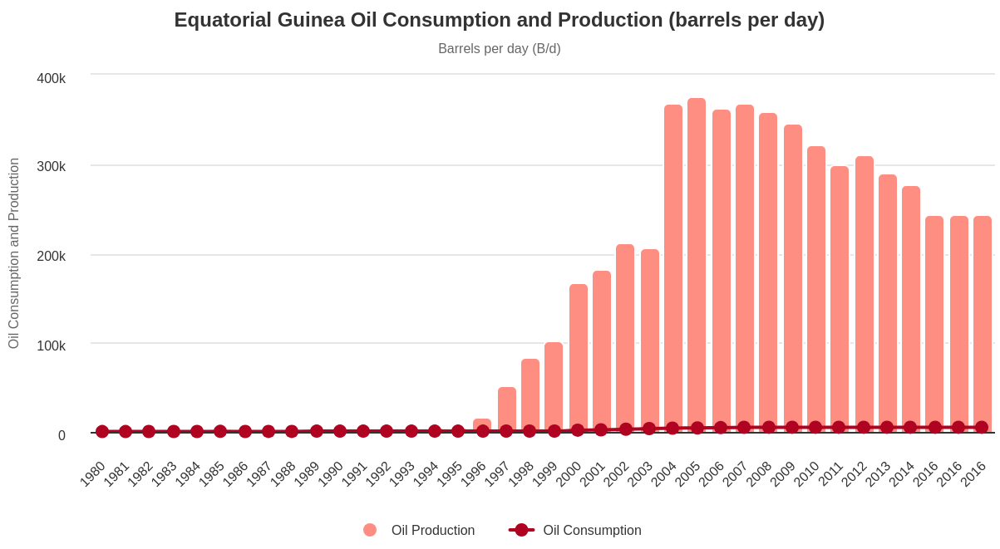
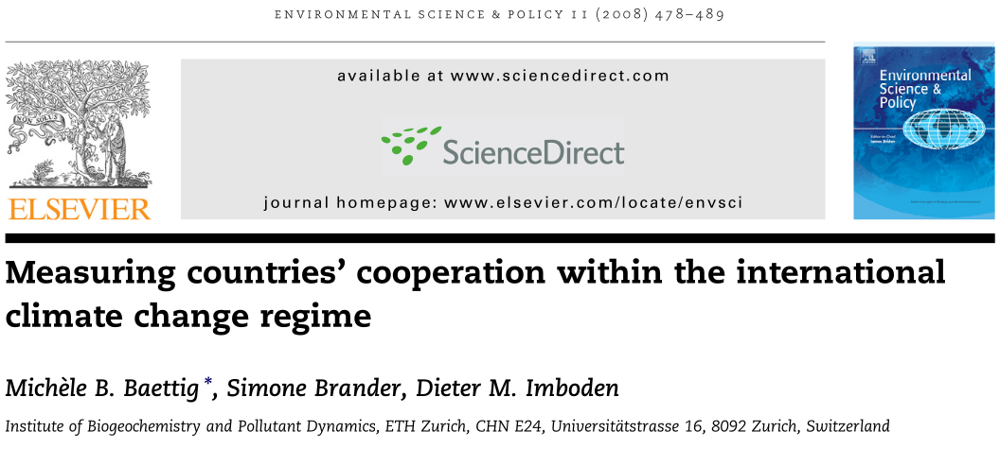

---
output:
  xaringan::moon_reader:
    css: ["default", "extra.css"]
    lib_dir: libs
    seal: false
    nature:
      highlightStyle: github
      highlightLines: true
      countIncrementalSlides: false
      ratio: '16:9'
---

```{r, echo = FALSE, warning = FALSE, message = FALSE}
library(tidyverse)
library(readxl)
library(lubridate)
library(sf)
library(rnaturalearth)
library(rnaturalearthdata)
library(kableExtra)

knitr::opts_chunk$set(echo = FALSE,
                      eval = TRUE,
                      error = FALSE,
                      message = FALSE,
                      warning = FALSE,
                      comment = NA)

d <- read_excel("../../Data/Kyoto_Protocol_and_WDI/Data-Kyoto_Protocol_Effectiveness.xlsx", na = c("NA", "")) %>%
  mutate(
    Kyoto_Sig = ymd(Signature),
    Kyoto_Rat = ymd(Ratification),
    Signed = if_else(!is.na(Kyoto_Sig), "Signed", "Didn't Sign"),
    Ratified = if_else(!is.na(Kyoto_Rat), "Ratified", "Didn't Ratify"),
    Signature = NULL,
    Ratification = NULL
  ) |>
  select(Country, ccode, Kyoto_Sig:Ratified, everything())
```

background-image: url('libs/Images/background-scales_justice_v3.png')
background-size: 105%
background-position: top
class: middle

.size45[**IV. International Institutions for Aggregate Effort**]

<br>

.size50[**Today's Agenda: Effectiveness Analysis**

- Kyoto Protocol to the United Nations Framework Convention on Climate Change
]

<br>

.center[.size40[
  Justin Leinaweaver (Fall 2023)
]]

???

### Prep for Class
1. ...

<br>

This week we've begun exploring international institutions for aggregate effort.

<br>

### Refresh my memory, what is an aggregate effort institution?
- (By aggregate effort we mean outcomes that depend on the contributions of all states)

- For our work, we'll be analyzing international institutions focused on fighting climate change


---

background-image: url('libs/Images/13_1-UNFCCC_Conference.png')
background-size: 100%
background-position: center
class: middle, center

???

We started by discussing three of the important legacies of the 1992 United Nations Framework Convention on Climate Change

<br>

### What three important elements did we note were established in that treaty?

1. Article 2 clearly states the "ultimate objective": "...prevent dangerous anthropogenic interference with the climate system"

2. Article 3 lays out the key principles that were selected to guide our efforts
    - States should act to protect the system, BUT must also protect the developing world and protect economic development

3. States listed in Annex I and II represent the "rich" world who are responsible to do the most and help pay for the efforts of the developing world.

<br>

A substantial framing exercise PLUS the UNFCCC creates the outline of what could become important delegated agents in the future.


---

background-image: url('libs/Images/background-blue_cubes_lighter3.png')
background-size: 100%
background-position: center
class: middle, center

.size45[.content-box-white[**Treaty Design Analysis**]]

<br>

.size35[.content-box-white[**Kyoto Protocol to the United Nations Framework**]]

.size35[.content-box-white[**Convention on Climate Change**]]

.pull-left[
```{r, echo = FALSE, fig.align = 'center', out.width = '100%'}
knitr::include_graphics("libs/Images/02_2-Legalization_Fig1.png")
```
]

.pull-right[
```{r, echo = FALSE, fig.align = 'center', out.width = '100%'}
knitr::include_graphics("libs/Images/03_2-KLS_Table1.png")
```
]

???

Let's apply legalization to our work last class.

### How significant are the obligations, precision and delegation in the Kyoto Protocol?

<br>

### Is the Kyoto Protocol "hard" or "soft" law?

<br>

### Which rational design conjectures are implicated by the Kyoto Protocol?

<br>

- Great example of "Flexibility due to uncertainty about the world" and "Flexibility due to distribution problems"


---

background-image: url('libs/Images/background-blue_triangles2.png')
background-size: 100%
background-position: center
class: middle

.center[.size40[.content-box-purple[**Evaluating the Effectiveness of the Kyoto Protocol**]]]

.size35[
1. Which countries saw the biggest changes in GHG emissions by 2012? (biggest increases and biggest decreases)

2. Did signatory states see bigger declines than non-signatory states?

3. Did ratifying states see bigger declines in emissions than non-participant states?

4. Did states that ratified more quickly cut emissions more than those who ratified more slowly?

5. Did Annex B states that ratified see bigger declines in emissions than other states?
]

???

For today I asked you to answer these questions and to be ready to explain how you did it and your confidence in the answers.

<br>

### Everybody ready to go?

### - Are you getting more comfortable thinking about data?

### - Manipulating a spreadsheet?

<br>

In essence, I see this list as the kinds of data analyses we would need to perform if we wanted to write a research paper analyzing the effectiveness of the Kyoto Protocol

- Specifically, I think we would need to establish three broad arguments

<br>

To do this I'm going to put you in NEW groups!

- Time to stretch our legs!

- *ASSIGN STUDENTS TO NEW GROUPS*


---

background-image: url('libs/Images/background-blue_cubes_lighter3.png')
background-size: 100%
background-position: center
class: middle

.center[.size50[.content-box-white[**Making an Argument**]]]

.center[.size50[.content-box-white[**Was the Kyoto Protocol Effective?**]]]

.size45[
1. Changes in emissions since 1990 are a good proxy for the climate actions in the Kyoto Protocol

    - Theory
]

???

The first important task for our research paper would be to make clear that the outcome data we have is appropriate for the research question we are trying to answer.

- "Appropriate" is both a theoretical AND an empirical problem.

<br>

**In terms of theory** we need to make an argument that the specific actions required by the Kyoto Protocol (e.g. financing, technology transfers, greater reporting of emissions, etc.) would lead to actual cuts in emissions

<br>

### GROUPS, do you believe the sum of the climate actions required by the Kyoto Protocol will produce changes in emissions levels? Why or why not?

- Get ready to report back!

- Go!


---

background-image: url('libs/Images/background-blue_cubes_lighter3.png')
background-size: 100%
background-position: center
class: middle

.center[.size50[.content-box-white[**Making an Argument**]]]

.center[.size50[.content-box-white[**Was the Kyoto Protocol Effective?**]]]

.size45[
1. Changes in emissions since 1990 are a good proxy for the climate actions in the Kyoto Protocol
    - Theory
    
    - Empirics
]

???

In terms of empirics: We need to demonstrate that our chosen outcome variable, changes in emissions, actually varies across the states in the sample.

<br>

If all the states essentially produce the same changes, then there's nothing for us to explain

- In other words, we couldn't show any effect of the Kyoto Protocol because the states behaved the same regardless of the treaty


---

background-image: url('libs/Images/background-blue_cubes_lighter3.png')
background-size: 100%
background-position: center
class: middle

.center[.size40[.content-box-white[**1) Are changes in emissions since 1990 a good proxy for climate action?**]]]

.size40[
Which countries saw the biggest changes in GHG emissions by 2012? (biggest increases and biggest decreases)

1. **How** did you answer these questions?

2. **What** are your answers?

3. How **confident** are you in the answers?
]

???

Groups, dive into this question and get ready to report back.

- Your job is to make sure:

1. Everyone in your group can do this analysis,

2. They understand the results, and 

3. Can discuss how confident they are in the answer

<br>

*After they get started interrupt with:*

### Groups, how are we attacking this question?

### - What specific data analyses should we perform?

<br>

1. Sort the column ghg_2012 from highest to smallest

2. Make a histogram of ghg_2012

<br>

Back to work!

- (**SLIDE**: top 10 tables)


---

background-image: url('libs/Images/background-blue_cubes_lighter3.png')
background-size: 100%
background-position: center
class: middle

.pull-left[
.center[.size40[.content-box-white[**Biggest Decreases**]]]

```{r}
# Identify top 10 and bottom 10
d %>%
  select(Country, ghg_2012) %>%
  arrange(ghg_2012) %>%
  slice(1:10) |>
  kbl(align = c('l', 'c')) |>
  kable_styling(font_size = 30)
```
]

.pull-right[
.center[.size40[.content-box-white[**Biggest Increases**]]]

```{r}
d %>%
  select(Country, ghg_2012) %>%
  arrange(desc(ghg_2012)) %>%
  slice(1:10) |>
  kbl(align = c('l', 'c')) |>
  kable_styling(font_size = 30)
```
]

???

### Anybody know what's going on with Equitorial Guinea? 

- (**SLIDE**)


---

background-image: url('libs/Images/background-blue_cubes_lighter3.png')
background-size: 100%
background-position: center
class: middle

```{r, echo = FALSE, fig.align = 'center', out.width = '100%'}

```

???

*Figure from Worldometers*

<br>

### Vital note: You must always investigate your outliers

- If there is an error, fix it or remove it

- If the observation is outside the scope of the study, address it

<br>

- [Per OPEC](https://www.opec.org/opec_web/en/about_us/4319.htm), Equitorial Guinea discovered its massive oil reserves only in 1996.

- Only in 1993 did they begin extracting oil at significant levels (a few million barrels per year)

- 2006-2007 went from 12m to 1.1 billion barrels per year!

- [Per IMF](https://www.imf.org/external/pubs/ft/scr/2006/cr06233.pdf) the economy has exploded since then!

<br>

### So, do we need to remove Equitorial Guinea?

### - Is it outside the scope of the question or not?

<br>

I lean towards saying to remove it.

- This oil discovery was completely unexpected, massively distortionary and all happened AFTER the Kyoto negotiation.

- Not sure we should critique a treaty for failing to deal with a problem that didn't exist when it was designed


---

background-image: url('libs/Images/background-blue_cubes_lighter3.png')
background-size: 100%
background-position: center
class: middle

.pull-left[
.center[.size40[.content-box-white[**Biggest Decreases**]]]

```{r}
# Identify top 10 and bottom 10
d %>%
  select(Country, ghg_2012) %>%
  arrange(ghg_2012) %>%
  slice(1:10) |>
  kbl(align = c('l', 'c')) |>
  kable_styling(font_size = 30)
```
]

.pull-right[
.center[.size40[.content-box-white[**Biggest Increases**]]]

```{r}
d %>%
  select(Country, ghg_2012) %>%
  arrange(desc(ghg_2012)) %>%
  slice(1:10) |>
  kbl(align = c('l', 'c')) |>
  kable_styling(font_size = 30)
```
]

???

Our top ten lists show us that there is a significant difference between the two extremes, but 

- This doesn't answer the question about whether or not this variable is empirically appropriate across the whole range of states

- The extremes can differ while the bulk of observations cluster together in the middle and that would still be a problem

<br>

**SLIDE**: Let's visualize our histograms!


---

background-image: url('libs/Images/background-blue_cubes_lighter3.png')
background-size: 100%
background-position: center
class: middle

```{r, cache=TRUE, fig.retina=3, fig.asp=0.618, fig.align='center', out.width='92%'}
# Visualize 2012
d %>%
  ggplot(aes(x = ghg_2012)) +
  geom_histogram(bins = 30, color = "white") +
  theme_bw() +
  labs(x = "Greenhouse Gas Emissions (% 1990)", y = "") +
  annotate("text", x = 2500, y = 25, label = "Equitorial\n Guinea") +
  annotate("segment", x = 2500, xend = 2500, y = 20, yend = 5, arrow = arrow(angle = 25), color = "red")
```

???

This is a histogram of emissions changes in the dataset.

### Remind me, what is a histogram?
- (A bar plot for numeric data with counts of binned numbers)

<br>

So, this shows us the variation in the outcome variable across all of the observations.

- Let's analyze this visualization

<br>

### First, simply describe for me what you see here.

<br>

This can be tough to analyze given how extreme the outlier is.

- **SLIDE**: Let's ignore EG in order to focus on the bulk of the variation


---

background-image: url('libs/Images/background-blue_cubes_lighter3.png')
background-size: 100%
background-position: center
class: middle

```{r, fig.retina=3, fig.asp=0.618, fig.align='center', out.width='92%', cache=TRUE}
# Visualize 2012
x1 <- table(d$ghg_2012 < 0)

d %>%
  ggplot(aes(x = ghg_2012)) +
  geom_histogram(bins = 30, color = "white") +
  theme_bw() +
  labs(x = "Greenhouse Gas Emissions (% 1990)", y = "Count") +
  xlim(-200, 1000) +
  annotate("text", x = 600, y = c(32, 30, 28), label = c(str_c("Min: ", min(d$ghg_2012, na.rm = T)), str_c("Median: ", median(d$ghg_2012, na.rm = T)), str_c("Max: ", max(d$ghg_2012, na.rm = T))), hjust = 0, size = 4.5)
```

???

### Describe for me what you see here

### - How much variation across the states in the world?

<br>

### Now, go deeper: Analyze the visualization

### - What does this tell us about how the states in the world are doing regarding their carbon emissions?

<br>

- (**SLIDE**: Proportion cutting emissions)


---

background-image: url('libs/Images/background-blue_cubes_lighter3.png')
background-size: 100%
background-position: center
class: middle

```{r, fig.retina=3, fig.asp=0.618, fig.align='center', out.width='92%', cache=TRUE}
# Visualize 2012
x1 <- table(d$ghg_2012 < 0)

d %>%
  ggplot(aes(x = ghg_2012)) +
  geom_histogram(bins = 30, color = "white") +
  theme_bw() +
  labs(x = "Greenhouse Gas Emissions (% 1990)", y = "Count") +
  xlim(-200, 1000) +
  annotate("text", x = 600, y = 25,
           label = str_c("States Cutting Emissions\n", x1[[2]], " / ", x1[[1]]+x1[[2]], " = ", round(x1[[2]]/(x1[[1]]+x1[[2]])*100, 1), "%"),
           size = 5)
```

???

States differ quite a bit on this measure which gives us a lot to work with.

- This variation means we can usefully ask, does the Kyoto Protocol explain the differences betweeen the 33% who make cuts and the 66% who don't?

<br>

**SLIDE**: We can also visualize the emissions after grouping them using a map.


---

background-image: url('libs/Images/background-blue_cubes_lighter3.png')
background-size: 100%
background-position: center
class: middle

```{r, cache=TRUE, fig.retina=3, fig.asp=0.618, fig.align='center', out.width='92%'}
## V1: 3 groups
d2 <- d |>
  mutate(
    GHG_cat = case_when(
      ghg_2012 < 0 ~ "Cut emissions",
      ghg_2012 <= 100 ~ "Emissions increased (up to 2x)",
      ghg_2012 > 100 ~ "Emissions more than doubled"
    )
  )

# Identify country identifiers
# countrycode::guess_field(d2$ccode)
# countrycode::guess_field(d2020_1$COW_Code_N) # genc3c, iso3c and wb 100%

#d2020_1$newcode2 <- countrycode::countrycode(d2020_1$COW_Code_A, origin = "cowc", destination = "genc3n")
#d2020_1$newcode2 <- countrycode::countrycode(d2020_1$UN_Code_N, origin = "iso3n", destination = "genc3n")

## Use rnaturalearth to define world map data
worldmap <- ne_countries(scale = 'medium', type = 'map_units', returnclass = 'sf')

# countrycode::guess_field(worldmap$un_a3) #98.7% genc3n
# countrycode::guess_field(worldmap$adm0_a3) #98.7% iso3c
# countrycode::guess_field(worldmap$iso_n3) #98.3% genc3n

## Merge data onto worldmap
d10 <- left_join(worldmap, d2, by = c("adm0_a3" = "ccode"))

d10 |>
  ggplot() +
  geom_sf(aes(fill = GHG_cat)) +
  labs(fill = "", title = "Greenhouse Gas Emissions (2012 as % 1990)") +
  theme(legend.position = "bottom") +
  #scale_fill_brewer(type = "seq", palette = 7)
  scale_fill_manual(values = c("royalblue1", "orange", "red"))
```

???

Here I've created three groups:

1. Those who cut their emissions relative to 1990 are in blue

2. Emissions increases up to 100% (doubling) are in orange, and

3. Emissions above 100% are in red.

<br>

Note that I am not creating these groups based on the Annex B thresholds.

- My interest here was to see if emissions are going down, not if the arbitrary thresholds are being met.

<br>

### Any surprises on this map? Anything of note?

<br>

### So, bottom line, are we convinced that emissions changes represent an appropriate  way to measure countries actions on climate change in both theoretical and empirical terms? Why or why not?

<br>

Alright, everybody stand up and find a new group!

- Go!


---

background-image: url('libs/Images/background-blue_cubes_lighter3.png')
background-size: 100%
background-position: center
class: middle

.center[.size50[.content-box-white[**Making an Argument**]]]

.center[.size50[.content-box-white[**Was the Kyoto Protocol Effective?**]]]

.size45[
1. Changes in emissions since 1990 are a good proxy for the climate actions in the Kyoto Protocol

2. Treaty participants (signatories, ratifiers and faster ratifiers) saw bigger declines in emissions
]

???

Our second task is to to demonstrate that the states that participated with the Kyoto Protocol changed their behavior more than those that didn't.

- This is where we begin to connect our key predictor variables (signature, ratification and speed of ratification) to the outcome (emissions changes)


---

background-image: url('libs/Images/background-blue_cubes_lighter3.png')
background-size: 100%
background-position: center
class: middle

.center[.size40[.content-box-white[**2) Did treaty participants see bigger declines in emissions?**]]]

.size40[
Check the emissions cuts of the signatories, ratifiers and speedy ratifiers

1. **How** did you answer these questions?

2. **What** are your answers?

3. How **confident** are you in the answers?
]

???

Groups let's start by agreeing on HOW we want to analyze this question

### What should we make?

*ON BOARD*

- Compare mean emissions in signatory vs non-signatory
- Compare median emissions in signatory vs non-signatory
- Scatterplot: time to ratify and ghg_2012

<br>

Back to work!

<br>

### And what did you find?

<br>

I think comparing the groups will be easier with box plots

- **SLIDE**: So, let's do a crash course in box plots


---

background-image: url('libs/Images/background-blue_cubes_lighter3.png')
background-size: 100%
background-position: center
class: middle

```{r, cache=TRUE, fig.retina=3, fig.asp=0.618, fig.align='center', out.width='92%'}
# summary(d$ghg_2012[!is.na(d$Kyoto_Sig)])
# summary(d$ghg_2012[is.na(d$Kyoto_Sig)])


# Overlay box plot on histogram
#summary(d$ghg_2012)
#(summary(d$ghg_2012)[[5]] - summary(d$ghg_2012)[[2]]) * 1.5

d %>%
  ggplot(aes(x = ghg_2012)) +
  geom_histogram(bins = 30, color = "white") +
  theme_bw() +
  labs(x = "Greenhouse Gas Emissions (% 1990)", y = "",
       title = "REMEMBER: A histogram is a bar plot of binned numbers") +
  coord_cartesian(xlim = c(-250, 1000))
```

???

Whereas a histogram tries to show you the shape of the full distribution, 

<br>

The purpose of a box plot is to focus our attention on the middle part only

- Think of it like a summary of the distribution


---

background-image: url('libs/Images/background-blue_cubes_lighter3.png')
background-size: 100%
background-position: center
class: middle

```{r, cache=TRUE, fig.retina=3, fig.asp=0.618, fig.align='center', out.width='92%'}
d %>%
  ggplot(aes(x = ghg_2012)) +
  geom_histogram(bins = 30, color = "black", fill = "white") +
  theme_bw() +
  labs(x = "Greenhouse Gas Emissions (% 1990)", y = "",
       title = "Make it white to make overlapping lines easier to read") +
  coord_cartesian(xlim = c(-250, 1000))
```

???


---

background-image: url('libs/Images/background-blue_cubes_lighter3.png')
background-size: 100%
background-position: center
class: middle

```{r, cache=TRUE, fig.retina=3, fig.asp=0.618, fig.align='center', out.width='92%'}
d %>%
  ggplot(aes(x = ghg_2012)) +
  geom_histogram(bins = 30, color = "black", fill = "white") +
  theme_bw() +
  labs(x = "Greenhouse Gas Emissions (% 1990)", y = "",
       title = "Add a line for the median (middle value)") +
  coord_cartesian(xlim = c(-250, 1000)) +
  annotate("segment", x = summary(d$ghg_2012)[[3]], xend = summary(d$ghg_2012)[[3]], y = 20, yend = 40, color = "red", linewidth = 2)

```


---

background-image: url('libs/Images/background-blue_cubes_lighter3.png')
background-size: 100%
background-position: center
class: middle

```{r, cache=TRUE, fig.retina=3, fig.asp=0.618, fig.align='center', out.width='92%'}
d %>%
  ggplot(aes(x = ghg_2012)) +
  geom_histogram(bins = 30, color = "black", fill = "white") +
  theme_bw() +
  labs(x = "Greenhouse Gas Emissions (% 1990)", y = "",
       title = "Add a box for the middle 50% of values") +
  coord_cartesian(xlim = c(-250, 1000)) +
  annotate("rect", xmin = summary(d$ghg_2012)[[2]]-18, xmax = summary(d$ghg_2012)[[5]]+12, ymin = 20, ymax = 40, fill = "cyan2", color = "red") +
  annotate("segment", x = summary(d$ghg_2012)[[3]], xend = summary(d$ghg_2012)[[3]], y = 20, yend = 40, color = "red", linewidth = 2)
```


---

background-image: url('libs/Images/background-blue_cubes_lighter3.png')
background-size: 100%
background-position: center
class: middle

```{r, cache=TRUE, fig.retina=3, fig.asp=0.618, fig.align='center', out.width='92%'}
d %>%
  ggplot(aes(x = ghg_2012)) +
  geom_histogram(bins = 30, color = "black", fill = "white") +
  theme_bw() +
  labs(x = "Greenhouse Gas Emissions (% 1990)", y = "",
       title = "Add whiskers for the next closest values (1.5 x IQR)") +
  coord_cartesian(xlim = c(-250, 1000)) +
  annotate("segment", x = summary(d$ghg_2012)[[1]], xend = summary(d$ghg_2012)[[5]] + IQR(d$ghg_2012, na.rm = TRUE) * 1.5, y = 30, yend = 30, color = "red") +
  annotate("rect", xmin = summary(d$ghg_2012)[[2]]-18, xmax = summary(d$ghg_2012)[[5]]+12, ymin = 20, ymax = 40, fill = "cyan2", color = "red") +
  annotate("segment", x = summary(d$ghg_2012)[[3]], xend = summary(d$ghg_2012)[[3]], y = 20, yend = 40, color = "red", linewidth = 2)
```

???

And here is the box plot.

- The dark line the middle value

- The box represents the middle 50% of the distribution

- The whiskers point towards the extremes

<br>

### Questions on reading a box plot?

<br>

**SLIDE**: Alright, let's use the tool to answer our questions


---

background-image: url('libs/Images/background-blue_cubes_lighter3.png')
background-size: 100%
background-position: center
class: middle

```{r, fig.retina=3, fig.asp=0.618, fig.align='center', out.width='95%'}
# Did signatory states see bigger declines in emissions than non-signatory states?

# Overall number of Signed
# d %>%
#   summarize(
#     States = n(),
#     Signed = sum(!is.na(Kyoto_Sig)),
#     "Didn't Sign" = sum(is.na(Kyoto_Sig)),
#     Proportion = Signed / States
#   ) 

# Box plot
d %>%
  ggplot(aes(y = Signed, x = ghg_2012)) +
  geom_vline(xintercept = 0, color = "red", linewidth=1.25) +
  geom_boxplot() +
  theme_bw() +
  labs(x = "", y = "", 
       title = "Did signatory states see bigger declines in emissions?",
       subtitle = "Greenhouse Gas Emissions (2012 as % 1990)") +
  coord_cartesian(xlim = c(-100, 300)) +
  scale_y_discrete(labels = c("Didn't Sign\n(n = 108)", "Signed\n(n = 79)"))

# d %>%
#   ggplot(aes(x = Signed, y = ghg_2012)) +
#   geom_hline(yintercept = 0, color = "red", linewidth=1.25) +
#   geom_boxplot() +
#   theme_bw() +
#   labs(x = "", y = "", 
#        title = "Did signatory states see bigger declines in emissions?",
#        subtitle = "Greenhouse Gas Emissions (2012 as % 1990)") +
#   coord_cartesian(ylim = c(-100, 300)) +
#   scale_x_discrete(labels = c("Didn't Sign\n(n = 108)", "Signed\n(n = 79)"))
```

???

Zoom in on IQRs!

### Did signatory states see bigger declines in emissions?


---

background-image: url('libs/Images/background-blue_cubes_lighter3.png')
background-size: 100%
background-position: center
class: middle

```{r, fig.retina=3, fig.asp=0.618, fig.align='center', out.width='92%'}
# Did ratifying states see bigger declines in emissions than non-signatory states?
# High number of rats overall
# d %>%
#   summarize(
#     States = n(),
#     Ratified = sum(!is.na(Kyoto_Rat)),
#     "Didn't Ratify" = sum(is.na(Kyoto_Rat)),
#     Proportion = Ratified / States
#   ) 

# summary(d$ghg_2012[d$Ratified == "Ratified"])
# summary(d$ghg_2012[d$Ratified != "Ratified"])

# Box plot
d %>%
  ggplot(aes(y = Ratified, x = ghg_2012)) +
  geom_vline(xintercept = 0, color = "red") +
  geom_boxplot(varwidth = TRUE) +
  theme_bw() +
  labs(x = "", y = "", 
       title = "Did ratifying states see bigger declines in emissions?", 
       subtitle = "Greenhouse Gas Emissions (2012 as % 1990)") +
  coord_cartesian(xlim = c(-100, 300)) +
  scale_y_discrete(labels = c("Didn't Ratify\n(n = 1)", "Ratified\n(n = 186)")) +
  annotate("text", y = 1, x = 200, label = "USA!\nUSA!\nUSA!") +
  annotate("segment", y = 1, yend = 1, x = 175, xend = 15, arrow = arrow(angle = 25), color = "red")

# summary(d$ghg_2012[d$Ratified == "Ratified"])
```

???

### Did ratifying states see bigger declines in emissions?

<br>

### Is this almost universal participation a strong vote of effectiveness for Kyoto? Why or why not?

- (**SLIDE**: Scatter plot by time to ratify)

- (**SLIDE**: Scatter plot by time to ratify omitting equitorial guinea outlier)


---

background-image: url('libs/Images/background-blue_cubes_lighter3.png')
background-size: 100%
background-position: center
class: middle

```{r, fig.retina=3, fig.asp=0.618, fig.align='center', out.width='92%'}
#Did states that ratified more quickly cut emissions more than those who ratified more slowly?

labs1 <- d %>% filter(ghg_2012 > 475) %>% select(Country, ghg_2012, Time_to_Ratify)

d %>%
  ggplot(aes(x = Time_to_Ratify, y = ghg_2012)) +
  geom_point() +
  theme_bw() +
  labs(x = "Time to Ratify (years)", y = "Greenhouse Gas Emissions (2012 as % 1990)",
       title = "Did speedy ratifiers cut more emissions?") +
  geom_smooth(method = "lm", se = FALSE) +
  ggrepel::geom_label_repel(data = labs1, aes(label = Country), size = 2, min.segment.length = .2)
```

???

### Are we surprised by this visualization?

### - Why wouldn't time to ratify vary with emission levels?


---

background-image: url('libs/Images/background-blue_cubes_lighter3.png')
background-size: 100%
background-position: center
class: middle

```{r, fig.retina=3, fig.asp=0.618, fig.align='center', out.width='92%'}
# Omit Eq Guinea and Mozambique
d_test <- d |>
  filter(ghg_2012 < 1000)

labs2 <- d_test %>% filter(ghg_2012 > 300) %>% select(Country, ghg_2012, Time_to_Ratify)

d_test %>%
  ggplot(aes(x = Time_to_Ratify, y = ghg_2012)) +
  geom_point() +
  theme_bw() +
  labs(x = "Time to Ratify (years)", y = "Greenhouse Gas Emissions (2012 as % 1990)",
       title = "Did speedy ratifiers cut more emissions?",
       subtitle = "(Omitting Equitorial Guinea)") +
  geom_smooth(method = "lm", se = FALSE) +
  ggrepel::geom_label_repel(data = labs2, aes(label = Country), size = 2, min.segment.length = .2)
```

???

Remove the outlier and swap the sign of the slope!

### What happened to the slope of the line?

<br>

### Bottom line on this discussion, what are the pros and cons of testing the effectiveness of the UNFCCC / Kyoto Protocol in these ways?

<br>

Alright, everybody stand up and find a new group!

- Go!


---

background-image: url('libs/Images/background-blue_cubes_lighter3.png')
background-size: 100%
background-position: center
class: middle

.center[.size50[.content-box-white[**Making an Argument**]]]

.center[.size50[.content-box-white[**Was the Kyoto Protocol Effective?**]]]

.size45[
1. Changes in emissions since 1990 are a good proxy for the climate actions in the Kyoto Protocol

2. Treaty participants (signatories, ratifiers and faster ratifiers) saw bigger declines in emissions

3. Annex B states significantly changed their emissions behavior
]

???

Our final piece of the argument is to see if the data shows Annex B states do in fact take the lead on emissions cuts.

- We know the UNFCCC and Kyoto Protocols put the onus on them, so do they accomplish the most?


---

background-image: url('libs/Images/background-blue_cubes_lighter3.png')
background-size: 100%
background-position: center
class: middle

.center[.size40[.content-box-white[**3) Did treaty obligations matter for state behavior on climate change?**]]]

.size40[
Check the emissions cuts of the Annex B signatories, ratifiers and speedy ratifiers

1. **How** did you answer these questions?

2. **What** are your answers?

3. How **confident** are you in the answers?
]

???

Groups, dive into this final question and get ready to report back.

- Your job is to make sure everyone understands HOW to answer this question with data, PLUS your answers, PLUS your confidence in them

<br>

Let's first gather approaches

### - Groups, how did you answer the question?

<br>

### And what did you find?

- (**SLIDE**)


---

background-image: url('libs/Images/background-blue_cubes_lighter3.png')
background-size: 100%
background-position: center
class: middle

.pull-left[
```{r, fig.retina=3, fig.asp=1, fig.align='center', out.width='100%', fig.width=6}
## Signed
xsig <- d %>%
  group_by(Annex_B) %>%
  summarize(
    States = n(),
    Signed = sum(!is.na(Kyoto_Sig)),
    "Didn't Sign" = sum(is.na(Kyoto_Sig)),
    Proportion = Signed / States
  ) 

xrat <- d %>%
  group_by(Annex_B) %>%
  summarize(
    States = n(),
    Ratified = sum(!is.na(Kyoto_Rat)),
    "Didn't Ratify" = sum(is.na(Kyoto_Rat)),
    Proportion = Ratified / States
  ) 

# Bar plot
xsig %>%
  ggplot(aes(x = Annex_B, y = Proportion)) +
  geom_col(width = .5) +
  theme_minimal() +
  coord_cartesian(ylim = c(0,1)) +
  scale_y_continuous(labels = scales::percent_format()) +
  scale_x_discrete(labels = c("Annex B", "Non-Annex B", "Non-Participant")) +
  labs(y = "", x = "", title = "Kyoto Protocol Signatories") +
  annotate("text", x = 1, y = .15, label = "35 / 37\n(95%)", color = "white", size = 6) +
  annotate("text", x = 2, y = .15, label = "44 / 150\n(29%)", color = "white", size = 6)
```
]

.pull-right[
```{r, fig.retina=3, fig.asp=1, fig.align='center', out.width='100%', fig.width=6}
# Bar plot
xrat %>%
  ggplot(aes(x = Annex_B, y = Proportion)) +
  geom_col(width = .5) +
  theme_minimal() +
  coord_cartesian(ylim = c(0,1)) +
  scale_y_continuous(labels = scales::percent_format()) +
  scale_x_discrete(labels = c("Annex B", "Non-Annex B", "Non-Participant")) +
  labs(y = "", x = "", title = "Kyoto Protocol Ratifiers") +
  annotate("text", x = 1, y = .15, label = "36 / 37\n(97%)", color = "white", size = 6) +
  annotate("text", x = 2, y = .15, label = "150 / 150\n(100%)", color = "white", size = 6)
```
]

???

### Is this evidence the treaty obligations mattered for participation? Why or why not?


---

background-image: url('libs/Images/background-blue_cubes_lighter3.png')
background-size: 100%
background-position: center
class: middle

```{r, fig.retina=3, fig.asp=0.618, fig.align='center', out.width='92%'}
d %>%
  ggplot(aes(x = Time_to_Ratify, y = ghg_2012, color = Annex_B)) +
  geom_jitter(width = .2) +
  theme_bw() +
  labs(x = "Time to Ratify (years)", y = "Greenhouse Gas Emissions (2012 as % 1990)",
       title = "Ratification speed by Annex groups") +
  geom_smooth(method = "lm", se = FALSE) +
  coord_cartesian(ylim = c(-100, 500)) +
  scale_color_viridis_d(begin = .4, end = .9)

#summary(d$Time_to_Ratify)
```

???

### Does this indicate the developed world considered their emissions before ratifying Kyoto?

- (Not exactly)

- Almost all the dots are on year 4.

<br>

**SLIDE**: Box plots emissions by rat + Annex B


---

background-image: url('libs/Images/background-blue_cubes_lighter3.png')
background-size: 100%
background-position: center
class: middle

```{r, cache=TRUE, fig.retina=3, fig.asp=0.618, fig.align='center', out.width='92%'}
d %>%
  filter(ccode != 'USA') %>%
  ggplot(aes(y = Annex_B, x = ghg_2012)) +
  geom_vline(xintercept = 0, color = "red") +
  geom_boxplot(varwidth = TRUE) +
  theme_bw() +
  labs(x = "", y = "", title = "Greenhouse Gas Emissions (2012 as % 1990, omit the USA)") +
  scale_y_discrete(labels = c("Annex B", "Non-Annex B")) +
  coord_cartesian(xlim = c(-100, 300))
```

???

### What does this indicate for us?

```{r}
summary(d$ghg_2012[d$Annex_B == "Annex B"])

summary(d$ghg_2012[d$Annex_B != "Annex B"])
```

<br>

### Bottom line on this discussion, what are the pros and cons of testing the effectiveness of the UNFCCC / Kyoto Protocol in these ways?


---

background-image: url('libs/Images/background-blue_cubes_lighter3.png')
background-size: 100%
background-position: center
class: middle

```{r, echo = FALSE, fig.align = 'center', out.width = '100%'}

```

???

Shift to a published academic report trying to answer these same questions!

<br>

Baettig, Michèle B, Simone Brander and Dieter M. Imboden. (2008). “Measuring countries' cooperation within the international climate change regime.” Environmental Science & Policy. 11(6), pp. 478–489.

- An attempt to identify "cooperative countries" in the world of climate governance.

- "Cooperative countries within the international climate regime are countries that commit to common goals within the framework of the UNFCCC and implement measures in line with those agreements" (Baettig, Brander and Imboden 2008, 479).


---

background-image: url('libs/Images/13_2-Baettig_oldslide3.png')
background-size: 100%
background-position: center

???

The first thing these authors test is "commitment" to the UNFCCC and KP.

- They construct an indicator for each that combines the ratification dummy with a measure of ratification 

<br>

They argue the conclusion of this is that states committed "more" to the UNFCCC than to the Kyoto Protocol

<br>

### What do you think of this approach to evaluating the effectiveness of these institutions and this conclusion?


---

background-image: url('libs/Images/13_2-Baettig_oldslide5.png')
background-size: 100%
background-position: center

???

Next the authors examine how well states have met their reporting obligations.

- Per Art 12.1 of the UNFCCC: Each member must regularly submit a "National Communication (NC)" about the development of its anthropogenic emissions and the national steps taken or envisaged for climate protection"

- This indicator measures whether and how fast each member state submitted its most recent report.

<br>

They argue the conclusion of this is that states don't tend to meet their reporting obligations 

<br>

### What do you think of this approach to evaluating the effectiveness of these institutions and this conclusion?


---

background-image: url('libs/Images/13_2-Baettig_oldslide7.png')
background-size: 100%
background-position: center

???

Next the authors examine how well developed states have done in making their required financial contributions.

- They argue that this shows developing states indeed meeting their financial obligations (on average).

<br>

### What do you think of this approach to evaluating the effectiveness of these institutions and this conclusion?


---

background-image: url('libs/Images/13_2-Baettig_oldslide13.png')
background-size: 100%
background-position: center

???

The authors final test focuses on emissions, but with a twist!

<br>

Essentially, the authors assume the existence of an Environmental Kuznet's Curve.

### Has anybody ever heard of the Environmental Kuznet's Curve?

<br>

(**SLIDE**)


---

background-image: url('libs/Images/13_2-Baettig_oldslide9.png')
background-size: 100%
background-position: center

???

Simon Kuznets was an economist who studied economic inequality in the 50s and 60s.

- His hypothesis: economic development and economic inequality follow an inverted U-shaped relationship

- As an economy grows from the beginning, inequality grows too.

- At a certain point economic growth stops driving inequality and eventually additional growth begins to shrink that inequality.

- The micro-causes of this aren't always clear, but the general idea is that rising wealth and standards of living lead to demands by the population for more services and better amenities.

<br>

### Does that make sense?


---

background-image: url('libs/Images/13_2-Baettig_oldslide10.png')
background-size: 100%
background-position: center

???

Somewhat later on, other economists began to apply this logic to models of pollution.

- As incomes rose so too does pollution until a certain level is reached and then societal demands for a cleaner environment get louder.

- Eventually, regulations follow and future economic growth actually lowers pollution.

<br>

A ton of literature exists debating the EKC and trying to find evidence of it all over the place.

- The general takeaway has been that this trend seems to occur but primarily just on pollutants that are visible and most costly (e.g. smog, lake or river pollution leading to fish kills or sickness, etc.).

<br>

### Does the basic intuition make sense?

### Is it clear why the ekc only seems to work for some types of pollution and not others?


---

background-image: url('libs/Images/13_2-Baettig_oldslide11.png')
background-size: 100%
background-position: center

???

What these authors did was model the EKC for CO2 emissions in 13 EU states across time (1870-2002).

- They calculated an EU average for each year and then modeled it using a cubic polynomial function.

<br>

And, indeed, it does seem to show an inverted U relationship.

- So, first of all, that's pretty cool to see!

<br>

They used this to establish a baseline of development.

- Countries could be compared to this trend line to see if they are developing a cleaner economy faster than the EU did.

- In other words, given your current level of development is your country emitting more or fewer CO2 emissions than the avg of these EU 13 at a comparable point in their development?


---

background-image: url('libs/Images/13_2-Baettig_oldslide12.png')
background-size: 100%
background-position: center

???

Technically, they do this comparison two ways.

- First, the "level" component compares your current emissions (1990-1992) to the EU's EKC.

- Second, the "trend" component compares the slope of your line from 1990 to 2002 to the EU's slope over that time period.

<br>

### Questions on this?


---

background-image: url('libs/Images/13_2-Baettig_oldslide13.png')
background-size: 100%
background-position: center

???

That brings us back to their results which, they argue, show:

- Developing states appear to be doing their part

- Among the 16 lowest assessed countries (score (0.2) there are five OPEC states (Kuwait, Qatar, Saudi Arabia, Libia, and Iraq) and five AI countries (Australia, Canada, United States, Belgium, and Finland), but no LDC.

<br>

### All in all, how good did we do with our tests as compared to this published research?

<br>

Pretty good, right?!

<br>

### Bottom line, was the Kyoto Protocol effective?

- A mixed bag

- Not sure how much credit it should get for poor countries staying poor...

- On the other hand, our data does show evidence of emissions cuts


---

background-image: url('libs/Images/background-blue_triangles.jpg')
background-size: 100%
background-position: center
class: middle

.size65[.content-box-white[**Next Class: The Paris Agreement**]]

.size45[
1. Dimitrov (2016): "The Paris Agreement on Climate Change: Behind Closed Doors"

2. The IPCC (1995) "AR6 Synthesis Report"

3. Data-Paris_Agreement_Negotiation.xlsx

4. The Paris Agreement (2015)
]

???

Next week we shift to the latest treaty in the global climate regime: The Paris Agreement!


