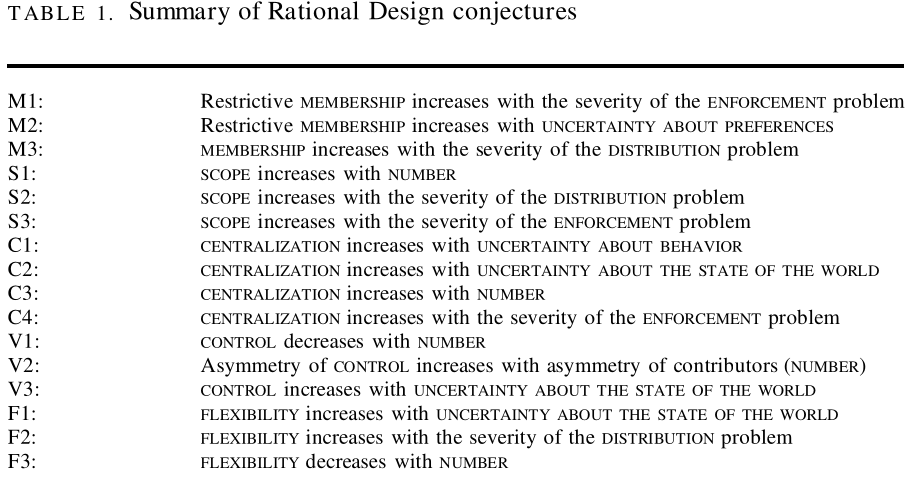

---
output:
  xaringan::moon_reader:
    css: ["default", "extra.css"]
    lib_dir: libs
    seal: false
    nature:
      highlightStyle: github
      highlightLines: true
      countIncrementalSlides: false
      ratio: '16:9'
---

```{r, echo = FALSE, warning = FALSE, message = FALSE}
library(tidyverse)
library(readxl)
library(lubridate)
library(sf)
library(rnaturalearth)
library(rnaturalearthdata)
library(kableExtra)

knitr::opts_chunk$set(echo = FALSE,
                      eval = TRUE,
                      error = FALSE,
                      message = FALSE,
                      warning = FALSE,
                      comment = NA)

d <- read_excel("../../Data/Kyoto_Protocol_and_WDI/Data-Kyoto_Protocol_Effectiveness.xlsx", na = c("NA", "")) %>%
  mutate(
    Kyoto_Sig = ymd(Signature),
    Kyoto_Rat = ymd(Ratification),
    Signed = if_else(!is.na(Kyoto_Sig), "Signed", "Didn't Sign"),
    Ratified = if_else(!is.na(Kyoto_Rat), "Ratified", "Didn't Ratify"),
    Signature = NULL,
    Ratification = NULL
  ) |>
  select(Country, ccode, Kyoto_Sig:Ratified, everything())
```

background-image: url('libs/Images/background-scales_justice_v3.png')
background-size: 105%
background-position: top
class: middle

.size45[**IV. International Institutions for Aggregate Effort**]

<br>

.size50[**Today's Agenda: Effectiveness Analysis**

- Kyoto Protocol to the United Nations Framework Convention on Climate Change
]

<br>

.center[.size40[
  Justin Leinaweaver (Fall 2023)
]]

???

### Prep for Class
1. ?

<br>


---

background-image: url('libs/Images/background-blue_cubes_lighter3.png')
background-size: 100%
background-position: center
class: middle, center

.size45[.content-box-white[**Treaty Design Analysis**]]

<br>

.size35[.content-box-white[**Kyoto Protocol to the United Nations Framework**]]

.size35[.content-box-white[**Convention on Climate Change**]]

.pull-left[
```{r, echo = FALSE, fig.align = 'center', out.width = '100%'}
knitr::include_graphics("libs/Images/02_2-Legalization_Fig1.png")
```
]

.pull-right[
```{r, echo = FALSE, fig.align = 'center', out.width = '100%'}

```
]

???


---

background-image: url('libs/Images/background-blue_cubes_lighter3.png')
background-size: 100%
background-position: center
class: middle

.center[.size50[.content-box-white[**Evaluating the Kyoto Protocol (1997)**]]]

.size40[
1. Which countries saw the biggest percentage declines in GHG emissions by 2012? Which the biggest increases?
2. Did signatory states see bigger declines in emissions than non-signatory states?
3. Did ratifying states see bigger declines in emissions than non-participant states?
4. Did states that ratified more quickly cut emissions more than those who ratified more slowly?
5. Did Annex B states that ratified see bigger declines in emissions than other states?
]

???

Your job was to be ready to do three things today

1. Give us your answer to these questions,

2. Explain how you answered the question, and

3. Explain how confident you are in each answer you are providing.

IS EVERYBODY READY TO GO?


---

background-image: url('libs/Images/background-blue_cubes_lighter3.png')
background-size: 100%
background-position: center
class: middle

.center[.size50[.content-box-white[**Evaluating the Kyoto Protocol (1997)**]]]

<br>

.size45[
1. Are changes in emissions since 1990 a good proxy for climate action?

2. Did signatories, ratifiers and faster ratifiers see bigger declines in emissions?

3. Did treaty obligations matter for state behavior on climate change?
]

???

We will use your work today to answer three somewhat broader questions about these treaties.

1. Are changes in emissions since 1990 a good proxy for climate action?
    - In other words, is this the "right" data for thinking about internaitonal climate change actions?

2. Did signatories, ratifiers and faster ratifiers see bigger declines in emissions?
    - In other words, did the states who participated in international cooperation on these issues behave differently than those who didn't?

3. Did treaty obligations matter for state behavior on climate change?
    - Ultimately, did the top-down emissions limits imposed by Kyoto translate into developed world action on climate change.

<br>

Three important questions so let's get to it!

- Let's work in groups of three today.

- Everybody stand up and form a group of three with people you haven't worked much with yet this semester!

- Go sit together.

- BUT don't get too comfortable, we're going to keep moving!


---

background-image: url('libs/Images/background-blue_cubes_lighter3.png')
background-size: 100%
background-position: center
class: middle

.center[.size30[.content-box-white[**1) Are changes in emissions since 1990 a good proxy for climate action?**]]]

.size40[
Which countries saw the biggest percentage declines in GHG emissions by 2012? And which had the biggest increases?

1. **How** did you answer these questions?
2. **What** are your answers?
3. Is this **a good measure** of of climate action?
]

???

Group Discussion 1: Are changes in emissions since 1990 a good proxy for climate action?

Which countries saw the biggest percentage declines in GHG emissions by 2012? And which had the biggest increases?

Take 10 minutes with your group to discuss:

1. How did you answer these questions?
2. What are your answers?
3. Is this a good measure of of climate action?


** Class Discuss **

OK, HOW DID YOU ANSWER THIS QUESTION?

(SLIDE: top 10 tables)


---

background-image: url('libs/Images/background-blue_cubes_lighter3.png')
background-size: 100%
background-position: center
class: middle

.pull-left[
```{r}
# Identify top 10 and bottom 10
d %>%
  select(Country, ghg_2012) %>%
  arrange(ghg_2012) %>%
  slice(1:15) |>
  kbl(align = c('l', 'c'))
```
]

.pull-right[
```{r}
d %>%
  select(Country, ghg_2012) %>%
  arrange(desc(ghg_2012)) %>%
  slice(1:15) |>
  kbl(align = c('l', 'c'))
```
]

???

AND, BASED ON YOUR DISCUSSION IN THE GROUP, IS THIS A GOOD MEASURE OF OF CLIMATE ACTION?

<br>

### Anybody know what's going on with Equitorial Guinea? 

Always investigate your outliers!

- [Per OPEC](https://www.opec.org/opec_web/en/about_us/4319.htm), Equitorial Guinea discovered its massive oil reserves only in 1996.

- Only in 1993 did they begin extracting oil at significant levels (a few million barrels per year)

- 2006-2007 went from 12m to 1.1 billion barrels per year!

- [Per IMF](https://www.imf.org/external/pubs/ft/scr/2006/cr06233.pdf) the economy has exploded since then!

<br>


DID ANYBODY TRY SUMMARIZING OR VISUALIZING THE OUTCOME VARIABLE ON ITS OWN?

(SLIDE)


---

background-image: url('libs/Images/background-blue_cubes_lighter3.png')
background-size: 100%
background-position: center
class: middle

```{r, fig.retina=3, fig.asp=0.618, fig.align='center', out.width='92%'}
# Visualize 2012
d %>%
  ggplot(aes(x = ghg_2012)) +
  geom_histogram(bins = 30, color = "white") +
  theme_bw() +
  labs(x = "Greenhouse Gas Emissions (% 1990)", y = "") +
  annotate("text", x = 2500, y = 25, label = "Equitorial\n Guinea") +
  annotate("segment", x = 2500, xend = 2500, y = 20, yend = 5, arrow = arrow(angle = 25), color = "red") +
  annotate("text", x = 1200, y = c(65, 60, 55), label = c(str_c("Min: ", min(d$ghg_2012, na.rm = T)), str_c("Median: ", median(d$ghg_2012, na.rm = T)), str_c("Max: ", max(d$ghg_2012, na.rm = T))), hjust = 0, size = 4.5)
```

???

### HOW DOES THIS HELP US ANSWER THE QUESTION?

### - IS THIS A GOOD MEASURE OF OF CLIMATE ACTION? Why or why not?

<br>

We can also zoom in on the heart of this variation and ask it about the line between cuts and increases. 

SLIDE


---

background-image: url('libs/Images/background-blue_cubes_lighter3.png')
background-size: 100%
background-position: center
class: middle

```{r, fig.retina=3, fig.asp=0.618, fig.align='center', out.width='92%'}
# Visualize 2012
x1 <- table(d$ghg_2012 < 0)

d %>%
  ggplot(aes(x = ghg_2012)) +
  geom_histogram(bins = 30, color = "white") +
  theme_bw() +
  labs(x = "Greenhouse Gas Emissions (% 1990)", y = "Count") +
  annotate("text", x = 600, y = 25, 
           label = str_c("States Cutting Emissions\n", x1[[2]], " / ", x1[[1]]+x1[[2]], " = ", round(x1[[2]]/(x1[[1]]+x1[[2]])*100, 1), "%"),
           size = 5) +
  xlim(-200, 1000)
```

???

We can also zoom in on the heart of this variation and ask it about the line between cuts and increases. 

LOTS OF VARIATION HERE TO EXPLAIN, RIGHT?

States differ quite a bit on this measure which gives us a lot to work with.


We can also visualize the emissions after grouping them using a map.

SLIDE


---

background-image: url('libs/Images/background-blue_cubes_lighter3.png')
background-size: 100%
background-position: center
class: middle

```{r, fig.retina=3, fig.asp=0.618, fig.align='center', out.width='92%'}
d2 <- d |>
  mutate(
    GHG_cat = case_when(
      ghg_2012 < 0 ~ "Cut emissions",
      ghg_2012 <= 100 ~ "Emissions increased (up to 2x)",
      ghg_2012 > 100 ~ "Emissions more than doubled"
    )
  )

# Identify country identifiers
# countrycode::guess_field(d2$ccode)
# countrycode::guess_field(d2020_1$COW_Code_N) # genc3c, iso3c and wb 100%

#d2020_1$newcode2 <- countrycode::countrycode(d2020_1$COW_Code_A, origin = "cowc", destination = "genc3n")
#d2020_1$newcode2 <- countrycode::countrycode(d2020_1$UN_Code_N, origin = "iso3n", destination = "genc3n")

## Use rnaturalearth to define world map data
worldmap <- ne_countries(scale = 'medium', type = 'map_units', returnclass = 'sf')

# countrycode::guess_field(worldmap$un_a3) #98.7% genc3n
# countrycode::guess_field(worldmap$adm0_a3) #98.7% iso3c
# countrycode::guess_field(worldmap$iso_n3) #98.3% genc3n

## Merge data onto worldmap
d10 <- left_join(worldmap, d2, by = c("adm0_a3" = "ccode"))

d10 |>
  ggplot() +
  geom_sf(aes(fill = GHG_cat)) +
  labs(fill = "", title = "Greenhouse Gas Emissions (2012 as % 1990)") +
  theme(legend.position = "bottom") +
  #scale_fill_brewer(type = "seq", palette = 7)
  scale_fill_manual(values = c("royalblue1", "orange", "red"))
```

???

Here I've created three groups:

1. Those who cut their emissions relative to 1990 are in blue

2. Emissions increases up to 100% (doubling) are in orange, and

3. Emissions above 100% are in red.

ANY SURPRISES ON THIS MAP? ANYTHING OF NOTE?


SO, BOTTOM LINE, IS THIS A USEFUL WAY TO MEASURE COUNTRIES ACTIONS ON CLIMATE CHANGE?


Alright, everybody stand up and find a new group!

Go!


---

background-image: url('libs/Images/background-blue_cubes_lighter3.png')
background-size: 100%
background-position: center
class: middle

.center[.size30[.content-box-white[2) Did signatories, ratifiers and speedy ratifiers see bigger declines in emissions?]]]

.size40[
1. **How** did you answer these questions?
2. **What** are your answers?
3. What are the **pros and cons** of testing the effectiveness of the Kyoto Protocol in these ways?
]

???

Group Discussion 2: New groups take 10 minutes to discuss your answers to the treaty participation questions.

1. How did you answer these questions?

2. What are your answers?

3. What are the pros and cons of testing the effectiveness of the UNFCCC / Kyoto Protocol in these ways?


** Class Discuss **

OK, WHAT WERE YOUR ANSWERS TO THIS QUESTION?

HOW DID YOU DO IT?


**SLIDE**: Your analyses...


---

background-image: url('libs/Images/background-blue_cubes_lighter3.png')
background-size: 100%
background-position: center
class: middle

```{r, fig.retina=3, fig.asp=0.618, fig.align='center', out.width='47%'}
## Show them how to shift from histogram to box plot (intuition)
d %>%
  ggplot(aes(x = ghg_2012)) +
  geom_histogram(bins = 30, color = "white") +
  theme_bw() +
  labs(x = "Greenhouse Gas Emissions (% 1990)", y = "") +
  coord_cartesian(xlim = c(-250, 3000))
```

```{r, fig.retina=3, fig.asp=0.618, fig.align='center', out.width='47%'}
# Box plot
d %>%
  ggplot(aes(y = 1, x = ghg_2012)) +
  geom_boxplot() +
  theme_bw() +
  labs(x = "Greenhouse Gas Emissions (2012 as % 1990)", y = "") +
  coord_cartesian(xlim = c(-250, 3000))
  
# summary(d$ghg_2012[d$Signed == "Signed"])
# summary(d$ghg_2012[d$Signed != "Signed"])
```

???

Explain intuition of how to read a box plot


---

background-image: url('libs/Images/background-blue_cubes_lighter3.png')
background-size: 100%
background-position: center
class: middle

```{r, fig.retina=3, fig.asp=0.618, fig.align='center', out.width='95%'}
# Did signatory states see bigger declines in emissions than non-signatory states?

# Overall number of Signed
# d %>%
#   summarize(
#     States = n(),
#     Signed = sum(!is.na(Kyoto_Sig)),
#     "Didn't Sign" = sum(is.na(Kyoto_Sig)),
#     Proportion = Signed / States
#   ) 

# Box plot
d %>%
  ggplot(aes(x = Signed, y = ghg_2012)) +
  geom_hline(yintercept = 0, color = "red", linewidth=1.25) +
  geom_boxplot() +
  theme_bw() +
  labs(x = "", y = "", 
       title = "Did signatory states see bigger declines in emissions?",
       subtitle = "Greenhouse Gas Emissions (2012 as % 1990)") +
  coord_cartesian(ylim = c(-100, 300)) +
  scale_x_discrete(labels = c("Didn't Sign\n(n = 108)", "Signed\n(n = 79)"))
```

???

Zoom in on IQRs!

### Did signatory states see bigger declines in emissions?


---

background-image: url('libs/Images/background-blue_cubes_lighter3.png')
background-size: 100%
background-position: center
class: middle

```{r, fig.retina=3, fig.asp=0.618, fig.align='center', out.width='92%'}
# Did ratifying states see bigger declines in emissions than non-signatory states?
# High number of rats overall
# d %>%
#   summarize(
#     States = n(),
#     Ratified = sum(!is.na(Kyoto_Rat)),
#     "Didn't Ratify" = sum(is.na(Kyoto_Rat)),
#     Proportion = Ratified / States
#   ) 

# summary(d$ghg_2012[d$Ratified == "Ratified"])
# summary(d$ghg_2012[d$Ratified != "Ratified"])

# Box plot
d %>%
  ggplot(aes(x = Ratified, y = ghg_2012)) +
  geom_hline(yintercept = 0, color = "red") +
  geom_boxplot(varwidth = TRUE) +
  theme_bw() +
  labs(x = "", y = "", 
       title = "Did ratifying states see bigger declines in emissions?", 
       subtitle = "Greenhouse Gas Emissions (2012 as % 1990)") +
  coord_cartesian(ylim = c(-100, 300)) +
  scale_x_discrete(labels = c("Didn't Ratify\n(n = 1)", "Ratified\n(n = 186)")) +
  annotate("text", x = 1, y = 200, label = "USA! USA! USA!") +
  annotate("segment", x = 1, xend = 1, y = 175, yend = 15, arrow = arrow(angle = 25), color = "red")

# summary(d$ghg_2012[d$Ratified == "Ratified"])
```

### Did ratifying states see bigger declines in emissions?

<br>

### IS THIS ALMOST UNIVERSAL PARTICIPATION A STRONG VOTE OF EFFECTIVENESS FOR KYOTO? WHY OR WHY NOT?

(SLIDE: Scatter plot by time to ratify)

(SLIDE: Scatter plot by time to ratify omitting equitorial guinea outlier)


---

background-image: url('libs/Images/background-blue_cubes_lighter3.png')
background-size: 100%
background-position: center
class: middle

```{r, fig.retina=3, fig.asp=0.618, fig.align='center', out.width='92%'}
#Did states that ratified more quickly cut emissions more than those who ratified more slowly?

labs1 <- d %>% filter(ghg_2012 > 475) %>% select(Country, ghg_2012, Time_to_Ratify)

d %>%
  ggplot(aes(x = Time_to_Ratify, y = ghg_2012)) +
  geom_point() +
  theme_bw() +
  labs(x = "Time to Ratify (years)", y = "Greenhouse Gas Emissions (2012 as % 1990)",
       title = "Did speedy ratifiers cut more emissions?") +
  geom_smooth(method = "lm", se = FALSE) +
  ggrepel::geom_label_repel(data = labs1, aes(label = Country), size = 2, min.segment.length = .2)
```

???

ARE WE SURPRISED BY THIS VISUALIZATION?

- WHY WOULDN'T TIME TO RATIFY VARY WITH EMISSION LEVELS?


---

background-image: url('libs/Images/background-blue_cubes_lighter3.png')
background-size: 100%
background-position: center
class: middle

```{r, fig.retina=3, fig.asp=0.618, fig.align='center', out.width='92%'}
# Omit Eq Guinea and Mozambique
d_test <- d |>
  filter(ghg_2012 < 1000)

labs2 <- d_test %>% filter(ghg_2012 > 300) %>% select(Country, ghg_2012, Time_to_Ratify)

d_test %>%
  ggplot(aes(x = Time_to_Ratify, y = ghg_2012)) +
  geom_point() +
  theme_bw() +
  labs(x = "Time to Ratify (years)", y = "Greenhouse Gas Emissions (2012 as % 1990)",
       title = "Did speedy ratifiers cut more emissions?",
       subtitle = "(Omitting Equitorial Guinea)") +
  geom_smooth(method = "lm", se = FALSE) +
  ggrepel::geom_label_repel(data = labs2, aes(label = Country), size = 2, min.segment.length = .2)
```

???

Remove the outlier and swap the sign of the slope!

### what happened to the slope of the line?

<br>

BOTTOM LINE ON THIS DISCUSSION, WHAT ARE THE PROS AND CONS OF TESTING THE EFFECTIVENESS OF THE UNFCCC / KYOTO PROTOCOL IN THESE WAYS?


Alright, everybody stand up and find a new group!

Go!


---

background-image: url('libs/Images/background-blue_cubes_lighter3.png')
background-size: 100%
background-position: center
class: middle

.center[.size30[.content-box-white[**3) Did treaty obligations matter for state behavior on climate change?**]]]

.size40[
1. **How** did you answer these questions?
2. **What** are your answers?
3. What are the **pros and cons** of testing the effectiveness of the Kyoto Protocol in these ways?
]

???

Group Discussion 3: New groups take 10 minutes to discuss your answers to the treaty obligation question.

Did treaty obligations, meaning Annex B cuts, matter for state behavior on climate change?

1. How did you answer these questions?

2. What are your answers?

3. What are the pros and cons of testing the effectiveness of the UNFCCC / Kyoto Protocol in these ways?


** Class Discuss **

OK, WHAT WERE YOUR ANSWERS TO THIS QUESTION?

HOW DID YOU DO IT?


** Your Analyses **


---

background-image: url('libs/Images/background-blue_cubes_lighter3.png')
background-size: 100%
background-position: center
class: middle

.pull-left[
```{r, fig.retina=3, fig.asp=1, fig.align='center', out.width='100%', fig.width=6}
## Signed
xsig <- d %>%
  group_by(Annex_B) %>%
  summarize(
    States = n(),
    Signed = sum(!is.na(Kyoto_Sig)),
    "Didn't Sign" = sum(is.na(Kyoto_Sig)),
    Proportion = Signed / States
  ) 

xrat <- d %>%
  group_by(Annex_B) %>%
  summarize(
    States = n(),
    Ratified = sum(!is.na(Kyoto_Rat)),
    "Didn't Ratify" = sum(is.na(Kyoto_Rat)),
    Proportion = Ratified / States
  ) 

# Bar plot
xsig %>%
  ggplot(aes(x = Annex_B, y = Proportion)) +
  geom_col(width = .5) +
  theme_minimal() +
  coord_cartesian(ylim = c(0,1)) +
  scale_y_continuous(labels = scales::percent_format()) +
  scale_x_discrete(labels = c("Annex B", "Non-Annex B", "Non-Participant")) +
  labs(y = "", x = "", title = "Kyoto Protocol Signatories") +
  annotate("text", x = 1, y = .15, label = "35 / 37\n(95%)", color = "white", size = 6) +
  annotate("text", x = 2, y = .15, label = "44 / 150\n(29%)", color = "white", size = 6)
```
]

.pull-right[
```{r, fig.retina=3, fig.asp=1, fig.align='center', out.width='100%', fig.width=6}
# Bar plot
xrat %>%
  ggplot(aes(x = Annex_B, y = Proportion)) +
  geom_col(width = .5) +
  theme_minimal() +
  coord_cartesian(ylim = c(0,1)) +
  scale_y_continuous(labels = scales::percent_format()) +
  scale_x_discrete(labels = c("Annex B", "Non-Annex B", "Non-Participant")) +
  labs(y = "", x = "", title = "Kyoto Protocol Ratifiers") +
  annotate("text", x = 1, y = .15, label = "36 / 37\n(97%)", color = "white", size = 6) +
  annotate("text", x = 2, y = .15, label = "150 / 150\n(100%)", color = "white", size = 6)
```
]

???

(SLIDE: bar plots for signature and ratification x annex B)

IS THIS EVIDENCE THE TREATY OBLIGATIONS MATTERED FOR PARTICIPATION? WHY OR WHY NOT?


---

background-image: url('libs/Images/background-blue_cubes_lighter3.png')
background-size: 100%
background-position: center
class: middle

```{r, fig.retina=3, fig.asp=0.618, fig.align='center', out.width='92%'}
d %>%
  ggplot(aes(x = Time_to_Ratify, y = ghg_2012, color = Annex_B)) +
  geom_jitter(width = .2) +
  theme_bw() +
  labs(x = "Time to Ratify (years)", y = "Greenhouse Gas Emissions (2012 as % 1990)",
       title = "Ratification speed by Annex groups") +
  geom_smooth(method = "lm", se = FALSE) +
  coord_cartesian(ylim = c(-100, 500)) +
  scale_color_viridis_d(begin = .4, end = .9)

#summary(d$Time_to_Ratify)
```

???

(SLIDE: scatter plot time to ratify by annex b and not)

DOES THIS INDICATE THE DEVELOPED WORLD CONSIDERED THEIR EMISSIONS BEFORE RATIFYING KYOTO?

(Not exactly)
- Almost all the dots are on year 4.


---

background-image: url('libs/Images/background-blue_cubes_lighter3.png')
background-size: 100%
background-position: center
class: middle

```{r, fig.retina=3, fig.asp=0.618, fig.align='center', out.width='92%'}
d %>%
  filter(ccode != 'USA') %>%
  ggplot(aes(x = Annex_B, y = ghg_2012)) +
  geom_hline(yintercept = 0, color = "red") +
  geom_boxplot(varwidth = TRUE) +
  theme_minimal() +
  labs(x = "", y = "", title = "Greenhouse Gas Emissions (2012 as % 1990, omit the USA)") +
  scale_x_discrete(labels = c("Annex B", "Non-Annex B")) +
  coord_cartesian(ylim = c(-100, 300))
```

???

(SLIDE: Box plots emissions by rat + Annex B)

> summary(d$GHG_1990_2012[d$Annex_B == "Annex B"])
   Min. 1st Qu.  Median    Mean 3rd Qu.    Max.    NA's 
-74.657 -27.544 -10.013 -11.198   3.716  68.735       2

> summary(d$GHG_1990_2012[d$Annex_B != "Annex B"])
   Min. 1st Qu.  Median    Mean 3rd Qu.    Max.    NA's 
 -77.99   19.89   65.74  116.94  126.21 2519.02      22

WHAT DOES THIS INDICATE FOR US?


BOTTOM LINE ON THIS DISCUSSION, WHAT ARE THE PROS AND CONS OF TESTING THE EFFECTIVENESS OF THE UNFCCC / KYOTO PROTOCOL IN THESE WAYS?


---

background-image: url('libs/Images/background-blue_cubes_lighter3.png')
background-size: 100%
background-position: center
class: middle

```{r, echo = FALSE, fig.align = 'center', out.width = '100%'}
knitr::include_graphics("libs/Images/13_2-Baetting_Cover.png")
```

???

Shift to a published academic report trying to answer these same questions!

Baettig, Michèle B, Simone Brander and Dieter M. Imboden. (2008). “Measuring countries' cooperation within the international climate change regime.” Environmental Science & Policy. 11(6), pp. 478–489.

- An attempt to identify "cooperative countries" in the world of climate governance.

- "Cooperative countries within the international climate regime are countries that commit to common goals within the framework of the UNFCCC and implement measures in line with those agreements" (Baettig, Brander and Imboden 2008, 479).


---

background-image: url('libs/Images/13_2-Baettig_oldslide1.png')
background-size: 100%
background-position: center

???

States Generally...
- Committed more promptly and completely to the UNFCCC than KP
- Don't tend to meet their reporting obligations

Developed States
- Pay their financial contributions on average more frequently than developing
- Annex B ratified KP more often and faster

Developing States
- Evaluated "more positively" in terms of emissions trajectories

Level of Cooperation (Low to High): USA, Australia, Russia, Canada, Brazil, China, India, South Africa, and large European countries.


---

background-image: url('libs/Images/13_2-Baettig_oldslide2.png')
background-size: 100%
background-position: center

???

We'll begin by focusing on the participation conclusions.

- States committed more to the UNFCCC than KP, and

- Ratified KP more often and faster (Annex B)


---

background-image: url('libs/Images/13_2-Baettig_oldslide3.png')
background-size: 100%
background-position: center

???

### Evaluate the operationalization of these concepts/measures?


---

background-image: url('libs/Images/13_2-Baettig_oldslide4.png')
background-size: 100%
background-position: center

???

Now we focus on the conclusion about states not meeting their reporting obligations.


---

background-image: url('libs/Images/13_2-Baettig_oldslide5.png')
background-size: 100%
background-position: center

???

### Evaluate the operationalization of these concepts/measures?


---

background-image: url('libs/Images/13_2-Baettig_oldslide6.png')
background-size: 100%
background-position: center

???

The conclusion is that developed states make more frequent financial contributions, on average.


---

background-image: url('libs/Images/13_2-Baettig_oldslide7.png')
background-size: 100%
background-position: center

???

### Evaluate the operationalization of these concepts/measures?


---

background-image: url('libs/Images/13_2-Baettig_oldslide8.png')
background-size: 100%
background-position: center

???

Now we ramp up the difficulty quite a bit!

The conclusion is that developing states are doing better in terms of their emissions trajectories.

This one will need some set-up.

SLIDE


---

background-image: url('libs/Images/13_2-Baettig_oldslide9.png')
background-size: 100%
background-position: center

???

HAS ANYBODY EVER HEARD OF THE ENVIRONMENTAL KUZNET'S CURVE?

Simon Kuznets was an economist who studied economic inequality in the 50s and 60s.

Hypothesis: economic development and economic inequality follow an inverted U-shaped relationship

* Describe logic starting from state with no income to one with lots... *

As an economy grows from the beginning, inequality grows too.

At a certain point economic growth stops driving inequality and eventually additional growth begins to shrink that inequality.

The micro-causes of this aren't always clear, but the general idea is that rising wealth and standards of living lead to demands by the population for more services and better amenities.

DOES THAT MAKE SENSE?


---

background-image: url('libs/Images/13_2-Baettig_oldslide10.png')
background-size: 100%
background-position: center

???

Somewhat later on, other economists began to apply this logic to models of pollution.

As incomes rose so too does pollution until a certain level is reached and then societal demands for a cleaner environment get louder.

Eventually, regulations follow and future economic growth actually lowers pollution.

A ton of literature exists debating the EKC and trying to find evidence of it all over the place.

The general takeaway has been that this trend seems to occur but primarily just on pollutants that are visible and most costly (e.g. smog, lake or river pollution leading to fish kills or sickness, etc.).

DOES THE BASIC INTUITION MAKE SENSE?

IS IT CLEAR WHY THE EKC ONLY SEEMS TO WORK FOR SOME TYPES OF POLLUTION AND NOT OTHERS?


---

background-image: url('libs/Images/13_2-Baettig_oldslide11.png')
background-size: 100%
background-position: center

???

What these authors did was model the EKC for CO2 emissions in 13 EU states across time (1870-2002).

They calculated an EU average for each year and then modeled it using a cubic polynomial function.

* See p481 *

And, indeed, it does seem to show an inverted U relationship.

So, first of all, that's pretty cool to see!


They used this to establish a baseline of development.

Countries could be compared to this trend line to see if they are developing a cleaner economy faster than the EU did.

In other words, given your current level of development is your country emitting more or fewer CO2 emissions than the avg of these EU 13 at a comparable point in their development?


---

background-image: url('libs/Images/13_2-Baettig_oldslide12.png')
background-size: 100%
background-position: center

???

Technically, they do this comparison two ways.

First, the "level" component compares your current emissions (1990-1992) to the EU's EKC.

Second, the "trend" component compares the slope of your line from 1990 to 2002 to the EU's slope over that time period.

QUESTIONS ON THIS?


---

background-image: url('libs/Images/13_2-Baettig_oldslide13.png')
background-size: 100%
background-position: center

???

### Evaluate the operationalization of these concepts/measures?


---

background-image: url('libs/Images/13_2-Baettig_oldslide14.png')
background-size: 100%
background-position: center

???

Alright, so all of this adds up to an index of cooperation that produces this conclusion.

The level of cooperation (low to high): USA, Australia, Russia, Canada, Brazil, China, India, South Africa, and large European countries

How confident should we be in this ranking?

Let's evaluate this together!


---

background-image: url('libs/Images/13_2-Baettig_oldslide15.png')
background-size: 100%
background-position: center

???

FIRST, AS A TEST OF EFFECTIVENESS ARE WE CONVINCED ALL THESE SHOULD BE INCLUDED? WHY OR WHY NOT?

* See p486, 4.3.1 selection of indicators *


SECOND, HOW DID THE AUTHORS WEIGHT THE INDICATORS IN THE INDEX AND HOW DID THEY TEST THE ROBUSTNESS?

* See p486, 4.3.3 Weighting *

(- Considered a bunch of different approaches and claims very high correlations across them all, >0.96)

(- Equal weighting of all indicators)
(- Equal weighting of all subindicators)
(- Equal weighting of all indicators except for the Emission Indicator
with a triple weight)
(- Equal weighting of all indicators except the Emission Indicator with a triple weight and the Reporting Indicator with a double weight)
(- Weights according to a Principal Component Analysis with two factors: i) 4 measures of UNFCCC and ii) emissions.)


---

background-image: url('libs/Images/background-blue_triangles.jpg')
background-size: 100%
background-position: center
class: middle

.size65[**Next Class: The Paris Agreement**]

.size40[
1. Dimitrov (2016): "The Paris Agreement on Climate Change: Behind Closed Doors"

2. The IPCC (1995) "AR6 Synthesis Report"

3. Data-Paris_Agreement_Negotiation.xlsx

4. The Paris Agreement (2015)
]

???


