---
output:
  xaringan::moon_reader:
    css: ["default", "extra.css"]
    lib_dir: libs
    seal: false
    nature:
      highlightStyle: github
      highlightLines: true
      countIncrementalSlides: false
      ratio: '16:9'
---

```{r, echo = FALSE, warning = FALSE, message = FALSE}
library(tidyverse)
library(readxl)
#library(stargazer)
#library(kableExtra)
#library(modelr)

knitr::opts_chunk$set(echo = FALSE,
                      eval = TRUE,
                      error = FALSE,
                      message = FALSE,
                      warning = FALSE,
                      comment = NA)
```

background-image: url('libs/Images/background-scales_justice_v3.png')
background-size: 105%
background-position: top
class: middle

.size45[**IV. International Institutions for Aggregate Effort**]

<br>

.size50[**Today's Agenda: Effectiveness Analysis**

- The Paris Agreement: Nationally Determined Contributions (NDC)
]

<br>

.center[.size40[
  Justin Leinaweaver (Fall 2023)
]]

???

### Prep for Class
1. Open if needed
    - [NDC Registry Link](https://unfccc.int/NDCREG)
    - [Paris Agreement Reservations](https://treaties.un.org/Pages/ViewDetails.aspx?src=TREATY&mtdsg_no=XXVII-7-d&chapter=27&clang=_en)
    - [Paris Agreement Text](https://unfccc.int/sites/default/files/english_paris_agreement.pdf)

<br>

Welcome back all!

- **SLIDE**: Let's try to warm back-up into studying the global effort to address climate change.


---

background-image: url('libs/Images/13_1-UNFCCC_Conference.png')
background-size: 100%
background-position: center
class: middle, center

???

We kicked things off two weeks ago with the very first major global climate treaty: the 1992 United Nations Framework Convention on Climate Change

<br>

The UNFCCC is the convention that sets the stage for the all of the UN climate treaties to come

### What were the three important legacies of the UNFCCC that we highlighted in class?

<br>

1. The ultimate objective of the global effort
    - Article 2 clearly states the "ultimate objective": "...prevent dangerous anthropogenic interference with the climate system" BUT your economy matters too!

2. The principles guiding our efforts
    - Article 3 lays out the key principles that were selected to guide our efforts
    - States should act to protect the system, BUT must also protect the developing world and protect economic development

3. Who is "rich" enough to mitigate emissions and pay for the global effort
    - States listed in Annex I and II represent the "rich" world who are responsible to do the most and help pay for the efforts of the developing world.

<br>

A substantial framing exercise PLUS the UNFCCC creates the outline of what could become important delegated agents in the future.

- e.g. The science and advisory committee, the Clean Development Mechanism, etc


---

background-image: url('libs/Images/13_1-Kyoto_Conference.png')
background-size: 100%
background-position: center
class: middle, center

???

We then jumped forward to the Kyoto Protocol (1998)!

- The Kyoto Protocol represented our first substantial attempt to mandate actual emissions cuts

<br>

### What were our takeaways from analyzing the design of the Kyoto Protocol?

<br>

A top-down approach to achieving cuts, BUT
- Only cutting emissions in the developed world,
    
- Some developed states received VERY generous targets,
    
- Specific processes for accounting and measuring actual emissions left TBD,
    
- Penalties for not meeting targets applied to second period, BUT
    - No second period actually agreed in KP

<br>

### Despite these critiques, what did we find in the data?

### - Was the Kyoto Protocol effective?

<br>

- (**SLIDE**)


---

background-image: url('libs/Images/background-blue_cubes_lighter3.png')
background-size: 100%
background-position: center
class: middle

```{r, cache=TRUE, fig.retina=3, fig.asp=0.618, fig.align='center', out.width='92%'}
d <- read_excel("../../Data/Kyoto_Protocol_and_WDI/Data-Kyoto_Protocol_Effectiveness.xlsx", na = c("NA", "")) %>%
  mutate(
    Kyoto_Sig = ymd(Signature),
    Kyoto_Rat = ymd(Ratification),
    Signed = if_else(!is.na(Kyoto_Sig), "Signed", "Didn't Sign"),
    Ratified = if_else(!is.na(Kyoto_Rat), "Ratified", "Didn't Ratify"),
    Signature = NULL,
    Ratification = NULL
  ) |>
  select(Country, ccode, Kyoto_Sig:Ratified, everything())

d %>%
  filter(ccode != 'USA') %>%
  ggplot(aes(y = Annex_B, x = ghg_2012)) +
  geom_vline(xintercept = 0, color = "red") +
  geom_boxplot(varwidth = TRUE) +
  theme_bw() +
  labs(x = "", y = "", title = "Greenhouse Gas Emissions (2012 as % 1990, omit the USA)") +
  scale_y_discrete(labels = c("Annex B", "Non-Annex B")) +
  coord_cartesian(xlim = c(-100, 300))
```

???

Ignoring the USA (non-participant), the majority of Annex B states did in fact cut their emissions!

- 72% of Annex B states cut their 1990 emissions by 2012

- 50% cut greater than 10%

- 25% cut more than 27%!

<br>

The Kyoto Protocol is a flawed agreement in many ways, BUT it pushed the "ball" forward in a meaningful way on global climate action and that's not nothing!

- **SLIDE**: In fact, international law has a way of influencing behavior even for non-participants

<br>

#### Notes
```{r}
summary(d$ghg_2012[d$Annex_B == "Annex B"])

quantile(d$ghg_2012[d$Annex_B == "Annex B"], na.rm = TRUE, probs = .72)
```


---

background-image: url('libs/Images/background-blue_cubes_lighter3.png')
background-size: 100%
background-position: center
class: middle

```{r, cache=TRUE, fig.retina=3, fig.asp=0.618, fig.align='center', out.width='92%'}
## Pulled from WDI
d2 <- tibble(
  Country = "USA",
  Year = 1998:2012,
  ghg_1990_pct = c(9.99, 10.95, 13.58, 11.17, 13.78, 13.94, 18.06, 17.06, 13.98, 16.18, 8.36, 7.63, 9.41, 7.1, 3.39),
  groups1 = c(rep("Period 1", 9), rep("Period 2", 6))
)

d2 |>
  ggplot(aes(x = Year, y = ghg_1990_pct)) +
  annotate("rect", xmin = 2008, xmax = 2012, ymin = -2, ymax = 20, fill = "lavenderblush2") +
  geom_line() +
  scale_y_continuous(limits = c(-2, 20), labels = scales::percent_format(scale = 1/01)) +
  scale_x_continuous(breaks = 1998:2012) +
  theme_bw() +
  labs(x = "", y = "Percent Change from 1990 Emissions", title = "Total greenhouse gas emissions for the United States (% change from 1990)", caption = "Source: World Bank's World Development Indicators (WDI)") +
  geom_hline(yintercept = 0, color = "blue", linetype = "dashed") +
  annotate("text", x = 2010, y = 19, label = "Kyoto Protocol Period")
```

???

Here we see the data on the US emissions since the Kyoto Protocol.

<br>

**SLIDE**: Add trend lines


---

background-image: url('libs/Images/background-blue_cubes_lighter3.png')
background-size: 100%
background-position: center
class: middle

```{r, cache=TRUE, fig.retina=3, fig.asp=0.618, fig.align='center', out.width='92%'}
d2 |>
  ggplot(aes(x = Year, y = ghg_1990_pct)) +
  annotate("rect", xmin = 2008, xmax = 2012, ymin = -2, ymax = 20, fill = "lavenderblush2") +
  geom_line() +
  scale_y_continuous(limits = c(-2, 20), labels = scales::percent_format(scale = 1/01)) +
  scale_x_continuous(breaks = 1998:2012) +
  theme_bw() +
  labs(x = "", y = "Percent Change from 1990 Emissions", title = "Total greenhouse gas emissions for the United States (% change from 1990)", caption = "Source: World Bank's World Development Indicators (WDI)") +
  geom_hline(yintercept = 0, color = "blue", linetype = "dashed") +
  annotate("text", x = 2010, y = 19, label = "Kyoto Protocol Period") +
  geom_smooth(aes(color = groups1), se = FALSE, method = "lm") +
  guides(color = FALSE) +
  scale_color_manual(values = c("red2", "green3"))
```

???

I don't want to be dismissive of this trend line.

- Basically every country in the world (UN members) ratified Kyoto and that matters

- "Soft" power is a real thing.


---

background-image: url('libs/Images/14_1-cop21.jpg')
background-size: 100%
background-position: center
class: middle

???

And that all brings us to today, the Paris Agreement (2015)

### What were the key provisions of the Paris Agreement that we reviewed in class?

<br>

1. Goals
    - Temp increases below 2° C, pursue efforts below 1.5° C (Art 2)
    - Global emissions should peak as soon as possible (Art 4)

2. NDCs
    - States should "intend to achieve" their NDCs (Art 4.2)
    - NDCs should be ambitious (Art 2) and be strengthened every five years

3. Responsibility still split by developed and developing states
    - Developed countries take the lead, **BUT developing states should enhance their efforts** in light of national circumstances (Art 4.4)
    - Developed states shall provide financial resources (Art 9)
    
4. New emphasis on market mechanisms
    - Encourages market based mechanisms and carbon trading
    
5. Some provision for enforcement
    - Compliance done by facilitative committee whose work is "non-adversarial and non-punitive" (Art 15)


---

background-image: url('libs/Images/14_1-Carbon_Capture_v2.png')
background-size: 100%
background-position: center
class: top, center, inverse

.textwhite[.size45[**Has the Paris Agreement been effective?**]]

???

Today we tackle the question of how effective the Paris Agreement has been.

- This is very much the cutting edge of this research area and represents a very difficult question to answer

<br>

### Based on the design of the Paris Agreement why is it so difficult to evaluate if it is working or not?

<br>

Depends on what part of the treaty you are evaluating!

1. Are countries submitting NDCs?
    - Are they on time?
    - Do they represent the highest ambition (given CBDR)?

2. Is the COP developing the metrics needed to evaluate the NDCs?
    - Is the global stock-take on track?
    
3. Is the developed world meeting its financing goals to assist the developing world in mitigation and adaptation?

4. Are countries actually implementing the policies they have proposed?

5. Are countries hitting the emissions targets they have pledged to hit?
    - You might take all the proposed actions and still not hit your estimated targets!

6. Over Time: Are second submission NDCs ratcheted up in ambition?


    
    
    
    
---

background-image: url('libs/Images/background-blue_triangles_flipped.png')
background-size: 100%
background-position: center
class: middle

.size55[.content-box-purple[**Today: Evaluating the NDCs**]]

<br>

```{r, echo = FALSE, fig.align = 'center', out.width = '100%'}
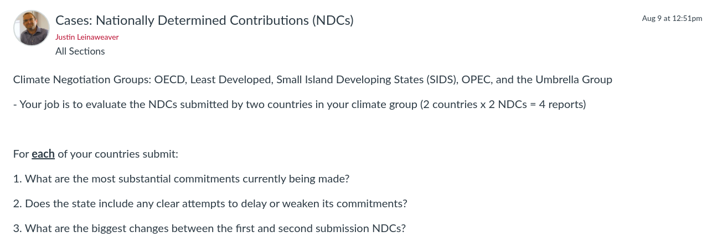
```

???

The NDCs represent the heart of the Paris Agreement's bottom-up approach to addressing climate change.

- That in mind, I asked everyone to review the NDCs for two countries in the same climate negotiating group

<br>

### How did that go?

<br>

### - Easy to read?

### - Interesting documents?


---

background-image: url('libs/Images/background-blue_cubes_lighter3.png')
background-size: 100%
background-position: center
class: middle, center

.size50[.content-box-purple[**NDCs: Descriptive Analyses**]]

<br>

```{r, echo = FALSE, fig.align = 'center', out.width = '100%'}
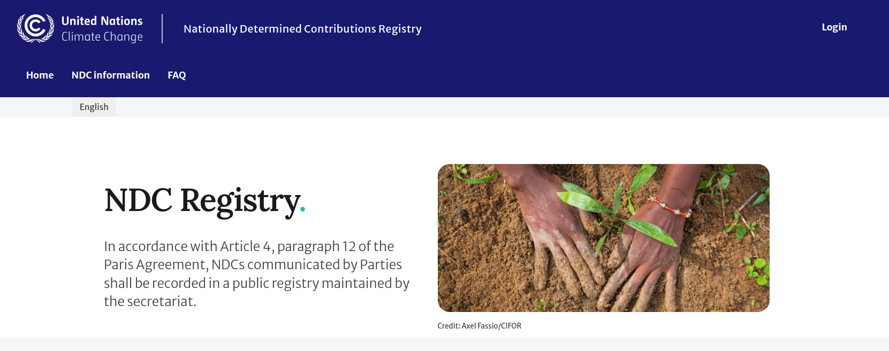
```

???

Let's start by reporting back on your NDCs in a purely descriptive sense

- We'll get to analyzing them in a moment

<br>

### How much did your NDCs vary by length?

### - Who had very long NDCs and who short?

<br>

### How complex or thorough were the documents?

### - Full of citations to specific laws and supporting materials or not?

<br>

### Give me examples of what sound like substantial commitments from your NDCs.

<br>

### Did anybody find language in their NDCs that functioned like a treaty reservation or the creation of a loophole?

### - Anything that maybe weakened the commitments in the document?

<br>

### Who saw a lot of change between different NDC submissions by a single country?

### - Examples of change?


---

background-image: url('libs/Images/background-blue_cubes_lighter3.png')
background-size: 100%
background-position: center
class: middle, center

.size50[.content-box-purple[**Treaty Design: Top-Down vs Bottom-up**]]

<br>

.pull-left[
```{r, echo = FALSE, fig.align = 'center', out.width = '100%'}
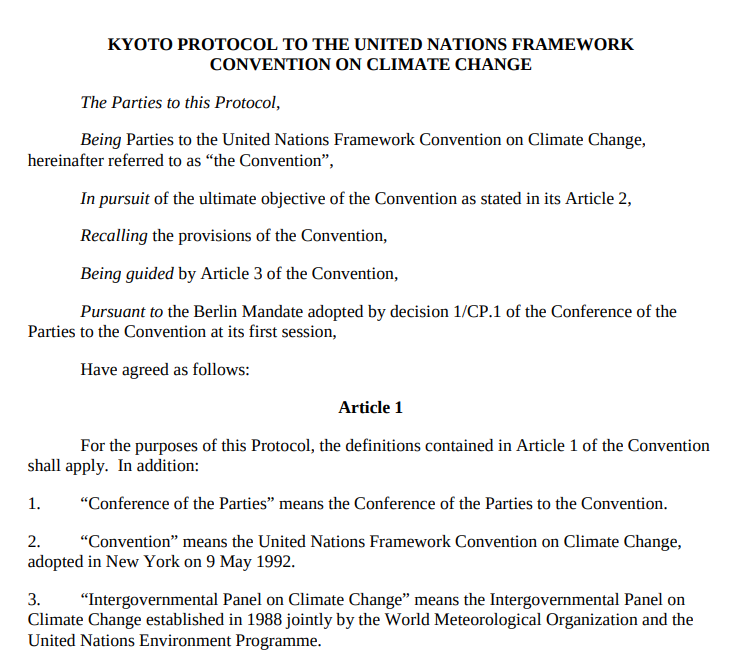
```
]

.pull-right[
```{r, echo = FALSE, fig.align = 'center', out.width = '100%'}
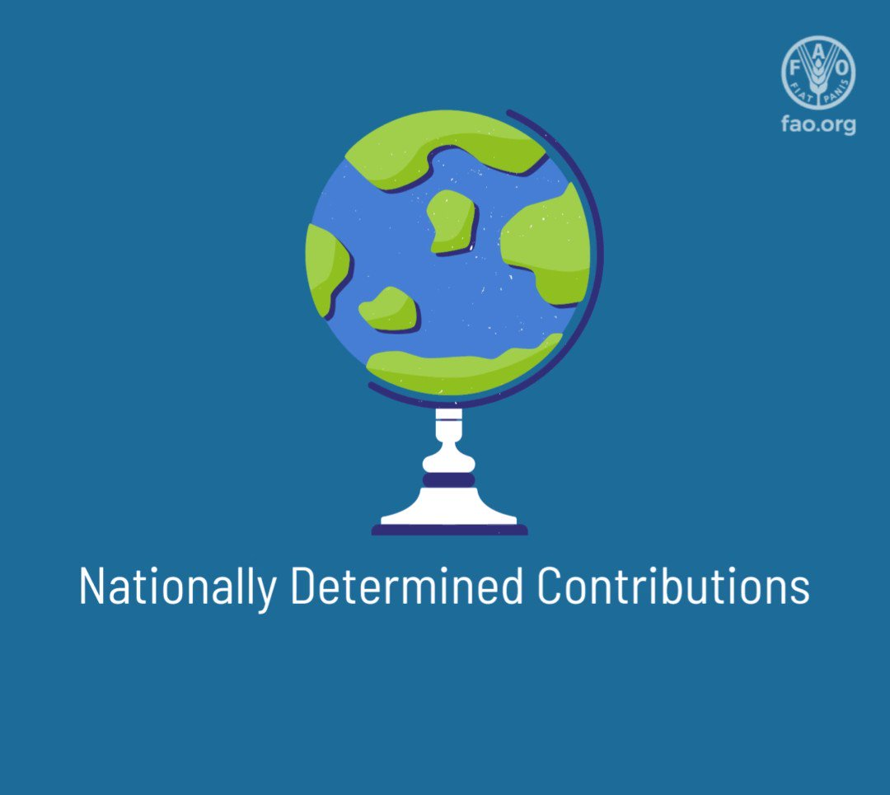
```
]

???

### Ok, big picture, how different are the commitments made in the NDCs to those in the Kyoto Protocol? 

### - Is this a step toward greater or lesser action on global climate change?


---

background-image: url('libs/Images/background-blue_cubes_lighter3.png')
background-size: 100%
background-position: center
class: center

.size40[.content-box-white[**The Climate Watch NDC Enhancement Tracker**]]

.size40[https://www.climatewatchdata.org/2020-ndc-tracker]

```{r, echo = FALSE, fig.align = 'center', out.width = '62%'}
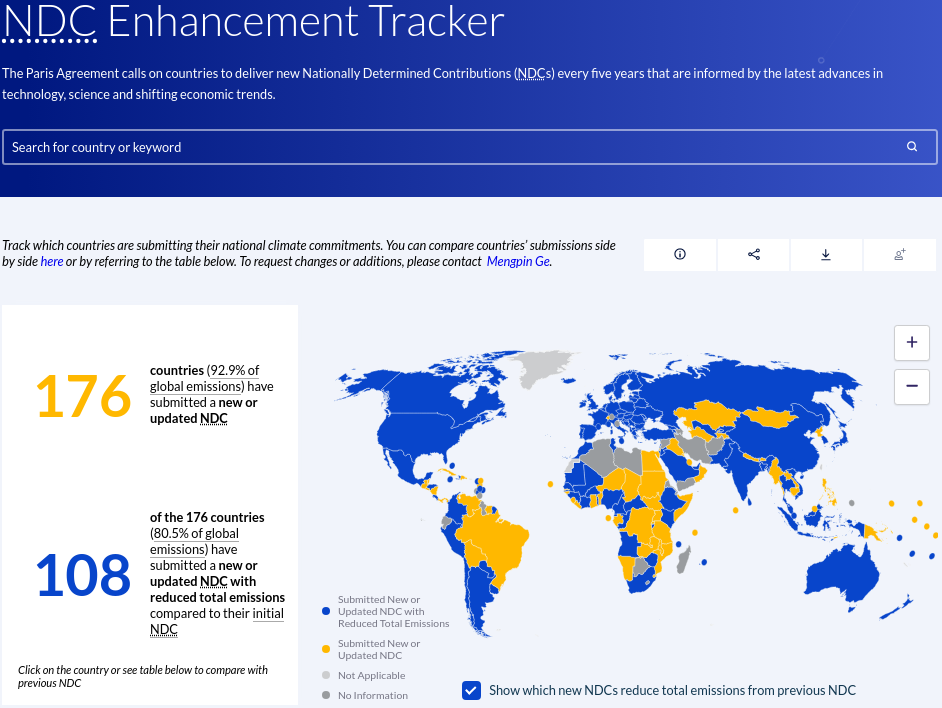
```

???

Everybody go to the Climate Watch NDC Enhancement Tracker and review the codings they have made that summarize the NDCs you read for class today.

- Get ready to report back, do you agree with their summary?

<br>

Report Back!

### Do you agree with the coding in the the CW database re your NDCs? Why or why not?

<br>

Ok, let's say someone came to you looking for data on the global climate negotiations

### Would you feel confident recommending the summaries on the CW database as a good source of this data?

### - In other words, does it represent the key variation in your NDCs well enough?

<br>

### - Anything big or important you see as being omitted?


---

background-image: url('libs/Images/background-blue_triangles_flipped.png')
background-size: 100%
background-position: center
class: middle

.center[.size45[.content-box-purple[**Evaluating the Climate Negotiation Groups' NDCs**]]]

.size40[
- OECD States

- Least Developed Countries

- Small Island Developing States (SIDS)

- The Organization of Petroleum Exporting Countries (OPEC)

- The Umbrella Group

.center[**Evidence of common framings, positions, policies or demands?**]
]

???

Groups, I want you to compare and contrast the cases you reviewed in order to draw out inferences about the overall positions of this climate negotiating group.

- Get ready to report back your findings

- Is there evidence of common framings, positions, demands across the NDCs in your group?

<br>

PRESENT and DISCUSS each group


---

background-image: url('libs/Images/14_1-Brandt_Line_Map.jpg')
background-size: 100%
background-position: center
class: middle

???

This map visualizes the Brandt line which approximates the divide between the developed northern states and the developing southern ones

- Line taken from the Brandt Report written in the 1980s for the Independent Commission for International Developmental Issues

<br>

My aim is not to debate this particular 43 year old line, but instead to ask this:

### Based on your NDCs are we comfortable asserting that there remains a stark divide between the developed and the developing world in terms of how they frame the climate change problem and the actions they would like to see taken?

<br>

**SLIDE**: OPTIONAL - With time remaining let me show you some recent research on this area


---

background-image: url('libs/Images/background-blue_cubes_lighter3.png')
background-size: 100%
background-position: center

```{r, echo = FALSE, fig.align = 'center', out.width = '100%'}
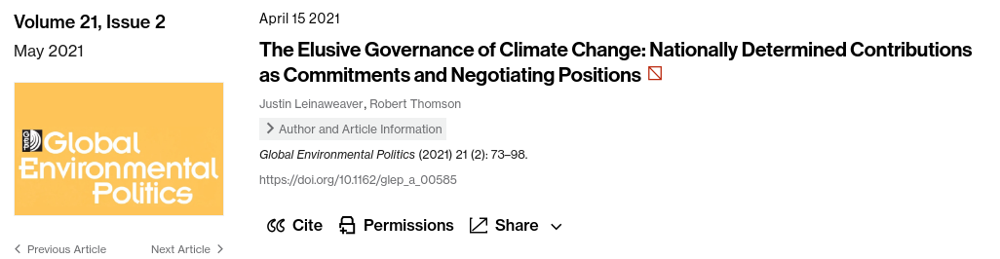
```

.size45[**Follow-on Work in Progress**

The State of the Climate Negotations After the Second Nationally Determined Contributions (NDCs)
- Leinaweaver, Thomson, Jankin and Bechara
]

???

Two years ago Robert Thomson and I published research analyzing the first submission NDCs for those states who tended to speak most for each climate negotiation group.

<br>

Since then we've been updating the results for the latest NDC submissions and hope to have that submitted to a journal soon.

- We brought on a computer scientst from Ireland (Hannah Bechara) and Slava Jankin is a political scientist with extensive experience in Natural Language Processing

<br>

**SLIDE**: In the meantime, here's a snapshot of some of what we've found...


---

background-image: url('libs/Images/background-blue_cubes_lighter3.png')
background-size: 100%
background-position: center

.size40[.content-box-purple[**NDC Thematic Categories**]]

.size30[
1. General Principles
    - Environment (general), Economic development, Human rights, Subnational authorities, anticapitalism

2. International Institutions and Policies
    - International governance, State sovereignty, MRV, Differentiation, International finance, Internationa technology transfer, International markets, Loss and damage compensation

3. Domestic Institutions and Policies
    - Mitigation targets (current), Targets (long-term), Fossil fuels, Nuclear energy, Renewables, Energy efficiency, Protection of natural areas, Adaptation, Domestic markets, Other domestic policies, Government institutions, Other
]

???

First thing to know is that we developed a coding dictionary that would allow us to capture the variation in each NDC by what it emphasized

- Each NDC is summarized by the amount it emphasizes each of these themes or topics

<br>

We developed this dictionary through a fairly extensive process including:
- reviewing the established literature, 

- interviewing country representatives who negotiated the KP and PA, and 

- reading and reflecting on the NDCs themselves.


---

background-image: url('libs/Images/background-blue_cubes_lighter3.png')
background-size: 100%
background-position: center

```{r, fig.retina=3, fig.align='center', fig.asp=1.2, out.width='48%', fig.width=5}
# Visualize topic proportions
d10 <- read_excel("../../Data/Paris_Agreement_and_WDI/Leinaweaver_topics_All-2022-08-29.xlsx")

# Mean NDC 1 Scores
d10a <- d10 |>
  filter(ndc == 1) |>
  select(-ndc, -Other_1, -Other_2) |>
  pivot_longer(cols = topic_1_vulnerability:topic_21_government, names_to = "Topics", values_to = "Proportion") |>
  group_by(Topics) |>
  summarize(
    Mean = mean(Proportion)
  ) |>
  arrange(desc(Mean)) 

d10a |>
  mutate(
    Topics = str_remove(Topics, pattern = "topic_[0-9][0-9]*_")
  ) |>
  ggplot(aes(x = Mean, y = reorder(Topics, Mean))) +
  geom_point() +
  theme_bw() +
  scale_x_continuous(labels = scales::percent_format(accuracy = 1)) +
  labs(x = "Mean Topic Proportions (NDC 1)", y = "")
```

???

**NOTE TO YOU: NLP dictionary is a little bit different than thematic dictionary**

<br>

This dot plot shows you the average emphases in the first submission NDCs.

- The top rows represent those topics receiving the largest emphases

- So, states generally emphasized topics of environmental vulnerability, the need for renewable energy and a demand for new international governance.

- At the other end of the scale there was very little emphasis on waste, a need for nuclear energy and criticisms of capitalism

<br>

I know that last one sounds weird but members of the Bolivarian Alliance for the Peoples of our America (ALBA) used their first NDCs to vent about capitalism.

- Antigua and Barbuda, Bolivia, Cuba, Dominica, Grenada, Nicaragua, Saint Kitts and Nevis, Saint Lucia, St Vincent and the Grenadines and Venezuela

<br>

**SLIDE**: What's really cool is what we found in the shift from first submission to second submission NDCs


---

background-image: url('libs/Images/background-blue_cubes_lighter3.png')
background-size: 100%
background-position: center

```{r, echo = FALSE, fig.align = 'center', out.width = '74%'}
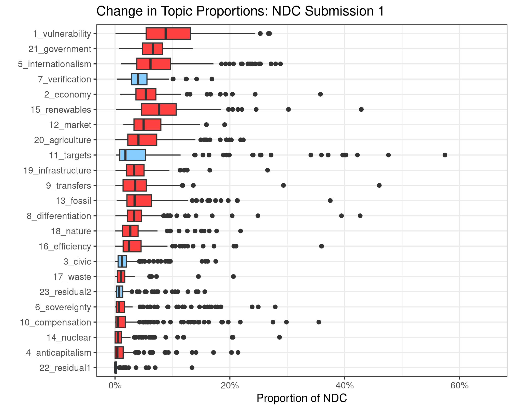
```

???

Rather than averages I'm showing you box plots.

- This way you can compare much more of the variation in country NDCs

- Blue boxes are topics that increased their median level of emphasis, red boxes shrank 

<br>

Importantly what we see is a strong increase in the proportion of NDCs focused on setting mitigation targets, demanding verification of emissions cuts and a need to engage with our civic communities (human rights, vulnerability and non-state actors)


---

background-image: url('libs/Images/background-blue_cubes_lighter3.png')
background-size: 100%
background-position: center

```{r, echo = FALSE, fig.align = 'center', out.width = '70%'}
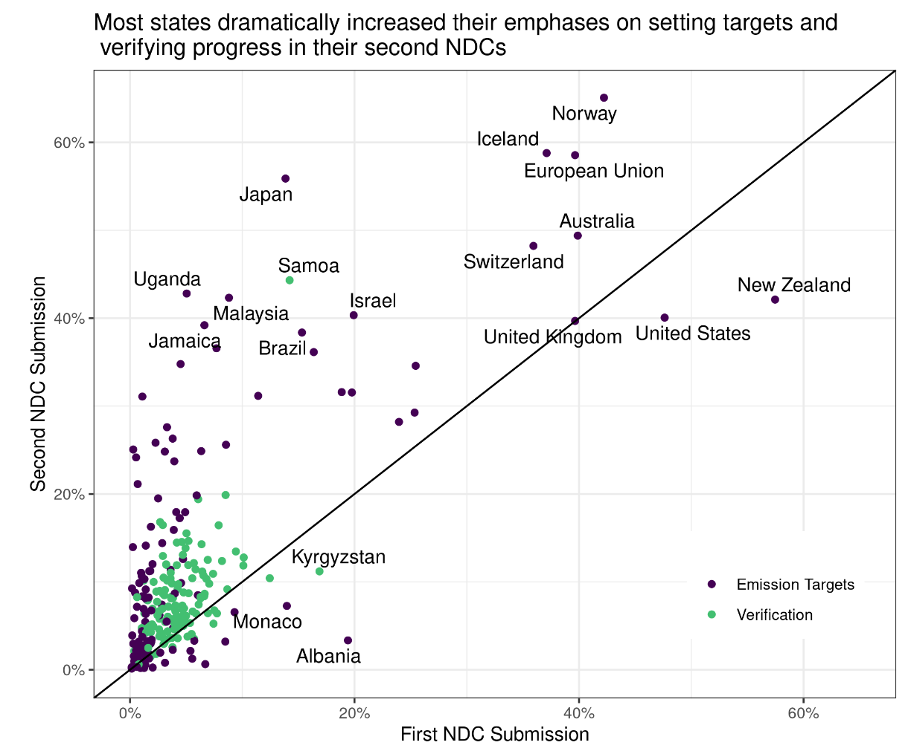
```

???

Targets and verification scatter plot

<br>

Of the 133 states that have submitted two NDCs:

- 115 have increased their emphases on the verification topic (86%).

- 107 have increased their emphases on the emissions target topic (80%).

<br>

### Any notable outliers from this increased ambition?

- (Dammit America)
    - Although part of that is we (and New Zealand) already focused heavily on these topics!

<br>

So, some good news!

- **SLIDE**: However, it isn't enough...


<br>

#### Notes
- Note that this includes the UK whose first submission was made as part of the joint EU submission.


---

background-image: url('libs/Images/background-blue_cubes_lighter3.png')
background-size: 100%
background-position: center

```{r, echo = FALSE, fig.align = 'center', out.width = '84%'}
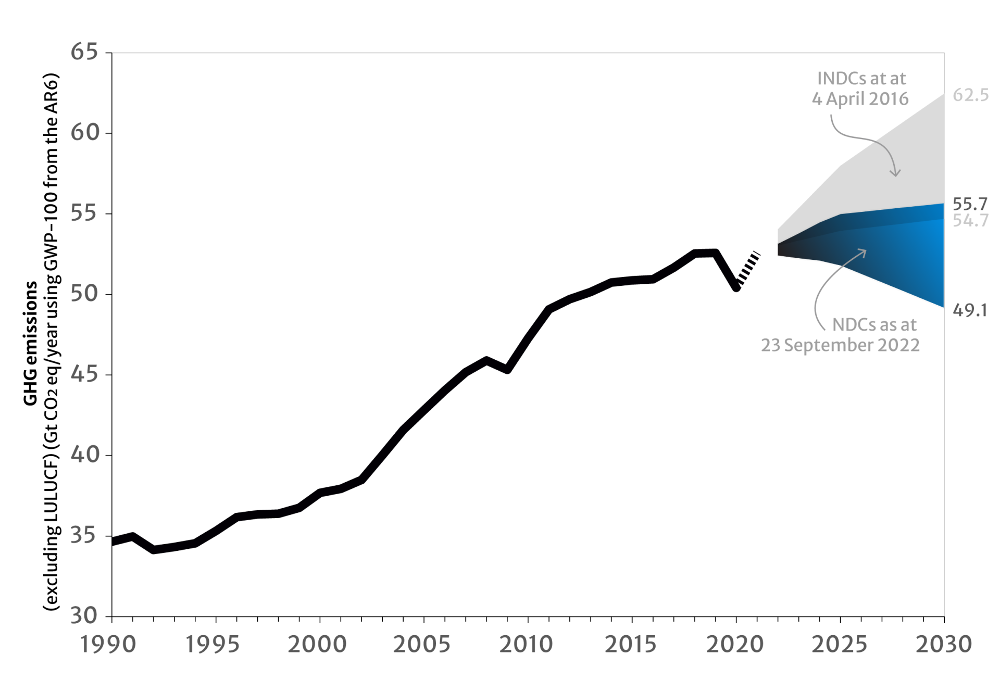
```

???

The [UN's 2022 NDC Synthesis Report](https://unfccc.int/ndc-synthesis-report-2022)

<br>

Each year starting in 2021 the UN Climate Change organization updates a synthesis report that is meant to help us understand the NDC pledges and how we're doing on climate change.

- 2023 report hasn't been released yet.

<br>

Figure on slide: Current projected effect of the NDCs (with uncertainty intervals)


---

background-image: url('libs/Images/background-blue_cubes_lighter3.png')
background-size: 100%
background-position: center

```{r, echo = FALSE, fig.align = 'center', out.width = '100%'}
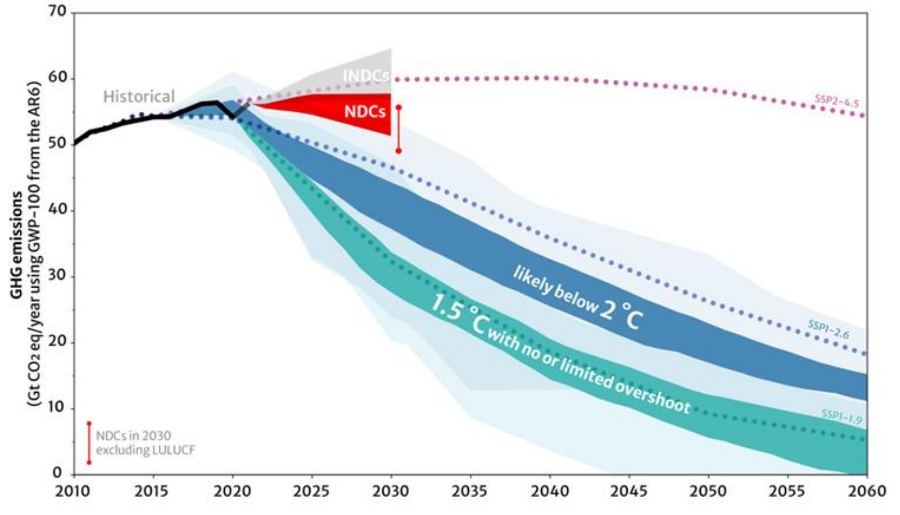
```

???

The [UN's 2022 NDC Synthesis Report](https://unfccc.int/ndc-synthesis-report-2022)

<br>

And where that leaves us...


---

background-image: url('libs/Images/background-blue_triangles_flipped.png')
background-size: 100%
background-position: center
class: middle

.size70[.content-box-purple[**Next Class**]]

<br>

.center[.size65[
Wrapping up the semester and starting the final paper
]]

???


---

OLD slides


---

background-image: url('libs/Images/background-blue_cubes_lighter3.png')
background-size: 100%
background-position: center

.pull-left[
```{r, echo = FALSE, fig.align = 'center', out.width = '100%'}
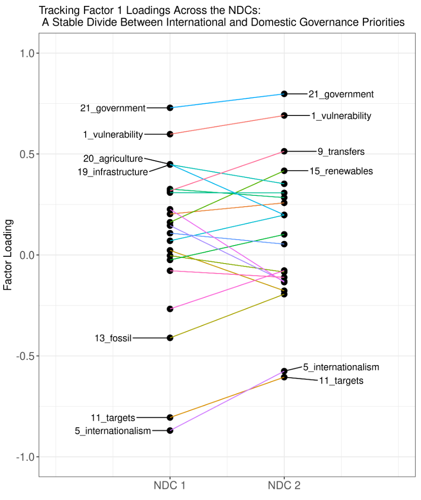
```
]

.pull-right[
```{r, echo = FALSE, fig.align = 'center', out.width = '100%'}
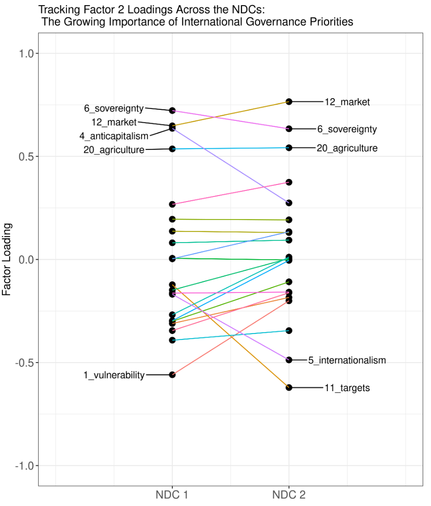
```
]

???

Thematic Factors line plots side by side

In this section the factor analyses are performed separately on the first and second NDC submissions. This allows us to visualize the topic loadings within each set of submissions.

Figure 9 focuses on Factor 1 across the two NDC submissions. Factor 1 explains 16% of the cumulative variation in the first NDC submissions and 14% in the second. This dimension is fairly stable across the two submissions in terms of the topics that load most heavily on it. We define this factor as a divide between those states focusing on developing international governance (with a key aim of centralizing emissions targets) and those focusing on developing domestic governance (in response to vulnerability concerns).

Figure 10 focuses on Factor 2 across the two NDC submissions. Factor 2 explains 13% of the cumulative variation in the first NDC submissions and 12% in the second. This is the dimension apparently most impacted by the dramatic rise in the proportion of state NDCs focusing on setting mitigation targets and creating the international governance structures needed to further cooperation on climate change. In NDC Submission 1 the factor analysis reveals a dimension divided between states that provided different reasons to contextualize their (possibly too low) emission mitigation targets (e.g. environmental vulnerability vs concerns over sovereignty or a need to grow economically). In NDC Submission 2 the factor analysis reveals a dimension rooted in the same starting place as in Factor 1 (mitigation targets and international governance), but the opposite end is now dominated by domestic concerns over market mechanisms, a defense of sovereignty and to a slightly lesser extent agricultural issues. The emphasis in environmental vulnerability has appeared to diminish significantly in these second round NDC submissions.


---

background-image: url('libs/Images/background-blue_cubes_lighter3.png')
background-size: 100%
background-position: center

```{r, echo = FALSE, fig.align = 'center', out.width = '95%'}
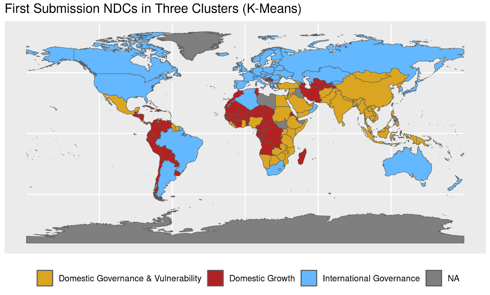
```

???

FA States map after k means clustering NDC 1

The move from NDC 1 (Figure 12) to NDC 2 (Figure 13) shows what appears to be a tightening in the clusters of countries involved in the negotiations.

K-means clustering can be used to quantify this visual pattern across the state groupings. Using the FA scores for each state as the input and setting the k-means clustering algorithm to estimate three clusters shows a dramatic tightening of the clusters when moving from the first to the second NDC submissions. Specifically, the three clusters are more evenly distributed and the with-cluster sum of squares is reduced.

The K-Means clusters estimated using only the first submission NDCs place countries in three groups:

States focused primarily on domestic growth policies (Factor 1 = .2, Factor 2 = 1.2)
States that load somewhat equally on the need for domestic governance policies and a concern for their environmental vulnerability (Factor 1 = .5, Factor 2 = -.6)
States focused primarily on international governance policies (Factor 1 = -1.6, Factor 2 = -.1)


---

background-image: url('libs/Images/background-blue_cubes_lighter3.png')
background-size: 100%
background-position: center

```{r, echo = FALSE, fig.align = 'center', out.width = '95%'}
knitr::include_graphics("libs/Images/14_2-LeinaweaverThomson_Map3.png")
```

???

FA States map after k means clustering NDC 1

The K-Means clusters estimated using only the second submission NDCs place countries in three much tighter, better defined groups:

The cluster focused on domestic growth policies has seen an increase in their load on international governance issues (Factor 1 = -.3, Factor 2 = 1.1)
The cluster previously split by domestic governance and vulnerability now loads more heavily on domestic governance and replaces vulnerability with a small load on international governance (Factor 1 = .9, Factor 2 = -.3)
The cluster focused on international governance policies remains so focused across both factors (Factor 1 = -.9, Factor 2 = -.9)


---

background-image: url('libs/Images/background-blue_cubes_lighter3.png')
background-size: 100%
background-position: center

```{r, echo = FALSE, fig.align = 'center', out.width = '47%'}

```

```{r, echo = FALSE, fig.align = 'center', out.width = '47%'}
knitr::include_graphics("libs/Images/14_2-LeinaweaverThomson_Map3.png")
```


