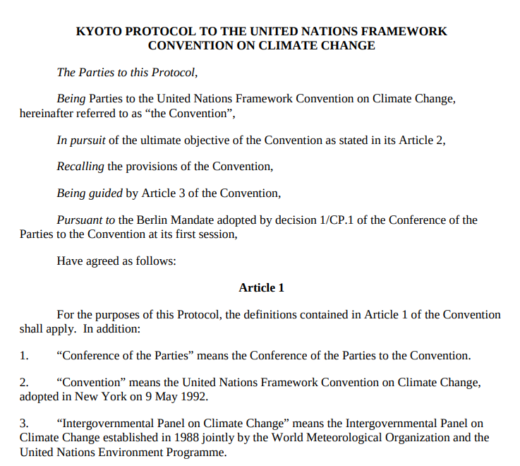
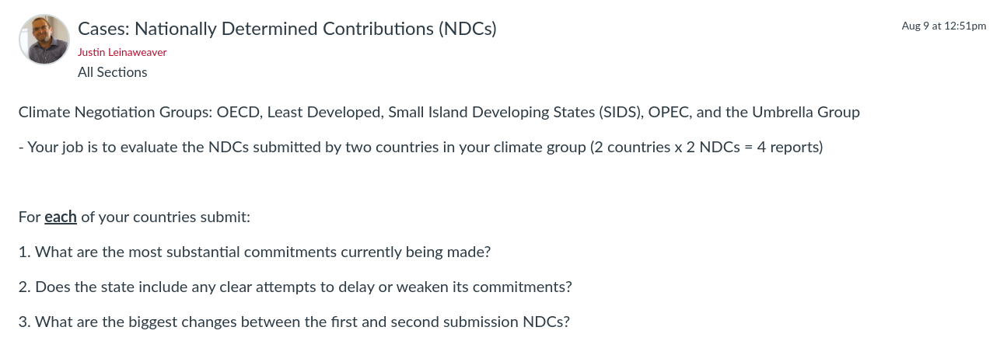

---
output:
  xaringan::moon_reader:
    css: ["default", "extra.css"]
    lib_dir: libs
    seal: false
    nature:
      highlightStyle: github
      highlightLines: true
      countIncrementalSlides: false
      ratio: '16:9'
---

```{r, echo = FALSE, warning = FALSE, message = FALSE}
library(tidyverse)
library(readxl)
library(lubridate)
library(sf)
library(rnaturalearth)
library(rnaturalearthdata)

knitr::opts_chunk$set(echo = FALSE,
                      eval = TRUE,
                      error = FALSE,
                      message = FALSE,
                      warning = FALSE,
                      comment = NA)

d <- read_excel("../../Data/Paris_Agreement_and_WDI/Data-Paris_Agreement_Negotiation.xlsx", na = "")
```

background-image: url('libs/Images/background-scales_justice_v3.png')
background-size: 105%
background-position: top
class: middle

.size45[**IV. International Institutions for Aggregate Effort**]

<br>

.size50[**Today's Agenda: Design Analysis**

- The Paris Agreement (2015)
]

<br>

.center[.size40[
  Justin Leinaweaver (Fall 2023)
]]

???

### Prep for Class
1. Prep Canvas Forum for collecting NDC analyses


<br>

Last week we kicked off our work in the final section of the class by exploring the global effort to address climate change

- Specifically we focused on two international institutions: the UNFCCC and the Kyoto Protocol


---

background-image: url('libs/Images/background-blue_cubes_lighter3.png')
background-size: 100%
background-position: center
class: middle, center

.size45[.content-box-white[**Treaty Design Analysis**]]

<br>

.size35[.content-box-white[**The Kyoto Protocol to the UNFCCC**]]

.pull-left[
```{r, echo = FALSE, fig.align = 'center', out.width = '100%'}
knitr::include_graphics("libs/Images/02_2-Legalization_Fig1.png")
```
]

.pull-right[
```{r, echo = FALSE, fig.align = 'center', out.width = '100%'}
knitr::include_graphics("libs/Images/03_2-KLS_Table1.png")
```
]

???

### In broad terms, what is the Kyoto Protocol approach to climate change?

### - What are its main obligations, how precise are they and how much delegation is in the treaty?

<br>

- Adopts the ultimate objective, key principles and institutional structure from UNFCCC
    - Including the Annex list! (e.g. who has to make cuts and who has to pay for cuts in developing world)
    
- Annex B emission cuts are good, BUT
    - The Australia clause sucks
    - All punishments for missing targets appear to be infinitely delayable or can be accounted for in future treaties
    
- Art 3 only applies to specific period of time for cuts (hopes that they would endure?)
    - So much of the big questions pushed off to future meetings (What is demonstrable progress? How do we calculate emissions?)
    
- CDM is a cool idea but how will financing work, who pays, how much, etc TBD

<br>

**SLIDE**: Effectiveness discussion


---

background-image: url('libs/Images/background-blue_cubes_lighter3.png')
background-size: 100%
background-position: center
class: middle

.center[.size50[.content-box-white[**Making an Argument**]]]

.center[.size50[.content-box-white[**Was the Kyoto Protocol Effective?**]]]

.size45[
1. Changes in emissions since 1990 are a good proxy for the climate actions in the Kyoto Protocol

2. Treaty participants (signatories, ratifiers and faster ratifiers) saw bigger declines in emissions

3. Annex B states significantly changed their emissions behavior
]

???

On Thursday we explored the data on emissions and treaty commitment to consider these three claims.

### What did we conclude?

### - Is the answer to each of these "yes"?

<br>

- (**SLIDE**: Box plots of Annex B states)

- (**SLIDE**: Baettig team on emissions)


---

background-image: url('libs/Images/background-blue_cubes_lighter3.png')
background-size: 100%
background-position: center
class: middle

```{r, cache=TRUE, fig.retina=3, fig.asp=0.618, fig.align='center', out.width='92%'}
# Box plots Annex B from last class
d_kyoto <- read_excel("../../Data/Kyoto_Protocol_and_WDI/Data-Kyoto_Protocol_Effectiveness.xlsx", na = c("NA", "")) %>%
  mutate(
    Kyoto_Sig = ymd(Signature),
    Kyoto_Rat = ymd(Ratification),
    Signed = if_else(!is.na(Kyoto_Sig), "Signed", "Didn't Sign"),
    Ratified = if_else(!is.na(Kyoto_Rat), "Ratified", "Didn't Ratify"),
    Signature = NULL,
    Ratification = NULL
  ) |>
  select(Country, ccode, Kyoto_Sig:Ratified, everything())

d_kyoto %>%
  filter(ccode != 'USA') %>%
  ggplot(aes(y = Annex_B, x = ghg_2012)) +
  geom_vline(xintercept = 0, color = "red") +
  geom_boxplot(varwidth = TRUE) +
  theme_bw() +
  labs(x = "", y = "", title = "Greenhouse Gas Emissions (2012 as % 1990, omit the USA)") +
  scale_y_discrete(labels = c("Annex B", "Non-Annex B")) +
  coord_cartesian(xlim = c(-100, 300))
```

???

Here was our analysis of the Annex B states emissions behavior

<br>

### Why does this omit the US?
- (Never ratified!)

<br>

### And what does this suggest?
- (Much of the "developing world" cut their emissions relative to 1990)

<br>

**SLIDE**: But how has the whole world done?


---

background-image: url('libs/Images/13_2-Baettig_oldslide13.png')
background-size: 100%
background-position: center

???

One of the advantages of the approach in Baettig, Brander and Imboden 2008 is an attempt to evaluate the performance of all states against different targets.

- Remember, these scores measure each states emissions against whether or not they made improvements from the development trajectory they are on

- So, poor states can increase emissions as they grow their economies but did they emit less than might otherwise have been expected?

<br>

### Takeaways from this map of scores?

<br>

So, the Kyoto Protocol achieved some successes, but the bar may have been way too low

### Any questions on our material from last week?


---

background-image: url('libs/Images/background-blue_cubes_lighter3.png')
background-size: 100%
background-position: center
class: middle

.center[.size50[.content-box-white[**The Paris Agreement (2015)**]]]

.size50[
1. How has the science changed?

2. How have emission levels changed?

3. How has the politics changed?

4. Evaluate the treaty design
]

???

For today I want to bring us up to date with the global climate negotiations by analyzing the Paris Agreement.

- This represents the current state of the global effort.

<br>

To do this I want to draw out three connections to our work last week

- How has the science, the emissions and the politics changed since the Kyoto Protocol?

<br>

Then we'll dig into the treaty itself.


---

background-image: url('libs/Images/background-blue_cubes_lighter3.png')
background-size: 100%
background-position: center
class: middle

.center[.size50[.content-box-white[**How has the science changed?**]]]

.pull-left[

<br>

```{r, echo = FALSE, fig.align = 'center', out.width = '100%'}
knitr::include_graphics("libs/Images/13_1-IPCC_Cover.png")
```
]

.pull-right[
```{r, echo = FALSE, fig.align = 'center', out.width = '100%'}
knitr::include_graphics("libs/Images/14_1-IPCC_Report.png")
```
]

???

Since the Paris Agreement is our currently operating global treaty I wanted to bring us up to date on the science of the problem

- At least, per the global consensus generated by the IPCC

<br>

### Remind me, who is the IPCC and why should we listen to them?

- From their "About" page: "The IPCC currently has 195 members. Thousands of people from all over the world contribute to the work of the IPCC. For the assessment reports, experts volunteer their time as IPCC authors to assess the thousands of scientific papers published each year to provide a comprehensive summary of what is known about the drivers of climate change, its impacts and future risks, and how adaptation and mitigation can reduce those risks. An open and transparent review by experts and governments around the world is an essential part of the IPCC process, to ensure an objective and complete assessment and to reflect a diverse range of views and expertise. Through its assessments, the IPCC identifies the strength of scientific agreement in different areas and indicates where further research is needed. The IPCC does not conduct its own research."

<br>

Obviously our scientific understanding has changed over the 28 years between these reports, but it is useful for us to consider how the political consensus reflects that evolution

- SMALL GROUPS: Compare and contrast the key conclusions of the Second Assessment Report with this, the Sixth

- What are the most substantial changes?

<br>

*ON BOARD (2 columns): Current Status and Future Risks*

- ?

<br>

**SLIDE**: How have the emissions changed?


---

background-image: url('libs/Images/background-blue_cubes_lighter3.png')
background-size: 100%
background-position: center
class: middle, full

```{r}
# Emissions map - Kyoto (1997)
# quantile(d1997$CO2_kt, probs = .25)[[1]]
d1997 <- d |> 
  filter(Year == 1997) |>
  mutate(
    co2_cat = case_when(
      CO2_kt < 1e3 ~ "< 1,000",
      CO2_kt < 1e4 ~ "< 10,000",
      CO2_kt < 1e5 ~ "< 100,000",
      CO2_kt < 1e6 ~ "< 1,000,000",
      CO2_kt < 1e7 ~ "< 10,000,000"
    ),
    co2_pc_cat = case_when(
      CO2_per_capita < 1 ~ "< 1",
      CO2_per_capita < 5 ~ "< 5",
      CO2_per_capita < 10 ~ "< 10",
      CO2_per_capita >= 10 ~ "10+"
    )
  )

# Use rnaturalearth to define world map data
worldmap <- ne_countries(scale = 'medium', type = 'map_units', returnclass = 'sf')

# Merge data onto worldmap
d10 <- left_join(worldmap, d1997, by = c("adm0_a3" = "ccode"))
```

```{r, fig.retina=3, fig.align = 'center', out.width = '54%', fig.width=9, fig.height=4.5, cache=TRUE}
d10 |>
  mutate(
    co2_cat = factor(co2_cat, levels = c("< 1,000", "< 10,000", "< 100,000", "< 1,000,000", "< 10,000,000"))
  ) |>
  ggplot() +
  geom_sf(aes(fill = co2_cat)) +
  labs(fill = "", title = "CO2 Emissions (kt): Kyoto Protocol (1997)") +
  scale_fill_manual(values = c("floralwhite", "khaki2", "yellow1", "orange1", "red"))
```

```{r, fig.retina=3, fig.align = 'center', out.width = '54%', fig.width=9, fig.height=4.5, cache=TRUE}
# Emissions per capita map - Kyoto (1997)
d10 |>
  mutate(
    co2_pc_cat = factor(co2_pc_cat, levels = c("< 1", "< 5", "< 10", "10+"))
  ) |>
  ggplot() +
  geom_sf(aes(fill = co2_pc_cat)) +
  labs(fill = "", title = "CO2 Emissions per capita (kt): Kyoto Protocol (1997)") +
  scale_fill_manual(values = c("floralwhite", "yellow1", "orange1", "red"))
```

???

As we looked at last week, here is the state of global emissions in 1997 (at the completion of the Kyoto Protocol negotiation).

### What were our takeaways? Who were the biggest emitters at that point?


---

background-image: url('libs/Images/background-blue_cubes_lighter3.png')
background-size: 100%
background-position: center
class: middle, full

.center[.size40[.content-box-white[**How have emission levels changed?**]]]

```{r, fig.retina=3, fig.align='center', out.width='100%', fig.width=9, fig.height=4.5}
# Change in Emissions 1997 to 2015
d_compare <- d |> 
  select(Country, ccode, Year, CO2_kt) |>
  pivot_wider(names_from = Year, values_from = CO2_kt, names_prefix = "CO2_") |>
  mutate(
    Change = CO2_2015 - CO2_1997,
    Change_cat = case_when(
      Change <= 0 ~ "Cut Emissions",
      Change < 1e4 ~ "+ 10,000",
      Change < 1e5 ~ "+ 100,000",
      Change < 1e6 ~ "+ 1,000,000",
      Change < 1e7 ~ "+ 10,000,000"
    )
  ) 

# Use rnaturalearth to define world map data
worldmap <- ne_countries(scale = 'medium', type = 'map_units', returnclass = 'sf')

# Merge data onto worldmap
d11 <- left_join(worldmap, d_compare, by = c("adm0_a3" = "ccode"))

d11 |>
  mutate(
    Change_cat = factor(Change_cat, levels = c("Cut Emissions", "+ 1,000", "+ 10,000", "+ 100,000", "+ 1,000,000", "+ 10,000,000"))
  ) |>
  ggplot() +
  geom_sf(aes(fill = Change_cat)) +
  labs(fill = "", title = "Change in CO2 Emissions (kt): 1997 to 2015") +
  scale_fill_manual(values = c("dodgerblue1", "khaki3", "yellow1", "orange1", "red"))
```

???

Here we see the changes in total emissions between the Kyoto Protocol agreement and the close of the Paris negotiation.

- Please note the scale here is in log base 10

- SO, changes in color between countries are a HUGE deal

<br>

### How have emission levels changed during the intervening years?

<br>

**SLIDE**: Of course, these are colors by changes not absolute levels


---

background-image: url('libs/Images/background-blue_cubes_lighter3.png')
background-size: 100%
background-position: center
class: middle, full

```{r}
# Emissions map - Kyoto (2015)
d2015 <- d |> 
  filter(Year == 2015) |>
  mutate(
    co2_cat = case_when(
      CO2_kt < 1e3 ~ "< 1,000",
      CO2_kt < 1e4 ~ "< 10,000",
      CO2_kt < 1e5 ~ "< 100,000",
      CO2_kt < 1e6 ~ "< 1,000,000",
      CO2_kt < 1e7 ~ "< 10,000,000"
    ),
    co2_pc_cat = case_when(
      CO2_per_capita < 1 ~ "< 1",
      CO2_per_capita < 5 ~ "< 5",
      CO2_per_capita < 10 ~ "< 10",
      CO2_per_capita >= 10 ~ "10+"
    )
  )

# Use rnaturalearth to define world map data
worldmap <- ne_countries(scale = 'medium', type = 'map_units', returnclass = 'sf')

# Merge data onto worldmap
d11 <- left_join(worldmap, d2015, by = c("adm0_a3" = "ccode"))
```

```{r, fig.retina=3, fig.align = 'center', out.width = '54%', fig.width=9, fig.height=4.5, cache=TRUE}
d11 |>
  mutate(
    co2_cat = factor(co2_cat, levels = c("< 1,000", "< 10,000", "< 100,000", "< 1,000,000", "< 10,000,000"))
  ) |>
  ggplot() +
  geom_sf(aes(fill = co2_cat)) +
  labs(fill = "", title = "CO2 Emissions (kt): Kyoto Protocol (2015)") +
  scale_fill_manual(values = c("floralwhite", "khaki2", "yellow1", "orange1", "red"))
```

```{r, fig.retina=3, fig.align = 'center', out.width = '54%', fig.width=9, fig.height=4.5, cache=TRUE}
# Emissions per capita map - Kyoto (2015)
d11 |>
  mutate(
    co2_pc_cat = factor(co2_pc_cat, levels = c("< 1", "< 5", "< 10", "10+"))
  ) |>
  ggplot() +
  geom_sf(aes(fill = co2_pc_cat)) +
  labs(fill = "", title = "CO2 Emissions per capita (kt): Kyoto Protocol (2015)") +
  scale_fill_manual(values = c("floralwhite", "yellow1", "orange1", "red"))
```

???

Welcome India to the biggest emitters club!

- US making improvements but emissions still massive!

<br>

So, this is where the world found itself post-Kyoto. 

### How are these changes likely to change the political dynamics of negotiating a new global climate treaty?

<br>

- Some cuts happening amongst the OECD/Annex B countries (although not huge)

- Emissions remaining high in developed countries, and

- Emissions growing rapidly in the global south

<br>

**SLIDE**: So, how has the politics changed?


---

background-image: url('libs/Images/14_1-PA_Design_Old1.png')
background-size: 100%
background-position: center

???

Today we'll start with Dimitrov Radoslav's analysis of the negotiation leading to the Paris Agreement.

### What do we think of Dimitrov as a source of this information? Pros and cons?

- *Force this discussion*

<br>

### Overall, why does Dimitrov describe the Paris Agreement as a big success?

- (**SLIDE**)


---

background-image: url('libs/Images/14_1-PA_Design_Old3.png')
background-size: 100%
background-position: center

???

Quote from China's Closing Statement at top of paper: "The Paris Agreement is fair and just, comprehensive and balanced, highly ambitious, enduring and effective, and with legally binding force."

1. (Policy obligations for all states)

2. (Attempt to offer the best of a bottom-up and a top-down treaty)

<br>

### How does the PA blend a bottom-up and a top-down approach to institution building?

- (countries set own goals BUT int'l community oversight and pushing you to ratchet up pledges every five years)

- "The new climate deal is a laissez-faire accord among nations that leaves the content of domestic policy to governments but creates international legal obligations to develop, implement, and regularly strengthen actions" (2).

<br>

### Who are Dimitrov's "winners" and "losers" from the PA? In terms of countries and ideas?

### - Anybody need clarification on these points?

- (**SLIDE**)


---

background-image: url('libs/Images/background-blue_cubes_lighter3.png')
background-size: 100%
background-position: center
class: middle, center

.size40[.content-box-white[**Winners and Losers of the Paris Agreement (Dimitrov 2016)**]]

<br>

.size40[
"Strengths of the agreement pertain to principled obligations to act, regularity and progression of national policy development, international transparency and accountability" (8). 

"The PA is weaker on the long-term global goal, adaptation policy, compensation for loss and damage, and technology transfer. Crucially, the PA lacks specificity on the international division of labor for reducing emissions" (8).
]

???

Dimitrov argues that the PA generally favors developed countries of the North.

- Basically a pledge and review system (first proposed by Japan in the 1990s. (8)

<br>

Least fair to the African Group and other Least Developed Countries

- No reference to their special circumstances, weak on adaptation and "precludes any future claims for liability and compensation."

<br>

SMALL GROUPS: Per Dimitrov, what are the big steps forward in the Paris Agreement?

- In other words, what are the key provisions that make it into the treaty's design?

- *ON BOARD*: Call stuff out as you find it!

<br>

(**SLIDE**)


---

background-image: url('libs/Images/background-blue_cubes_lighter3.png')
background-size: 100%
background-position: center
class: middle

.center[.size40[.content-box-white[**Key provisions of the Paris Agreement (Dimitrov 2016)**]]]

.size35[
- Temp increases below 2° C, pursue efforts below 1.5° C (Art 2)
- Global emissions should peak as soon as possible (Art 4)
- States should "intend to achieve" their NDCs (Art 4.2)
- NDCs should be ambitious (Art 2) and be strengthened every five years
- Developed countries take the lead, developing states should enhance their efforts in light of national circumstances (Art 4.4)
- Developed states shall provide financial resources (Art 9)
- Encourages market based mechanisms and carbon trading
- Compliance done by facilitative committee whose work is "non-adversarial and non-punitive" (Art 15)
]

???

Here are the key provisions of the treaty according to Dimitrov.

<br>

### What are the big steps forward here? Why?

<br>

### Anything on this list you think was a mistake? Things we shouldn't have given away?

- *Force this discussion*

<br>

Ok, Dimitrov identifies three big reasons the PA was a success.

1. The US and China kickstarted the process in 2014 with a bilateral deal.

2. French leadership and secrecy were vital.

3. Negotiation dynamics and social learning from domestic policy attempts mattered.

<br>

**SLIDE**: I want to dig in on two of these.


---

background-image: url('libs/Images/14_1-PA_Design_Old4.png')
background-size: 100%
background-position: center

???

Let's zoom in on this second factor: Laurent Fabius' role as COP 21 president.

### Do you agree the French did the right thing here? Why or why not?

### - What are the pros and cons of organizing a global negotiation around secrecy and exclusion of both states and civic society?

- *Force this discussion*

<br>

#### NOTES
The Secret Ingredients (5)
- Heavy use of secrecy was crucial.
- The French presidency kept consultations secret so they could manage the many different blocs of interests. Private breakthroughs kept quiet to facilitate compromise.
- Weird anecdote on p6 about an invisible meeting between US and Saudi Arabia.
- Final texts only released at the last minute and presented as take-it-or-leave-it deals "to avoid provoking early opposition and to leave no time for reopening major issues" (6).
- "This raises important questions about transparency and legitimacy in global governance (Bernstein 2004)."


---

background-image: url('libs/Images/background-blue_cubes_lighter3.png')
background-size: 100%
background-position: center
class: middle

.center[.size45[.content-box-white[**Persuasive Argumentation and Social Learning**]]]

<br>

.size35[
Persuasive Argumentation
- "...persuasive arguments had changed actors’ minds about the wisdom of climate policy (Dimitrov 2015)" (9).

Social Learning
- "By the opening of the Paris conference, 186 governments had declared national plans covering 94 percent of global emissions (UNFCCC 2015b). These policy pledges laid an important foundation for a global UN agreement" (9).
]

???

Now zoom in on the third causes according to Dimitrov: Persuasive Argumentation and Social Learning

- Let's explore these arguments.

<br>

### Are you convinced by these? Why or why not?

<br>

### - Are we surprised Dimitrov, an EU negotiator, would argue the negotiation and EU leadership matters?

<br>

### - Which of these comes first: the negotiations moving preferences or countries enacting policies that change the interests?

<br>

**SLIDE**: Let's talk design


---

background-image: url('libs/Images/background-blue_cubes_lighter3.png')
background-size: 100%
background-position: center
class: middle, center

.size45[.content-box-white[**Treaty Design Analysis**]]

<br>

.size35[.content-box-white[**The Paris Agreement to the UNFCCC**]]

.pull-left[
```{r, echo = FALSE, fig.align = 'center', out.width = '100%'}
knitr::include_graphics("libs/Images/02_2-Legalization_Fig1.png")
```
]

.pull-right[
```{r, echo = FALSE, fig.align = 'center', out.width = '100%'}
knitr::include_graphics("libs/Images/03_2-KLS_Table1.png")
```
]

???

SMALL GROUPS: Let's audit Dimitrov's list!

- Do you agree that each of his key provisions is accurately represented in the treaty?

- Does the text of the treaty change how you understand these provisions? Why or why not?

<br>

*REPORT BACK and DISCUSS*

<br>

### To what degree do we agree with Dimitrov's list?

<br>

### Any significant delegation in the treaty?

<br>

#### Notes from prior classes

Article 4 contains the main guidance for states when designing their NDC submissions.
- 4.1: All States - Context is GHG emissions
- 4.2: All States - Specific domestic mitigation measures (policies)
- 4.3: All States - Highest possible ambition BUT CBDR + national circumstances
- 4.4: Developed only - economy-wide absolute emission reduction targets
- 4.4: Developing only - "enhance" efforts, "encouraged" to set targets
- 4.5: Developing only - Ambition can be contingent on financing
- 4.7: All - adaptation co-benefits count as mitigation
- 4.8: All - Provide all needed info for "clarity, transparency and understanding"


---

background-image: url('libs/Images/background-blue_cubes_lighter3.png')
background-size: 100%
background-position: center
class: middle, center

.size50[.content-box-white[**The Kyoto Protocol vs The Paris Agreement**]]

.pull-left[
```{r, echo = FALSE, fig.align = 'center', out.width = '100%'}

```
]

.pull-right[
```{r, echo = FALSE, fig.align = 'center', out.width = '100%'}

```
]

???

### In terms of treaty design, which approach do you prefer, the top-down Kyoto Protocol or the bottom-up Paris Agreement? Why?

<br>

### - What are the pros and cons of each approach?

<br>

Kyoto Protocol
- ?

Paris Agreement
- ?

<br>

**SLIDE**: Has the Paris Agreement been effective?


---

background-image: url('libs/Images/background-blue_triangles_flipped.png')
background-size: 100%
background-position: center
class: middle

.size55[.content-box-white[**Next Class: Evaluating the NDCs**]]

<br>

.size40[
**Climate Change Negotiating Groups**

- OECD States
- Least Developed Countries
- Small Island Developing States (SIDS)
- The Organization of Petroleum Exporting Countries (OPEC)
- The Umbrella Group
]

???

*Assign students to climate groups*

<br>

Your job will be to evaluate a sample of the NDCs submitted by your climate negotiating group

- **SLIDE**


---

background-image: url('libs/Images/background-blue_triangles_flipped.png')
background-size: 100%
background-position: center
class: middle

.size55[.content-box-white[**Next Class: Evaluating the NDCs**]]

<br>

```{r, echo = FALSE, fig.align = 'center', out.width = '100%'}

```

???

Each of you will select two countries from your group

- Data: CLASS-Country_NDCs_to_Evaluate.xlsx

<br>

Most of the countries on this sheet have submitted two NDCs

- You will read through both of them

- e.g. 2 countries x 2 NDCs = 4 reports

<br>

Submit to Canvas your notes on the NDCs submitted by your countries

<br>

### Any questions on the assignment?

<br>

**SLIDE**: Let's take a look at the NDC registry online


---

background-image: url('libs/Images/background-blue_triangles_flipped.png')
background-size: 100%
background-position: center
class: middle

```{r, echo = FALSE, fig.align='center', out.width = '40%'}
knitr::include_graphics("libs/Images/14_1-NDC_Registry1.png")
```

```{r, echo = FALSE, fig.align='center', out.width = '60%'}
knitr::include_graphics("libs/Images/14_1-NDC_Registry2.png")
```

???

Search feature is SLOOOOOOOW

<br>

Also, be prepared for all kinds of weirdness (e.g. not a simple first submission vs second)

- Often what you'll see is first with a 2020-ish update to the first

- For our purposes we are interested in the updates as second submissions

<br>

If your chosen country only submitted NDCs in a different language, use Google Translate or pick a different country!

<br>

### Questions?

- Take some time now to make sure you can access the NDCs for the countries you have selected.


