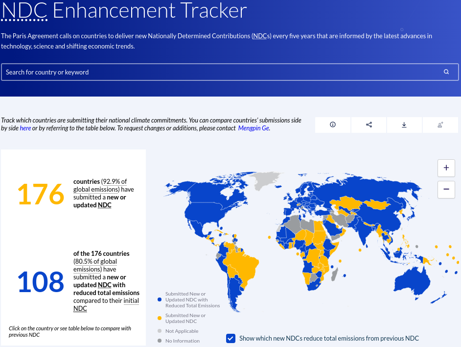
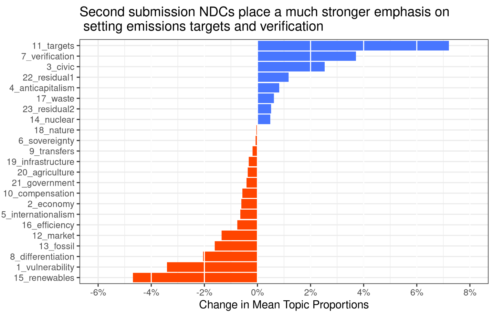
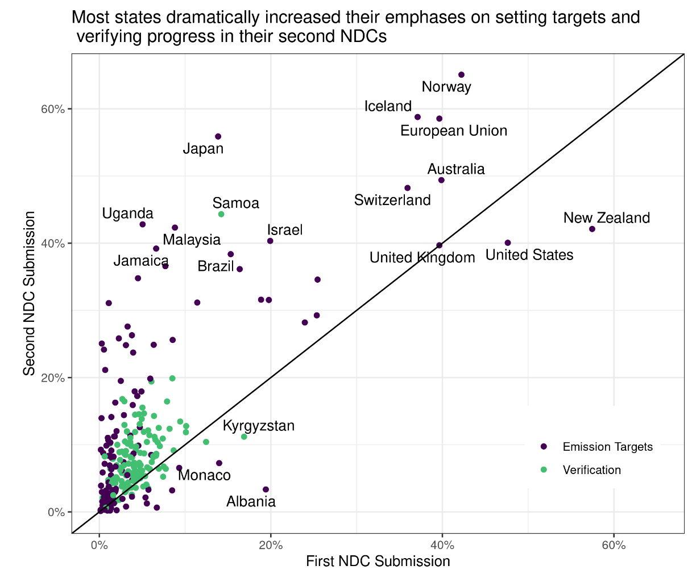
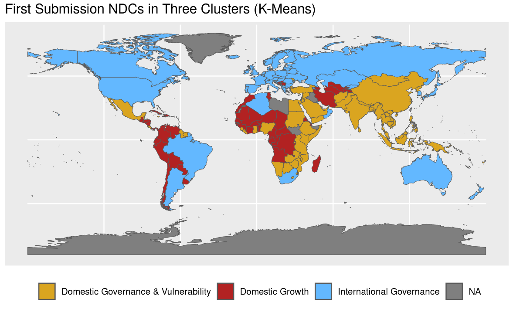
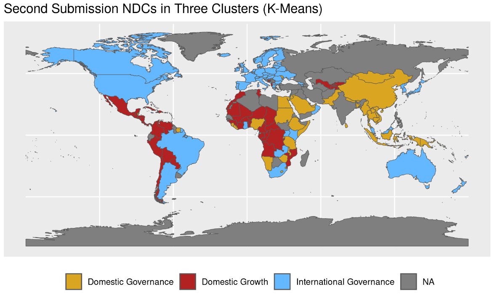
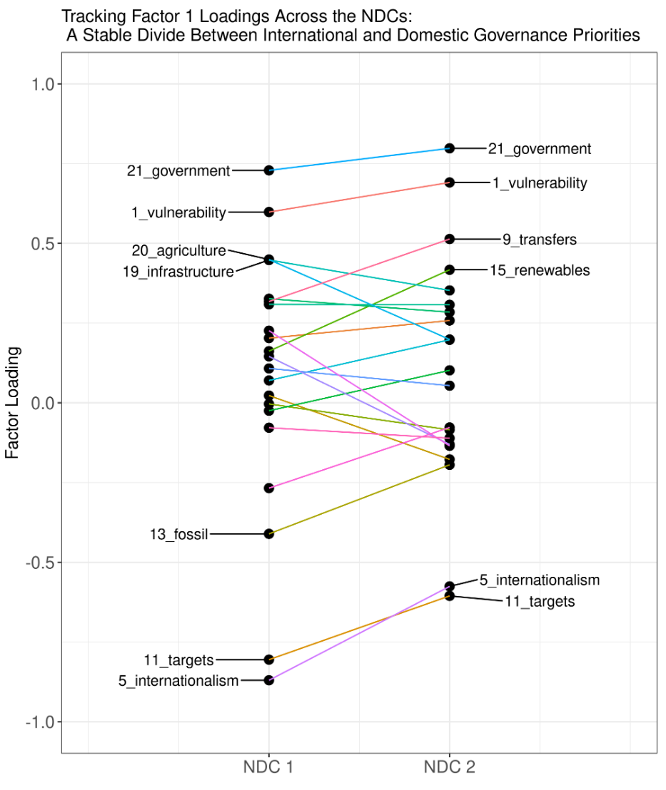
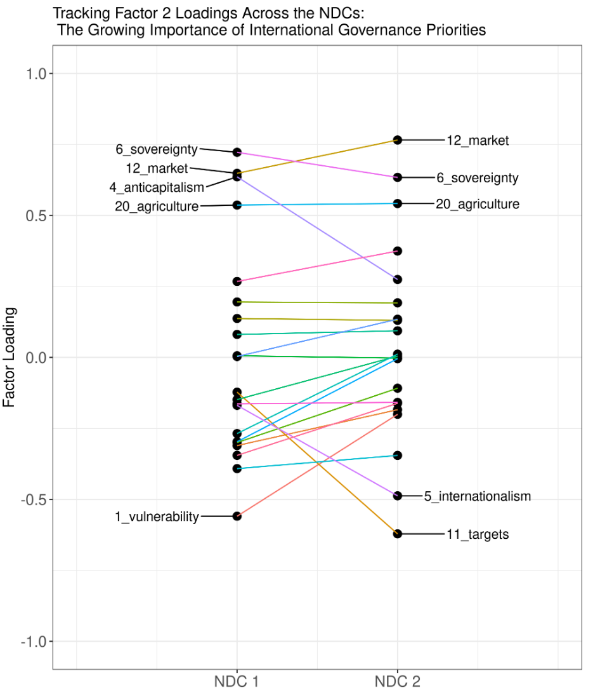

---
output:
  xaringan::moon_reader:
    css: ["default", "extra.css"]
    lib_dir: libs
    seal: false
    nature:
      highlightStyle: github
      highlightLines: true
      countIncrementalSlides: false
      ratio: '16:9'
---

```{r, echo = FALSE, warning = FALSE, message = FALSE}
library(tidyverse)
library(readxl)
#library(stargazer)
#library(kableExtra)
#library(modelr)

knitr::opts_chunk$set(echo = FALSE,
                      eval = TRUE,
                      error = FALSE,
                      message = FALSE,
                      warning = FALSE,
                      comment = NA)
```

background-image: url('libs/Images/background-scales_justice_v3.png')
background-size: 105%
background-position: top
class: middle

.size45[**IV. International Institutions for Aggregate Effort**]

<br>

.size50[**Today's Agenda: Effectiveness Analysis**

- The Paris Agreement: Nationally Determined Contributions (NDC)
]

<br>

.center[.size40[
  Justin Leinaweaver (Fall 2023)
]]

???

### Prep for Class
1. ?

<br>


---

background-image: url('libs/Images/background-blue_cubes_lighter3.png')
background-size: 100%
background-position: center
class: middle, center

.size45[.content-box-white[**Treaty Design Analysis**]]

<br>

.size35[.content-box-white[**Paris Agreement to the UNFCCC**]]

.pull-left[
```{r, echo = FALSE, fig.align = 'center', out.width = '100%'}
knitr::include_graphics("libs/Images/02_2-Legalization_Fig1.png")
```
]

.pull-right[
```{r, echo = FALSE, fig.align = 'center', out.width = '100%'}
knitr::include_graphics("libs/Images/03_2-KLS_Table1.png")
```
]

???

### Key design takeaways?

- Bottom-up vs top-down (Kyoto)


---

background-image: url('libs/Images/background-blue_triangles_flipped.png')
background-size: 100%
background-position: center
class: middle

.size55[**Today: Evaluating the NDCs**]

.size30[
Climate Change Negotiating Groups
- OECD States
- Least Developed Countries
- Small Island Developing States (SIDS)
- The Organization of Petroleum Exporting Countries (OPEC)
- The Umbrella Group

Make a list for each state's commitments:
1. Most substantial commitments?
2. Any attempts to delay or weaken commitments?
3. Big changes from submission 1 to 2?
]

???

- Registry: https://unfccc.int/NDCREG

- Data: CLASS-Country_NDCs_to_Evaluate.xlsx

- Split class into climate negotiating groups (OECD 16, Least Developed 36, Small Island Developing States (SIDS) 28, OPEC 8, Umbrella 9), each student should review the NDCs for two states in their group and make notes on: 1) Most substantial commitments made, 2) any clear attempts to delay or weaken commitments, and 3) big changes between submission 1 and submission 2?

Class warm-up: Example from your cases of...
- Substantial commitments?
- Attempts to delay/weaken pledges?
- Big changes across submissions?
- How different are the commitments made in the NDCs to those in the Kyoto Protocol? Is this a step toward greater or lesser action on global climate change?

How should we consider the common but differentiated responsibilities aspects of the NDCs?

Could we rank states by their balance of commitments vs loopholes?
- Which states are most impressive?
- Which least?

How different are the commitments made in the NDCs to those in the Kyoto Protocol?
- Is this a step toward greater or lesser action on global climate change?


---

background-image: url('libs/Images/background-blue_cubes_lighter3.png')
background-size: 100%
background-position: center
class: center

.size40[**The Climate Watch NDC Enhancement Tracker** https://www.climatewatchdata.org/2020-ndc-tracker]

```{r, echo = FALSE, fig.align = 'center', out.width = '67%'}

```

???

Check web project that exists to track and classify NDCs

### Do you agree with the coding in the the CW database re your NDCs?

<br>

### BIG Q: Based on your reading of the NDCs does this project capture enough of the key variation to replace an exercise in reading the other NDCs yourself? Why or why not? 

### - What does it capture well? 
### - What variation does it omit?


---

background-image: url('libs/Images/background-blue_triangles_flipped.png')
background-size: 100%
background-position: center
class: middle

.size55[**Today: Evaluating the NDCs**]

.size30[
Climate Change Negotiating Groups
- OECD States
- Least Developed Countries
- Small Island Developing States (SIDS)
- The Organization of Petroleum Exporting Countries (OPEC)
- The Umbrella Group

Use the individual NDCs you read to make inferences about the values/positions/framing of your climate negotiation group
]

???

Groups: Compare and contrast cases in your group in order to draw out inferences about the overall positions of this climate negotiating group.
 
- Present and discuss each

- Do we see big differences comparing global north and south?


---

background-image: url('libs/Images/background-blue_cubes_lighter3.png')
background-size: 100%
background-position: center

```{r, echo = FALSE, fig.align = 'center', out.width = '100%'}
knitr::include_graphics("libs/Images/14_2-LeinaweaverThomson2021_1.png")
```

.size45[**Follow-on Work in Progress**

The State of the Climate Negotations After the Second Nationally Determined Contributions (NDCs)
- Leinaweaver, Thomson, Jankin and Bechara
]

???

Preview of some findings from recent research


---

background-image: url('libs/Images/background-blue_cubes_lighter3.png')
background-size: 100%
background-position: center

```{r, echo = FALSE, fig.align = 'center', out.width = '100%'}

```

???

NDCs Included in Analysis map

Sample includes 300 NDCs

167 First Submissions
133 Second Submissions


---

background-image: url('libs/Images/background-blue_cubes_lighter3.png')
background-size: 100%
background-position: center

```{r, echo = FALSE, fig.align = 'center', out.width = '43%'}

```

???


---

background-image: url('libs/Images/background-blue_cubes_lighter3.png')
background-size: 100%
background-position: center

.pull-left[
```{r, echo = FALSE, fig.align = 'center', out.width = '90%'}

```
]

.pull-right[
```{r, fig.retina=3, fig.align='center', fig.asp=1.2, out.width='100%', fig.width=5}
# Visualize topic proportions
d10 <- read_excel("../../Data/Paris_Agreement_and_WDI/Leinaweaver_topics_All-2022-08-29.xlsx")

# Mean NDC 1 Scores
d10a <- d10 |>
  filter(ndc == 1) |>
  select(-ndc, -Other_1, -Other_2) |>
  pivot_longer(cols = topic_1_vulnerability:topic_21_government, names_to = "Topics", values_to = "Proportion") |>
  group_by(Topics) |>
  summarize(
    Mean = mean(Proportion)
  ) |>
  arrange(desc(Mean)) 

d10a |>
  mutate(
    Topics = str_remove(Topics, pattern = "topic_[0-9][0-9]*_")
  ) |>
  ggplot(aes(x = Mean, y = reorder(Topics, Mean))) +
  geom_point() +
  theme_bw() +
  scale_x_continuous(labels = scales::percent_format(accuracy = 1)) +
  labs(x = "Mean Topic Proportions (NDC 1)", y = "")
```
]

???


---

background-image: url('libs/Images/background-blue_cubes_lighter3.png')
background-size: 100%
background-position: center

```{r, echo = FALSE, fig.align = 'center', out.width = '92%'}

```

???

Topic means changes

TAKEAWAYS: In the shift to NDC Submission 2 it appears many states have increased their levels of focus on verification, target setting and civic topics while reducing their emphases on most others.


---

background-image: url('libs/Images/background-blue_cubes_lighter3.png')
background-size: 100%
background-position: center

```{r, echo = FALSE, fig.align = 'center', out.width = '70%'}

```

???

Targets and verification scatter plot

Of the 133 states that have submitted two NDCs:

115 have increased their emphases on the verification topic (86%).

107 have increased their emphases on the emissions target topic (80%).

Note that this includes the UK whose first submission was made as part of the joint EU submission.


---

background-image: url('libs/Images/background-blue_cubes_lighter3.png')
background-size: 100%
background-position: center

```{r, echo = FALSE, fig.align = 'center', out.width = '95%'}

```

???

FA States map after k means clustering NDC 1

The move from NDC 1 (Figure 12) to NDC 2 (Figure 13) shows what appears to be a tightening in the clusters of countries involved in the negotiations.

K-means clustering can be used to quantify this visual pattern across the state groupings. Using the FA scores for each state as the input and setting the k-means clustering algorithm to estimate three clusters shows a dramatic tightening of the clusters when moving from the first to the second NDC submissions. Specifically, the three clusters are more evenly distributed and the with-cluster sum of squares is reduced.

The K-Means clusters estimated using only the first submission NDCs place countries in three groups:

States focused primarily on domestic growth policies (Factor 1 = .2, Factor 2 = 1.2)
States that load somewhat equally on the need for domestic governance policies and a concern for their environmental vulnerability (Factor 1 = .5, Factor 2 = -.6)
States focused primarily on international governance policies (Factor 1 = -1.6, Factor 2 = -.1)


---

background-image: url('libs/Images/background-blue_cubes_lighter3.png')
background-size: 100%
background-position: center

```{r, echo = FALSE, fig.align = 'center', out.width = '95%'}

```

???

FA States map after k means clustering NDC 1

The K-Means clusters estimated using only the second submission NDCs place countries in three much tighter, better defined groups:

The cluster focused on domestic growth policies has seen an increase in their load on international governance issues (Factor 1 = -.3, Factor 2 = 1.1)
The cluster previously split by domestic governance and vulnerability now loads more heavily on domestic governance and replaces vulnerability with a small load on international governance (Factor 1 = .9, Factor 2 = -.3)
The cluster focused on international governance policies remains so focused across both factors (Factor 1 = -.9, Factor 2 = -.9)


---

background-image: url('libs/Images/background-blue_cubes_lighter3.png')
background-size: 100%
background-position: center

```{r, echo = FALSE, fig.align = 'center', out.width = '47%'}

```

```{r, echo = FALSE, fig.align = 'center', out.width = '47%'}

```


---

background-image: url('libs/Images/14_2-2022_NDC_Synthesis_Report_Figure 1.png')
background-size: 75%
background-position: center
class: slideblue

???

The [UN's 2022 NDC Synthesis Report](https://unfccc.int/ndc-synthesis-report-2022)


---

background-image: url('libs/Images/14_2-2022_NDC_Synthesis_Report_Figure 3.png')
background-size: 85%
background-position: center
class: slideblue

???

The [UN's 2022 NDC Synthesis Report](https://unfccc.int/ndc-synthesis-report-2022)


---

background-image: url('libs/Images/14_2-2022_NDC_Synthesis_Report_Figure 4.png')
background-size: 85%
background-position: center
class: slideblue

???

The [UN's 2022 NDC Synthesis Report](https://unfccc.int/ndc-synthesis-report-2022)


---

background-image: url('libs/Images/background-blue_cubes_lighter3.png')
background-size: 100%
background-position: center

???

What does 2 degrees of warming mean?


---

background-image: url('libs/Images/background-blue_triangles_flipped.png')
background-size: 100%
background-position: center
class: middle

.size70[**Next Class**]

.size40[
TBD
]

???


---

OLD slides


---

background-image: url('libs/Images/background-blue_cubes_lighter3.png')
background-size: 100%
background-position: center

.pull-left[
```{r, echo = FALSE, fig.align = 'center', out.width = '100%'}

```
]

.pull-right[
```{r, echo = FALSE, fig.align = 'center', out.width = '100%'}

```
]

???

Thematic Factors line plots side by side

In this section the factor analyses are performed separately on the first and second NDC submissions. This allows us to visualize the topic loadings within each set of submissions.

Figure 9 focuses on Factor 1 across the two NDC submissions. Factor 1 explains 16% of the cumulative variation in the first NDC submissions and 14% in the second. This dimension is fairly stable across the two submissions in terms of the topics that load most heavily on it. We define this factor as a divide between those states focusing on developing international governance (with a key aim of centralizing emissions targets) and those focusing on developing domestic governance (in response to vulnerability concerns).

Figure 10 focuses on Factor 2 across the two NDC submissions. Factor 2 explains 13% of the cumulative variation in the first NDC submissions and 12% in the second. This is the dimension apparently most impacted by the dramatic rise in the proportion of state NDCs focusing on setting mitigation targets and creating the international governance structures needed to further cooperation on climate change. In NDC Submission 1 the factor analysis reveals a dimension divided between states that provided different reasons to contextualize their (possibly too low) emission mitigation targets (e.g. environmental vulnerability vs concerns over sovereignty or a need to grow economically). In NDC Submission 2 the factor analysis reveals a dimension rooted in the same starting place as in Factor 1 (mitigation targets and international governance), but the opposite end is now dominated by domestic concerns over market mechanisms, a defense of sovereignty and to a slightly lesser extent agricultural issues. The emphasis in environmental vulnerability has appeared to diminish significantly in these second round NDC submissions.


